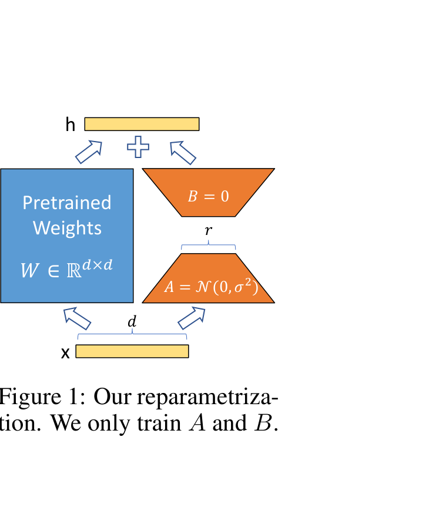
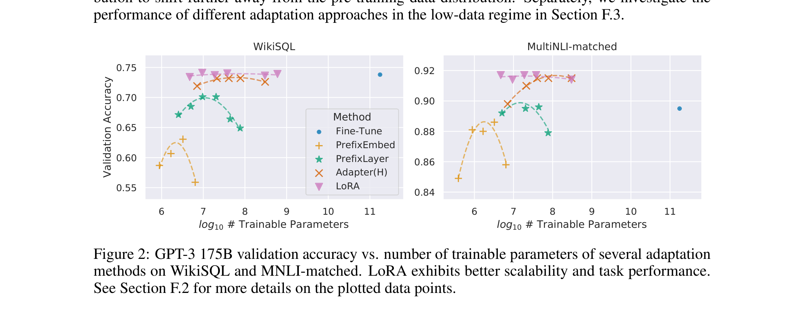

# LoRA：大语言模型的低秩适配

> **原文**: LoRA: Low-Rank Adaptation of Large Language Models
> **作者**: Edward Hu, Yelong Shen, Phillip Wallis, Zeyuan Allen-Zhu, Yuanzhi Li, Shean Wang, Lu Wang, Weizhu Chen (Microsoft)
> **发表时间**: 2021
> **arXiv**: https://arxiv.org/abs/2106.09685

---

## 一句话总结

GPT-3 有 1750 亿参数，全部微调既贵又不现实。LoRA 的办法是：冻结原模型，只往里面"插"两个很小的矩阵来学习新任务——参数量直降 10000 倍，效果却不输全量微调。

## 研究背景：为什么要做这个？

想象你有一本百科全书（预训练大模型），现在你想让它专门回答医疗问题。最直接的办法是把整本书重新抄一遍并修改（全量微调, Fine-Tuning）——但如果这本书有 1750 亿个字（GPT-3 的参数量），每换一个领域就抄一遍，存储和计算成本都扛不住。

当时业界已有两类"轻量化"方案，但各有硬伤：

### 现有方案的问题

```
┌─────────────────────────┬─────────────────────────┬─────────────────────────┐
│   (a) Adapter Tuning     │  (b) Prefix Tuning       │  (c) LoRA (本文)         │
│                         │                         │                         │
│   在每层 Transformer     │  在输入前拼接可学习的     │  在权重矩阵旁并联两个    │
│   中间插入小型 MLP*      │  "提示向量"              │  低秩矩阵 A 和 B         │
│                         │                         │                         │
│  ✗ 增加模型深度          │  ✗ 占用输入序列长度       │  ✓ 部署时可合并，零延迟   │
│  ✗ 推理时有额外延迟      │  ✗ 优化困难，性能不稳定   │  ✓ 参数极少，效果持平     │
│    (batch=1 时高达+30%)  │  ✗ 性能随参数量非单调变化  │  ✓ 可快速切换任务         │
└─────────────────────────┴─────────────────────────┴─────────────────────────┘
```

> *\*MLP（Multi-Layer Perceptron，多层感知机）：最基础的神经网络结构——多层线性变换 + 激活函数。Adapter 中的"小型 MLP"是一个瓶颈结构：先用矩阵把维度从 $d$ 压缩到很小的 $m$，过一个 ReLU，再用另一个矩阵还原回 $d$，形如 $\text{Adapter}(x) = x + f(xW_{down})W_{up}$。*

论文中 Table 1 的实测数据直观地展示了 Adapter 的延迟问题：在 GPT-2 Medium 上，当 batch size=1、序列长度=128 时，Adapter$^H$ 的推理延迟比 Fine-Tune 高 **30.3%**。

## 核心思路：这篇论文的"大招"是什么？

LoRA 的核心 insight 来自一个观察：**预训练模型在适配新任务时，权重的变化量 $\Delta W$ 实际上是低秩的**——也就是说，看似 $d \times d$ 那么大的变化矩阵，其中真正有用的信息只需要很少几个方向就能表达。

既然如此，与其让 $\Delta W$ 自由地在 $d \times d$ 的空间里搜索，不如直接把它写成两个小矩阵的乘积：

$$\Delta W = BA, \quad B \in \mathbb{R}^{d \times r}, \; A \in \mathbb{R}^{r \times d}, \quad r \ll d$$

这就像是：与其搬运一整面墙的砖（$d \times d$ 个参数），你只需要搬几根钢筋（$r$ 个方向），就能把墙撑起来。

下面是论文的 Figure 1，展示了 LoRA 的重参数化方案：



左边蓝色方块是冻结的预训练权重 $W$，右边两个橙色三角是可训练的低秩矩阵 $A$ 和 $B$。输入 $x$ 同时经过两条路径，输出相加得到 $h$。

## 具体怎么做的？

### 低秩分解的数学原理

对于预训练权重矩阵 $W_0 \in \mathbb{R}^{d \times k}$，LoRA 将其更新约束为低秩分解：

$$W_0 + \Delta W = W_0 + BA$$

前向传播从原来的 $h = W_0 x$ 变成：

$$h = W_0 x + \Delta W x = W_0 x + BA x$$

关键设计细节：

- **初始化**：$A$ 用高斯随机初始化，$B$ 初始化为零矩阵。这样训练开始时 $\Delta W = BA = 0$，模型行为与预训练模型完全一致。
- **缩放因子**：实际输出会乘以 $\frac{\alpha}{r}$（$\alpha$ 是常数），这让调整秩 $r$ 时不需要重新调学习率。
- **应用位置**：论文只对 Transformer 自注意力层的 $W_q$（查询）和 $W_v$（值）矩阵注入 LoRA，MLP 层保持冻结。

### 在 Transformer 中的位置

```
┌──────────────────────────────────────────────┐
│            Transformer Block                  │
│                                              │
│  ┌────────────────────────────────────────┐  │
│  │         Self-Attention Layer            │  │
│  │                                        │  │
│  │   W_q ← ✅ + LoRA(A_q, B_q)           │  │
│  │   W_k ← ❄️ 冻结                       │  │
│  │   W_v ← ✅ + LoRA(A_v, B_v)           │  │
│  │   W_o ← ❄️ 冻结                       │  │
│  └────────────────────────────────────────┘  │
│                    ↓                          │
│  ┌────────────────────────────────────────┐  │
│  │  MLP Layer (FFN) ❄️ 全部冻结           │  │
│  │  即 Transformer 的前馈网络：            │  │
│  │  FFN(x) = max(0, xW₁+b₁)W₂+b₂       │  │
│  └────────────────────────────────────────┘  │
│                                              │
│  ✅ = 注入 LoRA    ❄️ = 冻结不训练           │
└──────────────────────────────────────────────┘
```

以 GPT-3 175B 为例，$d_{model} = 12288$。若 $r = 4$，每个 LoRA 模块的参数量为：

$$2 \times d_{model} \times r = 2 \times 12288 \times 4 = 98304 \approx 0.1\text{M}$$

整个模型 96 层，每层 2 个 LoRA（$W_q, W_v$），总可训练参数约 **18.8M**——相比原模型 175B 参数，仅占 **0.01%**。

### 用一个具体例子走通全流程

#### 场景设定

假设我们有一个简化的 Transformer 层，权重矩阵维度 $d = 4$，选择秩 $r = 2$：

- **预训练权重** $W_0 \in \mathbb{R}^{4 \times 4}$：❄️ 冻结，不更新
- **LoRA 矩阵** $B \in \mathbb{R}^{4 \times 2}$：✅ 可训练，初始化为全零
- **LoRA 矩阵** $A \in \mathbb{R}^{2 \times 4}$：✅ 可训练，高斯随机初始化

$$W_0 = \begin{bmatrix} 0.1 & 0.2 & 0.3 & 0.4 \\ 0.5 & 0.6 & 0.7 & 0.8 \\ 0.2 & 0.3 & 0.1 & 0.5 \\ 0.4 & 0.1 & 0.6 & 0.2 \end{bmatrix}, \quad B = \begin{bmatrix} 0 & 0 \\ 0 & 0 \\ 0 & 0 \\ 0 & 0 \end{bmatrix}, \quad A = \begin{bmatrix} 0.1 & -0.2 & 0.3 & 0.0 \\ 0.2 & 0.1 & -0.1 & 0.4 \end{bmatrix}$$

缩放因子 $\frac{\alpha}{r} = \frac{2}{2} = 1$（简化）。

#### Step 1: 前向传播

输入向量 $x = \begin{bmatrix} 1 \\ 0 \\ -1 \\ 2 \end{bmatrix}$

**路径 1 — 预训练权重**（冻结）：

$$W_0 x = \begin{bmatrix} 0.1 \times 1 + 0.2 \times 0 + 0.3 \times (-1) + 0.4 \times 2 \\ 0.5 \times 1 + 0.6 \times 0 + 0.7 \times (-1) + 0.8 \times 2 \\ 0.2 \times 1 + 0.3 \times 0 + 0.1 \times (-1) + 0.5 \times 2 \\ 0.4 \times 1 + 0.1 \times 0 + 0.6 \times (-1) + 0.2 \times 2 \end{bmatrix} = \begin{bmatrix} 0.6 \\ 1.4 \\ 1.1 \\ 0.2 \end{bmatrix}$$

**路径 2 — LoRA 旁路**：

$$Ax = \begin{bmatrix} 0.1 \times 1 + (-0.2) \times 0 + 0.3 \times (-1) + 0.0 \times 2 \\ 0.2 \times 1 + 0.1 \times 0 + (-0.1) \times (-1) + 0.4 \times 2 \end{bmatrix} = \begin{bmatrix} -0.2 \\ 1.1 \end{bmatrix}$$

维度从 $4 \to 2$（降维）。然后：

$$BAx = \begin{bmatrix} 0 & 0 \\ 0 & 0 \\ 0 & 0 \\ 0 & 0 \end{bmatrix} \begin{bmatrix} -0.2 \\ 1.1 \end{bmatrix} = \begin{bmatrix} 0 \\ 0 \\ 0 \\ 0 \end{bmatrix}$$

维度从 $2 \to 4$（升维）。因为 $B$ 初始化为零，所以训练开始时 **LoRA 不改变原模型输出**。

**最终输出**：

$$h = W_0 x + BAx = \begin{bmatrix} 0.6 \\ 1.4 \\ 1.1 \\ 0.2 \end{bmatrix} + \begin{bmatrix} 0 \\ 0 \\ 0 \\ 0 \end{bmatrix} = \begin{bmatrix} 0.6 \\ 1.4 \\ 1.1 \\ 0.2 \end{bmatrix}$$

```
                    ┌─────────────────────┐
 x (4×1)  ─────────┤  W₀ (4×4, 冻结 ❄️)  ├───── W₀x (4×1) ──┐
    │               └─────────────────────┘                    │
    │                                                          ＋ ──→ h (4×1)
    │   ┌────────────────┐   ┌────────────────┐               │
    └──►│ A (2×4, 可训练) ├──►│ B (4×2, 可训练) ├── BAx (4×1) ─┘
        └────────────────┘   └────────────────┘
         (4→2 降维)           (2→4 升维)
```

#### Step 2: 损失计算

假设目标输出 $y = \begin{bmatrix} 0.5 \\ 1.0 \\ 1.5 \\ 0.0 \end{bmatrix}$，使用均方误差损失：

$$\mathcal{L} = \frac{1}{2}\|h - y\|^2 = \frac{1}{2}\left[(0.6-0.5)^2 + (1.4-1.0)^2 + (1.1-1.5)^2 + (0.2-0.0)^2\right]$$

$$= \frac{1}{2}(0.01 + 0.16 + 0.16 + 0.04) = 0.185$$

这里的关键区别在于：

| | 全量微调 | LoRA |
|---|---|---|
| 优化目标 | $\max_\Phi \sum \log P_\Phi(y_t \mid x, y_{<t})$ | $\max_\Theta \sum \log P_{\Phi_0 + \Delta\Phi(\Theta)}(y_t \mid x, y_{<t})$ |
| 可训练参数 | 全部 $\Phi$（175B） | 仅 $\Theta = \{A, B\}$（18.8M） |
| 优化器状态 | 需为所有参数维护 Adam 状态 | 仅为 A, B 维护，VRAM 从 1.2TB 降至 350GB |

#### Step 3: 反向传播

损失对输出的梯度：

$$\frac{\partial \mathcal{L}}{\partial h} = h - y = \begin{bmatrix} 0.1 \\ 0.4 \\ -0.4 \\ 0.2 \end{bmatrix}$$

**梯度流向**：

```
  ∂L/∂h
    │
    ├──→ ∂L/∂W₀ = (∂L/∂h) · xᵀ    ──→ ✗ 不更新！W₀ 被冻结
    │
    ├──→ ∂L/∂B = (∂L/∂h) · (Ax)ᵀ   ──→ ✓ 更新 B
    │
    └──→ ∂L/∂A = Bᵀ(∂L/∂h) · xᵀ   ──→ ✓ 更新 A
```

**计算 $B$ 的梯度**（用损失梯度乘 $Ax$ 转置）：

$$\frac{\partial \mathcal{L}}{\partial B} = \frac{\partial \mathcal{L}}{\partial h} \cdot (Ax)^T = \begin{bmatrix} 0.1 \\ 0.4 \\ -0.4 \\ 0.2 \end{bmatrix} \begin{bmatrix} -0.2 & 1.1 \end{bmatrix} = \begin{bmatrix} -0.02 & 0.11 \\ -0.08 & 0.44 \\ 0.08 & -0.44 \\ -0.04 & 0.22 \end{bmatrix}$$

**计算 $A$ 的梯度**：

$$\frac{\partial \mathcal{L}}{\partial A} = B^T \frac{\partial \mathcal{L}}{\partial h} \cdot x^T$$

由于当前 $B = \mathbf{0}$，所以 $\frac{\partial \mathcal{L}}{\partial A} = \mathbf{0}$。这意味着**训练第一步只有 $B$ 被更新，$A$ 暂时不动**——这正是"$B$ 初始化为零"这个设计的有趣副作用。

#### Step 3.5: 参数更新与下一轮迭代

这一步展示梯度如何变成参数的实际更新，以及更新后的参数如何参与下一轮计算。

**用 SGD 更新参数**（假设学习率 $\eta = 0.1$）：

$$B_{\text{new}} = B - \eta \cdot \frac{\partial \mathcal{L}}{\partial B} = \begin{bmatrix} 0 & 0 \\ 0 & 0 \\ 0 & 0 \\ 0 & 0 \end{bmatrix} - 0.1 \times \begin{bmatrix} -0.02 & 0.11 \\ -0.08 & 0.44 \\ 0.08 & -0.44 \\ -0.04 & 0.22 \end{bmatrix} = \begin{bmatrix} 0.002 & -0.011 \\ 0.008 & -0.044 \\ -0.008 & 0.044 \\ 0.004 & -0.022 \end{bmatrix}$$

$$A_{\text{new}} = A - \eta \cdot \mathbf{0} = A \quad \text{（不变）}$$

> 更新规则很简单：**新参数 = 旧参数 - 学习率 × 梯度**。梯度指向损失增大最快的方向，减去它就是在让损失变小。学习率控制每一步走多远——太大会"跳过头"，太小会"走太慢"。实际训练中使用 Adam 优化器（会自适应调整每个参数的学习率），但核心逻辑相同。

**用更新后的参数做第二轮前向传播**（同一个输入 $x$）：

$$A_{\text{new}} x = \begin{bmatrix} -0.2 \\ 1.1 \end{bmatrix} \quad \text{（$A$ 没变，结果一样）}$$

$$B_{\text{new}} (Ax) = \begin{bmatrix} 0.002 & -0.011 \\ 0.008 & -0.044 \\ -0.008 & 0.044 \\ 0.004 & -0.022 \end{bmatrix} \begin{bmatrix} -0.2 \\ 1.1 \end{bmatrix} = \begin{bmatrix} -0.0125 \\ -0.0500 \\ 0.0500 \\ -0.0250 \end{bmatrix}$$

**注意：$B$ 不再是零了！** LoRA 旁路开始产生有意义的输出。

$$h_{\text{new}} = W_0 x + B_{\text{new}} A_{\text{new}} x = \begin{bmatrix} 0.6 \\ 1.4 \\ 1.1 \\ 0.2 \end{bmatrix} + \begin{bmatrix} -0.0125 \\ -0.0500 \\ 0.0500 \\ -0.0250 \end{bmatrix} = \begin{bmatrix} 0.5875 \\ 1.3500 \\ 1.1500 \\ 0.1750 \end{bmatrix}$$

**验证：输出在朝目标方向移动吗？**

| 分量 | 第 1 轮输出 | 第 2 轮输出 | 目标值 | 趋势 |
|------|-----------|-----------|-------|------|
| $h_1$ | 0.600 | 0.5875 | 0.5 | ✓ 更近了 |
| $h_2$ | 1.400 | 1.3500 | 1.0 | ✓ 更近了 |
| $h_3$ | 1.100 | 1.1500 | 1.5 | ✓ 更近了 |
| $h_4$ | 0.200 | 0.1750 | 0.0 | ✓ 更近了 |

**损失也确实下降了**：

$$\mathcal{L}_{\text{new}} = \frac{1}{2}\left[(0.5875-0.5)^2 + (1.35-1.0)^2 + (1.15-1.5)^2 + (0.175-0.0)^2\right] = \frac{1}{2}(0.0077 + 0.1225 + 0.1225 + 0.0306) = 0.1417$$

对比第一轮的 $\mathcal{L} = 0.185$，损失从 **0.185 降到了 0.1417**，下降了约 23%。

**关键转折：第二轮 $A$ 也开始收到梯度了！** 因为 $B$ 不再为零，$\frac{\partial \mathcal{L}}{\partial A} = B^T \frac{\partial \mathcal{L}}{\partial h} \cdot x^T$ 不再是零矩阵。从第二轮开始，$A$ 和 $B$ 都会被同时更新，模型学习全面启动。

```
┌─────────────────────────────────────────────────────────────────┐
│                    训练迭代全景图                                 │
│                                                                  │
│  第 1 轮：B=0, A=随机                                           │
│  ├─ 前向: h = W₀x + 0·Ax = W₀x          (LoRA 无贡献)          │
│  ├─ 损失: L = 0.185                                             │
│  ├─ 梯度: ∂L/∂B ≠ 0, ∂L/∂A = 0          (B有梯度, A无梯度)     │
│  └─ 更新: B → B_new ≠ 0, A 不变                                │
│                        ↓                                         │
│  第 2 轮：B≠0, A=同上                                           │
│  ├─ 前向: h = W₀x + B_new·Ax ≠ W₀x      (LoRA 开始有贡献！)    │
│  ├─ 损失: L = 0.1417  (↓23%)                                    │
│  ├─ 梯度: ∂L/∂B ≠ 0, ∂L/∂A ≠ 0          (A 也有梯度了！)       │
│  └─ 更新: B 继续更新, A 也开始更新                               │
│                        ↓                                         │
│  第 3, 4, 5... 轮：A 和 B 协同优化，损失持续下降                  │
│  直到收敛（损失不再明显减小）                                      │
└─────────────────────────────────────────────────────────────────┘
```

#### Step 4: 部署/推理

LoRA 最妙的地方在于：**部署时可以把 $BA$ 直接合并到 $W_0$ 中**，完全不增加推理成本。

$$W_{deployed} = W_0 + BA$$

```
  ┌─────────── 训练时 ─────────────┐     ┌──────── 部署时 ──────────┐
  │                                │     │                          │
  │  x ──→ W₀x + BAx ──→ h        │ ──→ │  x ──→ (W₀+BA)x ──→ h   │
  │        ↑       ↑               │     │        ↑                 │
  │      冻结    可训练             │     │    单个矩阵，零额外延迟   │
  └────────────────────────────────┘     └──────────────────────────┘
```

切换任务时：减去当前 $BA$，加上新任务的 $B'A'$，只需交换几十 MB 的 LoRA 权重。

> **小白tips**: LoRA 就像给一个不能改的老师（冻结权重 $W_0$）配了一个很小的"便签本"（$A$ 和 $B$）。上课时老师照常讲（$W_0 x$），便签本补充新内容（$BAx$）。考试时（部署），把便签本的内容抄进课本里（$W_0 + BA$），上课就不用再翻便签了——效果一样，速度不变。

## 效果怎么样？

### 各方法对比总览

论文在 RoBERTa、DeBERTa、GPT-2、GPT-3 四个模型上进行了实验。下面是最关键的 GPT-3 175B 结果：

| 方法 | 可训练参数 | WikiSQL (Acc.) | MNLI-m (Acc.) | SAMSum (R1/R2/RL) |
|------|-----------|---------------|---------------|-------------------|
| Fine-Tune | 175,255.8M | **73.8** | 89.5 | 52.0/28.0/44.5 |
| BitFit | 14.2M | 71.3 | 91.0 | 51.3/27.4/41.5 |
| Prefix-Embed | 0.8M | 63.1 | 88.6 | 43.4/20.2/40.1 |
| Prefix-Layer | 20.2M | 70.1 | 89.5 | 80.7/34.4 |
| Adapter$^H$ | 7.1M | 73.2 | 91.5 | 53.0/28.9/44.5 |
| **LoRA** | **0.8M** | 73.4 | **91.7** | **53.8/29.8/45.0** |
| **LoRA** | **37.7M** | 73.4 | **91.6** | 53.4/29.2/44.5 |

LoRA 仅用 **0.8M** 可训练参数（GPT-3 的 0.0005%），在多数任务上就达到甚至超过全量微调的效果。

下面是论文的 Figure 2，更直观地展示了各方法在"参数量-性能"维度上的对比：



可以清楚地看到：LoRA（紫色三角）在同等参数量下始终位于最高位置，而且随着参数增加性能稳步提升，不像 Prefix 方法那样出现下降。

### 秩 $r$ 的影响

一个令人惊讶的发现是：**极低的秩就够了**。

| $W_q$ 的秩 | $W_v$ 的秩 | WikiSQL | MultiNLI |
|-----------|-----------|---------|----------|
| 1 | 1 | 68.8 | 91.0 |
| 2 | 2 | 69.2 | 91.2 |
| 4 | 4 | 70.4 | 91.3 |
| 8 | 8 | 70.4 | 91.4 |
| 64 | 64 | 69.4 | 91.0 |

$r = 4$ 时性能就已经饱和，再增大反而没有提升。这从实验角度证实了论文的核心假设——**权重更新矩阵 $\Delta W$ 确实具有极低的内在秩**。

### 应用到哪些权重矩阵效果最好？

| 适配位置 | $r$ | WikiSQL | MultiNLI |
|---------|-----|---------|----------|
| $W_q$ | 8 | 68.3 | 90.7 |
| $W_v$ | 8 | 69.7 | 90.7 |
| $W_q, W_v$ | 4 | **70.4** | **91.3** |
| $W_q, W_k, W_v, W_o$ | 2 | 70.0 | 91.2 |

同时适配 $W_q$ 和 $W_v$ 效果最好。即使总参数量相同，分散到多个矩阵（每个用更低的秩）比集中到一个矩阵（用更高的秩）更有效。这说明 $\Delta W$ 的有用信息分布在多个权重矩阵中，但每个矩阵内部的秩确实很低。

## 论文的意义和局限

**主要贡献**：

1. 提出了一种极简且高效的参数高效微调方法，可训练参数降低 10000 倍，VRAM 降低 3 倍，且部署时零额外推理延迟。
2. 从"低秩"视角给出了模型适配的理论动机，并用实验证实权重更新矩阵确实具有极低内在秩。
3. 方法与 Adapter、Prefix Tuning 等正交，可组合使用，且适用于任何包含稠密矩阵乘法的网络架构。

**局限性**：

- 如果要在一次前向传播中处理多个不同任务的输入（不同的 $A, B$），batch 处理不太直接。
- 论文仅实验了 Transformer 的注意力层，MLP 层和 LayerNorm 层的效果留给后续研究。
- 虽然 LoRA 参数少，但训练时仍需加载完整预训练模型到 GPU（350GB for GPT-3），对硬件仍有一定门槛。

## 读后感

LoRA 的价值在于它用一个极简的数学洞察（低秩假设）解决了一个工程上的重大痛点（大模型微调太贵）。它不需要改模型架构、不需要特殊的训练流程、部署时零开销——这种"简单到让人觉得理所当然"的设计，往往是最具影响力的。

事实上，LoRA 已经成为大模型微调的事实标准。后续的 QLoRA、LoRA+、DoRA 等工作都在此基础上进一步发展。如果你刚入门大模型，理解 LoRA 就是理解了"如何低成本地让通用大模型为你所用"这件事的核心。
