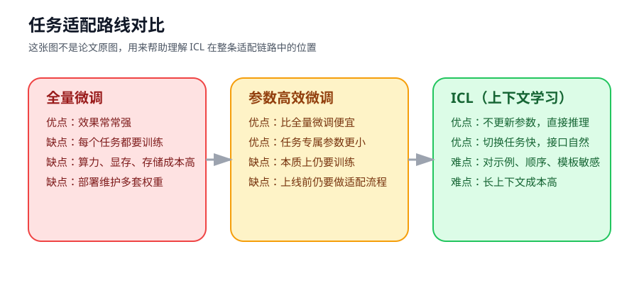
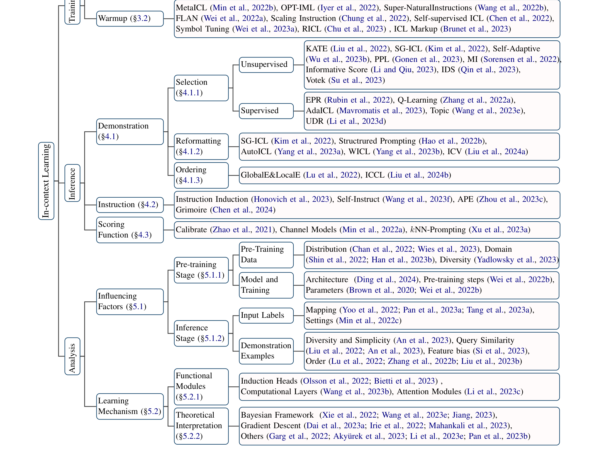
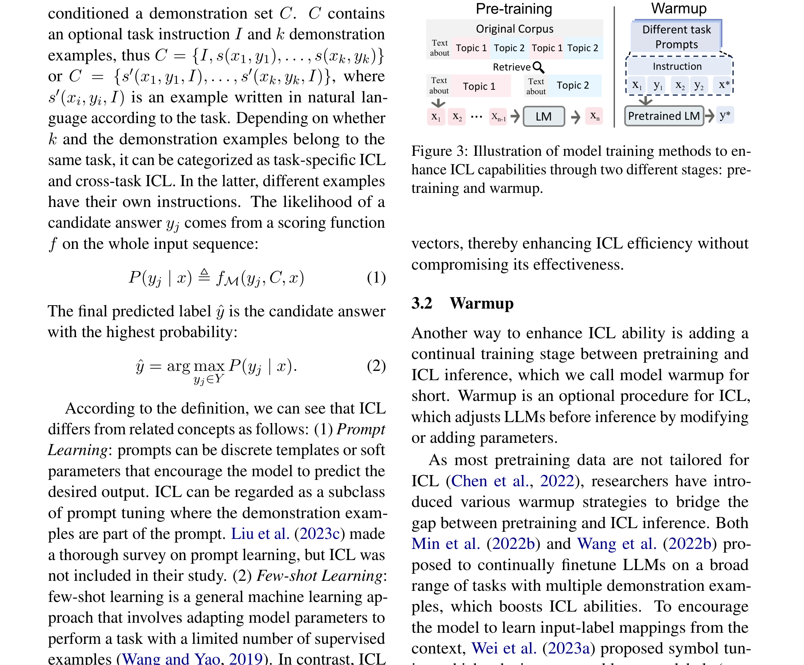
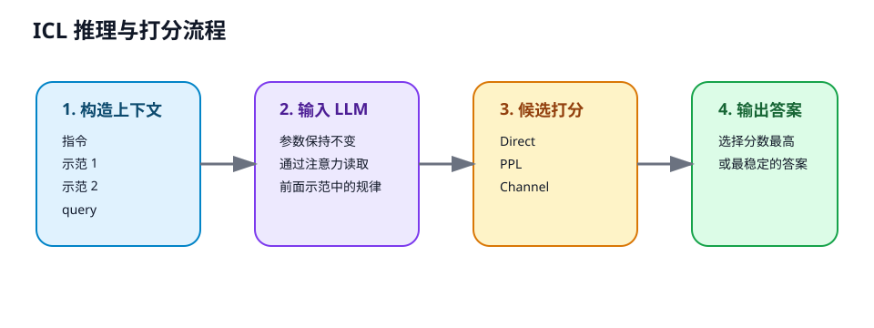
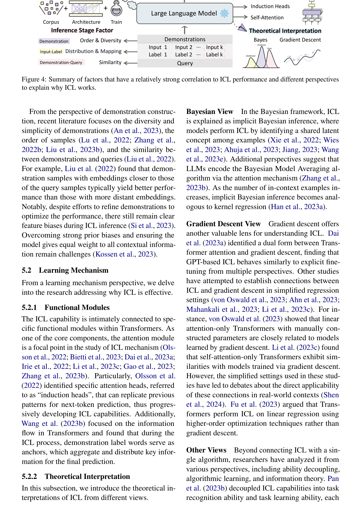
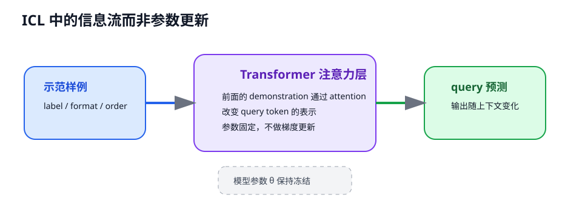
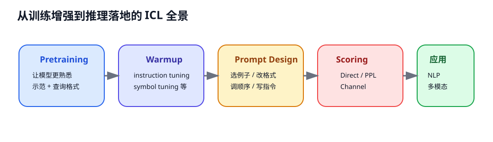

# 上下文学习综述：大模型如何靠“看例子”学会做事

> **原文**: A Survey on In-context Learning
> **作者**: Qingxiu Dong, Lei Li, Damai Dai, Ce Zheng, Jingyuan Ma, Rui Li, Heming Xia, Jingjing Xu, Zhiyong Wu, Tianyu Liu, Baobao Chang, Xu Sun, Lei Li, Zhifang Sui
> **发表时间**: 2022 年首版，2024 年 EMNLP 发表版本
> **arXiv**: [https://arxiv.org/abs/2301.00234](https://arxiv.org/abs/2301.00234)

---

## 一句话总结

这篇论文不是提出一个新的 ICL 方法，而是系统梳理了一个更重要的问题：**为什么大语言模型只看几个例子和一段指令，就能在不更新参数的情况下临时学会一个新任务**。

## 研究背景：为什么要做这个？

以前做 NLP（自然语言处理）任务，主流套路是“先预训练，再微调”。就像你请一个老师来教新课，通常要重新备课、改讲义、做针对性训练，也就是更新模型参数。

但大模型时代出现了一个很反常识的现象：你不改模型参数，只要在输入里塞进几条“题目 + 答案”的示范，再加一句任务说明，模型就能直接开始做分类、翻译、问答、推理。这就是 **ICL（In-context Learning，上下文学习）**。

它像什么？像你把一个聪明但懒得重新培训的助理叫来，只给他看两三份“样例表格”和一句“照这个格式做”，他就开始干活了。没有培训流程，没有权重更新，只有“看懂上下文然后模仿”。

这件事之所以重要，是因为它改变了大家对“学习”的理解：

1. **模型不一定非得改参数才能适配任务**。
2. **提示词、示例、顺序、打分方式都成了新的工程抓手**。
3. **ICL 已经从 NLP 扩展到视觉、多模态、知识更新等场景**。

所以这篇 survey 的价值，不在于给出一个单点 trick，而在于帮你建立一张地图：ICL 领域到底在研究什么、哪些因素真的重要、还有哪些坑没填。

### 现有方案的问题

如果把主流任务适配方法放在一起看，会发现三条路线各有代价：

- **全量微调**：效果常常不错，但每个任务都要训练一遍，成本高。
- **参数高效微调**：比全量微调轻，但本质上还是要更新参数。
- **ICL**：推理时直接适配，门槛最低，但对 prompt、示例、顺序、模板非常敏感，稳定性也没那么理想。

这篇论文要回答的，正是 ICL 这条路线的全局问题：它怎么做、为什么有效、怎么增强、怎么落地。

## 核心思路：这篇论文的“大招”是什么？

这篇 survey 的核心贡献，可以概括成三件事。

第一，它给 ICL 建立了一个相对完整的知识框架。论文把 ICL 相关研究分成几大块：**训练增强、prompt 设计、打分函数、机理分析、应用场景**。这让原本分散的工作终于能放进同一张图里讨论。

第二，它强调了一个很关键但常被忽视的事实：**ICL 不是“随便给几个例子”这么简单**。模型在 ICL 中的表现，既受预训练阶段影响，也受推理阶段的示例选择、示例顺序、标签形式、模板设计和 scoring function 影响。

第三，它明确指出：**ICL 更像一种“基于上下文的临时适配接口”**，而不只是 few-shot classification 的小技巧。它已经被用于数据工程、知识更新、多模态理解，甚至被拿来分析大模型内部的学习机制。

上图是全文最重要的一张图。你可以把它理解成 ICL 领域的“地铁线路图”：从训练阶段怎么把模型培养得更会 ICL，到推理阶段怎么选例子、怎么写指令、怎么打分，再到为什么它会工作，最后到它能被用在哪些地方，整条链路都被串起来了。

## 具体怎么做的？

### 1. 先把 ICL 定义清楚

ICL 的典型形式可以写成：给模型一个上下文 $C$，其中包含任务说明、若干 demonstration（示范样例）以及当前待回答的 query（查询样本），然后让模型预测输出 $y$。

形式上可以写成：

$$
y^* = \arg\max_y \; s(y \mid x, C)
$$

这里的 $s(\cdot)$ 不一定就是同一种概率，后面会看到它可以是 Direct、PPL（困惑度）或 Channel 等不同打分方式。

这一定义很重要，因为它把 ICL 和“普通 prompt”区分开了。普通 prompt 可能只有一句指令；ICL 则强调：**模型是在上下文里看到示范之后，再去完成 query**。

### 2. 如何让模型更会 ICL：训练阶段的两条路

论文把训练增强分成两类：**Pretraining** 和 **Warmup**。

#### Pretraining

Pretraining 的核心想法是：如果模型在预训练阶段就见过更接近“示范 + 查询”这种格式，它之后做 ICL 会更自然。

直观上，这像是在正式考试前，让学生多做“带例题的题册”，而不是只背百科全书。等到真正考试时，他看到“先给两个例子，再给一个新题”，就不会陌生。

论文总结的影响因素包括：

- 预训练数据分布是否接近下游任务
- 数据领域是否匹配
- 数据是否足够多样
- 模型参数规模是否足够大
- 训练步数是否足够

#### Warmup

Warmup 可以理解成“预训练和正式 ICL 之间的过渡训练”。典型做法包括 instruction tuning（指令微调）、self-supervised ICL、symbol tuning 等。

这一步的作用像“岗前培训”。模型本来很强，但不一定习惯听人话做事。通过 warmup，可以让它更习惯从指令中抽任务、从示范中抽规律。

### 3. 推理阶段最关键：prompt 到底怎么设计

很多人第一次接触 ICL，会误以为关键只有“给几个例子”。这篇 survey 说明，真正影响结果的通常有三层。

#### Demonstration Selection：选什么例子

不是所有示范都一样好。论文总结了无监督和监督两类选例思路，例如：

- 选与 query 更相似的例子
- 选覆盖面更广、更多样的例子
- 用检索器或小模型先筛一轮

这背后的直觉不难理解：你教助理填报销单时，最好给他看“和当前报销场景相近”的样例，而不是随手扔三张完全无关的表。

论文特别提到一个现实问题：**最佳选例策略往往依赖模型本身**。也就是说，某种 demonstration selection 在 GPT 系列上有效，不代表在别的模型上也一定最好。

#### Demonstration Reformatting：例子怎么写

同样的样本，换个模板、换个文字形式、甚至做压缩和重写，效果都可能变化很大。

原因在于大模型不是在读“抽象任务定义”，而是在读一串具体 token。你稍微改一下格式，就相当于给它换了观察角度。

#### Demonstration Ordering：例子怎么排

顺序也很关键。把强相关的例子放前面，或把难例、噪声例放错位置，模型表现可能明显波动。

这件事很像面试时看简历：第一印象常常会影响后面的判断。模型虽然不是人，但在 token-by-token 处理上下文时，也会受到局部上下文顺序的影响。

### 4. Scoring Function：同一个 prompt，答案怎么判分

这是这篇 survey 很值得初学者注意的一点。很多人以为“模型输出哪个答案概率大，就选哪个”已经是全部了。其实在 ICL 里，**打分函数本身就是一门学问**。

论文总结了三类主流方式：

1. **Direct**：直接计算 $p(y \mid x, C)$。
2. **PPL（Perplexity）**：比较把候选答案填进模板后整句的困惑度。
3. **Channel**：反过来建模 $p(x \mid y, C)$。

粗暴地理解：

- Direct 像“直接问模型哪项最可能”。
- PPL 像“看看哪句完整句子更顺口”。
- Channel 像“反过来问，如果答案真的是这个，原题像不像会这样写出来”。

论文还总结了一个很实用的经验：**Channel 往往更稳，但更慢；Direct 更省算力；PPL 比较灵活**。所以工程上没有银弹，要在效果、稳定性和成本之间折中。

### 5. ICL 为什么会有效：影响因素与内部机制

这是全文最“研究味”的部分。作者从两个层面做总结。

#### 外部因素：哪些条件会影响 ICL

论文把因素分成预训练阶段和推理阶段两组。

预训练阶段包括：模型大小、训练数据分布、领域、数据多样性、训练步数、模型结构。

推理阶段包括：标签映射、标签词选择、示范与 query 的相似度、示范的多样性、格式偏置、上下文长度限制等。

一句话概括：**ICL 的效果既不是完全由模型规模决定，也不是完全由 prompt engineering 决定，而是两边共同作用的结果**。

#### 内部机制：模型到底在“学”什么

论文提到两条主要解释路线。

第一条是 **functional modules** 视角，比如 attention heads、induction heads 等。研究者发现，Transformer 里某些注意力头似乎专门负责“从前面的示范里找规律，再套到后面的 query 上”。

第二条是 **theoretical interpretation** 视角，把 ICL 看作某种隐式学习过程。简单说，虽然模型推理时没有显式改参数，但它在前向计算里，好像临时模拟了一个“小学习器”。

这张图我没有画传统“梯度回传”，因为这篇论文讨论的是推理态 ICL。更准确地说，ICL 里发生的是**信息流**：示范样例经过注意力层影响 query token 的表示，最终改变预测结果，但模型参数本身不更新。

### 6. 用一个具体例子走通全流程

这篇 survey 本身不是提出训练算法的论文，所以这里最适合做的不是“参数更新推导”，而是走一遍 **ICL 的构造与打分流程**。

#### 场景设定

假设我们要做一个最简单的情感分类任务，标签只有两个：`正面` 和 `负面`。

给模型的上下文是：

- 示例 1：`电影很好看 -> 正面`
- 示例 2：`剧情太无聊 -> 负面`
- query：`演员很出彩 -> ?`

我们把上下文记作 $C$，query 记作 $x$，候选答案集合记作：

$$
\mathcal{Y} = \{\text{正面}, \text{负面}\}
$$

#### Step 1: 前向“推理”而不是训练

ICL 的本质不是更新参数，而是把上下文和 query 拼成 prompt：

$$
P = [C; x]
$$

模型读取这个 prompt 后，会在内部把 query 与前面的示范建立联系。你可以把它想成：模型先在脑中默默总结出一个临时规则，“夸奖类词语更像正面，贬义类词语更像负面”，然后再对新句子做判断。

#### Step 2: 打分函数

如果用 Direct scoring，可以写成：

$$
s_{\text{direct}}(y \mid x, C) = \log p(y \mid x, C)
$$

假设模型给出的两个候选对数概率是：

$$
\log p(\text{正面} \mid x, C) = -0.30, \quad
\log p(\text{负面} \mid x, C) = -1.20
$$

因为 $-0.30 > -1.20$，所以 Direct 会选“正面”。

如果用 Channel scoring，则变成：

$$
s_{\text{channel}}(y \mid x, C) = \log p(x \mid y, C)
$$

假设此时：

$$
\log p(x \mid \text{正面}, C) = -0.50, \quad
\log p(x \mid \text{负面}, C) = -1.40
$$

那么 Channel 也会选“正面”。

这两个分数可能一致，也可能不一致。**这正是论文强调 scoring function 很重要的原因**。

#### Step 3: 这里没有参数反传，但有“上下文归因”

传统微调会有显式损失：

$$
\mathcal{L}(\theta) = -\log p_\theta(y^* \mid x)
$$

然后通过梯度下降更新参数 $\theta$。

而 ICL 更像是：

$$
y^* = \arg\max_y s(y \mid x, C)
$$

参数固定，变化的是上下文 $C$。所以这篇 survey 关心的是：**什么样的上下文能让这个打分函数更可靠**。

#### Step 3.5: 换一组示范，看结果如何变化

假设我们把示范换成质量更差的两条：

- 示例 1：`今天是星期三 -> 正面`
- 示例 2：`天气有点冷 -> 负面`

这两条例子和情感分类的边界关系更弱，结果模型可能变成：

$$
\log p(\text{正面} \mid x, C') = -0.82, \quad
\log p(\text{负面} \mid x, C') = -0.76
$$

这时模型反而会选“负面”。

| 上下文 | 正面对数概率 | 负面对数概率 | 预测 |
|------|-------------|-------------|------|
| 高质量示范 $C$ | -0.30 | -1.20 | 正面 |
| 低质量示范 $C'$ | -0.82 | -0.76 | 负面 |

这张小表正好说明了这篇 survey 的一个中心结论：**ICL 的能力，不只是“模型会不会”，还取决于“你怎么喂”**。

#### Step 4: 部署/推理视角

ICL 的一个巨大优点是部署简单。你不需要为每个任务保存一套新权重，只需要：

1. 准备指令模板。
2. 检索或挑选高质量 demonstration。
3. 选好 scoring function。

> **小白tips**: ICL 很像“开卷考试”，但不是把答案原样抄过去，而是先从例题里猜出老师想考什么、答案该怎么组织，再把这个临时规律用到新题上。

## 效果怎么样？

### 各方法对比总览

这篇论文是 survey，所以重点不是给出一个新的 SOTA（最佳结果），而是整理已有工作的共识。最有价值的几张表包括：

- **Table 1**：总结 demonstration design 的代表方法
- **Table 2**：公平比较不同 demonstration selection 方法
- **Table 3**：比较 Direct、PPL、Channel 三类 scoring function
- **Table 4 / Table 5**：比较不同 scoring 方法的效率和稳定性
- **Table 6**：列出 ICL 的新型挑战性 benchmark

从这些整理里，能提炼出几个很稳的结论：

| 维度 | 论文总结出的现象 |
|------|------------------|
| 示例选择 | 重要，而且存在明显模型依赖性 |
| 示例顺序 | 会显著影响结果，不能忽略 |
| 打分函数 | Direct 便宜，Channel 稳一些但更慢 |
| 模型规模 | 通常越大 ICL 越强，但不是唯一因素 |
| 长上下文 | 机会很大，但成本和稳定性都还是挑战 |

### 一个很关键的观察

这篇 survey 最有启发性的地方在于，它没有把 ICL 神化成“规模一大自然就会”的黑箱魔法，而是明确指出：

- 有些能力确实随规模增强而涌现；
- 但很多表现差异，其实来自训练数据、任务格式、标签映射、示范选择和 scoring 设计；
- 换句话说，ICL 既是模型能力问题，也是系统工程问题。

## 论文的意义和局限

**主要贡献**：

1. 给 ICL 研究建立了清晰的分类框架，方便初学者快速建立全局视角。
2. 系统梳理了训练增强、示范设计、打分函数、机理分析和应用五条主线。
3. 强调 ICL 不只是 few-shot NLP 技巧，而是大模型时代的一种通用任务适配接口。

**局限性**：

1. 这是综述论文，本身不提供新的统一算法或新实验结论。
2. ICL 相关工作增长太快，任何 survey 都难免遗漏部分研究。
3. 论文总结的某些经验来自较早期模型，在更新、更强的 LLM 上还需要持续复验。
4. 对“ICL 为何有效”的解释仍未收敛，现阶段更多是多个视角并存，而不是统一理论。

## 读后感

这篇论文最适合的读法，不是把它当成“某个方法细节教程”，而是把它当成 **ICL 领域导航图**。如果你刚入门提示工程、few-shot prompting 或大模型评测，这篇 survey 能帮你快速知道真正该关注的变量有哪些。

如果读完只能记住一件事，我建议记住这句：**ICL 的关键不只是大模型本身，更是“上下文如何组织”**。模型像发动机，但 prompt、示范和 scoring 才是方向盘、油门和刹车。
