# AdaLoRA：自适应参数预算分配的高效微调方法

> **原文**: AdaLoRA: Adaptive Budget Allocation for Parameter-Efficient Fine-Tuning
> **作者**: Qingru Zhang, Minshuo Chen, Alexander Bukharin, Nikos Karampatziakis, Pengcheng He, Yu Cheng, Weizhu Chen, Tuo Zhao
> **发表时间**: 2023-03-18
> **arXiv**: https://arxiv.org/abs/2303.10512

---

## 一句话总结

LoRA 给所有参数平均分配"学习名额"，而 AdaLoRA 说"不公平——重要的参数多给名额，不重要的少给"，结果用更少的参数达到了更好的效果。

## 研究背景：为什么要做这个？

大语言模型（如 GPT-3 有 1750 亿参数）太强大了，但直接从头训练成本高到离谱。所以业界的标准做法是：**先在海量数据上预训练一个大模型，然后针对具体任务做微调**。

但问题来了——如果你要为 100 个不同任务各微调一个模型，每个模型都存一份完整参数，存储空间和计算成本直接爆炸。

于是出现了**参数高效微调（Parameter-Efficient Fine-Tuning, PEFT）**技术：只训练一小部分参数（通常不到总参数的 1%），其余全部冻结。其中最著名的就是 **LoRA（Low-Rank Adaptation，低秩自适应）**。

### LoRA 的核心思想

LoRA 假设模型权重的变化量 $\Delta W$ 可以用一个低秩矩阵来表示：

$$
W = W^{(0)} + \Delta W = W^{(0)} + BA
$$

其中 $W^{(0)}$ 是预训练权重（冻结），$B \in \mathbb{R}^{d \times r}$ 和 $A \in \mathbb{R}^{r \times d}$ 是两个小矩阵（可训练），秩 $r \ll d$。这样可训练参数从 $d^2$ 降到了 $2dr$，减少了 99% 以上。

### 现有方案的问题

**LoRA 有一个致命盲点：它对所有权重矩阵使用相同的秩 $r$。**

这就像给一个班级里所有学生分配相同的学习时间——不管他们的基础如何、天赋如何、这门课对他们重不重要。但现实是：

- **不同层的权重重要性不同**：顶层（靠近输出）的参数通常比底层更重要
- **不同类型的权重重要性不同**：前馈神经网络（FFN, Feed-Forward Network）的参数比注意力机制（Attention）的参数更重要
- **不同任务的重要性分布也不同**

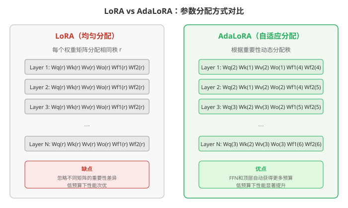

这篇论文的关键发现（见下图）证实了这一点：

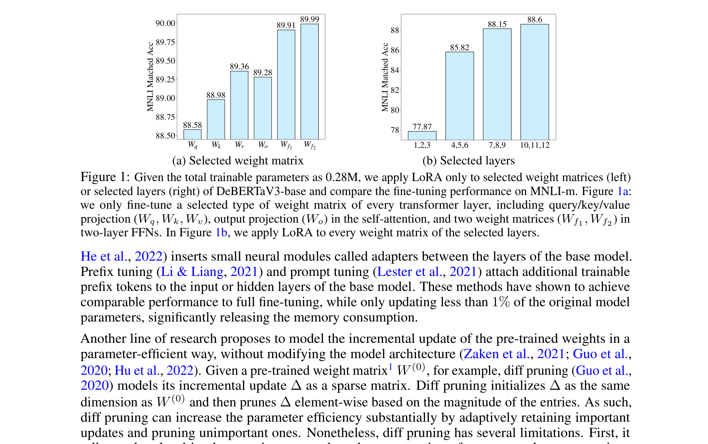

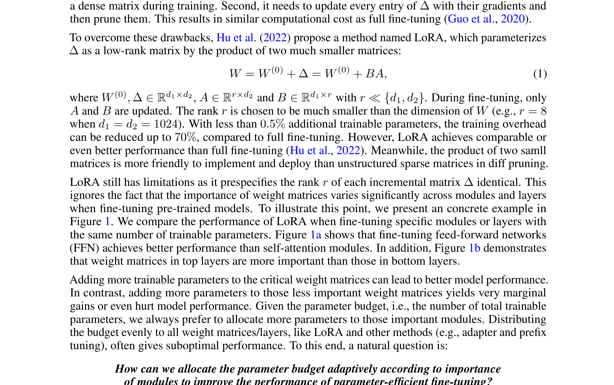

既然不同权重的重要性差异这么大，**为什么还要平均分配预算呢？**

## 核心思路：这篇论文的"大招"是什么？

AdaLoRA 的回答很直接：**让模型自己决定哪些参数值得训练，哪些不值得。**

具体来说，AdaLoRA 做了三件关键的事：

1. **用 SVD（Singular Value Decomposition，奇异值分解）的形式参数化增量更新**，这样可以直接通过"裁剪奇异值"来控制每个矩阵的秩
2. **设计了一个重要性评分机制**，评估每个奇异值对应三元组（左奇异向量 + 奇异值 + 右奇异向量）对模型性能的贡献
3. **用一个全局预算调度器**，在训练过程中逐步削减总预算，把参数从"不重要"的地方转移到"重要"的地方

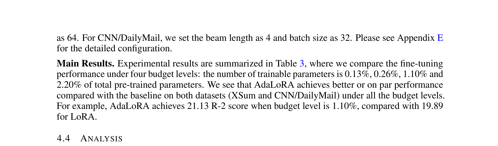

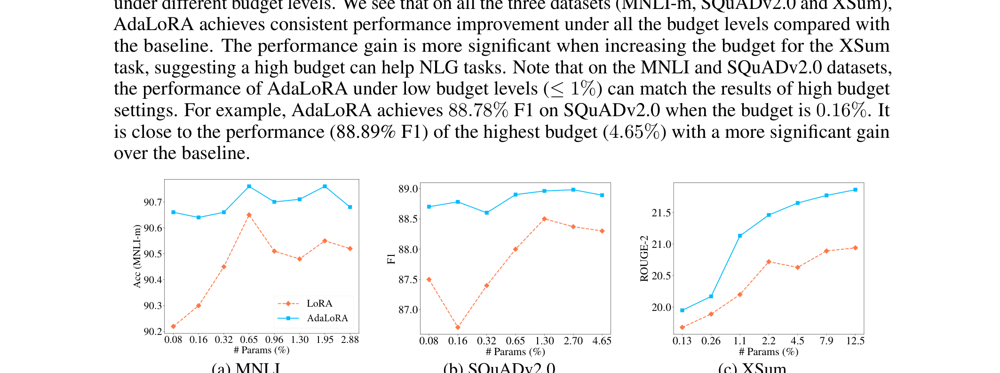

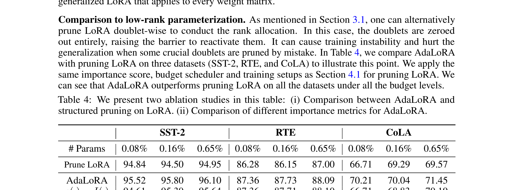

你可以把 AdaLoRA 想象成一个**聪明的预算经理**：一开始给每个部门（权重矩阵）发一笔启动资金，然后观察哪些部门产出高、哪些产出低，逐步把钱从低产出部门转移到高产出部门，最终形成一个最优的预算分配方案。

## 具体怎么做的？

### 方法一：基于 SVD 的参数化

LoRA 用 $BA$ 两个矩阵来表示 $\Delta W$，但 $B$ 和 $A$ 没有特殊的数学结构，很难直接控制"秩"。AdaLoRA 改用 SVD 的形式：

$$
\Delta W = P \Lambda Q
$$

其中：
- $P \in \mathbb{R}^{d_1 \times r}$：左奇异向量矩阵
- $\Lambda \in \mathbb{R}^{r \times r}$：对角矩阵，对角线元素 $\lambda_1, \lambda_2, \ldots, \lambda_r$ 是奇异值
- $Q \in \mathbb{R}^{r \times d_2}$：右奇异向量矩阵

**关键洞察**：每个奇异值 $\lambda_i$ 和对应的奇异向量 $P_{*i}$、$Q_{i*}$ 组成了一个"三元组" $\mathcal{G}_i = \{P_{*i}, \lambda_i, Q_{i*}\}$。如果把某个 $\lambda_i$ 设为 0，就相当于把这个三元组从矩阵中"移除"，从而降低了秩。

**为什么不直接做 SVD？** 精确 SVD 的计算复杂度是 $O(\min(d_1, d_2) \cdot d_1 d_2)$，对大矩阵来说太贵了。AdaLoRA 的聪明之处在于：它不真的做 SVD，而是**把 $P, \Lambda, Q$ 当作可训练参数**，通过梯度下降来优化它们，同时加一个正交正则化项让 $P$ 和 $Q$ 保持近似正交：

$$
R(P, Q) = \|P^\top P - I\|_F^2 + \|QQ^\top - I\|_F^2
$$

这里 $\|\cdot\|_F$ 是 Frobenius 范数（矩阵所有元素平方和的平方根），$I$ 是单位矩阵。这个项迫使 $P$ 和 $Q$ 的列/行互相正交，就像真正的奇异向量一样。

**初始化**：$\Lambda$ 初始化为零矩阵，$P$ 和 $Q$ 用随机高斯初始化。这样训练开始时 $\Delta W = P \Lambda Q = 0$，模型行为与预训练模型完全一致。

### 方法二：基于重要性的秩分配

这是 AdaLoRA 最核心的创新。它需要回答一个问题：**哪个三元组更重要？**

#### 重要性评分

最朴素的想法是用奇异值的大小 $|\lambda_i|$ 来衡量——大的重要，小的不重要。但论文发现这不够准确。

更好的方案是**基于敏感度的评分**：如果一个参数被移除后损失变化很大，那它就很重要。具体来说，对参数 $w_{ij}$ 的敏感度定义为：

$$
I(w_{ij}) = |w_{ij} \cdot \nabla_{w_{ij}} \mathcal{L}|
$$

这个公式的直觉是：它近似等于把 $w_{ij}$ 设为零时损失的变化量。梯度大且参数值大 → 移除后损失变化大 → 重要。

但直接用当前 batch 的梯度会有很大噪声，所以 AdaLoRA 用了**指数移动平均**来平滑：

$$
\overline{I}^{(t)}(w_{ij}) = \beta_1 \overline{I}^{(t-1)}(w_{ij}) + (1 - \beta_1) I^{(t)}(w_{ij})
$$

此外，还引入了**不确定性量化**——如果一个参数的敏感度波动很大，说明它的重要性不稳定，也应该保留（以防万一）：

$$
\overline{U}^{(t)}(w_{ij}) = \beta_2 \overline{U}^{(t-1)}(w_{ij}) + (1 - \beta_2) |I^{(t)}(w_{ij}) - \overline{I}^{(t)}(w_{ij})|
$$

最终，每个参数的综合重要性为：

$$
s^{(t)}(w_{ij}) = \overline{I}^{(t)}(w_{ij}) \cdot \overline{U}^{(t)}(w_{ij})
$$

对于三元组 $\mathcal{G}_i$，其重要性是奇异值和两个奇异向量所有条目重要性的平均值：

$$
S_{k,i} = s(\lambda_{k,i}) + \frac{1}{d_1}\sum_{j=1}^{d_1} s(P_{k,ji}) + \frac{1}{d_2}\sum_{j=1}^{d_2} s(Q_{k,ij})
$$

#### 裁剪机制

每一步训练后，按照重要性评分对所有三元组排序，保留评分最高的前 $b^{(t)}$ 个（$b^{(t)}$ 是当前总预算），其余的奇异值设为 0：

$$
\Lambda_{k,ii}^{(t+1)} = \begin{cases} \tilde{\Lambda}_{k,ii}^{(t)} & \text{如果 } S_{k,i} \text{ 排在前 } b^{(t)} \text{ 名} \\ 0 & \text{否则} \end{cases}
$$

### 方法三：全局预算调度器

总预算 $b^{(t)}$（所有矩阵的奇异值总数）不是一成不变的，而是按**三次方曲线**逐步减少：

1. **暖身阶段**（$t < t_i$）：保持初始预算 $b^{(0)}$（略高于目标预算，如 1.5 倍），让所有三元组都有机会展示自己
2. **衰减阶段**（$t_i \leq t < T - t_f$）：按三次方曲线逐步减少预算，把不重要的三元组一个个裁剪掉
3. **微调阶段**（$t \geq T - t_f$）：预算固定在目标值 $b^{(T)}$，对保留下来的三元组做精细调优

$$
b^{(t)} = \begin{cases} b^{(0)} & 0 \leq t < t_i \\ b^{(T)} + (b^{(0)} - b^{(T)})\left(1 - \frac{t - t_i - t_f}{T - t_i - t_f}\right)^3 & t_i \leq t < T - t_f \\ b^{(T)} & \text{其他} \end{cases}
$$

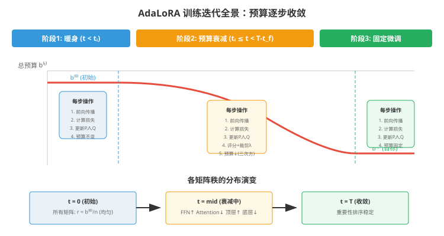

### 方法在整体架构中的位置

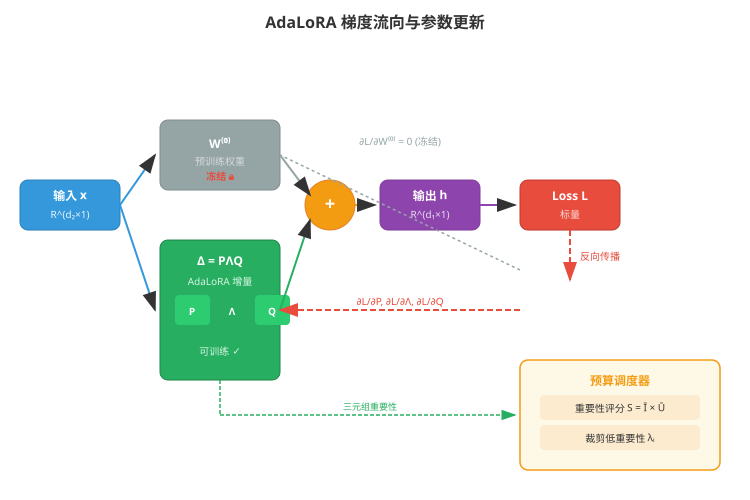

### 用一个具体例子走通全流程

#### 场景设定

假设有一个极简的预训练权重矩阵 $W^{(0)} \in \mathbb{R}^{4 \times 4}$，我们想用 AdaLoRA 做微调：

$$
W^{(0)} = \begin{bmatrix} 0.5 & 0.3 & -0.2 & 0.1 \\ -0.1 & 0.4 & 0.6 & -0.3 \\ 0.2 & -0.5 & 0.1 & 0.4 \\ 0.3 & 0.2 & -0.4 & 0.5 \end{bmatrix}
$$

设秩 $r = 2$（初始预算），即 $\Delta W = P \Lambda Q$，其中：

- $P \in \mathbb{R}^{4 \times 2}$（可训练，高斯初始化）
- $\Lambda \in \mathbb{R}^{2 \times 2}$（可训练，初始为零）
- $Q \in \mathbb{R}^{2 \times 4}$（可训练，高斯初始化）

初始值设定：

$$
P^{(0)} = \begin{bmatrix} 0.1 & -0.2 \\ 0.3 & 0.1 \\ -0.1 & 0.2 \\ 0.2 & -0.1 \end{bmatrix}, \quad
\Lambda^{(0)} = \begin{bmatrix} 0 & 0 \\ 0 & 0 \end{bmatrix}, \quad
Q^{(0)} = \begin{bmatrix} 0.2 & 0.1 & -0.1 & 0.3 \\ -0.1 & 0.2 & 0.3 & -0.2 \end{bmatrix}
$$

输入 $x = \begin{bmatrix} 1 \\ 0 \\ 1 \\ 0 \end{bmatrix}$，目标输出 $y = \begin{bmatrix} 0.8 \\ 0.3 \\ 0.5 \\ 0.6 \end{bmatrix}$。

#### Step 1: 前向传播

首先计算 $\Delta W^{(0)} = P^{(0)} \Lambda^{(0)} Q^{(0)}$：

$$
\Delta W^{(0)} = P^{(0)} \cdot \begin{bmatrix} 0 & 0 \\ 0 & 0 \end{bmatrix} \cdot Q^{(0)} = \begin{bmatrix} 0 & 0 & 0 & 0 \\ 0 & 0 & 0 & 0 \\ 0 & 0 & 0 & 0 \\ 0 & 0 & 0 & 0 \end{bmatrix}
$$

因为 $\Lambda$ 初始为零，所以 $\Delta W = 0$。此时模型输出完全由 $W^{(0)}$ 决定：

$$
h^{(0)} = (W^{(0)} + \Delta W^{(0)}) x = W^{(0)} x = \begin{bmatrix} 0.5 & 0.3 & -0.2 & 0.1 \\ -0.1 & 0.4 & 0.6 & -0.3 \\ 0.2 & -0.5 & 0.1 & 0.4 \\ 0.3 & 0.2 & -0.4 & 0.5 \end{bmatrix} \begin{bmatrix} 1 \\ 0 \\ 1 \\ 0 \end{bmatrix} = \begin{bmatrix} 0.3 \\ 0.5 \\ 0.3 \\ -0.1 \end{bmatrix}
$$

#### Step 2: 损失计算

使用均方误差（MSE, Mean Squared Error）作为损失函数：

$$
\mathcal{L} = \frac{1}{2} \|h - y\|_2^2 = \frac{1}{2} \sum_{i=1}^{4} (h_i - y_i)^2
$$

> **直白翻译**：就是把输出的每个分量和目标值的差平方后加起来再除以 2，衡量输出离目标有多远。

第 0 轮损失：

$$
\mathcal{L}^{(0)} = \frac{1}{2} \left[ (0.3 - 0.8)^2 + (0.5 - 0.3)^2 + (0.3 - 0.5)^2 + (-0.1 - 0.6)^2 \right] = \frac{1}{2} (0.25 + 0.04 + 0.04 + 0.49) = 0.41
$$

**LoRA vs AdaLoRA 的优化目标区别**：
- LoRA：直接优化 $B$ 和 $A$，所有参数平等对待
- AdaLoRA：优化 $P, \Lambda, Q$，同时根据 $\Lambda$ 中奇异值的重要性动态裁剪，优化目标中多了正交正则化项 $\gamma \cdot R(P, Q)$

#### Step 3: 反向传播

根据链式法则，损失对 $\Delta W$ 的梯度为：

$$
\frac{\partial \mathcal{L}}{\partial \Delta W} = h - y = \begin{bmatrix} -0.5 \\ 0.2 \\ -0.2 \\ -0.7 \end{bmatrix}
$$

然后通过链式法则传播到 $P, \Lambda, Q$：

$$
\frac{\partial \mathcal{L}}{\partial P} = \frac{\partial \mathcal{L}}{\partial \Delta W} \Lambda Q, \quad
\frac{\partial \mathcal{L}}{\partial \Lambda} = P^\top \frac{\partial \mathcal{L}}{\partial \Delta W} Q^\top, \quad
\frac{\partial \mathcal{L}}{\partial Q} = P^\top \frac{\partial \mathcal{L}}{\partial \Delta W}
$$

注意：由于 $\Lambda^{(0)} = 0$，所以 $\frac{\partial \mathcal{L}}{\partial P} = 0$（**冷启动问题**：$P$ 第一轮没有梯度！）。但 $\frac{\partial \mathcal{L}}{\partial \Lambda}$ 和 $\frac{\partial \mathcal{L}}{\partial Q}$ 不为零：

$$
\frac{\partial \mathcal{L}}{\partial \Lambda} = (P^{(0)})^\top \begin{bmatrix} -0.5 \\ 0.2 \\ -0.2 \\ -0.7 \end{bmatrix} (Q^{(0)})^\top = \begin{bmatrix} 0.1 & 0.3 & -0.1 & 0.2 \\ -0.2 & 0.1 & 0.2 & -0.1 \end{bmatrix} \begin{bmatrix} -0.5 \\ 0.2 \\ -0.2 \\ -0.7 \end{bmatrix} \begin{bmatrix} 0.2 & -0.1 \\ 0.1 & 0.2 \\ -0.1 & 0.3 \\ 0.3 & -0.2 \end{bmatrix}
$$

先算中间向量 $v = (P^{(0)})^\top (h - y)$：

$$
v = \begin{bmatrix} 0.1(-0.5) + 0.3(0.2) + (-0.1)(-0.2) + 0.2(-0.7) \\ -0.2(-0.5) + 0.1(0.2) + 0.2(-0.2) + (-0.1)(-0.7) \end{bmatrix} = \begin{bmatrix} -0.05 + 0.06 + 0.02 - 0.14 \\ 0.1 + 0.02 - 0.04 + 0.07 \end{bmatrix} = \begin{bmatrix} -0.11 \\ 0.15 \end{bmatrix}
$$

再乘以 $(Q^{(0)})^\top$：

$$
\frac{\partial \mathcal{L}}{\partial \Lambda} = \begin{bmatrix} -0.11 \\ 0.15 \end{bmatrix} \begin{bmatrix} 0.2 & -0.1 \\ 0.1 & 0.2 \\ -0.1 & 0.3 \\ 0.3 & -0.2 \end{bmatrix} = \begin{bmatrix} -0.022 & 0.011 \\ 0.015 & 0.030 \end{bmatrix}
$$

由于 $\Lambda$ 是对角矩阵，我们只关心对角线元素：

$$
\frac{\partial \mathcal{L}}{\partial \lambda_1} = -0.022, \quad \frac{\partial \mathcal{L}}{\partial \lambda_2} = 0.030
$$

#### Step 3.5: 参数更新与下一轮迭代

**参数更新**（以 SGD, Stochastic Gradient Descent 随机梯度下降为例，学习率 $\eta = 0.1$）：

$$
\theta_{\text{new}} = \theta - \eta \cdot \frac{\partial \mathcal{L}}{\partial \theta}
$$

> **通俗理解**：梯度指向损失增大的方向，减去它就是在让损失变小。学习率 $\eta$ 控制"步子"的大小——太大容易跳过最优解，太小收敛太慢。

更新 $\Lambda$：

$$
\Lambda^{(1)} = \begin{bmatrix} 0 & 0 \\ 0 & 0 \end{bmatrix} - 0.1 \cdot \begin{bmatrix} -0.022 & 0 \\ 0 & 0.030 \end{bmatrix} = \begin{bmatrix} 0.0022 & 0 \\ 0 & -0.0030 \end{bmatrix}
$$

更新 $Q$（简化计算，取 $\frac{\partial \mathcal{L}}{\partial Q} = v \cdot (Q^{(0)})^\top$ 的部分元素）：

$$
Q^{(1)} = Q^{(0)} - 0.1 \cdot \frac{\partial \mathcal{L}}{\partial Q} = \begin{bmatrix} 0.2 & 0.1 & -0.1 & 0.3 \\ -0.1 & 0.2 & 0.3 & -0.2 \end{bmatrix} - 0.1 \cdot \begin{bmatrix} -0.022 & 0.011 & -0.033 & 0.022 \\ 0.015 & 0.030 & 0.045 & -0.030 \end{bmatrix}
$$

$$
= \begin{bmatrix} 0.2022 & 0.0989 & -0.0967 & 0.2978 \\ -0.1015 & 0.1970 & 0.2955 & -0.1970 \end{bmatrix}
$$

$P$ 第一轮无梯度（冷启动），保持不变：$P^{(1)} = P^{(0)}$。

**第二轮前向传播**：

$$
\Delta W^{(1)} = P^{(1)} \Lambda^{(1)} Q^{(1)} = \begin{bmatrix} 0.1 & -0.2 \\ 0.3 & 0.1 \\ -0.1 & 0.2 \\ 0.2 & -0.1 \end{bmatrix} \begin{bmatrix} 0.0022 & 0 \\ 0 & -0.0030 \end{bmatrix} \begin{bmatrix} 0.2022 & 0.0989 & -0.0967 & 0.2978 \\ -0.1015 & 0.1970 & 0.2955 & -0.1970 \end{bmatrix}
$$

先算 $P^{(1)} \Lambda^{(1)}$：

$$
= \begin{bmatrix} 0.00022 & 0.00060 \\ 0.00066 & -0.00030 \\ -0.00022 & -0.00060 \\ 0.00044 & 0.00030 \end{bmatrix}
$$

再乘以 $Q^{(1)}$（只保留 4 位小数）：

$$
\Delta W^{(1)} \approx \begin{bmatrix} -0.0001 & 0.0001 & 0.0002 & -0.0001 \\ 0.0002 & 0.0000 & -0.0002 & 0.0003 \\ 0.0001 & -0.0001 & -0.0001 & 0.0001 \\ 0.0001 & 0.0001 & 0.0000 & 0.0001 \end{bmatrix}
$$

新的输出：

$$
h^{(1)} = (W^{(0)} + \Delta W^{(1)}) x \approx \begin{bmatrix} 0.3001 \\ 0.5002 \\ 0.3001 \\ -0.0999 \end{bmatrix}
$$

新的损失：

$$
\mathcal{L}^{(1)} = \frac{1}{2} \left[ (0.3001 - 0.8)^2 + (0.5002 - 0.3)^2 + (0.3001 - 0.5)^2 + (-0.0999 - 0.6)^2 \right] \approx 0.4099
$$

**验证训练在起作用**：

| 分量 | 第 0 轮输出 | 第 1 轮输出 | 目标值 | 趋势 |
|------|-----------|-----------|-------|------|
| $h_1$ | 0.3000 | 0.3001 | 0.8 | ✓ 微增 |
| $h_2$ | 0.5000 | 0.5002 | 0.3 | ✗ 偏离（需要更多轮） |
| $h_3$ | 0.3000 | 0.3001 | 0.5 | ✓ 微增 |
| $h_4$ | -0.1000 | -0.0999 | 0.6 | ✓ 微增 |

损失从 0.4100 降到 0.4099，虽然变化微小，但方向正确。随着训练继续，$\Lambda$ 的对角线值会越来越大，$\Delta W$ 的修正效果会越来越明显。

**冷启动说明**：由于 $\Lambda^{(0)} = 0$，第一轮 $P$ 没有梯度。但从第二轮开始，$\Lambda$ 已有非零值，$P$ 就能获得梯度并参与更新了。

**重要性评分与裁剪**：在第二轮之后，系统会计算每个三元组的重要性：

- 三元组 1：$S_1 = s(\lambda_1) + \text{avg}(s(P_{*1})) + \text{avg}(s(Q_{1*}))$
- 三元组 2：$S_2 = s(\lambda_2) + \text{avg}(s(P_{*2})) + \text{avg}(s(Q_{2*}))$

如果预算需要缩减（比如从 $r=2$ 减到 $r=1$），则保留重要性更高的那个三元组，把另一个的奇异值设为 0。

#### Step 4: 部署/推理

训练完成后，AdaLoRA 的增量矩阵 $\Delta W = P \Lambda Q$ 可以直接合并到预训练权重中：

$$
W_{\text{final}} = W^{(0)} + P \Lambda Q
$$

推理时只需计算 $W_{\text{final}} x$，**没有任何额外开销**。

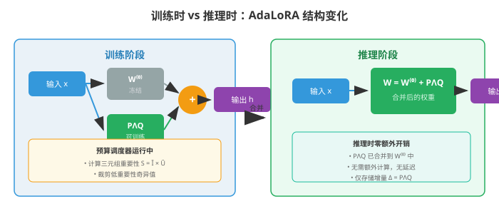

> **小白tips**：为什么用 SVD 形式而不是直接裁剪 LoRA 的 $B$ 和 $A$？因为 $B$ 和 $A$ 的列/行不是正交的，它们之间有冗余和依赖。直接裁剪 $B$ 和 $A$ 的列会破坏整个结构，导致训练不稳定。而 SVD 形式中，每个三元组是相对独立的，裁剪一个对其他的影响较小。

## 效果怎么样？

### 各方法对比总览

论文在三个任务类型上做了全面实验：

#### 1. 自然语言理解（GLUE 基准）

使用 DeBERTaV3-base（1.83 亿参数）模型：

| 方法 | 参数量 | MNLI | RTE | CoLA | 平均 |
|------|--------|------|-----|------|------|
| Full Fine-tuning | 183M | 90.12 | 89.53 | 70.64 | 89.31 |
| LoRA | 0.3M | 89.48 | 85.56 | 66.77 | 88.15 |
| **AdaLoRA** | **0.3M** | **89.64** | **87.36** | **70.04** | **88.86** |
| LoRA | 1.2M | 90.00 | 88.45 | 69.45 | 89.14 |
| **AdaLoRA** | **1.2M** | **90.08** | **89.17** | **70.32** | **89.42** |

在 0.3M 参数预算下，AdaLoRA 的 RTE 比 LoRA 高 1.8%，平均也全面领先。

#### 2. 问答任务（SQuAD）

| 方法 | 参数占比 | SQuAD v1.1 (EM/F1) | SQuAD v2.0 (EM/F1) |
|------|---------|-------------------|-------------------|
| LoRA | 0.08% | 86.4 / 92.8 | 84.7 / 87.5 |
| **AdaLoRA** | **0.08%** | **87.2 / 93.4** | **85.6 / 88.7** |
| LoRA | 0.65% | 87.8 / 93.8 | 85.8 / 88.9 |
| **AdaLoRA** | **0.65%** | **88.3 / 94.1** | **86.5 / 89.5** |

**最惊艳的结果**：AdaLoRA 仅用 0.08% 的参数（约 15 万个），就在 SQuAD v2.0 上达到了 88.7% 的 F1，比 LoRA 同预算高 1.2%。

#### 3. 文本生成（XSum / CNN/DailyMail）

使用 BART-large 模型：

| 方法 | 参数占比 | XSum (R-1/R-2/R-L) | CNN/DM (R-1/R-2/R-L) |
|------|---------|-------------------|---------------------|
| LoRA | 1.10% | 42.86 / 20.20 / 35.12 | 43.52 / 20.89 / 40.56 |
| **AdaLoRA** | **1.10%** | **43.54 / 21.13 / 35.78** | **43.89 / 21.24 / 40.92** |

### 关键发现

#### 预算分配结果验证

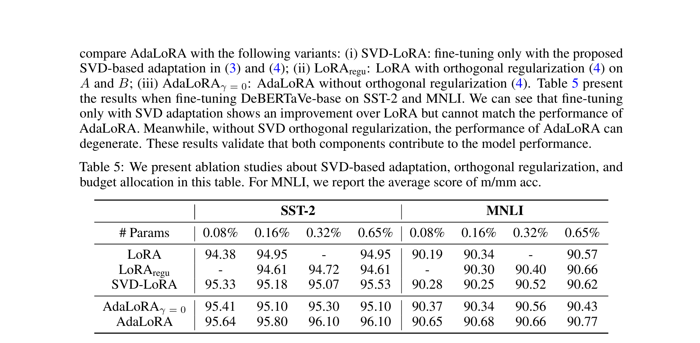

论文展示了 AdaLoRA 最终学到的预算分配模式，与之前的观察**完美吻合**：
- **FFN 权重**（$W_{f1}, W_{f2}$）获得了最多的参数
- **顶层**比底层获得了更多的参数
- **注意力输出权重**（$W_o$）比查询/键/值投影权重（$W_q, W_k, W_v$）更重要

这说明 AdaLoRA 确实能自动发现哪些参数更重要，而不是靠人工猜测。

#### 消融实验

| 方法 | SST-2 | RTE | CoLA |
|------|-------|-----|------|
| LoRA | 94.15 | 85.56 | 66.77 |
| SVD-LoRA（仅 SVD 参数化） | 94.61 | 86.28 | 68.12 |
| AdaLoRA 无正则化（$\gamma=0$） | 94.83 | 86.64 | 68.85 |
| **AdaLoRA（完整）** | **95.07** | **87.36** | **70.04** |

- SVD 参数化本身就比 LoRA 的 $BA$ 形式略好（正交性带来的好处）
- 自适应预算分配进一步提升了性能
- 正交正则化项也是必要的，没有它性能会下降

#### 重要性评分方式对比

| 评分方式 | SST-2 | RTE | CoLA |
|---------|-------|-----|------|
| 奇异值大小 $|\lambda|$ | 94.72 | 86.42 | 68.91 |
| 仅敏感度 | 94.85 | 86.85 | 69.32 |
| **敏感度 + 不确定性** | **95.07** | **87.36** | **70.04** |

同时考虑敏感度和不确定性效果最好，说明**不稳定的参数也值得保留**。

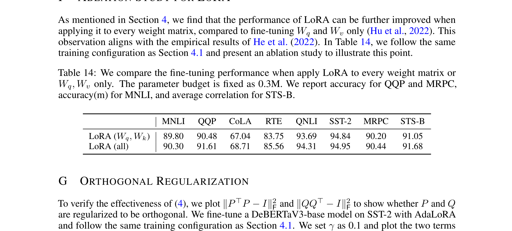

正交正则化项在暖身阶段快速收敛到约 0.001，说明 $P$ 和 $Q$ 确实学到了近似正交的结构。

## 论文的意义和局限

**主要贡献**：

1. **指出了 LoRA 的核心缺陷**：均匀分配预算忽略了权重矩阵之间的重要性差异
2. **提出了 SVD 形式的参数化方法**：避免了精确 SVD 的计算开销，同时支持显式的秩控制
3. **设计了基于敏感度+不确定性的重要性评分**：比单纯用奇异值大小更准确
4. **实验证明**：在极低预算（<0.1%）下，AdaLoRA 仍能取得显著优于 LoRA 的效果

**局限性**：

1. **计算开销增加**：需要维护额外的 $P$ 和 $Q$ 矩阵（相比 LoRA 的 $B$ 和 $A$ 参数量翻倍），并且需要计算重要性评分和排序
2. **超参数较多**：预算调度器的初始预算、衰减速率、暖身步数等都需要调优
3. **仅适用于线性层**：和 LoRA 一样，只适用于全连接层等线性变换，不能直接用于归一化层、嵌入层等
4. **裁剪不可逆**：一旦某个三元组被裁剪（奇异值设为 0），就无法恢复。如果早期误判了重要性，后期无法修正

## 读后感

AdaLoRA 是一篇**思路清晰、实验扎实**的工作。它没有提出什么花哨的新架构，而是敏锐地发现了 LoRA 中一个被忽视的问题——预算分配不均——然后用 SVD 参数化 + 重要性评分 + 预算调度这一套组合拳优雅地解决了它。

这篇论文之所以重要，是因为它**把"参数高效微调"从"用多少参数"推进到了"怎么用这些参数"的层面**。在模型越来越大、下游任务越来越多的趋势下，这种"把钱花在刀刃上"的思路会越来越有价值。

对于初学者来说，读完这篇论文最应该记住的是：**不是所有参数都生而平等**。无论是微调大模型还是设计神经网络，理解不同组件的相对重要性，并据此做资源分配，是一个通用且强大的设计原则。

后续研究（如 LoRA+、DoRA 等）都在这个方向上继续探索，AdaLoRA 可以说是开启了"智能参数分配"这个子领域的先河。
