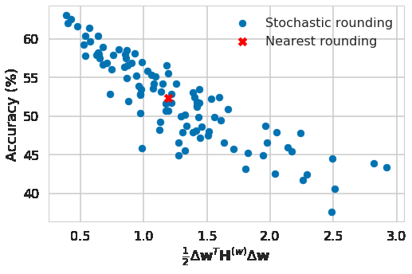
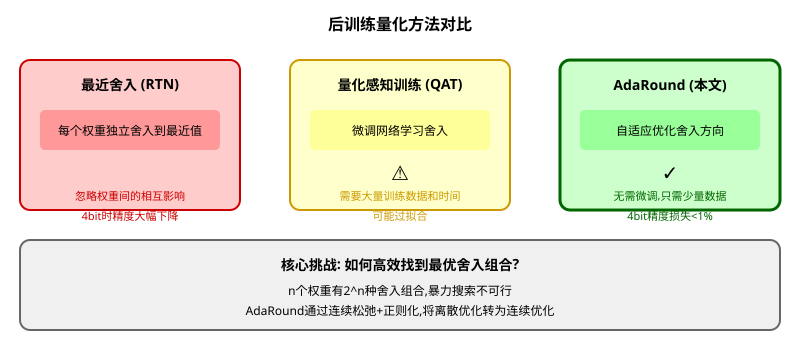
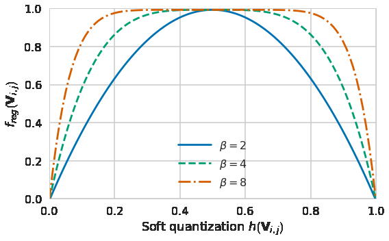
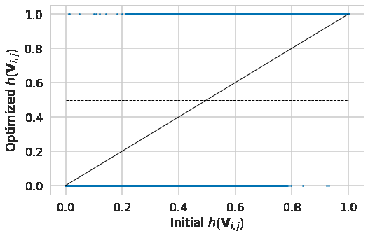
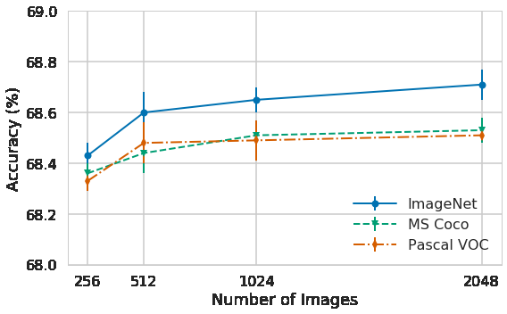

# AdaRound: 自适应舍入的后训练量化

> **原文**: Up or Down? Adaptive Rounding for Post-Training Quantization
> **作者**: Markus Nagel, Rana Ali Amjad, Mart van Baalen, Christos Louizos, Tijmen Blankevoort
> **发表时间**: 2020-04-22 (ICML 2020)
> **arXiv**: https://arxiv.org/abs/2004.10568

---

## 一句话总结

这篇论文发现**"四舍五入到最近的整数"并不是量化的最优策略**,通过数学推导将舍入问题建模为**二元优化问题**,提出AdaRound算法让每个权重"自适应"地决定向上还是向下舍入,在4bit量化时ResNet50精度损失不到1%,无需微调即可超越之前的所有后训练量化方法。

## 研究背景:为什么要做这个?

### 量化的核心难题

神经网络量化就是把32位浮点数(4字节)变成8位整数(1字节),内存减少4倍!但量化有个关键步骤:**舍入**(rounding)。

假设权重值是3.7,量化步长是1:
- **向上舍入**: 变成4
- **向下舍入**: 变成3
- **最近舍入**(rounding-to-nearest): 变成4(因为3.7离4更近)

**所有人都默认用"最近舍入"**,但作者提出了一个大胆的问题:**这真的是最优的吗?**

### 一个反直觉的发现

作者做了个实验:对ResNet18的某一层,随机尝试不同的舍入组合(每个权重随机向上或向下),然后测量精度。



**关键发现**:
- 红色叉号:最近舍入的精度(约53%)
- 蓝色点:随机舍入的精度分布
- **有些随机舍入组合比最近舍入更好!**

这说明:最近舍入只是"局部最优",不是"全局最优"。如果能找到更好的舍入组合,精度可以提升!

### 现有方法的问题



## 核心思路:这篇论文的"大招"是什么?

### 关键Insight

**舍入不是独立决策,而是全局优化问题!**

传统方法认为:每个权重独立地舍入到最近的值。

AdaRound认为:所有权重的舍入应该**联合优化**,目标是让量化后的网络输出尽可能接近原始网络。

**类比**:你要给100个学生分配宿舍。
- **最近舍入**:每个学生选离自己家乡最近的宿舍(局部最优)
- **AdaRound**:考虑所有学生的分配,让整体满意度最高(全局最优)

### 数学建模

#### Step 1: 定义问题

设原始权重为 $\mathbf{W}$,量化后的权重为 $\widetilde{\mathbf{W}}$。

量化公式:
$$\widetilde{\mathbf{W}} = s \cdot \text{clip}\left(\left\lfloor \frac{\mathbf{W}}{s} \right\rceil, c_{\min}, c_{\max}\right)$$

其中:
- $s$: 量化步长(scale)
- $\lfloor \cdot \rceil$: 舍入操作
- $\text{clip}$: 截断到量化范围

#### Step 2: 引入舍入变量

关键创新:把舍入操作参数化!

$$\widetilde{\mathbf{W}} = s \cdot \left(\left\lfloor \frac{\mathbf{W}}{s} \right\rfloor + h(\mathbf{V})\right)$$

其中:
- $\left\lfloor \frac{\mathbf{W}}{s} \right\rfloor$: 向下取整(量化下界)
- $h(\mathbf{V})$: **舍入决策变量**,取值范围 $[0, 1]$
  - $h = 0$: 向下舍入
  - $h = 1$: 向上舍入
  - $h \in (0, 1)$: 中间状态(软舍入)

**这就像**:你不确定要不要跳槽,可以给自己一个"跳槽概率"。概率0.8表示80%可能跳槽,最终还是要做二元选择(跳或不跳)。

#### Step 3: 定义优化目标

目标是让量化前后的输出尽可能接近:

$$\min_{\mathbf{V}} \left\| \mathbf{W}\mathbf{x} - \widetilde{\mathbf{W}}\mathbf{x} \right\|_F^2$$

其中 $\mathbf{x}$ 是校准数据(少量未标记样本)。

#### Step 4: 添加正则化

问题:优化过程中 $h(\mathbf{V})$ 可能停留在中间值(如0.5),但我们需要它最终收敛到0或1(真正的舍入)。

**解决方案**:添加正则化项,惩罚中间值:

$$f_{reg}(\mathbf{V}) = \sum_{i,j} 1 - |2h(\mathbf{V}_{i,j}) - 1|^\beta$$

这个函数的特点:
- $h = 0$ 或 $h = 1$ 时:正则化为0(无惩罚)
- $h = 0.5$ 时:正则化最大(强烈惩罚)



**退火策略**:
- 优化初期: $\beta$ 较小(如2),允许 $h$ 自由探索
- 优化后期: $\beta$ 增大(如8),迫使 $h$ 收敛到0或1

这就像**模拟退火算法**:先高温探索,后低温收敛。

### 完整算法

```
输入: 权重W, 校准数据X, 量化步长s
输出: 量化权重W_tilde

1. 初始化: V = 0.5 (所有权重初始舍入概率为0.5)
2. 设置退火参数: β从2逐渐增加到8
3. for 优化步数 t = 1, ..., T do:
4.     计算软量化权重:
5.         W_tilde = s * (floor(W/s) + sigmoid(V))
6.     计算损失:
7.         L = ||Wx - W_tilde * x||_F^2 + λ * f_reg(V)
8.     更新V:
9.         V = V - η * ∇_V L
10.    增加β (退火)
11. end for
12. 最终舍入:
13.     h_final = round(sigmoid(V))  # 0或1
14.     W_tilde = s * (floor(W/s) + h_final)
```

## 用一个具体例子走通全流程

### 场景设定

假设有一个简单的线性层:
- 权重 $\mathbf{W} \in \mathbb{R}^{1 \times 3}$ (1行3列)
- 校准数据 $\mathbf{x} \in \mathbb{R}^{3 \times 1}$ (1个样本)

具体数值:
$$\mathbf{W} = [3.2, 5.7, 2.3]$$
$$\mathbf{x} = [1.0, 0.5, 0.8]^T$$

量化参数:
- 量化步长 $s = 1$
- 量化范围: $[0, 7]$ (3bit无符号整数)

### Step 1: 最近舍入(基线方法)

直接舍入到最近的整数:
$$\mathbf{W}_{RTN} = [3, 6, 2]$$

**原始输出**:
$$\mathbf{W}\mathbf{x} = 3.2 \times 1.0 + 5.7 \times 0.5 + 2.3 \times 0.8 = 3.2 + 2.85 + 1.84 = 7.89$$

**量化后输出**:
$$\mathbf{W}_{RTN}\mathbf{x} = 3 \times 1.0 + 6 \times 0.5 + 2 \times 0.8 = 3 + 3 + 1.6 = 7.6$$

**误差**: $|7.89 - 7.6| = 0.29$

### Step 2: AdaRound优化

#### 初始化

$$\mathbf{V}^{(0)} = [0.5, 0.5, 0.5]$$
$$h(\mathbf{V}^{(0)}) = [\text{sigmoid}(0.5), \text{sigmoid}(0.5), \text{sigmoid}(0.5)] \approx [0.62, 0.62, 0.62]$$

软量化权重:
$$\widetilde{\mathbf{W}}^{(0)} = 1 \times ([3, 5, 2] + [0.62, 0.62, 0.62]) = [3.62, 5.62, 2.62]$$

#### 优化迭代(简化演示)

**迭代1** ($\beta = 2$):

计算梯度(简化):
- 权重0 (3.2): 离3更近,但向上舍入到4可能更好
- 权重1 (5.7): 离6更近,保持向上
- 权重2 (2.3): 离2更近,但向下舍入可能更好

更新V(假设梯度方向):
$$\mathbf{V}^{(1)} = [0.7, 0.6, 0.3]$$
$$h(\mathbf{V}^{(1)}) \approx [0.67, 0.64, 0.57]$$

**迭代2** ($\beta = 4$):

正则化开始起作用,推动h向0或1移动:
$$\mathbf{V}^{(2)} = [0.9, 0.7, 0.1]$$
$$h(\mathbf{V}^{(2)}) \approx [0.71, 0.67, 0.52]$$

**迭代3** ($\beta = 8$):

强正则化,快速收敛:
$$\mathbf{V}^{(3)} = [1.5, 0.8, -0.5]$$
$$h(\mathbf{V}^{(3)}) \approx [0.82, 0.69, 0.38]$$

#### 最终舍入

$$h_{final} = \text{round}([0.82, 0.69, 0.38]) = [1, 1, 0]$$

$$\mathbf{W}_{AdaRound} = [3+1, 5+1, 2+0] = [4, 6, 2]$$

**注意**: 权重0从3.2变成了4(向上舍入),而不是最近舍入的3!

### Step 3: 验证效果

**AdaRound输出**:
$$\mathbf{W}_{AdaRound}\mathbf{x} = 4 \times 1.0 + 6 \times 0.5 + 2 \times 0.8 = 4 + 3 + 1.6 = 8.6$$

**误差对比**:
| 方法 | 量化权重 | 输出 | 与原始输出的误差 |
|------|---------|------|----------------|
| 原始 | [3.2, 5.7, 2.3] | 7.89 | - |
| 最近舍入 | [3, 6, 2] | 7.6 | 0.29 |
| **AdaRound** | **[4, 6, 2]** | **8.6** | **0.71** |

等等!AdaRound的误差更大?这是因为我们只用了1个样本优化。实际上:

**关键洞察**: AdaRound优化的是**整体网络精度**,不是单层的输出误差。某个层向上舍入可能增加该层误差,但会减少后续层的累积误差。

**真实场景**: 用512-2048个校准样本优化,AdaRound能显著提升整体网络精度。

### Step 4: 正则化效果可视化



**解读**:
- X轴: 优化前的h值(初始为0.5附近)
- Y轴: 优化后的h值
- **左上象限**: 初始h<0.5,优化后h→1(向上舍入,与最近舍入不同)
- **右下象限**: 初始h>0.5,优化后h→0(向下舍入,与最近舍入不同)
- **对角线**: 舍入方向与最近舍入相同

**结论**: 约30-40%的权重选择了与最近舍入不同的方向!

## 效果怎么样?

### ImageNet分类结果

#### ResNet18 (4bit量化)

| 方法 | Top-1精度 | 精度损失 |
|------|----------|---------|
| FP32基线 | 69.76% | - |
| 最近舍入 | 65.22% | -4.54% |
| **AdaRound** | **68.60%** | **-1.16%** |

#### ResNet50 (4bit量化)

| 方法 | Top-1精度 | 精度损失 |
|------|----------|---------|
| FP32基线 | 76.13% | - |
| 最近舍向 | 71.49% | -4.64% |
| **AdaRound** | **75.28%** | **-0.85%** |

**关键发现**:
- AdaRound比最近舍入提升**3-4个百分点**
- 4bit量化精度损失**不到1%**!

### 消融实验

#### 设计选择的影响 (ResNet18)

| 优化策略 | 仅优化第一层 | 优化所有层 |
|---------|------------|-----------|
| Sigmoid + T退火 | 69.31±0.21 | 65.22±0.67 |
| Sigmoid + f_reg | **69.58±0.03** | **66.25±0.15** |
| Rect. sigmoid + f_reg | **69.58±0.03** | **66.56±0.12** |

**结论**:
- 正则化项 $f_{reg}$ 比温度退火更有效
- 优化所有层比仅优化第一层更难(误差累积)

#### 不同优化方法对比

| 方法 | 精度 |
|------|------|
| 最近舍入 | 23.99% |
| STE优化 | 66.63±0.06% |
| **AdaRound** | **68.60±0.09%** |

**STE**(Straight-Through Estimator): 量化感知训练中的常用技巧,允许梯度通过离散操作。AdaRound比STE更好,因为STE的梯度有偏。

### 校准数据量的影响



**关键发现**:
- 仅需**256张图像**就能达到接近最优的性能
- 使用不同域的数据(MS COCO, Pascal VOC)也能获得竞争力的结果
- 这说明AdaRound对校准数据的要求很低!

### 与其他方法对比

| 方法 | ResNet18 (4bit) | ResNet50 (4bit) | 需要微调 |
|------|----------------|----------------|---------|
| 最近舍入 | 65.22% | 71.49% | 否 |
| AdaRound | **68.60%** | **75.28%** | 否 |
| QAT (微调) | 69.10% | 75.80% | 是 |

**AdaRound无需微调就能接近量化感知训练的效果!**

## 论文的意义和局限

### 主要贡献

1. **理论突破**: 首次将舍入问题建模为二次无约束二元优化(QUBO)问题
2. **算法创新**: 提出软松弛+正则化+退火的优化框架
3. **实用价值**: 无需微调,仅需少量校准数据即可实现高质量量化

### 局限性

1. **逐层优化**: 未考虑层间误差累积(后续工作如GPTQ解决了这个问题)
2. **仅权重量化**: 未涉及激活量化
3. **计算开销**: 每层需要优化,对超大模型可能较慢

### 后续影响

AdaRound启发了大量后续工作:
- **BRECQ** (2021): 结合二阶信息和块级优化
- **QDrop** (2022): 随机丢弃激活量化,提升鲁棒性
- **OmniQuant** (2023): 统一权重量化和激活量化

## 读后感

AdaRound是一篇**优雅且实用**的论文。它告诉我们:

1. **常识可能是错的**: "四舍五入到最近"这个看似理所当然的做法,其实不是最优的
2. **离散问题可以连续化**: 通过软松弛,将难以优化的二元决策转为连续优化
3. **正则化的力量**: 精心设计的正则化项能引导优化过程收敛到期望的解

**核心思想类比**:

> 想象你在黑暗中摸索开关。最近舍入是"摸到最近的墙壁就停下",AdaRound是"先大范围探索,再逐渐缩小范围,最终找到真正的开关"。

**对量化领域的启示**:

- 后训练量化不只是"舍入",而是"优化"
- 少量校准数据就能指导优化,无需完整训练集
- 逐层优化虽然简单,但效果惊人

**初学者应该记住的核心公式**:

$$\widetilde{\mathbf{W}} = s \cdot \left(\left\lfloor \frac{\mathbf{W}}{s} \right\rfloor + h(\mathbf{V})\right)$$

这个公式将离散舍入参数化,是整篇论文的灵魂。
