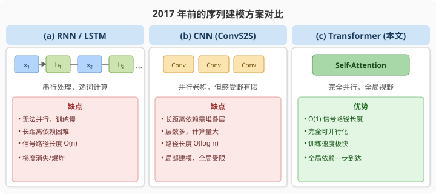
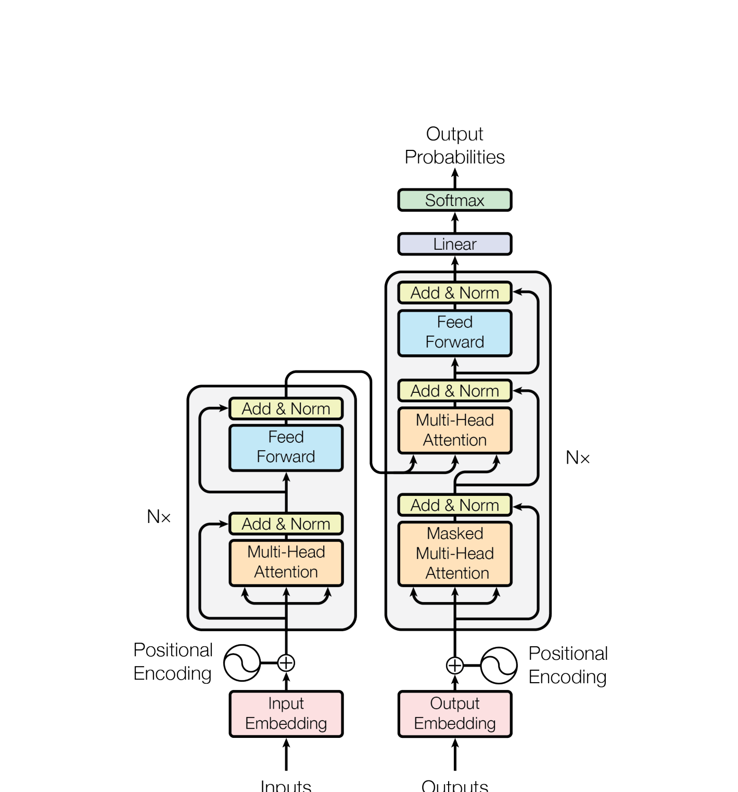
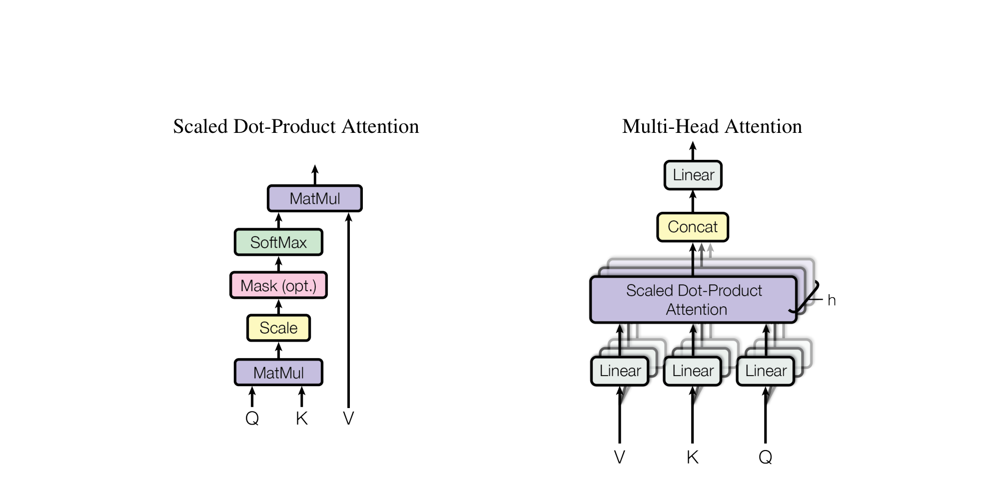
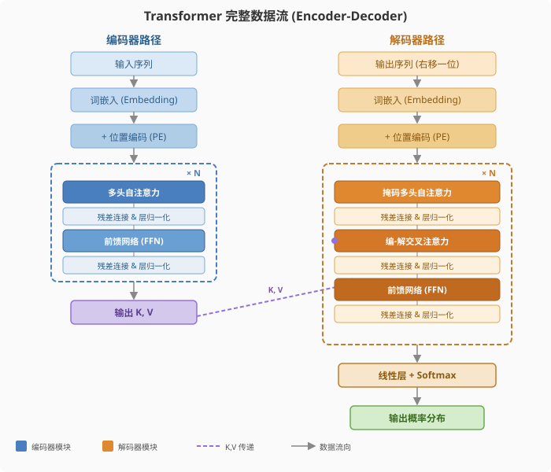
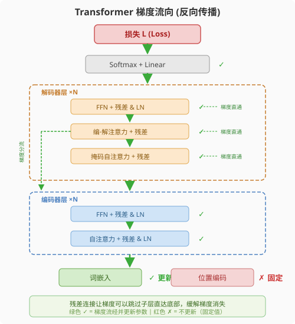
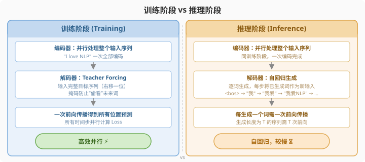
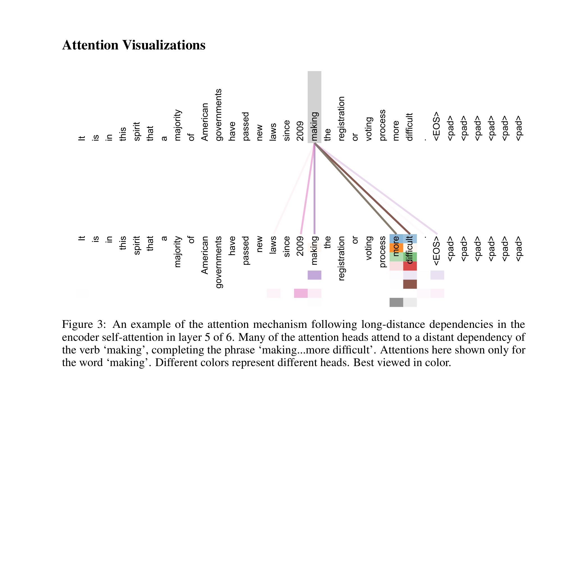

# 注意力就是你所需要的一切

> **原文**: Attention Is All You Need
> **作者**: Ashish Vaswani, Noam Shazeer, Niki Parmar, Jakob Uszkoreit, Llion Jones, Aidan N. Gomez, Łukasz Kaiser, Illia Polosukhin
> **发表时间**: 2017-06-12
> **arXiv**: [https://arxiv.org/abs/1706.03762](https://arxiv.org/abs/1706.03762)

---

## 一句话总结

这篇论文提出了 **Transformer** 架构——一个完全基于"注意力机制"的序列转换模型，彻底抛弃了以前大家都在用的循环神经网络（RNN）和卷积神经网络（CNN），在机器翻译任务上跑得又快又好。

## 研究背景：为什么要做这个？

2017 年之前，处理序列数据（比如翻译一段话、摘要一篇文章）的主流方案几乎都离不开 **RNN**（循环神经网络）。RNN 的工作方式像流水线上的工人：它必须一个词一个词地读，读完第 1 个词才能读第 2 个，读完第 2 个才能读第 3 个。你可以把它想象成一个人在读一本书——他必须从头到尾一页一页翻，不能同时看好几页。

这种"串行"的特性带来了两个致命的问题：

1. **太慢了**：因为必须按顺序处理，无法充分利用 GPU 的并行计算能力。句子越长，训练越慢。
2. **记性不好**：当句子很长时，前面读到的内容到后面就被"遗忘"了。虽然 LSTM 和 GRU 做了很多改进，但对于特别长的依赖关系，效果仍然有限。

与此同时，卷积神经网络（CNN）也被用来处理序列任务（如 ByteNet、ConvS2S），它可以并行计算，但想让两个相距很远的词"互相交流"，需要堆叠很多层，代价也不低。

### 现有方案的问题

在这样的背景下，一个自然的问题就浮现了：**能不能完全不用 RNN 和 CNN，只靠注意力机制来处理序列？** 这正是本文回答的问题。

## 核心思路：这篇论文的"大招"是什么？

论文提出了一种全新的网络架构——**Transformer**，核心理念可以归结为一句话：**让序列中的每个位置都能直接"看到"所有其他位置**，不需要像 RNN 那样逐步传递信息，也不需要像 CNN 那样通过层层卷积扩大感受野。

这就像是把一个教室里的学生从"传话游戏"（RNN，一个传一个）变成了"圆桌会议"（Transformer，每个人都能直接和所有人交流）。信息传递的效率从 $O(n)$ 直接变成了 $O(1)$。

实现这个目标的核心武器就是 **自注意力机制（Self-Attention）**：让序列中的每个词都能"注意到"其他所有词，并根据相关性动态调整权重。

上图展示了 Transformer 的整体架构。左半部分是**编码器**（Encoder），右半部分是**解码器**（Decoder），两者通过注意力机制连接。

## 具体怎么做的？

### 缩放点积注意力（Scaled Dot-Product Attention）

注意力机制的核心思想可以用一个生活中的类比来理解：想象你在图书馆找书。你心里有一个"查询"（Query，比如"我想找关于深度学习的书"），图书馆里每本书都有一个"标签"（Key，比如"机器学习"、"计算机视觉"等），每本书的内容就是"值"（Value）。你把你的查询和每个标签做对比，越匹配的标签对应的书，你就越关注它的内容。

数学上，这个过程表达为：

$$
\text{Attention}(Q, K, V) = \text{softmax}\left(\frac{QK^T}{\sqrt{d_k}}\right)V
$$

其中 $Q$（查询）、$K$（键）、$V$（值）分别是输入经过线性变换得到的矩阵，$d_k$ 是键向量的维度。

为什么要除以 $\sqrt{d_k}$？因为当维度 $d_k$ 很大时，$Q$ 和 $K$ 的点积结果会变得非常大，导致 softmax 函数进入梯度极小的"饱和区"，训练时梯度几乎为零。除以 $\sqrt{d_k}$ 相当于给数值"降温"，让 softmax 的输出更平滑，梯度更健康。

### 多头注意力（Multi-Head Attention）

如果只用一个注意力函数，模型只能从一个"角度"去理解词与词之间的关系。就像看一幅画，只从正面看可能看不出立体感。**多头注意力**就是让模型从多个不同的"角度"同时去关注信息。

具体做法是：把 $Q$、$K$、$V$ 分别通过 $h$ 组不同的线性投影，压缩到较低的维度，然后并行地做 $h$ 次注意力计算，最后把结果拼接起来再做一次线性投影。

$$
\text{MultiHead}(Q, K, V) = \text{Concat}(\text{head}_1, \dots, \text{head}_h) W^O
$$

$$
\text{其中} \quad \text{head}_i = \text{Attention}(QW_i^Q, KW_i^K, VW_i^V)
$$

论文中使用了 $h = 8$ 个头，$d_{\text{model}} = 512$，每个头的维度 $d_k = d_v = 512 / 8 = 64$。由于每个头的维度降低了，总计算量和单头全维注意力差不多，但效果更好。

### 三种注意力的用途

Transformer 中多头注意力被用在三个地方：

1. **编码器自注意力**：编码器中每个位置都能关注输入序列的所有位置，$Q$、$K$、$V$ 都来自编码器上一层的输出。
2. **解码器掩码自注意力**：解码器中每个位置只能关注它前面的位置（不能"偷看"未来），通过将未来位置的注意力分数设为 $-\infty$ 实现。
3. **编码器-解码器注意力**：$Q$ 来自解码器，$K$ 和 $V$ 来自编码器的输出，让解码器能够"查阅"输入序列的信息。

### 前馈网络（Position-wise FFN）

在每个注意力子层之后，还有一个逐位置的前馈网络——对每个位置独立地进行两层线性变换，中间夹一个 ReLU 激活函数：

$$
\text{FFN}(x) = \max(0, xW_1 + b_1)W_2 + b_2
$$

输入输出维度都是 $d_{\text{model}} = 512$，中间隐藏层维度 $d_{ff} = 2048$（4 倍扩展）。你可以把它理解为：注意力层负责"收集信息"，FFN 层负责"消化和加工信息"。

### 位置编码（Positional Encoding）

由于 Transformer 没有 RNN 的"顺序"概念，也没有 CNN 的"位置"概念，模型本身无法分辨"猫吃鱼"和"鱼吃猫"的区别。所以需要额外注入位置信息。

论文使用了一组固定的正弦/余弦函数来编码位置：

$$
PE_{(pos, 2i)} = \sin\left(\frac{pos}{10000^{2i/d_{\text{model}}}}\right)
$$

$$
PE_{(pos, 2i+1)} = \cos\left(\frac{pos}{10000^{2i/d_{\text{model}}}}\right)
$$

其中 $pos$ 是位置，$i$ 是维度索引。这组编码有一个巧妙的性质：对于任意固定偏移 $k$，$PE_{pos+k}$ 都可以表示为 $PE_{pos}$ 的线性函数，这意味着模型可以轻松学习到相对位置关系。

### 残差连接与层归一化

Transformer 的每个子层（注意力层和 FFN 层）都使用了**残差连接**（Residual Connection）加**层归一化**（Layer Normalization）：

$$
\text{output} = \text{LayerNorm}(x + \text{Sublayer}(x))
$$

残差连接解决了深层网络的梯度消失问题（信息可以"跳过"子层直接传递），层归一化则稳定了训练过程。

### 方法在整体架构中的位置

### 用一个具体例子走通全流程

#### 场景设定

假设我们要翻译一个极简的句子，词表只有 4 个词。为了让数字好算，设定：

- 模型维度 $d_{\text{model}} = 4$（实际论文用 512，这里简化）
- 注意力头数 $h = 2$，每个头的维度 $d_k = d_v = 4 / 2 = 2$
- 输入序列长度 $n = 3$（三个词）

所有权重矩阵 $W^Q, W^K, W^V, W^O$ 以及 FFN 的 $W_1, W_2$ 都是**可训练参数**。位置编码是**固定的**（不训练）。

#### Step 1: 前向传播（以单头注意力为例）

假设输入经过嵌入 + 位置编码后，得到矩阵 $X \in \mathbb{R}^{3 \times 4}$：

$$
X = \begin{bmatrix} 1 & 0 & 1 & 0 \\ 0 & 1 & 0 & 1 \\ 1 & 1 & 0 & 0 \end{bmatrix}
$$

取其中一个头的投影矩阵 $W^Q \in \mathbb{R}^{4 \times 2}$：

$$
W^Q = \begin{bmatrix} 1 & 0 \\ 0 & 1 \\ 1 & 0 \\ 0 & 1 \end{bmatrix}, \quad
W^K = \begin{bmatrix} 0 & 1 \\ 1 & 0 \\ 0 & 1 \\ 1 & 0 \end{bmatrix}, \quad
W^V = \begin{bmatrix} 1 & 1 \\ 0 & 0 \\ 0 & 1 \\ 1 & 0 \end{bmatrix}
$$

**计算 Q、K、V**（维度: $3 \times 2$）：

$$
Q = XW^Q = \begin{bmatrix} 2 & 0 \\ 0 & 2 \\ 1 & 1 \end{bmatrix}, \quad
K = XW^K = \begin{bmatrix} 0 & 2 \\ 2 & 0 \\ 1 & 1 \end{bmatrix}, \quad
V = XW^V = \begin{bmatrix} 1 & 2 \\ 1 & 0 \\ 1 & 1 \end{bmatrix}
$$

**计算注意力分数**（$QK^T / \sqrt{d_k}$，$d_k = 2$）：

$$
\frac{QK^T}{\sqrt{2}} = \frac{1}{\sqrt{2}} \begin{bmatrix} 0 & 4 & 2 \\ 4 & 0 & 2 \\ 2 & 2 & 2 \end{bmatrix} \approx \begin{bmatrix} 0 & 2.83 & 1.41 \\ 2.83 & 0 & 1.41 \\ 1.41 & 1.41 & 1.41 \end{bmatrix}
$$

**Softmax（逐行）**：

$$
\text{softmax} \approx \begin{bmatrix} 0.07 & 0.73 & 0.20 \\ 0.73 & 0.07 & 0.20 \\ 0.33 & 0.33 & 0.34 \end{bmatrix}
$$

可以看到：第 1 个词最关注第 2 个词（权重 0.73），第 2 个词最关注第 1 个词，第 3 个词均匀关注所有词。这就是注意力的"动态加权"效果。

**加权求和得到输出**：

$$
\text{Attention} = \text{softmax} \cdot V \approx \begin{bmatrix} 0.93 & 0.34 \\ 0.27 & 1.66 \\ 1.00 & 1.00 \end{bmatrix}
$$

多头的情况下，两个头的结果拼接后通过 $W^O$ 投影回 $d_{\text{model}} = 4$ 的维度。

#### Step 2: 损失计算

Transformer 用于机器翻译时，使用的是标准的**交叉熵损失**：

$$
\mathcal{L} = -\sum_{t=1}^{m} \log P(y_t | y_{<t}, X)
$$

用大白话说就是：模型每一步都要预测下一个词，损失函数衡量"模型预测的概率分布和真实答案之间差多远"。预测得越准，损失越小。

论文还使用了 **标签平滑**（Label Smoothing，$\epsilon_{ls} = 0.1$），意思是不要求模型 100% 确信正确答案，而是留 10% 的概率给其他词。这会让困惑度（perplexity）变差，但 BLEU 分数（翻译质量指标）反而提升了——因为模型变得更"谨慎"，不容易过拟合。

#### Step 3: 反向传播

残差连接在这里至关重要。由于 $\text{output} = x + \text{Sublayer}(x)$，梯度可以通过 "$+x$" 这条路径直接传回来，即使 Sublayer 的梯度很小，总梯度也不会消失。这就是 Transformer 能叠 6 层甚至几十层还能稳定训练的秘诀。

#### Step 4: 推理阶段

Transformer 在训练和推理阶段的行为略有不同：

训练时，使用 **Teacher Forcing**：把正确的目标序列一次性输入解码器，通过掩码确保每个位置只看到前面的内容。这样整个解码器也能并行计算。

推理时则是自回归的：先生成第 1 个词，再根据第 1 个词生成第 2 个词……直到生成结束符号。论文使用了 **Beam Search**（束搜索，束宽为 4）来寻找最优翻译。

> **小白tips**: 你可能会疑惑——"如果推理还是一个词一个词生成，那和 RNN 有什么区别？"。区别在于训练阶段可以完全并行，这才是加速的关键。而且 Transformer 在推理时虽然逐词生成，但编码器的计算只需做一次，每一步的注意力计算也比 RNN 的循环更高效。

## 效果怎么样？

### 各方法对比总览

| 模型 | EN-DE BLEU | EN-FR BLEU | 训练成本 (FLOPs) |
|------|-----------|-----------|-----------------|
| ByteNet | 23.75 | — | — |
| GNMT + RL | 24.6 | 39.92 | $2.3 \times 10^{19}$ |
| ConvS2S | 25.16 | 40.46 | $9.6 \times 10^{18}$ |
| MoE | 26.03 | 40.56 | $2.0 \times 10^{19}$ |
| GNMT + RL（集成） | 26.30 | 41.16 | $1.8 \times 10^{20}$ |
| ConvS2S（集成） | 26.36 | 41.29 | $7.7 \times 10^{19}$ |
| **Transformer (base)** | **27.3** | 38.1 | $\mathbf{3.3 \times 10^{18}}$ |
| **Transformer (big)** | **28.4** | **41.8** | $2.3 \times 10^{19}$ |

几个关键数字：

- **英德翻译**：Transformer (big) 达到 28.4 BLEU，比之前最强的集成模型还高出超过 2 个 BLEU 点——这在机器翻译领域是一个巨大的进步。
- **英法翻译**：41.8 BLEU，新的单模型 SOTA。
- **训练成本**：Transformer base 模型的训练 FLOPs 仅为 $3.3 \times 10^{18}$，比绝大多数竞争模型低了一个数量级。8 块 P100 GPU 训练 12 小时即可完成 base 模型，big 模型只需 3.5 天。

### 消融实验：什么最重要？

论文做了非常详细的消融实验（Table 3），几个关键发现：

1. **注意力头数**：$h = 8$ 效果最佳。单头注意力（$h = 1$）BLEU 下降 0.9，说明多角度关注确实有效。但头太多（$h = 16$，$d_k$ 变成 32）也会变差，因为每个头的维度太低了。
2. **模型维度**：更大的 $d_{\text{model}}$ 和 $d_{ff}$ 能持续提升效果，暗示模型容量是关键因素。
3. **Dropout 很重要**：去掉 dropout 后 BLEU 猛跌 1 个多点，说明正则化不可或缺。
4. **位置编码**：正弦编码和可学习编码效果几乎一样，但正弦编码可以外推到训练中未见过的更长序列。

### 注意力的可解释性

论文在附录中展示了注意力的可视化。上图展示了编码器第 5 层中注意力头对单词 "making" 的关注分布。可以看到，多个注意力头自动学会了追踪长距离依赖——"making" 这个动词关注到了远处的 "difficult"，完成了 "making...more difficult" 这个短语结构。不同颜色代表不同的注意力头，每个头学到了不同的语言模式。

## 论文的意义和局限

**主要贡献**：

1. **提出了 Transformer 架构**，证明了纯注意力机制可以完全替代 RNN 和 CNN 来处理序列任务，这是架构层面的革命。
2. **大幅提升了训练效率**，通过完全并行化将训练时间从数周缩短到数天，降低了研究门槛。
3. **建立了新的 SOTA**，在机器翻译基准上取得了突破性结果，并证明了模型的泛化能力（如英语成分句法分析任务）。

**局限性**：

1. 自注意力的计算复杂度为 $O(n^2 \cdot d)$，对于非常长的序列（如处理整本书）来说计算和内存开销都很大。论文提到了限制注意力窗口的思路（Restricted Self-Attention），但没有深入探索。
2. 推理阶段仍然是自回归的（逐词生成），速度上并不比 RNN 快很多。
3. 位置编码虽然有效，但正弦编码是否是最优选择、能否真正推广到超长序列，当时还没有定论。

## 读后感

这篇论文是深度学习历史上最具影响力的工作之一。它不仅让机器翻译迈上了新台阶，更重要的是，Transformer 架构后来成为了几乎所有大语言模型（GPT、BERT、T5、LLaMA……）的基础，彻底重塑了 NLP 乃至整个 AI 领域的技术格局。

回头看，Transformer 的成功源于一个优雅的洞察：**序列中元素之间的关系不一定需要按顺序传递，注意力机制可以让信息直接在任意位置之间流动**。这个看似简单的想法，却开启了从 BERT 到 GPT-4 的大模型时代。

如果是初学者，读完这篇论文最应该记住的是：自注意力机制的 $QKV$ 计算范式和多头注意力的"多角度关注"思想——这两个概念是理解后续所有 Transformer 变体的基石。
