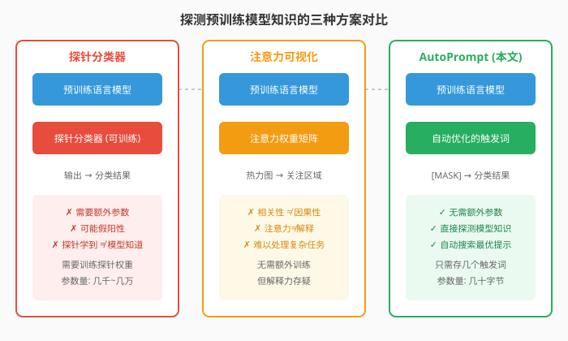
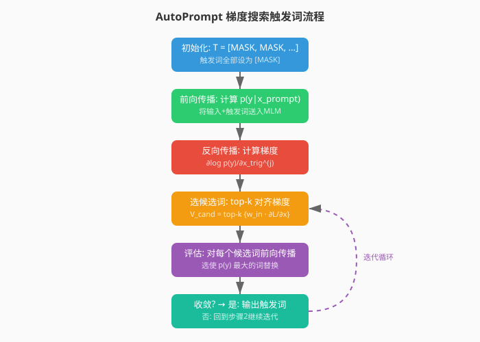
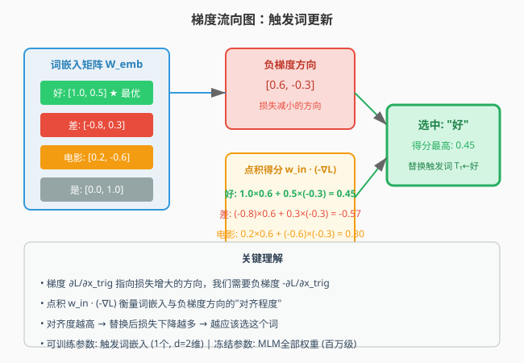
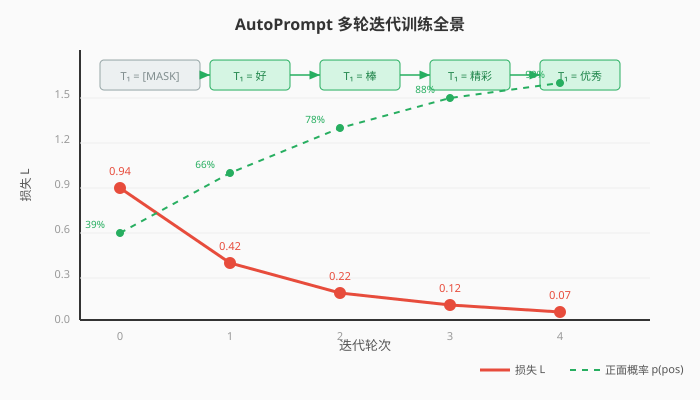
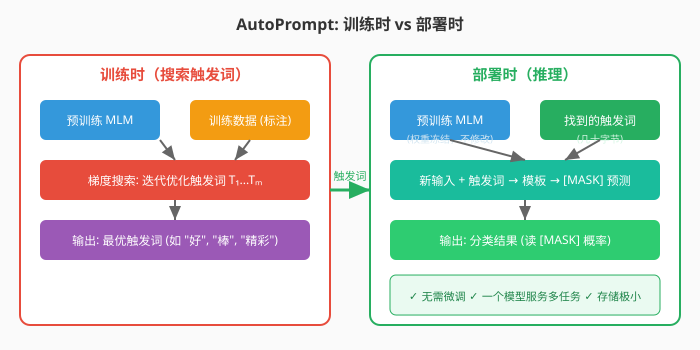
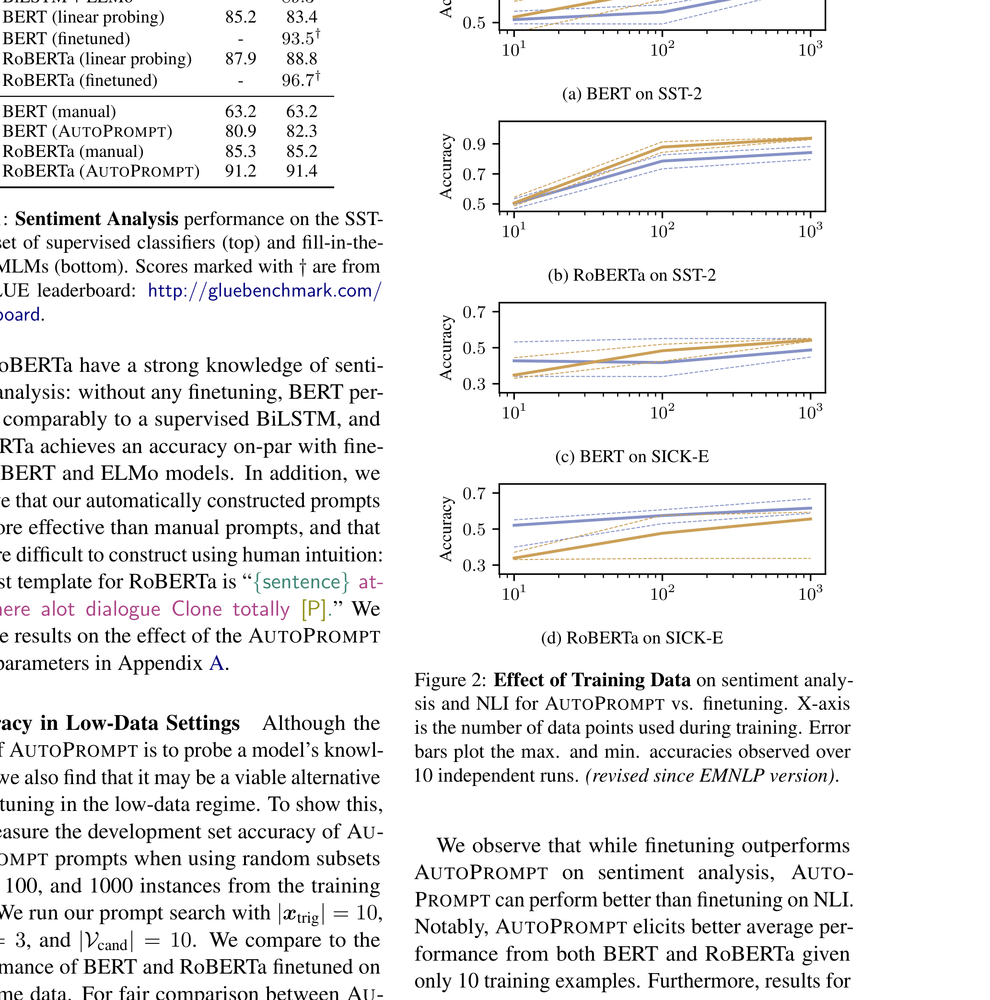

# AutoPrompt：用自动生成的提示从语言模型中激发知识

> **原文**: AutoPrompt: Eliciting Knowledge from Language Models with Automatically Generated Prompts
> **作者**: Taylor Shin, Yasaman Razeghi, Robert L. Logan IV, Eric Wallace, Sameer Singh
> **发表时间**: 2020年10月
> **arXiv**: https://arxiv.org/abs/2010.15980

---

## 一句话总结

这篇论文提出了一种**自动搜索提示词**的方法，让预训练语言模型不用微调就能做各种任务（情感分析、推理、知识问答），而且效果有时能媲美微调模型。

## 研究背景：为什么要做这个？

### 预训练模型到底"知道"什么？

想象你教一个学生读了整整一座图书馆的书（预训练），然后想知道他到底学到了什么。你怎么考他？

在自然语言处理领域，预训练语言模型（如 BERT、RoBERTa）在各类任务上表现惊人。但有一个根本问题：**模型的能力是来自预训练阶段学到的知识，还是来自针对具体任务微调时学到的？**

要回答这个问题，我们需要一种方法，能直接"拷问"模型，看看它预训练后本身就"知道"什么，而不是微调后才"学会"什么。

### 现有方案的问题

之前研究者主要用两种方法来探测模型知识：

1. **探针分类器（Probing Classifiers）**：在模型输出上加一个小型分类器，训练它预测某个属性（如词性、情感）。但问题在于，探针本身有可学习参数——高准确率可能是因为探针学到了东西，而不是模型本身知道。

2. **注意力可视化**：看模型注意力集中在哪些词上。但注意力分数只是相关性，不等于因果关系。

这两种方法都有"假阳性"风险，而且需要额外参数。

### 提示（Prompting）：更直接的探测方式

更自然的方式是直接把任务改写成**完形填空**的形式。比如想知道模型是否知道"巴黎是法国的首都"，可以问：

> "法国的首都是 [MASK]。"

如果模型填出"巴黎"，说明它确实知道。这种方法不需要额外参数，不修改模型权重，是对模型知识的**直接探测**。

但问题在于：**手动写提示词太费劲，而且效果高度依赖提示词的写法**。同一个意思，换几个词可能效果天差地别。

## 核心思路：这篇论文的"大招"是什么？

AutoPrompt 的核心想法很简单但很巧妙：**既然手动写提示词又累又难找最优的，那就用梯度来自动搜索提示词！**

具体来说：
- 给定一个任务模板，比如 `{句子} [T1] [T2] [T3] [MASK].`
- 其中 `[T1]`, `[T2]`, `[T3]` 是**触发词（trigger tokens）**，初始为 `[MASK]`
- 利用模型的**梯度信息**，迭代地把这些触发词替换成能让模型输出正确答案的真实单词
- 最终得到的提示词，就能让模型在**不微调**的情况下完成任务

这就像是用"反向传播"的思路来"反向构造"输入——不是调整模型参数来适应数据，而是调整输入中的触发词来让模型输出想要的结果。

![Figure 1: AutoPrompt 方法概览——输入句子通过模板与触发词组合，送入 MLM 预测 [MASK]，触发词通过梯度搜索自动优化](./resource/figure1_autoprompt_overview.png)

## 具体怎么做的？

### 1. 梯度引导的触发词搜索

这是 AutoPrompt 的核心算法。让我们一步步拆解。

#### 问题形式化

假设我们有一个分类任务，输入是 $x_{\text{inp}}$（比如一条影评"这部电影太棒了"），我们需要把它变成一个提示 $x_{\text{prompt}}$ 喂给掩码语言模型（MLM）。

模板 $\lambda$ 定义了怎么组合：
$$x_{\text{prompt}} = \lambda(x_{\text{inp}}, x_{\text{trig}})$$

其中 $x_{\text{trig}} = [T_1, T_2, \ldots, T_m]$ 是一组**共享的触发词**，对所有输入都一样。

MLM 会对 `[MASK]` 位置输出一个词表上的概率分布 $p(w \mid x_{\text{prompt}})$。

#### 类别概率：标签词集合

对于情感分析这种任务，"正面"可能对应多个词（好、棒、精彩...），所以我们需要定义**标签词集合** $V_y$，然后对集合内所有词的概率求和：

$$p(y \mid x_{\text{prompt}}) = \sum_{w \in V_y} p(w \mid x_{\text{prompt}})$$

#### 梯度搜索：怎么找最优触发词？

关键来了！AutoPrompt 用**梯度**来指导触发词的搜索：

对于第 $j$ 个触发词 $x_{\text{trig}}^{(j)}$，我们计算它对数似然的梯度：
$$\frac{\partial \log p(y \mid x_{\text{prompt}})}{\partial x_{\text{trig}}^{(j)}}$$

这个梯度告诉我们：**如果把第 $j$ 个触发词的嵌入向量往这个方向移动，会增大正确类别的概率。**

然后我们找词表里所有词 $w$，看哪个词的输入嵌入 $w_{\text{in}}$ 与梯度方向最"对齐"（点积最大）：
$$V_{\text{cand}} = \text{top-}k_w \left\{ w_{\text{in}}^T \cdot \frac{\partial \log p(y \mid x_{\text{prompt}})}{\partial x_{\text{trig}}^{(j)}} \right\}$$

从候选集 $V_{\text{cand}}$ 中选一个替换当前触发词，使得 $p(y \mid x_{\text{prompt}})$ 最大。

这个过程对每个触发词位置迭代进行，直到收敛。

### 2. 自动选择标签词

对于知识问答这种任务，标签就是实体名（比如"巴黎"），很直观。但对于情感分析、自然语言推理这种抽象类别，怎么知道哪些词代表"正面"或"矛盾"？

AutoPrompt 提出了一个两步法：

**Step 1**：先用 `[MASK]` 位置的上下文表示 $h^{(i)}$ 训练一个逻辑回归分类器：
$$p(y \mid h^{(i)}) = \text{softmax}(\gamma_y \cdot h^{(i)} + \beta_y)$$

**Step 2**：把 $h^{(i)}$ 替换成 MLM 输出词嵌入 $w_{\text{out}}$，计算每个词 $w$ 与类别 $y$ 的关联分数：
$$s(y, w) \propto \exp(w_{\text{out}} \cdot \gamma_y + \beta_y)$$

取分数最高的 $k$ 个词作为标签词集合：
$$V_y = \text{top-}k_w \{ s(y, w) \}$$

直观理解：既然 $h^{(i)}$ 能预测类别，而 $w_{\text{out}}$ 和 $h^{(i)}$ 在同一个空间里，那么与类别权重 $\gamma_y$ 方向接近的词嵌入，就是最能代表这个类别的词。

### 用一个具体例子走通全流程

让我们用一个极简的例子，手把手走通 AutoPrompt 的完整流程。

#### 场景设定

假设我们做一个极简的**二分类情感分析**：
- 词表大小：$|V| = 4$，只有 4 个词：`好`、`差`、`电影`、`是`
- 嵌入维度：$d = 2$（简化）
- 触发词数量：$m = 1$（只搜索 1 个触发词）
- 标签词集合：$V_{\text{pos}} = \{\text{好}\}$，$V_{\text{neg}} = \{\text{差}\}$

输入句子：$x_{\text{inp}} = \text{"电影"}$

模板：`{句子} [T] [MASK].` → 提示：`电影 [T] [MASK].`

初始触发词：$T_1 = \text{[MASK]}$，其嵌入初始化为零向量：
$$x_{\text{trig}}^{(1)} = \begin{bmatrix} 0 \\ 0 \end{bmatrix}$$

词嵌入矩阵（简化假设）：
$$W_{\text{emb}} = \begin{bmatrix} 1.0 & 0.5 \\ -0.8 & 0.3 \\ 0.2 & -0.6 \\ 0.0 & 1.0 \end{bmatrix} \begin{matrix} \leftarrow \text{好} \\ \leftarrow \text{差} \\ \leftarrow \text{电影} \\ \leftarrow \text{是} \end{matrix}$$

#### Step 1: 前向传播

将提示 `电影 [MASK] [MASK].` 送入 MLM。MLM 内部经过多层 Transformer 后，在 `[MASK]` 位置输出一个隐藏表示 $h$，然后通过输出投影得到词表上的 logits。

简化起见，假设 `[MASK]` 位置的 logits 为：
$$z = \begin{bmatrix} 0.5 \\ -0.3 \\ 0.1 \\ 0.2 \end{bmatrix} \begin{matrix} \leftarrow \text{好} \\ \leftarrow \text{差} \\ \leftarrow \text{电影} \\ \leftarrow \text{是} \end{matrix}$$

经过 softmax 得到概率：
$$p(w \mid x_{\text{prompt}}) = \text{softmax}(z) = \begin{bmatrix} 0.39 \\ 0.17 \\ 0.26 \\ 0.18 \end{bmatrix}$$

由于触发词初始为 `[MASK]`（零向量），模型没有额外引导，输出比较均匀。

假设正确标签是"正面"，则正面类别概率：
$$p(\text{pos} \mid x_{\text{prompt}}) = p(\text{好} \mid x_{\text{prompt}}) = 0.39$$

#### Step 2: 损失计算

我们想最大化正确类别的对数似然，所以损失函数为负对数似然：
$$\mathcal{L} = -\log p(y \mid x_{\text{prompt}}) = -\log(0.39) \approx 0.94$$

**直白翻译**：损失衡量的是"模型有多不确定"。损失越大，模型越没信心给出正确答案。我们的目标是通过修改触发词，让损失变小。

**与传统微调的区别**：
- 微调：改模型参数 $W$，让 $\mathcal{L}$ 变小
- AutoPrompt：改输入中的触发词 $x_{\text{trig}}$，让 $\mathcal{L}$ 变小

#### Step 3: 反向传播

计算损失对触发词嵌入的梯度：
$$\frac{\partial \mathcal{L}}{\partial x_{\text{trig}}^{(1)}} = \begin{bmatrix} -0.6 \\ 0.3 \end{bmatrix}$$

这个梯度的含义：**如果把触发词嵌入往 $[-0.6, 0.3]$ 方向移动，正面类别的概率会增大。**

现在我们计算词表中每个词与梯度的点积（一阶近似）：

$$\begin{aligned}
\text{好}: & \quad \begin{bmatrix} 1.0 & 0.5 \end{bmatrix} \cdot \begin{bmatrix} -0.6 \\ 0.3 \end{bmatrix} = -0.60 + 0.15 = -0.45 \\
\text{差}: & \quad \begin{bmatrix} -0.8 & 0.3 \end{bmatrix} \cdot \begin{bmatrix} -0.6 \\ 0.3 \end{bmatrix} = 0.48 + 0.09 = 0.57 \\
\text{电影}: & \quad \begin{bmatrix} 0.2 & -0.6 \end{bmatrix} \cdot \begin{bmatrix} -0.6 \\ 0.3 \end{bmatrix} = -0.12 - 0.18 = -0.30 \\
\text{是}: & \quad \begin{bmatrix} 0.0 & 1.0 \end{bmatrix} \cdot \begin{bmatrix} -0.6 \\ 0.3 \end{bmatrix} = 0.00 + 0.30 = 0.30
\end{aligned}$$

**等等！** 这里有个关键点需要理解：梯度 $\frac{\partial \mathcal{L}}{\partial x_{\text{trig}}}$ 指向损失**增大**的方向。我们要**减小**损失，所以应该找与**负梯度**方向对齐的词。

负梯度为 $-\frac{\partial \mathcal{L}}{\partial x_{\text{trig}}} = \begin{bmatrix} 0.6 \\ -0.3 \end{bmatrix}$，重新计算：

$$\begin{aligned}
\text{好}: & \quad \begin{bmatrix} 1.0 & 0.5 \end{bmatrix} \cdot \begin{bmatrix} 0.6 \\ -0.3 \end{bmatrix} = 0.60 - 0.15 = \mathbf{0.45} \\
\text{差}: & \quad \begin{bmatrix} -0.8 & 0.3 \end{bmatrix} \cdot \begin{bmatrix} 0.6 \\ -0.3 \end{bmatrix} = -0.48 - 0.09 = -0.57 \\
\text{电影}: & \quad \begin{bmatrix} 0.2 & -0.6 \end{bmatrix} \cdot \begin{bmatrix} 0.6 \\ -0.3 \end{bmatrix} = 0.12 + 0.18 = \mathbf{0.30} \\
\text{是}: & \quad \begin{bmatrix} 0.0 & 1.0 \end{bmatrix} \cdot \begin{bmatrix} 0.6 \\ -0.3 \end{bmatrix} = 0.00 - 0.30 = -0.30
\end{aligned}$$

得分最高的是"好"（0.45）！所以把触发词替换为"好"。

#### Step 3.5: 参数更新与下一轮迭代

**替换触发词**：$T_1 \leftarrow \text{好}$

**第二轮前向传播**：现在提示变成 `电影 好 [MASK].`

MLM 看到这个提示后，`[MASK]` 位置的 logits 变为：
$$z' = \begin{bmatrix} 1.2 \\ -0.5 \\ 0.0 \\ 0.1 \end{bmatrix}$$

$$p'(w \mid x_{\text{prompt}}) = \text{softmax}(z') = \begin{bmatrix} 0.66 \\ 0.12 \\ 0.18 \\ 0.04 \end{bmatrix}$$

正面概率：$p'(\text{pos}) = 0.66$

**验证训练在起作用**：

| 指标 | 第 1 轮（触发词=[MASK]） | 第 2 轮（触发词=好） | 变化 |
|------|------------------------|---------------------|------|
| 正面概率 | 0.39 | 0.66 | ↑ 69% |
| 损失 $\mathcal{L}$ | 0.94 | 0.42 | ↓ 55% |

损失从 0.94 降到 0.42，正面概率从 0.39 升到 0.66——触发词的修改确实在起作用！

**多轮迭代全景**：

> **小白tips**: 你可能注意到，AutoPrompt 的"参数更新"和传统训练不太一样。传统训练是更新模型权重（百万/千万级参数），而 AutoPrompt 更新的是输入中的几个触发词（通常 3-7 个词）。这就像不是去改造一台机器，而是找到最合适的"操作说明书"让机器发挥最大能力。

#### Step 4: 部署/推理

AutoPrompt 的一个巨大优势：**推理时不需要任何额外参数！**

找到最优触发词后，使用方式极其简单：
1. 把新输入套入模板，加上找到的触发词
2. 直接喂给**原始的、未修改的**预训练模型
3. 读取 `[MASK]` 位置的输出概率

这意味着：
- 一个预训练模型可以服务**无数个任务**，每个任务只需存几个触发词（几十字节）
- 不需要为每个任务保存一个微调后的模型副本（几百 MB 到几 GB）

## 效果怎么样？

### 情感分析：不微调也能很强

| 模型 | SST-2 测试集准确率 |
|------|-------------------|
| BiLSTM | 82.8% |
| BiLSTM + ELMo | 89.3% |
| BERT（线性探针） | 83.4% |
| BERT（微调） | 93.5% |
| RoBERTa（线性探针） | 88.8% |
| RoBERTa（微调） | 96.7% |
| BERT（手动提示） | 63.2% |
| **BERT（AutoPrompt）** | **82.3%** |
| RoBERTa（手动提示） | 85.2% |
| **RoBERTa（AutoPrompt）** | **91.4%** |

关键发现：
- AutoPrompt 生成的提示让 RoBERTa 达到 **91.4%** 准确率，超过了微调的 ELMo（89.3%）
- 手动提示只有 63-85%，远不如自动搜索
- RoBERTa 找到的最佳提示词：`"{句子} atmosphere alot dialogue Clone totally [MASK]."`——这些词对人类来说没什么意义，但对模型非常有效

### 自然语言推理（NLI）

| 模型 | SICK-E 3-way（平衡） | SICK-E 2-way |
|------|---------------------|--------------|
| 多数类基线 | 33.3% | 50.0% |
| BERT（微调） | 84.0% | 95.6% |
| **RoBERTa（AutoPrompt）** | **69.3%** | **87.3%** |

在二分类任务上，AutoPrompt 接近微调 BERT 的水平（87.3% vs 95.6%）。

### 知识检索（LAMA 基准）

| 提示类型 | MRR | P@10 | P@1 |
|---------|-----|------|-----|
| LAMA（手动） | 40.27 | 59.49 | 31.10 |
| LPAQA（挖掘，Top1） | 43.57 | 62.03 | 34.10 |
| **AutoPrompt（7 个触发词）** | **53.89** | **73.93** | **43.34** |

AutoPrompt 在 P@1 上比之前最好的方法高出 **9 个百分点**，而且只用一个提示 per relation，而 LPAQA 需要最多 30 个提示的集成。

### 关系抽取

| 模型 | 原始句子 P@1 | 扰动句子 P@1 |
|------|-------------|-------------|
| 监督 RE LSTM | 57.95 | 58.81 |
| BERT（LAMA 手动） | 69.06 | 28.02 |
| BERT（LPAQA） | 76.55 | 30.79 |
| **BERT（AutoPrompt）** | **90.73** | **56.43** |

AutoPrompt 让 BERT 在关系抽取上达到 **90.73%**，远超监督模型（57.95%）。

### 少数据场景：AutoPrompt 的杀手级优势

当训练数据很少时（10-100 条），AutoPrompt 不仅平均准确率更高，而且**方差更小**——微调经常会出现"失败运行"（随机种子不好就完全学不到），而 AutoPrompt 始终稳定。

## 论文的意义和局限

**主要贡献**：

1. **提出了第一个自动提示生成方法**：用梯度搜索替代手动设计提示词，大幅减少人工成本
2. **证明了预训练模型的内在能力**：不微调的情况下，MLM 就能做情感分析、NLI、知识检索，有时媲美微调模型
3. **少数据场景的实用优势**：数据少时比微调更稳定、更准确，且存储成本极低（只需存几个触发词）

**局限性**：

1. **需要标注数据**：虽然是"无参数"探测，但仍需要训练数据来指导触发词搜索
2. **提示词不可解释**：自动生成的触发词对人类来说往往没有语义意义（如 "atmosphere alot dialogue Clone totally"）
3. **某些任务效果差**：在 QQP（语义相似度）、RTE 等任务上，AutoPrompt 的效果接近随机
4. **贪心搜索的脆弱性**：在巨大的离散词空间中进行贪心搜索，容易陷入局部最优

## 读后感

AutoPrompt 是提示工程（Prompt Engineering）领域的**奠基性工作之一**。它首次系统地展示了：提示词不是"玄学"，而是可以用梯度来优化的。

这篇论文的重要性在于它**改变了我们使用预训练模型的方式**——从"为每个任务微调一个模型"转向"用一个模型 + 不同提示词服务多个任务"。这个思路直接启发了后续大量工作，包括 Prefix-Tuning、Prompt-Tuning、P-Tuning 等。

**初学者最应该记住的**：预训练语言模型本身就蕴含了大量知识，关键是怎么"问"它。AutoPrompt 告诉我们，"怎么问"这件事本身是可以自动学习的——而且学到的问法，往往比人类想的更好。
