# Batch Normalization：通过减少内部协变量偏移加速深度网络训练

> **原文**: Batch Normalization: Accelerating Deep Network Training by Reducing Internal Covariate Shift
> **作者**: Sergey Ioffe, Christian Szegedy (Google)
> **发表时间**: 2015-02-11
> **arXiv**: https://arxiv.org/abs/1502.03167

---

## 一句话总结

在神经网络每一层前面加一个"归一化"操作，把每层的输入强行拉到均值0、方差1的标准分布，让网络训练速度提升14倍，还能用更大的学习率、减少对初始化技巧的依赖。

## 研究背景：为什么要做这个？

### 深层网络训练的痛点

训练深度神经网络就像在一个不断变化的地形上找最低点。你用随机梯度下降（SGD）一步步往下走，但问题是——**你脚下的地形本身也在变**。

具体来说，网络中每一层的输入分布会随着前面层参数的更新而不断变化。这就像你在走一条路，但路面本身在不停地起伏变形，让你很难稳定地往前走。这种现象在机器学习中被称为**协变量偏移（Covariate Shift）**——当学习系统的输入分布发生变化时，系统就需要不断适应新分布，导致训练变慢。

作者把这种现象推广到网络内部，称之为**内部协变量偏移（Internal Covariate Shift, ICS）**：网络内部各层的激活值分布，在训练过程中不断变化。

### 内部协变量偏移带来的连锁反应

1. **必须用小学习率**：学习率稍大，参数变化就会放大，导致激活值分布剧烈漂移
2. **需要精心初始化**：权重初始化不好，激活值很容易进入饱和区
3. **激活函数饱和问题**：以 Sigmoid（S型函数，输出范围0-1）为例，当输入绝对值很大时，梯度趋近于0，网络几乎不学习
4. **深度越深问题越严重**：前面层的微小变化，经过多层传递后被不断放大

### 现有方案的问题

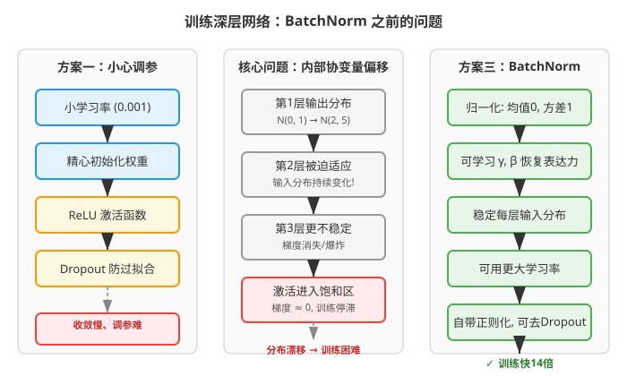

之前的做法都是"治标不治本"：
- **ReLU（Rectified Linear Unit，修正线性单元）**：解决了Sigmoid饱和问题，但没有解决分布漂移
- **小心初始化**（如Xavier初始化、He初始化）：只是起点好，训练过程中分布还是会漂移
- **小学习率**：训练慢得像蜗牛

## 核心思路：这篇论文的"大招"是什么？

作者提出了一个简单而优雅的方案：**Batch Normalization（批归一化，简称BN）**。

核心思想很直接——**既然每层输入分布不稳定是问题根源，那就强制把它稳定下来**。具体做法是：在每一层的线性变换之后、激活函数之前，插入一个归一化操作，把该层的输入强行拉到均值为0、方差为1的标准正态分布附近。

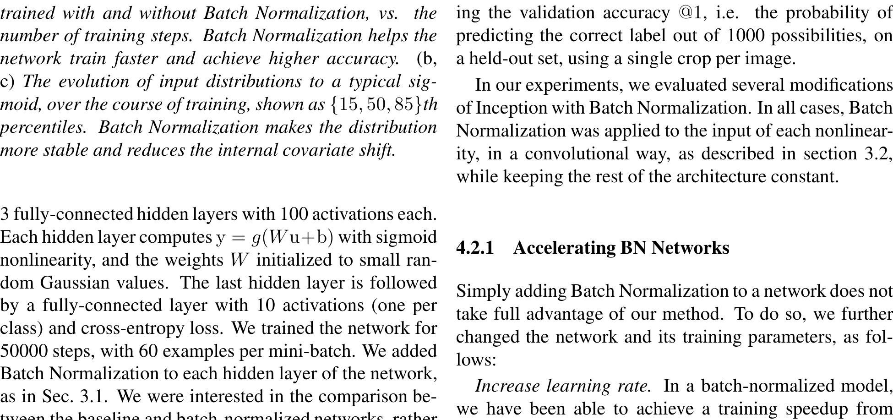

你可以把它想象成：每条河流（每层的输入）都有自己的水位和流速，BN 就像在每条河流上建了一个水闸，不管上游来水怎么变化，经过水闸后的水流都是平稳的。这样下游（下一层）就不用担心洪水或干旱了。

**关键洞察**：
- 用 mini-batch（小批量）的统计量来估计均值和方差，而不是全量数据
- 引入可学习的缩放参数 γ 和平移参数 β，让网络自己决定是否需要归一化
- 归一化操作本身是可微的，可以正常反向传播

## 具体怎么做的？

### Batch Normalization 算法

对于一个 mini-batch 中的 m 个样本，对某个激活值 x 进行如下操作：

**Step 1**: 计算 mini-batch 均值
$$\mu_B = \frac{1}{m}\sum_{i=1}^{m} x_i$$

**Step 2**: 计算 mini-batch 方差
$$\sigma_B^2 = \frac{1}{m}\sum_{i=1}^{m} (x_i - \mu_B)^2$$

**Step 3**: 归一化（减均值、除标准差）
$$\hat{x}_i = \frac{x_i - \mu_B}{\sqrt{\sigma_B^2 + \epsilon}}$$

其中 $\epsilon$ 是一个很小的常数（通常 $10^{-5}$），防止除零。

**Step 4**: 缩放和平移（恢复表达能力）
$$y_i = \gamma \hat{x}_i + \beta$$

γ 和 β 是可学习的参数，和网络的其他参数一起通过梯度下降更新。这一步至关重要——如果网络发现不归一化更好，它可以令 $\gamma = \sqrt{\sigma_B^2 + \epsilon}$，$\beta = \mu_B$，就完全恢复了原始激活值。

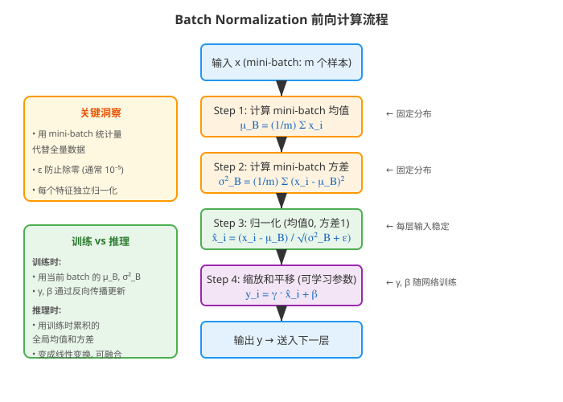

### 为什么需要 γ 和 β？

如果简单地把每层输入归一化到 N(0,1)，会限制网络的表达能力。比如对 Sigmoid 函数来说，归一化后的输入都被限制在0附近，也就是 Sigmoid 的线性区域，网络就失去了非线性拟合能力。

γ 和 β 的引入让 BN 变换可以表示恒等变换（identity transform），保证了网络的表达能力不会因归一化而降低。这就像是给归一化操作装了一个"旁路开关"——网络可以自己决定要用多少归一化。

### 卷积层的特殊处理

对于卷积层，BN 需要遵守**卷积的平移不变性**：同一个特征图（feature map）在不同位置应该用相同的归一化参数。

具体做法是：把一个 mini-batch 中某个特征图的**所有空间位置**的激活值放在一起计算均值和方差。如果 mini-batch 大小为 m，特征图大小为 p×q，那么有效样本量就是 m×p×q。每个特征图只学习一对 (γ, β)，而不是每个激活值一对。

### 训练时 vs 推理时

这是 BN 的一个重要设计：

**训练时**：
- 使用当前 mini-batch 的 μ_B 和 σ²_B 进行归一化
- 同时用移动平均（moving average）累积全局均值和方差

**推理时**：
- 使用训练时累积的全局均值和方差
- 此时 BN 变成一个确定性的线性变换：$y = \frac{\gamma}{\sqrt{\sigma^2 + \epsilon}}x + (\beta - \frac{\gamma\mu}{\sqrt{\sigma^2 + \epsilon}})$
- 这个线性变换可以和前面的权重矩阵融合，推理时没有额外计算开销！

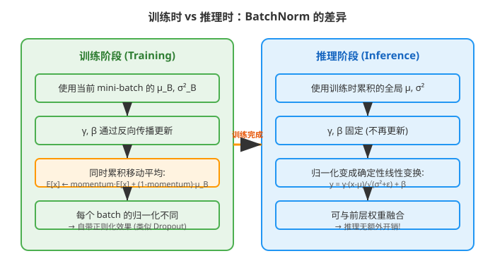

### BN 为什么能让学习率变大？

传统网络中，学习率太大会导致梯度爆炸或消失。BN 通过以下机制解决了这个问题：

1. **参数尺度不变性**：对某一层的权重 W 乘以常数 a，经过 BN 后输出不变（因为归一化会抵消这个缩放）
2. **梯度不依赖参数尺度**：可以证明 $\frac{\partial \ell}{\partial (aW)} = \frac{1}{a} \frac{\partial \ell}{\partial W}$，大权重反而产生小梯度，形成自我稳定
3. **雅可比矩阵的奇异值接近1**：这保证了反向传播时梯度大小不会被过度放大或缩小

### BN 的正则化效果

训练时，每个样本的归一化结果依赖于同一 batch 中的其他样本。这意味着同一个样本在不同 batch 中会得到不同的归一化结果，相当于给网络引入了噪声。这种噪声起到了类似 Dropout（随机失活——训练时随机将部分神经元输出置零，防止过拟合）的正则化效果，可以防止过拟合。

实验表明，使用 BN 的网络可以减少甚至去掉 Dropout。

### 反向传播：梯度怎么流？

BN 层的反向传播需要计算以下梯度：

$$\frac{\partial \ell}{\partial \hat{x}_i} = \frac{\partial \ell}{\partial y_i} \cdot \gamma$$

$$\frac{\partial \ell}{\partial \sigma_B^2} = \sum_{i=1}^{m} \frac{\partial \ell}{\partial \hat{x}_i} \cdot (x_i - \mu_B) \cdot \left(-\frac{1}{2}\right)(\sigma_B^2 + \epsilon)^{-3/2}$$

$$\frac{\partial \ell}{\partial \mu_B} = \left(\sum_{i=1}^{m} \frac{\partial \ell}{\partial \hat{x}_i} \cdot \frac{1}{\sqrt{\sigma_B^2 + \epsilon}}\right) + \frac{\partial \ell}{\partial \sigma_B^2} \cdot \sum_{i=1}^{m} \frac{-2(x_i - \mu_B)}{m}$$

$$\frac{\partial \ell}{\partial x_i} = \frac{\partial \ell}{\partial \hat{x}_i} \cdot \frac{1}{\sqrt{\sigma_B^2 + \epsilon}} + \frac{\partial \ell}{\partial \sigma_B^2} \cdot \frac{2(x_i - \mu_B)}{m} + \frac{\partial \ell}{\partial \mu_B} \cdot \frac{1}{m}$$

$$\frac{\partial \ell}{\partial \gamma} = \sum_{i=1}^{m} \frac{\partial \ell}{\partial y_i} \cdot \hat{x}_i$$

$$\frac{\partial \ell}{\partial \beta} = \sum_{i=1}^{m} \frac{\partial \ell}{\partial y_i}$$

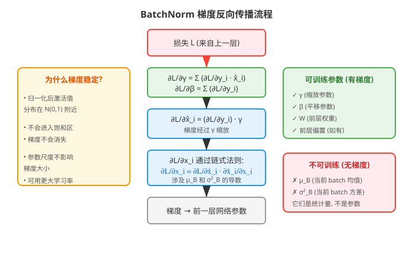

## 用一个具体例子走通全流程

### 场景设定

假设我们有一个极简的全连接层，输入维度为2，mini-batch 大小为3。

**输入数据**（3个样本，每个2维）：
$$X = \begin{bmatrix} 2.0 & 4.0 \\ 6.0 & 8.0 \\ 4.0 & 10.0 \end{bmatrix}$$

**初始参数**：$\gamma = 1.0$，$\beta = 0.0$（初始化）

我们只看第一个特征维度（第一列）：$x = [2.0, 6.0, 4.0]^T$

### Step 1: 前向传播

**计算均值**：
$$\mu_B = \frac{2.0 + 6.0 + 4.0}{3} = 4.0$$

**计算方差**：
$$\sigma_B^2 = \frac{(2.0-4.0)^2 + (6.0-4.0)^2 + (4.0-4.0)^2}{3} = \frac{4 + 4 + 0}{3} = 2.667$$

**归一化**（取 $\epsilon = 10^{-5}$）：
$$\hat{x}_1 = \frac{2.0 - 4.0}{\sqrt{2.667 + 0.00001}} = \frac{-2.0}{1.633} = -1.225$$
$$\hat{x}_2 = \frac{6.0 - 4.0}{\sqrt{2.667 + 0.00001}} = \frac{2.0}{1.633} = 1.225$$
$$\hat{x}_3 = \frac{4.0 - 4.0}{\sqrt{2.667 + 0.00001}} = \frac{0.0}{1.633} = 0.000$$

**缩放和平移**（γ=1, β=0）：
$$y_1 = 1.0 \times (-1.225) + 0.0 = -1.225$$
$$y_2 = 1.0 \times 1.225 + 0.0 = 1.225$$
$$y_3 = 1.0 \times 0.000 + 0.0 = 0.000$$

> 验证：归一化后的均值为0，方差为1（近似）。$\frac{-1.225 + 1.225 + 0}{3} = 0$ ✓

### Step 2: 损失计算

假设经过后续网络后，我们得到损失 $\mathcal{L}$，并且从后一层传回来的梯度为：
$$\frac{\partial \mathcal{L}}{\partial y} = [0.3, -0.2, 0.1]^T$$

使用均方误差（Mean Squared Error，预测值与真实值差值的平方均值）作为损失函数：
$$\mathcal{L} = \frac{1}{2}\sum_{i=1}^{m}(y_i - t_i)^2$$

其中 $t_i$ 是目标值。这个损失函数的含义是：让网络的输出 $y_i$ 尽可能接近目标值 $t_i$。

**BN 与传统方法的优化目标区别**：
- 传统方法：直接优化 $W$ 使得输出接近目标，但中间层分布不断变化
- BN 方法：优化目标相同，但通过归一化让中间层分布稳定，优化路径更平滑

### Step 3: 反向传播

**计算 γ 的梯度**：
$$\frac{\partial \mathcal{L}}{\partial \gamma} = \sum_{i=1}^{3} \frac{\partial \mathcal{L}}{\partial y_i} \cdot \hat{x}_i = 0.3 \times (-1.225) + (-0.2) \times 1.225 + 0.1 \times 0.000 = -0.3675 - 0.245 + 0 = -0.6125$$

**计算 β 的梯度**：
$$\frac{\partial \mathcal{L}}{\partial \beta} = \sum_{i=1}^{3} \frac{\partial \mathcal{L}}{\partial y_i} = 0.3 + (-0.2) + 0.1 = 0.2$$

**计算归一化值的梯度**：
$$\frac{\partial \mathcal{L}}{\partial \hat{x}_i} = \frac{\partial \mathcal{L}}{\partial y_i} \cdot \gamma = \frac{\partial \mathcal{L}}{\partial y_i} \times 1.0$$
$$\frac{\partial \mathcal{L}}{\partial \hat{x}} = [0.3, -0.2, 0.1]^T$$

**计算方差的梯度**：
$$\frac{\partial \mathcal{L}}{\partial \sigma_B^2} = \sum_{i=1}^{3} \frac{\partial \mathcal{L}}{\partial \hat{x}_i} \cdot (x_i - \mu_B) \cdot \left(-\frac{1}{2}\right)(\sigma_B^2 + \epsilon)^{-3/2}$$
$$= [0.3 \times (-2.0) + (-0.2) \times 2.0 + 0.1 \times 0.0] \times \left(-\frac{1}{2}\right) \times (2.667)^{-1.5}$$
$$= [-0.6 - 0.4 + 0] \times (-0.5) \times 0.2297 = (-1.0) \times (-0.5) \times 0.2297 = 0.1148$$

**计算均值的梯度**：
$$\frac{\partial \mathcal{L}}{\partial \mu_B} = \left(\sum_{i=1}^{3} \frac{\partial \mathcal{L}}{\partial \hat{x}_i}\right) \cdot \frac{1}{\sqrt{\sigma_B^2 + \epsilon}} + \frac{\partial \mathcal{L}}{\partial \sigma_B^2} \cdot \sum_{i=1}^{3} \frac{-2(x_i - \mu_B)}{3}$$
$$= (0.3 - 0.2 + 0.1) \times \frac{1}{1.633} + 0.1148 \times \frac{-2(-2.0 + 2.0 + 0.0)}{3}$$
$$= 0.2 \times 0.612 + 0.1148 \times 0 = 0.1225$$

**计算输入的梯度**（传给前一层）：
$$\frac{\partial \mathcal{L}}{\partial x_1} = 0.3 \times \frac{1}{1.633} + 0.1148 \times \frac{2 \times (-2.0)}{3} + 0.1225 \times \frac{1}{3}$$
$$= 0.1837 + 0.1148 \times (-1.333) + 0.0408 = 0.1837 - 0.1531 + 0.0408 = 0.0714$$

类似地可以算出 $\frac{\partial \mathcal{L}}{\partial x_2}$ 和 $\frac{\partial \mathcal{L}}{\partial x_3}$。

### Step 3.5: 参数更新与下一轮迭代

**参数更新**（以 SGD 为例，学习率 $\eta = 0.1$）：

$$\gamma_{\text{new}} = \gamma - \eta \cdot \frac{\partial \mathcal{L}}{\partial \gamma} = 1.0 - 0.1 \times (-0.6125) = 1.0 + 0.0613 = 1.0613$$

$$\beta_{\text{new}} = \beta - \eta \cdot \frac{\partial \mathcal{L}}{\partial \beta} = 0.0 - 0.1 \times 0.2 = -0.02$$

> **通俗理解**：梯度指向损失增大的方向，减去梯度就是在让损失变小。学习率控制每一步走多远——太大容易走过头，太小走得太慢。BN 的好处是允许我们用更大的学习率而不会"走过头"。

**第二轮前向传播**（用更新后的参数）：

用同样的输入 $x = [2.0, 6.0, 4.0]^T$，归一化结果不变（因为 μ_B 和 σ²_B 只依赖输入）：
$$\hat{x} = [-1.225, 1.225, 0.000]^T$$

新的输出：
$$y_1^{\text{new}} = 1.0613 \times (-1.225) + (-0.02) = -1.2999 - 0.02 = -1.320$$
$$y_2^{\text{new}} = 1.0613 \times 1.225 + (-0.02) = 1.3001 - 0.02 = 1.280$$
$$y_3^{\text{new}} = 1.0613 \times 0.000 + (-0.02) = -0.02$$

**验证训练在起作用**：

| 分量 | 第1轮输出 | 第2轮输出 | 梯度方向 | 趋势 |
|------|----------|----------|---------|------|
| y₁ | -1.225 | -1.320 | 正梯度0.3 → 需要减小 | ✓ 减小了 |
| y₂ | 1.225 | 1.280 | 负梯度-0.2 → 需要增大 | ✓ 增大了 |
| y₃ | 0.000 | -0.020 | 正梯度0.1 → 需要减小 | ✓ 减小了 |

可以看到，每个输出分量都朝着梯度指示的方向移动了，说明训练在起作用。

**多轮训练全景图**：

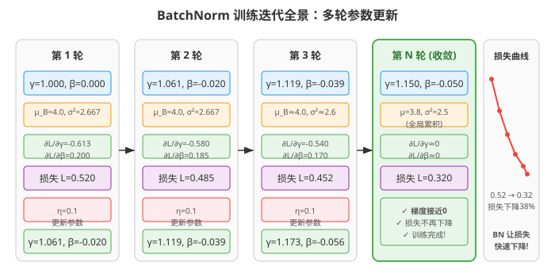

### Step 4: 部署/推理

推理时，不再使用 mini-batch 统计量，而是用训练时累积的全局均值和方差。

假设训练结束后累积的全局统计量为：
- 全局均值：$\mu = 3.8$
- 全局方差：$\sigma^2 = 2.5$
- 学习到的参数：$\gamma = 1.15$，$\beta = -0.05$

对于一个新的输入 $x_{\text{new}} = 5.0$：

$$y_{\text{new}} = \gamma \cdot \frac{x_{\text{new}} - \mu}{\sqrt{\sigma^2 + \epsilon}} + \beta = 1.15 \cdot \frac{5.0 - 3.8}{\sqrt{2.5 + 10^{-5}}} + (-0.05)$$
$$= 1.15 \cdot \frac{1.2}{1.581} - 0.05 = 1.15 \times 0.759 - 0.05 = 0.873 - 0.05 = 0.823$$

**关键优势**：推理时的 BN 是一个线性变换，可以和前面的权重矩阵融合：

$$y = \frac{\gamma}{\sqrt{\sigma^2 + \epsilon}} \cdot x + \left(\beta - \frac{\gamma \mu}{\sqrt{\sigma^2 + \epsilon}}\right) = W_{\text{fused}} \cdot x + b_{\text{fused}}$$

这意味着部署时完全没有 BN 的额外计算开销！

> **小白tips**: BN 最反直觉的地方是"训练和推理用不同的统计量"。训练时用当前 batch 的均值方差，是因为这样引入了噪声（正则化效果）；推理时用全局均值方差，是因为推理时可能只有一个样本，没法算 batch 统计量。这个设计既保证了训练效果，又保证了推理效率。

## 效果怎么样？

### 实验1：MNIST 上的验证

作者先用一个简单的3层全连接网络（每层100个Sigmoid神经元）在 MNIST 手写数字数据集上验证了 BN 的效果。

**关键发现**：
- 使用 BN 的网络收敛更快，最终测试精度更高
- BN 让 Sigmoid 的输入分布保持稳定（图c），而没有 BN 的分布漂移严重（图b）

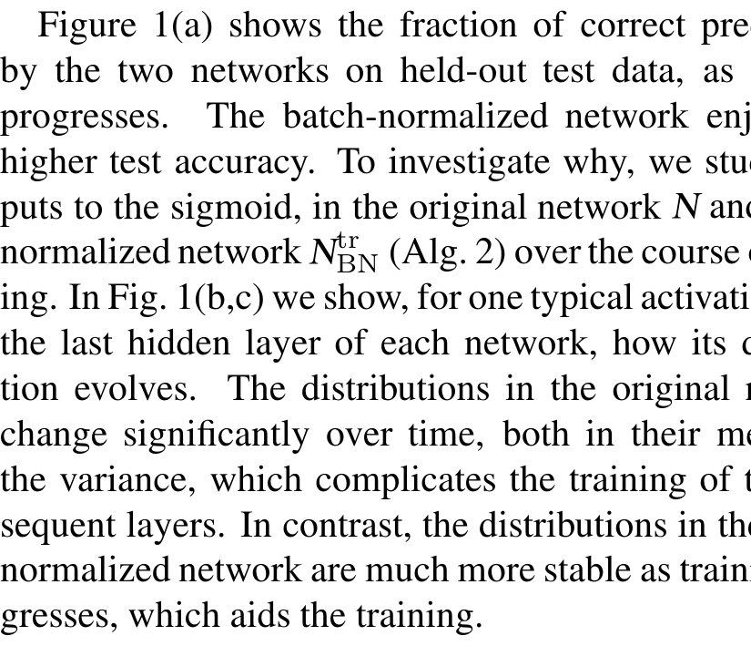

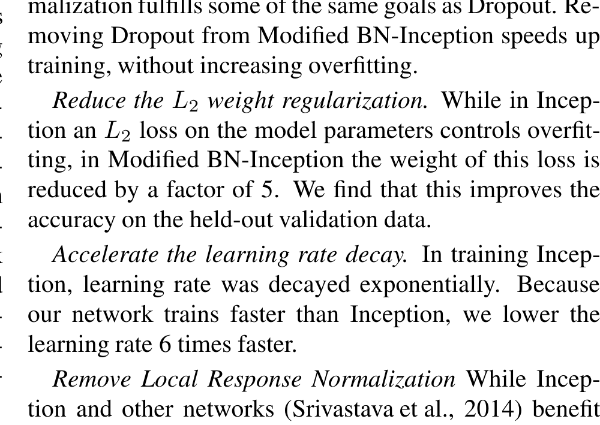

### 实验2：ImageNet 上的大规模实验

作者将 BN 应用到 Inception 网络（当时最先进的图像分类模型之一）上，在 ImageNet 数据集（1000类图像分类）上进行了大规模实验。

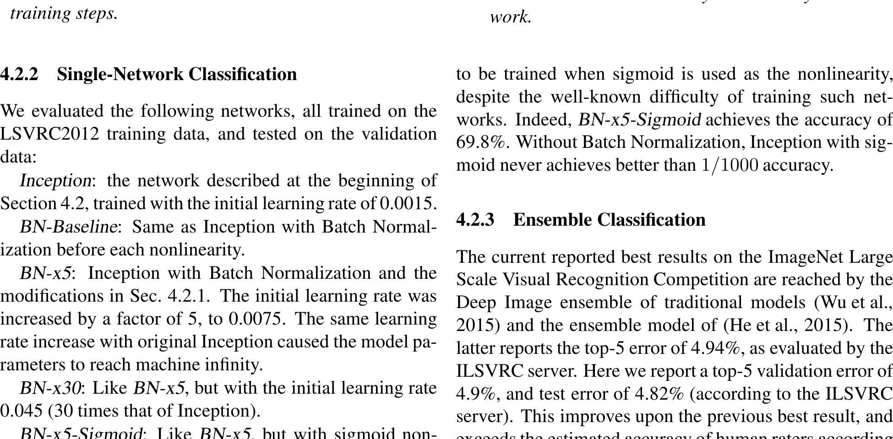

**实验配置对比**：

| 模型 | 达到72.2%精度所需步数 | 最高精度 |
|------|---------------------|---------|
| Inception（基准） | 31.0×10⁶ | 72.2% |
| BN-Baseline（仅加BN） | 13.3×10⁶ | 72.7% |
| BN-x5（BN + 5倍学习率） | 2.1×10⁶ | 73.0% |
| BN-x30（BN + 30倍学习率） | 2.7×10⁶ | **74.8%** |
| BN-x5-Sigmoid（BN + Sigmoid） | - | 69.8% |

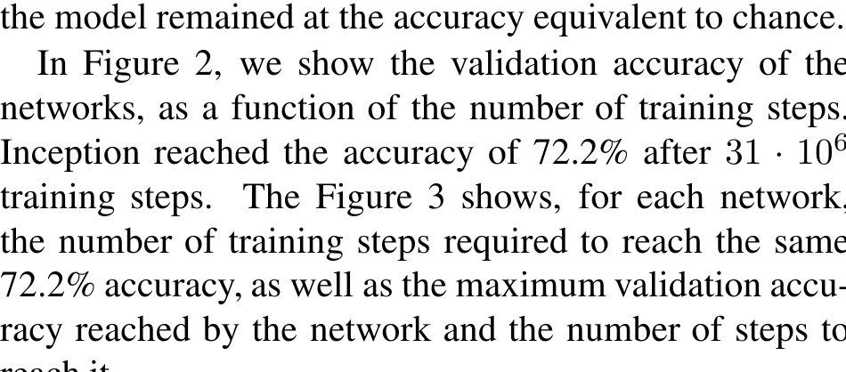

**关键发现**：
1. **仅加 BN 就快了一倍多**：BN-Baseline 用不到一半的步数就达到了基准精度
2. **提高学习率效果显著**：BN-x5 只需要 1/14 的步数就达到了基准精度
3. **30倍学习率达到最高精度**：BN-x30 用 5 倍少的步数达到了 74.8% 的精度（比基准高 2.6%）
4. **BN 让 Sigmoid 也能训练**：没有 BN 时，Inception+Sigmoid 的精度等同于随机猜测（1/1000）；有了 BN 后达到了 69.8%

### 实验3：刷新 ImageNet 记录

使用6个 BN-Inception 网络的集成（ensemble，多个模型预测结果取平均），作者达到了：
- **Top-5 验证误差：4.9%**
- **Top-5 测试误差：4.82%**

这超越了当时所有已发表的结果，也超过了人类标注者的估计准确率。

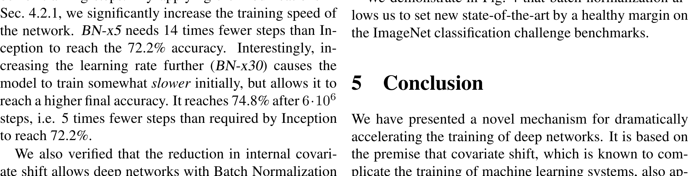

## 论文的意义和局限

**主要贡献**：

1. **提出了内部协变量偏移的概念**：将协变量偏移的概念从整个学习系统推广到网络内部的每一层，为理解深度网络训练困难提供了新的视角
2. **Batch Normalization 算法**：一个简单、有效、通用的归一化方法，只需在现有网络中插入几行代码
3. **实验验证充分**：从 MNIST 小实验到 ImageNet 大规模实验，从加速训练到提升精度，从 Sigmoid 到 ReLU，全方位验证了方法的有效性
4. **附带好处多**：允许更大学习率、减少对初始化的依赖、自带正则化效果、可以使用饱和激活函数

**局限性**：

1. **依赖 batch size**：batch size 太小时，统计量估计不准确，BN 效果会打折扣（这在后来的论文中被广泛讨论）
2. **RNN 中的应用未探索**：论文提到未来工作包括将 BN 应用到循环神经网络（Recurrent Neural Network，RNN——处理序列数据的网络），但本文没有涉及
3. **理论分析不足**：论文承认 BN 对梯度传播的精确影响还需要进一步的理论研究
4. **推理时的统计量估计**：用移动平均估计全局统计量可能不够准确，特别是在训练不充分的情况下

## 读后感

Batch Normalization 是深度学习历史上最具影响力的论文之一。它的重要性不在于技术有多复杂——算法本身只有4行公式——而在于它解决了一个根本性的问题：**让深度网络的训练变得可控和可预测**。

在 BN 之前，训练深度网络像是一门"玄学"：学习率要调、初始化要调、激活函数要选，稍有不慎就训练失败。BN 之后，这些问题大部分被自动解决了。它让研究者可以把精力放在网络架构设计上，而不是整天调参。

这篇论文对后续研究的影响是深远的：
- 直接启发了 Layer Normalization（层归一化）、Group Normalization（组归一化）、Instance Normalization（实例归一化）等一系列归一化方法
- 成为了几乎所有现代深度学习架构（ResNet、Transformer 等）的标准组件
- 改变了人们训练深度网络的思维方式

**初学者最应该记住的**：BN 的核心思想就是"稳定每层的输入分布"。这个简单的想法带来了训练速度、模型精度、调参难度等多方面的全面改善。理解 BN 是理解现代深度学习架构的基础。
