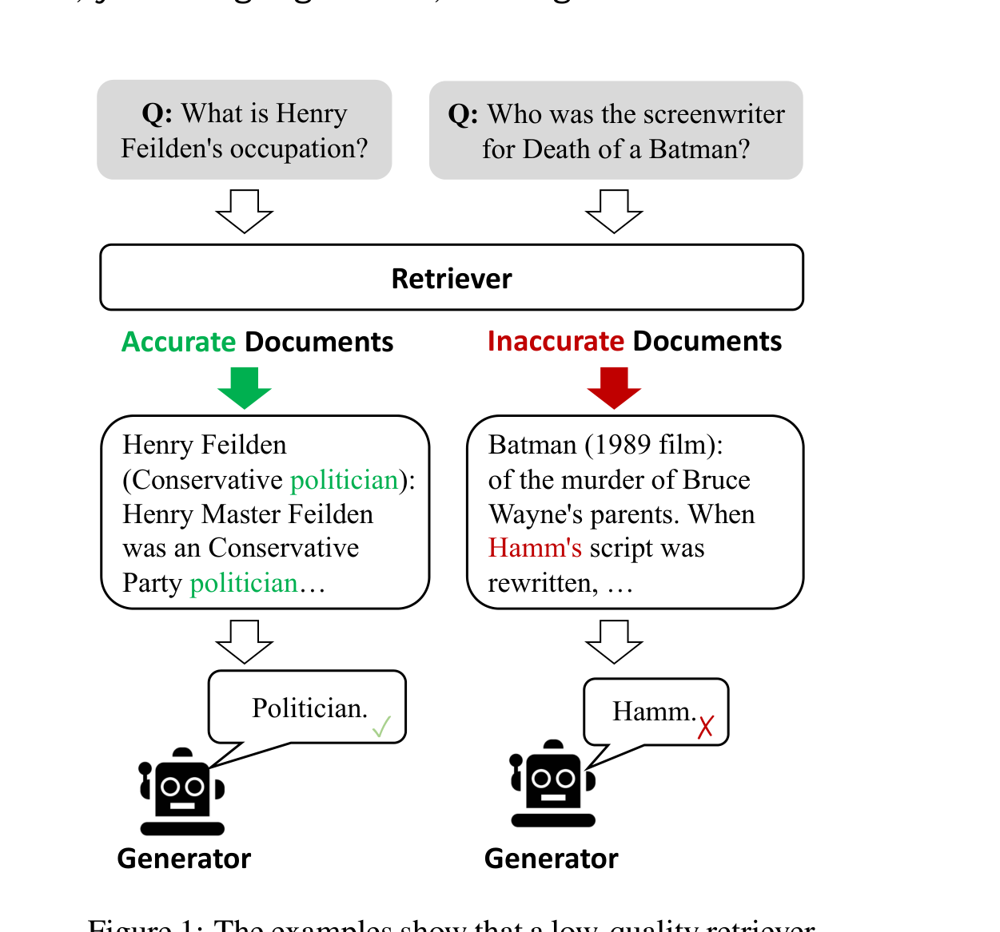
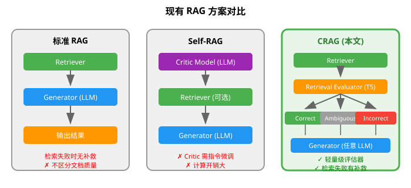
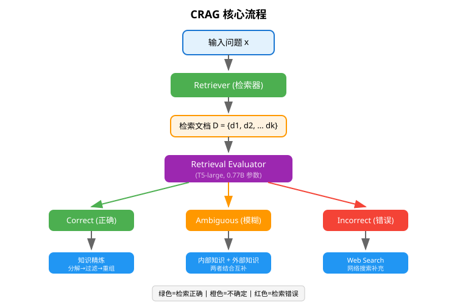
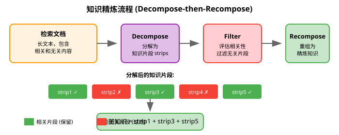
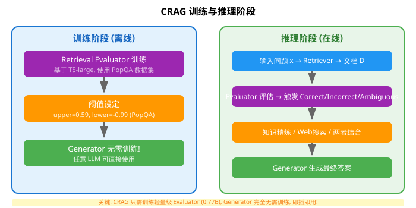
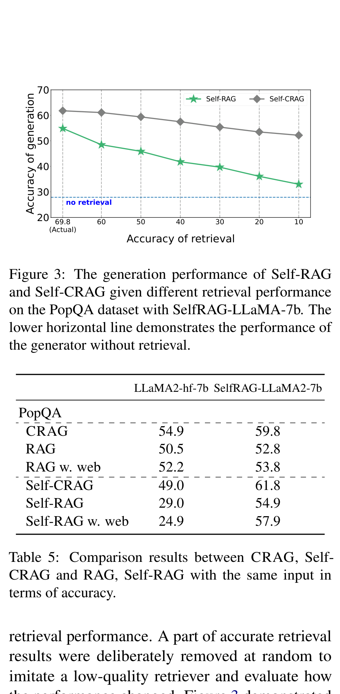

# 纠正性检索增强生成

> **原文**: Corrective Retrieval Augmented Generation
> **作者**: Shi-Qi Yan, Jia-Chen Gu, Yun Zhu, Zhen-Hua Ling
> **发表时间**: 2024年1月 (arXiv:2401.15884v3)
> **arXiv**: https://arxiv.org/abs/2401.15884

---

## 一句话总结

给 RAG（检索增强生成）系统加一个"质检员"，当检索到的资料不靠谱时，能自动切换到网络搜索来补救，让大模型回答问题更准确。

## 研究背景：为什么要做这个？

### 大模型的"幻觉"问题

想象一下，你让一个知识渊博但记忆力有限的人回答问题。如果问题在他熟悉的领域，他能答得很好；但如果问题超出了他的知识范围，他可能会**编造答案**——这就是大语言模型（LLM）的"幻觉"（Hallucination）问题。

为了解决这个问题，研究者提出了 **RAG（Retrieval-Augmented Generation，检索增强生成）** 技术：在回答问题前，先从外部知识库（如维基百科）检索相关资料，然后把资料和问题一起喂给大模型。这就像给人一本参考书再让他答题。

### 但 RAG 有个致命弱点

RAG 的效果**高度依赖检索质量**。如果检索器找错了资料，会发生什么？



如上图所示：
- **左侧（检索正确）**：问"Henry Feilden 的职业是什么？"，检索到了正确的政治家资料，模型回答正确 ✓
- **右侧（检索错误）**：问"Death of a Batman 的编剧是谁？"，检索到了不相关的 Batman 1989 电影资料，模型被误导回答"Hamm" ✗

**关键问题**：现有的 RAG 系统会**无条件信任**检索到的文档，不管它们是否相关。当检索失败时，系统不仅无法获得正确答案，反而可能被错误信息误导，产生更严重的幻觉。

### 现有方案的问题



| 方案 | 优点 | 缺点 |
|------|------|------|
| **标准 RAG** | 简单直接 | 检索失败时无补救机制 |
| **Self-RAG** | 能判断是否需要检索 | Critic 模型需要指令微调，计算开销大，且不能更换底层 LLM |
| **CRAG (本文)** | 轻量级、即插即用 | 需要额外训练评估器 |

## 核心思路：这篇论文的"大招"是什么？

论文提出了 **CRAG（Corrective Retrieval Augmented Generation，纠正性检索增强生成）**，核心思想是：**在检索和使用文档之间，加一个"质检环节"**。



具体来说：
1. **检索评估器（Retrieval Evaluator）**：用一个轻量级模型（T5-large，仅 0.77B 参数）评估检索到的文档质量
2. **三种纠正动作**：根据评估结果触发不同策略
   - **Correct（正确）**：检索质量高 → 对文档进行精炼后使用
   - **Incorrect（错误）**：检索质量差 → 丢弃检索结果，改用网络搜索
   - **Ambiguous（模糊）**：不确定 → 同时使用精炼后的内部知识和网络搜索知识
3. **知识精炼**：把长文档分解成小片段，过滤掉无关内容，只保留关键信息

**关键 insight**：与其让大模型自己判断检索质量（如 Self-RAG 那样），不如用一个专门的轻量级模型来做这件事，这样既高效又灵活。

## 具体怎么做的？

### 1. 检索评估器（Retrieval Evaluator）

这是 CRAG 的核心组件。它的工作是：给定一个问题 $x$ 和一个检索到的文档 $d_i$，评估它们的相关性。

**技术细节**：
- 使用 **T5-large** 预训练模型（770M 参数，远小于主流 LLM 的 7B+ 参数）
- 在 PopQA 数据集上微调，学习判断文档是否能回答问题
- 对每个检索到的文档单独评分，分数范围 $[-1, 1]$

**数学表达**：

对于检索到的 $K$ 个文档 $D = \{d_1, d_2, ..., d_K\}$，评估器对每个文档计算相关性分数：

$$
\text{score}_i = E(x, d_i), \quad i = 1, 2, ..., K
$$

其中 $E$ 是评估器模型。

### 2. 三种纠正动作（Action Trigger）

根据评估分数，系统设定两个阈值（上阈值 $\theta_{\text{upper}}$ 和下阈值 $\theta_{\text{lower}}$）来决定采取什么行动：

| 条件 | 动作 | 含义 |
|------|------|------|
| $\max(\text{score}_i) > \theta_{\text{upper}}$ | **Correct** | 至少有一个文档相关，进行知识精炼 |
| $\forall i, \text{score}_i < \theta_{\text{lower}}$ | **Incorrect** | 所有文档都不相关，改用网络搜索 |
| 其他情况 | **Ambiguous** | 不确定，两者结合 |

> **为什么需要 Ambiguous？** 初步实验发现，只用 Correct 和 Incorrect 两种动作时，系统性能很容易受评估器准确率影响。加入 Ambiguous 作为"缓冲"，能显著降低对评估器精度的依赖。

### 3. 知识精炼（Knowledge Refinement）

当触发 **Correct** 动作时，系统不会直接使用原始文档，而是进行"分解-过滤-重组"：



**具体步骤**：
1. **Decompose（分解）**：将长文档切分成多个知识片段（strips），每个片段包含 1-2 句话
2. **Filter（过滤）**：用同一个评估器对每个片段打分，过滤掉低分片段
3. **Recompose（重组）**：将高分片段按顺序拼接，形成精炼后的内部知识 $k_{\text{in}}$

### 4. 网络搜索（Web Search）

当触发 **Incorrect** 动作时，系统会：
1. 用 ChatGPT 将问题重写为搜索关键词（如 "Henry Feilden, occupation"）
2. 调用 Google Search API 获取相关网页链接
3. 优先选择 Wikipedia 等权威来源
4. 提取网页内容，同样用评估器筛选相关知识，形成外部知识 $k_{\text{ex}}$

### 5. 整体算法流程

```
Algorithm 1: CRAG 推理流程
输入: x (问题), D = {d1, d2, ..., dk} (检索文档)
输出: y (生成的回答)

1. score_i = E 评估每个 (x, di) 的相关性
2. Confidence = 根据 {score1, ..., scorek} 给出最终判断
   // Confidence 有三种可能: [CORRECT], [INCORRECT], [AMBIGUOUS]
3. if Confidence == [CORRECT] then
4.     k = Knowledge_Refine(x, D)  // 知识精炼
5. else if Confidence == [INCORRECT] then
6.     k = Web_Search(Rewrite(x))  // 网络搜索
7. else if Confidence == [AMBIGUOUS] then
8.     k = Knowledge_Refine(x, D) + Web_Search(Rewrite(x))  // 两者结合
9. end
10. G 根据 x 和 k 生成回答 y
```

### 方法在整体架构中的位置



**重要特点**：
- **训练阶段**：只需训练轻量级的 Retrieval Evaluator（基于 T5-large）
- **推理阶段**：Generator（生成器）可以是**任意 LLM**，无需任何微调
- 这就是为什么说 CRAG 是 **plug-and-play（即插即用）** 的

### 用一个具体例子走通全流程

让我们用一个简化例子来理解 CRAG 是如何工作的。

#### 场景设定

假设用户问：**"Henry Feilden 的职业是什么？"**

系统配置：
- 检索器返回 $K=3$ 个文档
- 评估器阈值：$\theta_{\text{upper}} = 0.59$, $\theta_{\text{lower}} = -0.99$
- 生成器：LLaMA2-7B

#### Step 1: 检索与评估

检索器返回 3 个文档：
- $d_1$: "Henry Feilden (Conservative politician): Henry Master Feilden was a Conservative Party politician..."
- $d_2$: "Feilden Clegg Bradley Studios is an architectural practice..."
- $d_3$: "List of Conservative Party politicians..."

评估器对每个文档打分：
- $\text{score}_1 = 0.85$（高度相关）
- $\text{score}_2 = -0.72$（不相关）
- $\text{score}_3 = 0.45$（部分相关）

#### Step 2: 动作触发

判断：$\max(0.85, -0.72, 0.45) = 0.85 > 0.59 = \theta_{\text{upper}}$

→ 触发 **Correct** 动作

#### Step 3: 知识精炼

对 $d_1$ 进行分解-过滤-重组：

分解后的片段：
- strip1: "Henry Feilden (Conservative politician)" → score = 0.90 ✓
- strip2: "Henry Master Feilden was a Conservative Party politician" → score = 0.88 ✓
- strip3: "He served as MP for North Cornwall from 1997 to 2015" → score = 0.65 ✓
- strip4: "The building was designed in 2005" → score = -0.80 ✗ (无关)

重组后的内部知识：
$$
k_{\text{in}} = \text{strip1} + \text{strip2} + \text{strip3}
$$

#### Step 4: 生成回答

将问题和精炼后的知识一起输入生成器：

$$
P(y|x) = G(x, k_{\text{in}})
$$

生成器输出：**"Politician（政治家）"** ✓

#### 对比：如果没有 CRAG

如果直接用原始检索结果（包含无关文档 $d_2$），生成器可能会被干扰，尤其是在文档很长、无关信息很多的情况下。

### 训练过程详解

#### 评估器训练

Retrieval Evaluator 的训练数据来自 PopQA 数据集：
- **正样本**：问题 + 能回答该问题的维基百科段落（标签 = 1）
- **负样本**：问题 + 随机采样的不相关段落（标签 = -1）

训练目标是最小化交叉熵损失：

$$
\mathcal{L} = -\sum_{i} [y_i \log(\hat{y}_i) + (1-y_i) \log(1-\hat{y}_i)]
$$

其中 $y_i \in \{-1, 1\}$ 是真实标签，$\hat{y}_i$ 是模型预测分数。

#### 评估器 vs ChatGPT

论文对比了训练的 T5 评估器和直接用 ChatGPT 做评估的效果：

| 评估方法 | 准确率 |
|----------|--------|
| **CRAG 评估器 (T5-based)** | **84.3%** |
| ChatGPT (直接) | 58.0% |
| ChatGPT (CoT) | 62.4% |
| ChatGPT (few-shot) | 64.7% |

**结论**：专门训练的轻量级模型在评估检索质量上，反而比通用大模型表现更好！

## 效果怎么样？

### 各方法对比总览

论文在 4 个数据集上进行了实验：

| 数据集 | 任务类型 | 评价指标 |
|--------|----------|----------|
| PopQA | 短文本生成（实体问答） | 准确率 |
| Biography | 长文本生成（人物传记） | FactScore |
| PubHealth | 是非题（健康领域） | 准确率 |
| Arc-Challenge | 选择题（科学常识） | 准确率 |

**核心结果**（基于 SelfRAG-LLaMA2-7b 生成器）：

| 方法 | PopQA | Biography | PubHealth | Arc-Challenge |
|------|-------|-----------|-----------|---------------|
| RAG | 52.8 | 59.2 | 39.0 | 53.2 |
| **CRAG** | **59.8** | **74.1** | **75.6** | **68.6** |
| Self-RAG | 54.9 | 81.2 | 72.4 | 67.3 |
| **Self-CRAG** | **61.8** | **86.2** | **74.8** | **67.2** |

**关键发现**：
1. CRAG 相比标准 RAG 提升显著：PopQA +7.0%，Biography +14.9%，PubHealth +36.6%，Arc-Challenge +15.4%
2. CRAG 可以无缝集成到 Self-RAG 中（即 Self-CRAG），进一步提升性能
3. CRAG 对生成器的要求更低：Self-RAG 换用普通 LLaMA2 时性能大幅下降，而 CRAG 仍能保持竞争力

### 鲁棒性分析



上图展示了当检索质量下降时（横轴从 69.8% 降到 10%），Self-RAG 和 Self-CRAG 的生成准确率变化：

- **Self-RAG（绿色）**：检索质量下降时，生成性能快速下降
- **Self-CRAG（灰色）**：下降更平缓，表现出更强的鲁棒性
- **蓝色虚线**：不使用检索时的基线性能

**结论**：CRAG 的纠正机制能有效缓解检索质量下降带来的负面影响。

### 消融实验

| 移除的组件 | PopQA 准确率 (LLaMA2-hf-7b) | PopQA 准确率 (SelfRAG-LLaMA2-7b) |
|------------|----------------------------|----------------------------------|
| **完整 CRAG** | **54.9** | **59.8** |
| 移除 Correct | 53.2 | 58.3 |
| 移除 Incorrect | 54.4 | 59.5 |
| 移除 Ambiguous | 54.0 | 59.0 |
| 移除知识精炼 | 49.8 | 54.2 |
| 移除查询重写 | 51.7 | 56.2 |
| 移除知识选择 | 50.9 | 58.6 |

**结论**：每个组件都对最终性能有贡献，移除任何一个都会导致性能下降。

### 计算开销

| 方法 | TFLOPs/token | 执行时间 (秒/实例) |
|------|--------------|-------------------|
| RAG | 26.5 | 0.363 |
| CRAG | 27.2 | 0.512 |
| Self-RAG | 26.5~132.4 | 0.741 |
| Self-CRAG | 27.2~80.2 | 0.908 |

CRAG 只增加了约 2.7% 的计算开销，远低于 Self-RAG 的波动范围。

## 论文的意义和局限

### 主要贡献

1. **首次研究检索失败场景**：据作者所知，这是第一篇专门研究"检索出错时怎么办"的 RAG 论文
2. **提出即插即用的纠正框架**：CRAG 可以无缝集成到各种 RAG 系统中，无需修改生成器
3. **轻量级设计**：只需训练 0.77B 参数的评估器，远低于 Self-RAG 需要的 7B+ 参数 Critic 模型

### 局限性

1. **需要额外训练评估器**：虽然参数量小，但仍需要针对特定任务微调
2. **依赖外部搜索 API**：Incorrect 动作需要调用 Google Search 等外部服务
3. **阈值需要经验设定**：不同数据集需要手动调整上下阈值
4. **未来方向**：作者提到，如何让 LLM 自身具备检索评估能力（而不是依赖外部评估器）是未来研究方向

## 读后感

**这篇论文为什么重要？**
RAG 是目前大模型落地应用最广泛的技术之一，但"检索失败怎么办"这个问题一直被忽视。CRAG 第一次系统地解决了这个问题，为 RAG 的鲁棒性提升提供了新思路。

**对后续研究的影响？**
CRAG 的"评估-纠正"范式可以启发更多 RAG 改进工作。后续研究可能会探索：让 LLM 自己学会评估检索质量、更智能的网络搜索策略、多轮交互式检索等方向。

**初学者最应该记住什么？**
- RAG 不是万能的，检索质量直接决定生成质量
- 给系统加一个"质检环节"，能显著提升鲁棒性
- 不一定需要大模型来做所有事，轻量级专用模型有时更有效
