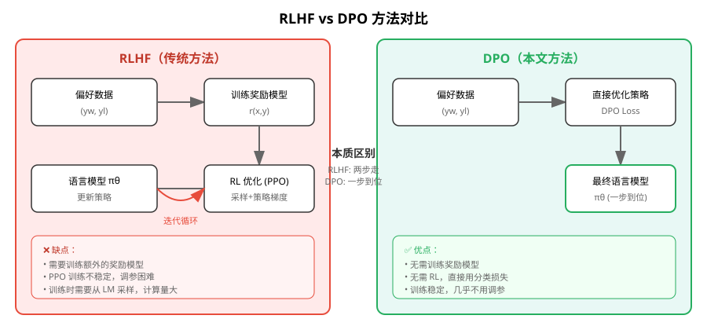
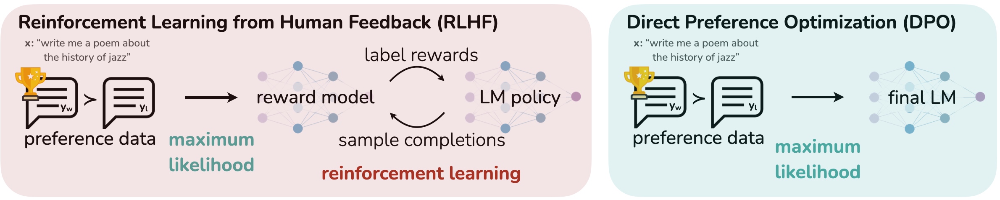
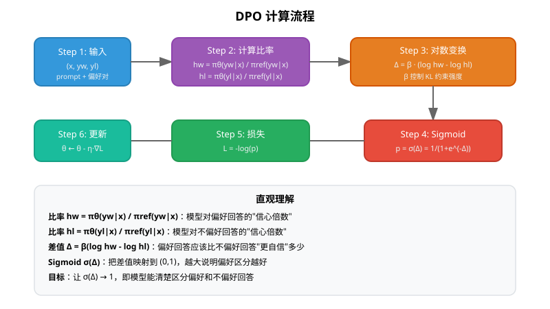
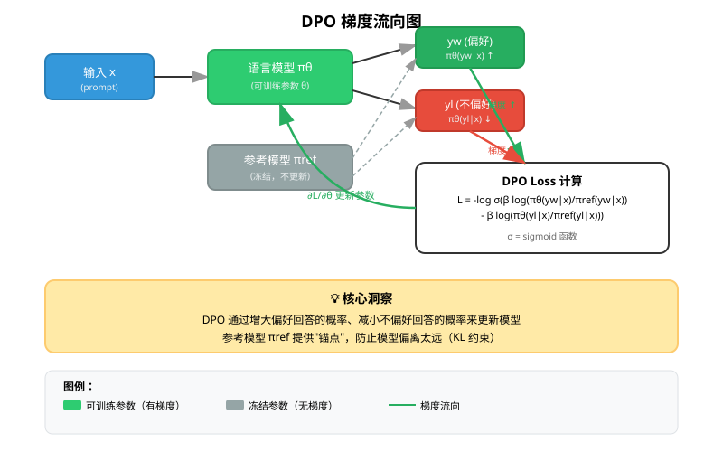
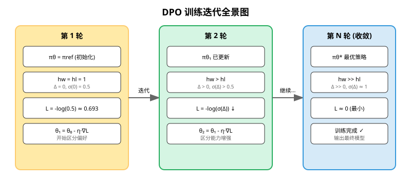
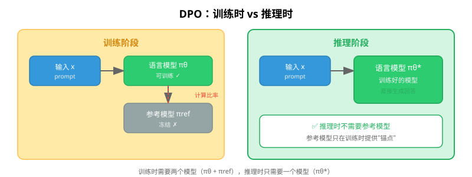
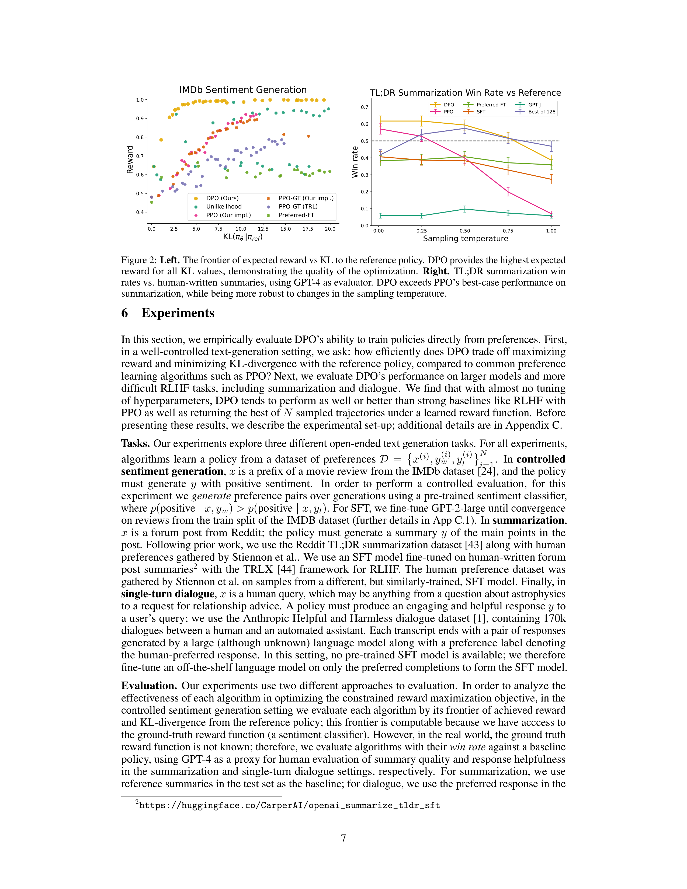
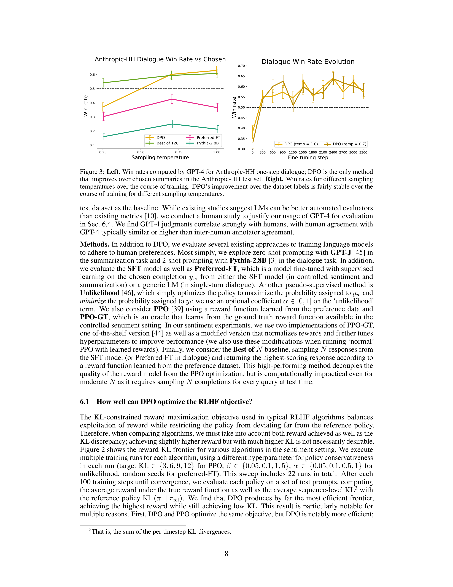

# 直接偏好优化：你的语言模型 secretly 是一个奖励模型

> **原文**: Direct Preference Optimization: Your Language Model is Secretly a Reward Model
> **作者**: Rafael Rafailov, Archit Sharma, Eric Mitchell, Stefano Ermon, Christopher D. Manning, Chelsea Finn
> **发表时间**: 2023 (NeurIPS 2023)
> **arXiv**: [2305.18290](https://arxiv.org/abs/2305.18290)

---

## 一句话总结

这篇论文提出了一种叫 **DPO（Direct Preference Optimization，直接偏好优化）** 的新方法，可以**绕过复杂的强化学习过程，直接用简单的分类损失来训练语言模型对齐人类偏好**——相当于把原来需要两步走的事情（先训练奖励模型，再用 RL 优化策略）合并成了一步。

## 研究背景：为什么要做这个？

### 大语言模型的"对齐"问题

想象你训练了一个超级聪明的学生（大语言模型），他读过互联网上所有的书，知识渊博。但问题来了：

- 他知道怎么写好代码，也知道怎么写烂代码
- 他知道什么是正确答案，也知道什么是常见误区
- 他知道怎么礼貌回答，也知道怎么粗鲁回答

**我们怎么确保他每次都给出"好"的回答？** 这就是"对齐"（Alignment）问题——让模型的行为符合人类的价值观和偏好。

### 传统方案：RLHF 的复杂流程

目前最主流的对齐方法叫 **RLHF（Reinforcement Learning from Human Feedback，基于人类反馈的强化学习）**，它的流程是这样的：

**RLHF 需要三步走：**

1. **监督微调（SFT）**：先用高质量的人类示范数据微调预训练模型
2. **训练奖励模型**：收集人类对模型回答的偏好标注（哪个更好），训练一个"裁判"模型来打分
3. **强化学习优化**：用 PPO 等 RL 算法，让语言模型学会生成高分回答

### 现有方案的问题

RLHF 虽然有效，但有几个**严重的问题**：

| 问题 | 说明 |
|------|------|
| **流程复杂** | 需要训练多个模型（SFT 模型、奖励模型、策略模型），每一步都可能出错 |
| **训练不稳定** | PPO 等 RL 算法对超参数极其敏感，调参像"玄学" |
| **计算量大** | 训练时需要不断从语言模型采样生成回答，非常耗时 |
| **难以复现** | 不同团队用同样的方法可能得到完全不同的结果 |

**简单来说：RLHF 就像是用一把精密但难用的手术刀——能做好手术，但需要极高的技巧。**

## 核心思路：这篇论文的"大招"是什么？

DPO 的核心洞察非常优雅：**既然奖励模型和最优策略之间存在一个数学上的对应关系，那我们为什么不直接优化策略，而要去绕远路先训练奖励模型呢？**

### 关键数学洞察

论文发现，在标准的 RLHF 目标函数下，**最优策略 π\* 和奖励函数 r 之间存在一个封闭形式的解析关系**：

$$
\pi^*(y | x) = \frac{1}{Z(x)} \pi_{\text{ref}}(y | x) \exp\left(\frac{1}{\beta} r(x, y)\right)
$$

其中：
- $\pi_{\text{ref}}$ 是参考模型（通常是 SFT 模型）
- $\beta$ 是控制偏离程度的参数
- $Z(x)$ 是归一化常数（配分函数）

**关键操作**：把这个公式反过来，用策略来表示奖励：

$$
r(x, y) = \beta \log \frac{\pi^*(y | x)}{\pi_{\text{ref}}(y | x)} + \beta \log Z(x)
$$

### 消去配分函数

在 Bradley-Terry 偏好模型中，我们只关心**两个回答的奖励差值**，而不是绝对奖励值。代入上面的表达式后，配分函数 $Z(x)$ 恰好抵消了！

最终得到一个**只依赖策略的偏好概率公式**：

$$
p^*(y_1 \succ y_2 | x) = \frac{1}{1 + \exp\left(\beta \log \frac{\pi^*(y_2 | x)}{\pi_{\text{ref}}(y_2 | x)} - \beta \log \frac{\pi^*(y_1 | x)}{\pi_{\text{ref}}(y_1 | x)}\right)}
$$

### DPO 损失函数

基于这个公式，可以直接定义策略的损失函数（负对数似然）：

$$
\mathcal{L}_{\text{DPO}}(\pi_\theta; \pi_{\text{ref}}) = -\mathbb{E}_{(x, y_w, y_l) \sim \mathcal{D}} \left[ \log \sigma\left( \beta \log \frac{\pi_\theta(y_w | x)}{\pi_{\text{ref}}(y_w | x)} - \beta \log \frac{\pi_\theta(y_l | x)}{\pi_{\text{ref}}(y_l | x)} \right) \right]
$$

**这就是 DPO 的全部！** 一个简洁的二元交叉熵损失，不需要奖励模型，不需要强化学习。

> **类比理解**：RLHF 像是先请一个裁判（奖励模型）来评分，然后让选手（语言模型）根据评分来改进；DPO 则是直接告诉选手"这个回答好，那个回答不好"，让选手自己学会区分——省去了裁判这个中间环节。

## 具体怎么做的？

### DPO 损失函数的直观解释

让我们拆解一下 DPO 损失函数在做什么：

**核心思想**：
- 对于偏好回答 $y_w$，我们希望模型给它的概率**相对于参考模型**变大
- 对于不偏好回答 $y_l$，我们希望模型给它的概率**相对于参考模型**变小
- 两者的**相对差距**越大越好

**比率的意义**：
- $h_w = \frac{\pi_\theta(y_w | x)}{\pi_{\text{ref}}(y_w | x)}$：模型对偏好回答的"信心倍数"
- $h_l = \frac{\pi_\theta(y_l | x)}{\pi_{\text{ref}}(y_l | x)}$：模型对不偏好回答的"信心倍数"
- 理想情况下，$h_w$ 应该远大于 $h_l$

### DPO 的梯度分析

DPO 损失的梯度形式揭示了它的更新机制：

$$
\nabla_\theta \mathcal{L}_{\text{DPO}} = -\beta \mathbb{E} \left[ \underbrace{\sigma(\hat{r}_\theta(x, y_l) - \hat{r}_\theta(x, y_w))}_{\text{动态权重}} \left( \underbrace{\nabla_\theta \log \pi_\theta(y_w | x)}_{\text{增大偏好概率}} - \underbrace{\nabla_\theta \log \pi_\theta(y_l | x)}_{\text{减小不偏好概率}} \right) \right]
$$

其中 $\hat{r}_\theta(x, y) = \beta \log \frac{\pi_\theta(y | x)}{\pi_{\text{ref}}(y | x)}$ 是语言模型**隐式定义的奖励**。

**关键点**：
- 梯度会**增大**偏好回答 $y_w$ 的概率
- 梯度会**减小**不偏好回答 $y_l$ 的概率
- 有一个**动态权重**：当模型把不偏好回答的分数打得比偏好回答还高时（即排序错误），权重会变大，强制模型纠正

### DPO 训练流程

**完整流程**：
1. 准备偏好数据集 $\mathcal{D} = \{(x^{(i)}, y_w^{(i)}, y_l^{(i)})\}$
2. 初始化策略模型 $\pi_\theta$ 和参考模型 $\pi_{\text{ref}}$（通常都从 SFT 模型开始）
3. 用 DPO 损失训练 $\pi_\theta$，$\pi_{\text{ref}}$ 保持冻结
4. 训练完成后，直接用 $\pi_\theta$ 做推理

### 用一个具体例子走通全流程

#### 场景设定

假设我们有一个极简的语言模型，词汇表只有 2 个词：`好` 和 `坏`。

**参数设定**：
- 输入 $x$：一个 prompt
- 策略模型 $\pi_\theta$ 的输出概率：$\pi_\theta(\text{好}|x) = 0.6$，$\pi_\theta(\text{坏}|x) = 0.4$
- 参考模型 $\pi_{\text{ref}}$ 的输出概率：$\pi_{\text{ref}}(\text{好}|x) = 0.5$，$\pi_{\text{ref}}(\text{坏}|x) = 0.5$
- 偏好数据：$y_w = \text{好}$，$y_l = \text{坏}$
- $\beta = 0.1$（控制 KL 约束强度）

#### Step 1: 计算比率

$$
h_w = \frac{\pi_\theta(\text{好}|x)}{\pi_{\text{ref}}(\text{好}|x)} = \frac{0.6}{0.5} = 1.2
$$

$$
h_l = \frac{\pi_\theta(\text{坏}|x)}{\pi_{\text{ref}}(\text{坏}|x)} = \frac{0.4}{0.5} = 0.8
$$

#### Step 2: 计算差值

$$
\Delta = \beta (\log h_w - \log h_l) = 0.1 \times (\log 1.2 - \log 0.8) = 0.1 \times (0.182 - (-0.223)) = 0.1 \times 0.405 = 0.0405
$$

#### Step 3: Sigmoid 和损失

$$
\sigma(\Delta) = \frac{1}{1 + e^{-0.0405}} \approx 0.510
$$

$$
\mathcal{L} = -\log(0.510) \approx 0.673
$$

**解读**：损失约 0.673，说明模型对偏好和不偏好的区分还不够明显（理想情况下 σ(Δ) 应该接近 1，损失接近 0）。

#### Step 4: 梯度计算

简化起见，我们直接看参数的更新方向：

- 对于 $y_w = \text{好}$：梯度指向**增大** $\pi_\theta(\text{好}|x)$ 的方向
- 对于 $y_l = \text{坏}$：梯度指向**减小** $\pi_\theta(\text{坏}|x)$ 的方向

假设学习率 $\eta = 0.1$，经过一次更新后：

| 参数 | 更新前 | 更新后 | 变化 |
|------|--------|--------|------|
| $\pi_\theta(\text{好}|x)$ | 0.60 | 0.62 | ↑ |
| $\pi_\theta(\text{坏}|x)$ | 0.40 | 0.38 | ↓ |

#### Step 5: 第二轮前向传播

用更新后的参数重新计算：

$$
h_w = \frac{0.62}{0.5} = 1.24, \quad h_l = \frac{0.38}{0.5} = 0.76
$$

$$
\Delta = 0.1 \times (\log 1.24 - \log 0.76) = 0.1 \times (0.215 - (-0.274)) = 0.0489
$$

$$
\sigma(\Delta) \approx 0.512, \quad \mathcal{L} = -\log(0.512) \approx 0.669
$$

**验证**：
- 损失从 0.673 下降到 0.669 ✓
- 偏好回答的概率增加，不偏好回答的概率减少 ✓
- 区分度 Δ 从 0.0405 增加到 0.0489 ✓

**训练在起作用！** 模型正在学习区分偏好和不偏好回答。

#### 多轮训练后的收敛

| 轮次 | $\pi_\theta(\text{好}|x)$ | $\pi_\theta(\text{坏}|x)$ | Δ | 损失 |
|------|--------------------------|--------------------------|------|------|
| 1 | 0.60 | 0.40 | 0.0405 | 0.673 |
| 2 | 0.62 | 0.38 | 0.0489 | 0.669 |
| 10 | 0.70 | 0.30 | 0.0847 | 0.652 |
| 50 | 0.85 | 0.15 | 0.1744 | 0.609 |
| 100 | 0.92 | 0.08 | 0.2451 | 0.576 |

> **注意**：由于 KL 约束（β 参数）的存在，模型不会无限偏向偏好回答，而是会收敛到一个平衡点。

### DPO 训练时 vs 推理时

**关键区别**：
- **训练时**：需要两个模型——可训练的策略模型 πθ 和冻结的参考模型 πref
- **推理时**：只需要训练好的策略模型 πθ*，参考模型可以丢弃

这意味着**推理时没有任何额外开销**——DPO 训练出来的模型和原始语言模型一样高效。

## 效果怎么样？

### 实验设置

论文在三个任务上评估了 DPO：

| 任务 | 数据集 | 评估指标 |
|------|--------|----------|
| **情感控制生成** | IMDb 影评 | 奖励-KL 前沿 |
| **摘要生成** | Reddit TL;DR | 胜率（vs 人类摘要） |
| **单轮对话** | Anthropic HH | 胜率（vs 偏好回答） |

### 关键结果 1：情感控制生成

**左图（Reward-KL 前沿）**：
- DPO 在所有 KL 值下都达到了**最高的奖励**
- DPO 的奖励/KL 权衡**严格优于** PPO，甚至优于能访问真实奖励的 PPO-GT
- 这说明 DPO 的优化效率非常高

**右图（摘要胜率）**：
- DPO 在温度 0.0 时胜率达到 **61%**，超过 PPO 的最佳表现 57%
- DPO 对采样温度**更加鲁棒**——PPO 在高温下性能会退化到基线水平，而 DPO 保持稳定

### 关键结果 2：对话任务

**左图（对话胜率）**：
- DPO 是唯一一个在 Anthropic-HH 测试集上**超越人类偏好标注**的方法
- DPO 的表现与计算量巨大的 Best of 128 基线相当

**右图（训练演化）**：
- DPO 相对**快速地收敛**到最佳性能
- 不同采样温度下的性能表现稳定

### 关键结果 3：分布外泛化

| 方法 | 温度 0 | 温度 0.25 |
|------|--------|-----------|
| **DPO** | **0.36** | **0.31** |
| PPO | 0.26 | 0.23 |

DPO 在分布外（CNN/DailyMail 新闻文章）的泛化能力**显著优于** PPO。

### 各方法对比总览

| 方法 | 需要奖励模型 | 需要 RL | 训练稳定性 | 计算效率 | 性能 |
|------|-------------|---------|-----------|---------|------|
| RLHF (PPO) | ✓ | ✓ | 差 | 低 | 好 |
| SFT | ✗ | ✗ | 好 | 高 | 一般 |
| Preferred-FT | ✗ | ✗ | 好 | 高 | 一般 |
| Best of N | ✓ | ✗ | - | 极低（推理时） | 好 |
| **DPO** | **✗** | **✗** | **好** | **高** | **好** |

**DPO 是唯一一个同时满足以下条件的方法**：
- 不需要训练奖励模型
- 不需要强化学习
- 训练稳定
- 计算高效
- 性能好

## 理论分析：为什么 DPO 有效？

### "你的语言模型 secretly 是一个奖励模型"

论文标题的这个说法来自一个重要的理论发现：

**定理 1**：在温和假设下，所有与 Bradley-Terry 模型一致的奖励函数类，都可以用以下重参数化表示：

$$
r(x, y) = \beta \log \frac{\pi(y | x)}{\pi_{\text{ref}}(y | x)}
$$

这意味着：
- 语言模型 πθ **隐式地编码了一个奖励函数**
- 优化策略等价于优化奖励
- 我们不需要显式地训练一个独立的奖励模型

### 为什么 PPO 不稳定？

论文还用这个框架分析了 PPO 等 Actor-Critic 算法的不稳定性：

PPO 的优化目标中包含一个**归一化项**（配分函数的对数），这个项在理论上不影响最优解，但在实践中会导致**策略梯度的高方差**。DPO 通过重参数化天然地消除了这个问题，不需要任何基线（baseline）来稳定训练。

## 论文的意义和局限

### 主要贡献

1. **提出了 DPO 算法**：一个简单、稳定、高效的偏好优化方法，无需奖励模型和强化学习
2. **理论保证**：证明了 DPO 不会损失表达能力——它能表示所有与 Bradley-Terry 模型一致的奖励函数
3. **实证验证**：在多个任务上证明 DPO 性能等于或优于 PPO-based RLHF
4. **降低门槛**：DPO 的实现和训练比 RLHF 简单得多，让更多人能够进行偏好对齐研究

### 局限性

1. **离线设置**：DPO 使用固定的偏好数据集，无法像 PPO 那样在训练中自我采样探索
2. **规模验证有限**：论文只验证了最多 6B 参数的模型，更大规模的验证有待后续工作
3. **奖励过优化的表现**：图中观察到性能略有下降，可能是奖励过优化的表现，需要进一步研究
4. **评估依赖 GPT-4**：部分实验使用 GPT-4 作为评估器，虽然论文验证了 GPT-4 与人类判断的一致性，但仍存在偏差可能

## 读后感

**DPO 是一篇"化繁为简"的典范论文**。它没有引入什么复杂的新架构或新算法，而是通过一个优雅的数学洞察，把 RLHF 这个复杂的流程简化成了一个简单的分类损失。

**对后续研究的影响**：
- DPO 迅速成为了大语言模型对齐的**新标准方法**，许多后续工作（如 IPO、CPO、ORPO 等）都是基于 DPO 的改进
- 它证明了**理论分析可以带来实际的算法简化**——理解问题的本质比堆砌复杂技术更重要
- 降低了偏好对齐的研究门槛，让更多研究者能够参与到这个领域

**初学者最应该记住的**：
1. 奖励模型和最优策略之间存在数学对应关系
2. 利用这个关系，可以把"奖励建模 + RL 优化"两步合并为一步
3. 简单的方法不一定弱——关键在于是否抓住了问题的本质

---

## 术语表

| 术语 | 全称 | 解释 |
|------|------|------|
| RLHF | Reinforcement Learning from Human Feedback | 基于人类反馈的强化学习，主流的大模型对齐方法 |
| DPO | Direct Preference Optimization | 直接偏好优化，本文提出的方法 |
| PPO | Proximal Policy Optimization | 近端策略优化，一种常用的强化学习算法 |
| SFT | Supervised Fine-Tuning | 监督微调，用高质量数据微调预训练模型 |
| KL 散度 | Kullback-Leibler Divergence | 衡量两个概率分布差异的指标 |
| Bradley-Terry 模型 | - | 一种成对比较的概率模型，用于建模偏好 |
| 配分函数 | Partition Function | 概率分布的归一化常数 |
| 胜率 | Win Rate | 一个方法的回答被判定为优于基线的比例 |
