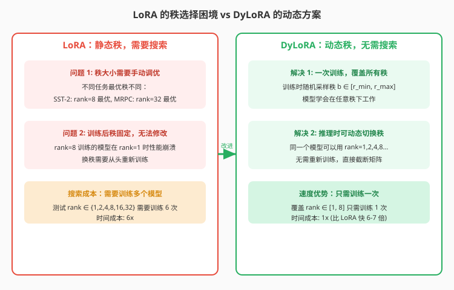
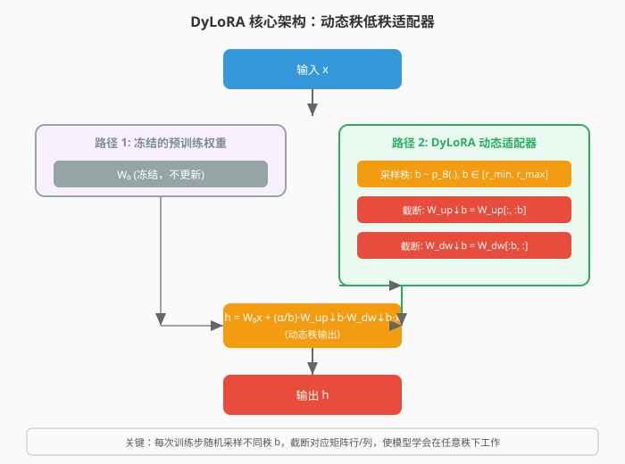
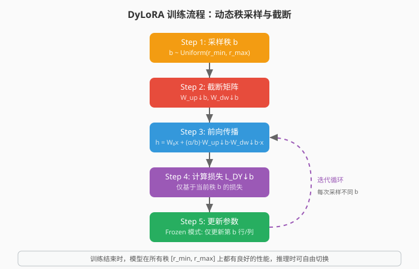
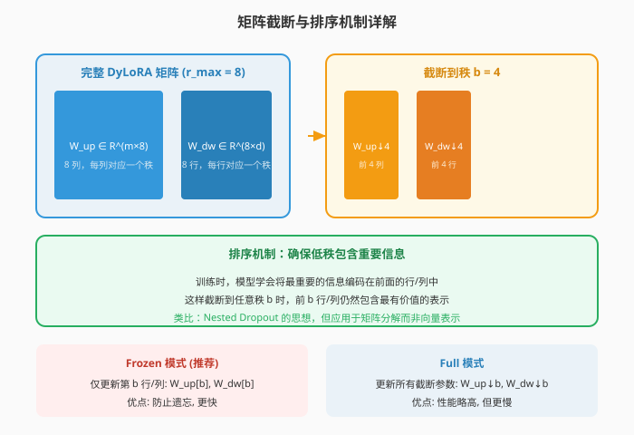
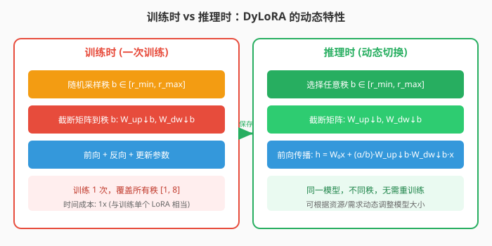
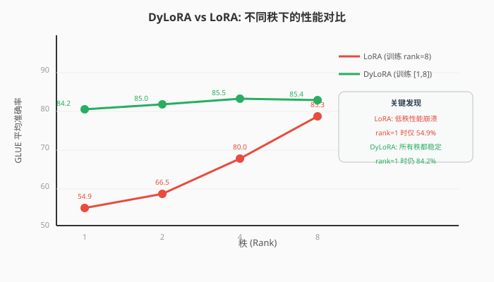

# DyLoRA：基于动态搜索-free 低秩适配的参数高效微调

> **原文**: DyLoRA: Parameter Efficient Tuning of Pre-trained Models using Dynamic Search-Free Low-Rank Adaptation
> **作者**: Mojtaba Valipour, Mehdi Rezagholizadeh, Ivan Kobyzev, Ali Ghodsi
> **发表时间**: 2022年10月
> **arXiv**: https://arxiv.org/abs/2210.07558

---

## 一句话总结

这篇论文提出了一种**动态低秩适配器（DyLoRA）**，让 LoRA 模型在**一次训练**后就能在**任意秩（rank）**下工作，无需为不同秩重新训练，速度比 LoRA 的秩搜索快 **4-7 倍**，且性能不降。

## 研究背景：为什么要做这个？

### LoRA 的两个致命问题

LoRA（Low-Rank Adaptation）通过在大模型旁边加一对小的低秩矩阵来微调，大幅减少了可训练参数量。但它有两个严重问题：

**问题 1：秩大小需要手动调优**

LoRA 的秩 $r$ 是一个关键超参数，决定了适配器的大小和表达能力。但**不同任务的最优秩完全不同**：

| 任务 | 最优秩 |
|------|--------|
| SST-2 (情感分析) | rank=8 |
| MRPC (语义相似度) | rank=32 |
| CoLA (语法可接受性) | rank=7 |

没有通用规则，只能**暴力搜索**——训练多个不同秩的模型，选最好的。

**问题 2：训练后秩固定，无法修改**

用 rank=8 训练的 LoRA 模型，**只能在 rank=8 下工作**。如果你想用 rank=1（更小的模型、更快的推理），性能会**崩溃式下降**——因为模型没有学会在低秩下保留重要信息。

这意味着：**每个秩都需要从头训练一个独立的模型**。

### 现有方案的不足

- **Adapter/Compacter**：有同样的问题，而且推理时增加延迟
- **FLOP**：基于正则化的低秩剪枝，不是动态的
- **DynaBERT**：需要预训练的教师模型，不适合参数高效微调场景

**核心问题**：有没有一种方法，能**一次训练**就让模型在**所有秩**下都工作良好？

## 核心思路：这篇论文的"大招"是什么？

DyLoRA 的核心想法非常巧妙：**训练时随机采样不同的秩，让模型学会在任意秩下工作。**

具体来说：
- 定义一个秩的范围 $[r_{\text{min}}, r_{\text{max}}]$，比如 $[1, 8]$
- 每次训练步，**随机采样一个秩** $b \sim \text{Uniform}(1, 8)$
- **截断** LoRA 矩阵到前 $b$ 行/列
- 用截断后的矩阵做前向传播和反向传播
- 通过这种训练，模型学会**将最重要的信息编码在前面的行/列中**

这就像是在训练一个"可伸缩"的适配器——无论你需要多大，它都能工作。

## 具体怎么做的？

### 1. LoRA 回顾

LoRA 的公式很简单。对于一个预训练权重 $W_0 \in \mathbb{R}^{m \times d}$，LoRA 添加一个低秩适配器：

$$h = W_0 x + \frac{\alpha}{r} W_{\text{up}} W_{\text{dw}} x$$

其中：
- $W_{\text{up}} \in \mathbb{R}^{m \times r}$：上投影矩阵
- $W_{\text{dw}} \in \mathbb{R}^{r \times d}$：下投影矩阵
- $r \ll \min(m, d)$：秩（通常 $r=8$ 或 $16$）
- $\alpha$：缩放因子（通常 $\alpha = 2r$ 或 $16$）

**初始化**：
- $W_{\text{up}}$：初始化为零矩阵
- $W_{\text{dw}}$：初始化为零均值高斯分布

**训练时**：$W_0$ 冻结，只更新 $W_{\text{up}}$ 和 $W_{\text{dw}}$。

### 2. DyLoRA 的动态秩训练

DyLoRA 在 LoRA 的基础上添加了**动态秩采样**机制。

#### 秩采样

定义秩的范围 $\text{Range}[r_{\text{min}}, r_{\text{max}}]$，比如 $[1, 8]$。

每次训练步，从预定义的分布中采样一个秩：

$$b \sim p_B(\cdot), \quad b \in \{r_{\text{min}}, r_{\text{min}}+1, \ldots, r_{\text{max}}\}$$

论文比较了两种分布：
- **均匀分布**：$p_B(b) = \frac{1}{r_{\text{max}} - r_{\text{min}} + 1}$
- **几何分布**：$p_B(b) = (1-p)^{b-1} p$，偏向低秩

最终选择**均匀分布**，避免引入额外的超参数。

#### 矩阵截断

采样到秩 $b$ 后，截断 LoRA 矩阵：

$$W_{\text{dw}}\downarrow b = W_{\text{dw}}[:b, :] \in \mathbb{R}^{b \times d} \quad \text{(取前 b 行)}$$
$$W_{\text{up}}\downarrow b = W_{\text{up}}[:, :b] \in \mathbb{R}^{m \times b} \quad \text{(取前 b 列)}$$

#### 前向传播

用截断后的矩阵计算输出：

$$h = W_0 x + \frac{\alpha}{b} W_{\text{up}}\downarrow b \cdot W_{\text{dw}}\downarrow b \cdot x$$

**注意**：缩放因子从 $\frac{\alpha}{r}$ 变为 $\frac{\alpha}{b}$，因为当前秩是 $b$ 而不是固定的 $r$。

#### 损失函数

DyLoRA 使用**个体损失**（individual loss），而非嵌套 dropout 的求和损失：

$$\mathcal{L}_{\text{DY}}\downarrow b = \frac{1}{N} \sum_{i=1}^N \ell(f(x_i; W_{\text{dw}}\downarrow b, W_{\text{up}}\downarrow b), y_i)$$

**为什么不用求和损失？**

嵌套 dropout 的原始损失是对所有秩的损失求和：
$$\mathcal{L}_{\text{nested}} = \sum_{b=r_{\text{min}}}^{r_{\text{max}}} p_B(b) \cdot \mathcal{L}_{\text{DY}}\downarrow b$$

这需要计算**整个范围**内每个秩的损失，计算量巨大。

DyLoRA 的个体损失**每次只计算当前采样秩的损失**，效率更高。

实验对比：

| 损失类型 | 训练时间 | CoLA 分数 |
|---------|---------|----------|
| 个体损失 $\mathcal{L}_{\text{DY}}\downarrow b$ | **645.82s** | 52.64 |
| 求和损失 $\sum p_B(b) \mathcal{L}_{\text{DY}}\downarrow b$ | 1175.69s | **54.12** |

个体损失快 **1.8 倍**，性能仅下降 1.5 分。

### 3. 两种更新策略

DyLoRA 提供了两种参数更新策略：

**Frozen 模式（推荐）**：
- 只更新当前采样秩 $b$ 对应的**第 $b$ 行和第 $b$ 列**
- 即只更新 $W_{\text{up}}[b]$（第 $b$ 列）和 $W_{\text{dw}}[b]$（第 $b$ 行）
- **优点**：防止之前学到的低秩知识被遗忘，训练更快
- **缺点**：性能略低

**Full 模式**：
- 更新所有截断参数 $W_{\text{up}}\downarrow b$ 和 $W_{\text{dw}}\downarrow b$
- **优点**：性能略高
- **缺点**：更慢，可能遗忘低秩知识

实验对比（$r_{\text{max}}=8$）：

| 分布 | 更新策略 | Rank=8 平均 | Rank=1 平均 |
|------|---------|------------|------------|
| 均匀 | Full (W_dw↓b, W_up↓b) | **84.47** | 83.30 |
| 均匀 | Frozen (W^b_dw, W^b_up) | 83.31 | **81.61** |
| 几何 | Full | 83.66 | 83.42 |
| 几何 | Frozen | 82.78 | **82.39** |

**结论**：
- 均匀分布 + Full 更新：整体性能最好
- 几何分布 + Frozen 更新：低秩性能更好
- 论文默认使用**均匀分布 + Full 更新**

### 4. 排序机制：为什么截断后还能工作？

DyLoRA 能工作的关键在于**排序机制**——模型学会将最重要的信息编码在矩阵的**前面行/列**中。

这借鉴了 **Nested Dropout** 的思想：
- Nested Dropout 用于向量表示：如果保留前 $k$ 个元素，丢弃后面的，模型学会把重要信息放前面
- DyLoRA 用于矩阵分解：如果截断到前 $b$ 行/列，模型学会把重要信息放前面

**训练过程中**：
- 当采样到 $b=1$ 时，模型只能用第 1 行/列工作，被迫把最重要的信息编码在这里
- 当采样到 $b=4$ 时，模型可以用前 4 行/列，学会在第 2-4 行/列编码次重要的信息
- 依此类推...

最终，矩阵的行/列按重要性**自然排序**，任意截断都能保留最有价值的表示。

### 用一个具体例子走通全流程

让我们用一个极简的例子，手把手走通 DyLoRA 的完整流程。

#### 场景设定

假设我们微调一个极小的"语言模型"层：
- 输入维度：$d = 4$
- 输出维度：$m = 4$
- 最大秩：$r_{\text{max}} = 4$
- 最小秩：$r_{\text{min}} = 1$

**预训练权重**（冻结）：
$$W_0 = \begin{bmatrix} 0.5 & -0.3 & 0.2 & 0.1 \\ -0.2 & 0.6 & -0.1 & 0.3 \\ 0.1 & 0.2 & 0.7 & -0.2 \\ -0.3 & 0.1 & -0.2 & 0.5 \end{bmatrix}$$

**LoRA 参数**（可训练，初始化）：
$$W_{\text{up}} = \begin{bmatrix} 0.01 & -0.02 & 0.03 & -0.01 \\ 0.02 & 0.01 & -0.01 & 0.02 \\ -0.01 & 0.03 & 0.02 & -0.02 \\ 0.02 & -0.01 & 0.01 & 0.03 \end{bmatrix} \in \mathbb{R}^{4 \times 4}$$

$$W_{\text{dw}} = \begin{bmatrix} 0.02 & -0.01 & 0.03 & 0.01 \\ -0.02 & 0.02 & -0.01 & 0.03 \\ 0.01 & 0.03 & 0.02 & -0.01 \\ -0.01 & -0.02 & 0.01 & 0.02 \end{bmatrix} \in \mathbb{R}^{4 \times 4}$$

缩放因子：$\alpha = 8$

**输入**（一个 token 的嵌入）：
$$x = \begin{bmatrix} 1.0 \\ 0.5 \\ -0.3 \\ 0.8 \end{bmatrix}$$

#### Step 1: 采样秩

假设本次采样到 $b = 2$（均匀采样自 $\{1, 2, 3, 4\}$）。

#### Step 2: 截断矩阵

截断到前 2 行/列：

$$W_{\text{up}}\downarrow 2 = \begin{bmatrix} 0.01 & -0.02 \\ 0.02 & 0.01 \\ -0.01 & 0.03 \\ 0.02 & -0.01 \end{bmatrix} \in \mathbb{R}^{4 \times 2}$$

$$W_{\text{dw}}\downarrow 2 = \begin{bmatrix} 0.02 & -0.01 & 0.03 & 0.01 \\ -0.02 & 0.02 & -0.01 & 0.03 \end{bmatrix} \in \mathbb{R}^{2 \times 4}$$

#### Step 3: 前向传播

**路径 1：通过预训练权重**

$$W_0 x = \begin{bmatrix} 0.5 & -0.3 & 0.2 & 0.1 \\ -0.2 & 0.6 & -0.1 & 0.3 \\ 0.1 & 0.2 & 0.7 & -0.2 \\ -0.3 & 0.1 & -0.2 & 0.5 \end{bmatrix} \cdot \begin{bmatrix} 1.0 \\ 0.5 \\ -0.3 \\ 0.8 \end{bmatrix}$$

$$= \begin{bmatrix} 0.5 \times 1.0 + (-0.3) \times 0.5 + 0.2 \times (-0.3) + 0.1 \times 0.8 \\ (-0.2) \times 1.0 + 0.6 \times 0.5 + (-0.1) \times (-0.3) + 0.3 \times 0.8 \\ 0.1 \times 1.0 + 0.2 \times 0.5 + 0.7 \times (-0.3) + (-0.2) \times 0.8 \\ (-0.3) \times 1.0 + 0.1 \times 0.5 + (-0.2) \times (-0.3) + 0.5 \times 0.8 \end{bmatrix}$$

$$= \begin{bmatrix} 0.5 - 0.15 - 0.06 + 0.08 \\ -0.2 + 0.3 + 0.03 + 0.24 \\ 0.1 + 0.1 - 0.21 - 0.16 \\ -0.3 + 0.05 + 0.06 + 0.4 \end{bmatrix} = \begin{bmatrix} 0.37 \\ 0.37 \\ -0.17 \\ 0.21 \end{bmatrix}$$

**路径 2：通过 DyLoRA 适配器（秩 b=2）**

先计算 $W_{\text{dw}}\downarrow 2 \cdot x$：

$$W_{\text{dw}}\downarrow 2 \cdot x = \begin{bmatrix} 0.02 & -0.01 & 0.03 & 0.01 \\ -0.02 & 0.02 & -0.01 & 0.03 \end{bmatrix} \cdot \begin{bmatrix} 1.0 \\ 0.5 \\ -0.3 \\ 0.8 \end{bmatrix}$$

$$= \begin{bmatrix} 0.02 \times 1.0 + (-0.01) \times 0.5 + 0.03 \times (-0.3) + 0.01 \times 0.8 \\ (-0.02) \times 1.0 + 0.02 \times 0.5 + (-0.01) \times (-0.3) + 0.03 \times 0.8 \end{bmatrix}$$

$$= \begin{bmatrix} 0.02 - 0.005 - 0.009 + 0.008 \\ -0.02 + 0.01 + 0.003 + 0.024 \end{bmatrix} = \begin{bmatrix} 0.014 \\ 0.017 \end{bmatrix}$$

再计算 $W_{\text{up}}\downarrow 2 \cdot (W_{\text{dw}}\downarrow 2 \cdot x)$：

$$W_{\text{up}}\downarrow 2 \cdot \begin{bmatrix} 0.014 \\ 0.017 \end{bmatrix} = \begin{bmatrix} 0.01 & -0.02 \\ 0.02 & 0.01 \\ -0.01 & 0.03 \\ 0.02 & -0.01 \end{bmatrix} \cdot \begin{bmatrix} 0.014 \\ 0.017 \end{bmatrix}$$

$$= \begin{bmatrix} 0.01 \times 0.014 + (-0.02) \times 0.017 \\ 0.02 \times 0.014 + 0.01 \times 0.017 \\ (-0.01) \times 0.014 + 0.03 \times 0.017 \\ 0.02 \times 0.014 + (-0.01) \times 0.017 \end{bmatrix} = \begin{bmatrix} 0.00014 - 0.00034 \\ 0.00028 + 0.00017 \\ -0.00014 + 0.00051 \\ 0.00028 - 0.00017 \end{bmatrix}$$

$$= \begin{bmatrix} -0.00020 \\ 0.00045 \\ 0.00037 \\ 0.00011 \end{bmatrix}$$

乘以缩放因子 $\frac{\alpha}{b} = \frac{8}{2} = 4$：

$$\frac{\alpha}{b} \cdot W_{\text{up}}\downarrow 2 \cdot W_{\text{dw}}\downarrow 2 \cdot x = 4 \cdot \begin{bmatrix} -0.00020 \\ 0.00045 \\ 0.00037 \\ 0.00011 \end{bmatrix} = \begin{bmatrix} -0.00080 \\ 0.00180 \\ 0.00148 \\ 0.00044 \end{bmatrix}$$

**合并两条路径**：

$$h = W_0 x + \frac{\alpha}{b} W_{\text{up}}\downarrow 2 \cdot W_{\text{dw}}\downarrow 2 \cdot x = \begin{bmatrix} 0.37 \\ 0.37 \\ -0.17 \\ 0.21 \end{bmatrix} + \begin{bmatrix} -0.00080 \\ 0.00180 \\ 0.00148 \\ 0.00044 \end{bmatrix} = \begin{bmatrix} 0.3692 \\ 0.3718 \\ -0.1685 \\ 0.2104 \end{bmatrix}$$

#### Step 4: 损失计算

假设目标输出为 $y_{\text{target}} = \begin{bmatrix} 0.5 \\ 0.4 \\ -0.1 \\ 0.3 \end{bmatrix}$

使用均方误差（简化，实际用交叉熵）：

$$\mathcal{L}_{\text{DY}}\downarrow 2 = \frac{1}{2} \|h - y_{\text{target}}\|^2 = \frac{1}{2} \sum_i (h_i - y_{\text{target}, i})^2$$

$$= \frac{1}{2} \left[ (0.3692 - 0.5)^2 + (0.3718 - 0.4)^2 + (-0.1685 - (-0.1))^2 + (0.2104 - 0.3)^2 \right]$$

$$= \frac{1}{2} \left[ (-0.1308)^2 + (-0.0282)^2 + (-0.0685)^2 + (-0.0896)^2 \right]$$

$$= \frac{1}{2} \left[ 0.0171 + 0.0008 + 0.0047 + 0.0080 \right] = \frac{1}{2} \times 0.0306 = 0.0153$$

**直白翻译**：损失衡量的是模型输出与目标输出的差距。我们的目标是通过更新 $W_{\text{up}}$ 和 $W_{\text{dw}}$ 的第 2 行/列，让损失变小。

**与传统 LoRA 的区别**：
- LoRA：固定秩 $r=8$，只在这个秩下优化
- DyLoRA：每次随机采样不同秩 $b$，在所有秩下都优化

#### Step 5: 反向传播与参数更新

计算损失对截断参数的梯度（简化展示）：

$$\frac{\partial \mathcal{L}}{\partial W_{\text{dw}}\downarrow 2} = \text{... (链式法则)}$$
$$\frac{\partial \mathcal{L}}{\partial W_{\text{up}}\downarrow 2} = \text{... (链式法则)}$$

**Frozen 模式更新**：
- 只更新第 2 行/列：$W_{\text{up}}[:, 2]$ 和 $W_{\text{dw}}[2, :]$
- 第 1 行/列保持不变

**Full 模式更新**：
- 更新所有截断参数：$W_{\text{up}}\downarrow 2$ 和 $W_{\text{dw}}\downarrow 2$（前 2 行/列）

假设使用 SGD，学习率 $\eta = 0.1$，Full 模式更新：

$$W_{\text{up}}\downarrow 2^{\text{new}} = W_{\text{up}}\downarrow 2 - \eta \cdot \frac{\partial \mathcal{L}}{\partial W_{\text{up}}\downarrow 2}$$
$$W_{\text{dw}}\downarrow 2^{\text{new}} = W_{\text{dw}}\downarrow 2 - \eta \cdot \frac{\partial \mathcal{L}}{\partial W_{\text{dw}}\downarrow 2}$$

#### 多轮训练的效果

经过数千轮迭代，每次采样不同的 $b \in \{1, 2, 3, 4\}$：

- 当 $b=1$ 时，模型被迫把最重要的信息编码在第 1 行/列
- 当 $b=2$ 时，模型在第 2 行/列编码次重要的信息
- 当 $b=3$ 时，模型在第 3 行/列编码第三重要的信息
- 当 $b=4$ 时，模型在第 4 行/列编码第四重要的信息

最终，矩阵按重要性自然排序，任意截断都能工作。

**推理时**：
- 想要小模型？用 $b=1$，只取第 1 行/列
- 想要中等模型？用 $b=2$，取前 2 行/列
- 想要大模型？用 $b=4$，取全部 4 行/列
- **无需重新训练！**

> **小白tips**: DyLoRA 的核心思想就像是在整理书架——训练时，模型学会把最重要的书（信息）放在最前面的架子上。这样，无论你的书架有多小（秩多低），只要从前面开始拿，总能拿到最有价值的书。

## 效果怎么样？

### DyLoRA vs LoRA：不同秩下的性能

这是 DyLoRA 最核心的实验结果。LoRA 在 rank=8 下训练，然后在不同秩下测试；DyLoRA 在 rank ∈ [1, 8] 下训练，然后在不同秩下测试。

**GLUE 基准（RoBERTa-Base）**：

| 模型 | Rank | MNLI | SST-2 | MRPC | CoLA | QNLI | QQP | RTE | STS-B | 平均 |
|------|------|------|-------|------|------|------|-----|-----|-------|------|
| LoRA | 1 | 34.60 | 69.61 | 83.47 | 25.57 | 53.00 | 44.30 | 57.55 | 76.07 | 54.90 |
| **DyLoRA** | 1 | **85.59** | **93.23** | **91.58** | **57.93** | **91.95** | **88.37** | **74.80** | **90.30** | **84.22** |
| LoRA | 2 | 40.53 | 82.75 | 88.00 | 43.30 | 63.42 | 59.21 | 68.88 | 85.51 | 66.45 |
| **DyLoRA** | 2 | **86.02** | **93.81** | **91.66** | **59.91** | **92.39** | **89.33** | **76.03** | **90.60** | **84.97** |
| LoRA | 4 | 72.10 | 91.56 | 89.62 | 58.53 | 85.09 | 80.78 | 73.07 | 89.28 | 80.00 |
| **DyLoRA** | 4 | **86.82** | **94.40** | **92.06** | **59.81** | **92.91** | **89.80** | **77.40** | **90.86** | **85.53** |
| LoRA | 8 | 86.82 | 94.01 | 91.48 | 62.08 | 92.39 | 90.42 | 74.51 | 90.48 | 85.27 |
| **DyLoRA** | 8 | **86.76** | **94.36** | **91.38** | **59.51** | **93.00** | **89.91** | **77.55** | **91.05** | **85.44** |

**关键发现**：
- LoRA 在低秩下**性能崩溃**：rank=1 时平均仅 54.9%
- DyLoRA 在所有秩下**稳定高效**：rank=1 时仍有 84.2%
- DyLoRA 在 rank=8 时与 LoRA 相当（85.44 vs 85.27）

### DyLoRA vs LoRA 最佳搜索

| 模型 | 平均 | 说明 |
|------|------|------|
| LoRA Best (搜索 rank 1-8) | 86.49 | 训练 8 次，选最好的 |
| **DyLoRA** | **86.66** | **训练 1 次，覆盖所有秩** |

DyLoRA 的平均性能甚至**略优于** LoRA 的最佳搜索结果，而且只训练了 **1 次**！

### 搜索速度对比

| 模型 | 时间 | SST-2 (最优秩) | MRPC (最优秩) |
|------|------|----------------|---------------|
| LoRA (搜索 rank 1-64) | 7x | **95.3** (rank=64) | 89.71 (rank=64) |
| **DyLoRA (Frozen)** | **1x** | 94.38 (rank=7) | **89.95** (rank=34) |
| LoRA (搜索 rank 1-32) | 6x | **94.84** (rank=32) | 88.73 (rank=16) |
| **DyLoRA (Frozen)** | **1x** | 94.38 (rank=7) | **89.71** (rank=5) |

**DyLoRA 比 LoRA 搜索快 6-7 倍**，且性能相当！

### 生成任务表现

**E2E NLG（GPT-2 Medium）**：

| 模型 | 秩 | 可训练参数 | BLEU |
|------|-----|-----------|------|
| GPT-2 M (LoRA) | 1 | 0.09M | 3.38 |
| **GPT-2 M (DyLoRA)** | 1 | 0.09M | **67.92-68.86** |
| GPT-2 M (LoRA) | 2 | 0.19M | 46.99 |
| **GPT-2 M (DyLoRA)** | 2 | 0.19M | **68.81** |
| GPT-2 M (LoRA) | 4 | 0.39M | 69.88 |
| **GPT-2 M (DyLoRA)** | 4 | 0.39M | **68.36-69.19** |
| GPT-2 M (全量微调) | - | 354M | 68.2 |

**关键发现**：
- 在 rank=1 时，LoRA 的 BLEU 仅 3.38（几乎无法生成），而 DyLoRA 达到 **67.92-68.86**
- DyLoRA 在 rank=1 时就接近全量微调的效果（68.2）
- 在 rank=4 时，DyLoRA 与 LoRA 相当

**DART 和 WebNLG**：

| 模型 | 秩 | DART BLEU | WebNLG BLEU |
|------|-----|-----------|-------------|
| GPT-2 M (LoRA) | 1 | 0.71 | 2.80 |
| **GPT-2 M (DyLoRA)** | 1 | **44.48-44.77** | **52.09-53.04** |
| GPT-2 M (LoRA) | 4 | 47.10 | 55.57 |
| **GPT-2 M (DyLoRA)** | 4 | **46.56** | **54.48** |

同样的模式：DyLoRA 在 rank=1 时远超 LoRA，在 rank=4 时与 LoRA 相当。

### 与压缩方法对比

| 模型 | 可训练参数 | SST-2 | MRPC | QNLI | STS-B | 平均 |
|------|-----------|-------|------|------|-------|------|
| 全量微调 | 125M | **94.8** | 90.2 | 92.8 | **91.2** | 92.25 |
| FLOP | 80M | 92.09 | 88.61 | 89.05 | 88.18 | 89.48 |
| LoRA(1) | **0.628M** | 93.58 | 91.93 | 91.98 | 90.85 | 92.09 |
| **DyLoRA**(1) | **0.628M** | 93.23 | 91.58 | 91.95 | 90.30 | 91.77 |
| **DyLoRA**(8) | 0.887M | 94.36 | 91.38 | **93.00** | 91.05 | **92.45** |

DyLoRA 用极少的参数（0.628M-0.887M）就接近全量微调（125M 参数）的效果。

### 训练时间对比

**MRPC 任务（RoBERTa-Base）**：

| 方法 | 时间 | 说明 |
|------|------|------|
| DyLoRA (训练所有秩 1-8) | 408.39s | 训练 1 次 |
| LoRA (训练单个秩 8) | 399.95s | 训练 1 次 |
| LoRA (训练 8 个模型) | 399.95 × 8 = 3199.6s | 搜索最优秩 |

**DyLoRA 的训练时间与单个 LoRA 相当，但比 LoRA 搜索快 7.8 倍！**

## 论文的意义和局限

**主要贡献**：

1. **首次实现动态低秩适配器**：一次训练，覆盖所有秩，无需搜索
2. **排序机制**：借鉴 Nested Dropout 思想，让模型学会按重要性编码信息
3. **两种更新策略**：Frozen 模式（防遗忘、更快）和 Full 模式（性能略高）
4. **个体损失设计**：比求和损失快 1.8 倍，性能仅略降
5. **广泛的实验验证**：GLUE 基准 + E2E/DART/WebNLG 生成任务，200+ 实验，1600+ 模型评估

**局限性**：

1. **缩放因子 $\alpha$ 的选择**：需要进一步研究如何最优设置
2. **分布选择的影响**：均匀分布 vs 几何分布在不同的下游任务上表现不同，需要更多研究
3. **范围选择的影响**：$[r_{\text{min}}, r_{\text{max}}]$ 的选择对性能的影响需要进一步研究
4. **性能轻微下降**：在最高秩下，DyLoRA 有时略低于专门训练的 LoRA（但差距很小）

## 读后感

DyLoRA 是 LoRA 生态中一个**优雅而实用**的改进。它解决了 LoRA 最头疼的两个问题——秩选择和静态性——而且几乎不增加训练成本。

这篇论文的重要性在于它**让 LoRA 变得更加灵活和实用**：
- **部署时**：可以根据设备资源动态调整模型大小（手机用 rank=1，服务器用 rank=8）
- **开发时**：无需为不同任务搜索最优秩，一次训练搞定
- **研究时**：可以快速探索不同秩对性能的影响

**与 QLoRA 的关系**：
- QLoRA 解决了**内存**问题（4-bit 量化）
- DyLoRA 解决了**灵活性**问题（动态秩）
- 两者可以**结合使用**：4-bit 量化 + 动态 LoRA = 既省内存又灵活

**初学者最应该记住的**：
1. **DyLoRA = LoRA + 动态秩采样 + 排序机制**
2. **训练时随机采样不同秩，推理时可自由切换**
3. **速度比 LoRA 搜索快 6-7 倍，性能不降**
4. **在低秩下表现远超 LoRA（rank=1 时 BLEU 67.92 vs 3.38）**

DyLoRA 告诉我们：**一次训练，多种选择**——这才是参数高效微调应该有的样子。
