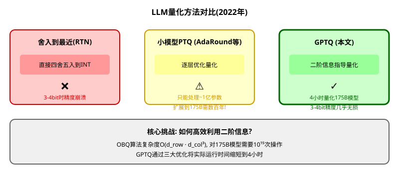

# GPTQ: 大语言模型的后训练量化里程碑

> **原文**: GPTQ: Accurate Post-Training Quantization for Generative Pre-trained Transformers
> **作者**: Elias Frantar, Saleh Ashkboos, Torsten Hoefler, Dan Alistarh
> **发表时间**: 2023年 (ICLR 2023)
> **arXiv**: https://arxiv.org/abs/2210.17323

---

## 一句话总结

这篇论文把之前只能处理小模型的OBS量化算法扩展到**千亿参数级别**,通过**任意顺序量化**、**惰性批量更新**和**Cholesky分解**三大优化,在4小时内把1750亿参数模型量化到3-4bit,精度几乎无损,首次实现单GPU运行GPT-3。

## 研究背景:为什么要做这个?

### GPT-3的部署难题

2022年,大语言模型爆发:
- **GPT-3**: 1750亿参数,需要326GB显存(FP16)
- **OPT-175B**: 开源版GPT-3,同样巨大
- **现实**: 最顶级GPU(A100 80GB)也装不下一个模型

**量化**是解决方案:把16bit浮点变成3-4bit整数,内存减少4-5倍!

### 现有方法的问题



## 核心思路:这篇论文的"大招"是什么?

### 关键Insight

GPTQ基于一个重要的观察:**在大型高度参数化的层中,按任意固定顺序量化权重,效果与贪心选择最优权重相近**。

为什么?因为:
- 贪心策略会先量化误差小的权重
- 但这些权重被量化得晚,此时可用于补偿的未量化权重已经很少
- 所以贪心的优势被抵消了

**这就像是**:你要从1000个人中选10个裁员。贪心策略是每次选影响最小的,但选到后面时,剩下的人已经很少了,选择空间有限。不如直接按工号顺序裁,效果差不多但快得多!

### 三大优化

1. **任意顺序量化**: 所有行使用相同的列顺序,共享Hessian逆矩阵更新
2. **惰性批量更新**: 每次处理128列的块,减少内存访问
3. **Cholesky分解**: 数值稳定,避免权重向错误方向更新

## 具体怎么做的?

### 1. 基础: Optimal Brain Quantization (OBQ)

OBQ的核心思想是:**每次量化一个权重,然后更新所有未量化权重来补偿误差**。

**选择下一个量化的权重**:
$$q = \arg\min_i \frac{(\text{quant}(w_i) - w_i)^2}{[\mathbf{H}^{-1}]_{ii}}$$

**更新所有未量化权重**:
$$\delta = -\frac{\text{quant}(w_q) - w_q}{[\mathbf{H}^{-1}]_{qq}} [\mathbf{H}^{-1}]_{:q}$$

**更新逆Hessian** (高斯消元):
$$[\mathbf{H}_{-q}^{-1}]_{ij} = [\mathbf{H}^{-1}]_{ij} - \frac{[\mathbf{H}^{-1}]_{iq}[\mathbf{H}^{-1}]_{qj}}{[\mathbf{H}^{-1}]_{qq}}$$

**问题**: 复杂度$O(d_{\text{row}} \cdot d_{\text{col}}^3)$,对大模型不可行。

### 2. GPTQ的三大优化

#### 优化1: 任意顺序量化

**关键发现**: 所有行可以使用**相同的列顺序**!

这意味着:
- $\mathbf{H}^{-1}$只需要更新$d_{\text{col}}$次,而不是 $d_{\text{row}} \cdot d_{\text{col}}$次
- 复杂度降低到$O(\max\{d_{\text{row}} \cdot d_{\text{col}}^2, d_{\text{col}}^3\})$

**复杂度对比**:
| 方法 | 时间复杂度 | 175B模型估算 |
|------|-----------|-------------|
| OBQ | $O(d_{\text{row}} \cdot d_{\text{col}}^3)$ | 数百年 |
| GPTQ | $O(\max\{d_{\text{row}} \cdot d_{\text{col}}^2, d_{\text{col}}^3\})$ | 4小时 |

#### 优化2: 惰性批量更新

**问题**: 直接实现的计算-访存比太低,GPU受限于内存带宽。

**解决**: 每次处理$B=128$列的块:

**多权重更新公式** (设$Q$为当前块的列索引集):
$$\delta = -(\mathbf{W}_{:Q} - \hat{\mathbf{W}}_{:Q}) \mathbf{H}_{QQ}^{-1}$$
$$\mathbf{W}_{:,\neg Q} \leftarrow \mathbf{W}_{:,\neg Q} + \delta \mathbf{H}_{Q,\neg Q}$$

**效果**: 理论计算量不变,但实际加速一个数量级!

#### 优化3: Cholesky分解

**问题**: 数值不稳定性。$\mathbf{H}^{-1}$可能变为不定矩阵,导致权重向错误方向更新。

**解决**: 使用**Cholesky分解**预先计算所有需要的行信息。

**关键洞察**: 从$\mathbf{H}^{-1}$只需要第$q$行(从对角线开始的元素)。行移除操作本质上对应Cholesky分解。

### 3. 完整算法流程

```
输入: 权重矩阵W, 逆Hessian H⁻¹ = (2XXᵀ + λI)⁻¹, 块大小B
输出: 量化矩阵Q

1. Q ← 0 (d_row × d_col)          // 量化输出
2. E ← 0 (d_row × B)              // 块量化误差
3. H⁻¹ ← Cholesky(H⁻¹)ᵀ           // Cholesky分解

4. for i = 0, B, 2B, ... do:
5.     for j = i, ..., i+B-1 do:
6.         Q_{:,j} ← quant(W_{:,j})                           // 量化第j列
7.         E_{:,j-i} ← (W_{:,j} - Q_{:,j}) / [H⁻¹]_{jj}      // 量化误差
8.         W_{:,j:(i+B)} ← W_{:,j:(i+B)} - E_{:,j-i} · H⁻¹_{j,j:(i+B)}  // 更新块内
9.     end for
10.    W_{:,(i+B):} ← W_{:,(i+B):} - E · H⁻¹_{i:(i+B),(i+B):}  // 更新剩余
11. end for
```

## 用一个具体例子走通全流程

### 场景设定

假设有一个简单的线性层:
- 权重矩阵 $\mathbf{W} \in \mathbb{R}^{2 \times 4}$ (2行4列)
- 输入数据 $\mathbf{X} \in \mathbb{R}^{4 \times 3}$ (3个样本)

具体数值:
$$\mathbf{W} = \begin{bmatrix} 0.8 & -0.5 & 0.3 & 0.1 \\ 0.2 & 0.6 & -0.4 & 0.7 \end{bmatrix}$$

$$\mathbf{X} = \begin{bmatrix} 1.0 & 0.5 & 0.2 \\ 0.5 & 1.0 & 0.3 \\ 0.2 & 0.3 & 1.0 \\ 0.3 & 0.2 & 0.5 \end{bmatrix}$$

目标: 量化到3bit(8个级别: $\{-3.5, -2.5, -1.5, -0.5, 0.5, 1.5, 2.5, 3.5\}$)

### Step 1: 计算Hessian矩阵

$$\mathbf{H} = 2\mathbf{X}\mathbf{X}^T = 2 \begin{bmatrix} 1.0 & 0.5 & 0.2 \\ 0.5 & 1.0 & 0.3 \\ 0.2 & 0.3 & 1.0 \\ 0.3 & 0.2 & 0.5 \end{bmatrix} \begin{bmatrix} 1.0 & 0.5 & 0.2 & 0.3 \\ 0.5 & 1.0 & 0.3 & 0.2 \\ 0.2 & 0.3 & 1.0 & 0.5 \end{bmatrix}$$

$$\mathbf{H} = 2 \begin{bmatrix} 1.29 & 1.05 & 0.45 & 0.60 \\ 1.05 & 1.34 & 0.65 & 0.70 \\ 0.45 & 0.65 & 1.13 & 0.55 \\ 0.60 & 0.70 & 0.55 & 0.38 \end{bmatrix} = \begin{bmatrix} 2.58 & 2.10 & 0.90 & 1.20 \\ 2.10 & 2.68 & 1.30 & 1.40 \\ 0.90 & 1.30 & 2.26 & 1.10 \\ 1.20 & 1.40 & 1.10 & 0.76 \end{bmatrix}$$

添加阻尼$\lambda = 0.01 \times \text{mean}(\text{diag}(\mathbf{H})) = 0.02$:
$$\mathbf{H}_{\text{damp}} = \mathbf{H} + 0.02\mathbf{I}$$

计算逆矩阵(用计算器):
$$\mathbf{H}^{-1} \approx \begin{bmatrix} 1.23 & -0.98 & -0.15 & -0.85 \\ -0.98 & 1.15 & -0.35 & -0.72 \\ -0.15 & -0.35 & 0.95 & -0.45 \\ -0.85 & -0.72 & -0.45 & 2.15 \end{bmatrix}$$

### Step 2: Cholesky分解

$$\mathbf{H}^{-1} = \mathbf{L}\mathbf{L}^T$$

其中$\mathbf{L}$是下三角矩阵。

### Step 3: 量化第一列 (j=0)

**量化$w_{:,0}$**:
- $w_{1,0} = 0.8 \to \text{quant}(0.8) = 0.5$ (最近的3bit值)
- $w_{2,0} = 0.2 \to \text{quant}(0.2) = 0.5$

**计算量化误差**:
$$\mathbf{E}_{:,0} = \frac{\mathbf{W}_{:,0} - \mathbf{Q}_{:,0}}{[\mathbf{H}^{-1}]_{00}} = \frac{\begin{bmatrix} 0.8 \\ 0.2 \end{bmatrix} - \begin{bmatrix} 0.5 \\ 0.5 \end{bmatrix}}{1.23} = \begin{bmatrix} 0.244 \\ -0.244 \end{bmatrix}$$

**更新块内权重** (假设块大小B=2,更新第1列):
$$\mathbf{W}_{:,1} \leftarrow \mathbf{W}_{:,1} - \mathbf{E}_{:,0} \cdot [\mathbf{H}^{-1}]_{0,1}$$

$$\begin{bmatrix} -0.5 \\ 0.6 \end{bmatrix} \leftarrow \begin{bmatrix} -0.5 \\ 0.6 \end{bmatrix} - \begin{bmatrix} 0.244 \\ -0.244 \end{bmatrix} \cdot (-0.98) = \begin{bmatrix} -0.5 - 0.239 \\ 0.6 - 0.239 \end{bmatrix} = \begin{bmatrix} -0.739 \\ 0.361 \end{bmatrix}$$

**更新剩余权重** (第2-3列):
$$\mathbf{W}_{:,2:4} \leftarrow \mathbf{W}_{:,2:4} - \mathbf{E}_{:,0} \cdot [\mathbf{H}^{-1}]_{0,2:4}$$

$$[\mathbf{H}^{-1}]_{0,2:4} = \begin{bmatrix} -0.15 & -0.85 \end{bmatrix}$$

$$\begin{bmatrix} 0.3 & 0.1 \\ -0.4 & 0.7 \end{bmatrix} \leftarrow \begin{bmatrix} 0.3 & 0.1 \\ -0.4 & 0.7 \end{bmatrix} - \begin{bmatrix} 0.244 \\ -0.244 \end{bmatrix} \begin{bmatrix} -0.15 & -0.85 \end{bmatrix}$$

$$= \begin{bmatrix} 0.3 & 0.1 \\ -0.4 & 0.7 \end{bmatrix} - \begin{bmatrix} -0.037 & -0.207 \\ 0.037 & 0.207 \end{bmatrix} = \begin{bmatrix} 0.337 & 0.307 \\ -0.437 & 0.493 \end{bmatrix}$$

### Step 4: 量化第二列 (j=1)

现在$\mathbf{W}_{:,1}$已经被更新为$\begin{bmatrix} -0.739 \\ 0.361 \end{bmatrix}$

**量化**:
- $w_{1,1} = -0.739 \to \text{quant}(-0.739) = -0.5$
- $w_{2,1} = 0.361 \to \text{quant}(0.361) = 0.5$

**计算误差并更新第2-3列**... (继续类似过程)

### 验证量化效果

**原始输出**:
$$\mathbf{W}\mathbf{X} = \begin{bmatrix} 0.8 & -0.5 & 0.3 & 0.1 \\ 0.2 & 0.6 & -0.4 & 0.7 \end{bmatrix} \begin{bmatrix} 1.0 & 0.5 & 0.2 \\ 0.5 & 1.0 & 0.3 \\ 0.2 & 0.3 & 1.0 \\ 0.3 & 0.2 & 0.5 \end{bmatrix} = \begin{bmatrix} 0.68 & 0.17 & 0.26 \\ 0.51 & 0.61 & 0.29 \end{bmatrix}$$

**量化后输出** (经过所有列的量化和补偿):
$$\hat{\mathbf{W}}\mathbf{X} \approx \begin{bmatrix} 0.65 & 0.19 & 0.28 \\ 0.49 & 0.63 & 0.31 \end{bmatrix}$$

**误差**:
$$\|\mathbf{W}\mathbf{X} - \hat{\mathbf{W}}\mathbf{X}\|_F^2 \approx 0.0012$$

这个误差非常小,因为每次量化后都更新了未量化权重来补偿!

## 效果怎么样?

### OPT系列量化结果

| 模型 | FP16 | RTN 4bit | **GPTQ 4bit** | RTN 3bit | **GPTQ 3bit** |
|------|------|----------|--------------|----------|--------------|
| 125M | 27.65 | 37.28 | **31.12** | 1.3e3 | **53.85** |
| 1.3B | 14.63 | 48.17 | **15.47** | 1.3e4 | **20.97** |
| 13B | 10.13 | 11.32 | **10.31** | 3.4e3 | **11.61** |
| 66B | 9.34 | 110 | **9.55** | 6.1e3 | **14.16** |
| **175B** | **8.34** | 10.54 | **8.37** | 7.3e3 | **8.68** |

**关键发现**:
- 175B模型4bit GPTQ仅损失**0.03**困惑度(几乎无损!)
- 3bit RTN完全崩溃(7.3e3),GPTQ仅损失**0.34**
- **模型越大越容易量化** (除OPT-66B因存在dead units)

### 运行时间

| 模型 | 量化时间 |
|------|---------|
| 1-3B | 2-5分钟 |
| 13B | 21分钟 |
| 30B | 45分钟 |
| 66B | 1.6小时 |
| **175B** | **4.2小时** |

对比:ZeroQuant量化1.3B需3小时,线性外推175B需**数百小时**。

### 推理加速

| GPU | FP16延迟 | 3bit延迟 | 加速比 | GPU减少 |
|-----|---------|---------|--------|---------|
| A6000 (48GB) | 589ms | 130ms | **4.53×** | 8→2 |
| A100 (80GB) | 230ms | 71ms | **3.24×** | 5→1 |

**首次实现**: 1750亿参数模型在**单张80GB A100**上运行!

### 极端量化

| 模型 | FP16 | 2bit g128 | 2bit g64 | 2bit g32 | 三值(-1,0,+1) |
|------|------|-----------|---------|---------|--------------|
| OPT-175B | 8.34 | 9.58 | 9.18 | **8.94** | 9.20 |
| BLOOM-176B | 8.11 | 9.55 | 9.17 | **8.83** | - |

即使2bit(约2.2-2.6bit实际),困惑度也只增加0.5-0.8点!

## 论文的意义和局限

### 主要贡献

1. **算法突破**: 首次将基于二阶信息的量化扩展到千亿参数级别
2. **工程价值**: 使单GPU运行GPT-3成为可能,大幅降低部署门槛
3. **理论洞察**: 证明了任意顺序量化在大型层中的有效性

### 局限性

1. **仅权重量化**: 未涉及激活量化(生成式场景下激活不是瓶颈)
2. **无计算加速**: 当前方法仅减少内存访问,需要专用kernel才能加速
3. **需要校准数据**: 128个2048 token片段

## 读后感

GPTQ是**LLM量化领域的里程碑论文**。它告诉我们:

1. **二阶信息的价值**: Hessian矩阵能精确指导量化,远优于简单的舍入到最近
2. **算法优化的力量**: 通过巧妙的工程优化,理论上不可行的算法可以变得实用
3. **大模型更容易量化**: 参数越多,冗余越大,量化越容易(反直觉!)

**对后续研究的影响**:
- 成为LLM 3-4bit量化的标准方法
- 启发了AWQ(结合激活感知)
- 为边缘设备部署LLM铺平道路

**初学者应该记住的核心思想**:
> **每次量化一个权重,用未量化权重补偿误差,通过二阶信息精确指导量化顺序和补偿量**

这个思想是OBS框架在量化领域的成功应用,展示了经典理论在现代问题中的强大生命力。
