# Hard Prompt 优化变简单了：基于梯度的离散优化用于提示调优与发现

> **原文**: Hard Prompts Made Easy: Gradient-Based Discrete Optimization for Prompt Tuning and Discovery
> **作者**: Yuxin Wen, Neel Jain, John Kirchenbauer, Micah Goldblum, Jonas Geiping, Tom Goldstein (University of Maryland)
> **发表时间**: 2023-02-07
> **arXiv**: [https://arxiv.org/abs/2302.03668](https://arxiv.org/abs/2302.03668)

---

## 一句话总结

这篇论文提出了一种叫 **PEZ** 的方法，能够用梯度优化自动生成由**真实单词**组成的文本提示（hard prompt），让你不需要学会"提示工程"的玄学，就能让 Stable Diffusion 画出你想要的图、让 GPT 做好分类任务。

## 研究背景：为什么要做这个？

2023 年，AI 生成的大门已经打开——Stable Diffusion 能画画，GPT 能写文章。但想让这些模型"听话"，你得给它们写好 **提示词（prompt）**。这就像是对着一个魔法精灵许愿：你说的话越精确，精灵给你的东西就越接近你想要的。

问题是，写好提示词真的很难。你可能想让 Stable Diffusion 画一只"在时代广场滑滑板的泰迪熊"，但怎样组合词语才能让模型画得最好？这几乎是一门玄学——社区里有人花了大量时间"炼丹"般地摸索最佳提示词，甚至有专门的提示词交易市场。

当时存在两种提示词方案：

1. **Hard Prompt（硬提示）**：由真实的人类可读单词组成，比如 `"cuddly teddy skateboarding comforting nyc"`。优点是可读、可编辑、可以在不同模型之间共享（你在 Stable Diffusion 上发现的好提示词，可以拿去 DALL-E 试试）。缺点是只能靠人手动摸索，效率极低。

2. **Soft Prompt（软提示）**：是一组连续的数值向量，比如 `[0.23, -0.17, 0.89, ...]`。优点是可以用梯度下降自动优化。缺点是人类完全看不懂这堆数字是什么意思，也无法迁移到其他模型（因为不同模型的嵌入空间不一样），更无法通过 API 使用（API 只接受文本输入）。

这就形成了一个矛盾：**能自动优化的（soft prompt）不可读、不可迁移；可读可迁移的（hard prompt）又无法自动优化**。

### 现有方案的问题

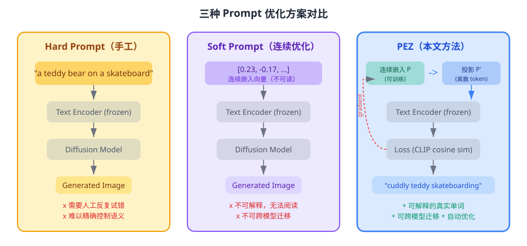

已有的 hard prompt 优化方法（如 AutoPrompt、FluentPrompt）采用了一个直觉但有缺陷的策略：**每一步梯度更新后，立刻投影回最近的离散 token**。这就像一个人在冰面上想往东走，但每走一步就被弹簧拉回最近的格子点——如果学习率不够大，他可能永远跳不出当前格子，优化就"卡住"了。

## 核心思路：这篇论文的"大招"是什么？

论文的核心洞察来自一个领域的跨界灵感：**量化神经网络**（Binary Neural Networks）。在训练二值化网络时，研究者们早就发现了一个教训——在离散空间和连续空间之间反复跳跃的"随机舍入"（stochastic rounding）策略效果很差，不如在连续空间中一直优化、最后一步再量化。

PEZ 把这个思路搬到了提示词优化中：

1. **在连续嵌入空间中维护一个 soft prompt $P$**——它可以是任意实数向量
2. **每次前向传播时，先把 $P$ 投影到最近的离散 token $P'$**——用投影后的 $P'$ 去算 loss
3. **但梯度更新施加在连续的 $P$ 上**——而不是离散的 $P'$
4. **只在最后一步才做最终投影**——得到人类可读的 hard prompt

你可以这样理解：假设你在一个只有整数的世界里找最低点（离散优化）。以前的方法是每走一步就四舍五入到整数——你可能永远在两个整数之间来回蹦。PEZ 的做法是让你在实数轴上自由滑行，只是每步"偷看"一下最近的整数点来评估方向，但脚步不被整数格点约束。等你找到了一个好的区域，最后再"定格"到最近的整数。

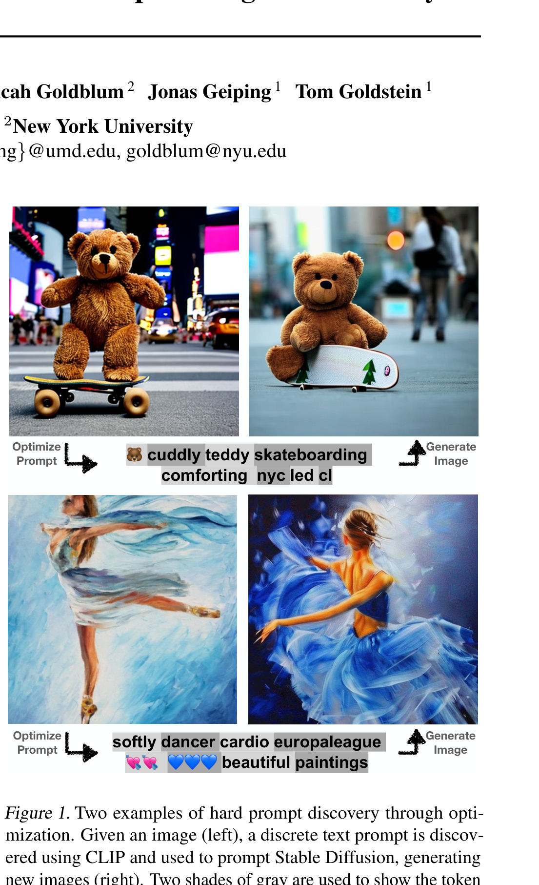

上图展示了 PEZ 的效果：给定一张泰迪熊滑滑板的图片（左），PEZ 自动优化出一个 hard prompt `"cuddly teddy skateboarding comforting nyc led cl"`，然后用这个提示词驱动 Stable Diffusion 生成新图片（右）——语义高度吻合，但不是简单的复制。

## 具体怎么做的？

### PEZ 算法的数学形式

PEZ 需要以下输入：
- 一个**冻结的模型** $\theta$（比如 CLIP 的文本编码器）
- 一个**可学习的嵌入序列** $P = [e_1, \ldots, e_M]$，其中 $e_i \in \mathbb{R}^d$
- 一个**目标函数** $\mathcal{L}$
- 一个**投影函数** $\text{Proj}_E$：将每个 $e_i$ 映射到词表嵌入矩阵 $E \in \mathbb{R}^{|V| \times d}$ 中最近的行向量

$$
\text{Proj}_E(e_i) = \arg\min_{v \in E} \|e_i - v\|_2
$$

用通俗的话说：**投影就是在词表的所有单词嵌入中，找到离当前向量最近的那个单词**。

完整的优化流程如下（即论文的 Algorithm 1）：

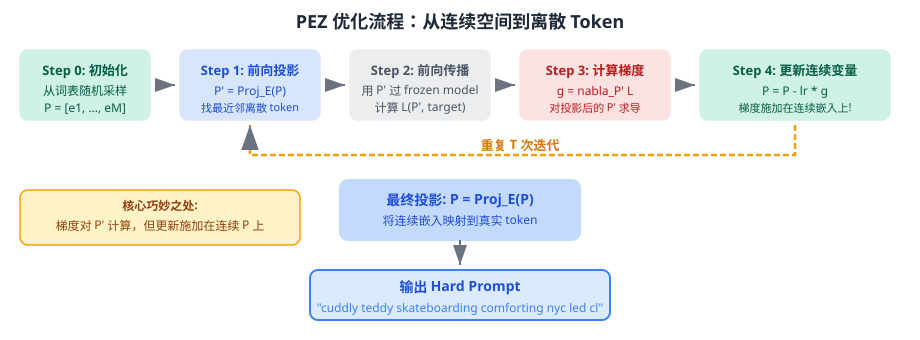

用伪代码表示：

```
初始化: P = 从词表嵌入中随机采样 M 个向量
for t = 1, ..., T:
    1. 前向投影: P' = Proj_E(P)         # 找到最近的离散 token
    2. 计算梯度: g = nabla_{P'} L(P', target, theta)  # 对离散 P' 求梯度
    3. 更新连续变量: P = P - lr * g      # 但把梯度施加在连续 P 上!
最终投影: P = Proj_E(P)                 # 最后一步映射到真实 token
输出: P 对应的 token 序列（人类可读的 hard prompt）
```

### 为什么 PEZ 比基线方法好？

关键区别在于**梯度更新的对象**不同。

以 AutoPrompt 为例，它的更新规则是：

$$
P_{i+1} = \text{Proj}_E \left[ P_i - \eta \nabla_{P_i} \mathcal{L} \right]
$$

注意看——**先更新，再立刻投影**。这意味着每一步更新后，嵌入都被强行拉回到某个离散 token 的位置。如果学习率太小，梯度更新不足以把 $P_i$ "推"到另一个 token 的吸引域，它就会被投影回同一个 token，等于这一步白做了。

而 PEZ 的更新规则是：

$$
P' = \text{Proj}_E(P) \quad \text{（仅用于前向传播）}
$$
$$
g = \nabla_{P'} \mathcal{L}
$$
$$
P = P - \eta g \quad \text{（更新连续变量，不投影）}
$$

**梯度在 $P'$ 上计算（确保和离散空间相关），但更新施加在连续的 $P$ 上（不受离散约束）**。这样，即使单步梯度很小，多步积累下来，连续嵌入 $P$ 也能移动到一个全新的区域，最终投影到一个更好的离散 token。

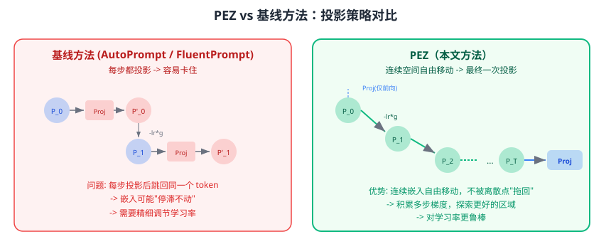

### 在 Text-to-Image 场景中的应用

对于图像生成任务，PEZ 利用 **CLIP 模型**作为优化的"裁判"。CLIP 模型有两个编码器：
- **文本编码器** $f$：将文本映射到特征空间
- **图像编码器** $g$：将图像映射到同一个特征空间

给定目标图像 $x$，PEZ 优化以下目标：

$$
\mathcal{L}(P, x) = 1 - \text{cos}(f(P'), g(x))
$$

其中 $\text{cos}$ 是余弦相似度。用大白话说就是：**让优化出的文本提示的 CLIP 特征尽可能接近目标图像的 CLIP 特征**。

这个设计极其巧妙——优化过程完全不需要通过 Stable Diffusion 的扩散模型反向传播（那会非常昂贵）。只需要通过 CLIP 的文本编码器，而这个编码器在 Stable Diffusion 中也被使用，所以优化出的提示词可以无缝迁移到图像生成。

### 在 Text-to-Text 场景中的应用

对于语言分类任务，PEZ 在目标函数中加入了一个**流畅度惩罚**：

$$
\mathcal{L} = (1 - \lambda_{\text{fluency}}) \mathcal{L}_{\text{task}} + \lambda_{\text{fluency}} \mathcal{L}_{\text{fluency}}
$$

其中 $\lambda = 0.003$。$\mathcal{L}_{\text{task}}$ 是分类任务的交叉熵损失，$\mathcal{L}_{\text{fluency}}$ 衡量提示词的语言通顺程度。加了流畅度约束后，优化出的提示词更加可读，并且在跨模型迁移时效果更好。

### 梯度是如何流动的？

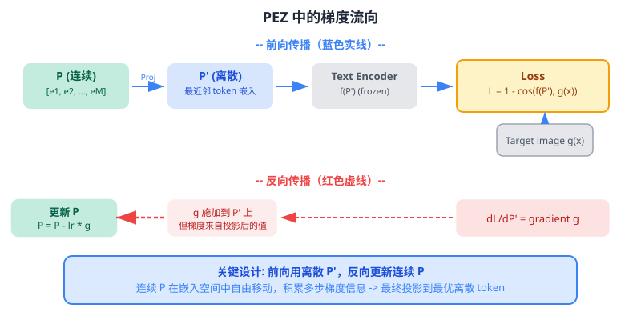

### 用一个具体例子走通全流程

#### 场景设定

假设我们有一张目标图片：一只在时代广场滑滑板的泰迪熊。

- 词表大小 $|V| = 49408$（CLIP 的 BPE 词表）
- 嵌入维度 $d = 1024$（OpenCLIP-ViT/H）
- 优化 token 数 $M = 8$
- 学习率 $\eta = 0.1$
- 优化步数 $T = 3000$
- 优化器：AdamW

**可训练参数**：连续嵌入 $P \in \mathbb{R}^{8 \times 1024}$（共 8192 个浮点数）

**冻结参数**：CLIP 文本编码器 $f$、CLIP 图像编码器 $g$（整个模型权重不动）

#### Step 1: 初始化与前向传播

从词表嵌入矩阵中随机采样 8 个行向量作为初始的 $P$。假设采样到的 token 对应 `["apple", "running", "street", "blue", "the", "mountain", "happy", "with"]`——完全随机，和泰迪熊毫无关系。

**前向投影**：$P' = \text{Proj}_E(P)$。由于 $P$ 本身就是从词表采样的，所以此时 $P' = P$，投影不改变任何东西。

**计算 CLIP 特征**：
- 文本特征：$\text{text\_feat} = f(P') \in \mathbb{R}^{1024}$
- 图像特征：$\text{img\_feat} = g(\text{teddy\_bear\_image}) \in \mathbb{R}^{1024}$（只需计算一次，后续可以缓存）

**计算 Loss**：
$$
\mathcal{L}_0 = 1 - \frac{\text{text\_feat} \cdot \text{img\_feat}}{|\text{text\_feat}| \cdot |\text{img\_feat}|} = 1 - 0.18 = 0.82
$$

初始的随机提示词和目标图片几乎没有语义关联，所以余弦相似度很低（0.18），loss 很高（0.82）。

#### Step 2: 损失计算

损失函数就是上面的 CLIP 余弦距离：

$$
\mathcal{L}(P, x) = 1 - \text{cos}(f(\text{Proj}_E(P)), g(x))
$$

这个目标的含义非常直观：**让提示词描述的内容和目标图片越相似越好**。CLIP 模型在训练时见过数十亿的图文对，所以它对"文本描述了图片中什么内容"有很强的判断力。

#### Step 3: 反向传播

$$
g = \nabla_{P'} \mathcal{L}
$$

梯度通过 CLIP 文本编码器反向传播到投影后的嵌入 $P'$。注意：
- CLIP 模型参数是**冻结的**，不更新
- 梯度只用来计算方向，不修改模型权重
- 梯度告诉我们："把 $P'$ 的每个元素往哪个方向调，能让 loss 减小？"

#### Step 3.5: 参数更新与下一轮迭代

$$
P_1 = P_0 - \eta \cdot g_0
$$

关键点：**梯度 $g_0$ 是在离散 $P'_0$ 上算的，但更新施加在连续 $P_0$ 上**。

更新后的 $P_1$ 不再是词表中某个 token 的精确嵌入了——它"漂"到了嵌入空间中两个 token 之间的某个位置。这正是 PEZ 的优势所在。

在下一轮迭代中：
1. $P'_1 = \text{Proj}_E(P_1)$——$P_1$ 可能已经"漂"到了另一个 token 的吸引域，所以 $P'_1$ 可能变成了一个全新的 token（比如 `"apple"` 变成了 `"teddy"`）
2. 用 $P'_1$ 计算新的 loss 和梯度
3. 继续更新 $P_1 \to P_2$

**经过几十步后，loss 已明显下降**：

| 迭代步 | Loss | 投影后 token 示例 |
|--------|------|-------------------|
| 0 | 0.82 | apple running street blue the mountain happy with |
| 100 | 0.65 | bear toy board city park brown fun the |
| 500 | 0.48 | cuddly teddy skate comforting nyc urban ride the |
| 3000 | 0.31 | cuddly teddy skateboarding comforting nyc led cl ... |

**多轮训练全景图**：

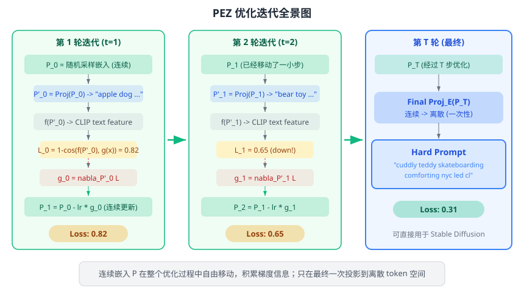

#### Step 4: 最终投影——从连续到离散

经过 3000 步优化后，做最后一次投影：

$$
P_{\text{final}} = \text{Proj}_E(P_{3000})
$$

得到最终的 hard prompt：`"cuddly teddy skateboarding comforting nyc led cl"`

这个提示词包含了：
- **高度相关的词**：`cuddly`（毛茸茸的）、`teddy`（泰迪熊）、`skateboarding`（滑滑板）
- **语义上有贡献但不太直观的词**：`comforting`、`nyc`（暗示城市场景）
- **看似无关的 token**：`led`、`cl`（可能在 CLIP 的嵌入空间中编码了某些视觉特征）

将这个提示词输入 Stable Diffusion，就能生成语义高度吻合的图片——毛茸茸的泰迪熊在城市中滑滑板。

> **小白tips**: 你可能好奇——为什么优化出来的提示词里会出现 `led`、`cl` 这种看起来"乱码"的 token？这是因为 CLIP 的嵌入空间和人类的语言理解不完全一致。某些 token 组合在 CLIP 看来编码了有用的视觉信息（比如颜色、光照），即使人类看不出来。这也是这篇论文的一个有趣发现——**机器和人类"理解"词语的方式是不同的**。

## 效果怎么样？

### Text-to-Image：定量对比

论文在四个数据集上评估了 PEZ：LAION（互联网图片）、MS COCO（自然照片）、Celeb-A（名人肖像）、Lexica.art（AI 生成画作）。

评估指标是**CLIP Score**：用一个更大的参考 CLIP 模型（OpenCLIP-ViT/G，不参与优化过程）来衡量生成图片和原图的语义相似度。

| 方法 | Token 数 | 额外需求 | LAION | MS COCO | Celeb-A | Lexica.art |
|------|---------|----------|-------|---------|---------|------------|
| **PEZ (本文)** | **8** | CLIP | **0.697** | **0.674** | **0.602** | **0.711** |
| CLIP Interrogator | ~77 | CLIP+Bank+BLIP | 0.707 | 0.690 | 0.558 | 0.762 |
| CLIP Interrogator (无 BLIP) | ~77 | CLIP+Bank | 0.677 | 0.674 | 0.572 | 0.737 |
| PEZ + Bank | 8 | CLIP+Bank | 0.702 | 0.689 | 0.629 | 0.740 |
| AutoPrompt_SGD | 8 | CLIP | 0.689 | 0.669 | 0.595 | 0.702 |
| FluentPrompt | 8 | CLIP | 0.688 | 0.671 | 0.583 | 0.702 |
| Soft Prompt | 8 | CLIP | 0.408 | 0.420 | 0.451 | 0.554 |

几个关键发现：

- **PEZ 仅用 8 个 token，就能接近 CLIP Interrogator 用 77 个 token 的效果**。在 Celeb-A 上甚至大幅超越（0.602 vs 0.558），因为 CLIP Interrogator 的关键词库中缺少人脸相关的描述。
- **Soft Prompt 的效果最差**（0.408~0.554），因为它在 CLIP 上优化的连续嵌入无法有效迁移到 Stable Diffusion 的文本编码器。这证实了 hard prompt 的可迁移性优势。
- 加上关键词库（PEZ + Bank）后，PEZ 的效果进一步提升，接近甚至持平 CLIP Interrogator。

### 生成效果展示

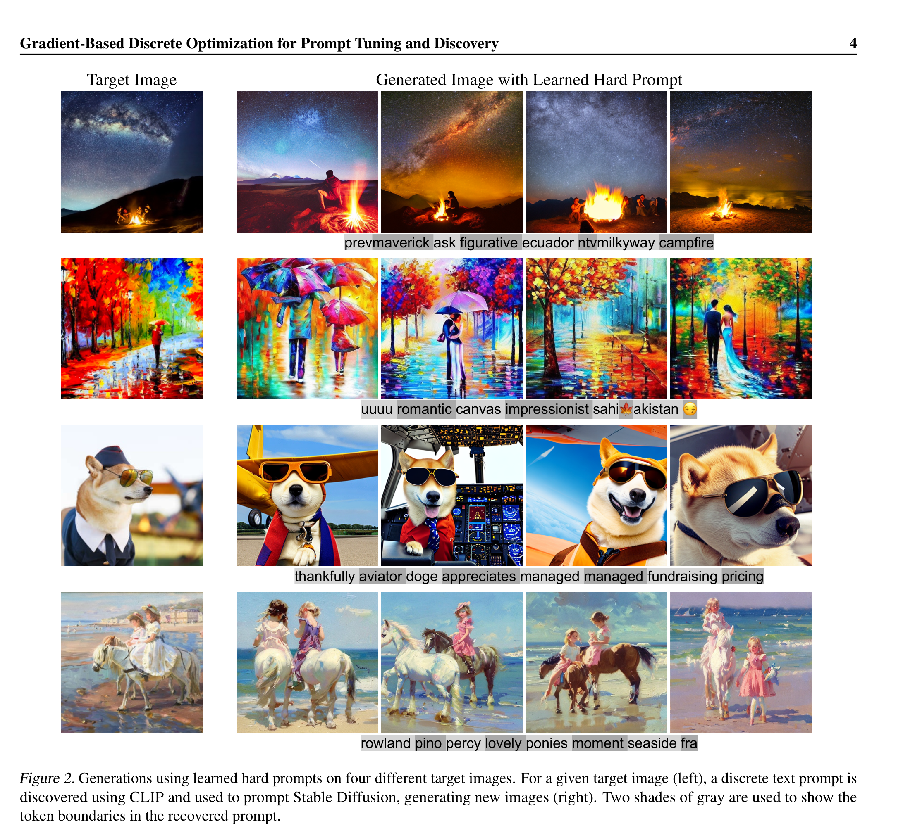

上图展示了四组不同风格的图片：星空下的篝火、印象派雨中场景、戴墨镜的柴犬、海滩上的骏马。PEZ 为每张图片优化出的 8-token hard prompt 能够准确捕捉核心语义，生成的图片在内容和氛围上高度吻合，同时保持了多样性（不同的随机种子产生不同的变体）。

### 风格迁移

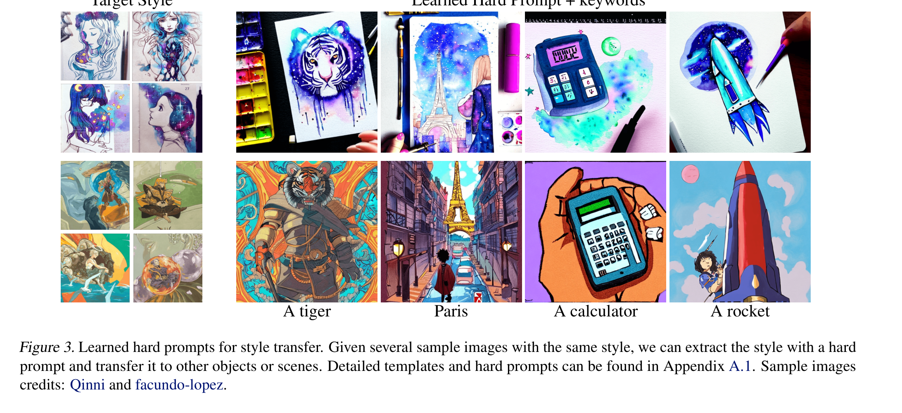

给定几张相同风格的示例图片，PEZ 可以提取共享的风格特征编码为 hard prompt，然后用模板 `"a tiger in the style of {learned_prompt}"` 将风格应用到新物体上。这展示了 hard prompt 的**可组合性**。

### 概念拼接

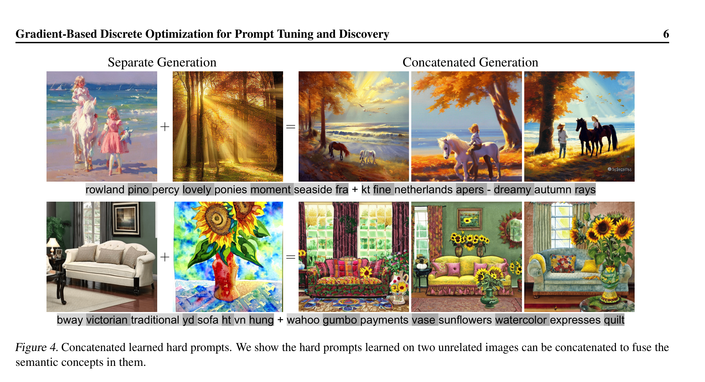

更有趣的是，两个独立优化出的 hard prompt 可以直接拼接在一起！比如"海边骏马"的 prompt + "秋天森林"的 prompt 拼接后，Stable Diffusion 就能生成"秋天森林中的骏马"的图片。这种可组合性是 soft prompt 无法做到的。

### 提示蒸馏

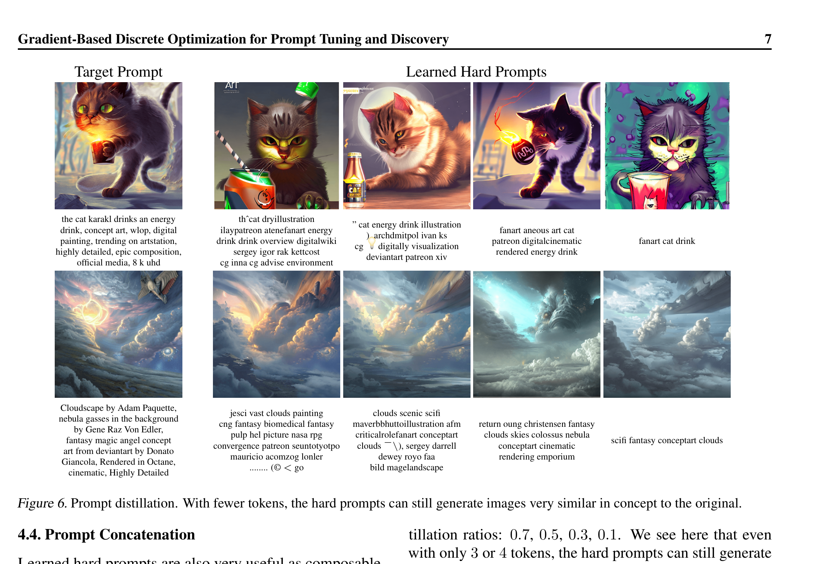

PEZ 还可以用于**提示蒸馏**——把一个冗长的手写提示词（77 token）压缩成更短的 hard prompt（3~4 token），同时保持核心语义。这在 CLIP 有最大长度限制的场景中非常实用。

### Text-to-Text：分类任务迁移性

| 方法 | GPT-2 Large (源) | GPT-2 XL | T5-LM-XL | OPT-2.7B | OPT-6.7B |
|------|:-----------:|:---------:|:---------:|:---------:|:---------:|
| Empty Template | 80.84 | 73.85 | 52.75 | 72.48 | 58.72 |
| AutoPrompt_SGD | 87.56 | 78.19 | 56.01 | 73.69 | 65.28 |
| FluentPrompt | 88.33 | 78.53 | 55.64 | 70.39 | 61.74 |
| PEZ (无流畅度) | 88.12 | 77.80 | 61.12 | 76.93 | 71.72 |
| **PEZ (有流畅度)** | 88.05 | **79.72** | **63.30** | **77.18** | **72.39** |

*SST-2 情感分类任务上的 top-5 prompt 平均准确率*

PEZ 在源模型（GPT-2 Large）上的效果和基线相当，但关键优势在于**跨模型迁移**：在 OPT-6.7B 上，PEZ with fluency 达到 72.39%，比 FluentPrompt 的 61.74% 高出整整 **10.65 个百分点**，比空模板的 58.72% 高出 **13.67 个百分点**。

加入流畅度约束后，迁移效果持续提升——这说明更通顺的 prompt 编码了更具普遍性的语义信息，在不同模型间更容易保持有效性。

### Prompt Length 消融

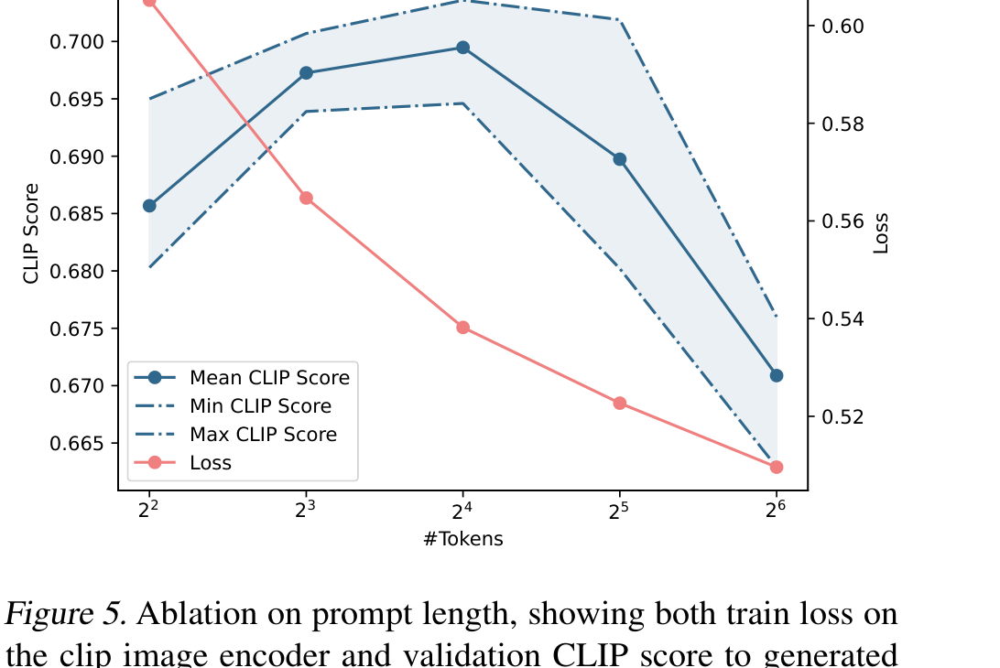

一个反直觉的发现：**更长的 prompt 不一定更好**。虽然增加 token 数量会持续降低 CLIP 文本编码器上的训练 loss，但生成图片的 CLIP Score 在 8~16 个 token 时达到峰值，之后反而下降。这意味着过长的 prompt 会"过拟合"到 CLIP 编码器，无法良好迁移到 Stable Diffusion 的生成过程。

## 安全隐患

论文诚实地指出了一个安全隐患：PEZ 可以被用来**绕过文本过滤器**。比如 Midjourney 禁止了包含 "Afghan" 的提示词（因为版权争议），但 PEZ 可以优化出一个不包含任何被禁词的 prompt，却仍然生成类似的图片。即使防御者迭代更新黑名单，攻击者也可以不断重新优化。论文认为，只有基于特征的内容检测器（而非简单的关键词过滤）才能有效防御。

## 论文的意义和局限

**主要贡献**：

1. **提出了 PEZ 算法**，借鉴量化网络的经验，用"连续空间维护、离散空间评估"的策略优雅地解决了 hard prompt 优化问题，简单高效。
2. **在 Text-to-Image 场景中**，仅用 8 个 token 就达到了与 77-token 的 CLIP Interrogator 相当的效果，并展示了风格迁移、概念拼接、提示蒸馏等丰富应用。
3. **在 Text-to-Text 场景中**，生成的 hard prompt 在跨模型迁移时显著优于基线方法，尤其是加入流畅度约束后效果提升明显。

**局限性**：

- 优化出的 prompt 虽然包含真实单词，但仍然不完全可读——`"cuddly teddy skateboarding comforting nyc led cl"` 不是通顺的英语句子。
- Hard prompt 可能从训练数据中"提取"出敏感或有害内容（虽然论文未观察到具体案例）。
- 优化仍然依赖 CLIP 模型，如果 CLIP 的嵌入空间和下游模型不匹配，效果会打折扣。
- 安全方面，该方法可以被用来绕过基于关键词的内容审查。

## 读后感

PEZ 的价值在于它用一个极简的算法设计（连续维护 + 离散投影），优雅地解决了"自动化"和"可解释性"之间的矛盾。这篇论文不仅是一个技术贡献，更打开了一扇有趣的窗口——让我们看到了**机器和人类理解语言的方式有多么不同**：在 CLIP 的眼中，`led cl` 可能编码了比 `bright lighting` 更精确的视觉信息。

对后续研究来说，PEZ 指明了一个重要方向：**离散优化不必在离散空间中进行，可以在连续空间中"导航"，最后再"着陆"**。这个思想不仅适用于 prompt 优化，也可以推广到任何需要从连续空间映射到离散空间的场景。

如果你是初学者，读完这篇论文最应该记住的是：**Hard prompt 和 soft prompt 不是非此即彼的——PEZ 证明了可以用 soft 的方式优化 hard 的结果**。这种"两全其美"的思路在 AI 研究中经常出现，值得举一反三。
