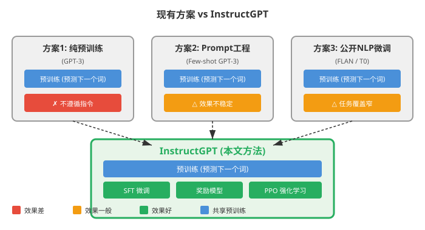
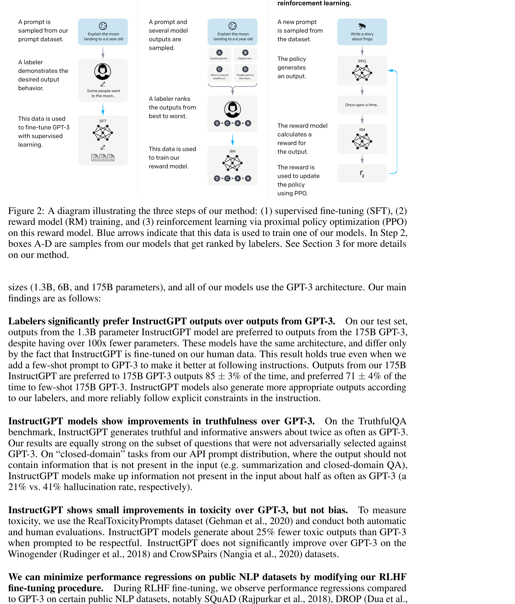
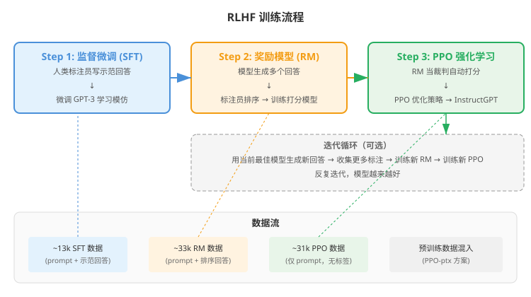
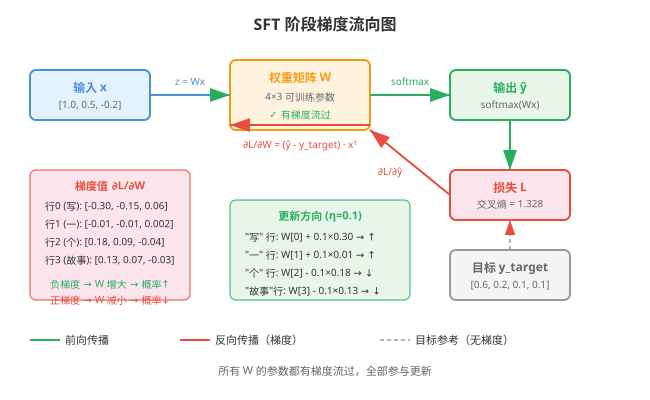
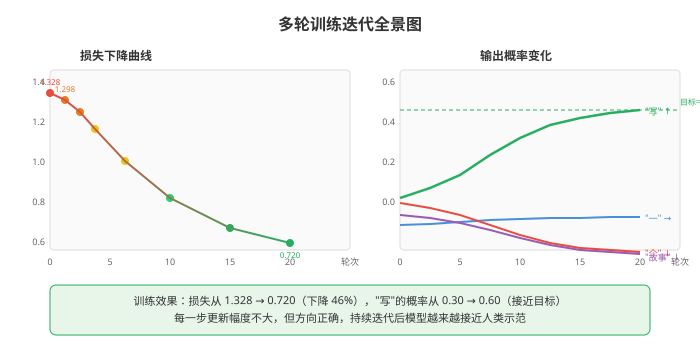
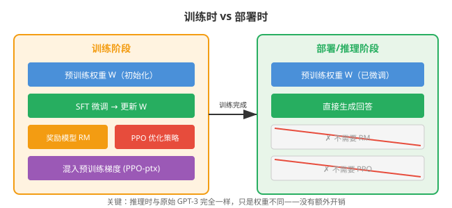
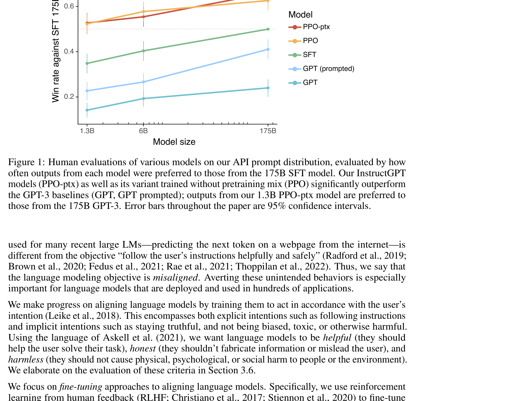
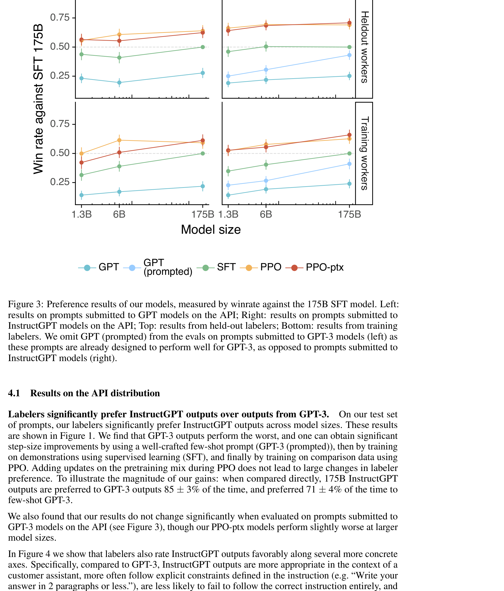
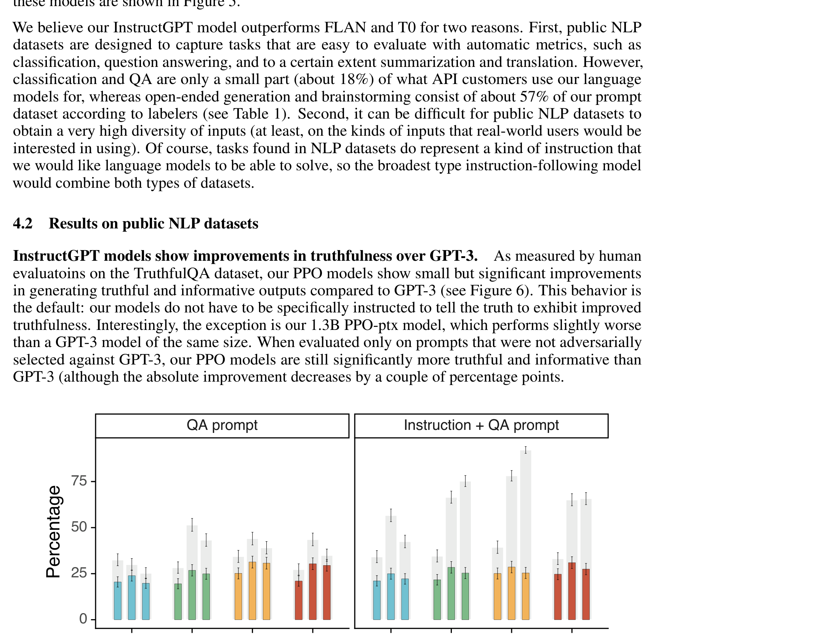

# 用人类反馈训练语言模型遵循指令

> **原文**: Training language models to follow instructions with human feedback
> **作者**: Long Ouyang, Jeff Wu, Xu Jiang, Diogo Almeida, Carroll L. Wainwright, Pamela Mishkin, Chong Zhang, Sandhini Agarwal, Katarina Slama, Alex Ray, John Schulman, Jacob Hilton, Fraser Kelton, Luke Miller, Maddie Simens, Amanda Askell, Peter Welinder, Paul Christiano, Jan Leike, Ryan Lowe (OpenAI)
> **发表时间**: 2022年3月
> **arXiv**: https://arxiv.org/abs/2203.02155

---

## 一句话总结

光把语言模型做大没用，还得用人类反馈来"调教"——OpenAI 用三步法（监督微调 → 奖励模型 → 强化学习）把 GPT-3 改造成了 InstructGPT，让 13 亿参数的小模型打败了 1750 亿参数的原版 GPT-3。

## 研究背景：为什么要做这个？

### 大模型的"不听话"问题

想象你雇了一个读过整个互联网的超级学霸（GPT-3），你让他"帮我写一封请假邮件"，他可能：
- **编造事实**：一本正经地胡说八道
- **输出有毒内容**：生成偏见、攻击性文字
- **答非所问**：根本不按你的指令来

这是因为 GPT-3 的训练目标是**预测下一个词**（在网页数据上），而不是**遵循用户指令**。这两个目标天差地别——就像让一个只读过小说的人去当客服，他可能文采很好，但未必会回答客户的具体问题。

### 现有方案的问题

在 InstructGPT 之前，让语言模型遵循指令主要有两种思路：

1. **做大模型 + 精心写 prompt**（Few-shot prompting）：给 GPT-3 几个示例，希望它能"领悟"任务。但效果不稳定，需要大量调参。
2. **在公开 NLP 数据集上微调**（如 FLAN、T0）：用分类、问答等任务微调，但这些任务太"学术化"，覆盖不了用户真实的使用场景（创意写作、头脑风暴等占 57%）。

这篇论文提出了第三条路：**用人类反馈直接教模型什么回答是好的**。

## 核心思路：这篇论文的"大招"是什么？

InstructGPT 的核心创新是 **RLHF（Reinforcement Learning from Human Feedback，基于人类反馈的强化学习）** 的大规模应用。

简单来说，整个过程分三步：

1. **监督微调（SFT）**：让人类标注员写出"标准答案"，用这些答案微调 GPT-3
2. **训练奖励模型（RM）**：让标注员对模型的多个回答排序，训练一个能"打分"的模型
3. **强化学习（PPO）**：用奖励模型当"裁判"，让模型自己不断生成回答、获取打分、优化策略

这就像是教学生考试：
- **Step 1**：老师给几道例题和标准答案（SFT）
- **Step 2**：老师批改几份答卷，分出好坏（RM 训练）
- **Step 3**：学生自己做题，根据老师的评分标准自我改进（PPO）

**关键 insight**：与其让模型预测"下一个词是什么"，不如让它学习"什么回答是人类喜欢的"。

## 具体怎么做的？

### Step 1: 监督微调（SFT）

**做了什么**：雇佣约 40 名标注员，针对 OpenAI API 用户提交的真实 prompt，写出高质量的示范回答。收集了约 13k 个 prompt-回答对，用这些数据微调 GPT-3。

**数据多样性**：prompt 涵盖生成（45.6%）、问答（12.4%）、头脑风暴（11.2%）、对话（8.4%）、改写（6.6%）、摘要（4.2%）等多种任务。

**训练细节**：微调 16 个 epoch，使用余弦学习率衰减和 0.2 的 residual dropout。有趣的是，虽然验证集损失在 1 个 epoch 后就过拟合了，但继续训练反而能提升人类偏好评分。

### Step 2: 训练奖励模型（RM）

**数据收集**：对 33k 个 prompt，让模型生成 K=4~9 个不同回答，标注员对这些回答进行**排序**（不是简单的二选一）。一次排序产生 K(K-1)/2 个比较对。

**关键改进**：之前的工作把每个比较对当作独立数据点，但这会导致过拟合（因为同一批次的比较高度相关）。本文的创新是**把一个 prompt 的所有比较对作为一个 batch 元素**来训练，只需对每个回答做一次前向传播，效率大幅提升。

**损失函数**：

$$
\mathcal{L}(\theta) = -\frac{1}{\binom{K}{2}} \mathbb{E}_{(x, y_w, y_l) \sim \mathcal{D}} \left[ \log \left( \sigma \left( r_\theta(x, y_w) - r_\theta(x, y_l) \right) \right) \right]
$$

其中：
- $r_\theta(x, y)$ 是奖励模型对 prompt $x$ 和回答 $y$ 打出的分数
- $y_w$ 是人类偏好的回答（winner），$y_l$ 是不偏好的回答（loser）
- $\sigma$ 是 sigmoid 函数，把分数差映射到 (0, 1)
- 直观含义：让偏好回答的分数高于非偏好回答

**模型结构**：从 SFT 模型去掉最后一层（unembedding layer），加一个标量输出头。只用 6B 参数的 RM（175B 的训练不稳定）。

### Step 3: 强化学习（PPO）

**核心思想**：用训练好的 RM 当"裁判"，让模型在 prompt 上生成回答，根据 RM 的打分来优化策略。

**环境设置**：这是一个 bandit 环境——给出一个随机 prompt，模型生成回答，RM 给出奖励，回合结束。

**关键技巧——KL 惩罚**：为了防止模型为了讨好 RM 而生成奇怪的文本（reward hacking），在每个 token 上加上相对于 SFT 模型的 KL 散度惩罚：

$$
\text{reward} = r_\theta(x, y) - \beta \log \left( \frac{\pi^{RL}_\phi(y|x)}{\pi^{SFT}(y|x)} \right)
$$

其中 $\beta$ 控制 KL 惩罚的强度，确保模型不会偏离 SFT 太远。

**PPO-ptx 改进**：纯 RL 微调会导致模型在某些公开 NLP 数据集上性能下降（"对齐税"）。解决办法是在 PPO 梯度中**混入预训练数据的梯度**：

$$
\text{objective}(\phi) = \mathbb{E}_{(x,y) \sim \pi^{RL}_\phi} \left[ r_\theta(x, y) - \beta \log \frac{\pi^{RL}_\phi(y|x)}{\pi^{SFT}(y|x)} \right] + \gamma \mathbb{E}_{x \sim \mathcal{D}_{\text{pretrain}}} \left[ \log(\pi^{RL}_\phi(x)) \right]
$$

$\gamma$ 控制预训练梯度的强度。这相当于在"学人类喜欢的回答"的同时，不忘"保持原有的语言能力"。

### 用一个具体例子走通全流程

#### 场景设定

假设我们有一个极简的语言模型，词汇表大小 $V = 4$（对应词：["写", "一", "个", "故事"]），隐藏层维度 $d = 3$。

**预训练权重**（GPT-3 的简化版）：
$$
W = \begin{bmatrix}
0.5 & -0.3 & 0.1 \\
-0.2 & 0.4 & 0.6 \\
0.1 & 0.2 & -0.4 \\
0.3 & -0.1 & 0.2
\end{bmatrix} \in \mathbb{R}^{4 \times 3}
$$

**输入 prompt 的嵌入**（简化为一个 3 维向量）：
$$
x = \begin{bmatrix} 1.0 \\ 0.5 \\ -0.2 \end{bmatrix}
$$

**SFT 阶段**：标注员给出的示范回答对应的目标分布为：
$$
y_{\text{target}} = \begin{bmatrix} 0.6 \\ 0.2 \\ 0.1 \\ 0.1 \end{bmatrix}
$$
（"写"的概率最高，因为 prompt 是"写一个故事"）

#### Step 1: SFT 前向传播

SFT 模型的输出（线性层 + softmax）：

$$
z = Wx = \begin{bmatrix}
0.5 & -0.3 & 0.1 \\
-0.2 & 0.4 & 0.6 \\
0.1 & 0.2 & -0.4 \\
0.3 & -0.1 & 0.2
\end{bmatrix} \begin{bmatrix} 1.0 \\ 0.5 \\ -0.2 \end{bmatrix} = \begin{bmatrix}
0.5 \times 1.0 + (-0.3) \times 0.5 + 0.1 \times (-0.2) \\
(-0.2) \times 1.0 + 0.4 \times 0.5 + 0.6 \times (-0.2) \\
0.1 \times 1.0 + 0.2 \times 0.5 + (-0.4) \times (-0.2) \\
0.3 \times 1.0 + (-0.1) \times 0.5 + 0.2 \times (-0.2)
\end{bmatrix} = \begin{bmatrix} 0.33 \\ -0.12 \\ 0.28 \\ 0.21 \end{bmatrix}
$$

经过 softmax 后得到概率分布：
$$
\hat{y}_{\text{SFT}} = \text{softmax}(z) \approx \begin{bmatrix} 0.30 \\ 0.19 \\ 0.28 \\ 0.23 \end{bmatrix}
$$

与目标 $y_{\text{target}} = [0.6, 0.2, 0.1, 0.1]^T$ 相比，SFT 模型还没有学会把"写"的概率拉到最高。

#### Step 2: SFT 损失计算

使用交叉熵损失：
$$
\mathcal{L}_{\text{SFT}} = -\sum_i y_{\text{target}, i} \log(\hat{y}_{\text{SFT}, i})
$$

$$
= -(0.6 \log 0.30 + 0.2 \log 0.19 + 0.1 \log 0.28 + 0.1 \log 0.23)
$$
$$
= -(0.6 \times (-1.204) + 0.2 \times (-1.661) + 0.1 \times (-1.273) + 0.1 \times (-1.470))
$$
$$
= -(-0.722 - 0.332 - 0.127 - 0.147) = 1.328
$$

**含义**：损失值 1.328 衡量了模型输出与人类示范的差距。SFT 的目标就是最小化这个差距。

#### Step 3: 反向传播与梯度计算

对 $W$ 的梯度（简化推导，省略 softmax 中间步骤）：
$$
\frac{\partial \mathcal{L}_{\text{SFT}}}{\partial W} = (\hat{y}_{\text{SFT}} - y_{\text{target}}) \cdot x^T
$$

$$
\hat{y}_{\text{SFT}} - y_{\text{target}} = \begin{bmatrix} 0.30 - 0.6 \\ 0.19 - 0.2 \\ 0.28 - 0.1 \\ 0.23 - 0.1 \end{bmatrix} = \begin{bmatrix} -0.30 \\ -0.01 \\ 0.18 \\ 0.13 \end{bmatrix}
$$

$$
\frac{\partial \mathcal{L}_{\text{SFT}}}{\partial W} = \begin{bmatrix} -0.30 \\ -0.01 \\ 0.18 \\ 0.13 \end{bmatrix} \begin{bmatrix} 1.0 & 0.5 & -0.2 \end{bmatrix} = \begin{bmatrix}
-0.30 & -0.15 & 0.06 \\
-0.01 & -0.005 & 0.002 \\
0.18 & 0.09 & -0.036 \\
0.13 & 0.065 & -0.026
\end{bmatrix}
$$

**解读**：
- 第一行梯度为负（-0.30, -0.15, 0.06）→ 更新后 $W$ 第一行会增大 → "写"的概率会上升 ✓
- 第三、四行梯度为正 → 更新后对应行的权重会减小 → "个"和"故事"的概率会下降 ✓
- 梯度方向正确：正在把概率从"个"和"故事"转移到"写"上

#### Step 3.5: 参数更新与下一轮迭代

**参数更新**（SGD，学习率 $\eta = 0.1$）：

$$
W_{\text{new}} = W - \eta \cdot \frac{\partial \mathcal{L}_{\text{SFT}}}{\partial W}
$$

$$
= \begin{bmatrix}
0.5 & -0.3 & 0.1 \\
-0.2 & 0.4 & 0.6 \\
0.1 & 0.2 & -0.4 \\
0.3 & -0.1 & 0.2
\end{bmatrix} - 0.1 \times \begin{bmatrix}
-0.30 & -0.15 & 0.06 \\
-0.01 & -0.005 & 0.002 \\
0.18 & 0.09 & -0.036 \\
0.13 & 0.065 & -0.026
\end{bmatrix}
$$

$$
= \begin{bmatrix}
0.530 & -0.285 & 0.094 \\
-0.199 & 0.401 & 0.5998 \\
0.082 & 0.191 & -0.396 \\
0.287 & -0.107 & 0.203
\end{bmatrix}
$$

**第二轮前向传播**（用更新后的 $W_{\text{new}}$）：

$$
z_{\text{new}} = W_{\text{new}} x = \begin{bmatrix}
0.530 & -0.285 & 0.094 \\
-0.199 & 0.401 & 0.5998 \\
0.082 & 0.191 & -0.396 \\
0.287 & -0.107 & 0.203
\end{bmatrix} \begin{bmatrix} 1.0 \\ 0.5 \\ -0.2 \end{bmatrix} = \begin{bmatrix} 0.407 \\ -0.119 \\ 0.257 \\ 0.194 \end{bmatrix}
$$

$$
\hat{y}_{\text{new}} = \text{softmax}(z_{\text{new}}) \approx \begin{bmatrix} 0.32 \\ 0.19 \\ 0.27 \\ 0.22 \end{bmatrix}
$$

**验证训练在起作用**：

| 分量 | 第 1 轮输出 | 第 2 轮输出 | 目标值 | 趋势 |
|------|-----------|-----------|-------|------|
| "写" | 0.30 | 0.32 | 0.60 | ✓ 上升 |
| "一" | 0.19 | 0.19 | 0.20 | ✓ 接近 |
| "个" | 0.28 | 0.27 | 0.10 | ✓ 下降 |
| "故事" | 0.23 | 0.22 | 0.10 | ✓ 下降 |

新损失：
$$
\mathcal{L}_{\text{new}} = -(0.6 \log 0.32 + 0.2 \log 0.19 + 0.1 \log 0.27 + 0.1 \log 0.22) \approx 1.298
$$

损失从 1.328 降到 1.298，下降了约 2.3%。虽然一步不多，但持续迭代后模型会越来越接近人类示范。

**多轮训练全景图**：

#### RL 阶段的区别

上面的例子展示的是 SFT 阶段。到了 RL（PPO）阶段，区别在于：
- **损失函数变了**：不再是交叉熵，而是 $r_\theta(x, y) - \beta \cdot \text{KL}$（RM 打分减去 KL 惩罚）
- **梯度来源变了**：不是来自人类示范，而是来自 RM 的自动打分
- **模型自己生成回答**：不再模仿固定答案，而是探索什么样的回答能得高分

这就像学生从"抄答案"（SFT）变成了"自己答题、老师打分"（RL）。

#### Step 4: 部署/推理

推理阶段和原始 GPT-3 完全一样——**不需要任何额外模块**。PPO 微调后的模型直接就可以用，权重已经包含了所有学到的知识。

> **小白tips**: KL 惩罚的作用——如果没有 KL 惩罚，模型可能会学会"作弊"：生成一些 RM 喜欢但人类不喜欢的奇怪回答（比如重复某些高分词汇）。KL 惩罚就像一条"缰绳"，把模型拉回 SFT 的安全区域。

## 效果怎么样？

### 各方法对比总览

最核心的结果：

| 方法 | 参数量 | vs 175B SFT 胜率 | vs 175B GPT-3 胜率 |
|------|--------|-----------------|-------------------|
| GPT-3（默认） | 175B | 16% | — |
| GPT-3（prompted） | 175B | 33% | — |
| SFT | 1.3B | 42% | — |
| SFT | 175B | 50%（基线） | — |
| PPO | 1.3B | 56% | — |
| **PPO-ptx（InstructGPT）** | **1.3B** | **60%** | **85%** |
| **PPO-ptx（InstructGPT）** | **175B** | **—** | **85%** |

**震撼结果**：1.3B 参数的 InstructGPT 在人类偏好评分上打败了 175B 参数的 GPT-3——**参数少 100 倍，效果更好**。

### 关键发现

**1. 每一步都有用**

- GPT-3 → GPT-3(prompted)：写好 prompt 有提升
- prompted → SFT：人类示范微调有大幅提升
- SFT → PPO：RLHF 又有进一步提升
- PPO → PPO-ptx：加入预训练梯度，保持公共数据集性能

**2. 更诚实、更安全**

- **真实性**：在 TruthfulQA 基准上，InstructGPT 生成真实且信息丰富的回答的频率是 GPT-3 的两倍
- **幻觉减少**：在封闭域任务（如摘要）上，InstructGPT 编造信息的频率是 GPT-3 的一半（21% vs 41%）
- **毒性降低**：当被要求"礼貌回答"时，InstructGPT 生成的有毒输出比 GPT-3 少约 25%

**3. 泛化能力惊喜**

InstructGPT 展现出了训练数据之外的能力：
- 能回答关于代码的问题（尽管代码数据很少）
- 能部分遵循其他语言的指令（尽管数据 96% 是英文）
- 能总结代码、回答代码相关问题

这说明模型学到了不是"死记硬背"，而是"遵循指令"这个抽象概念。

**4. 对齐税被有效降低**

纯 PPO 微调会导致在某些公共 NLP 数据集（SQuAD、DROP、HellaSwag 等）上性能下降。PPO-ptx（混入预训练梯度）大大缓解了这个问题，同时不降低人类偏好评分。

## 论文的意义和局限

**主要贡献**：

1. **首次大规模验证 RLHF**：证明了用人类反馈微调大语言模型能显著提升其在广泛任务上的表现
2. **1.3B 打败 175B**：证明了"对齐"比"做大"更重要，为后续研究指明了方向
3. **低对齐税**：PPO-ptx 方案有效避免了性能回退，使 RLHF 具有实用价值
4. **真实场景验证**：使用的是 OpenAI API 用户的真实 prompt，不是学术玩具数据集

**局限性**（论文自己提到的）：

1. **标注员代表性有限**：约 40 名标注员，主要是英语母语者，不能代表全人类
2. **仍会犯错**：会被错误前提带偏、过度谨慎、在多约束条件下性能下降
3. **可以被恶意利用**：如果被要求生成有毒内容，InstructGPT 比 GPT-3 更擅长做到
4. **偏见未改善**：在 Winogender 和 CrowS-Pairs 偏见数据集上没有显著改善
5. **"对齐到谁"的问题**：模型对齐的是标注员 + 研究者的偏好，不是普世的"人类价值观"

## 读后感

这篇论文是 ChatGPT 的技术前身，重要性不言而喻。它最大的贡献不是提出了什么新算法（RLHF 之前就存在），而是**首次把 RLHF 大规模应用到通用语言模型上，并用翔实的实验证明了其有效性**。

对后续研究的影响是深远的：
- 直接催生了 ChatGPT（InstructGPT 的迭代版本）
- 启发了 Anthropic 的 Constitutional AI
- 推动了整个行业从"做大模型"转向"对齐模型"

**初学者最应该记住的**：
1. 大语言模型的预训练目标（预测下一个词）≠ 用户想要的（遵循指令），这个 gap 需要用对齐技术来填补
2. RLHF 的三步法（SFT → RM → PPO）是目前最主流的对齐范式
3. 人类反馈的质量决定了对齐的上限——标注员是谁、怎么标注、标注什么，这些问题和技术方案一样重要
