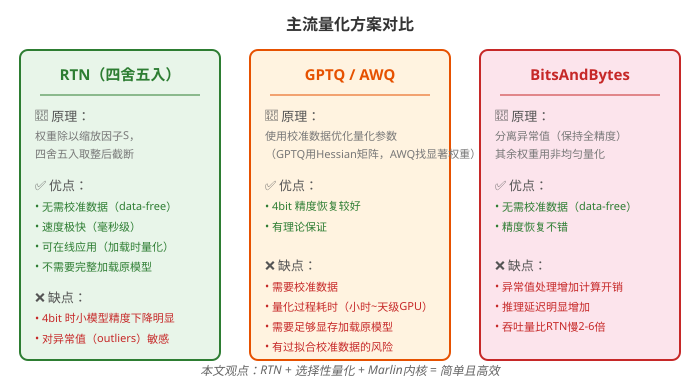
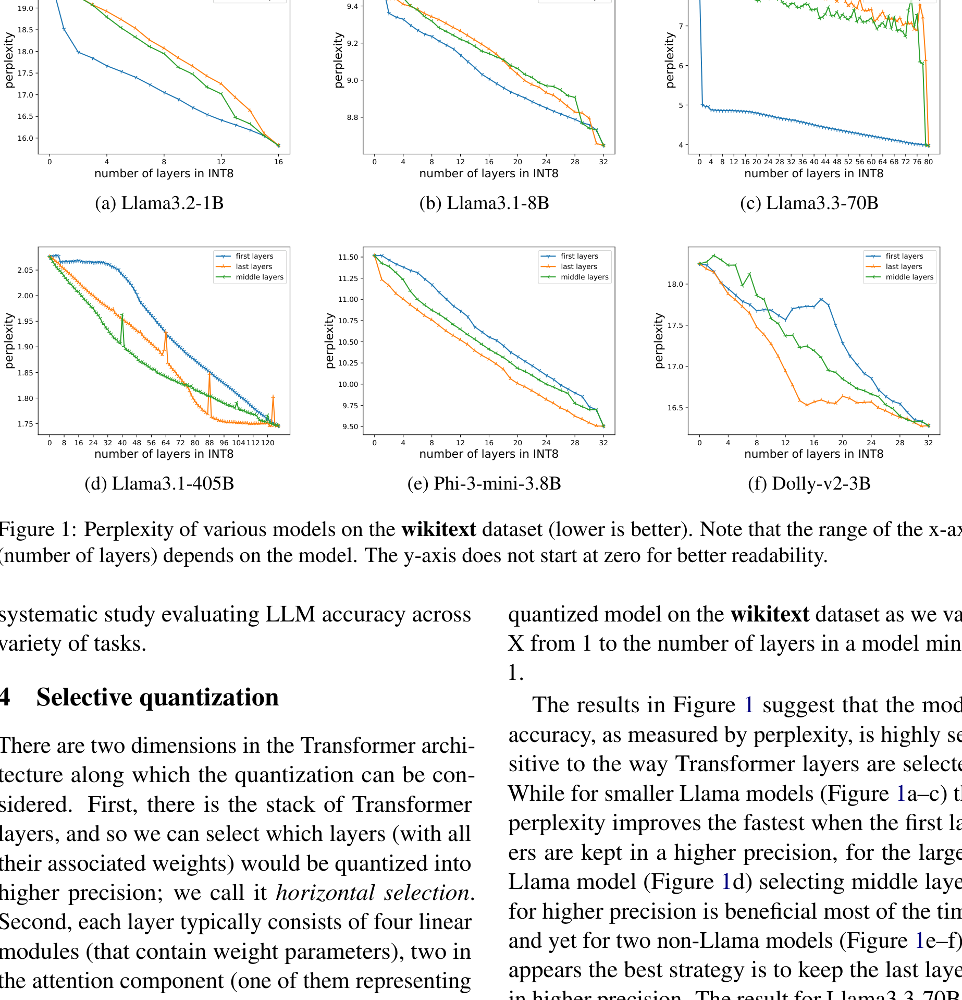
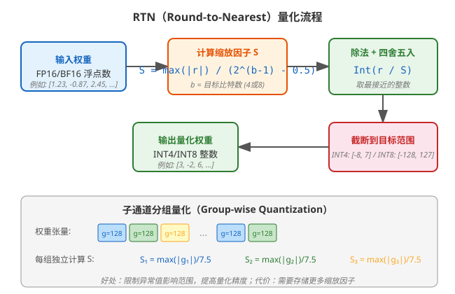
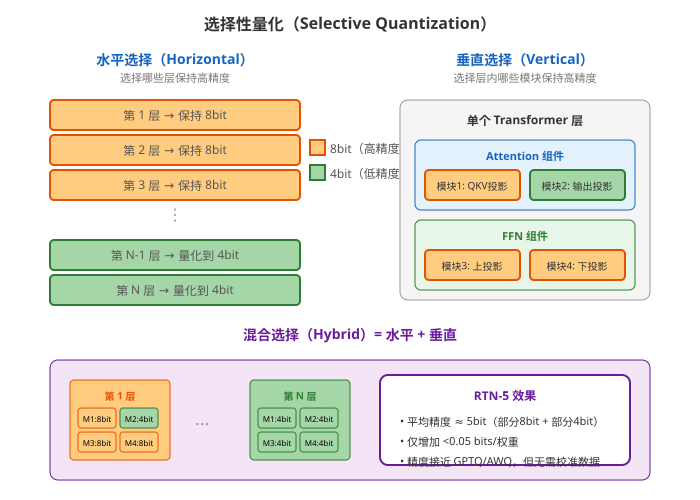
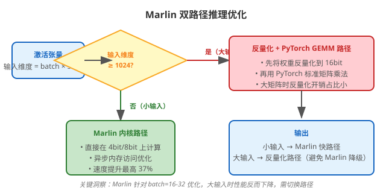
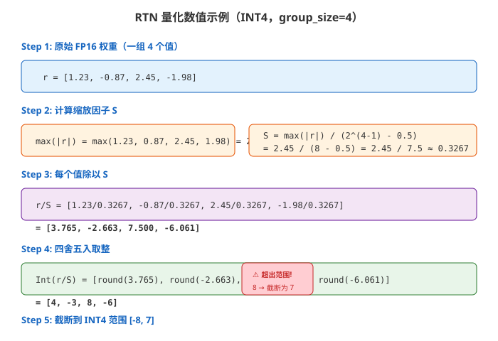
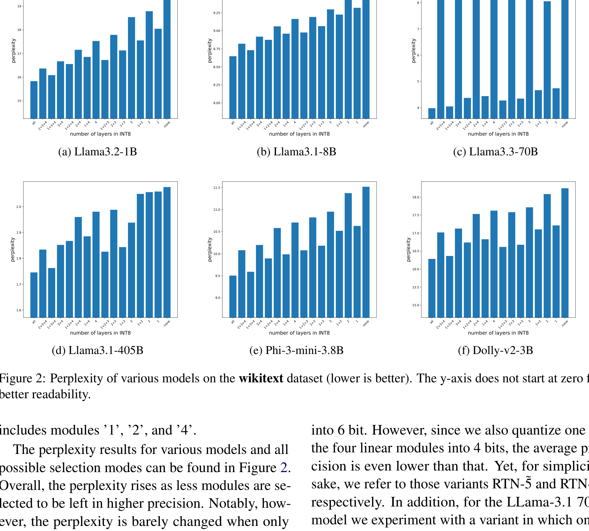
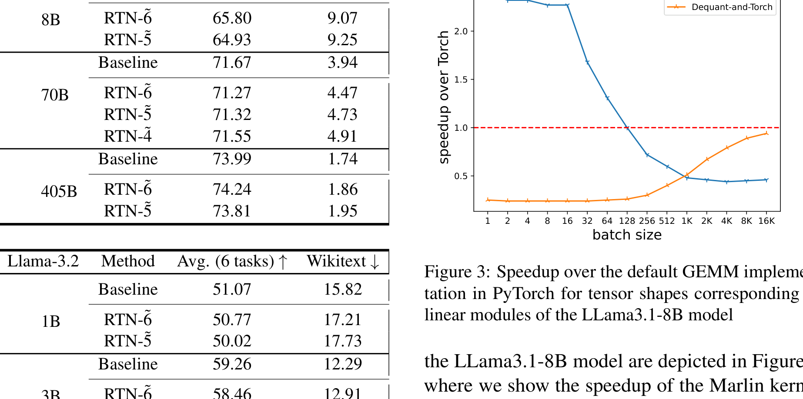
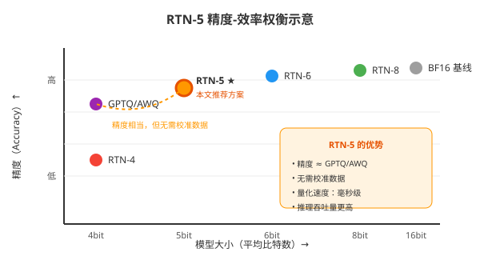

# （选择性）舍入到最近量化就是你需要的全部吗？

> **原文**: Is (Selective) Round-To-Nearest Quantization All You Need?
> **作者**: Alex Kogan (Oracle Labs)
> **发表时间**: 2025 年
> **arXiv**: https://arxiv.org/abs/2505.15909

---

## 一句话总结

这篇论文为最简单粗暴的量化方法 RTN（Round-to-Nearest，四舍五入）正名：配合**选择性量化**（部分层保持高精度）和高效的 **Marlin 内核**，RTN 不仅精度能追平复杂的 GPTQ/AWQ，推理速度还更快。

## 研究背景：为什么要做这个？

想象一下，你有一个 4050 亿参数的大语言模型（比如 Llama 3.1-405B），想让它在一台服务器上跑起来。问题来了：

- **显存不够**：8 张 H100 GPU（每张 80GB）都装不下这个模型
- **推理太慢**：生成 token 是串行的，每次只生成一个，GPU 算力大量闲置（这就是所谓的"内存瓶颈"——数据从内存搬到计算单元的速度跟不上计算速度）

**量化**就是解决这两个问题的主流方案：把模型权重从 16 位浮点数（FP16/BF16）压缩到 4 位或 8 位整数，模型体积缩小 4 倍，推理也更快。

### 现有方案的问题

目前主流的量化方法可以分为三类：

| 方法 | 需要校准数据？ | 量化速度 | 精度恢复 | 推理速度 |
|------|--------------|---------|---------|---------|
| **RTN**（四舍五入） | ❌ 不需要 | 毫秒级 | 8bit 完美，4bit 较差 | 快 |
| **GPTQ / AWQ** | ✅ 需要 | 小时~天级 | 好 | 中等 |
| **BitsAndBytes** | ❌ 不需要 | 在线量化 | 较好 | 慢（异常值处理开销大） |

**关键矛盾**：学术界普遍认为 RTN 太简单、精度差，被 GPTQ/AWQ 等"高级"方法全面碾压。但这篇论文要挑战这个共识——RTN 真的那么差吗？

## 核心思路：这篇论文的"大招"是什么？

论文的核心观点可以用一句话概括：**RTN 不是不行，而是你没用对方法**。

作者提出了两个关键改进：

1. **选择性量化（Selective Quantization）**：不是把所有层都量化到同一个精度，而是让少数关键层保持 8bit 高精度，其余层用 4bit。这样平均精度只增加不到 0.05 bit/权重，却能恢复大部分精度损失。

2. **Marlin 内核优化**：利用专为混合精度矩阵乘法设计的高效 CUDA 内核，让 RTN 量化后的模型推理速度比原始模型快 25%~37%。

你可以把选择性量化想象成**"好钢用在刀刃上"**——不是所有层对精度的敏感度都一样，找出那些"敏感层"保持高精度，其他层大胆压缩，就能在几乎不增加体积的情况下大幅提升精度。

## 具体怎么做的？

### RTN 量化原理

RTN（Round-to-Nearest）的公式极其简单：

$$
RTN(r) = \text{Int}(r / S)
$$

其中：
- $r$ 是输入的浮点权重向量
- $S$ 是缩放因子，计算公式为：

$$
S = \frac{\max(|r|)}{2^{b-1} - 0.5}
$$

- $b$ 是目标比特数（4 或 8）
- $\text{Int}(\cdot)$ 表示四舍五入取整，然后截断到目标范围（INT4 为 $[-8, 7]$，INT8 为 $[-128, 127]$）

**子通道分组量化**：为了限制异常值（outliers）的影响，论文将权重张量按通道拆分，每个通道再分成大小为 $g$（通常 $g=128$）的组，每组独立计算缩放因子 $S$。这就像把一个大班级分成小组考试——个别考得特别差的学生不会拉低整个班级的平均分。

### 选择性量化：两个维度

论文发现，不同层和不同模块对量化的敏感度差异很大，因此提出了**两个选择维度**：

**水平选择（Horizontal Selection）**：选择哪些 Transformer 层保持 8bit 高精度。

实验发现一个有趣的现象：
- 小模型（1B~8B）：**前几层**保持高精度效果最好
- 超大模型（405B）：**中间层**保持高精度效果最好
- 非 Llama 模型（Phi、Dolly）：**后几层**保持高精度效果最好

这说明不同架构的模型，对量化敏感的层位置不同，没有"一刀切"的策略。

**垂直选择（Vertical Selection）**：选择层内哪些线性模块保持 8bit。

每个 Transformer 层包含 4 个线性模块：
- 模块 1：QKV 投影（Attention 的输入）
- 模块 2：Attention 输出投影
- 模块 3：FFN 上投影
- 模块 4：FFN 下投影

实验发现：**只把模块 2（Attention 输出投影）量化到 4bit，其他保持 8bit，精度几乎不降**。这意味着模块 2 对量化最不敏感。

### 混合选择策略

结合水平和垂直选择，论文提出了 **RTN-5̃** 和 **RTN-6̃** 方案：

- **RTN-5̃**：1/4 的层使用 8bit（其中 3/4 的模块），其余全部 4bit → 平均约 5bit
- **RTN-6̃**：1/2 的层使用 8bit（其中 3/4 的模块），其余全部 4bit → 平均约 6bit

特别地，对于 Llama-3.1-70B，作者还实验了 **RTN-4̃**：仅第一层的 3 个模块保持 8bit，其余全部 4bit。结果令人惊讶——仅仅增加了不到 0.05 bits/权重，就能恢复大部分精度损失。

### Marlin 双路径推理优化

Marlin 内核原本是为 GPTQ 设计的高效 4bit 矩阵乘法内核。但作者发现一个问题：**当输入维度很大时（比如长 prompt），Marlin 的性能反而不如 PyTorch 原生实现**。

解决方案是引入**双路径**：
- 输入维度 < 1024：使用 Marlin 内核（快）
- 输入维度 ≥ 1024：先反量化到 16bit，再用 PyTorch GEMM（避免 Marlin 降级）

这个设计确保了 RTN 在各种输入长度下都能保持高性能。

### 用一个具体例子走通 RTN 量化全流程

#### 场景设定

假设我们有一个包含 4 个权重的向量（group_size = 4），要量化到 INT4：

$$
r = [1.23, -0.87, 2.45, -1.98]
$$

目标：将这些 FP16 浮点数压缩到 INT4 整数（范围 $[-8, 7]$）。

#### Step 1: 计算缩放因子

$$
\max(|r|) = \max(1.23, 0.87, 2.45, 1.98) = 2.45
$$

$$
S = \frac{2.45}{2^{4-1} - 0.5} = \frac{2.45}{7.5} \approx 0.3267
$$

#### Step 2: 每个值除以 S

$$
r / S = [1.23/0.3267, -0.87/0.3267, 2.45/0.3267, -1.98/0.3267]
$$

$$
= [3.765, -2.663, 7.500, -6.061]
$$

#### Step 3: 四舍五入取整

$$
\text{Int}(r/S) = [4, -3, 8, -6]
$$

#### Step 4: 截断到 INT4 范围 $[-8, 7]$

注意第 3 个值 $8$ 超出了 INT4 的最大值 $7$，需要截断：

$$
\text{最终结果} = [4, -3, 7, -6]
$$

#### Step 5: 反量化（推理时）

推理时，需要将 INT4 转回浮点数进行计算：

$$
\hat{r} = [4, -3, 7, -6] \times 0.3267 = [1.307, -0.980, 2.287, -1.960]
$$

#### 量化误差分析

| 分量 | 原始值 | 量化后反量化 | 误差 |
|------|-------|------------|------|
| $r_1$ | 1.230 | 1.307 | +0.077 |
| $r_2$ | -0.870 | -0.980 | -0.110 |
| $r_3$ | 2.450 | 2.287 | -0.163 |
| $r_4$ | -1.980 | -1.960 | +0.020 |

可以看到，量化引入了误差，但误差在可接受范围内（最大误差约 0.163）。这就是为什么 8bit 量化（范围更大、分辨率更高）精度损失更小，而 4bit 量化在敏感层上误差累积会导致明显精度下降。

> **小白tips**: 为什么选择性量化有效？
>
> 想象你在压缩一张照片。如果把整张照片都压缩到很低质量，画面就糊了。但如果只把背景压缩，人脸部分保持清晰——人眼几乎看不出区别。选择性量化就是这个道理：找出模型中"敏感"的部分（就像人脸），保持高精度；其余部分（就像背景）大胆压缩。

## 效果怎么样？

### 精度对比

核心发现：

| 模型 | RTN-8 | RTN-4 | RTN-5̃ | GPTQ-4 | AWQ-4 |
|------|-------|-------|-------|--------|-------|
| Llama-3.1-8B | 66.13 | 64.32 | **64.93** | 65.07 | 65.30 |
| Llama-3.1-70B | 71.61 | 70.46 | **71.32** | 70.89 | 71.54 |
| Llama-3.1-405B | 74.12 | 73.88 | **73.81** | 73.31 | 73.81 |

关键观察：
1. **RTN-8 完美恢复**：所有模型的 8bit RTN 精度与原始 BF16 基线几乎一致
2. **RTN-4 小模型掉点明显**：8B 模型下降约 1.75 个百分点
3. **RTN-5̃ 追平 GPTQ/AWQ**：仅用约 5bit 的平均精度，就能达到甚至超过需要校准数据的 GPTQ 和 AWQ

### 推理速度对比

| 模型 | Batch=1 (msec/token) | | |
|------|---------------------|---|---|
| Llama-3.1-8B | 基线 8.03 | RTN-4 **5.06** | 提速 **37%** |
| Llama-3.1-70B | 基线 19.38 | RTN-4 **12.13** | 提速 **37%** |
| Llama-3.1-405B | N/A | RTN-4 **25.23** | 比 BnB 快 **2.4x** |

RTN 比 BitsAndBytes 快 2-6 倍，即使在大批次下也能保持竞争力。

## 论文的意义和局限

**主要贡献**：

1. **为 RTN 正名**：通过系统性实验证明，RTN 并非"过时"方法，配合选择性量化后精度可媲美 GPTQ/AWQ
2. **选择性量化策略**：提出了水平+垂直两个维度的选择方法，并发现仅需极少量参数保持 8bit 就能恢复大部分精度
3. **工程实践价值**：RTN 无需校准数据、可在线应用、推理速度快，是部署超大模型（如 405B）的实用选择

**局限性**：

1. **手动选择**：哪些层/模块保持高精度目前需要手动实验确定，缺乏自动化方法
2. **模型范围有限**：实验主要集中在 Llama 系列，对其他架构（如 MoE）的适用性有待验证
3. **未考虑激活量化**：本文只量化了权重，未涉及激活值的量化

## 读后感

这篇论文最大的价值在于**打破了"简单方法一定差"的思维定式**。在量化领域，大家一直在追求更复杂的算法（GPTQ 用 Hessian 矩阵、AWQ 找显著权重），却忽略了最简单的 RTN 配合巧妙的选择性策略就能达到类似效果。

对于实际部署来说，这篇论文的结论非常有吸引力：
- **不需要校准数据** → 省去了数据收集和校准流程
- **量化只需几秒** → 可以在模型加载时在线完成
- **推理更快** → Marlin 内核带来 25%-37% 的提速
- **精度不输** → RTN-5̃ 追平 GPTQ/AWQ

如果你正在部署一个大语言模型，不妨先试试 RTN + 选择性量化——也许你真的不需要那些复杂的方法。正如论文标题所暗示的：（选择性）舍入到最近，也许就是你需要的全部。
