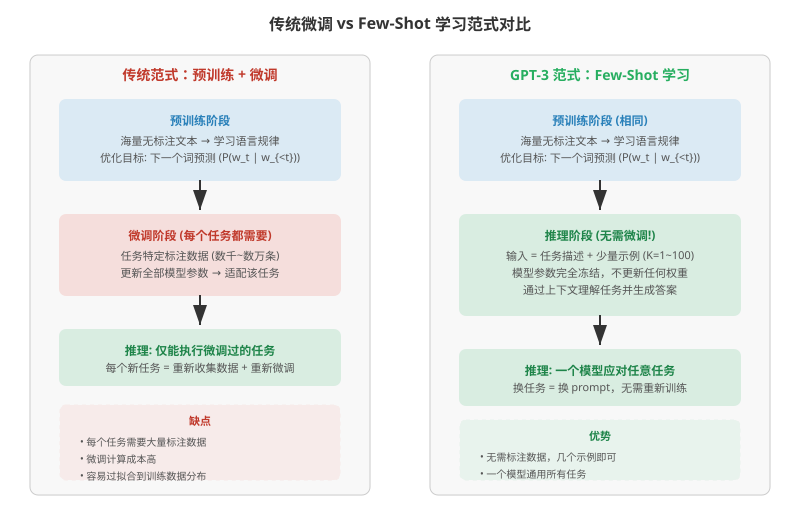
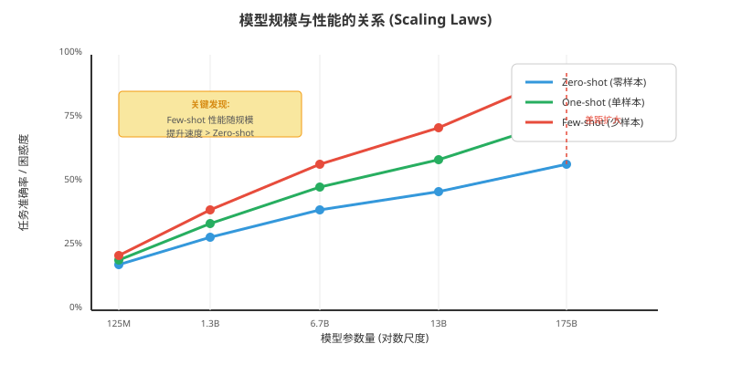
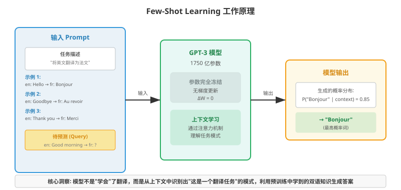
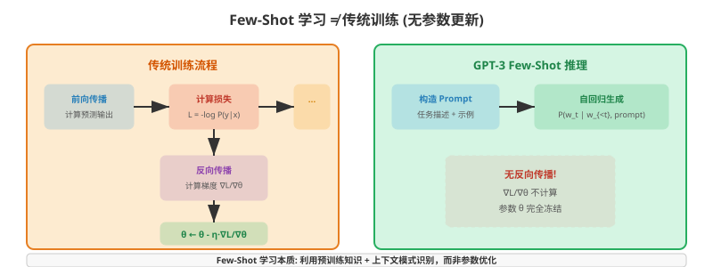
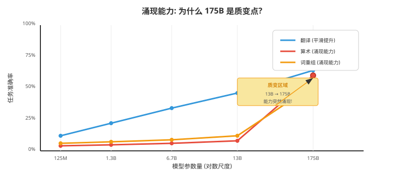

# 语言模型是少样本学习者 (GPT-3)

> **原文**: Language Models are Few-Shot Learners
> **作者**: Tom B. Brown, Benjamin Mann, Nick Ryder, Melanie Subbiah, Jared Kaplan, Prafulla Dhariwal 等 (OpenAI 团队)
> **发表时间**: 2020-05-28
> **arXiv**: [2005.14165](https://arxiv.org/abs/2005.14165)

---

## 一句话总结

OpenAI 训练了一个拥有 **1750 亿参数**的超大语言模型 GPT-3，发现只要给它看几个示例（甚至不给示例），它就能完成各种从未见过的语言任务——**不需要任何参数更新或微调**。

## 研究背景：为什么要做这个？

### 传统 NLP 的困境

在 GPT-3 之前，NLP（Natural Language Processing，自然语言处理）领域的主流做法是"预训练 + 微调"两阶段范式：

1. **预训练**：用海量无标注文本训练一个通用语言模型
2. **微调**：针对每个具体任务（如情感分析、翻译、问答），收集大量标注数据，更新模型参数

这种做法虽然有效，但有几个严重问题：

- **每个任务都需要大量标注数据**（几千到几万条），成本高
- **每个任务都要重新微调**，计算资源浪费
- **容易过拟合**到训练数据的特定分布，泛化能力差

而人类是怎么做的呢？人类只需要看几个例子，甚至听一句指令，就能理解并完成一个新任务。这就是**少样本学习（Few-Shot Learning）**能力。

### 现有方案的问题



### 研究动机

OpenAI 团队基于之前发表的**缩放定律（Scaling Laws）**研究发现：语言模型的性能随着模型规模、数据量和计算量的增加而呈现可预测的幂律提升。他们提出了一个大胆的假设：

> **如果把模型规模放大到足够大，模型可能会自发涌现出少样本学习能力。**

## 核心思路：这篇论文的"大招"是什么？

核心思路非常简单粗暴——**把模型做大，做到极致**。

具体来说，OpenAI 训练了 8 个不同规模的模型（从 1.25 亿到 1750 亿参数），发现：

1. **模型越大，少样本学习能力越强**
2. **少样本性能的提升速度比零样本更快**——模型越大，给它几个示例带来的增益越大
3. **某些能力只在最大模型上才出现**——比如三位数算术、词重组等



GPT-3 的参数量是前一代 GPT-2（15 亿）的 **100 倍**，是此前最大非稀疏语言模型的 **10 倍**。这种规模上的质变带来了能力上的质变。

### 三种评估模式

论文定义了三种评估模式，按给模型的信息量从少到多排列：

| 模式 | 给模型看什么 | 例子 |
|------|-------------|------|
| **Zero-shot（零样本）** | 只有任务描述 | "将以下英文翻译为法文：Hello → " |
| **One-shot（单样本）** | 任务描述 + 1 个示例 | "翻译英文到法文。en: Hi → fr: Salut。en: Hello → " |
| **Few-shot（少样本）** | 任务描述 + K 个示例（K=10~100） | 给多个翻译示例后，让模型翻译新句子 |

关键约束：**所有模式下，模型参数完全冻结，不做任何梯度更新**。



## 具体怎么做的？

### 模型架构

GPT-3 沿用了 GPT-2 的架构，核心是一个**自回归（Autoregressive）Transformer 解码器**：

- **自回归**：逐个生成词，每个词只依赖它之前的词（从左到右）
- **Transformer 解码器**：使用掩码自注意力（Masked Self-Attention），确保生成第 t 个词时只能看到前 t-1 个词
- **交替使用稠密和局部带状稀疏注意力**：类似 Sparse Transformer 的设计，在保持性能的同时降低计算量

8 个模型的规模配置：

| 模型 | 参数量 | 层数 | 隐藏维度 | 注意力头数 |
|------|--------|------|---------|-----------|
| Small | 125M | 12 | 768 | 12 |
| Medium | 350M | 24 | 1024 | 16 |
| Large | 760M | 24 | 1536 | 16 |
| XL | 1.3B | 24 | 2048 | 24 |
| 2.7B | 2.7B | 32 | 2560 | 32 |
| 6.7B | 6.7B | 32 | 4096 | 32 |
| 13B | 13B | 40 | 5120 | 40 |
| **GPT-3** | **175B** | **96** | **12288** | **96** |

所有模型使用相同的**上下文窗口大小：2048 个 token**。

### 训练数据

训练数据混合了多个来源，总计约 **4100 亿 token**（一个 token 约等于 0.75 个英文单词）：

| 数据源 | Token 数量 | 权重 | 采样轮数 |
|--------|-----------|------|---------|
| Common Crawl（过滤后） | 410B | 60% | 0.44 轮 |
| WebText2 | 19B | 22% | 2.9 轮 |
| Books1 | 12B | 8% | 1.9 轮 |
| Books2 | 55B | 8% | 0.43 轮 |
| Wikipedia | 3B | 3% | 3.4 轮 |

**关键设计**：高质量数据（如 WebText、书籍）被采样更多轮次（最高 3.4 轮），而低质量数据（Common Crawl）只采样不到半轮。这确保了模型能从优质文本中反复学习。

数据处理流程：
1. **质量过滤**：用分类器区分高质量语料和原始 Common Crawl
2. **模糊去重**：使用 MinHashLSH 去除重复内容，防止模型"背答案"

### 训练过程

- **优化器**：Adam（β1=0.9, β2=0.95, ε=10⁻⁸）
- **学习率调度**：线性预热（warmup）3.75 亿 token，然后余弦衰减到 10%
- **批次大小**：随模型规模增大，从 32K token 到 320 万 token
- **权重衰减**：0.1
- **混合精度训练**：使用半精度（FP16）加速
- **硬件**：微软高性能集群上的 V100 GPU
- **总算力**：GPT-3 175B 消耗约 **3640 petaflop/s-days**（相比之下 GPT-2 1.5B 只消耗了几十个）

### 优化目标：下一个词预测

GPT-3 的训练目标非常简洁——**最大化下一个词的条件概率**：

$$
\mathcal{L} = -\sum_{t=1}^{T} \log P(w_t | w_1, w_2, ..., w_{t-1}; \theta)
$$

其中：
- $w_t$ 是第 $t$ 个词
- $\theta$ 是模型参数（1750 亿个）
- 这个目标意味着：给定前面的所有词，模型要预测下一个词是什么

**直白翻译**：模型在读了一大堆文本后，要学会"接龙"——根据上下文猜下一个词。就是这么简单。

### Few-Shot 学习机制

Few-Shot 学习时，**模型参数完全冻结**（$\Delta\theta = 0$），不做任何梯度更新。模型通过**自注意力机制**在上下文中识别任务模式，然后利用预训练中学到的知识生成答案。



> **小白tips**: Few-Shot 学习不是"训练"，而是"提示"。就像你不需要重新教一个大学生怎么做数学题，只需要给他看几道例题，他就能举一反三。模型在预训练阶段已经"学会"了海量语言知识，Few-Shot 只是告诉它"这次要用哪种知识"。

### 用一个具体例子走通全流程

#### 场景设定

假设我们有一个极简版的 GPT-3，只有 **4×4 的权重矩阵**（真实模型是 12288×12288，这里简化说明）：

设预训练好的权重 $W \in \mathbb{R}^{4 \times 4}$：

$$
W = \begin{bmatrix}
0.5 & 0.3 & -0.2 & 0.1 \\
-0.1 & 0.8 & 0.4 & -0.3 \\
0.2 & -0.5 & 0.6 & 0.2 \\
0.4 & 0.1 & -0.1 & 0.7
\end{bmatrix}
$$

输入 $x \in \mathbb{R}^4$ 表示"en: Hello"的嵌入向量：

$$
x = \begin{bmatrix} 1.0 \\ 0.5 \\ -0.3 \\ 0.2 \end{bmatrix}
$$

#### Step 1: 前向传播

$$
h = Wx = \begin{bmatrix}
0.5 & 0.3 & -0.2 & 0.1 \\
-0.1 & 0.8 & 0.4 & -0.3 \\
0.2 & -0.5 & 0.6 & 0.2 \\
0.4 & 0.1 & -0.1 & 0.7
\end{bmatrix}
\begin{bmatrix} 1.0 \\ 0.5 \\ -0.3 \\ 0.2 \end{bmatrix}
= \begin{bmatrix}
0.5 + 0.15 + 0.06 + 0.02 \\
-0.1 + 0.4 - 0.12 - 0.06 \\
0.2 - 0.25 - 0.18 + 0.04 \\
0.4 + 0.05 + 0.03 + 0.14
\end{bmatrix}
= \begin{bmatrix} 0.73 \\ 0.12 \\ -0.19 \\ 0.62 \end{bmatrix}
$$

经过 softmax 得到各候选词的概率分布：

$$
P = \text{softmax}(h) = \begin{bmatrix} 0.35 \\ 0.19 \\ 0.14 \\ 0.32 \end{bmatrix}
$$

这里第 1 个分量对应词 "Bonjour"（概率 35%），第 4 个分量对应 "Salut"（概率 32%）。

#### Step 2: 损失计算

假设真实答案是 "Bonjour"（one-hot 向量 $y = [1, 0, 0, 0]^T$），交叉熵损失为：

$$
\mathcal{L} = -\sum_{i=1}^{4} y_i \log P_i = -\log(0.35) \approx 1.05
$$

**直白翻译**：损失衡量的是模型预测和正确答案的差距。模型给 "Bonjour" 35% 的概率，损失就是 $-\log(0.35) \approx 1.05$。如果模型给 100% 概率，损失就是 0（完美预测）。

> **关键区别**：在传统微调中，这个损失会用来计算梯度并更新参数 $W$。但在 GPT-3 的 Few-Shot 模式中，**损失根本不计算**——模型直接输出概率最高的词，完事。

#### Step 3: Few-Shot 如何"学习"

Few-Shot 学习的核心在于**上下文中的示例改变了模型的注意力分布**。

假设我们给模型看 3 个翻译示例：

```
en: Hi → fr: Salut
en: Bye → fr: Au revoir  
en: Thanks → fr: Merci
en: Hello → fr: ?
```

在自注意力机制中，每个位置的输出是所有位置的加权组合：

$$
\text{Attention}(Q, K, V) = \text{softmax}\left(\frac{QK^T}{\sqrt{d_k}}\right)V
$$

当模型看到 "en: Hello → fr: ?" 时，它会通过注意力机制关注前面的示例，发现模式：
- "en: X → fr: Y" 的结构反复出现
- 每次都是把英文词映射到法文词
- 因此 "Hello" 应该对应某个法文词

**参数没有变，但注意力权重根据上下文动态调整了**。这就像人的工作记忆——你不需要重新学习知识，只需要把注意力集中在当前任务上。

#### Step 4: 推理输出

模型在 "fr: ?" 位置生成下一个词的概率分布：

- 没有示例时（Zero-shot）：$P(\text{"Bonjour"}) = 0.25$（靠预训练知识瞎猜）
- 有 3 个示例时（Few-shot）：$P(\text{"Bonjour"}) = 0.72$（从上下文学到了翻译模式）

**这就是 Few-Shot 学习的全部过程——没有梯度、没有更新、没有训练**。

> **小白tips**: 你可以把 GPT-3 想象成一个读过全世界所有书的超级学霸。它不需要重新学习，你只需要告诉它"这次考试考翻译"，它就能从脑子里调出翻译相关的知识。给的示例越多，它越清楚你要它做什么。

## 效果怎么样？

### 各任务对比总览

GPT-3 在 40 多个基准任务上进行了评估，以下是关键结果：

#### 语言建模与完形填空

| 任务 | 之前 SOTA | GPT-3 Zero-shot | GPT-3 Few-shot |
|------|----------|-----------------|----------------|
| LAMBADA（准确率） | 68.0% | 76.2% | **86.4%** |
| LAMBADA（困惑度） | 8.63 | 3.00 | **1.92** |
| StoryCloze（准确率） | 91.8% | 83.2% | 87.7% |

GPT-3 在 LAMBADA 上以 Few-shot 模式**领先之前 SOTA 18%**。

#### 封闭域问答

| 任务 | T5-11B（微调） | GPT-3 Zero | GPT-3 Few |
|------|---------------|------------|-----------|
| TriviaQA | 50.1% | 64.3% | **71.2%**（新 SOTA） |
| WebQuestions | 37.4% | 14.4% | **41.5%** |

TriviaQA 上，GPT-3 Few-shot **超过了需要微调的 T5-11B 模型 21 个百分点**。

#### 翻译

| 方向 | 有监督 SOTA | GPT-3 Zero | GPT-3 Few |
|------|------------|------------|-----------|
| 法→英 | 35.0 BLEU | 21.2 | **39.2** |
| 德→英 | 40.2 BLEU | 27.2 | **40.6** |
| 英→法 | 45.6 BLEU | 25.2 | 32.6 |

**有趣的发现**：GPT-3 翻译成英文的效果比从英文翻译出去更好——这可能是因为训练数据中 93% 是英文，模型对英文的理解远强于其他语言。

#### 常识推理

| 任务 | SOTA（微调） | GPT-3 Zero | GPT-3 Few |
|------|-------------|------------|-----------|
| PIQA | 79.4% | **80.5%** | **82.8%**（新 SOTA） |
| Winogrande | 84.6% | 70.2% | 77.7% |

#### 合成任务（展现涌现能力）

**三位数算术（Few-shot 准确率）**：

| 任务 | 13B 模型 | 175B 模型 |
|------|---------|-----------|
| 2 位数加法 | 52.4% | **100%** |
| 3 位数加法 | 26.0% | **80.4%** |
| 4 位数加法 | 10.5% | **25.5%** |

**词重组（Few-shot 准确率）**：

| 任务 | Zero-shot | Few-shot |
|------|-----------|----------|
| 乱序词还原 | 15.1% | **67.2%** |
| 反义词 | 5.8% | **37.9%** |

注意：模型**完全不会反转单词**（0.4%），这是自回归架构的固有局限。



#### 新闻文章生成——人类无法分辨

论文做了一个有趣的实验：让人类判断一段文字是人类写的还是 GPT-3 生成的。

结果：人类判断准确率仅 **52%**（随机猜测是 50%）。即使对于约 500 词的文章，人类也无法可靠区分。

这引发了关于**虚假信息**的严重担忧。

### 缩放定律的关键发现

1. **交叉熵损失遵循幂律**：随着计算量增加，损失持续下降，在超过之前研究 2 个数量级的范围内仍然平滑（没有出现饱和）

2. **Few-shot 性能提升更快**：模型越大，给几个示例带来的增益越大——Zero-shot 和 Few-shot 之间的差距随规模扩大

3. **大模型是更好的"元学习者"**：它们能更高效地利用上下文中的信息

4. **涌现能力**：某些能力（如算术、词重组）只在最大模型上突然出现——13B 模型表现很差，175B 模型大幅提升

### 数据污染分析

论文团队非常严谨地分析了训练数据和测试集之间的重叠问题：

- 使用 N-gram 匹配检测训练-测试重叠
- 大多数基准测试受污染影响极小
- 标记了 PIQA 和 Winograd 为可能受污染影响的数据集
- Wikipedia 相关基准因完全重叠被排除

## 论文的意义和局限

**主要贡献**：

1. **证明了缩放的力量**：将模型规模放大 100 倍，带来了质的飞跃——从"需要微调才能做好任务"到"给几个示例就能做好"
2. **定义了 Few-Shot 学习范式**：无需梯度更新、无需微调，仅通过文本交互完成任意任务
3. **系统记录了缩放定律**：在 3 个数量级的范围内验证了性能随规模的可预测提升
4. **发现了涌现能力**：某些能力只在足够大的模型上突然出现，这改变了人们对语言模型能力的认知

**局限性**（论文自身提到的）：

1. **文本生成缺陷**：长文本中会出现重复、前后矛盾、逻辑断裂
2. **物理常识薄弱**：回答"把奶酪放冰箱会融化吗？"这类问题有困难
3. **比较任务表现差**：需要比较两个句子关系的任务（如 WiC）表现接近随机
4. **自回归架构限制**：只能从左到右生成，无法双向理解上下文
5. **样本效率低**：预训练看到的文本量远超人类一生能阅读的
6. **推理成本高**：1750 亿参数的模型推理成本极高，不便于实际应用
7. **偏见问题**：模型反映了训练数据中的性别、种族、宗教偏见
8. **滥用风险**：人类无法区分 GPT-3 生成的文本，可能被用于虚假信息、钓鱼诈骗等

## 读后感

GPT-3 这篇论文是 NLP 历史上最重要的里程碑之一。它用一种近乎"暴力"的方式证明了：**规模本身就是质量**。当模型大到一定程度，它会自发涌现出训练时从未显式教过的能力。

这篇论文最大的启示是：**不要把模型能力局限在你训练它做的事情上**。一个只做"下一个词预测"的模型，在规模足够大时，可以翻译、问答、做算术、写代码——这些能力都"藏"在海量文本的统计规律中，只是需要足够大的模型才能"解锁"。

对于后续研究的影响是深远的：
- 直接催生了 GPT-3.5、GPT-4、Claude、Gemini 等大模型竞赛
- Few-Shot / In-Context Learning 成为大模型的标准使用方式
- 推动了 Prompt Engineering（提示工程）这一新领域的诞生
- 也引发了关于 AI 安全、偏见、能源消耗的广泛讨论

**初学者最应该记住的**：GPT-3 的核心创新不是新架构或新算法，而是**规模和数据的极致放大**。它告诉我们，有时候最简单的方法（把模型做大），配合最朴素的目标（预测下一个词），就能产生最惊人的效果。
