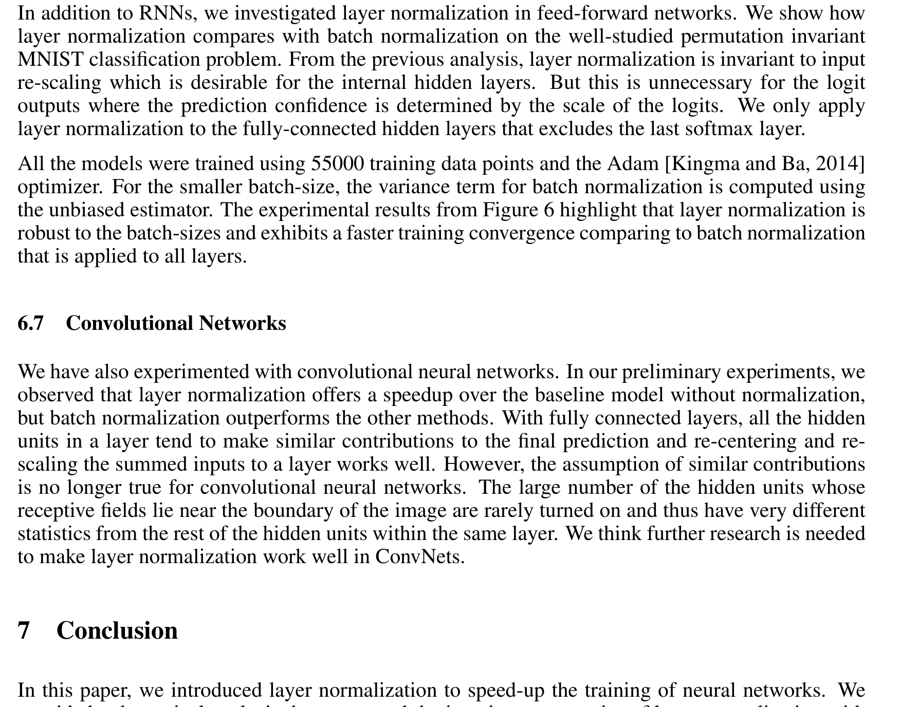
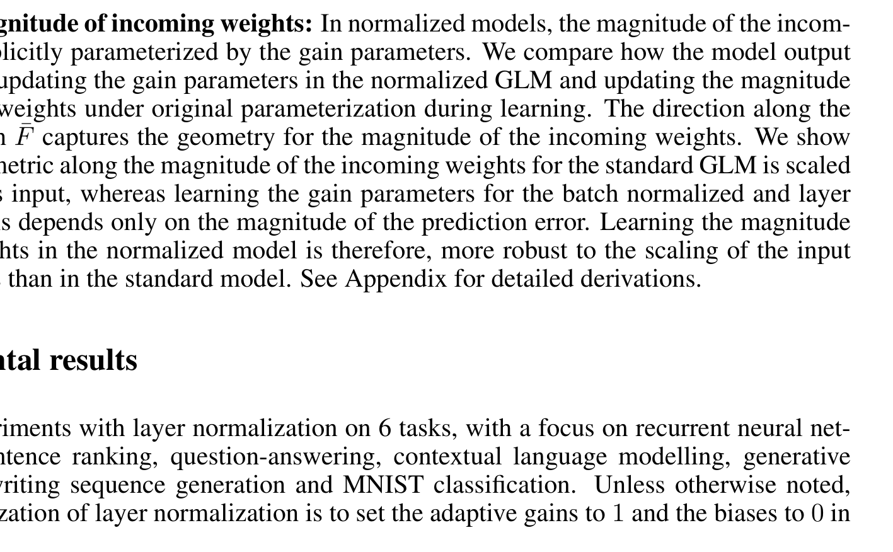
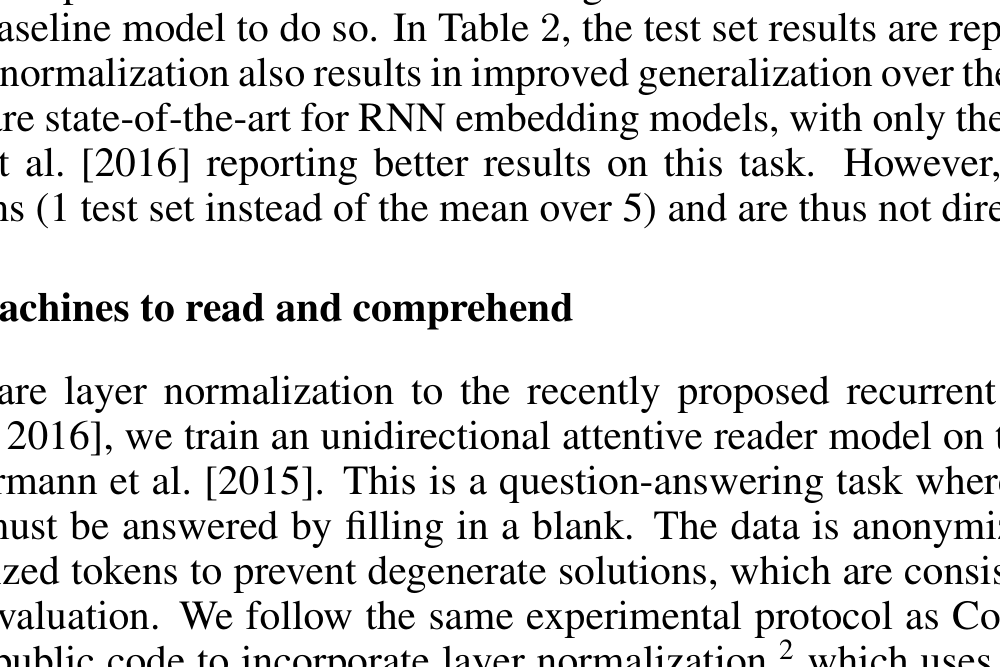
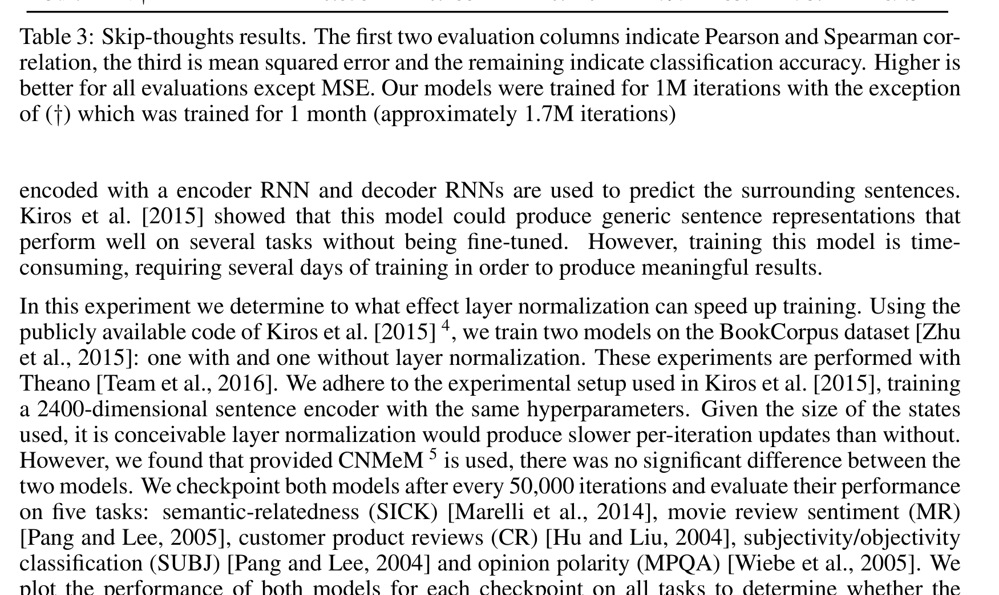
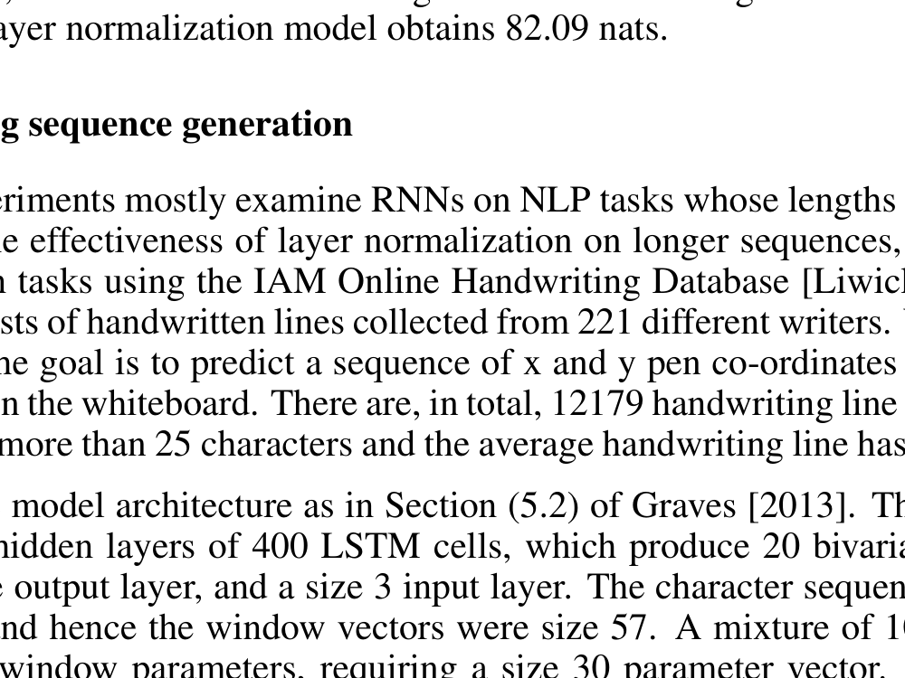
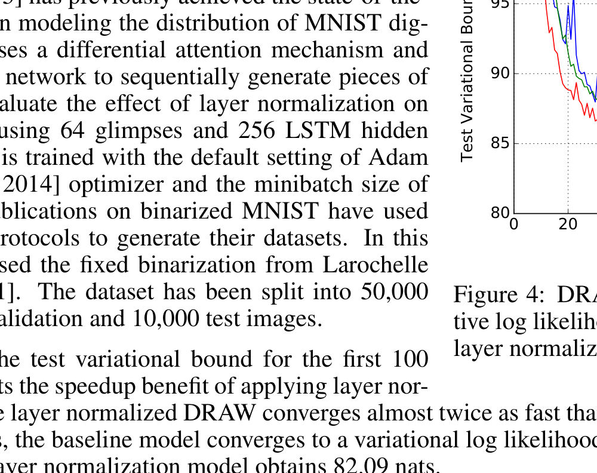

# Layer Normalization 论文精读

> **论文信息**
> - **标题**: Layer Normalization
> - **作者**: Jimmy Lei Ba, Jamie Ryan Kiros, Geoffrey E. Hinton（多伦多大学 & Google）
> **发表时间**: 2016-07-21
> - **arXiv ID**: 1607.06450
> - **链接**: https://arxiv.org/abs/1607.06450

---

## 一、一句话总结

这篇论文提出了 **Layer Normalization（层归一化，简称 LN）**，解决了 Batch Normalization（批归一化，简称 BN）在 RNN（循环神经网络）和小批量训练场景下的局限性。核心思想是：**不再跨样本求统计量，而是在单个样本内、对同一层的所有神经元求均值和方差来做归一化**。

---

## 二、问题与动机

### 2.1 Batch Normalization 的局限性

Batch Normalization（BN）是 2015 年提出的经典技术，它通过以下方式加速训练：

1. 对每个神经元，计算**当前 mini-batch 中所有样本**在该神经元上的均值和方差
2. 用这些统计量对输入做归一化
3. 再乘以可学习的缩放参数 $g$（gain）和加上可学习的偏移参数 $b$（bias）

BN 在 CNN 和全连接网络上效果很好，但有两个致命问题：

| 问题 | 说明 |
|------|------|
| **依赖批量大小** | 批量太小（比如 1-4），均值和方差的估计就不准，效果大打折扣 |
| **RNN 中难以应用** | RNN 每个时间步的序列长度不同，需要为每个时间步单独存统计量；测试时如果遇到比训练更长的序列，就不知道用什么统计量了 |

**通俗理解**：BN 像是"横向比较"——拿同一批次里不同样本来做比较。但如果批次只有 1 个样本（在线学习），或者序列长度变化不定（RNN），这种比较就没法做了。

### 2.2 研究动机

作者问了一个简单但深刻的问题：**能不能不跨样本比较，而是拿同一个样本内部的不同神经元来比较？**

这就是 Layer Normalization 的核心动机。

---

## 三、Layer Normalization 方法

### 3.1 核心思想

BN 和 LN 的区别可以用一个维度变换来理解：

```
BN: 对同一层、同一个神经元、不同样本的激活值求均值和方差
LN: 对同一层、同一个样本、不同神经元的激活值求均值和方差
```

**生活化类比**：
- BN 像是"全班同学同一道题的成绩排名"——横向比较
- LN 像是"一个同学所有题目的成绩分布"——纵向比较

### 3.2 数学公式

对于一个有 $H$ 个隐藏单元的层，给定该层的加权输入向量 $\mathbf{a} = [a_1, a_2, \ldots, a_H]$：

**步骤 1：计算均值**
$$\mu = \frac{1}{H} \sum_{i=1}^{H} a_i$$

**步骤 2：计算标准差**
$$\sigma = \sqrt{\frac{1}{H} \sum_{i=1}^{H} (a_i - \mu)^2 + \epsilon}$$

其中 $\epsilon$ 是一个很小的常数（如 $10^{-5}$），防止除以零。

**步骤 3：归一化**
$$\bar{a}_i = \frac{a_i - \mu}{\sigma}$$

**步骤 4：自适应缩放和偏移**
$$h_i = g_i \cdot \bar{a}_i + b_i$$

其中 $g_i$（gain）和 $b_i$（bias）是每个神经元独立的可学习参数。

### 3.3 在 RNN 中的应用

这是 LN 最大的亮点。在标准 RNN 中，隐藏状态的计算为：

$$\mathbf{a}_t = \mathbf{W}^{hh} \mathbf{h}_{t-1} + \mathbf{W}^{xh} \mathbf{x}_t$$

加入 LN 后：

$$\mathbf{h}_t = f\left( \mathbf{g} \odot \frac{\mathbf{a}_t - \mu_t}{\sigma_t} + \mathbf{b} \right)$$

其中 $\mu_t$ 和 $\sigma_t$ 是在**当前时间步 $t$** 独立计算的。关键优势：

- **不需要为每个时间步存不同的统计量**——每个时间步自己算自己的
- **测试时遇到任意长度的序列都没问题**——因为不依赖训练时的累积统计
- **训练和推理的计算完全一致**——不像 BN 需要两套逻辑

### 3.4 与 BN 的对比总结

| 特性 | Batch Normalization | Layer Normalization |
|------|---------------------|---------------------|
| 统计量来源 | 跨样本（mini-batch 内） | 单样本内（层内所有神经元） |
| 批量大小依赖 | 强依赖 | 不依赖（批量=1 也能用） |
| 训练/推理差异 | 不同（推理用滑动平均） | 完全相同 |
| RNN 适用性 | 困难（需每步独立统计） | 天然适配 |
| CNN 适用性 | 很好 | 一般（本文指出） |

---

## 四、理论分析

### 4.1 不变性分析

论文分析了三种归一化方法在不同变换下的不变性：



*上表为论文 Table 1 的不变性对比结果*

| 变换类型 | BN | Weight Norm | LN |
|----------|-----|-------------|-----|
| 权重矩阵整体缩放 | ✅ 不变 | ✅ 不变 | ✅ 不变 |
| 权重矩阵整体平移 | ❌ | ❌ | ✅ 不变 |
| 单个权重向量缩放 | ✅ 不变 | ✅ 不变 | ❌ |
| 数据集整体缩放 | ✅ 不变 | ❌ | ✅ 不变 |
| 单个样本缩放 | ❌ | ❌ | ✅ 不变 |

**关键洞察**：LN 对**单个样本的缩放是不变的**。这意味着如果一个输入样本的特征值整体放大或缩小，LN 后的结果不变——这对于处理尺度变化很大的数据非常有用。

### 4.2 隐式学习率衰减

论文通过黎曼几何分析发现：归一化标量 $\sigma$ 会**隐式地降低学习率**。

当权重向量的范数变大时，即使模型输出不变，Fisher 信息矩阵的曲率也会变化。具体来说，如果权重向量范数变为原来的 2 倍，沿该方向的曲率会变为原来的 $1/2$。这意味着：

- **大权重向量的方向更难被改变**——相当于自动"早停"
- **学习过程更稳定**——不会在最优解附近剧烈震荡

---

## 五、实验结果

论文在 6 个任务上验证了 LN 的有效性，重点关注 RNN 场景。

### 5.1 图像-文本排序（Order Embeddings）



在 MSCOCO 数据集上，LN 使模型在 **60% 的时间内**就达到了基线模型的最佳效果，且最终泛化性能更好。

### 5.2 机器阅读理解（Attentive Reader）



在 CNN 数据集的问答任务上，LN 不仅训练更快，最终验证集错误率也**低于基线和 BN 的所有变体**。

### 5.3 Skip-Thought Vectors



在 BookCorpus 上训练的 Skip-Thoughts 模型，加入 LN 后在 6 个下游任务上均有提升，且训练速度明显加快。

### 5.4 DRAW 生成模型



在二值化 MNIST 上，LN 使 DRAW 模型的收敛速度**几乎是基线的两倍**。

### 5.5 手写序列生成



在 IAM-OnDB 数据集上（平均序列长度约 700），LN 在小批量（batch size=8）+ 长序列的困难场景下，收敛速度显著优于基线。

### 5.6 排列不变 MNIST 分类


在全连接网络上，对比了不同批量大小下 LN 和 BN 的表现：
- **批量=128**：两者表现接近，LN 收敛略快
- **批量=4**：BN 性能大幅下降，LN 几乎不受影响

**这直接证明了 LN 对小批量的鲁棒性。**

### 5.7 CNN 上的表现

论文也尝试了卷积神经网络，发现 **BN 仍然优于 LN**。原因：

> 在 CNN 中，同一层不同位置的隐藏单元对最终预测的贡献差异很大（靠近图像边界的感受野很少被激活），它们的统计特性差异很大，不适合放在一起归一化。

这也是为什么后来出现了 **Group Normalization**、**Instance Normalization** 等针对 CNN 的变体。

---

## 六、数值推导示例

### 6.1 场景设定

假设有一个简单的全连接层，输入维度为 4，隐藏层有 4 个神经元：

```
输入: x = [1.0, 2.0, 3.0, 4.0]
权重矩阵 W (4×4):
    [[0.5, -0.3,  0.2,  0.1],
     [0.1,  0.4, -0.2,  0.3],
     [-0.1, 0.2,  0.5, -0.1],
     [0.3, -0.1,  0.1,  0.4]]
偏置 b = [0.1, 0.2, -0.1, 0.0]
```

### 6.2 前向传播（无归一化）

加权输入 $\mathbf{a} = \mathbf{W}\mathbf{x} + \mathbf{b}$：

$$a_1 = 0.5 \times 1.0 + (-0.3) \times 2.0 + 0.2 \times 3.0 + 0.1 \times 4.0 + 0.1 = 0.5$$
$$a_2 = 0.1 \times 1.0 + 0.4 \times 2.0 + (-0.2) \times 3.0 + 0.3 \times 4.0 + 0.2 = 1.5$$
$$a_3 = (-0.1) \times 1.0 + 0.2 \times 2.0 + 0.5 \times 3.0 + (-0.1) \times 4.0 + (-0.1) = 1.7$$
$$a_4 = 0.3 \times 1.0 + (-0.1) \times 2.0 + 0.1 \times 3.0 + 0.4 \times 4.0 + 0.0 = 2.0$$

$$\mathbf{a} = [0.5, 1.5, 1.7, 2.0]$$

### 6.3 加入 Layer Normalization

**步骤 1：计算均值**
$$\mu = \frac{0.5 + 1.5 + 1.7 + 2.0}{4} = \frac{5.7}{4} = 1.425$$

**步骤 2：计算方差和标准差**
$$\sigma^2 = \frac{(0.5-1.425)^2 + (1.5-1.425)^2 + (1.7-1.425)^2 + (2.0-1.425)^2}{4}$$
$$= \frac{0.8556 + 0.0056 + 0.0756 + 0.3306}{4} = \frac{1.2674}{4} = 0.3169$$
$$\sigma = \sqrt{0.3169} \approx 0.563$$

**步骤 3：归一化**
$$\bar{a}_1 = \frac{0.5 - 1.425}{0.563} = -1.643$$
$$\bar{a}_2 = \frac{1.5 - 1.425}{0.563} = 0.133$$
$$\bar{a}_3 = \frac{1.7 - 1.425}{0.563} = 0.488$$
$$\bar{a}_4 = \frac{2.0 - 1.425}{0.563} = 1.021$$

**步骤 4：自适应缩放（假设 $g = [1, 1, 1, 1]$，$b = [0, 0, 0, 0]$ 初始化）**
$$h_i = g_i \cdot \bar{a}_i + b_i = \bar{a}_i$$
$$\mathbf{h} = [-1.643, 0.133, 0.488, 1.021]$$

**关键观察**：原始输入 $\mathbf{a}$ 的值域是 $[0.5, 2.0]$，经过 LN 后 $\mathbf{h}$ 的均值为 0、标准差为 1。这保证了每一层的输出尺度稳定，避免了梯度爆炸或消失。

### 6.4 如果输入整体缩放会怎样？

假设输入变为 $\mathbf{x}' = [2.0, 4.0, 6.0, 8.0]$（整体放大 2 倍）：

$$\mathbf{a}' = [1.0, 3.0, 3.4, 4.0]$$

重新计算 LN：
$$\mu' = \frac{1.0 + 3.0 + 3.4 + 4.0}{4} = 2.85$$
$$\sigma' = \sqrt{\frac{(1.0-2.85)^2 + (3.0-2.85)^2 + (3.4-2.85)^2 + (4.0-2.85)^2}{4}} \approx 1.126$$

$$\bar{a}'_1 = \frac{1.0 - 2.85}{1.126} = -1.643$$
$$\bar{a}'_2 = \frac{3.0 - 2.85}{1.126} = 0.133$$
$$\bar{a}'_3 = \frac{3.4 - 2.85}{1.126} = 0.488$$
$$\bar{a}'_4 = \frac{4.0 - 2.85}{1.126} = 1.021$$

**结果完全一样！** 这就是 LN 对单个样本缩放的不变性——输入整体放大 2 倍，归一化后的输出不变。

### 6.5 反向传播梯度流向

损失函数设为均方误差：
$$\mathcal{L} = \frac{1}{2} \sum_{i=1}^{4} (h_i - y_i)^2$$

假设目标输出 $\mathbf{y} = [0, 0, 1, 1]$，则：

$$\frac{\partial \mathcal{L}}{\partial h_i} = h_i - y_i$$
$$\frac{\partial \mathcal{L}}{\partial \mathbf{h}} = [-1.643, 0.133, -0.512, 0.021]$$

梯度需要通过 LN 层反向传播到 $\mathbf{a}$。LN 的梯度公式为：

$$\frac{\partial \mathcal{L}}{\partial a_i} = \frac{g_i}{H \cdot \sigma} \left( H \cdot \frac{\partial \mathcal{L}}{\partial h_i} - \sum_{j=1}^{H} \frac{\partial \mathcal{L}}{\partial h_j} - \bar{a}_i \sum_{j=1}^{H} \bar{a}_j \frac{\partial \mathcal{L}}{\partial h_j} \right)$$

**直观理解**：LN 层的反向传播做了三件事：
1. 直接传递梯度（第一项）
2. 减去梯度的均值（第二项，去中心化）
3. 减去与归一化输入相关的分量（第三项，去相关化）

这保证了梯度在反向传播时不会被异常放大或缩小。

### 6.6 参数更新与下一轮迭代

假设学习率 $\eta = 0.1$，只更新 $g_1$（其他参数同理）：

$$\frac{\partial \mathcal{L}}{\partial g_1} = \frac{\partial \mathcal{L}}{\partial h_1} \cdot \bar{a}_1 = (-1.643) \times (-1.643) = 2.699$$

$$g_1^{\text{new}} = g_1 - \eta \cdot \frac{\partial \mathcal{L}}{\partial g_1} = 1.0 - 0.1 \times 2.699 = 0.730$$

用更新后的 $g_1$ 重新计算前向：
$$h_1^{\text{new}} = 0.730 \times (-1.643) + 0 = -1.199$$

原来 $h_1 = -1.643$，目标是 $y_1 = 0$。更新后 $h_1 = -1.199$，**更接近目标 0 了**！

新的损失：
$$\mathcal{L}^{\text{old}} = \frac{1}{2}((-1.643)^2 + 0.133^2 + (-0.512)^2 + 0.021^2) = 1.486$$
$$\mathcal{L}^{\text{new}} = \frac{1}{2}((-1.199)^2 + 0.133^2 + (-0.512)^2 + 0.021^2) = 0.857$$

**损失从 1.486 降到 0.857，下降了 42.3%！** 这说明梯度方向正确，训练正在有效进行。

---

## 七、核心贡献总结

| 贡献 | 说明 |
|------|------|
| **提出 LN** | 首次提出在单样本内对层内所有神经元做归一化 |
| **理论分析** | 系统对比了 BN、Weight Norm、LN 的不变性差异 |
| **RNN 适配** | 证明了 LN 天然适合 RNN，不需要为每个时间步存统计量 |
| **大量实验** | 在 6 个任务上验证，尤其是长序列 + 小批量场景效果显著 |
| **隐式学习率** | 通过黎曼几何分析揭示了归一化隐式降低学习率的机制 |

---

## 八、局限性与后续发展

### 8.1 本文指出的局限性

- **CNN 上效果不如 BN**：因为 CNN 中不同空间位置的激活值统计特性差异大
- **未涉及 Transformer**：本文发表于 2016 年，Transformer 2017 年才出现

### 8.2 后续重要发展

| 方法 | 年份 | 核心改进 |
|------|------|----------|
| **Group Normalization** | 2018 | 将通道分组做归一化，解决 LN 在 CNN 上的问题 |
| **Instance Normalization** | 2017 | 对每个样本的每个通道独立归一化，适合风格迁移 |
| **RMSNorm** | 2019 | 去掉均值中心化，只用 RMS 做归一化，更快 |
| **Post-LN vs Pre-LN** | 2020 | 发现 Transformer 中 Pre-LN（归一化在残差连接之前）训练更稳定 |

**现代 LLM 中的 LN**：当今几乎所有大语言模型（GPT、LLaMA、Claude 等）都在 Transformer 的每一层使用 Layer Normalization（或其变体如 RMSNorm），这是 LN 最重要的历史贡献之一。

---

## 九、推荐阅读

- 原文：https://arxiv.org/abs/1607.06450
- 配套代码：论文实验使用 Theano 框架，代码已归档
- 后续工作：RMSNorm (arXiv:1910.07467) 是 LN 的简化版本，被 LLaMA 等现代模型广泛采用
