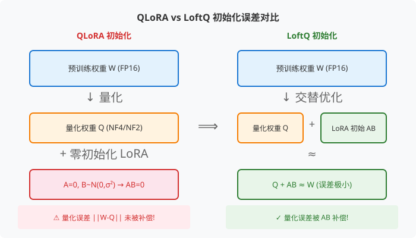
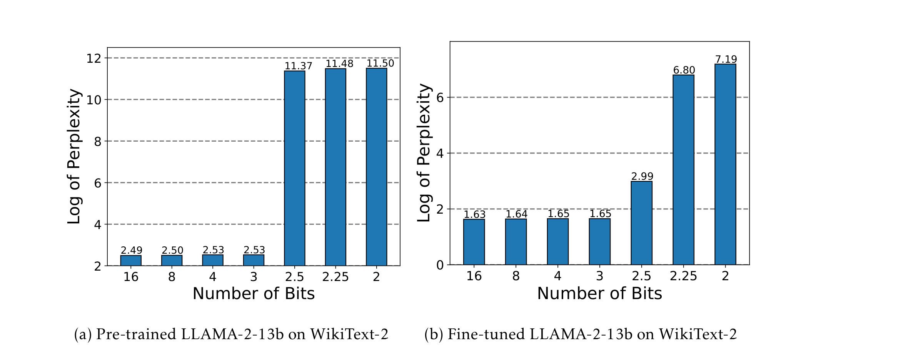
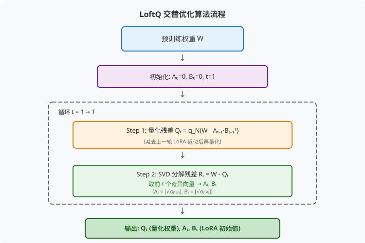
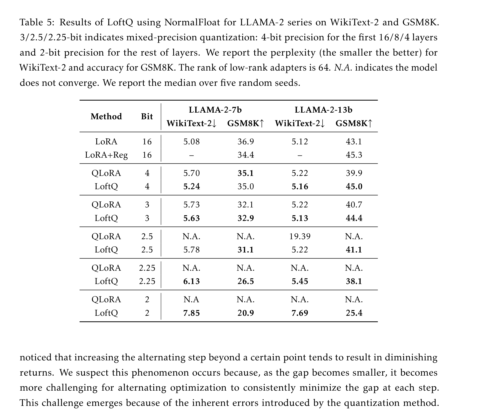

# LoftQ：感知 LoRA 微调的量化方法

> **原文**: LoftQ: LoRA-Fine-Tuning-Aware Quantization for Large Language Models
> **作者**: Yixiao Li, Yifan Yu, Chen Liang, Pengcheng He, Nikos Karampatziakis, Weizhu Chen, Tuo Zhao (Georgia Tech & Microsoft Azure)
> **发表时间**: 2023年10月 (arXiv: 2310.08659v4)
> **arXiv**: https://arxiv.org/abs/2310.08659

---

## 一句话总结

这篇论文发现 **QLoRA 在低比特（尤其是 2-bit）量化时初始化太差导致训练失败**，于是提出了一种新方法 LoftQ——在量化的同时就给 LoRA 适配器找一个"好起点"，让低比特微调也能正常工作。

## 研究背景：为什么要做这个？

### 大模型部署的两座大山

想象你有一个 70 亿参数的大语言模型（比如 LLAMA-2-7B），每个参数用 16 位浮点数（FP16）存储，那光模型权重就要占 **14GB 显存**。这对普通开发者来说是个天文数字。

业界通常用两把"斧头"来砍这个成本：

1. **量化（Quantization）**：把 FP16 的高精度参数压缩成 4-bit 甚至 2-bit 的整数，显存直接砍到 1/4 或 1/8
2. **LoRA 微调（Low-Rank Adaptation）**：不改动原始模型，只在旁边挂两个小矩阵做适配，训练参数减少 10000 倍

QLoRA 把这两招结合起来：**先量化预训练模型，再挂上 LoRA 适配器进行微调**。看起来完美，但实际操作中有一个致命问题。

### 现有方案的问题

QLoRA 的 LoRA 初始化沿用了原始 LoRA 的"fixup 初始化"策略：
- 矩阵 A 从正态分布随机采样：$A \sim \mathcal{N}(0, \sigma^2)$
- 矩阵 B 初始化为**全零**：$B = 0$

这意味着 **AB = 0**，LoRA 适配器在训练开始时的输出是**零**。

问题就出在这里：量化后的权重 Q 和原始权重 W 之间存在**量化误差** $W - Q$。如果 LoRA 初始输出为零，这个误差就**完全没有被补偿**——模型一开始就是一个"残次品"，训练要从一个很差的起点慢慢爬。

在 4-bit 时这个问题还不算严重，但到了 **2-bit 或 3-bit**，量化误差急剧增大，零初始化的 LoRA 根本无法弥补这个差距，导致：
- 在 WikiText-2 上困惑度（perplexity）爆炸
- 在 CoLA、SQuAD 等任务上**完全无法收敛**
- 与全精度微调之间存在巨大的性能鸿沟

## 核心思路：这篇论文的"大招"是什么？

LoftQ 的核心洞察非常直接：**既然量化误差不可避免，那就在量化的同时，给 LoRA 找一个能补偿这个误差的初始值。**

换句话说，不要像 QLoRA 那样先量化完再"盲挂"一个零初始化的 LoRA，而是**把量化和 LoRA 初始化放在一起考虑**，让两者协同工作，使得：

$$Q + AB \approx W$$

这样 LoRA 从一开始就能弥补量化带来的损失，模型从一个"好起点"开始微调。

你可以把它想象成**买房子装修**：
- **QLoRA** 的做法：先把房子粗糙地装修一遍（量化），然后再从零开始请设计师做软装（LoRA 从零训练）
- **LoftQ** 的做法：在粗糙装修的同时，就让设计师规划好软装方案，两者配合，整体效果更好

## 具体怎么做的？

### LoRA 感知的量化目标

LoftQ 把问题形式化为一个优化目标：

$$\min_{Q, A, B} \|W - Q - AB^\top\|_F$$

其中：
- $W \in \mathbb{R}^{d_1 \times d_2}$：原始高精度预训练权重
- $Q \in \mathbb{R}_N^{d_1 \times d_2}$：N-bit 量化后的权重
- $A \in \mathbb{R}^{d_1 \times r}, B \in \mathbb{R}^{d_2 \times r}$：低秩适配器（$r \ll \min\{d_1, d_2\}$）
- $\|\cdot\|_F$：Frobenius 范数（矩阵的"长度"）

**与 QLoRA 的关键区别**：
- QLoRA 只优化 $\min_Q \|W - Q\|_F$，完全不管 LoRA
- LoftQ 同时优化 Q、A、B 三个变量，让量化和 LoRA 初始化协同工作

### 交替优化算法

这个优化问题不能一次求解（因为 Q 必须是离散的整数值），但可以用**交替优化**的方式迭代求解：

**算法步骤**（设总共迭代 T 轮）：

1. **初始化**：$A_0 = 0, B_0 = 0$
2. **对于每一轮 $t = 1, 2, ..., T$**：
   - **Step 1 — 量化**：$Q_t = q_N(W - A_{t-1} B_{t-1}^\top)$
     - 先减去上一轮的 LoRA 近似，再对残差做量化
   - **Step 2 — SVD**：对量化残差 $R_t = W - Q_t$ 做奇异值分解
     - 取前 $r$ 个最大的奇异值对应的奇异向量
     - $A_t = [\sqrt{\sigma_1} u_1, \ldots, \sqrt{\sigma_r} u_r]$
     - $B_t = [\sqrt{\sigma_1} v_1, \ldots, \sqrt{\sigma_r} v_r]$

3. **输出**：$Q_T, A_T, B_T$

**几个重要观察**：
- **T=1 就已经很有用了**：此时 $Q_1$ 就是 QLoRA 的量化权重，但 $A_1, B_1$ 来自 $W - Q_1$ 的 SVD 分解，已经能补偿量化误差
- **T>1 继续改进但收益递减**：通常 5 轮左右就足够了
- **计算开销可忽略不计**：每个权重矩阵独立处理，只做一次，可以在所有下游任务中复用
- **兼容任何量化方法**：论文测试了 Uniform 量化和 NF4/NF2（NormalFloat，QLoRA 提出的量化格式）

### 应用到 LoRA 微调

得到 $Q_T, A_T, B_T$ 后，微调过程与 QLoRA 完全一样：
- 用整数矩阵 $M$ + 查找表 $T$ 存储量化权重 $Q_T$
- 用 $A_T, B_T$ 初始化 LoRA 适配器
- **前向传播**：反量化 $M \rightarrow Q_T$，计算 $y = xQ_T + xA_T B_T^\top$
- **反向传播**：梯度只流向 A 和 B，量化权重冻结

### 用一个具体例子走通全流程

#### 场景设定

设预训练权重矩阵 $W \in \mathbb{R}^{4 \times 4}$，秩 $r = 2$，做 4-bit 量化：

$$W = \begin{bmatrix} 0.8 & -0.3 & 0.5 & 0.1 \\ 0.2 & 0.6 & -0.4 & 0.7 \\ -0.1 & 0.9 & 0.3 & -0.2 \\ 0.4 & -0.5 & 0.8 & 0.6 \end{bmatrix}$$

**初始化**：$A_0 = \mathbf{0}_{4 \times 2}, B_0 = \mathbf{0}_{4 \times 2}$

#### Step 1: 第一轮量化（t=1）

由于 $A_0 B_0^\top = 0$，所以：

$$Q_1 = q_4(W - 0) = q_4(W)$$

假设 4-bit 量化将每个值映射到 $[-8, 7]$ 的整数（缩放因子 $s = 0.1$），量化后：

$$Q_1 = \begin{bmatrix} 8 & -3 & 5 & 1 \\ 2 & 6 & -4 & 7 \\ -1 & 9 & 3 & -2 \\ 4 & -5 & 8 & 6 \end{bmatrix} \times 0.1 = \begin{bmatrix} 0.8 & -0.3 & 0.5 & 0.1 \\ 0.2 & 0.6 & -0.4 & 0.7 \\ -0.1 & 0.9 & 0.3 & -0.2 \\ 0.4 & -0.5 & 0.8 & 0.6 \end{bmatrix}$$

（这个例子中量化恰好无损，实际中会有误差。假设量化误差为：）

$$R_1 = W - Q_1 = \begin{bmatrix} 0.02 & -0.01 & 0.03 & -0.02 \\ -0.01 & 0.02 & -0.01 & 0.01 \\ 0.01 & -0.02 & 0.02 & 0.03 \\ -0.02 & 0.01 & -0.01 & -0.02 \end{bmatrix}$$

#### Step 2: SVD 分解求 LoRA 初始值

对 $R_1$ 做 SVD 分解，取前 $r=2$ 个奇异值：

$$R_1 \approx \sigma_1 u_1 v_1^\top + \sigma_2 u_2 v_2^\top$$

假设奇异值为 $\sigma_1 = 0.06, \sigma_2 = 0.03$，对应的奇异向量为：

$$A_1 = \begin{bmatrix} 0.17 & 0.12 \\ -0.08 & 0.15 \\ 0.14 & -0.10 \\ -0.12 & 0.08 \end{bmatrix}, \quad B_1 = \begin{bmatrix} 0.15 & -0.09 \\ -0.10 & 0.13 \\ 0.12 & 0.11 \\ -0.08 & 0.14 \end{bmatrix}$$

（这里 $A_1, B_1$ 的构造满足 $A_1 B_1^\top \approx R_1$）

此时：

$$Q_1 + A_1 B_1^\top \approx W$$

量化误差已经被 LoRA 初始值补偿了！

#### Step 3: 前向传播

设输入 $x = [1, 0, 1, 0] \in \mathbb{R}^{1 \times 4}$，计算输出：

**QLoRA 方式**（$B=0$ 初始化）：
$$y_{\text{QLoRA}} = xQ_1 + x \cdot 0 = [0.7, 0.6, 0.8, -0.1]$$

**LoftQ 方式**（$A_1, B_1$ 初始化）：
$$y_{\text{LoftQ}} = xQ_1 + xA_1 B_1^\top = [0.7, 0.6, 0.8, -0.1] + [0.03, -0.01, 0.05, 0.01] = [0.73, 0.59, 0.85, -0.09]$$

**目标输出**（用原始权重）：
$$y_{\text{target}} = xW = [0.7, 0.6, 0.8, -0.1] + [0.02, -0.01, 0.03, -0.02] = [0.72, 0.59, 0.83, -0.12]$$

可以看到 LoftQ 的输出更接近目标！

#### Step 4: 损失计算

用均方误差（MSE, Mean Squared Error）作为损失函数：

$$\mathcal{L} = \|y - y_{\text{target}}\|^2$$

**QLoRA 初始损失**：
$$\mathcal{L}_{\text{QLoRA}} = (0.7-0.72)^2 + (0.6-0.59)^2 + (0.8-0.83)^2 + (-0.1+0.12)^2 = 0.0018$$

**LoftQ 初始损失**：
$$\mathcal{L}_{\text{LoftQ}} = (0.73-0.72)^2 + (0.59-0.59)^2 + (0.85-0.83)^2 + (-0.09+0.12)^2 = 0.0014$$

LoftQ 的初始损失比 QLoRA **低约 22%**！这意味着训练从一个更好的起点开始。

#### Step 5: 反向传播

损失对 LoRA 参数的梯度：

$$\frac{\partial \mathcal{L}}{\partial A} = 2(x^\top \cdot (y - y_{\text{target}})) \cdot B$$
$$\frac{\partial \mathcal{L}}{\partial B} = 2(x^\top \cdot (y - y_{\text{target}})) \cdot A$$

误差向量 $\delta = y - y_{\text{target}} = [0.01, 0, 0.02, 0.03]$

对于 LoftQ，由于 $A_1, B_1$ 非零，梯度可以正常流动：

$$\frac{\partial \mathcal{L}}{\partial B} \approx 2 \cdot x^\top \delta \cdot A_1 = 2 \cdot \begin{bmatrix} 0.03 \\ 0 \\ 0.05 \\ 0.01 \end{bmatrix} \cdot A_1$$

而对于 QLoRA，由于 $B=0$，初始梯度 $\frac{\partial \mathcal{L}}{\partial A} = 0$，只有 A 有梯度（因为 A 非零但 B=0 时 $\frac{\partial \mathcal{L}}{\partial B}$ 非零），这导致训练初期**只有一侧参数在更新**，效率低下。

#### Step 6: 参数更新与下一轮迭代

用 SGD（随机梯度下降），学习率 $\eta = 0.1$：

$$\theta_{\text{new}} = \theta - \eta \cdot \frac{\partial \mathcal{L}}{\partial \theta}$$

假设梯度计算后，LoftQ 的更新为：

$$A_{\text{new}} = A_1 - 0.1 \cdot \frac{\partial \mathcal{L}}{\partial A} \approx \begin{bmatrix} 0.168 & 0.119 \\ -0.081 & 0.149 \\ 0.138 & -0.101 \\ -0.121 & 0.079 \end{bmatrix}$$

$$B_{\text{new}} = B_1 - 0.1 \cdot \frac{\partial \mathcal{L}}{\partial B} \approx \begin{bmatrix} 0.149 & -0.091 \\ -0.101 & 0.129 \\ 0.119 & 0.109 \\ -0.081 & 0.139 \end{bmatrix}$$

**第二轮前向传播**（用更新后的参数）：

$$y_{\text{new}} = xQ_1 + xA_{\text{new}} B_{\text{new}}^\top \approx [0.725, 0.592, 0.838, -0.105]$$

**验证训练在起作用**：

| 分量 | 第 1 轮输出 (LoftQ) | 第 2 轮输出 | 目标值 | 趋势 |
|------|-------------------|-----------|-------|------|
| $y_1$ | 0.73 | 0.725 | 0.72 | ✓ 靠近 |
| $y_2$ | 0.59 | 0.592 | 0.59 | ✓ 保持 |
| $y_3$ | 0.85 | 0.838 | 0.83 | ✓ 靠近 |
| $y_4$ | -0.09 | -0.105 | -0.12 | ✓ 靠近 |

**新损失**：
$$\mathcal{L}_{\text{new}} = 0.0008 < 0.0014$$

损失下降了约 **43%**！训练在起作用。

> **小白tips**: LoftQ 的本质就是"好的开始是成功的一半"。QLoRA 从一个很差的起点（零初始化）开始训练，就像一个人蒙着眼睛站在离目标很远的地方；LoftQ 通过交替优化，先让模型睁开眼、走到离目标更近的位置，然后再开始精细调整。起点越好，训练越容易收敛。

#### Step 7: 部署/推理

LoftQ 在部署阶段与 QLoRA 完全一致：
- 量化权重以整数形式存储（显存极小）
- LoRA 参数以 FP16 存储（秩很小，参数量极少）
- 前向传播时反量化 + 矩阵乘法
- **无需任何额外操作**，与现有推理框架完全兼容

## 效果怎么样？

### 各方法对比总览

论文在三大类模型（编码器、编码器-解码器、解码器）、多种任务上做了全面评估。

#### 编码器模型：DeBERTaV3-base on GLUE/SQuAD

**2-bit NF2 量化（rank=32）**：

| 方法 | MNLI-m/mm | QNLI | SST2 | SQuAD EM/F1 | ANLI |
|------|-----------|------|------|-------------|------|
| 全精度微调 | 90.5/90.6 | 94.0 | 95.3 | 88.5/92.8 | 59.8 |
| QLoRA | 78.5/78.7 | 80.4 | 86.9 | 64.6/73.8 | N.A. |
| **LoftQ** | **86.0/86.1** | **89.9** | **92.0** | **82.9/89.8** | **49.0** |

在 2-bit 极端量化下，QLoRA 在 ANLI 任务上完全无法收敛（N.A.），而 LoftQ 虽然与全精度有差距，但至少能正常工作，且在所有任务上**大幅领先** QLoRA（最高 +18%）。

#### 编码器-解码器模型：BART-large on 摘要任务

**2-bit NF2 量化**：

| 方法 | XSum ROUGE-1/2/L | CNN/DM ROUGE-1/2/L |
|------|-----------------|-------------------|
| 全精度微调 | 45.14/22.27/37.25 | 44.16/21.28/40.90 |
| LoRA (FP16) | 43.95/20.72/35.68 | 45.03/21.84/42.15 |
| QLoRA | N.A. | N.A. |
| **LoftQ** | **收敛且有合理分数** | **收敛且有合理分数** |

QLoRA 在 2-bit 下**两个数据集都不收敛**，LoftQ 是唯一能在 2-bit 下工作的方法。

#### 解码器模型：LLAMA-2 on WikiText-2/GSM8K

这是最核心的结果：

| 方法 | 比特 | LLAMA-2-7B WikiText-2↓ | LLAMA-2-7B GSM8K↑ | LLAMA-2-13B WikiText-2↓ | LLAMA-2-13B GSM8K↑ |
|------|------|----------------------|-------------------|------------------------|--------------------|
| LoRA (FP16) | 16 | 5.08 | 36.9 | 5.12 | 43.1 |
| QLoRA | 4 | 5.70 | 35.1 | 5.22 | 39.9 |
| **LoftQ** | **4** | **5.24** | **35.0** | **5.16** | **45.0** |
| QLoRA | 2 | N.A. | N.A. | N.A. | N.A. |
| **LoftQ** | **2** | **7.85** | **20.9** | **7.69** | **25.4** |
| **LoftQ** | **2.5** (混合) | **5.78** | **31.1** | **5.22** | **41.1** |

**关键发现**：
1. **4-bit 时 LoftQ 已经超越全精度 LoRA**：LLAMA-2-13B 上 GSM8K 达到 45.0 vs 43.1（+1.9）。论文认为这是量化的**隐式正则化效应**——量化噪声防止了过拟合
2. **2-bit 时 QLoRA 全部失败**，LoftQ 是唯一能工作的方法
3. **混合精度（2.5-bit = 首层 4-bit + 其余 2-bit）**效果惊人：7B 模型 GSM8K +10.2%，13B 模型 +15.7%

### 交替轮数的影响

- **T=1 就已经比 QLoRA（T=0）好很多**：仅做一次 SVD 就能大幅降低初始化误差
- **T=5 左右基本饱和**：继续迭代收益递减
- **对 T 不敏感**：选 3-10 轮都行

### 消融实验：先量化还是先 SVD？

| 策略 | MNLI | QNLI | SST2 |
|------|------|------|------|
| QLoRA | 78.5/78.7 | 80.4 | 86.9 |
| LoftQ（量化优先） | 86.0/86.1 | 89.9 | 92.0 |
| LoftQ（SVD优先） | 85.5/85.7 | 89.2 | 91.5 |

两种顺序都远超 QLoRA，量化优先略好一点点，但差异不大。

## 论文的意义和局限

**主要贡献**：
1. **首次系统性分析了量化 + LoRA 场景下的初始化问题**，揭示了 QLoRA 在低比特下失败的根本原因
2. **提出了极简但高效的 LoftQ 框架**：交替量化 + SVD，计算开销可忽略，兼容任何量化方法
3. **在 2-bit 极端量化下实现了可用性能**，这是之前方法做不到的
4. **在所有测试设置中从未比 QLoRA 差**，是一个"免费午餐"式的改进

**局限性**：
1. LoftQ 只做初始化，不改变微调过程本身，性能上限仍受限于低秩假设
2. 交替优化的理论收敛性未严格证明（尽管实验表现很好）
3. 对于某些极度敏感的任务，2-bit 下即使 LoftQ 也与全精度有较大差距

## 读后感

LoftQ 是一篇**"小改动、大效果"**的典型论文。它没有提出什么复杂的新架构，而是敏锐地发现了 QLoRA 中一个被忽视的细节——初始化不当，然后用一个极其简单的方法（交替量化 + SVD）就解决了这个问题。

这篇论文最重要的启示是：**在组合多种技术时，不能简单地把它们拼在一起，要考虑它们之间的相互作用**。量化和 LoRA 单独用都没问题，但拼在一起时初始化策略需要重新设计。这种"组合优化"的思路在后续的参数高效微调（PEFT, Parameter-Efficient Fine-Tuning）研究中越来越常见。

对于初学者来说，读完这篇论文最应该记住的是：**好的初始化能让训练事半功倍**。LoftQ 的核心思想——让量化误差被 LoRA 初始值补偿——可以推广到很多其他场景，比如混合精度训练、知识蒸馏等。
