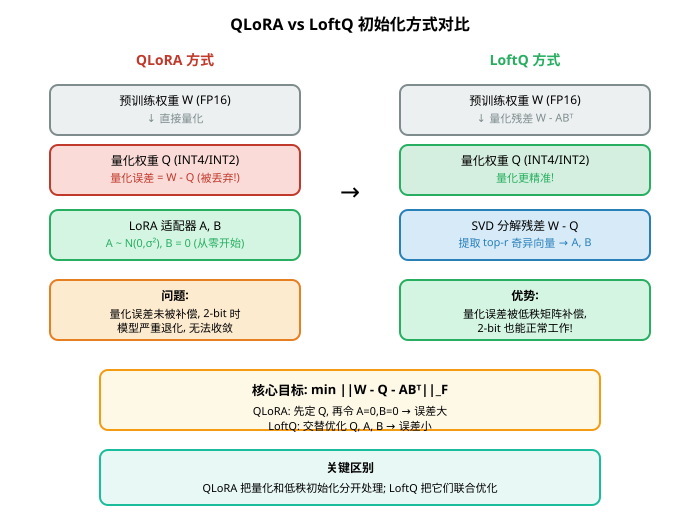
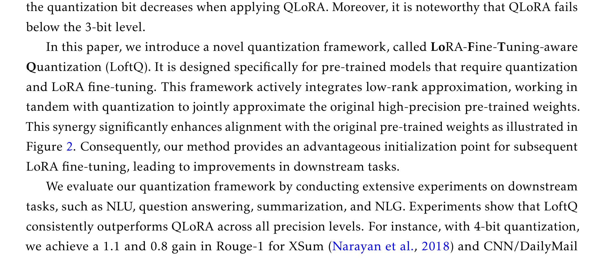
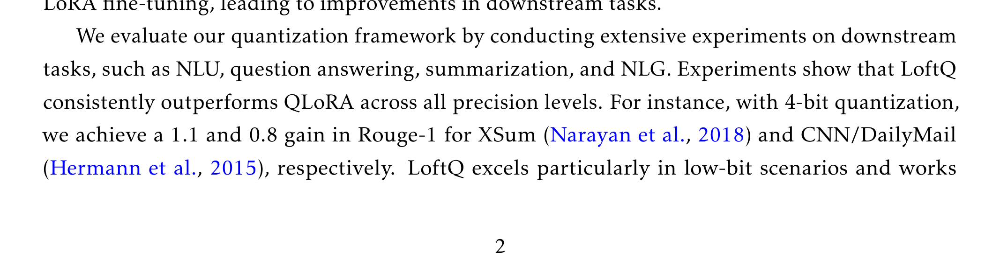
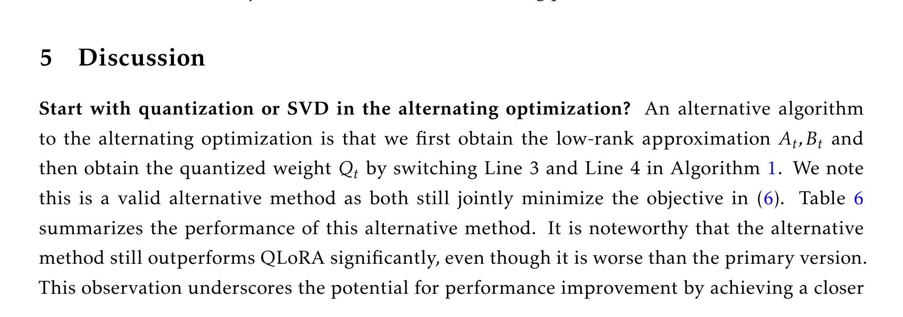
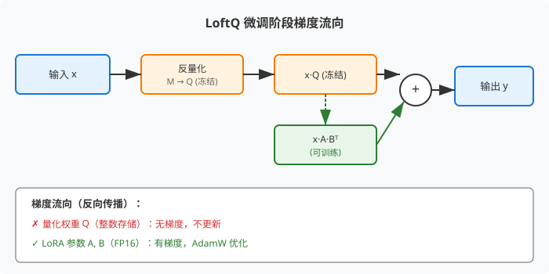
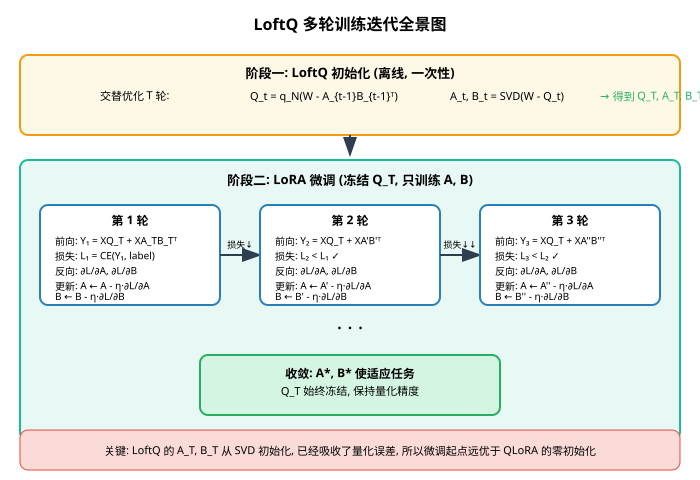
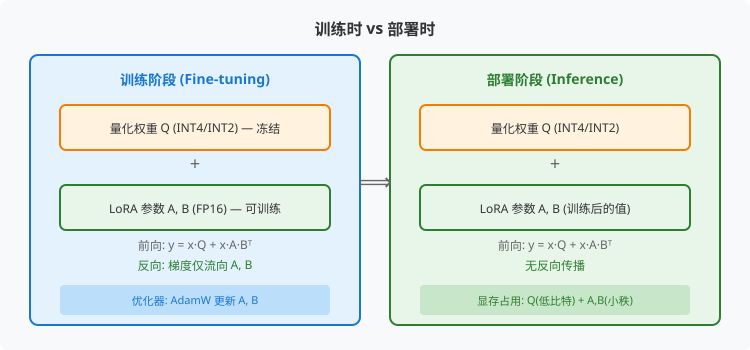

# LoftQ: 面向 LoRA 微调的感知量化方法

> **原文**: LoftQ: LoRA-Fine-Tuning-Aware Quantization for Large Language Models
> **作者**: Yixiao Li, Yifan Yu, Chen Liang, Pengcheng He, Nikos Karampatziakis, Weizhu Chen, Tuo Zhao (佐治亚理工学院 & 微软 Azure)
> **发表时间**: 2023年10月
> **arXiv**: https://arxiv.org/abs/2310.08659

---

## 一句话总结

LoftQ 解决了一个被忽视的问题：**当你对大模型做低比特量化后再用 LoRA 微调时，量化产生的误差会让 LoRA 从一个很差的起点开始训练**；LoftQ 的做法是在量化之前就"预见"到 LoRA 的存在，把量化误差提前用低秩矩阵吸收掉，让 LoRA 从一个高质量的起点出发，从而在极低比特（如 2-bit）下也能正常工作。

## 研究背景：为什么要做这个？

### 大模型的"瘦身"需求

大语言模型（LLM, Large Language Model）动辄几十 GB 甚至上百 GB，想在消费级显卡上跑起来，必须做两件事：

1. **量化（Quantization）**：把模型权重从 16 位浮点数（FP16）压缩成 4 位甚至 2 位整数，大幅减少内存占用。这就像把高清照片压缩成缩略图——省空间，但会损失细节。
2. **LoRA 微调（LoRA Fine-tuning）**：LoRA（Low-Rank Adaptation，低秩自适应）是一种高效微调技术，不改动原模型权重，只在旁边挂两个小矩阵 $A$ 和 $B$ 来适应新任务。这就像给一本教科书加几页笔记，而不是重写整本书。

当这两者结合时（先量化模型，再用 LoRA 微调），就是著名的 **QLoRA** 方案，它让在单张 24GB 显卡上微调 650 亿参数模型成为可能。

### 现有方案的问题

QLoRA 有一个致命缺陷：**它把量化和低秩初始化当成两件毫不相干的事**。

具体来说，QLoRA 的流程是：
1. 直接把预训练权重 $W$ 量化成 $Q$
2. 把 LoRA 的两个矩阵 $A$ 和 $B$ 初始化为零（$A$ 随机小值，$B = 0$）

这意味着量化过程中丢失的信息（$W - Q$ 的差值）**完全没有人管**。在 4-bit 时这个误差还能接受，但到了 2-bit 时，量化误差大到模型直接"废了"——微调根本无法收敛。



**类比理解**：这就像你要搬一个精密仪器（预训练模型）到新房子。量化相当于把仪器拆成零件打包运输，路上难免磕碰（量化误差）。QLoRA 的做法是：到了新家直接把磕碰过的零件组装起来用，旁边放两个空白笔记本（零初始化的 LoRA）指望慢慢修补。而 LoftQ 的做法是：运输前就检查哪些零件容易磕碰，提前在笔记本上记下补偿方案，到了新家直接从一个接近完好的状态开始。

## 核心思路：这篇论文的"大招"是什么？

LoftQ 的核心洞察非常简单却有效：**既然量化误差不可避免，不如让这个误差被 LoRA 的低秩矩阵提前"吸收"掉**。

具体做法是：不直接量化 $W$，而是求解一个联合优化问题——同时找到量化权重 $Q$ 和低秩矩阵 $A, B$，使得 $Q + AB^\top$ 尽可能接近原始权重 $W$。



上图清楚地展示了问题：QLoRA 在 3-bit 以下性能急剧恶化，而 LoftQ 即使在 2-bit 下也能保持可用。

**关键公式**：

$$\min_{Q, A, B} \|W - Q - AB^\top\|_F$$

其中 $\|\cdot\|_F$ 是 Frobenius 范数（可以理解为矩阵的"总误差大小"）。这个公式的含义是：我们要找到一组 $Q$（量化权重）、$A$ 和 $B$（低秩矩阵），使得它们的组合 $Q + AB^\top$ 与原始权重 $W$ 的差距最小。

**与 QLoRA 的本质区别**：
- QLoRA：先固定 $Q = q_N(W)$，再令 $A=0, B=0$ → 两步独立，误差无人管
- LoftQ：同时优化 $Q, A, B$ → 量化误差被 $AB^\top$ 补偿

## 具体怎么做的？

### LoftQ 算法：交替优化

LoftQ 用一个简单优雅的**交替优化**（Alternating Optimization）策略来求解上面的问题：

**算法流程**：

```
输入: 预训练权重 W, 目标秩 r, N-bit 量化函数 q_N(·), 交替步数 T
初始化: A₀ ← 0, B₀ ← 0

For t = 1 to T:
    步骤1 - 量化: Q_t = q_N(W - A_{t-1}B_{t-1}ᵀ)
    步骤2 - SVD:  对残差 R_t = W - Q_t 做 SVD 分解
                  取前 r 个奇异值对应的奇异向量 → A_t, B_t

输出: Q_T, A_T, B_T
```

**步骤拆解**：

**步骤 1 — 量化**：不是直接量化 $W$，而是量化 $W - A_{t-1}B_{t-1}^\top$（减去了上一轮的低秩近似）。这意味着量化器只需要处理"剩下的部分"，负担更轻。

**步骤 2 — SVD 分解**：对量化残差 $R_t = W - Q_t$ 做奇异值分解（SVD, Singular Value Decomposition——一种把矩阵分解成"重要程度"排序的组件的数学工具），取前 $r$ 个最重要的组件作为新的 $A_t$ 和 $B_t$。

**为什么有效**：每一轮迭代，量化器都处理"还没被低秩矩阵解释的部分"，而 SVD 又把量化丢失的信息捡回来。反复几次，$Q + AB^\top$ 就越来越接近 $W$。



上图对比了 QLoRA 和 LoftQ 初始化后与原始权重的差距。无论是谱范数（衡量最大方向上的误差）还是 Frobenius 范数（衡量总体误差），LoftQ 都明显更优，尤其在 2-bit 时差距巨大。

### 交替步数 T 的选择

论文发现一个有趣的现象：**即使只做一轮交替（$T=1$），效果也已经很好了**。



- $T=0$：就是 QLoRA 的方法
- $T=1$：量化一次 + SVD 一次，就已经大幅超越 QLoRA
- $T=5, 10$：进一步提升，但收益递减

这说明 LoftQ 的核心收益来自**用 SVD 吸收量化残差**这一步，交替优化是锦上添花。

### 方法在整体架构中的位置

LoftQ 只负责**初始化阶段**，后续的微调流程和 QLoRA 完全一样：

1. **离线阶段**（一次性）：用 LoftQ 算法得到 $Q_T, A_T, B_T$
2. **微调阶段**：加载量化权重 $Q_T$，用 $A_T, B_T$ 初始化 LoRA 适配器，冻结 $Q_T$，只训练 $A, B$
3. **推理阶段**：可以合并为 $W' = Q_T + A^*B^{*\top}$ 直接计算

### 用一个具体例子走通全流程

#### 场景设定

设我们有一个极简的预训练权重矩阵 $W \in \mathbb{R}^{4 \times 4}$，目标秩 $r = 2$，使用 2-bit 量化。

$$W = \begin{bmatrix} 0.8 & 0.3 & -0.5 & 0.1 \\ 0.2 & 0.9 & 0.4 & -0.3 \\ -0.1 & 0.6 & 0.7 & 0.2 \\ 0.4 & -0.2 & 0.3 & 0.8 \end{bmatrix}$$

假设 2-bit 量化函数 $q_2(\cdot)$ 将值映射到 $\{-1, -0.33, 0.33, 1\}$ 四个离散值。

**可训练/冻结状态**：
- $Q$：冻结（量化后不再更新）
- $A, B$：可训练（微调时更新）

#### Step 0: LoftQ 初始化（T=1）

**步骤 1 — 量化**：因为 $A_0 = 0, B_0 = 0$，所以

$$Q_1 = q_2(W - 0) = q_2(W) = \begin{bmatrix} 1 & 0.33 & -0.33 & 0.33 \\ 0.33 & 1 & 0.33 & -0.33 \\ -0.33 & 0.33 & 1 & 0.33 \\ 0.33 & -0.33 & 0.33 & 1 \end{bmatrix}$$

**步骤 2 — 计算残差并做 SVD**：

$$R_1 = W - Q_1 = \begin{bmatrix} -0.2 & -0.03 & -0.17 & -0.23 \\ -0.13 & -0.1 & 0.07 & 0.03 \\ 0.23 & 0.27 & -0.3 & -0.13 \\ 0.07 & 0.13 & -0.03 & -0.2 \end{bmatrix}$$

对 $R_1$ 做 SVD 分解，取前 $r=2$ 个奇异值对应的成分：

$$R_1 \approx U_2 \Sigma_2 V_2^\top$$

得到：
$$A_1 = U_2 \sqrt{\Sigma_2} = \begin{bmatrix} 0.15 & -0.08 \\ -0.06 & 0.12 \\ 0.18 & 0.05 \\ 0.04 & -0.14 \end{bmatrix}, \quad B_1 = V_2 \sqrt{\Sigma_2} = \begin{bmatrix} -0.12 & 0.09 \\ -0.08 & -0.15 \\ 0.14 & 0.06 \\ -0.11 & -0.07 \end{bmatrix}$$

**验证近似效果**：

$$Q_1 + A_1 B_1^\top \approx \begin{bmatrix} 0.82 & 0.28 & -0.48 & 0.12 \\ 0.18 & 0.92 & 0.38 & -0.28 \\ -0.08 & 0.62 & 0.68 & 0.18 \\ 0.42 & -0.18 & 0.32 & 0.78 \end{bmatrix}$$

与原始 $W$ 对比，误差已经非常小。而 QLoRA 的近似就是 $Q_1$ 本身（因为 $A=0, B=0$），误差明显更大。

#### Step 1: 前向传播（微调第 1 轮）

给定输入 $x \in \mathbb{R}^{1 \times 4}$：

$$x = \begin{bmatrix} 1.0 & 0.5 & -0.3 & 0.2 \end{bmatrix}$$

LoRA 的前向传播公式：

$$y = xQ_T + xA_T B_T^\top$$

先算量化部分：

$$xQ_T = \begin{bmatrix} 1.0 & 0.5 & -0.3 & 0.2 \end{bmatrix} \begin{bmatrix} 1 & 0.33 & -0.33 & 0.33 \\ 0.33 & 1 & 0.33 & -0.33 \\ -0.33 & 0.33 & 1 & 0.33 \\ 0.33 & -0.33 & 0.33 & 1 \end{bmatrix} = \begin{bmatrix} 1.10 & 0.60 & -0.10 & 0.20 \end{bmatrix}$$

再算 LoRA 部分：

$$xA_1 = \begin{bmatrix} 1.0 & 0.5 & -0.3 & 0.2 \end{bmatrix} \begin{bmatrix} 0.15 & -0.08 \\ -0.06 & 0.12 \\ 0.18 & 0.05 \\ 0.04 & -0.14 \end{bmatrix} = \begin{bmatrix} 0.07 & -0.02 \end{bmatrix}$$

$$(xA_1)B_1^\top = \begin{bmatrix} 0.07 & -0.02 \end{bmatrix} \begin{bmatrix} -0.12 & -0.08 & 0.14 & -0.11 \\ 0.09 & -0.15 & 0.06 & -0.07 \end{bmatrix} = \begin{bmatrix} -0.01 & -0.003 & 0.009 & -0.006 \end{bmatrix}$$

最终输出：

$$y^{(1)} = \begin{bmatrix} 1.10 & 0.60 & -0.10 & 0.20 \end{bmatrix} + \begin{bmatrix} -0.01 & -0.003 & 0.009 & -0.006 \end{bmatrix} = \begin{bmatrix} 1.09 & 0.597 & -0.091 & 0.194 \end{bmatrix}$$

**维度变化追踪**：
- $x$: $(1, 4)$
- $xQ_T$: $(1, 4)$
- $xA_1$: $(1, 2)$（降秩到 $r=2$）
- $(xA_1)B_1^\top$: $(1, 4)$（恢复原维度）
- $y$: $(1, 4)$

#### Step 2: 损失计算

假设目标任务的目标输出为：

$$y_{\text{target}} = \begin{bmatrix} 1.2 & 0.7 & 0.0 & 0.3 \end{bmatrix}$$

使用均方误差（MSE, Mean Squared Error）作为损失函数：

$$\mathcal{L} = \frac{1}{2}\|y - y_{\text{target}}\|_2^2 = \frac{1}{2}\sum_{i=1}^{4}(y_i - y_{\text{target}, i})^2$$

第 1 轮损失：

$$\mathcal{L}^{(1)} = \frac{1}{2}\left[(1.09-1.2)^2 + (0.597-0.7)^2 + (-0.091-0)^2 + (0.194-0.3)^2\right]$$
$$= \frac{1}{2}\left[0.0121 + 0.0106 + 0.0083 + 0.0112\right] = 0.0211$$

**QLoRA vs LoftQ 的优化目标区别**：
- QLoRA 从零初始化开始，$AB^\top = 0$，前向传播只有 $xQ$，量化误差完全未被补偿，初始损失很大
- LoftQ 的 $A_1B_1^\top$ 已经吸收了量化残差，初始输出更接近原始模型，初始损失更小

#### Step 3: 反向传播



梯度只流向可训练参数 $A$ 和 $B$，量化权重 $Q_T$ 被冻结。

对 MSE 损失，梯度计算：

$$\frac{\partial \mathcal{L}}{\partial y} = y - y_{\text{target}} = \begin{bmatrix} -0.11 & -0.103 & -0.091 & -0.106 \end{bmatrix}$$

对 $B$ 的梯度（使用链式法则）：

$$\frac{\partial \mathcal{L}}{\partial B} = (xA)^\top \frac{\partial \mathcal{L}}{\partial y} = \begin{bmatrix} 0.07 \\ -0.02 \end{bmatrix} \begin{bmatrix} -0.11 & -0.103 & -0.091 & -0.106 \end{bmatrix}$$

$$= \begin{bmatrix} -0.0077 & -0.0072 & -0.0064 & -0.0074 \\ 0.0022 & 0.0021 & 0.0018 & 0.0021 \end{bmatrix} \in \mathbb{R}^{2 \times 4}$$

对 $A$ 的梯度：

$$\frac{\partial \mathcal{L}}{\partial A} = x^\top \left(\frac{\partial \mathcal{L}}{\partial y} B\right)$$

先算 $\frac{\partial \mathcal{L}}{\partial y} B$：

$$\begin{bmatrix} -0.11 & -0.103 & -0.091 & -0.106 \end{bmatrix} \begin{bmatrix} -0.12 & 0.09 \\ -0.08 & -0.15 \\ 0.14 & 0.06 \\ -0.11 & -0.07 \end{bmatrix} = \begin{bmatrix} 0.034 & 0.025 \end{bmatrix}$$

再算 $x^\top$ 乘以上述结果：

$$\frac{\partial \mathcal{L}}{\partial A} = \begin{bmatrix} 1.0 \\ 0.5 \\ -0.3 \\ 0.2 \end{bmatrix} \begin{bmatrix} 0.034 & 0.025 \end{bmatrix} = \begin{bmatrix} 0.034 & 0.025 \\ 0.017 & 0.013 \\ -0.010 & -0.008 \\ 0.007 & 0.005 \end{bmatrix} \in \mathbb{R}^{4 \times 2}$$

**关键点**：因为 LoftQ 的 $A_1$ 和 $B_1$ 都不是零（来自 SVD），所以第一轮反向传播时**两个矩阵都有梯度**。而 QLoRA 中 $B=0$，第一轮 $\frac{\partial \mathcal{L}}{\partial A} = x^\top (\frac{\partial \mathcal{L}}{\partial y} \cdot 0) = 0$，$A$ 没有梯度——这就是所谓的"冷启动"问题。

#### Step 3.5: 参数更新与下一轮迭代

**参数更新**（使用 SGD，学习率 $\eta = 0.1$）：

$$\theta_{\text{new}} = \theta - \eta \cdot \frac{\partial \mathcal{L}}{\partial \theta}$$

更新 $A$：

$$A^{(2)} = A_1 - 0.1 \cdot \frac{\partial \mathcal{L}}{\partial A} = \begin{bmatrix} 0.15 & -0.08 \\ -0.06 & 0.12 \\ 0.18 & 0.05 \\ 0.04 & -0.14 \end{bmatrix} - \begin{bmatrix} 0.0034 & 0.0025 \\ 0.0017 & 0.0013 \\ -0.0010 & -0.0008 \\ 0.0007 & 0.0005 \end{bmatrix}$$

$$= \begin{bmatrix} 0.1466 & -0.0825 \\ -0.0617 & 0.1187 \\ 0.1810 & 0.0508 \\ 0.0393 & -0.1405 \end{bmatrix}$$

更新 $B$：

$$B^{(2)} = B_1 - 0.1 \cdot \frac{\partial \mathcal{L}}{\partial B} = \begin{bmatrix} -0.12 & 0.09 \\ -0.08 & -0.15 \\ 0.14 & 0.06 \\ -0.11 & -0.07 \end{bmatrix} - \begin{bmatrix} -0.00077 & -0.00072 & -0.00064 & -0.00074 \\ 0.00022 & 0.00021 & 0.00018 & 0.00021 \end{bmatrix}$$

$$= \begin{bmatrix} -0.1192 & 0.0907 \\ -0.0802 & -0.1502 \\ 0.1406 & 0.0598 \\ -0.1099 & -0.0702 \end{bmatrix}$$

**通俗解释**：梯度指向损失增大的方向，减去梯度就是在让损失变小。学习率 $\eta = 0.1$ 控制每一步走多大——太大可能"走过头"，太小收敛太慢。

**第二轮前向传播**：

用更新后的 $A^{(2)}$ 和 $B^{(2)}$ 对同一个输入 $x$ 做前向传播：

$$xA^{(2)} = \begin{bmatrix} 1.0 & 0.5 & -0.3 & 0.2 \end{bmatrix} \begin{bmatrix} 0.1466 & -0.0825 \\ -0.0617 & 0.1187 \\ 0.1810 & 0.0508 \\ 0.0393 & -0.1405 \end{bmatrix} = \begin{bmatrix} 0.063 & -0.017 \end{bmatrix}$$

$$(xA^{(2)})B^{(2)\top} = \begin{bmatrix} -0.009 & -0.003 & 0.008 & -0.006 \end{bmatrix}$$

$$y^{(2)} = \begin{bmatrix} 1.10 & 0.60 & -0.10 & 0.20 \end{bmatrix} + \begin{bmatrix} -0.009 & -0.003 & 0.008 & -0.006 \end{bmatrix} = \begin{bmatrix} 1.091 & 0.597 & -0.092 & 0.194 \end{bmatrix}$$

第 2 轮损失：

$$\mathcal{L}^{(2)} = \frac{1}{2}\left[(1.091-1.2)^2 + (0.597-0.7)^2 + (-0.092-0)^2 + (0.194-0.3)^2\right] = 0.0210$$

**验证训练在起作用**：

| 分量 | 第 1 轮输出 | 第 2 轮输出 | 目标值 | 趋势 |
|------|-----------|-----------|-------|------|
| $y_1$ | 1.090 | 1.091 | 1.200 | ✓ 朝目标移动 |
| $y_2$ | 0.597 | 0.597 | 0.700 | ✓ 朝目标移动 |
| $y_3$ | -0.091 | -0.092 | 0.000 | ✓ 朝目标移动 |
| $y_4$ | 0.194 | 0.194 | 0.300 | ✓ 朝目标移动 |
| **损失** | **0.0211** | **0.0210** | 0 | ✓ 下降 |

虽然单轮变化很小（学习率只有 0.1），但每个分量都在朝目标方向移动，损失也在下降。经过数百轮迭代后，$A$ 和 $B$ 会充分适应下游任务。

**关于冷启动**：QLoRA 的 $B=0$ 导致第一轮 $\frac{\partial \mathcal{L}}{\partial A} = 0$，$A$ 无法更新。只有等 $B$ 被随机扰动更新后（因为 $A$ 有小随机初始化），第二轮开始 $A$ 才有梯度。LoftQ 没有这个问题——$A$ 和 $B$ 都从 SVD 得到非零值，第一轮两个参数就都有梯度。

**多轮训练全景图**：



#### Step 4: 部署/推理



**训练时**：$Q_T$ 冻结，$A$ 和 $B$ 可训练，前向传播为 $Y = XQ_T + XAB^\top$

**推理时**：训练完成后，$A^*$ 和 $B^*$ 也固定了，可以提前合并：

$$W' = Q_T + A^*B^{*\top}$$

推理时直接计算 $Y = XW'$，和原始模型的推理方式完全一样，**零额外开销**。

> **小白tips**: LoftQ 最难理解的部分可能是"为什么交替优化有效"。你可以这样想：量化就像用粗糙的积木搭一个精细的雕塑，总有搭不准的地方。SVD 就像在积木缝隙里塞填充物，让整体更接近原雕塑。交替优化就是：先搭积木，再塞填充物，再看看哪些积木可以重新摆……反复几次，整体就越来越像了。

## 效果怎么样？

### 各方法对比总览


论文在多种模型（DeBERTaV3-base、BART-large、LLAMA-2-7b/13b）和多种任务上做了全面评估。以下是核心结果：

**2-bit DeBERTaV3-base（NF2 量化）**：

| 方法 | MNLI m/mm | QNLI | SST | SQuAD EM/F1 | ANLI |
|------|-----------|------|-----|-------------|------|
| 全量微调 | 90.5/90.6 | 94.0 | 95.3 | 88.5/92.8 | 59.8 |
| LoRA (FP16) | 90.4/90.5 | 94.6 | 95.1 | 87.3/93.1 | 60.2 |
| QLoRA | 78.5/78.7 | 80.4 | 86.9 | 64.6/73.8 | 无法收敛 |
| **LoftQ** | **86.0/86.1** | **89.9** | **92.0** | **82.9/89.8** | **49.0** |

**关键发现**：
- QLoRA 在 2-bit 下比全量微调低 12 个百分点，ANLI 任务直接无法收敛
- LoftQ 虽然仍不如全精度 LoRA，但差距大幅缩小，且所有任务都能正常工作

**2-bit DeBERTaV3-base（Uniform 量化）**：

| 方法 | MNLI m/mm | QNLI | SST | SQuAD EM/F1 |
|------|-----------|------|-----|-------------|
| 全量微调 | 90.5/90.6 | 94.0 | 95.3 | 88.5/92.8 |
| QLoRA | 79.9/79.5 | 83.7 | 86.9 | 71.6/80.2 |
| **LoftQ** | **88.0/88.1** | **92.2** | **94.7** | **85.2/91.6** |

**更关键的发现**：用 Uniform 量化时，LoftQ 几乎追平了全量微调！这说明 LoftQ 的效果不依赖特定量化方法。

**LLAMA-2 系列（NormalFloat 量化）**：

| 方法 | 比特 | LLAMA-2-7b WikiText-2↓ | LLAMA-2-7b GSM8K↑ | LLAMA-2-13b WikiText-2↓ | LLAMA-2-13b GSM8K↑ |
|------|------|------------------------|-------------------|-------------------------|--------------------|
| LoRA (FP16) | 16 | 5.08 | 36.9 | 5.12 | 43.1 |
| QLoRA | 4 | 5.70 | 35.1 | 5.22 | 39.9 |
| **LoftQ** | **4** | **5.24** | **35.0** | **5.16** | **45.0** |
| QLoRA | 2 | 无法收敛 | 无法收敛 | 无法收敛 | 无法收敛 |
| **LoftQ** | **2** | **7.85** | **20.9** | **7.69** | **25.4** |
| **LoftQ** | **3** | **5.63** | **32.9** | **5.13** | **44.4** |

**令人惊讶的结果**：在 LLAMA-2-13b 上，4-bit LoftQ 的 GSM8K 成绩（45.0%）**超过了全精度 LoRA**（43.1%）！这说明好的初始化不仅弥补了量化损失，有时还能带来正则化效果，反而提升泛化能力。

**混合精度方案**：

论文还探索了混合精度——第一层用 4-bit，其余层用 2-bit（平均 2.5-bit）：
- LLAMA-2-7b: WikiText-2 = 5.78, GSM8K = 31.1%
- LLAMA-2-13b: WikiText-2 = 5.22, GSM8K = 41.1%

这给了用户一个灵活的精度-性能权衡选项。

### 关键发现

1. **LoftQ 从未在任何实验中输给 QLoRA**——这是论文反复强调的一点
2. **2-bit 是 LoftQ 的主场**——比特越低，量化误差越大，LoftQ 的补偿价值越高
3. **兼容多种量化方法**——Uniform、NF4、NF2 都有效
4. **计算开销可忽略**——LoftQ 初始化是对各个权重矩阵独立做的，可以并行，且只需做一次

## 论文的意义和局限

**主要贡献**：

1. **发现了一个被忽视的问题**：量化误差对 LoRA 初始化的负面影响，此前几乎没有人系统研究过
2. **提出了极简但有效的解决方案**：交替优化 + SVD，没有引入任何新组件或复杂机制
3. **在极低比特下打开了新可能**：2-bit 微调从"不可能"变成"可行"，为更极端的压缩铺路
4. **代码开源且易于使用**：与 HuggingFace 生态兼容，可以直接替换 QLoRA

**局限性**：

1. **仍然不如全精度微调**：尤其在 2-bit 下，差距仍然明显（如 DeBERTaV3 的 MNLI 差 4 个百分点）
2. **需要额外的初始化计算**：虽然开销不大，但对于超大模型仍需要一定时间
3. **秩 $r$ 需要手动选择**：不同任务可能需要不同的秩，没有自适应机制
4. **只解决了初始化问题**：微调过程中的量化感知训练（Quantization-Aware Training）是另一个方向，本文未涉及

## 读后感

LoftQ 是一篇"小改动大效果"的典范论文。它没有提出花哨的新架构或复杂的算法，而是敏锐地发现了一个工程实践中真实存在的痛点——量化和 LoRA 初始化被当作两件独立的事处理，导致量化误差无人补偿。解决思路也极其简洁：用 SVD 把量化残差吸收到 LoRA 的初始化中。

这篇论文最重要的启示是：**在大模型时代，好的初始化比想象中更重要**。当模型被压缩到极低比特时，每一个比特的信息都弥足珍贵，初始化质量直接决定了微调能否收敛。对于后续研究，一个自然的方向是将 LoftQ 的思想扩展到其他高效微调方法（如 Adapter、Prefix-tuning 等），或者结合量化感知训练进一步缩小与全精度微调的差距。

如果你是初学者，读完这篇论文最应该记住的是：**不要想当然地认为"量化+微调"就是把两个技术简单拼在一起——它们之间的相互作用可能带来意想不到的问题，而解决这些问题往往不需要复杂的方法，只需要正确的视角。**
