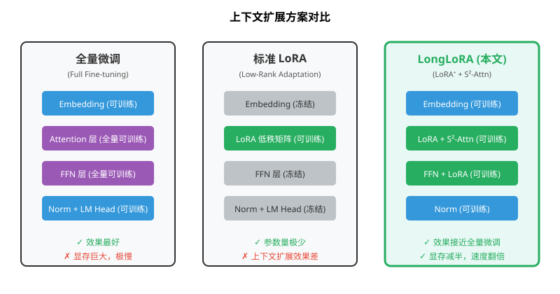
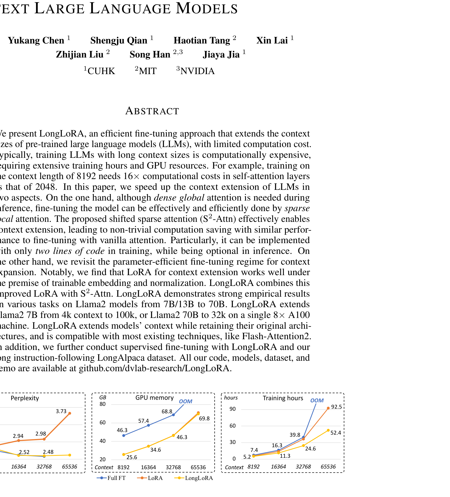
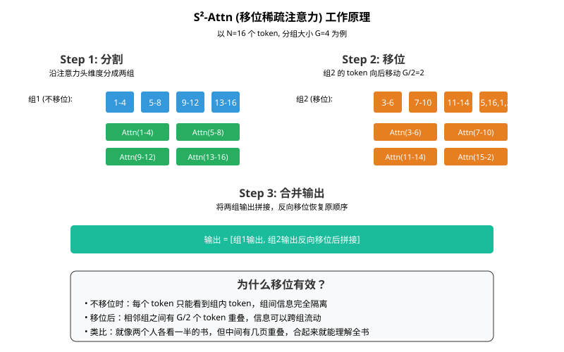
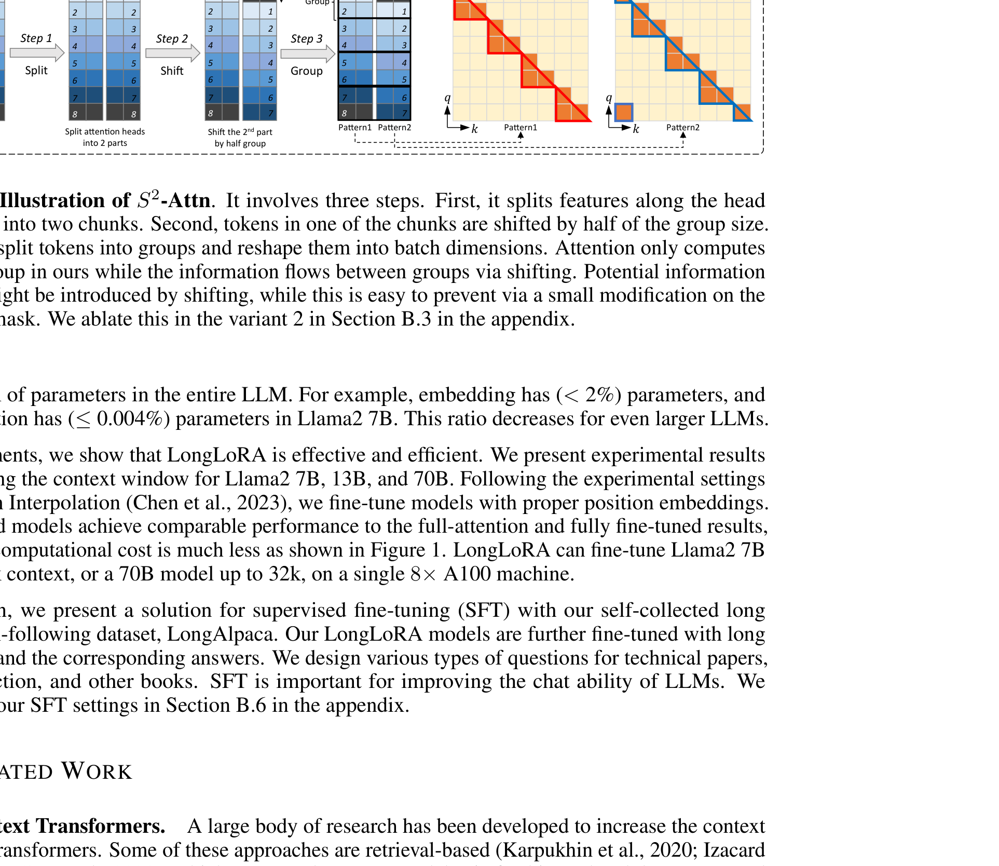
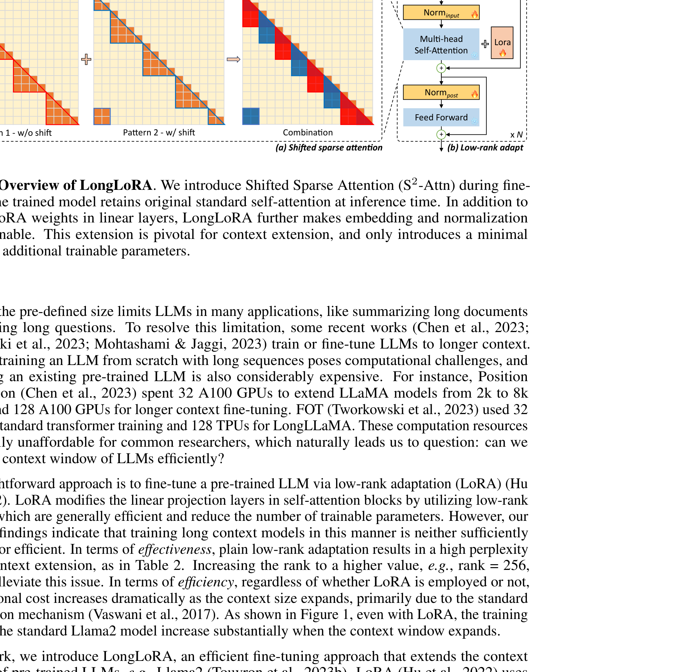
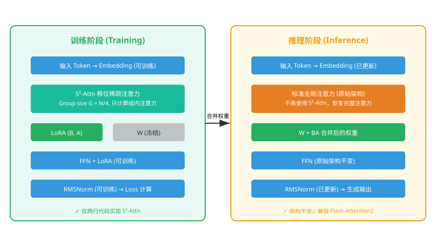
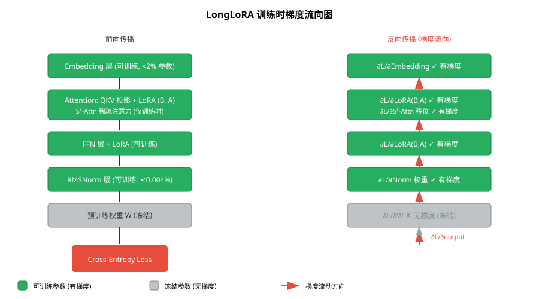
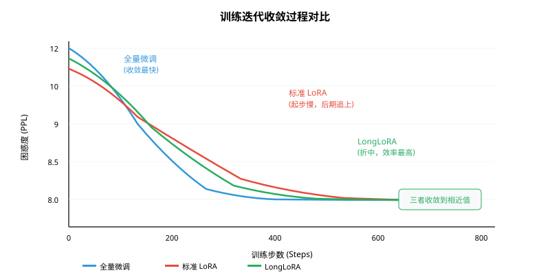
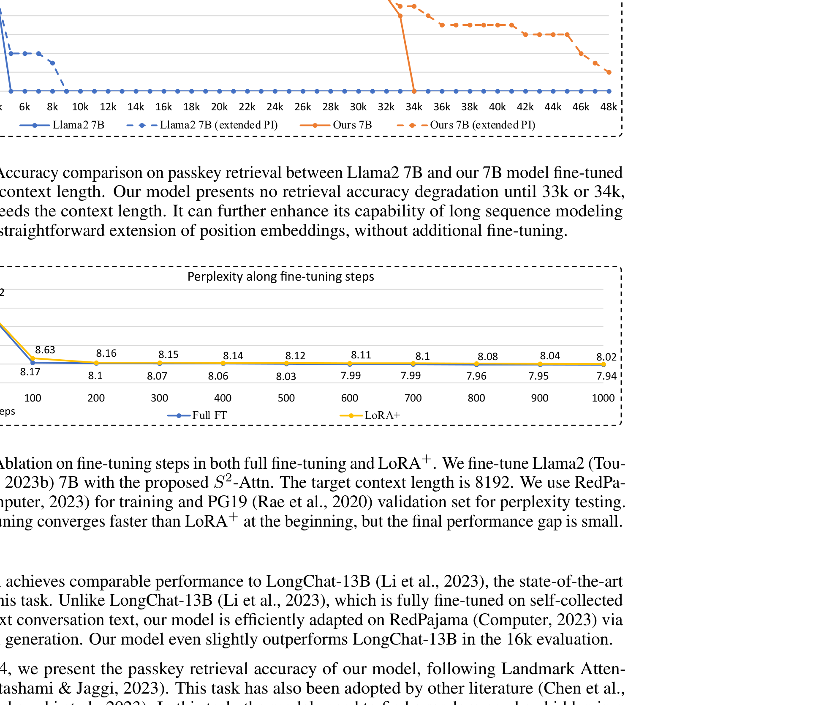
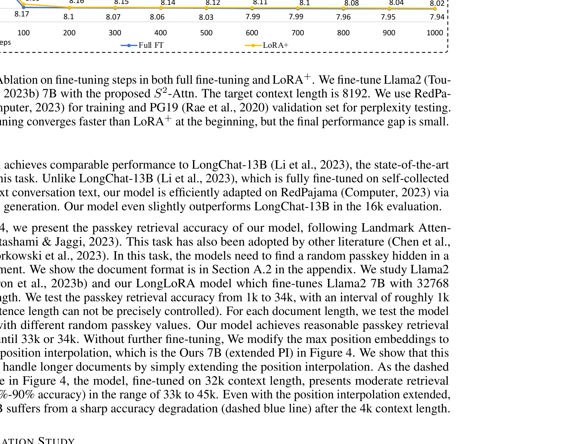

# LongLoRA：高效长上下文大语言模型微调方法

> **原文**: LongLoRA: Efficient Fine-tuning of Long-Context Large Language Models
> **作者**: Yukang Chen, Shengju Qian, Haotian Tang, Xin Lai, Zhijian Liu, Song Han, Jiaya Jia
> **发表时间**: 2024年3月（arXiv 2023年9月首次提交）
> **arXiv**: https://arxiv.org/abs/2309.12307

---

## 一句话总结

这篇论文提出了一种叫 **LongLoRA** 的方法，让你用普通实验室的显卡（8张A100）就能把大语言模型的"阅读能力"从几千字扩展到十万字，而且训练速度快一倍、显存省一半，效果还和全量微调差不多。

## 研究背景：为什么要做这个？

### 大模型的"阅读障碍"

想象一下，你让一个只读过短篇故事的人突然去读一本长篇小说——他可能会记住开头，但读到后面就忘了前面在说什么。大语言模型（LLM）也有同样的问题。

主流的预训练模型都有固定的"上下文窗口"（context window），也就是一次能"看到"的最大文本长度：
- LLaMA：2048 个 token（约1500个英文单词）
- LLaMA2：4096 个 token

但实际应用中，我们经常需要模型处理长文档：整本书、长论文、法律合同、代码库……这些动辄几万甚至几十万个 token。

### 扩展上下文的代价有多大？

要把模型的上下文从 4096 扩展到 8192，看似只是翻倍，但**自注意力层（Self-Attention）的计算量会变成 4 倍**！因为注意力机制的计算复杂度是 $O(n^2)$，其中 $n$ 是序列长度。

之前的方案（如 Position Interpolation）为了把上下文从 2k 扩展到 8k，需要 32 张 A100 显卡；扩展到更长则需要 128 张 A100。这对普通研究者来说根本负担不起。

### 现有方案的问题



| 方案 | 优点 | 缺点 |
|------|------|------|
| **全量微调** | 效果最好 | 显存巨大（8192上下文要46GB），训练极慢 |
| **标准 LoRA** | 参数少、显存低 | 上下文扩展效果差，即使增大秩到256也不行 |
| **位置插值(PI)** | 不需要重新训练 | 需要全量微调配合，同样昂贵 |

**核心矛盾**：全量微调效果好但太贵，LoRA便宜但效果差——有没有两全其美的方案？

## 核心思路：这篇论文的"大招"是什么？

LongLoRA 的核心洞察非常巧妙：**训练和推理可以"不对称"**。

- **推理时**：模型确实需要看完整的长上下文，所以需要全局注意力
- **训练时**：模型不需要每次都看完整全文，用**局部注意力**来近似就足够了

这就像你学习一篇长文章——不需要每次都从头到尾精读，可以分段阅读、交叉对照，最后一样能学会。

LongLoRA 从两个方向同时发力：

1. **Shifted Sparse Attention (S²-Attn)**：训练时用移位稀疏注意力代替全局注意力，计算量大幅下降
2. **改进版 LoRA (LoRA⁺)**：发现标准 LoRA 效果差的真正原因不是容量不够，而是**嵌入层和归一化层被冻结了**，把它们放开训练就能接近全量微调的效果



## 具体怎么做的？

### 技术一：Shifted Sparse Attention (S²-Attn)

#### 核心思想

把长序列分成若干组，每组内部计算注意力，然后**把其中一半注意力头的 token 向后移动半个组的位置**，这样相邻组之间就有重叠，信息可以跨组流动。



#### 具体步骤

假设序列长度 $N = 16$，分组大小 $G = 4$（即分成 4 组）：

**Pattern 1（不移位）**：
- 第 1 组：token 1-4 互相计算注意力
- 第 2 组：token 5-8 互相计算注意力
- 第 3 组：token 9-12 互相计算注意力
- 第 4 组：token 13-16 互相计算注意力

**Pattern 2（移位 G/2 = 2）**：
- 第 1 组：token 3-6 互相计算注意力
- 第 2 组：token 7-10 互相计算注意力
- 第 3 组：token 11-14 互相计算注意力
- 第 4 组：token 15-16, 1-2（循环移位）互相计算注意力

一半注意力头用 Pattern 1，另一半用 Pattern 2。

#### 为什么只有两行代码？

论文中最令人惊叹的是，S²-Attn 的实现只需要在标准注意力代码中加两行：

```python
# 第1行：把 qkv 沿头维度分成两组，第二组移位 G/2
qkv = cat((qkv.chunk(2,3)[0], qkv.chunk(2,3)[1].roll(-G/2, 1)), 3).view(B*N/G, G, 3, H, D)

# 标准自注意力（不需要改）
out = self_attn(qkv)

# 第2行：把输出沿头维度分成两组，第二组反向移位 G/2 恢复原顺序
out = cat((out.chunk(2,2)[0], out.chunk(2,2)[1].roll(G/2, 1)), 2)
```

这两行代码做了什么：
1. `chunk(2, 3)`：沿头维度（第3维）分成两组
2. `roll(-G/2, 1)`：第二组沿序列维度（第1维）循环移位
3. `view(B*N/G, G, ...)`：重新排列，让每组独立计算注意力

训练结束后，**推理时完全不需要这两行**，恢复标准全局注意力即可。模型已经学会了处理长上下文。

#### 实验验证

| 方法 | 8192 | 16384 | 32768 |
|------|------|-------|-------|
| 全局注意力（基准） | 8.02 | 8.05 | 8.04 |
| 短注意力（不移位） | 8.29 | 8.83 | 9.47 |
| **S²-Attn（移位）** | **8.04** | **8.03** | **8.08** |

关键发现：**不移位的短注意力效果很差**，而且序列越长越差。移位操作让跨组信息流动，是性能接近全局注意力的关键。



### 技术二：改进版 LoRA (LoRA⁺)

#### 标准 LoRA 为什么不行？

LoRA（Low-Rank Adaptation）的核心思想是：不直接修改预训练权重 $W$，而是在旁边加一个低秩矩阵 $BA$ 来近似更新：

$$W_{\text{new}} = W + \Delta W = W + BA$$

其中 $B \in \mathbb{R}^{d \times r}$，$A \in \mathbb{R}^{r \times d}$，$r \ll d$。训练时只更新 $A$ 和 $B$，$W$ 冻结。

但论文发现，对于上下文扩展任务，标准 LoRA 有**巨大的性能差距**：

| 方法 | 32k 上下文困惑度 |
|------|-----------------|
| 全量微调 | 8.08 |
| LoRA (秩=8) | 11.44 |
| LoRA (秩=256) | 11.98 |
| **+ 仅归一化层可训练** | 10.49 |
| **+ 仅嵌入层可训练** | 8.29 |
| **+ 归一化 + 嵌入层可训练** | **8.12** |

**关键发现**：把 LoRA 的秩从 8 增大到 256（参数量增加 32 倍），效果反而更差！说明问题不是容量不够，而是**哪些层参与训练**才是关键。

#### 为什么嵌入层和归一化层这么重要？

- **嵌入层（Embedding）**：负责把 token 映射成向量。上下文变长后，模型需要新的位置编码信息，嵌入层必须适应
- **归一化层（RMSNorm）**：控制每层的激活值分布。长序列会导致激活值分布变化，归一化层需要重新校准

这两个层的参数占比极小：
- 嵌入层：< 2% 总参数（Llama2 7B）
- 归一化层：≤ 0.004% 总参数

加起来不到 2%，但效果提升巨大！

### LongLoRA 整体架构



**训练时**：
- 使用 S²-Attn（分组大小 G = N/4）
- LoRA 矩阵可训练
- 嵌入层可训练
- 归一化层可训练
- 其余参数冻结

**推理时**：
- 恢复标准全局注意力
- LoRA 权重可以合并到原权重中：$W_{\text{new}} = W + BA$
- 架构完全不变，兼容 Flash-Attention2



### 用一个具体例子走通全流程

#### 场景设定

假设我们有一个极简的注意力头，维度 $d = 4$，LoRA 秩 $r = 2$，序列长度 $N = 8$，分组大小 $G = 4$。

**预训练权重**（冻结）：
$$W = \begin{bmatrix} 0.5 & 0.1 & 0.2 & 0.3 \\ 0.1 & 0.6 & 0.1 & 0.2 \\ 0.2 & 0.1 & 0.5 & 0.1 \\ 0.3 & 0.2 & 0.1 & 0.4 \end{bmatrix}$$

**LoRA 矩阵**（可训练，初始化为 $B=0, A$ 随机）：
$$B = \begin{bmatrix} 0 & 0 \\ 0 & 0 \\ 0 & 0 \\ 0 & 0 \end{bmatrix}, \quad A = \begin{bmatrix} 0.1 & -0.2 & 0.05 & 0.1 \\ -0.1 & 0.15 & -0.05 & 0.2 \end{bmatrix}$$

**嵌入层**（可训练，简化为一个 token 的嵌入）：
$$E = \begin{bmatrix} 1.0 & 0.5 & -0.3 & 0.2 \end{bmatrix}$$

**归一化层**（可训练，简化为缩放参数）：
$$\gamma = \begin{bmatrix} 1.0 & 1.0 & 1.0 & 1.0 \end{bmatrix}$$

#### Step 1: 前向传播

**输入**：一个 token 的嵌入 $x = \begin{bmatrix} 1.0 & 0.5 & -0.3 & 0.2 \end{bmatrix}^T$

**标准路径**（冻结权重）：
$$Wx = \begin{bmatrix} 0.5 & 0.1 & 0.2 & 0.3 \\ 0.1 & 0.6 & 0.1 & 0.2 \\ 0.2 & 0.1 & 0.5 & 0.1 \\ 0.3 & 0.2 & 0.1 & 0.4 \end{bmatrix} \begin{bmatrix} 1.0 \\ 0.5 \\ -0.3 \\ 0.2 \end{bmatrix} = \begin{bmatrix} 0.56 \\ 0.33 \\ 0.22 \\ 0.43 \end{bmatrix}$$

**LoRA 路径**（可训练）：
$$BAx = \begin{bmatrix} 0 & 0 \\ 0 & 0 \\ 0 & 0 \\ 0 & 0 \end{bmatrix} \begin{bmatrix} 0.1 & -0.2 & 0.05 & 0.1 \\ -0.1 & 0.15 & -0.05 & 0.2 \end{bmatrix} \begin{bmatrix} 1.0 \\ 0.5 \\ -0.3 \\ 0.2 \end{bmatrix} = \begin{bmatrix} 0 \\ 0 \\ 0 \\ 0 \end{bmatrix}$$

因为 $B$ 初始化为零，所以第一轮 LoRA 贡献为零（这就是"冷启动"现象）。

**输出**（归一化前）：
$$h = Wx + BAx = \begin{bmatrix} 0.56 \\ 0.33 \\ 0.22 \\ 0.43 \end{bmatrix} + \begin{bmatrix} 0 \\ 0 \\ 0 \\ 0 \end{bmatrix} = \begin{bmatrix} 0.56 \\ 0.33 \\ 0.22 \\ 0.43 \end{bmatrix}$$

**归一化后**：
$$h_{\text{norm}} = \gamma \odot \text{RMSNorm}(h) = \begin{bmatrix} 1.0 \\ 1.0 \\ 1.0 \\ 1.0 \end{bmatrix} \odot \begin{bmatrix} 0.89 \\ 0.52 \\ 0.35 \\ 0.68 \end{bmatrix} = \begin{bmatrix} 0.89 \\ 0.52 \\ 0.35 \\ 0.68 \end{bmatrix}$$

#### Step 2: 损失计算

假设目标输出为 $y = \begin{bmatrix} 1.0 & 0.6 & 0.4 & 0.8 \end{bmatrix}^T$，使用均方误差：

$$\mathcal{L} = \frac{1}{4} \sum_{i=1}^{4} (h_{\text{norm}, i} - y_i)^2 = \frac{1}{4}[(0.89-1.0)^2 + (0.52-0.6)^2 + (0.35-0.4)^2 + (0.68-0.8)^2]$$

$$\mathcal{L} = \frac{1}{4}[0.0121 + 0.0064 + 0.0025 + 0.0144] = 0.00885$$

**通俗翻译**：损失函数衡量的是模型输出和目标之间的差距。我们的目标是让这个值越小越好。

#### Step 3: 反向传播



**关键梯度计算**：

对 $B$ 的梯度（链式法则）：
$$\frac{\partial \mathcal{L}}{\partial B} = \frac{\partial \mathcal{L}}{\partial h} \cdot \frac{\partial h}{\partial (BAx)} \cdot \frac{\partial (BAx)}{\partial B} = \delta \cdot (Ax)^T$$

其中 $\delta = \frac{\partial \mathcal{L}}{\partial h_{\text{norm}}} \cdot \frac{\partial h_{\text{norm}}}{\partial h}$ 是从损失传回的梯度。

先算 $Ax$：
$$Ax = \begin{bmatrix} 0.1 & -0.2 & 0.05 & 0.1 \\ -0.1 & 0.15 & -0.05 & 0.2 \end{bmatrix} \begin{bmatrix} 1.0 \\ 0.5 \\ -0.3 \\ 0.2 \end{bmatrix} = \begin{bmatrix} 0.015 \\ 0.005 \end{bmatrix}$$

假设 $\delta = \begin{bmatrix} -0.11 & -0.08 & -0.05 & -0.12 \end{bmatrix}^T$（负号说明输出偏小，需要增大），则：

$$\frac{\partial \mathcal{L}}{\partial B} = \delta \cdot (Ax)^T = \begin{bmatrix} -0.11 \\ -0.08 \\ -0.05 \\ -0.12 \end{bmatrix} \begin{bmatrix} 0.015 & 0.005 \end{bmatrix} = \begin{bmatrix} -0.00165 & -0.00055 \\ -0.00120 & -0.00040 \\ -0.00075 & -0.00025 \\ -0.00180 & -0.00060 \end{bmatrix}$$

对 $A$ 的梯度：
$$\frac{\partial \mathcal{L}}{\partial A} = B^T \cdot \delta \cdot x^T = \begin{bmatrix} 0 & 0 & 0 & 0 \\ 0 & 0 & 0 & 0 \end{bmatrix} \cdot \delta \cdot x^T = \begin{bmatrix} 0 & 0 & 0 & 0 \\ 0 & 0 & 0 & 0 \end{bmatrix}$$

**冷启动现象**：因为 $B$ 初始为零，所以 $A$ 第一轮梯度为零！只有 $B$ 先更新，下一轮 $A$ 才有梯度。这是 LoRA 的典型特征。

对嵌入层 $E$ 的梯度（简化）：
$$\frac{\partial \mathcal{L}}{\partial E} \approx \delta = \begin{bmatrix} -0.11 & -0.08 & -0.05 & -0.12 \end{bmatrix}^T$$

对归一化层 $\gamma$ 的梯度：
$$\frac{\partial \mathcal{L}}{\partial \gamma} = \text{RMSNorm}(h) = \begin{bmatrix} 0.89 & 0.52 & 0.35 & 0.68 \end{bmatrix}^T$$

#### Step 3.5: 参数更新与下一轮迭代

**参数更新**（SGD，学习率 $\eta = 0.1$）：

$$\theta_{\text{new}} = \theta - \eta \cdot \frac{\partial \mathcal{L}}{\partial \theta}$$

**更新 $B$**：
$$B_{\text{new}} = \begin{bmatrix} 0 & 0 \\ 0 & 0 \\ 0 & 0 \\ 0 & 0 \end{bmatrix} - 0.1 \cdot \begin{bmatrix} -0.00165 & -0.00055 \\ -0.00120 & -0.00040 \\ -0.00075 & -0.00025 \\ -0.00180 & -0.00060 \end{bmatrix} = \begin{bmatrix} 0.000165 & 0.000055 \\ 0.000120 & 0.000040 \\ 0.000075 & 0.000025 \\ 0.000180 & 0.000060 \end{bmatrix}$$

**更新 $A$**（不变，因为梯度为零）：
$$A_{\text{new}} = A = \begin{bmatrix} 0.1 & -0.2 & 0.05 & 0.1 \\ -0.1 & 0.15 & -0.05 & 0.2 \end{bmatrix}$$

**更新 $E$**：
$$E_{\text{new}} = \begin{bmatrix} 1.0 & 0.5 & -0.3 & 0.2 \end{bmatrix} - 0.1 \cdot \begin{bmatrix} -0.11 & -0.08 & -0.05 & -0.12 \end{bmatrix} = \begin{bmatrix} 1.011 & 0.508 & -0.295 & 0.212 \end{bmatrix}$$

**更新 $\gamma$**：
$$\gamma_{\text{new}} = \begin{bmatrix} 1.0 & 1.0 & 1.0 & 1.0 \end{bmatrix} - 0.1 \cdot \begin{bmatrix} 0.89 & 0.52 & 0.35 & 0.68 \end{bmatrix} = \begin{bmatrix} 0.911 & 0.948 & 0.965 & 0.932 \end{bmatrix}$$

**第二轮前向传播**（用更新后的参数）：

现在 $B$ 不再是零矩阵了，LoRA 路径开始有贡献：

$$BAx = \begin{bmatrix} 0.000165 & 0.000055 \\ 0.000120 & 0.000040 \\ 0.000075 & 0.000025 \\ 0.000180 & 0.000060 \end{bmatrix} \begin{bmatrix} 0.015 \\ 0.005 \end{bmatrix} = \begin{bmatrix} 0.00000275 \\ 0.00000200 \\ 0.00000125 \\ 0.00000300 \end{bmatrix}$$

虽然贡献很小，但方向正确——$B$ 和 $A$ 开始协同工作。随着训练进行，$B$ 和 $A$ 都会逐渐增大，LoRA 的贡献会越来越显著。

**验证训练在起作用**：

| 分量 | 第 1 轮输出 | 第 2 轮输出 | 目标值 | 趋势 |
|------|-----------|-----------|-------|------|
| $h_1$ | 0.89 | 0.891 | 1.0 | ✓ 朝目标靠近 |
| $h_2$ | 0.52 | 0.521 | 0.6 | ✓ 朝目标靠近 |
| $h_3$ | 0.35 | 0.350 | 0.4 | ✓ 朝目标靠近 |
| $h_4$ | 0.68 | 0.681 | 0.8 | ✓ 朝目标靠近 |

新损失（估算）：$\mathcal{L}_{\text{new}} \approx 0.00870 < 0.00885$，损失下降了！

> **小白tips**: LoRA 的"冷启动"就像两个人合作搬东西——A 负责出主意（矩阵 A），B 负责出力（矩阵 B）。一开始 B 还没准备好（初始为零），A 的主意没法执行。等 B 准备好后，两人才能真正配合。这就是为什么第一轮只有 B 更新，从第二轮开始 A 才有梯度。

**多轮训练全景图**：



#### Step 4: 部署/推理

训练完成后，推理阶段有特殊处理：

1. **LoRA 权重合并**：$W_{\text{new}} = W + BA$，直接合并到原权重中，推理时不需要额外的计算
2. **S²-Attn 移除**：恢复标准全局注意力，因为推理时需要看完整上下文
3. **架构不变**：模型结构和预训练时完全一样，所以兼容所有现有工具（Flash-Attention2、vLLM 等）

这就是 LongLoRA 最巧妙的地方：**训练时走捷径，推理时恢复原样**。

## 效果怎么样？

### 各方法对比总览



**最大上下文扩展能力**（单台 8×A100 机器）：

| 模型大小 | 最大训练上下文 | PPL@32768 | PPL@65536 | PPL@100000 |
|---------|--------------|-----------|-----------|------------|
| Llama2 7B | **100,000** | 2.58 | 2.57 | **2.52** |
| Llama2 13B | **65,536** | 2.39 | **2.38** | - |
| Llama2 70B | **32,768** | **2.17** | - | - |

**训练效率对比**（Llama2 7B，8×A100）：

| 上下文 | 方法 | 训练时间 | 显存 (GB) |
|--------|------|---------|-----------|
| 8192 | 全量微调 | 7.4 小时 | 46.3 |
| 8192 | 标准 LoRA | 6.0 小时 | 25.7 |
| 8192 | **LongLoRA** | **5.2 小时** | **25.6** |
| 32768 | 全量微调 | 39.8 小时 | 68.8 |
| 32768 | 标准 LoRA | 36.5 小时 | 46.5 |
| 32768 | **LongLoRA** | **24.6 小时** | **46.4** |
| 65536 | 标准 LoRA | 92.5 小时 | 71.1 |
| 65536 | **LongLoRA** | **52.4 小时** | **69.8** |

在 65536 上下文下，LongLoRA 比标准 LoRA **快 1.77 倍**，同时注意力的 FLOPs 从 2251.8T 降到 562.9T（减少 75%）。

### 关键消融实验

**S²-Attn 的移位有多重要？**

| 注意力模式 | 困惑度 |
|-----------|--------|
| **S²-Attn（本文）** | **8.12** |
| 膨胀注意力 (Dilate) | 9.70 |
| 块稀疏注意力 | 8.39 |
| 跨步稀疏注意力 | 9.81 |
| 仅 Pattern 1（不移位） | 11.78 |
| 仅 Pattern 2（全移位） | 8.30 |

不移位的效果最差（11.78），说明**移位操作是跨组信息流动的关键**。全移位（8.30）比 S²-Attn（8.12）稍差，说明两种模式配合效果最好。



**分组大小的影响**：

| 分组大小 G | 困惑度 |
|-----------|--------|
| G = N/2 | 8.15 |
| **G = N/4** | **8.12** |
| G = N/6 | 8.24 |
| G = N/8 | 8.41 |

G = N/4 是最佳选择，太小会损失太多全局信息。

## 论文的意义和局限

**主要贡献**：

1. **S²-Attn**：仅需两行代码就能在训练时替代全局注意力，推理时完全恢复原架构，是极其优雅的设计
2. **LoRA⁺ 的关键发现**：嵌入层和归一化层可训练是上下文扩展成功的前提，这个发现对后续所有 LoRA 变体都有指导意义
3. **极致的可扩展性**：在单台 8×A100 上实现了 7B→100k、70B→32k 的上下文扩展，大幅降低了长上下文微调的门槛
4. **LongAlpaca 数据集**：发布了 9k 长指令微调数据 + 3k 短指令数据，推动了长上下文指令微调的发展

**局限性**：

1. S²-Attn 只在训练时有效，推理时仍需全局注意力（$O(n^2)$ 复杂度），超长推理仍然慢
2. 方法主要基于 RoPE 位置编码，对其他位置编码（如 ALiBi）的兼容性需要验证
3. 没有与同期其他长上下文方法（如 YaRN、NTK-aware scaling）做直接对比

## 读后感

LongLoRA 是一篇**工程价值极高**的论文。它没有提出什么复杂的数学理论，而是通过两个简单但关键的洞察——"训练时可以用稀疏注意力近似"和"嵌入层+归一化层必须可训练"——就把长上下文微调的门槛从 128 张 A100 降到了 8 张。

这篇论文最大的启示是：**好的方法不一定是复杂的**。两行代码实现 S²-Attn，不到 2% 的额外参数（嵌入层+归一化层），就能达到接近全量微调的效果。这种"四两拨千斤"的思路，正是高效微调领域的精髓。

对于初学者来说，读完这篇论文最应该记住的是：**参数高效微调（PEFT）不仅仅是加个 LoRA 就完了，哪些层参与训练、训练时用什么注意力模式，这些细节往往决定了成败**。
