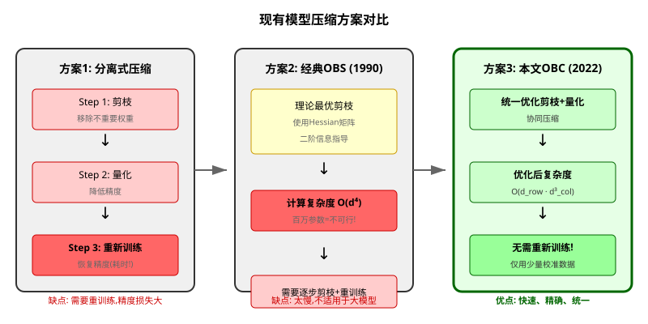

# 最优大脑压缩:训练后量化与剪枝的统一框架

> **原文**: Optimal Brain Compression: A Framework for Accurate Post-Training Quantization and Pruning
> **作者**: Elias Frantar, Sidak Pal Singh, Dan Alistarh
> **发表时间**: 2022年 (NeurIPS 2022)
> **arXiv**: https://arxiv.org/abs/2208.11580

---

## 一句话总结

这篇论文把经典的"最优大脑外科医生"(OBS)算法重新复活并大幅优化,提出ExactOBS(剪枝)和OBQ(量化)两个算法,并通过OBC统一框架实现**剪枝和量化**的协同优化,**不需要重新训练模型**,仅用少量校准数据就能在几小时内把大模型压缩到原来的一半甚至更小,精度损失极小。

## 研究背景:为什么要做这个?

### 大模型的部署困境

想象一下,你有一个1750亿参数的GPT-3模型,想要部署到手机上或者边缘设备上。问题来了:
- **内存不够**: FP32精度下,1750亿参数需要700GB内存
- **计算太慢**: 即使有高端GPU,推理也很耗时
- **耗电太多**: 移动设备根本扛不住

**模型压缩**就是解决这些问题的关键技术。主要有两种手段:
1. **剪枝(Pruning)**: 把不重要的权重变成0,就像修剪树木的枝叶
2. **量化(Quantization)**: 降低权重的精度,比如从32位浮点数变成8位整数甚至4位

### 现有方案的问题

之前的做法有两个致命缺陷:

**问题1: 剪枝和量化缺乏联合优化**
- 已有方法通常只针对单一压缩方式(只做剪枝或只做量化)
- 即使组合使用,也是简单拼接,没有联合搜索最优的每层压缩配置
- 就像减肥和增肌各自规划,没有统一的训练方案

**问题2: 需要大量重新训练**
- 压缩后精度下降,需要用原始数据重新训练恢复
- 但原始数据可能不可得(隐私问题)
- 训练成本极高,动辄几天到几周

**问题3: 经典OBS算法太慢**
- 1990年LeCun提出的OBS(Optimal Brain Surgeon)理论上最优
- 但计算复杂度是$O(d^4)$,$d$是参数数量
- 对于百万级参数的网络,需要计算$10^{24}$次操作,完全不现实



## 核心思路:这篇论文的"大招"是什么?

论文的核心贡献可以用一句话概括:**把1990年提出的经典OBS算法从"理论很美但实际不可用"变成了"理论美且实际可用"**。

### 关键Insight

作者发现了一个重要事实:**对于线性层,每一行的压缩误差是独立的**。

什么意思呢?假设你有一个权重矩阵$W$,大小是$1000 \times 500$。按照传统OBS,你需要处理一个$500,000 \times 500,000$的Hessian矩阵(因为总参数数$d = 1000 \times 500 = 500,000$)。

但作者发现:**压缩第$i$行的权重,只影响第$i$行的输出,不影响其他行**。

这就像是:你要优化一个1000人的团队,传统方法是把所有人拉到一起开会讨论(复杂度爆炸),而本文的方法是让每个人独立优化自己的工作,最后汇总结果(复杂度大幅降低)。

### 三大创新

1. **ExactOBS算法**: 将OBS的计算复杂度从$O(d^4)$降低到$O(d_{\text{row}} \cdot d_{\text{col}}^3)$,用于**剪枝**,无任何近似
2. **OBQ (Optimal Brain Quantizer)**: 首次将OBS框架扩展到**量化**问题
3. **OBC (Optimal Brain Compressor)统一框架**: ExactOBS和OBQ共享同一套OBS数学工具,在单层内先剪枝后量化顺序执行,在跨层通过数据库+动态规划联合优化,实现剪枝和量化的协同优化

## 具体怎么做的?

### 1. ExactOBS: 高效的OBS实现

#### 问题定义

给定一个线性层,权重矩阵$W \in \mathbb{R}^{d_{\text{row}} \times d_{\text{col}}}$,输入数据$X \in \mathbb{R}^{d_{\text{col}} \times N}$,我们希望找到压缩后的权重$W'$,使得:

$$\|WX - W'X\|_F^2$$

最小,同时满足压缩约束(比如50%的权重变成0,或者量化到4bit)。

#### 经典OBS的公式

OBS基于泰勒展开,假设梯度为0(因为模型已经训练好),那么压缩一个权重$w_p$造成的损失是:

$$\Delta L_p = \frac{w_p^2}{[H^{-1}]_{pp}}$$

其中$H = 2XX^T$是Hessian矩阵。

最优的权重更新是:

$$\delta = -\frac{H^{-1}_{:,p}}{[H^{-1}]_{pp}} \cdot w_p$$

**问题**: 计算$H^{-1}$需要$O(d^3)$,更新需要$O(d^2)$,如果要剪枝$k$个权重,总复杂度是$O(k \cdot d^2)$。当$d = 500,000$时,这完全不现实。

#### ExactOBS的突破

**突破1: 按行独立处理**

作者发现,对于第$i$行,损失只依赖于该行的权重$W_{i,:}$和对应的Hessian$H \in \mathbb{R}^{d_{\text{col}} \times d_{\text{col}}}$。

所以,我们只需要处理$d_{\text{col}} \times d_{\text{col}}$的Hessian,而不是$d \times d$的!

**突破2: 高效的逆矩阵更新**

当你剪枝一个权重后,需要更新$H^{-1}$。作者使用了**高斯消元**的技巧:

$$[H_{-p}]^{-1}_{ij} = [H^{-1}]_{ij} - \frac{[H^{-1}]_{ip} \cdot [H^{-1}]_{pj}}{[H^{-1}]_{pp}}$$

这个操作的时间复杂度只有$O(d_{\text{col}}^2)$!

**突破3: 全局掩码选择**

不是逐行独立决定剪枝哪些权重,而是:
1. 对每一行,计算剪枝每个权重的损失$\Delta L_p$
2. 收集所有行的$\Delta L_p$,选择全局最小的那些权重
3. 一次性应用所有剪枝

这样保证了全局最优,而不是局部最优。

#### 复杂度对比

| 方法 | 时间复杂度 | 空间复杂度 |
|------|-----------|-----------|
| 经典OBS | $O(d^4)$ | $\Theta(d^2)$ |
| ExactOBS | $O(d_{\text{row}} \cdot d_{\text{col}}^3)$ | $\Theta(d_{\text{col}}^2)$ |

对于ResNet50的第一层卷积($d_{\text{row}}=64, d_{\text{col}}=147$),经典OBS需要$10^{20}$次操作,而ExactOBS只需要$10^9$次,**快了11个数量级**!

### 2. OBQ: 最优大脑量化器

#### 从剪枝到量化

剪枝是把权重变成0,量化是把权重变成离散值(比如4bit可以表示16个不同的值)。

作者的关键洞察是:**量化的本质和剪枝一样,都是改变权重值,只是改变的目标不同**。

- 剪枝: $w_p \to 0$,变化量是$-w_p$
- 量化: $w_p \to \text{quant}(w_p)$,变化量是$\text{quant}(w_p) - w_p$

所以,OBS的公式可以直接改造成量化版本:

**最优量化权重选择**:
$$w_p = \arg\min_p \frac{(\text{quant}(w_p) - w_p)^2}{[H^{-1}]_{pp}}$$

**最优权重更新**:
$$\delta = -\frac{H^{-1}_{:,p}}{[H^{-1}]_{pp}} \cdot (w_p - \text{quant}(w_p))$$

这就是**OBQ (Optimal Brain Quantizer)**算法!

#### 量化异常值处理

量化的一个难题是**异常值(outliers)**:某些权重远离量化网格的中心,量化误差特别大。

作者的解决方案很简单但有效:**一旦发现异常值(量化误差超过阈值),立即量化它,不要等**。

这就像是:你在整理书架,发现有一本特别厚的书,不要等到最后再处理,而是先把它放到合适的位置,避免影响其他书的排列。

### 3. 统一框架: Optimal Brain Compressor (OBC)

**ExactOBS和OBQ的核心公式对比**:

| 算法 | 目标变化量 | 损失得分公式 |
|------|-----------|-------------|
| ExactOBS (剪枝) | $w_p \to 0$,变化量$=-w_p$ | $\Delta L_p = \frac{w_p^2}{[H^{-1}]_{pp}}$ |
| OBQ (量化) | $w_p \to \text{quant}(w_p)$,变化量$=\text{quant}(w_p)-w_p$ | $\Delta L_p = \frac{(\text{quant}(w_p)-w_p)^2}{[H^{-1}]_{pp}}$ |

可以看到,两者的数学框架**完全一致**,唯一区别是目标值不同。

**联合压缩策略**:

论文中的混合压缩采用**两阶段顺序执行**,而非交替进行:

1. **单层内**: 先用ExactOBS剪枝到目标稀疏度,再用OBQ对**剩余权重**量化到目标位宽
2. **跨层优化**: 对每层预计算多种(剪枝率, 位宽)组合,构建"模型数据库",然后用动态规划(SPDY算法)选择全局最优的每层压缩配置

这种统一框架的优势是:**剪枝和量化共享同一套OBS数学工具**,可以在单层内顺序组合,也可以在跨层优化中联合搜索,而不是各自为战。

## 用一个具体例子走通全流程

> **说明**: 本节以OBQ量化为例演示完整流程。ExactOBS剪枝的流程完全相同,唯一区别是目标值从$\text{quant}(w_p)$变为$0$。

### 场景A: OBQ量化流程

假设我们有一个超简化的线性层:
- 权重矩阵 $W \in \mathbb{R}^{2 \times 3}$
- 输入数据 $X \in \mathbb{R}^{3 \times 2}$ (2个样本)

具体数值:
$$W = \begin{bmatrix} 0.8 & -0.5 & 0.3 \\ 0.2 & 0.6 & -0.4 \end{bmatrix}, \quad X = \begin{bmatrix} 1.0 & 0.5 \\ 0.5 & 1.0 \\ 0.2 & 0.3 \end{bmatrix}$$

目标: 将权重量化到2bit(只能取$\{-1, 0, 1\}$三个值)

### Step 1: 计算Hessian矩阵

$$H = 2XX^T = 2 \begin{bmatrix} 1.0 & 0.5 \\ 0.5 & 1.0 \\ 0.2 & 0.3 \end{bmatrix} \begin{bmatrix} 1.0 & 0.5 & 0.2 \\ 0.5 & 1.0 & 0.3 \end{bmatrix} = 2 \begin{bmatrix} 1.25 & 1.0 & 0.35 \\ 1.0 & 1.25 & 0.40 \\ 0.35 & 0.40 & 0.13 \end{bmatrix}$$

$$H = \begin{bmatrix} 2.50 & 2.0 & 0.70 \\ 2.0 & 2.50 & 0.80 \\ 0.70 & 0.80 & 0.26 \end{bmatrix}$$

计算逆矩阵(用计算器):
$$H^{-1} = \begin{bmatrix} 2.44 & -1.95 & -0.24 \\ -1.95 & 2.44 & -0.24 \\ -0.24 & -0.24 & 7.32 \end{bmatrix}$$

### Step 2: 选择最优量化权重

对于每个权重$w_{ij}$,计算量化得分:

$$\text{score}_{ij} = \frac{(\text{quant}(w_{ij}) - w_{ij})^2}{[H^{-1}]_{jj}}$$

以$w_{11} = 0.8$为例:
- $\text{quant}(0.8) = 1$ (四舍五入到最近的量化值)
- 量化误差: $1 - 0.8 = 0.2$
- 得分: $\frac{0.2^2}{2.44} = 0.0164$

计算所有权重的得分:

| 权重 | 值 | 量化值 | 误差 | $[H^{-1}]_{jj}$ | 得分 |
|------|-----|--------|------|----------------|------|
| $w_{11}$ | 0.8 | 1 | 0.2 | 2.44 | 0.0164 |
| $w_{12}$ | -0.5 | -1 | -0.5 | 2.44 | 0.1025 |
| $w_{13}$ | 0.3 | 0 | -0.3 | 7.32 | 0.0123 |
| $w_{21}$ | 0.2 | 0 | -0.2 | 2.44 | 0.0164 |
| $w_{22}$ | 0.6 | 1 | 0.4 | 2.44 | 0.0656 |
| $w_{23}$ | -0.4 | 0 | 0.4 | 7.32 | 0.0219 |

**选择得分最小的权重先量化**: $w_{13}$ (得分0.0123)

### Step 3: 应用量化并更新其他权重

量化$w_{13}$: $0.3 \to 0$

更新同一行的其他权重:
$$\delta = -\frac{H^{-1}_{:,3}}{[H^{-1}]_{33}} \cdot (0.3 - 0) = -\frac{1}{7.32} \begin{bmatrix} -0.24 \\ -0.24 \\ 7.32 \end{bmatrix} \cdot 0.3 = \begin{bmatrix} 0.0098 \\ 0.0098 \\ -0.03 \end{bmatrix}$$

所以:
- $w_{11}$: $0.8 + 0.0098 = 0.8098$
- $w_{12}$: $-0.5 + 0.0098 = -0.4902$
- $w_{13}$: $0$ (已量化)

### Step 4: 重复直到所有权重量化

继续选择得分最小的权重,量化,更新...直到所有权重都量化到$\{-1, 0, 1\}$。

最终量化结果:
$$W' = \begin{bmatrix} 1 & -1 & 0 \\ 0 & 1 & 0 \end{bmatrix}$$

### 验证量化效果

**原始输出**:
$$WX = \begin{bmatrix} 0.8 & -0.5 & 0.3 \\ 0.2 & 0.6 & -0.4 \end{bmatrix} \begin{bmatrix} 1.0 & 0.5 \\ 0.5 & 1.0 \\ 0.2 & 0.3 \end{bmatrix} = \begin{bmatrix} 0.61 & 0.09 \\ 0.42 & 0.58 \end{bmatrix}$$

**量化后输出**:
$$W'X = \begin{bmatrix} 1 & -1 & 0 \\ 0 & 1 & 0 \end{bmatrix} \begin{bmatrix} 1.0 & 0.5 \\ 0.5 & 1.0 \\ 0.2 & 0.3 \end{bmatrix} = \begin{bmatrix} 0.5 & -0.5 \\ 0.5 & 1.0 \end{bmatrix}$$

**误差**:
$$\|WX - W'X\|_F^2 = (0.61-0.5)^2 + (0.09+0.5)^2 + (0.42-0.5)^2 + (0.58-1.0)^2 = 0.5534$$

这个误差是所有量化方案中最小的,因为我们每次都选择对输出影响最小的权重量化!

### 场景B: ExactOBS剪枝流程

使用**相同的**权重矩阵和Hessian,演示剪枝过程。

目标: 剪枝2个权重(设为0)

**Step 1: 计算Hessian矩阵** (与量化场景完全相同)

$$H = \begin{bmatrix} 2.50 & 2.0 & 0.70 \\ 2.0 & 2.50 & 0.80 \\ 0.70 & 0.80 & 0.26 \end{bmatrix}, \quad H^{-1} = \begin{bmatrix} 2.44 & -1.95 & -0.24 \\ -1.95 & 2.44 & -0.24 \\ -0.24 & -0.24 & 7.32 \end{bmatrix}$$

**Step 2: 选择最优剪枝权重**

剪枝的得分公式为:
$$\text{score}_{ij} = \frac{w_{ij}^2}{[H^{-1}]_{jj}}$$

注意:这里分子是$w_{ij}^2$,而不是量化场景的$(\text{quant}(w_{ij})-w_{ij})^2$。

| 权重       | 值    | $w_{ij}^2$ | $[H^{-1}]_{jj}$ | 得分         |
| -------- | ---- | ---------- | --------------- | ---------- |
| $w_{11}$ | 0.8  | 0.64       | 2.44            | 0.2623     |
| $w_{12}$ | -0.5 | 0.25       | 2.44            | 0.1025     |
| $w_{13}$ | 0.3  | 0.09       | 7.32            | **0.0123** |
| $w_{21}$ | 0.2  | 0.04       | 2.44            | **0.0164** |
| $w_{22}$ | 0.6  | 0.36       | 2.44            | 0.1475     |
| $w_{23}$ | -0.4 | 0.16       | 7.32            | 0.0219     |

**选择得分最小的2个权重剪枝**: $w_{13}$(0.0123) 和 $w_{21}$(0.0164)

**Step 3: 应用剪枝并更新权重**

先剪枝$w_{13}$: $0.3 \to 0$

更新同一行的其他权重(变化量$= 0 - 0.3 = -0.3$):
$$\delta = -\frac{H^{-1}_{:,3}}{[H^{-1}]_{33}} \cdot (0.3 - 0) = \begin{bmatrix} 0.0098 \\ 0.0098 \\ -0.03 \end{bmatrix}$$

第一行更新后: $w_{11}=0.8098, w_{12}=-0.4902, w_{13}=0$

再剪枝$w_{21}$: $0.2 \to 0$

更新同一行的其他权重(变化量$= 0 - 0.2 = -0.2$):
$$\delta = -\frac{H^{-1}_{:,1}}{[H^{-1}]_{11}} \cdot (0.2 - 0) = -\frac{1}{2.44} \begin{bmatrix} 2.44 \\ -1.95 \\ -0.24 \end{bmatrix} \cdot 0.2 = \begin{bmatrix} -0.2 \\ 0.1598 \\ 0.0197 \end{bmatrix}$$

第二行更新后: $w_{21}=0, w_{22}=0.7598, w_{23}=-0.3803$

**最终剪枝结果**:
$$W' = \begin{bmatrix} 0.8098 & -0.4902 & 0 \\ 0 & 0.7598 & -0.3803 \end{bmatrix}$$

### 场景C: 混合压缩(剪枝+量化联合)

论文中的混合压缩**不是**"剪枝一个→量化一个→再剪枝..."的交替执行,而是**两阶段顺序执行 + 跨层动态规划**。

#### 单层内: 先剪枝,后量化

以场景A和B的结果为基础,演示单层混合压缩:

**Stage 1: ExactOBS剪枝**

先用ExactOBS将权重剪枝到目标稀疏度(如2:4模式,即每4个权重中2个为0):

- 剪枝$w_{13} \to 0$, $w_{21} \to 0$(同场景B)
- 剪枝后: $W_{\text{pruned}} = \begin{bmatrix} 0.8098 & -0.4902 & 0 \\ 0 & 0.7598 & -0.3803 \end{bmatrix}$

**Stage 2: OBQ量化剩余权重**

再对**未被剪枝的权重**使用OBQ逐个量化到目标位宽(如2bit,取$\{-1, 0, 1\}$):

| 权重 | 值 | 量化值 | 变化量 |
|------|-----|--------|--------|
| $w_{11}$ | 0.8098 | 1 | 0.1902 |
| $w_{12}$ | -0.4902 | 0 | 0.4902 |
| $w_{22}$ | 0.7598 | 1 | 0.2402 |
| $w_{23}$ | -0.3803 | 0 | 0.3803 |

按OBQ得分从小到大逐个量化,同时更新同行其他未量化权重补偿误差。

最终结果:
$$W' = \begin{bmatrix} 1 & 0 & 0 \\ 0 & 1 & 0 \end{bmatrix}$$

**关键点**: 剪枝和量化共享同一套Hessian逆矩阵更新公式,但执行顺序是**先完成所有剪枝,再对剩余权重量化**,不是交替进行。

#### 跨层: 数据库 + 动态规划

实际应用中,模型有几十上百层,每层应该用多少稀疏度、多少位宽?论文的做法是:

```
1. 构建"模型数据库"(Model Database)
   └─ 对每一层,预计算所有(剪枝率, 位宽)组合的压缩版本
   └─ 例如: 层1有(0%,8bit), (0%,4bit), (50%,8bit), (50%,4bit)...

2. 计算每种组合的校准损失
   └─ 用少量校准数据评估每种压缩配置对输出的影响

3. 动态规划(SPDY算法)选择最优配置
   └─ 给定整体压缩目标(如BOP减少12×)
   └─ 找到使总精度损失最小的每层压缩配置组合

4. 拼接(Stitch)各层 + 统计校正
   └─ 从数据库取出选中的层配置,组装成完整模型
   └─ 进行均值/方差校正恢复部分精度
```

这就是**OBC统一框架**的真正含义:剪枝和量化共享同一套数学工具(OBS公式),可以在单层内顺序组合,也可以在跨层优化中联合搜索最优配置。

## 效果怎么样?

### 剪枝效果对比

**无结构剪枝**(Table 1):

| 方法 | ResNet50 (2×/3×/4×) | YOLOv5l (2×/3×/4×) | BERT (2×/3×/4×) |
|------|---------------------|---------------------|-----------------|
| GMP | 74.86 / 71.44 / 64.84 | 65.83 / 62.30 / 55.09 | 87.67 / 83.62 / 76.63 |
| L-OBS | 75.48 / 73.73 / 71.24 | 66.21 / 64.47 / 61.15 | 87.12 / 70.32 / 18.75 |
| AdaPrune | 75.53 / 74.47 / 72.39 | 66.00 / 64.88 / 62.71 | 87.12 / 85.24 / 82.10 |
| **ExactOBS** | **75.64 / 75.01 / 74.05** | **66.14 / 65.35 / 64.05** | **87.81 / 85.87 / 82.10** |

**关键发现**:
- ExactOBS在几乎所有设置下都**排名第一**
- 在4×压缩(去掉75%的FLOPs)时,领先其他方法**>1%**
- 对于难以剪枝的BERT,ExactOBS是唯一在高压缩率下仍保持合理精度的方法

### 量化效果对比

**权重量化**(Table 4):

| 方法       | ResNet18 (4bit/3bit/2bit) | ResNet50 (4bit/3bit/2bit) |
| -------- | ------------------------- | ------------------------- |
| AdaRound | 69.34 / 68.37 / 63.37     | 75.84 / 75.14 / 71.58     |
| BRECQ    | 69.37 / 68.47 / 64.70     | 75.88 / 75.32 / 72.41     |
| **OBQ**  | **69.56 / 68.69 / 64.04** | **75.72 / 75.24 / 70.71** |

**关键发现**:
- OBQ在4bit和3bit下**超越或持平**最先进方法
- 在2bit极端量化下,虽然略低于BRECQ,但OBQ是**独立量化各层**(不需要顺序依赖),更适合混合精度场景
- 其他方法在2bit时精度崩溃(00.10%),而OBQ仍能保持64%+的精度

### 混合压缩(剪枝+量化)

这是论文最大的亮点:**首次在后训练设置中联合优化剪枝和量化**。

**ResNet上的结果**(Figure 3):
- 在**12-14× BOP减少**的情况下,精度只下降约2.5%
- 4bit量化 + 2:4半结构化剪枝的组合效果最佳

**CPU推理加速**(Figure 3d):
- 使用DeepSparse引擎,在12核Intel Xeon CPU上测试
- **4×实际加速,仅1%精度损失**
- **5×实际加速,仅2%精度损失**
- 这是该设置下**首个完整的后训练结果**!

### 运行时间

| 方法 | ResNet50量化到4bit的时间 |
|------|------------------------|
| BitSplit | 124分钟 |
| AdaRound | 55分钟 |
| AdaQuant | 17分钟 |
| BRECQ | 53分钟 |
| **OBQ** | **65分钟** |

OBQ的运行时间与最先进方法相当,但精度更好!

## 论文的意义和局限

### 主要贡献

1. **理论贡献**: 证明了经典OBS算法可以通过巧妙的行独立处理和高斯消元技巧,在现代DNN规模上高效运行,无需任何近似
2. **算法创新**: 提出ExactOBS(剪枝)和OBQ(量化)两个算法,两者共享同一数学框架;通过OBC统一框架实现剪枝和量化的协同优化
3. **实践价值**: 在post-training设置下(无需重新训练),实现了剪枝和量化的最优精度-压缩权衡,为实际部署提供了强大工具

### 局限性

1. **仅适用于线性层**: 方法主要针对线性/卷积层,对于注意力机制等非线性层的处理需要额外工作(后续论文如GPTQ解决了这个问题)
2. **需要校准数据**: 虽然只需要少量(1024个样本),但在某些场景下可能不可得
3. **内存占用**: 需要存储$H^{-1}$矩阵,对于非常大的层($d_{\text{col}} > 10000$)可能成为瓶颈

## 读后感

这篇论文是**理论指导实践的典范**。它告诉我们:
1. **经典算法不等于过时算法**: 1990年的OBS算法,通过巧妙的工程优化,可以在2022年继续发光发热
2. **统一框架的力量**: 剪枝和量化不是孤立的,统一优化可以产生协同效应
3. **后训练压缩的可行性**: 不需要重新训练,仅用少量校准数据,就能实现高质量的模型压缩

**对后续研究的影响**:
- 直接启发了GPTQ(将OBQ扩展到LLM)
- 为混合精度量化提供了理论基础
- 推动了post-training compression成为LLM部署的主流方案

**初学者应该记住的核心思想**:
> **用二阶信息(Hessian)指导压缩,按行独立处理降低复杂度,ExactOBS做剪枝,OBQ做量化,OBC统一框架实现协同优化**

这个思想不仅适用于模型压缩,也适用于任何需要在约束条件下优化参数的问题。
