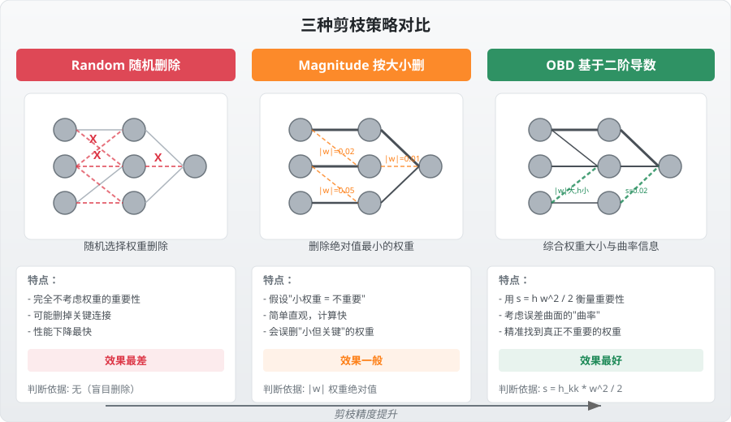
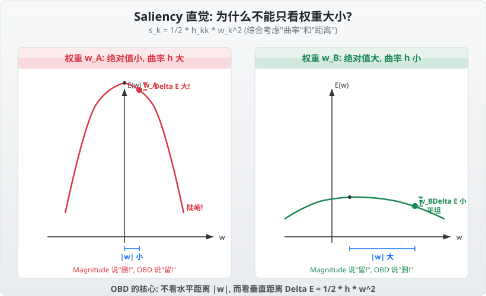
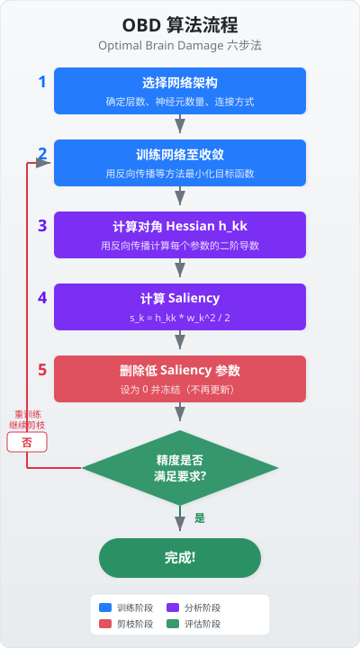
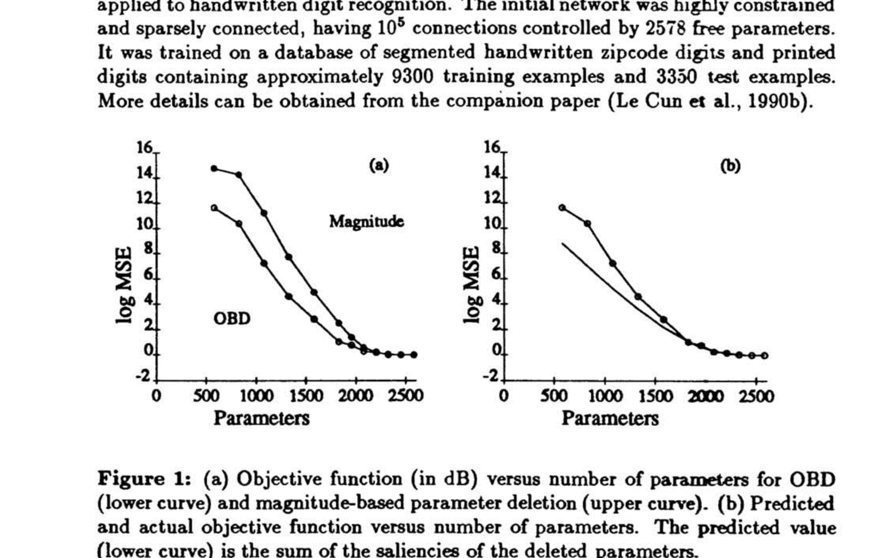
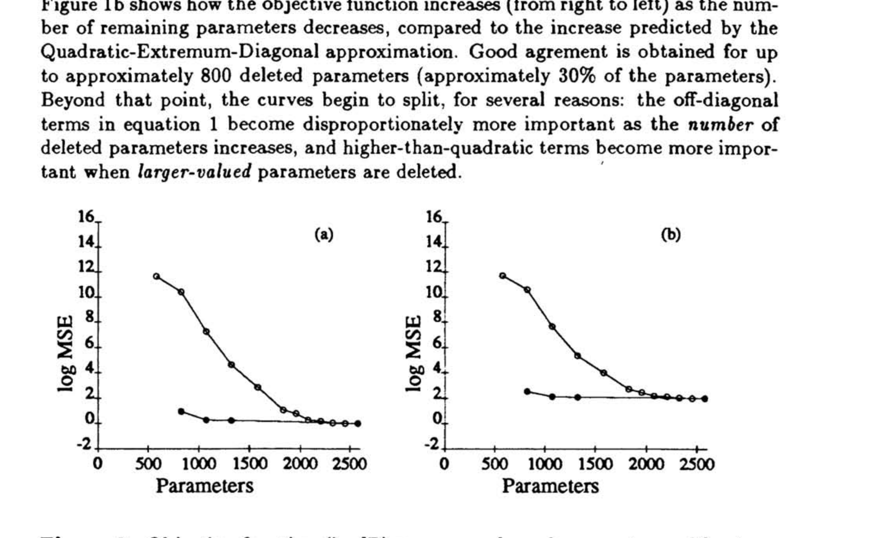

# 最优脑损伤

> **原文**: Optimal Brain Damage
> **作者**: Yann Le Cun, John S. Denker, Sara A. Solla
> **发表时间**: 1989年 (NIPS 1989)
> **出处**: Advances in Neural Information Processing Systems 2, pp. 598-605

---

## 一句话总结

别看权重小就觉得它不重要——OBD 用二阶导数（曲率）告诉你，真正该删的权重是那些"删了对误差几乎没影响"的权重，哪怕它绝对值很大。

## 研究背景：为什么要做这个？

1989 年，神经网络已经在手写数字识别等任务上取得了不错的成绩。但研究者们发现了一个尴尬的矛盾：

- **网络太大**：参数多 → 训练慢、推理慢、容易过拟合（就像一个学生把答案都背下来了，考试一换题就不会了）
- **网络太小**：参数少 → 表达能力不够，学不到复杂的模式

那有没有一种办法，**先训练一个大网络，再把里面"不干活"的参数裁掉**，得到一个又小又好的网络？这就是"网络剪枝"（Network Pruning）的思路。

打个比方：你开了一家 100 人的公司，发现有些员工天天摸鱼，裁掉他们公司反而运转更好——OBD 要做的，就是帮你精准找出"该裁的人"。

### 现有方案的问题

在 OBD 之前，人们尝试过几种"裁员"策略：

1. **按权重大小删（Magnitude-based）**：谁的权重绝对值 $|w|$ 最小就删谁。简单粗暴，但问题是——有些权重虽然小，却处于误差函数曲率很陡的位置，删掉它代价巨大。相当于裁了一个"工资低但负责核心业务"的员工。

2. **权重衰减（Weight Decay）**：训练时加 L2 正则化，让小权重自然趋近于零。但这会拖慢整个训练过程，而且没有明确告诉你"到底谁该删"。

3. **骨架化（Skeletonization）**：Mozer 和 Smolensky 在同年提出，按"对输出的影响"来衡量，但计算成本较高。

## 核心思路：这篇论文的"大招"是什么？

OBD 的核心创新可以用一句话概括：

> **用二阶导数（Hessian 对角元素）来衡量每个参数的"重要性"，而不是只看权重大小。**

具体来说，OBD 定义了一个叫 **Saliency（显著性）** 的指标：

$$s_k = \frac{1}{2} h_{kk} \cdot w_k^2$$

其中：
- $w_k$ 是第 $k$ 个权重的值
- $h_{kk} = \frac{\partial^2 E}{\partial w_k^2}$ 是目标函数 $E$ 对这个权重的**二阶偏导数**，也就是 Hessian（海森矩阵）的第 $k$ 个对角元素

这个公式的直觉非常漂亮：
- $w_k^2$ 衡量的是"这个权重距离零有多远"（即删到零要"走多远"）
- $h_{kk}$ 衡量的是"误差函数在这个方向上有多陡"（即曲率）
- 两者相乘再除以 2，就是"把这个权重设为零后，误差会增加多少"的近似估计

**打个比方**：想象你站在一个山谷底部（训练好的最优点），现在要沿着某个方向走一步。如果这个方向的坡度很陡（$h_{kk}$ 大），走一小步就会爬升很高（误差增大）；如果坡度很平（$h_{kk}$ 小），即使走很远也不会爬升多少。OBD 的智慧在于：它看的不是你要"走多远"（$|w|$），而是你会"爬升多高"（$\Delta E$）。

## 具体怎么做的？

### 泰勒展开：用数学预测"删权重"的后果

假设我们把网络所有参数排成一个向量 $\mathbf{U}$，目标函数为 $E$。如果我们把参数改变了 $\delta \mathbf{U}$，误差的变化可以用泰勒展开来近似：

$$\delta E = \sum_i g_i \delta u_i + \frac{1}{2} \sum_i h_{ii} \delta u_i^2 + \frac{1}{2} \sum_{i \neq j} h_{ij} \delta u_i \delta u_j + O(\|\delta \mathbf{U}\|^3)$$

其中：
- $g_i = \frac{\partial E}{\partial u_i}$ 是梯度（一阶导数）
- $h_{ij} = \frac{\partial^2 E}{\partial u_i \partial u_j}$ 是 Hessian 矩阵的元素（二阶导数）
- 第一项是线性项，第二项是对角二次项，第三项是交叉二次项，最后是高阶项

"删除权重 $w_k$"在数学上就是令 $\delta u_k = -u_k$（把它变成零），因此我们需要估算这个操作会导致多少 $\delta E$。

### 三大简化假设

直接算上面那个公式非常复杂（Hessian 矩阵有 $n^2$ 个元素！），论文做了三个关键假设来简化：

**假设一：对角近似（Diagonal Approximation）**
忽略交叉项 $h_{ij}$（$i \neq j$），即假设各参数之间互不影响。这把 $n \times n$ 的矩阵简化为 $n$ 个数，计算量从 $O(n^2)$ 降到 $O(n)$。

> 类比：假设每个员工的工作是独立的，裁掉 A 不会影响 B 的产出。这在大多数情况下近似成立。

**假设二：极值近似（Extremal Approximation）**
假设网络已经训练到局部最小值，此时梯度 $g_i \approx 0$，因此第一项消失。

> 类比：公司已经运转稳定了（处于平衡态），才开始考虑裁员。

**假设三：二次近似（Quadratic Approximation）**
忽略三阶及以上的高阶项，认为误差曲面在最优点附近可以用抛物面近似。

三个假设之后，公式大幅简化：

$$\delta E \approx \frac{1}{2} \sum_i h_{ii} \delta u_i^2$$

删除第 $k$ 个参数（$\delta u_k = -u_k$，其余不变），误差增量就是：

$$\delta E_k = \frac{1}{2} h_{kk} u_k^2 = s_k$$

这就是 **Saliency 公式**的来历。

### 高效计算二阶导数

你可能会问：算二阶导数不是很贵吗？论文给出了一个巧妙的结论——**计算对角 Hessian 的复杂度和计算梯度一样**！

具体做法是通过反向传播来递推计算。设网络中第 $i$ 个神经元的激活值为 $x_i = f(a_i)$，其中 $a_i = \sum_j w_{ij} x_j$ 是加权输入，$f$ 是激活函数。那么二阶导数可以从输出层向输入层反向传播：

$$\frac{\partial^2 E}{\partial a_i^2} = f'(a_i)^2 \sum_l w_{li}^2 \frac{\partial^2 E}{\partial a_l^2} - f''(a_i)\frac{\partial E}{\partial x_i}$$

这个递推公式的结构和普通反向传播几乎一样，只是把一阶变成了二阶。实际计算中，还可以采用 Levenberg-Marquardt 近似，忽略含 $f''$ 的项，这样做的好处是保证 $h_{kk} \geq 0$（saliency 非负，更符合直觉）。

得到 $h_{kk}$ 之后，每个权重的 saliency 就能直接算出：

$$s_k = \frac{1}{2} h_{kk} w_k^2$$

### OBD 六步法

整个算法可以总结为以下循环流程：

1. **选择网络架构**：确定一个合理大小的初始网络
2. **训练至收敛**：用反向传播最小化目标函数
3. **计算二阶导数**：对所有参数算出 $h_{kk}$
4. **计算 Saliency**：$s_k = h_{kk} w_k^2 / 2$
5. **删除低 Saliency 参数**：将它们设为 0 并冻结
6. **评估效果**：如果精度不满足要求，回到步骤 2 重新训练剩余参数

注意：这里的"删除"不是从网络中移除连接，而是把权重设为 0 并且在后续训练中不再更新它。

### 用一个具体例子走通全流程

#### 场景设定

设一个极简网络有 3 个权重，训练后得到：
- $w_1 = 0.5$，对角 Hessian $h_{11} = 10.0$
- $w_2 = 0.1$，对角 Hessian $h_{22} = 100.0$
- $w_3 = 2.0$，对角 Hessian $h_{33} = 0.01$

#### Step 1: Magnitude-based 排序

$$|w_1| = 0.5, \quad |w_2| = 0.1, \quad |w_3| = 2.0$$

按 magnitude 删除顺序：$w_2 \to w_1 \to w_3$（先删最小的）

#### Step 2: OBD Saliency 计算

$$s_1 = \frac{1}{2} \times 10.0 \times 0.5^2 = 1.25$$

$$s_2 = \frac{1}{2} \times 100.0 \times 0.1^2 = 0.50$$

$$s_3 = \frac{1}{2} \times 0.01 \times 2.0^2 = 0.02$$

按 OBD saliency 删除顺序：$w_3 \to w_2 \to w_1$（先删 saliency 最小的）

#### 对比分析

| 权重 | $|w|$ | $h_{kk}$ | Saliency $s_k$ | Magnitude 排序 | OBD 排序 |
|:---:|:---:|:---:|:---:|:---:|:---:|
| $w_1$ | 0.5 | 10.0 | 1.25 | 第 2 删 | 最后删 |
| $w_2$ | 0.1 | 100.0 | 0.50 | 第 1 删 | 第 2 删 |
| $w_3$ | 2.0 | 0.01 | 0.02 | 最后删 | 第 1 删 |

Magnitude 方法会先删 $w_2$（最小的权重），但实际上 $w_2$ 处于误差函数曲率很陡的方向（$h_{22}$ 很大），删掉它会导致误差增加约 0.5。

OBD 方法先删 $w_3$，虽然 $w_3$ 绝对值最大，但它处于误差函数非常平坦的方向（$h_{33}$ 很小），删掉它几乎不影响误差（$\Delta E \approx 0.02$）。

> **小白 tips**：把误差函数想象成一个山谷。有的方向坡很陡（曲率大），有的方向坡很平（曲率小）。OBD 的聪明之处在于：即使某个权重很大，只要它处于平坦的方向，删掉它对"站在谷底"影响不大。

## 效果怎么样？

论文在手写数字识别（美国邮政编码）任务上验证了 OBD 的效果。初始网络是一个经过精心设计的约束型卷积网络，有约 $10^5$ 个连接、2578 个自由参数。训练集约 9300 个样本，测试集约 3350 个样本。

### 与 Magnitude 方法的对比

**Figure 1(a)**（左图）对比了 OBD 和 Magnitude 方法在不断删除参数后的目标函数变化：
- **OBD 曲线**明显更平缓：删掉大量参数后误差才开始上升
- **Magnitude 曲线**急剧上升：很快就删到了"不该删的"权重

**Figure 1(b)**（右图）验证了 OBD 预测的准确性：
- 横轴是"OBD 预测的误差增量"，纵轴是"实际的误差增量"
- 在删除约 800 个参数（约 30%）之前，预测值和实际值高度吻合（点落在对角线上）
- 超过 30% 之后，对角近似开始变差——这说明参数间的交互效应开始变得不可忽略

### 重训练的效果

Figure 2 展示了"剪枝后重训练"的威力：
- **(a) 训练集**和 **(b) 测试集**上，重训练后（下方曲线）的目标函数显著低于直接删除不重训练的情况（上方曲线）
- 通过交替进行"剪枝 → 重训练"，可以删除高达 **60% 的参数**（约 1500 个），性能基本不变甚至略有提升

| 指标 | 原始网络 | OBD 剪枝后 |
|:---:|:---:|:---:|
| 自由参数 | 2578 | ~645 |
| 参数减少比例 | -- | 约 75% (4x) |
| 分类速度 | 基准 | 显著提升 |
| 测试准确率 | 基准 | 略有提升 |

一个意外发现：通过分析 saliency 分布，研究者发现网络倒数第二层的参数几乎全部可以删除——这意味着这一层本身就是多余的！OBD 不仅是剪枝工具，还成了一个**交互式网络架构设计工具**。

## 论文的意义和局限

**主要贡献**：

1. **理论基础扎实**：首次用二阶导数信息为剪枝提供了有理论依据的度量标准，而不是靠拍脑袋
2. **计算高效**：对角 Hessian 的计算成本等同于一次梯度反向传播，几乎"免费"
3. **效果显著**：在 state-of-the-art 网络上实现 4 倍压缩，性能不降反升
4. **开创性影响**：为后续的网络压缩、知识蒸馏、彩票假说等研究奠定了思想基础

**局限性**：

1. **对角近似的局限**：当删除比例超过 30% 后，参数间的交互效应不可忽略，预测精度下降。后续工作（如 Optimal Brain Surgeon, 1993）尝试使用完整 Hessian，但计算成本大幅增加
2. **极值假设较强**：实际中神经网络很难训练到真正的局部最小值，梯度可能不为零
3. **逐步剪枝开销**：需要反复"训练 → 剪枝 → 重训练"，整体流程较慢
4. **只考虑单个参数删除**：没有考虑同时删除多个参数的协同效应
5. **局限于全连接和简单卷积网络**：1989 年的实验规模放在今天来看很小，对现代大规模模型的适用性有待验证

## 读后感

读完这篇 1989 年的论文，最让人感慨的是它的思想有多"超前"。在那个计算资源极其匮乏的年代，LeCun 等人就已经意识到：**网络大并不意味着好，关键是每个参数都要"物有所值"**。

OBD 的核心洞察——不能只看参数本身的大小，还要看它所处的"地形"——在今天依然深刻。从 2020 年代大模型的剪枝与量化研究来看，二阶信息的利用（如 Fisher 信息、Hessian 近似）仍然是核心技术路线之一。

更有趣的是，OBD 的"先过拟合再压缩"的范式，和如今"先预训练大模型再蒸馏/剪枝"的实践不谋而合。三十多年后再回头看，这篇 8 页的小论文里藏着的，是整个模型压缩领域的思想源头。
