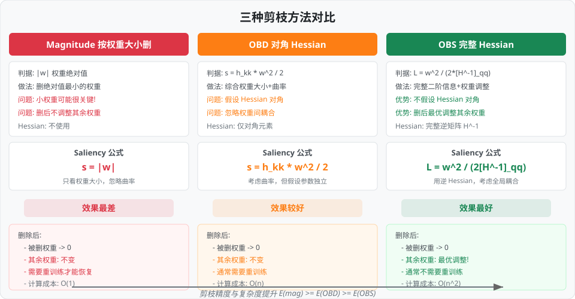
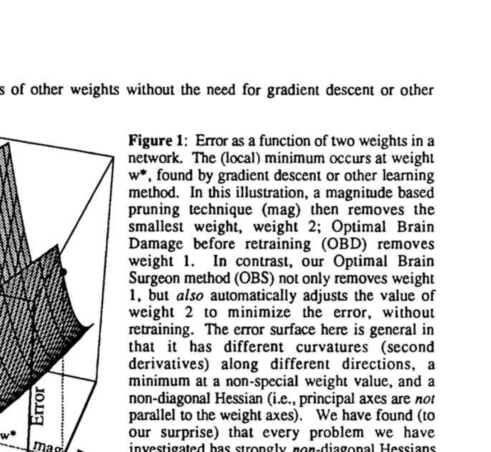
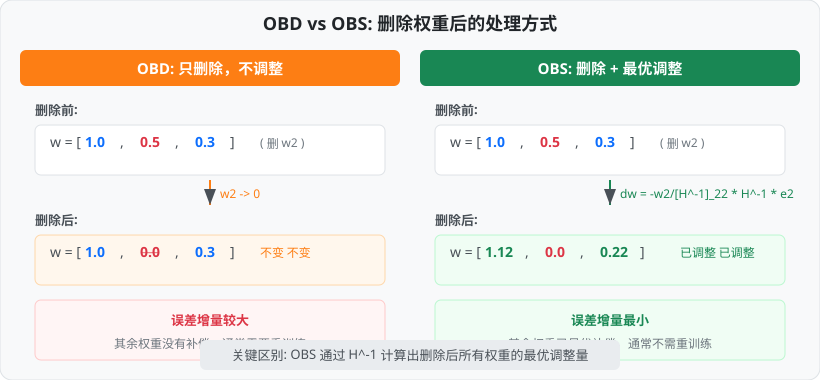
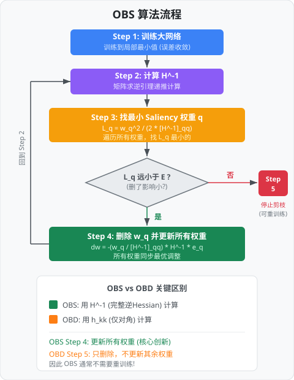
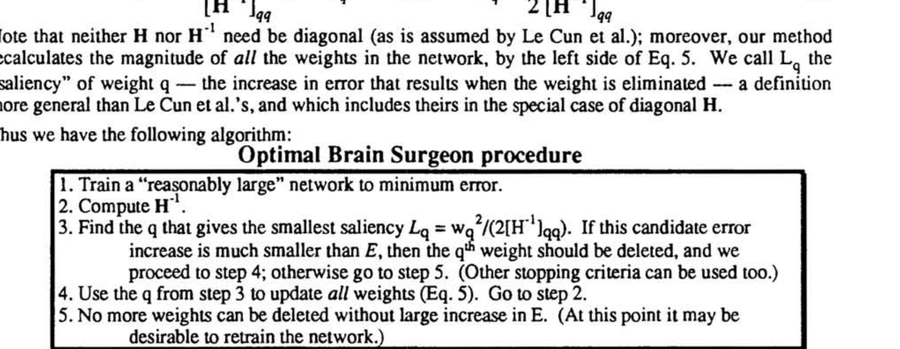
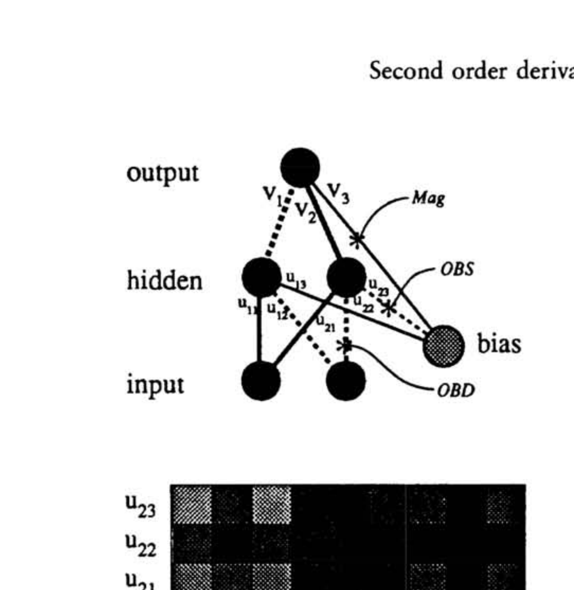
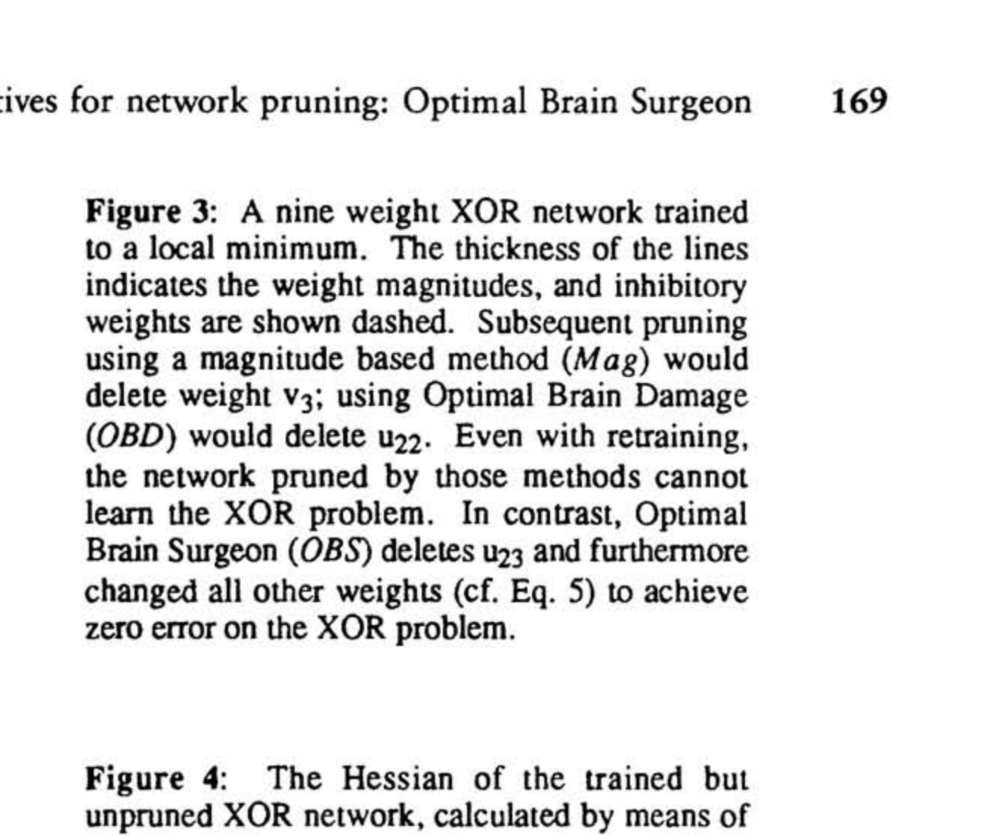
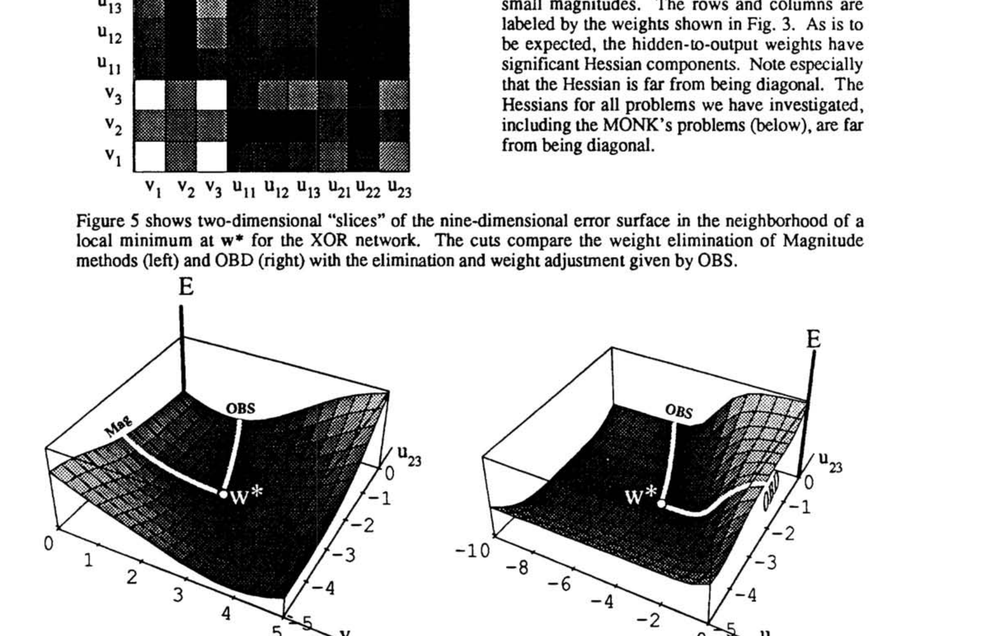
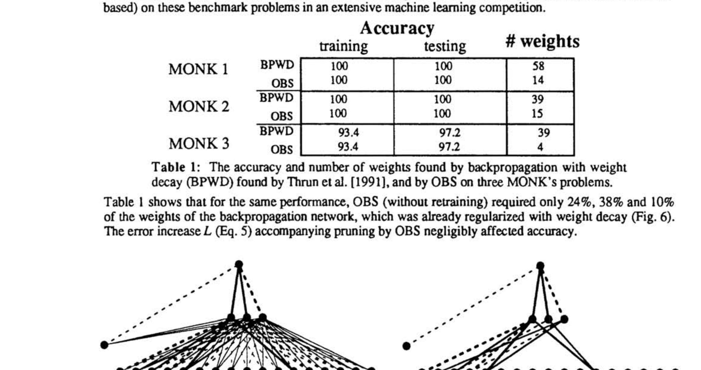

# 用于网络剪枝的二阶导数：最优脑外科医生

> **原文**: Second order derivatives for network pruning: Optimal Brain Surgeon
> **作者**: Babak Hassibi, David G. Stork
> **发表时间**: 1993年 (NIPS 1992)
> **出处**: Advances in Neural Information Processing Systems 5, pp. 164-171

---

## 一句话总结

OBD（最优脑损伤）假设参数之间互不影响来裁权重，经常裁错人；OBS（最优脑外科医生）用完整的二阶信息，不仅精准找到该删的权重，还能在删除后最优地调整剩余权重来补偿——就像一个高明的外科医生，切掉病灶的同时缝合好周围组织。

## 研究背景：为什么要做这个？

1990 年，Le Cun 等人的 Optimal Brain Damage（OBD）论文提出了用二阶导数做网络剪枝，这是一个划时代的进步。但 OBD 有一个关键的假设：**Hessian 矩阵是对角的**——也就是假设每个权重对误差的影响是独立的。

打个比方：OBD 就像一个只看"个人绩效"来裁员的 HR——它给每个员工单独打分，然后裁掉分最低的。但现实中，团队成员之间是有协作关系的！一个看起来"可有可无"的员工，可能正是维系两个核心成员协作的纽带。

Hassibi 和 Stork 研究了实际神经网络的 Hessian 矩阵后发现：**Hessian 远非对角矩阵**——权重之间的耦合效应非常显著。这意味着 OBD 的核心假设在实践中往往不成立，导致它经常做出错误的删除决策。

更致命的是，OBD 在删除权重后不调整其余权重。这就像裁了一个员工后，不重新分配他的工作——团队效率自然会下降。

### 现有方案的问题

三种方法的核心区别在于：Magnitude 只看权重大小，OBD 加入了曲率信息但假设参数独立，而 OBS 使用完整的 Hessian 逆矩阵，同时考虑所有参数之间的相互影响。

## 核心思路：这篇论文的"大招"是什么？

OBS 的创新可以归结为三点：

**第一，使用完整 Hessian 而非对角近似。** OBD 只看 Hessian 的对角元素 $h_{kk}$，忽略了权重之间的关联。OBS 使用完整的 Hessian 逆矩阵 $\mathbf{H}^{-1}$，捕捉所有权重之间的耦合关系。

**第二，删除权重后最优调整其余权重。** 这是 OBS 最重要的创新。删除一个权重后，OBS 不是简单地把它设为零然后等着重训练，而是按照严格的数学公式同时调整所有剩余权重，使得误差增量最小化。

**第三，高效的 $\mathbf{H}^{-1}$ 递推计算。** 直接求逆 $n \times n$ 矩阵需要 $O(n^3)$，但 OBS 利用矩阵求逆引理（Woodbury 公式），只需对每个训练样本做 $O(n^2)$ 计算即可递推得到 $\mathbf{H}^{-1}$。

下面这张 3D 误差面示意图展示了三种方法的不同选择——在同一个误差谷底，Magnitude、OBD 和 OBS 会选择不同的方向"动刀"：

打个比方：如果说剪枝是"给神经网络做手术"，那么 Magnitude 方法就是"闭着眼切最小的那块"；OBD 像一个"只看 CT 片的医生"（只看局部信息）；而 OBS 是一个"看了全套检查报告的外科医生"——不仅知道该切哪里，还知道切完之后怎么缝合才能让身体恢复最好。

## 具体怎么做的？

### 数学推导：从泰勒展开到最优解

和 OBD 一样，出发点是将误差函数在当前权重 $\mathbf{w}^*$（训练后的最优点）处做泰勒展开：

$$\delta E = \left(\frac{\partial E}{\partial \mathbf{w}}\right)^T \delta\mathbf{w} + \frac{1}{2} \delta\mathbf{w}^T \cdot \mathbf{H} \cdot \delta\mathbf{w} + O(\|\delta\mathbf{w}\|^3)$$

其中 $\mathbf{H} = \frac{\partial^2 E}{\partial \mathbf{w}^2}$ 是完整的 Hessian 矩阵（**不做对角近似**）。

在局部最小值处，梯度为零（第一项消失），忽略高阶项后：

$$\delta E \approx \frac{1}{2} \delta\mathbf{w}^T \cdot \mathbf{H} \cdot \delta\mathbf{w}$$

现在，我们的目标是：**将某个权重 $w_q$ 设为零，同时让 $\delta E$ 尽可能小**。

关键的不同在于：OBD 假设删除 $w_q$ 时其余权重不变（$\delta w_i = 0, i \neq q$），而 OBS 允许所有权重同时变化，只要求 $w_q$ 最终变为零。

数学约束为：

$$\mathbf{e}_q^T \cdot \delta\mathbf{w} + w_q = 0$$

其中 $\mathbf{e}_q$ 是第 $q$ 个位置为 1 的单位向量。这个约束的含义很简单：权重向量变化 $\delta\mathbf{w}$ 后，第 $q$ 个分量必须从 $w_q$ 变为 0。

### OBS 的核心公式

用 Lagrangian（拉格朗日函数——一种将"有约束的优化问题"转化为"无约束问题"的标准数学工具）方法求解：

$$L = \frac{1}{2} \delta\mathbf{w}^T \cdot \mathbf{H} \cdot \delta\mathbf{w} + \lambda(\mathbf{e}_q^T \cdot \delta\mathbf{w} + w_q)$$

对 $\delta\mathbf{w}$ 和 $\lambda$ 分别求导并令其为零，解出：

$$\boxed{\delta\mathbf{w} = -\frac{w_q}{[\mathbf{H}^{-1}]_{qq}} \mathbf{H}^{-1} \cdot \mathbf{e}_q}$$

$$\boxed{L_q = \frac{1}{2} \frac{w_q^2}{[\mathbf{H}^{-1}]_{qq}}}$$

这两个公式是 OBS 的灵魂：

- $L_q$ 是删除权重 $w_q$ 后的最小误差增量（**Saliency**）。我们遍历所有权重，找 $L_q$ 最小的那个来删
- $\delta\mathbf{w}$ 告诉我们删除 $w_q$ 后，**所有**剩余权重应该如何调整才能使误差增量最小

注意：当 $\mathbf{H}$ 恰好是对角矩阵时，$[\mathbf{H}^{-1}]_{qq} = 1/h_{qq}$，于是 $L_q = \frac{1}{2} h_{qq} w_q^2$——这正是 OBD 的公式！所以 **OBD 是 OBS 的特殊情况**。

### 高效计算 $\mathbf{H}^{-1}$：矩阵求逆引理

直接对 $n \times n$ 的 Hessian 矩阵求逆需要 $O(n^3)$ 计算量，这对大网络不可行。OBS 的巧妙之处在于利用了一个数学工具——矩阵求逆引理（也叫 Woodbury 公式）。

核心思想是：Hessian 可以从训练数据中逐样本递推构建。设 $\mathbf{X}^{[k]} = \frac{\partial \mathbf{F}(\mathbf{w}, \mathbf{in}^{[k]})}{\partial \mathbf{w}}$ 是网络输出对权重的导数向量（反向传播已经计算了这些值），那么：

$$\mathbf{H} = \frac{1}{P} \sum_{k=1}^P \mathbf{X}^{[k]} \cdot \mathbf{X}^{[k]T}$$

逆矩阵可以递推计算：

$$\mathbf{H}_{m+1}^{-1} = \mathbf{H}_m^{-1} - \frac{\mathbf{H}_m^{-1} \cdot \mathbf{X}^{[m+1]} \cdot \mathbf{X}^{[m+1]T} \cdot \mathbf{H}_m^{-1}}{P + \mathbf{X}^{[m+1]T} \cdot \mathbf{H}_m^{-1} \cdot \mathbf{X}^{[m+1]}}$$

初始值 $\mathbf{H}_0^{-1} = \alpha^{-1}\mathbf{I}$（$\alpha$ 是一个很小的常数，$10^{-8}$ 到 $10^{-4}$）。每处理一个训练样本，只需 $O(n^2)$ 计算量（一次向量外积 + 矩阵-向量乘法），总共 $O(Pn^2)$。

### OBS 算法流程

论文给出的完整 OBS 算法只有 5 步：

1. **训练**：将一个"足够大"的网络训练到最小误差
2. **计算 $\mathbf{H}^{-1}$**：用上述递推公式遍历训练集
3. **选择**：找到 saliency $L_q = w_q^2 / (2[\mathbf{H}^{-1}]_{qq})$ 最小的权重 $q$。如果 $L_q$ 远小于当前误差 $E$，就删除它并继续到步骤 4；否则跳到步骤 5
4. **更新**：用公式 $\delta\mathbf{w} = -\frac{w_q}{[\mathbf{H}^{-1}]_{qq}} \mathbf{H}^{-1} \cdot \mathbf{e}_q$ 更新所有权重，回到步骤 2
5. **停止**：不能再删了（此时可以考虑重训练一下网络）

### 用一个具体例子走通全流程

#### 场景设定

设一个极简网络有 3 个权重：

$$\mathbf{w} = \begin{bmatrix} 0.2 \\ 1.0 \\ 1.0 \end{bmatrix}$$

这个网络已经训练到局部最小值。完整 Hessian 矩阵为：

$$\mathbf{H} = \begin{bmatrix} 8.0 & 0 & 0 \\ 0 & 4.0 & 3.9 \\ 0 & 3.9 & 4.0 \end{bmatrix}$$

注意 $h_{23} = h_{32} = 3.9$ 非常接近 $h_{22} = h_{33} = 4.0$——这说明 $w_2$ 和 $w_3$ 高度耦合。直觉上，它们的"工作"几乎完全重叠，就像两个做同样事情的员工。

#### Step 1: 计算 $\mathbf{H}^{-1}$

经矩阵求逆（$\det(\mathbf{H}) = 8 \times (16 - 15.21) = 6.32$）：

$$\mathbf{H}^{-1} = \begin{bmatrix} 0.125 & 0 & 0 \\ 0 & 5.06 & -4.94 \\ 0 & -4.94 & 5.06 \end{bmatrix}$$

关键观察：$[\mathbf{H}^{-1}]_{22} = [\mathbf{H}^{-1}]_{33} = 5.06$，非常大！这意味着在 $\mathbf{H}^{-1}$ 的度量下，$w_2$ 和 $w_3$ 的"有效影响"被强耦合稀释了。同时 $[\mathbf{H}^{-1}]_{23} = -4.94$ 的绝对值几乎等于对角值——说明删除一个可以被另一个几乎完全补偿。

#### Step 2: 三种方法的 Saliency 对比

**Magnitude（按权重大小）**：

$$|w_1| = 0.2, \quad |w_2| = 1.0, \quad |w_3| = 1.0$$

删除顺序：$w_1 \to w_2/w_3$（先删最小的）

**OBD（对角 Hessian）**：

$$s_1 = \tfrac{1}{2} \times 8.0 \times 0.04 = 0.16, \quad s_2 = \tfrac{1}{2} \times 4.0 \times 1.0 = 2.0, \quad s_3 = \tfrac{1}{2} \times 4.0 \times 1.0 = 2.0$$

删除顺序：$w_1 \to w_2/w_3$（同样先删 $w_1$）

**OBS（完整 Hessian）**：

$$L_1 = \frac{0.04}{2 \times 0.125} = 0.16, \quad L_2 = \frac{1.0}{2 \times 5.06} = 0.099, \quad L_3 = \frac{1.0}{2 \times 5.06} = 0.099$$

删除顺序：$w_2 \text{ 或 } w_3 \to w_1$（**先删 $w_2$ 或 $w_3$**！）

|  权重   |  $  |  w   |     $     | OBD $s_k$ | OBS $L_q$ | Magnitude 排序 | OBD 排序 | OBS 排序 |
| :---: | :-: | :--: | :-------: | :-------: | :-------: | :----------: | ------ | ------ |
| $w_1$ | 0.2 | 0.16 |   0.16    |   第 1 删   |   第 1 删   |  **第 2 删**   |        |        |
| $w_2$ | 1.0 | 2.00 | **0.099** |   第 2 删   |   第 2 删   |  **第 1 删**   |        |        |
| $w_3$ | 1.0 | 2.00 | **0.099** |   第 2 删   |   第 2 删   |  **第 1 删**   |        |        |

#### Step 3: OBS 的权重调整

假设 OBS 选择删除 $w_2$，它同时计算所有权重的最优调整量：

$$\delta\mathbf{w} = -\frac{w_2}{[\mathbf{H}^{-1}]_{22}} \mathbf{H}^{-1} \cdot \mathbf{e}_2 = -\frac{1.0}{5.06} \begin{bmatrix} 0 \\ 5.06 \\ -4.94 \end{bmatrix} = \begin{bmatrix} 0 \\ -1.0 \\ +0.976 \end{bmatrix}$$

更新后的权重：

$$\mathbf{w}_{\text{new}} = \begin{bmatrix} 0.2 \\ 1.0 \\ 1.0 \end{bmatrix} + \begin{bmatrix} 0 \\ -1.0 \\ +0.976 \end{bmatrix} = \begin{bmatrix} 0.2 \\ 0 \\ 1.976 \end{bmatrix}$$

$w_2$ 被删除（变为 0），而 $w_3$ 从 1.0 增大到 1.976——几乎吸收了 $w_2$ 的全部"工作量"！这正是因为 $w_2$ 和 $w_3$ 高度耦合，一个人能干两个人的活。

#### 对比分析

| 方法 | 删除的权重 | 误差增量 $\delta E$ | 是否调整其余权重 |
|:---:|:---:|:---:|:---:|
| Magnitude | $w_1$ (最小) | 0.16 | 否 |
| OBD | $w_1$ (最小 saliency) | 0.16 | 否 |
| **OBS** | **$w_2$ (利用耦合)** | **0.099** | **是（$w_3$: 1.0 → 1.976）** |

OBS 的误差增量（0.099）比 Magnitude 和 OBD（0.16）低了 **38%**！它之所以敢删绝对值为 1.0 的"大"权重，是因为它看到了 $w_2$ 和 $w_3$ 的高度耦合——删掉一个，另一个可以顶上。

> **小白 tips**：想象一家公司有两个做完全相同工作的员工（$w_2$ 和 $w_3$），还有一个做独特工作的低薪员工（$w_1$）。Magnitude 和 OBD 都会先裁低薪员工，因为他"看起来不重要"。但 OBS 看到了真相——裁掉一个重复岗位的员工，让另一个承担双倍工作，对公司运转的影响更小！

## 效果怎么样？

### XOR 实验：OBS 的杀手级演示

论文用经典的 XOR 问题做了一个漂亮的对比实验。XOR 网络有 2 个输入、3 个隐藏神经元、1 个输出，共 9 个权重。

上图中线条粗细表示权重大小，虚线表示低于阈值的权重。三种方法给出了不同的删除选择：Magnitude 删 $w_{14}$（最小的），OBD 删 $w_7$，而 OBS 删 $w_{23}$——只有 OBS 删除的是正确的权重。

上图展示了这个 XOR 网络的 Hessian 矩阵。白色表示大值，黑色表示小值。可以清楚地看到：**Hessian 远非对角矩阵**——非对角元素的值很大。这直接否定了 OBD 的核心假设。

Figure 5 是最有说服力的图。两张 3D 误差面分别展示了不同方向的误差变化：左图是 Magnitude/OBD 选择删除的方向——误差面陡峭，删了影响大；右图是 OBS 选择的方向——误差面平坦，而且 OBS 通过权重调整（图中标注的点）几乎回到了最低点。

论文中一句经典的结论：

> "Magnitude methods and Optimal Brain Damage delete the wrong weights, and their mistake cannot be overcome by further network training. Only Optimal Brain Surgeon deletes the correct weight."
>
> ——幅度方法和 OBD 删错了权重，而且它们的错误无法通过后续训练来弥补。只有 OBS 删除了正确的权重。

### MONK's 基准问题

论文在三个 MONK 基准分类问题上做了大规模对比。BPWD 是"反向传播 + 权重衰减"（当时的标准方法）：

| 问题 | 方法 | 训练准确率 | 测试准确率 | 权重数量 | 压缩比 |
|:---:|:---:|:---:|:---:|:---:|:---:|
| MONK 1 | BPWD | 100 | 100 | 58 | 1× |
| MONK 1 | **OBS** | **100** | **100** | **14** | **4.1×** |
| MONK 2 | BPWD | 100 | 100 | 39 | 1× |
| MONK 2 | **OBS** | **100** | **100** | **15** | **2.6×** |
| MONK 3 | BPWD | 93.4 | 97.2 | 39 | 1× |
| MONK 3 | **OBS** | **93.4** | **97.2** | **4** | **9.75×** |

OBS 在保持完全相同性能的前提下，分别只需要原始权重的 **24%、38%、10%**。MONK 3 最为惊人——39 个权重削减到仅 4 个，压缩近 10 倍！

Figure 6 展示了 MONK 1 问题上 BPWD（左）和 OBS（右）找到的最优网络。OBS 得到的网络干净利落，结构清晰。

### NETtalk 大规模实验

为了验证 OBS 在真实大规模网络上的表现，论文将其应用于 NETtalk 语音网络——一个有 **18,000** 个权重的网络（这在 1992 年算是很大的了）。OBS 将其剪枝到仅 **1,560** 个权重（削减 91.3%），而且泛化性能更好。

## 论文的意义和局限

**主要贡献**：

1. **理论完备性**：OBS 从完整的二阶优化出发，给出了数学上最优的剪枝方案，而非启发式近似。它证明了 OBD 是其特殊情况，建立了统一的理论框架
2. **权重调整机制**：首次提出删除后调整剩余权重的思想，消除了频繁重训练的需要
3. **高效算法**：利用矩阵求逆引理，将 $\mathbf{H}^{-1}$ 的计算从 $O(n^3)$ 降到 $O(Pn^2)$
4. **实验说服力**：XOR 实验的"杀手级演示"直观展示了对角假设的危害

**局限性**：

1. **$O(n^2)$ 空间复杂度**：存储完整的 $\mathbf{H}^{-1}$ 需要 $O(n^2)$ 内存，对于现代百万/十亿参数的网络完全不可行。1992 年的 2,600 参数网络对于今天的大模型来说微不足道
2. **$(t - o) \to 0$ 近似**：Hessian 的简化计算依赖训练误差趋近于零的假设，在欠训练或复杂问题上可能不成立
3. **逐权重删除**：每次只删一个权重再重算 $\mathbf{H}^{-1}$，效率不高。没有考虑同时删除多个权重的策略
4. **局限于小规模网络**：论文的实验规模（XOR 9 权重、NETtalk 18,000 权重）放在今天看很小

## 读后感

这篇论文给人最深的印象是它的"完美主义"——在 OBD 已经很不错的基础上，Hassibi 和 Stork 执意要去掉对角假设，追求理论上的最优解。事实证明，这份执着是值得的：在 XOR 实验中，只有 OBS 能给出正确答案，其他方法全部翻车。

从更宏观的视角看，OBD 和 OBS 共同确立了"基于 Hessian 的网络剪枝"这一研究方向。虽然 $O(n^2)$ 的空间复杂度使得 OBS 无法直接用于今天的大模型，但它的思想影响深远——后续的 Fisher 信息剪枝、结构化剪枝、乃至 2023 年的 SparseGPT 等工作，都可以看到 OBS 思想的影子。

如果你是初学者，读完这篇论文最应该记住的是：**删除权重时，不能只看"这个权重有多大"，还要看"删了它之后，其他权重能不能补上来"**。这个简单的道理，在三十多年后的大模型压缩中依然是核心原则。
