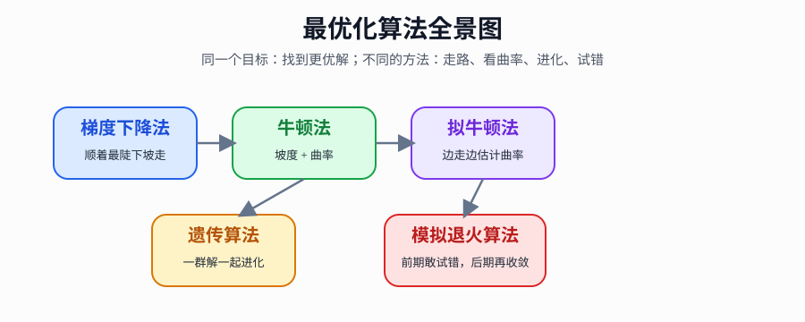
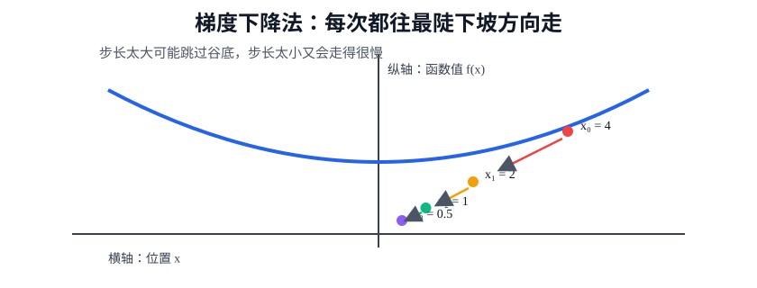
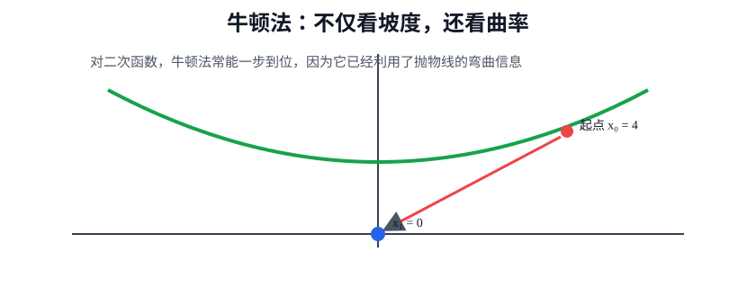
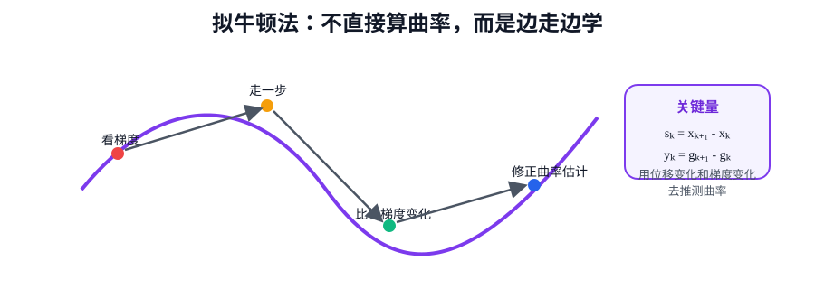
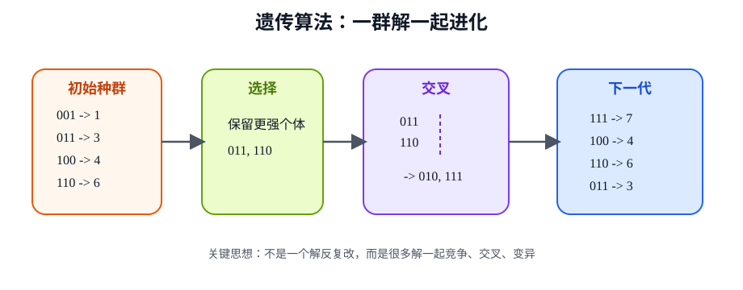
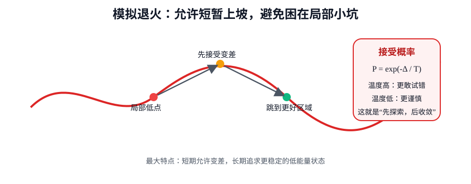

# 最优化算法入门：从“下山找最低点”理解 5 种经典方法

> **定位**: 面向零基础读者的学习笔记
> **主题**: 梯度下降法、牛顿法、拟牛顿法、遗传算法、模拟退火算法
> **阅读目标**: 不只知道“它是什么”，还要知道“它每一步怎么算、为什么这样算、解决了什么问题”
> **发表时间**: 1900-01-01

---

## 目录

1. [先把“最优化”讲明白](#1-先把最优化讲明白)
2. [本文的故事线](#2-本文的故事线)
3. [预备知识：导数、梯度、曲率](#3-预备知识导数梯度曲率到底是什么)
4. [梯度下降法](#4-梯度下降法)
5. [牛顿法](#5-牛顿法)
6. [拟牛顿法](#6-拟牛顿法)
7. [遗传算法](#7-遗传算法)
8. [模拟退火算法](#8-模拟退火算法)
9. [五种算法总对比](#9-五种算法的总对比)
10. [学习顺序建议](#11-给小白的学习顺序建议)

---

## 一句话总结

这 5 种算法，本质上都在回答同一个问题：

> 当你要在大量可能方案里找到“最好的那个”时，到底该怎样一步一步逼近它？

它们的回答分别是：

- 梯度下降法：沿着最陡的下坡方向走
- 牛顿法：不仅看坡度，还看地形弯曲程度
- 拟牛顿法：不直接算弯曲，但边走边估计
- 遗传算法：让一群候选方案不断进化
- 模拟退火算法：允许短暂走弯路，从而跳出局部最优



---

## 1. 先把“最优化”讲明白

### 1.1 问题是什么

最优化要解决的问题很简单：

> 在很多可选方案中，找出最好的那个。

数学上通常写成：

$$
\min_x f(x)
$$

意思是：

- $x$ 是你可以调的变量
- $f(x)$ 是这个选择对应的“代价”“误差”或“损失”
- 我们想让 $f(x)$ 尽量小

### 1.2 一个生活化类比

把 $f(x)$ 想成山的高度：

- 你当前站的位置是 $x$
- 你脚下的海拔是 $f(x)$
- 你的目标是走到最低谷

所以，最优化算法就是“找谷底的方法”。

### 1.3 为什么需要不同算法

因为“山地”并不总是一样：

- 有的山很平滑，适合直接顺坡下
- 有的山弯曲很厉害，只看坡度不够
- 有的地方有很多小坑，容易误以为已经到底
- 有的问题甚至没有明确坡度，没法靠导数走

这就是为什么会有多种算法。

---

## 2. 本文的故事线

为了让你读起来更顺，我按照统一逻辑来讲每种算法：

1. 它想解决什么问题
2. 为什么会想到这个方法
3. 核心原理是什么
4. 具体怎么计算
5. 手算一个完整例子
6. 它的意义是什么

前 3 种属于“基于导数的方法”：

- 梯度下降法
- 牛顿法
- 拟牛顿法

后 2 种属于“启发式搜索方法”：

- 遗传算法
- 模拟退火算法

---

## 3. 预备知识：导数、梯度、曲率到底是什么

### 3.1 导数

导数可以先理解成：

> 当前位置的坡度。

比如函数：

$$
f(x)=x^2
$$

它的导数是：

$$
f'(x)=2x
$$

这表示：

- 当 $x>0$ 时，导数为正，函数往右是在升高
- 当 $x<0$ 时，导数为负，函数往右是在降低
- 当 $x=0$ 时，导数为 0，说明这里是平的

### 3.2 梯度

如果变量不止一个，比如 $f(x,y)$，那就不再是单个导数，而是一个方向集合，叫梯度。

记作：

$$
\nabla f(x)
$$

它表示：

> 函数上升最快的方向。

所以负梯度方向 $-\nabla f(x)$，就是下降最快的方向。

### 3.3 曲率

曲率可以理解成：

> 地形弯得厉不厉害。

在一维里，它对应二阶导数：

$$
f''(x)
$$

如果二阶导数大，说明弯得比较厉害；如果小，说明变化更平缓。

---

## 4. 梯度下降法

### 4.1 问题

如果你站在山坡上，四周看不清远处，只知道脚下哪边更陡，怎么往谷底走？

### 4.2 动机

最自然的想法是：

> 每次都沿着当前最陡的下坡方向走一步。

这就像摸黑下山：虽然你看不到全局，但你至少知道眼前哪边更低。

### 4.3 方法原理

梯度下降法的更新公式是：

$$
x_{k+1}=x_k-\alpha f'(x_k)
$$

多维形式写成：

$$
x_{k+1}=x_k-\alpha \nabla f(x_k)
$$

其中：

- $x_k$：第 $k$ 次迭代的位置
- $\nabla f(x_k)$：当前位置的梯度
- $\alpha$：步长，也叫学习率

### 4.4 这个公式怎么理解

- 梯度指向“上升最快”的方向
- 我们想下降，所以要减去它
- $\alpha$ 决定你每次走多远

如果 $\alpha$ 太大，可能一下跨过谷底；如果太小，就会走得非常慢。

### 4.5 手算示例 1：用最简单函数理解流程

取目标函数：

$$
f(x)=x^2
$$

它的导数为：

$$
f'(x)=2x
$$

设：

- 初始点 $x_0=4$
- 步长 $\alpha=0.25$

更新规则变成：

$$
x_{k+1}=x_k-0.25\cdot 2x_k=x_k-0.5x_k=0.5x_k
$$

于是可以直接看出，每次都会变成前一次的一半。

#### 第 1 轮

$$
x_0=4
$$

$$
f'(4)=8
$$

$$
x_1=4-0.25\times 8=2
$$

$$
f(x_1)=f(2)=4
$$

#### 第 2 轮

$$
f'(2)=4
$$

$$
x_2=2-0.25\times 4=1
$$

$$
f(x_2)=f(1)=1
$$

#### 第 3 轮

$$
f'(1)=2
$$

$$
x_3=1-0.25\times 2=0.5
$$

$$
f(x_3)=f(0.5)=0.25
$$

#### 第 4 轮

$$
f'(0.5)=1
$$

$$
x_4=0.5-0.25\times 1=0.25
$$

$$
f(x_4)=f(0.25)=0.0625
$$

整理成表格：

| 迭代轮次 | 当前点 $x_k$ | 导数 $f'(x_k)$ | 更新后 $x_{k+1}$ | 函数值 $f(x_{k+1})$ |
|------|------|------|------|------|
| 0 | 4 | 8 | 2 | 4 |
| 1 | 2 | 4 | 1 | 1 |
| 2 | 1 | 2 | 0.5 | 0.25 |
| 3 | 0.5 | 1 | 0.25 | 0.0625 |

你会发现：

$$
4 \to 2 \to 1 \to 0.5 \to 0.25 \to \cdots
$$

它会不断逼近 $0$。



### 4.6 手算示例 2：为什么步长很重要

还是用：

$$
f(x)=x^2,
\quad f'(x)=2x
$$

设初始点还是 $x_0=4$。

#### 情况 A：步长太小，$\alpha=0.05$

更新式：

$$
x_{k+1}=x_k-0.1x_k=0.9x_k
$$

于是：

$$
4 \to 3.6 \to 3.24 \to 2.916 \to \cdots
$$

下降是下降了，但非常慢。

#### 情况 B：步长合适，$\alpha=0.25$

$$
4 \to 2 \to 1 \to 0.5 \to 0.25
$$

速度明显更合适。

#### 情况 C：步长太大，$\alpha=0.8$

更新式：

$$
x_{k+1}=x_k-1.6x_k=-0.6x_k
$$

于是：

$$
4 \to -2.4 \to 1.44 \to -0.864 \to 0.5184 \to \cdots
$$

它会在两边来回跳。

这说明：

> 梯度下降法不是只要会“减去梯度”就够了，步长选得合不合适，非常关键。

### 4.7 它的意义

梯度下降法最大的意义是：

- 原理简单
- 容易实现
- 能推广到高维
- 是机器学习、深度学习最核心的基础工具之一

### 4.8 亮点与局限

**亮点**：

> 只靠局部坡度信息，就能逐步逼近最优解。

**局限**：

- 步长敏感
- 可能收敛慢
- 容易陷入局部最优

---

## 5. 牛顿法

### 5.1 问题

梯度下降法只看坡度，不看地形弯曲程度，所以有时步子走得不够聪明。

### 5.2 动机

人们自然会想：

> 既然坡度能告诉我往哪走，那如果再知道地形弯得多厉害，是不是就能走得更快？

这就是牛顿法。

### 5.3 方法原理

牛顿法在一维的公式是：

$$
x_{k+1}=x_k-\frac{f'(x_k)}{f''(x_k)}
$$

这里：

- $f'(x_k)$ 是一阶导数，表示坡度
- $f''(x_k)$ 是二阶导数，表示曲率

### 5.4 这个公式的直观含义

你可以把它理解成：

> 坡度负责告诉你方向，曲率负责告诉你这一步到底该走大一点还是小一点。

### 5.5 手算示例 1：最简单情况

还是取：

$$
f(x)=x^2
$$

则：

$$
f'(x)=2x,
\quad f''(x)=2
$$

设：

$$
x_0=4
$$

则：

$$
x_1=4-\frac{8}{2}=0
$$

一步就到最优点。

为什么会这么快？

因为对二次函数来说，牛顿法相当于直接利用抛物线的曲率信息，一次就能算出底部位置。



### 5.6 手算示例 2：再看一个更能体现“逐步逼近”的例子

取：

$$
f(x)=x^4
$$

那么：

$$
f'(x)=4x^3
$$

$$
f''(x)=12x^2
$$

牛顿法更新：

$$
x_{k+1}=x_k-\frac{4x_k^3}{12x_k^2}=x_k-\frac{x_k}{3}=\frac{2}{3}x_k
$$

设初值：

$$
x_0=3
$$

#### 第 1 轮

$$
x_1=\frac{2}{3}\times 3=2
$$

#### 第 2 轮

$$
x_2=\frac{2}{3}\times 2=\frac{4}{3}\approx 1.333
$$

#### 第 3 轮

$$
x_3=\frac{2}{3}\times \frac{4}{3}=\frac{8}{9}\approx 0.889
$$

#### 第 4 轮

$$
x_4=\frac{2}{3}\times \frac{8}{9}=\frac{16}{27}\approx 0.593
$$

表格如下：

| 迭代轮次 | $x_k$ | 更新后 $x_{k+1}$ |
|------|------|------|
| 0 | 3 | 2 |
| 1 | 2 | 1.333 |
| 2 | 1.333 | 0.889 |
| 3 | 0.889 | 0.593 |

虽然这次不是一步到位，但收敛仍然比较快。

### 5.7 它的意义

牛顿法的意义在于：

- 它利用了二阶信息
- 接近最优点时收敛很快
- 在很多数值优化问题中非常经典

### 5.8 最大亮点

> 它不是“固定步长走路”，而是根据曲率自动决定该走多远。

### 5.9 局限

- 需要算二阶导数
- 高维时需要 Hessian 矩阵，计算代价高
- 初始点不好时，可能不稳定

---

## 6. 拟牛顿法

### 6.1 问题

牛顿法很快，但有一个现实难点：

> 真正的二阶导数往往太贵、太麻烦。

特别是变量很多时，Hessian 矩阵会很大。

### 6.2 动机

于是人们就想到：

> 能不能不直接计算二阶导数，而是根据过去走过的路，逐步估计曲率？

这就是拟牛顿法的核心想法。

### 6.3 方法原理

多维牛顿法通常写成：

$$
x_{k+1}=x_k-H_k^{-1}\nabla f(x_k)
$$

其中 $H_k$ 是 Hessian 矩阵。

拟牛顿法把它改成：

$$
x_{k+1}=x_k-B_k\nabla f(x_k)
$$

这里的 $B_k$ 不是精确的 $H_k^{-1}$，而是一个不断更新的近似矩阵。

常见方法有：

- BFGS
- L-BFGS

### 6.4 小白能懂的直观理解

可以把三种方法对比成：

- 梯度下降法：只看眼前坡度
- 牛顿法：手里有完整地形曲率信息
- 拟牛顿法：没有完整地图，但会边走边总结地图

### 6.5 计算到底怎么发生

对初学者，先不要死记 BFGS 的完整矩阵公式，先抓住 4 个动作：

1. 在当前位置算梯度
2. 先按当前估计的方向走一步
3. 对比“走之前”和“走之后”的梯度变化
4. 用这个变化修正曲率估计

标准 BFGS 会用两个量：

$$
s_k=x_{k+1}-x_k
$$

$$
y_k=\nabla f(x_{k+1})-\nabla f(x_k)
$$

其中：

- $s_k$ 表示“这一步走了多远”
- $y_k$ 表示“梯度发生了多大变化”

而“梯度的变化”恰恰就是曲率的线索。

### 6.6 手算示例：用 1 维近似理解拟牛顿法在干什么

取函数：

$$
f(x)=x^2,
\quad f'(x)=2x
$$

我们假装不知道真实的二阶导数 $f''(x)=2$，而是自己去估计一个“逆曲率” $B_k$。

设：

- 初始点 $x_0=4$
- 初始逆曲率估计 $B_0=1$

更新规则：

$$
x_{k+1}=x_k-B_k f'(x_k)
$$

#### 第 1 轮：先按旧估计走一步

当前梯度：

$$
g_0=f'(4)=8
$$

如果直接用 $B_0=1$，则：

$$
x_1=4-1\times 8=-4
$$

这一步显然走猛了。

现在计算：

$$
s_0=x_1-x_0=-4-4=-8
$$

$$
g_1=f'(-4)=-8
$$

$$
y_0=g_1-g_0=-8-8=-16
$$

在 1 维里，逆 Hessian 的一个自然近似就是：

$$
B_1=\frac{s_0}{y_0}=\frac{-8}{-16}=0.5
$$

这一下就学到了：

> 原来合适的逆曲率应该更接近 0.5，而不是 1。

#### 第 2 轮：用新的估计再走

现在用：

$$
B_1=0.5
$$

则：

$$
x_2=x_1-B_1 g_1=-4-0.5\times(-8)=0
$$

直接到最优点。

这个例子虽然简化，但它非常清楚地说明了拟牛顿法的本质：

> 根据“位移变化”和“梯度变化”去学习曲率。



### 6.7 它的意义

拟牛顿法的意义在于：

- 比梯度下降法聪明
- 比牛顿法省计算
- 在很多工程问题里是非常好的折中方案

### 6.8 最大亮点

> 不显式求二阶导数，却能在很大程度上获得二阶方法的速度优势。

### 6.9 局限

- 公式和实现比梯度下降复杂
- 需要维护近似矩阵
- 对超大规模问题要考虑内存成本

---

## 7. 遗传算法

### 7.1 问题

前面几种方法都默认：

> 目标函数可以通过导数告诉你往哪走。

但很多真实问题不是这样：

- 变量是离散的
- 目标函数不光滑
- 解空间像迷宫，不像山坡

这时候“顺坡下山”思路就不够用了。

### 7.2 动机

遗传算法的想法来自生物进化：

> 不是让一个方案单独摸索，而是让很多方案一起竞争、繁殖、变异，最后优秀的方案活下来。

### 7.3 方法原理

遗传算法通常包括 4 个步骤：

1. 初始化种群
2. 计算适应度
3. 选择优秀个体
4. 交叉和变异，产生下一代

这里：

- 种群：一批候选解
- 适应度：这个解有多好
- 交叉：两个父母拼出后代
- 变异：随机改一点点，增加探索性

### 7.4 手算示例：一步一步找最大值

设目标是最大化：

$$
f(x)=x^2
$$

限制 $x$ 为 0 到 7 的整数。

用 3 位二进制编码：

| 二进制 | 十进制 $x$ | 适应度 $f(x)=x^2$ |
|------|------|------|
| 000 | 0 | 0 |
| 001 | 1 | 1 |
| 010 | 2 | 4 |
| 011 | 3 | 9 |
| 100 | 4 | 16 |
| 101 | 5 | 25 |
| 110 | 6 | 36 |
| 111 | 7 | 49 |

目标显然是找到 `111`。

#### 第 1 步：初始化种群

随机生成 4 个个体：

- `001`，即 $x=1$，适应度 1
- `011`，即 $x=3$，适应度 9
- `100`，即 $x=4$，适应度 16
- `110`，即 $x=6$，适应度 36

#### 第 2 步：选择

适应度更高的个体，更有机会被选为父母。

比如我们选：

- 父母 A：`011`
- 父母 B：`110`

#### 第 3 步：交叉

如果在中间切开：

```text
011
110
```

交换后半部分：

```text
010
111
```

于是得到两个后代：

- `010`，即 $x=2$，适应度 4
- `111`，即 $x=7$，适应度 49

一下就产生了最优解。

#### 第 4 步：变异

如果某个个体是：

```text
101
```

随机翻转最后一位，可能变成：

```text
100
```

或者翻转中间一位，变成：

```text
111
```

变异的意义不是保证更优，而是避免整个种群太像，从而卡住不动。

### 7.5 手算一个两代过程

初始种群：

| 个体 | 十进制 | 适应度 |
|------|------|------|
| 001 | 1 | 1 |
| 011 | 3 | 9 |
| 100 | 4 | 16 |
| 110 | 6 | 36 |

选择后做交叉，得到新种群假设为：

| 个体 | 十进制 | 适应度 |
|------|------|------|
| 111 | 7 | 49 |
| 100 | 4 | 16 |
| 110 | 6 | 36 |
| 011 | 3 | 9 |

对比可见，平均质量比上一代更高。



### 7.6 它的意义

遗传算法的意义在于：

- 不依赖导数
- 能处理离散与组合问题
- 全局搜索能力较强

### 7.7 最大亮点

> 它不是“一个解慢慢走”，而是“一群解一起进化”。

### 7.8 局限

- 计算量可能较大
- 参数较多，如种群大小、交叉率、变异率
- 结果带有随机性

---

## 8. 模拟退火算法

### 8.1 问题

很多优化问题最大的难点不是“怎么往下降”，而是：

> 你可能已经掉进一个小坑里，却误以为自己到了最低点。

这就叫局部最优。

### 8.2 动机

模拟退火来自金属退火的物理过程：

1. 先加热
2. 让粒子充分活动
3. 再慢慢降温
4. 最后进入更稳定的低能量状态

把它借到优化里，就是：

> 一开始允许去试一些“更差”的解，增加探索能力；后面再慢慢收敛稳定。

### 8.3 方法原理

设当前解是 $x$，候选新解是 $x'$。

如果是最小化问题：

- 若 $f(x')<f(x)$，直接接受
- 若 $f(x')\ge f(x)$，以一定概率接受

这个概率通常写成：

$$
P=\exp\left(-\frac{f(x')-f(x)}{T}\right)
$$

其中：

- $T$ 是温度
- 温度高时，更容易接受差解
- 温度低时，更不容易接受差解

温度一般逐渐降低：

$$
T_{k+1}=\alpha T_k,\quad 0<\alpha<1
$$

### 8.4 手算示例：为什么“更差的解”也可能接受

取最小化问题：

$$
f(x)=x^2
$$

当前点：

$$
x=2,
\quad f(2)=4
$$

随机试出新点：

$$
x'=3,
\quad f(3)=9
$$

它更差，因为：

$$
\Delta=9-4=5
$$

#### 情况 A：温度高，$T=10$

$$
P=e^{-5/10}=e^{-0.5}\approx 0.6065
$$

这表示大约有 60.65% 的概率接受这个更差的点。

#### 情况 B：温度低，$T=1$

$$
P=e^{-5}\approx 0.0067
$$

几乎不会接受。

所以模拟退火的思想是：

- 前期大胆探索
- 后期谨慎收敛

### 8.5 手算一个简化过程

设初始解：

$$
x_0=4,
\quad f(x_0)=16
$$

初始温度：

$$
T_0=10
$$

降温系数：

$$
\alpha=0.8
$$

#### 第 1 轮

随机新解：

$$
x_1'=3,
\quad f(x_1')=9
$$

因为更好，直接接受：

$$
x_1=3
$$

降温：

$$
T_1=0.8\times 10=8
$$

#### 第 2 轮

随机新解：

$$
x_2'=3.5,
\quad f(x_2')=12.25
$$

它更差：

$$
\Delta=12.25-9=3.25
$$

接受概率：

$$
P=e^{-3.25/8}\approx e^{-0.40625}\approx 0.666
$$

如果此时随机数抽到 0.4，因为 $0.4<0.666$，就接受这个更差解：

$$
x_2=3.5
$$

这一步看起来“吃亏”，但它让算法有机会跳出局部小坑。

#### 第 3 轮

再随机出一个更好的点：

$$
x_3'=1,
\quad f(x_3')=1
$$

直接接受：

$$
x_3=1
$$

可以看到，允许偶尔上坡，反而可能帮你去到更深的谷底。



### 8.6 它的意义

模拟退火的重要意义在于：

- 不需要导数
- 有能力跳出局部最优
- 特别适合复杂搜索空间

### 8.7 最大亮点

> 敢于在前期接受少量“坏步骤”，以换取更强的全局搜索能力。

### 8.8 局限

- 速度可能较慢
- 参数选择影响较大
- 结果具有随机性

---

## 9. 五种算法的总对比

| 算法 | 是否依赖导数 | 核心思想 | 典型优势 | 主要短板 |
|------|------|------|------|------|
| 梯度下降法 | 是 | 沿负梯度方向下降 | 简单、通用、适合大规模 | 步长敏感，可能慢 |
| 牛顿法 | 是，需要二阶导 | 利用坡度和曲率 | 收敛快 | 二阶导代价高 |
| 拟牛顿法 | 是，需要一阶导 | 用历史信息近似曲率 | 快且更省计算 | 实现更复杂 |
| 遗传算法 | 否 | 群体进化搜索 | 全局搜索强，适合离散问题 | 计算量大、随机性强 |
| 模拟退火 | 否 | 允许接受差解以跳出局部最优 | 易跳出局部陷阱 | 收敛慢、依赖参数 |

---

## 10. 这 5 种算法分别“解决了什么痛点”

### 梯度下降法解决的是

> 当问题可导、维度很高时，如何用最简单的方式持续变好。

### 牛顿法解决的是

> 只靠坡度走得不够聪明时，如何利用曲率信息加速收敛。

### 拟牛顿法解决的是

> 曲率信息很有用，但真正去算二阶导又太贵时，怎么办。

### 遗传算法解决的是

> 当问题像“组合搜索”而不是“平滑下山”时，如何靠群体搜索找到更好解。

### 模拟退火解决的是

> 当局部最优很多时，如何有策略地“绕一下路”，避免困死在小坑里。

---

## 11. 给小白的学习顺序建议

如果你是第一次学，建议按这个顺序：

1. 梯度下降法
2. 牛顿法
3. 拟牛顿法
4. 模拟退火算法
5. 遗传算法

原因是：

- 前 3 个是一条清晰的升级路线：坡度 -> 曲率 -> 曲率近似
- 后 2 个则是另一类思想：不依赖导数，更多靠搜索与随机性

---

## 12. 最后再浓缩成一句人话

如果只记一句话，请记这个：

> 最优化算法并不是在“背公式”，而是在学习一套找更优方案的行动策略。

这 5 种方法的最大价值，不在于你今天把公式全背下来，而在于你开始理解：

- 什么时候应该顺着坡走
- 什么时候应该利用曲率
- 什么时候应该靠经验估计
- 什么时候应该多准备几个方案同时搜索
- 什么时候应该允许自己暂时走一点弯路

这就是最优化的思维方式。

---

## 13. 读后自测

如果你能回答下面 5 个问题，说明这篇笔记已经读进去了：

1. 为什么梯度的反方向是下降方向？
2. 为什么牛顿法比梯度下降法更快？
3. 拟牛顿法到底“拟”的是什么？
4. 遗传算法为什么不需要导数？
5. 模拟退火为什么要允许接受更差的解？

---

## 14. 后续建议

如果你下一步要继续学，最自然的是：

1. 单独把梯度下降法再做 3 个手算题
2. 学习多维梯度下降和偏导数
3. 学习 Hessian 矩阵和多维牛顿法
4. 再进入凸优化、约束优化等更系统的内容
