# P-Tuning v2: Prompt Tuning 可以在各种规模和任务上与微调相媲美

> **原文**: P-Tuning v2: Prompt Tuning Can Be Comparable to Fine-tuning Universally Across Scales and Tasks
> **作者**: Xiao Liu, Kaixuan Ji, Yicheng Fu, Weng Lam Tam, Zhengxiao Du, Zhilin Yang, Jie Tang（清华大学、北京智源人工智能研究院）
> **发表时间**: 2021年（arXiv: 2110.07602）
> **arXiv**: https://arxiv.org/abs/2110.07602

---

## 一句话总结

只要优化得当，Prompt Tuning（只调提示词、冻结模型主体）不仅在大模型上有效，在中小模型和困难任务上也能达到和全参数微调一样的效果，而且只需训练 0.1%-3% 的参数。

## 研究背景：为什么要做这个？

### 大模型时代的"微调困境"

想象你有一台功能强大的万能机器（预训练语言模型，如 BERT、RoBERTa），它已经学会了理解语言的基本规律。现在你要让它完成一个具体任务，比如判断一条影评是正面还是负面。

传统做法是**全参数微调（Fine-tuning）**——把整台机器的所有零件都重新调一遍。这带来两个问题：
1. **训练时占内存**：需要存储所有参数的梯度和优化器状态
2. **推理时占存储**：每个任务都要保存一份完整的模型副本（一个 BERT-large 约 330MB）

于是研究者提出了**Prompt Tuning**：不碰模型主体，只在输入前面加一段"可学习的提示词"（连续向量），只调这段提示词。这就像给万能机器贴一张"使用说明贴纸"，告诉它"现在你要做情感判断"。

### 现有方案的问题

但之前的 Prompt Tuning 方法有两个致命弱点：

| 弱点 | 具体表现 |
|------|---------|
| **跨规模不行** | 只在 100 亿参数以上的超大模型上有效，对常用的 3 亿-10 亿参数模型效果很差 |
| **跨任务不行** | 在简单分类任务上还可以，但在命名实体识别、问答等序列标注任务上表现糟糕 |

这就好比"使用说明贴纸"只对超级复杂的机器有用，对普通机器根本不起作用；而且只能用来告诉机器做简单分类，做不了复杂任务。

### 现有方案对比

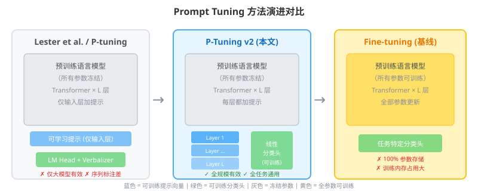

## 核心思路：这篇论文的"大招"是什么？

论文的核心发现是：**不是 Prompt Tuning 不行，而是之前的做法没优化好**。

P-Tuning v2 的最大改进来自一个简单但关键的想法：**把可学习的提示词加到模型的每一层，而不仅仅是输入层**。

这就像是：
- **之前的做法**：只在机器入口处贴一张说明贴纸，机器内部那么多层处理过程根本看不到这张贴纸
- **P-Tuning v2**：在机器的每一层处理环节都贴上对应的说明，让每一层都知道"现在要做什么任务"

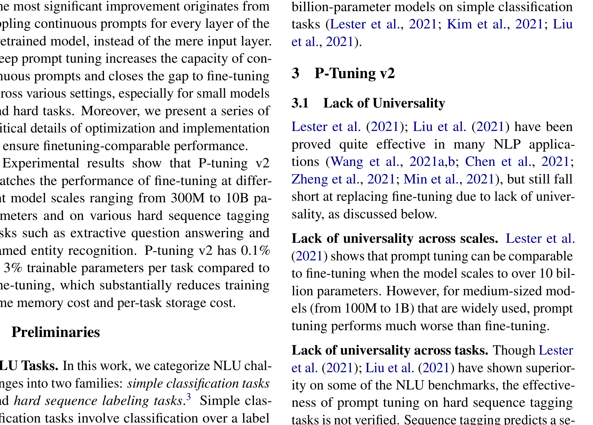

具体来说：
- **之前（图 a）**：连续提示词只加在输入嵌入层（embedding layer），可调参数很少，且对最终预测的影响比较间接
- **P-Tuning v2（图 b）**：连续提示词作为前缀（prefix）加到**每一层** Transformer 的输入上，可调参数从 0.01% 提升到 0.1%-3%，且深层的提示词对预测有更直接的影响

## 具体怎么做的？

### 3.1 Deep Prompt Tuning（深层提示调优）

P-Tuning v2 本质上是 **Deep Prompt Tuning** 的优化实现。Deep Prompt Tuning 由 Prefix-tuning（Li & Liang, 2021）和 Soft Prompts（Qin & Eisner, 2021）提出，但原本是为文本生成和知识探测设计的。

P-Tuning v2 将其改造为适用于自然语言理解（NLU）的通用方案。

**核心公式**：

设预训练语言模型有 $L$ 层 Transformer，每层的输入为 $H^{(l)}$。

传统 Prompt Tuning 只在输入层加提示：
$$H^{(0)} = [E_{\text{prompt}}; E_{\text{input}}]$$

P-Tuning v2 在每一层都加提示：
$$H^{(l)} = [P^{(l)}; \text{Transformer}^{(l)}(H^{(l-1)})], \quad l = 1, 2, ..., L$$

其中 $P^{(l)} \in \mathbb{R}^{N \times d}$ 是第 $l$ 层的可学习提示向量，$N$ 是提示长度，$d$ 是隐藏层维度。

### 3.2 四个关键优化细节

论文发现，要让 P-Tuning v2 达到微调的效果，还需要注意以下细节：

**1. 重参数化（Reparameterization）——视情况而定**

之前的工作常用 MLP（多层感知机，Multi-Layer Perceptron）或 LSTM（长短期记忆网络，Long Short-Term Memory）来编码提示向量。但论文发现：
- 对某些数据集（如 RTE、CoNLL04），MLP 有帮助
- 对另一些数据集（如 BoolQ、CoNLL12），MLP 反而有负面影响

所以 P-Tuning v2 把重参数化设为**可选**，根据任务选择。

**2. 提示长度（Prompt Length）——因任务而异**

- 简单分类任务：较短的提示（< 20 个 token）就够了
- 困难序列标注任务：需要更长的提示（约 100 个 token）

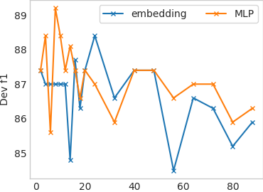
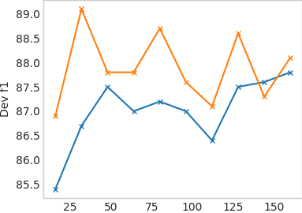

**3. 多任务学习（Multi-task Learning）——可选增强**

先用多个任务的数据联合训练共享的提示向量，再针对单个任务微调。这相当于给提示向量一个更好的"初始位置"。

**4. 分类头（Classification Head）——不用 Verbalizer**

之前的 Prompt Tuning 方法用语言模型头（LM head）预测特定词汇（verbalizer）来做分类。但 P-Tuning v2 发现：
- 在全量数据设定下，直接用一个随机初始化的线性分类头（就像 BERT 那样）就够了
- Verbalizer 与序列标注任务不兼容

### 方法在整体架构中的位置

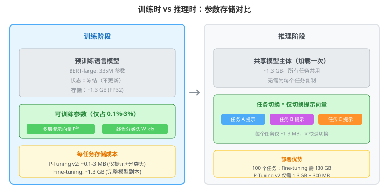

### 用一个具体例子走通全流程

#### 场景设定

假设我们用一个简化版的 Transformer 模型做情感分类：

- 隐藏层维度 $d = 4$
- 模型层数 $L = 3$（简化为 3 层）
- 提示长度 $N = 2$（每层 2 个提示 token）
- 输入句子 "Amazing movie!" 的嵌入表示为 $x \in \mathbb{R}^{4}$

**可训练参数**：每层的提示向量 $P^{(l)} \in \mathbb{R}^{2 \times 4}$，共 $3 \times 2 \times 4 = 24$ 个参数
**冻结参数**：模型的所有权重 $W^{(l)}$

初始化提示向量（简化，用 0.1 初始化）：
$$P^{(1)} = P^{(2)} = P^{(3)} = \begin{bmatrix} 0.1 & 0.1 & 0.1 & 0.1 \\ 0.1 & 0.1 & 0.1 & 0.1 \end{bmatrix}$$

每层的 Transformer 权重（冻结，假设是单位矩阵的简化形式）：
$$W^{(l)} = \begin{bmatrix} 1 & 0 & 0 & 0 \\ 0 & 0.8 & 0 & 0 \\ 0 & 0 & 0.6 & 0 \\ 0 & 0 & 0 & 0.4 \end{bmatrix}$$

分类头（随机初始化，可训练）：
$$W_{\text{cls}} = \begin{bmatrix} 0.05 & -0.05 & 0.05 & -0.05 \end{bmatrix}, \quad b_{\text{cls}} = 0$$

#### Step 1: 前向传播

**第 0 层（输入层）**：
输入嵌入 $x = [1.0, 0.8, 0.6, 0.4]^\top$

**第 1 层**：
$$H^{(0)}_{\text{transformed}} = W^{(1)} x = \begin{bmatrix} 1 & 0 & 0 & 0 \\ 0 & 0.8 & 0 & 0 \\ 0 & 0 & 0.6 & 0 \\ 0 & 0 & 0 & 0.4 \end{bmatrix} \begin{bmatrix} 1.0 \\ 0.8 \\ 0.6 \\ 0.4 \end{bmatrix} = \begin{bmatrix} 1.0 \\ 0.64 \\ 0.36 \\ 0.16 \end{bmatrix}$$

加入第 1 层提示（取两个提示的平均作为前缀影响）：
$$\bar{P}^{(1)} = \frac{1}{2}\sum_{i=1}^{2} P^{(1)}_i = [0.1, 0.1, 0.1, 0.1]$$

经过注意力机制的简化处理（提示对输出的影响系数设为 $\alpha = 0.3$）：
$$H^{(1)} = (1-\alpha) \cdot H^{(0)}_{\text{transformed}} + \alpha \cdot \bar{P}^{(1)} = 0.7 \cdot \begin{bmatrix} 1.0 \\ 0.64 \\ 0.36 \\ 0.16 \end{bmatrix} + 0.3 \cdot \begin{bmatrix} 0.1 \\ 0.1 \\ 0.1 \\ 0.1 \end{bmatrix} = \begin{bmatrix} 0.73 \\ 0.478 \\ 0.282 \\ 0.142 \end{bmatrix}$$

**第 2 层**：
$$H^{(1)}_{\text{transformed}} = W^{(2)} H^{(1)} = \begin{bmatrix} 0.73 \\ 0.382 \\ 0.169 \\ 0.057 \end{bmatrix}$$

$$H^{(2)} = 0.7 \cdot \begin{bmatrix} 0.73 \\ 0.382 \\ 0.169 \\ 0.057 \end{bmatrix} + 0.3 \cdot \begin{bmatrix} 0.1 \\ 0.1 \\ 0.1 \\ 0.1 \end{bmatrix} = \begin{bmatrix} 0.541 \\ 0.297 \\ 0.148 \\ 0.070 \end{bmatrix}$$

**第 3 层**：
$$H^{(2)}_{\text{transformed}} = W^{(3)} H^{(2)} = \begin{bmatrix} 0.541 \\ 0.238 \\ 0.089 \\ 0.028 \end{bmatrix}$$

$$H^{(3)} = 0.7 \cdot \begin{bmatrix} 0.541 \\ 0.238 \\ 0.089 \\ 0.028 \end{bmatrix} + 0.3 \cdot \begin{bmatrix} 0.1 \\ 0.1 \\ 0.1 \\ 0.1 \end{bmatrix} = \begin{bmatrix} 0.409 \\ 0.197 \\ 0.092 \\ 0.050 \end{bmatrix}$$

**分类输出**：
$$z = W_{\text{cls}} H^{(3)} + b_{\text{cls}} = \begin{bmatrix} 0.05 & -0.05 & 0.05 & -0.05 \end{bmatrix} \begin{bmatrix} 0.409 \\ 0.197 \\ 0.092 \\ 0.050 \end{bmatrix} = 0.0205 - 0.0099 + 0.0046 - 0.0025 = 0.0127$$

经过 Sigmoid 激活：
$$\hat{y} = \sigma(z) = \frac{1}{1 + e^{-0.0127}} \approx 0.503$$

模型预测"正面情感"的概率约为 50.3%，几乎是随机猜测——这很正常，因为提示向量刚初始化，还没学到任何东西。

#### Step 2: 损失计算

假设真实标签是正面（$y = 1$），使用二元交叉熵损失：

$$\mathcal{L} = -[y \log(\hat{y}) + (1-y) \log(1-\hat{y})] = -\log(0.503) \approx 0.687$$

**直白翻译**：损失值 0.687 表示模型现在几乎在瞎猜（随机猜测的损失约 0.693）。我们的目标是通过调整提示向量 $P^{(l)}$ 和分类头 $W_{\text{cls}}$，让损失降下来。

**与全参数微调的区别**：
- 全参数微调：优化目标是所有模型参数 $\theta$，$\min_\theta \mathcal{L}(\theta)$
- P-Tuning v2：优化目标只是提示向量和分类头，$\min_{P, W_{\text{cls}}} \mathcal{L}(P, W_{\text{cls}})$，模型主体 $\theta_{\text{frozen}}$ 不动

#### Step 3: 反向传播

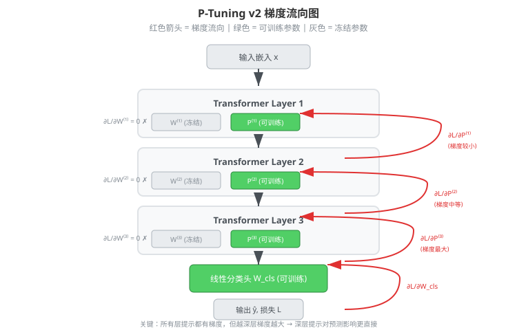

**梯度计算**（简化）：

损失对输出的梯度：
$$\frac{\partial \mathcal{L}}{\partial z} = \hat{y} - y = 0.503 - 1 = -0.497$$

损失对分类头的梯度：
$$\frac{\partial \mathcal{L}}{\partial W_{\text{cls}}} = \frac{\partial \mathcal{L}}{\partial z} \cdot H^{(3)\top} = -0.497 \cdot \begin{bmatrix} 0.409 & 0.197 & 0.092 & 0.050 \end{bmatrix} = \begin{bmatrix} -0.203 & -0.098 & -0.046 & -0.025 \end{bmatrix}$$

损失对第 3 层提示的梯度（通过链式法则）：
$$\frac{\partial \mathcal{L}}{\partial P^{(3)}} = \alpha \cdot \frac{\partial \mathcal{L}}{\partial z} \cdot W_{\text{cls}} = 0.3 \cdot (-0.497) \cdot \begin{bmatrix} 0.05 & -0.05 & 0.05 & -0.05 \end{bmatrix}$$

逐元素计算（每个提示 token 的梯度）：
$$\frac{\partial \mathcal{L}}{\partial P^{(3)}} = \begin{bmatrix} -0.0075 & 0.0075 & -0.0075 & 0.0075 \\ -0.0075 & 0.0075 & -0.0075 & 0.0075 \end{bmatrix}$$

同理，第 2 层和第 1 层的提示也有梯度（通过更长的链式传播）：
$$\frac{\partial \mathcal{L}}{\partial P^{(2)}} \approx \begin{bmatrix} -0.0053 & 0.0053 & -0.0053 & 0.0053 \\ -0.0053 & 0.0053 & -0.0053 & 0.0053 \end{bmatrix}$$

$$\frac{\partial \mathcal{L}}{\partial P^{(1)}} \approx \begin{bmatrix} -0.0037 & 0.0037 & -0.0037 & 0.0037 \\ -0.0037 & 0.0037 & -0.0037 & 0.0037 \end{bmatrix}$$

**关键观察**：
- 所有层的提示都有梯度，说明它们都能被更新
- 越靠近输出的层，梯度越大（第 3 层 > 第 2 层 > 第 1 层），这也解释了为什么在深层加提示更有效

#### Step 3.5: 参数更新与下一轮迭代

**参数更新**（以 SGD 为例，学习率 $\eta = 0.1$）：

$$\theta_{\text{new}} = \theta - \eta \cdot \frac{\partial \mathcal{L}}{\partial \theta}$$

**更新分类头**：
$$W_{\text{cls}}^{\text{new}} = \begin{bmatrix} 0.05 & -0.05 & 0.05 & -0.05 \end{bmatrix} - 0.1 \cdot \begin{bmatrix} -0.203 & -0.098 & -0.046 & -0.025 \end{bmatrix}$$
$$= \begin{bmatrix} 0.070 & -0.040 & 0.055 & -0.048 \end{bmatrix}$$

**更新第 3 层提示**：
$$P^{(3)}_{\text{new}} = \begin{bmatrix} 0.1 & 0.1 & 0.1 & 0.1 \\ 0.1 & 0.1 & 0.1 & 0.1 \end{bmatrix} - 0.1 \cdot \begin{bmatrix} -0.0075 & 0.0075 & -0.0075 & 0.0075 \\ -0.0075 & 0.0075 & -0.0075 & 0.0075 \end{bmatrix}$$
$$= \begin{bmatrix} 0.1008 & 0.0993 & 0.1008 & 0.0993 \\ 0.1008 & 0.0993 & 0.1008 & 0.0993 \end{bmatrix}$$

**更新第 2 层提示**：
$$P^{(2)}_{\text{new}} = \begin{bmatrix} 0.1005 & 0.0995 & 0.1005 & 0.0995 \\ 0.1005 & 0.0995 & 0.1005 & 0.0995 \end{bmatrix}$$

**更新第 1 层提示**：
$$P^{(1)}_{\text{new}} = \begin{bmatrix} 0.1004 & 0.0996 & 0.1004 & 0.0996 \\ 0.1004 & 0.0996 & 0.1004 & 0.0996 \end{bmatrix}$$

**通俗解释**：梯度的方向指向"让损失变大"的方向（因为梯度是上升方向），所以减去梯度就是在"让损失变小"。学习率 $\eta = 0.1$ 控制每次走多远——太大容易走过头，太小走得慢。

**第二轮前向传播**（用更新后的参数）：

用同样的输入 $x = [1.0, 0.8, 0.6, 0.4]^\top$ 重新计算。由于提示值和分类头都有微小变化，最终输出会略有不同。

简化计算（只关注变化量）：
- 分类头变化 $\Delta W_{\text{cls}} = [0.020, 0.010, 0.005, 0.002]$
- 对输出的影响：$\Delta z \approx \Delta W_{\text{cls}} \cdot H^{(3)} = 0.020 \times 0.409 + 0.010 \times 0.197 + 0.005 \times 0.092 + 0.002 \times 0.050 \approx 0.011$

新的输出：
$$z^{\text{new}} \approx 0.0127 + 0.011 = 0.0237$$
$$\hat{y}^{\text{new}} = \sigma(0.0237) \approx 0.506$$

新的损失：
$$\mathcal{L}^{\text{new}} = -\log(0.506) \approx 0.681$$

**验证训练在起作用**：

| 指标 | 第 1 轮 | 第 2 轮 | 目标 | 趋势 |
|------|--------|--------|------|------|
| 输出 $z$ | 0.0127 | 0.0237 | → +∞（正面） | ✓ 朝目标移动 |
| 预测概率 $\hat{y}$ | 0.503 | 0.506 | → 1.0 | ✓ 朝目标移动 |
| 损失 $\mathcal{L}$ | 0.687 | 0.681 | → 0 | ✓ 损失下降 |

虽然一轮的变化很小（这是正常的，学习率只有 0.1），但方向是正确的。经过成百上千轮迭代后，提示向量会逐渐调整到能有效引导模型完成任务的状态。

**多轮训练全景图**：

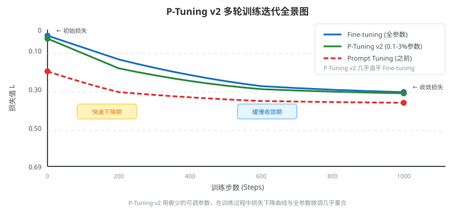

#### Step 4: 部署/推理

P-Tuning v2 在推理阶段有一个重要优势：

- **训练时**：只需要存储提示向量 $P^{(l)}$（每层 $N \times d$ 个参数）和分类头 $W_{\text{cls}}$
- **推理时**：模型主体完全不变，只需加载对应任务的提示向量

这意味着：
- 每个任务只占 **0.1%-3%** 的额外存储（相比全参数微调的 100%）
- 多个任务可以共享同一个模型主体，只需切换提示向量

> **小白tips**: 为什么深层加提示更有效？
>
> 想象你在教一个外国人做中餐。如果你只在开始告诉他"这是中餐"（输入层加提示），经过很多步骤后他可能就忘了。但如果你在每一步都提醒他"现在要炒菜了"、"现在要调味了"（每层加提示），他就能更好地完成任务。深层的提示离最终输出更近，影响更直接。

## 效果怎么样？

### 跨规模对比：从 3 亿到 100 亿参数

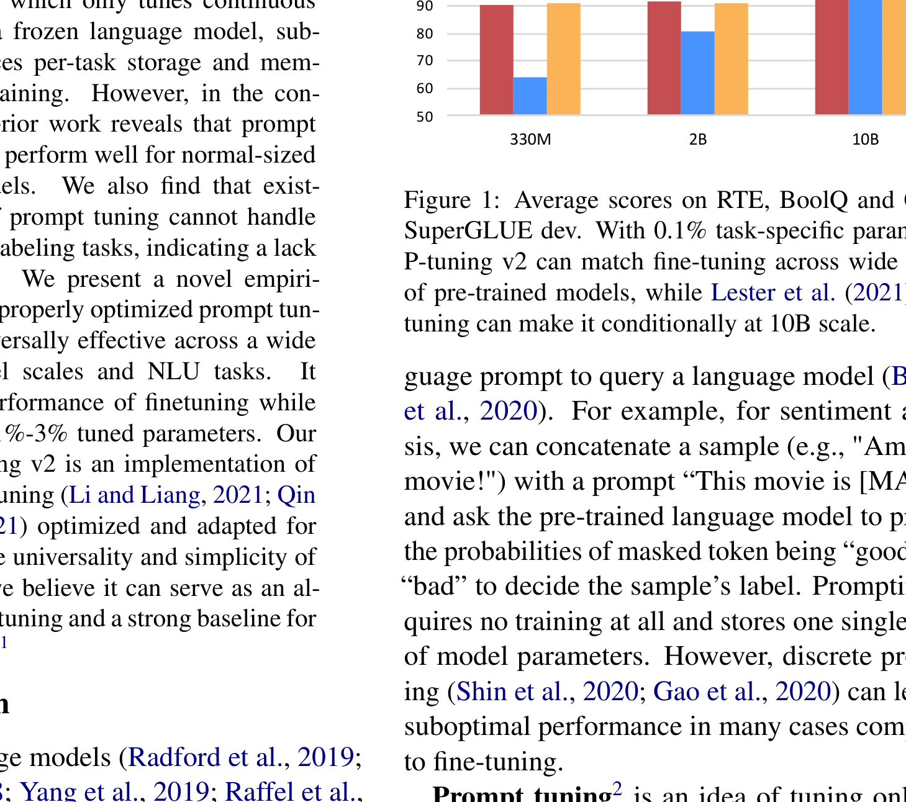

| 模型规模 | Fine-tuning | Prompt Tuning (之前) | P-Tuning v2 |
|---------|-------------|---------------------|-------------|
| BERT-large (335M) | 77.7 | 67.2 | **75.8** |
| RoBERTa-large (355M) | 86.9 | 62.3 | **84.8** |
| GLM-xlarge (2B) | 88.3 | 79.7 | **87.0** |
| GLM-xxlarge (10B) | 88.8 | 88.8 | **88.8** |

> 表格数据为 SuperGLUE 开发集上的平均得分（BoolQ、RTE、CB）。

**关键发现**：
- 在 330M-355M 的中小模型上，之前的 Prompt Tuning 比微调差 10-20 分，而 P-Tuning v2 几乎追平
- 在 10B 大模型上，两者都能达到微调水平（这与 Lester et al. 2021 的发现一致）
- P-Tuning v2 只用了 **0.1%** 的可调参数

### 跨任务对比：简单分类 vs 困难序列标注

| 任务类型 | 数据集 | Fine-tuning | Prompt Tuning | P-Tuning v2 | Multi-task P-Tuning v2 |
|---------|--------|-------------|---------------|-------------|----------------------|
| **NER** | CoNLL03 | **92.8** | 81.9 | 90.2 | **92.6** |
| **NER** | OntoNotes 5.0 | 89.2 | 74.6 | **89.8** | **89.8** |
| **QA** | SQuAD 1.1 (F1) | **91.1** | 8.5 | 88.9 | **94.6** |
| **QA** | SQuAD 2.0 (F1) | **89.4** | 50.2 | 88.0 | **91.1** |
| **SRL** | CoNLL05 WSJ | **90.2** | 76.0 | 89.2 | **91.2** |
| **SRL** | CoNLL12 | **86.5** | 67.2 | 84.6 | **87.1** |

> NER = 命名实体识别，QA = 抽取式问答，SRL = 语义角色标注。指标为 F1 分数。

**关键发现**：
- 之前的 Prompt Tuning 在序列标注任务上崩溃（SQuAD 1.1 只有 8.5 分！）
- P-Tuning v2 在所有任务上都接近微调水平
- 多任务学习（Multi-task）进一步提升了表现，在 SQuAD 1.1 上甚至**超过**了微调

### 消融实验：提示深度的影响

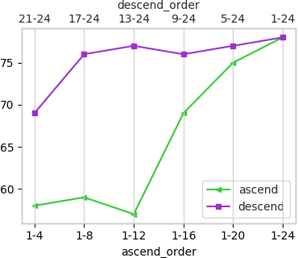
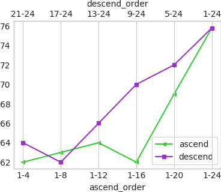

论文测试了在不同层数加提示的效果（"21-24"表示只在第 21-24 层加提示）：

- **从后往前加**（深层→浅层）总是比**从前往后加**（浅层→深层）效果好
- 在 RTE 任务上，只在最后 8 层（17-24）加提示，就能达到接近全层加提示的效果
- 这验证了"深层提示对预测影响更直接"的假设

### 消融实验：提示长度的影响

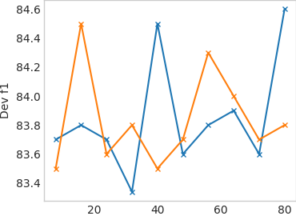

- 简单分类任务（RTE、BoolQ）：短提示（5-20）就够了
- 序列标注任务（CoNLL04、CoNLL12）：需要长提示（50-200）
- MLP 重参数化的效果因任务而异，不是万能的

## 论文的意义和局限

**主要贡献**：

1. **打破了"Prompt Tuning 只在大模型上有效"的迷思**：证明只要优化得当，中小模型也能用 Prompt Tuning 达到微调效果
2. **打破了"Prompt Tuning 做不了序列标注"的迷思**：在 NER、QA、SRL 等困难任务上都能匹敌微调
3. **提供了一个简单有效的基线方法**：P-Tuning v2 实现简单，可作为未来研究的强基线
4. **极致的参数效率**：只需 0.1%-3% 的可调参数，大幅降低存储和训练成本

**局限性**：

1. **全量数据设定**：实验在全量监督数据上进行，few-shot（少样本）场景下的表现未充分验证
2. **仅限 NLU 任务**：未覆盖文本生成（NLG）任务
3. **超参数敏感**：提示长度、是否用重参数化等需要根据任务调优，没有"一刀切"的配置
4. **概念创新有限**：本质上是 Deep Prompt Tuning 的工程优化，而非全新的方法论

## 读后感

P-Tuning v2 是一篇**"工程价值大于理论创新"**的论文。它没有提出全新的算法，而是通过系统性的实验和细致的优化，证明了 Prompt Tuning 的潜力被之前的研究低估了。

这篇论文的重要性在于：**它让 Prompt Tuning 从一个"只在大模型上好玩的玩具"变成了"可以替代微调的实用工具"**。对于实际部署多任务 NLP 系统来说，这意味着可以共享一个模型主体，每个任务只需存储几百 KB 到几 MB 的提示向量，大幅降低了运维成本。

对于初学者来说，最应该记住的是：**在深度学习中，有时候不是方法不行，而是你没调好**。系统性的消融实验和细节优化，往往能带来意想不到的效果提升。
