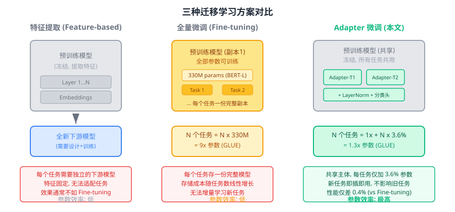
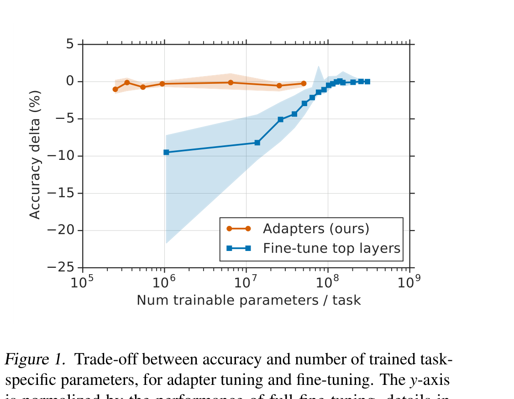
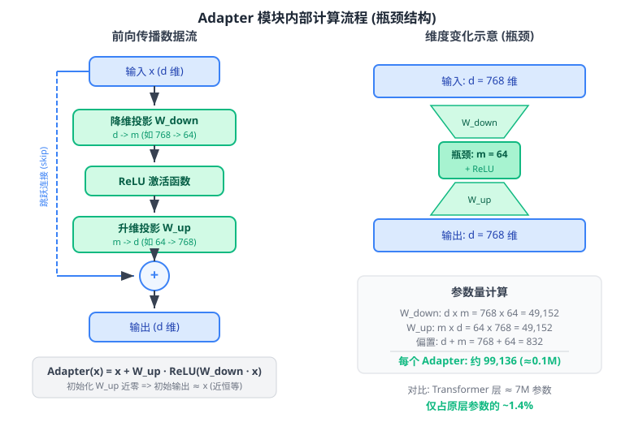
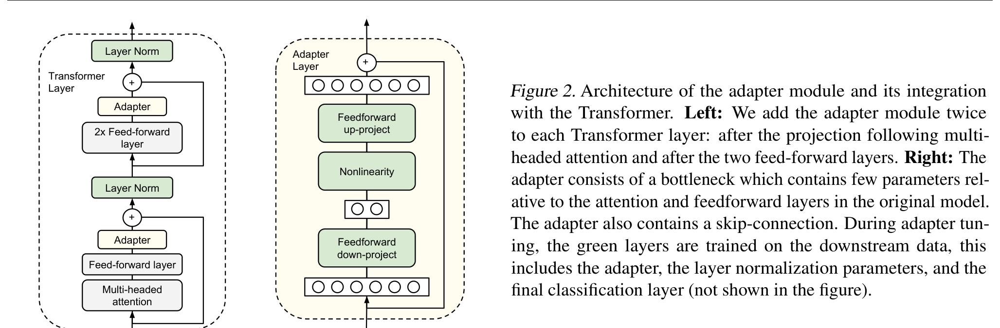
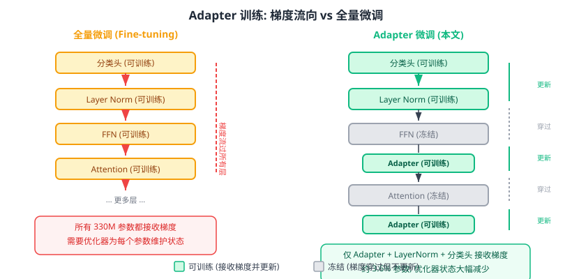
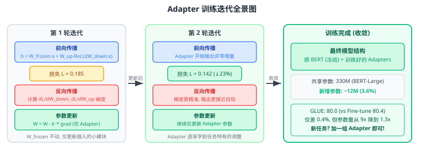
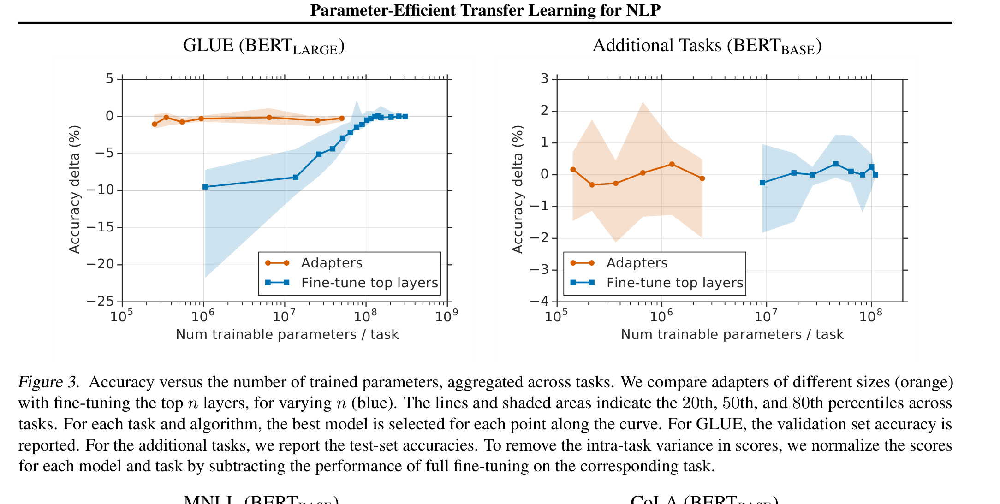
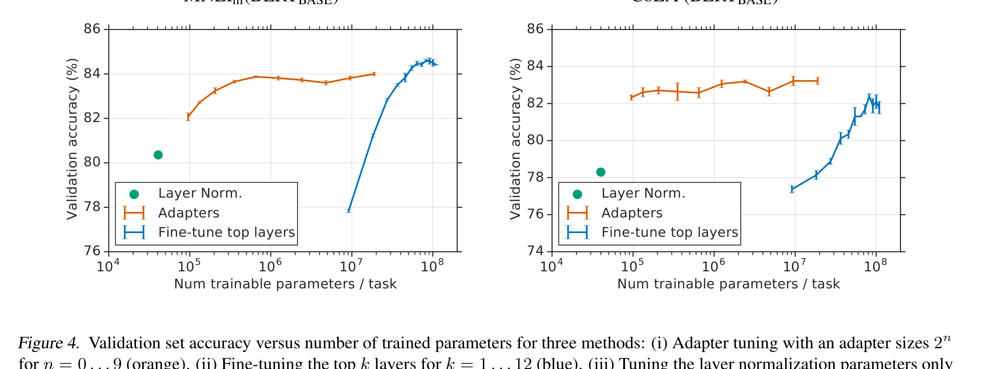

# NLP 中的参数高效迁移学习

> **原文**: Parameter-Efficient Transfer Learning for NLP
> **作者**: Neil Houlsby, Andrei Giurgiu, Stanislaw Jastrzebski, Bruna Morrone, Quentin de Laroussilhe, Andrea Gesmundo, Mona Attariyan, Sylvain Gelly (Google Research)
> **发表时间**: 2019 年 (ICML 2019)
> **arXiv**: [https://arxiv.org/abs/1902.00751](https://arxiv.org/abs/1902.00751)

---

## 一句话总结

BERT 有 3.3 亿参数，以前每换一个新任务就得复制并微调一份完整模型。本文提出了 **Adapter 模块**——在冻结的预训练模型中"插入"极小的瓶颈层，每个任务只需额外训练 3.6% 的参数，效果就能追平全量微调。

## 研究背景：为什么要做这个？

2018 年底，BERT 横空出世，在各种 NLP 任务上刷新记录。大家的标准做法是：拿一个预训练好的 BERT，然后把**整个模型的全部参数**都拿来针对下游任务微调（Fine-tuning）。

这种"全量微调"的思路虽然效果好，但有一个很现实的问题：**每个任务都需要一份完整模型**。

打个比方：你手里有一本特别厉害的百科全书（BERT），现在你想让它专门回答医疗问题、法律问题、金融问题……全量微调就像是**每换一个领域，就把这本 3.3 亿字的百科全书手抄一遍，然后在副本上做修改**。如果你有 26 个领域，就需要存 26 份 BERT——这要花 9 倍的存储空间！

在云服务场景下，问题更加突出：客户不断提交新任务，每个任务都要一份完整模型，存储和部署成本线性增长。

### 现有方案的问题

当时主流有两条路：

1. **特征提取（Feature-based）**：冻结预训练模型，把它当"特征抽取器"，在后面接一个新模型来做任务。问题是特征是固定的，无法为新任务做适配，效果往往不如微调。
2. **全量微调（Fine-tuning）**：把预训练模型的所有参数都拿来训练。效果最好，但每个任务都要存一份完整模型，既浪费存储又不支持增量添加新任务。

**关键矛盾**：效果好的方案（全量微调）太浪费参数；省参数的方案（特征提取）效果又不够好。能不能两全其美？

## 核心思路：这篇论文的"大招"是什么？

本文提出了一个巧妙的折中方案——**Adapter 模块**。核心思想是：

> **冻结预训练模型的全部参数，只在每一层中"插入"一个极小的瓶颈模块，只训练这些新加的小模块。**

你可以把它想象成这样：百科全书不用抄，每换一个领域时，你只需要在每一页的空白处**贴一张小便签纸**，写上这个领域特有的补充说明。整本书的正文一字不改，所有领域共用同一本书，只是便签不同。每张便签很小（3.6% 的参数），但效果却出奇地好。

这个方案有三个关键性质：

1. **高性能**：在 GLUE 基准上仅比全量微调低 0.4%
2. **可扩展**：新任务即插即用，不影响已有任务
3. **参数高效**：26 个 GLUE 任务只需 1.3 倍参数（vs 全量微调的 9 倍）

上图清楚地展示了 Adapter 的优势：橙色线（Adapter）在仅用 $10^5$ 量级参数时就达到了接近全量微调（蓝色线最右端）的效果，而蓝色线（微调顶层）在同样参数量时性能下降了 10% 以上。**Adapter 用少两个数量级的参数就追平了全量微调。**

## 具体怎么做的？

### Adapter 模块的瓶颈结构

Adapter 的核心是一个**瓶颈架构**（Bottleneck Architecture）：

1. **降维投影**：把 $d$ 维的输入压缩到 $m$ 维（$m \ll d$），比如从 768 维压到 64 维
2. **非线性激活**：通过 ReLU 引入非线性
3. **升维投影**：再从 $m$ 维映射回 $d$ 维
4. **跳跃连接**：把输入直接加到输出上

用公式表达：

$$
\text{Adapter}(x) = x + W_{up} \cdot \text{ReLU}(W_{down} \cdot x)
$$

其中 $W_{down} \in \mathbb{R}^{m \times d}$ 是降维矩阵，$W_{up} \in \mathbb{R}^{d \times m}$ 是升维矩阵。

这里有两个精妙的设计：

**为什么用瓶颈？** 因为 $m \ll d$，参数量从 $d^2$ 级别降到了 $2md + d + m$ 级别。以 BERT-Base（$d=768$）为例，如果瓶颈维度 $m=64$，每个 Adapter 只有约 10 万参数——相比一个 Transformer 层 700 万参数，仅占 1.4%。

**为什么要跳跃连接？** 因为如果把 $W_{up}$ 初始化为接近零的值，那么 $\text{Adapter}(x) \approx x + 0 = x$，模块的初始行为就是一个**恒等函数**——不改变原模型的输出。这保证了训练刚开始时模型和预训练模型一模一样，训练稳定性有保障。随着训练进行，Adapter 逐渐学会为特定任务做出微调。

### Adapter 在 Transformer 中的位置

每个 Transformer 层包含两个子层：自注意力层（Self-Attention）和前馈网络层（FFN）。论文在**每个子层之后、跳跃连接和 Layer Normalization 之前**，各插入一个 Adapter 模块。也就是说，每个 Transformer 层插入 **2 个 Adapter**。

上图的左半部分展示了 Adapter（绿色模块）在 Transformer 层中的位置，右半部分展示了 Adapter 内部的瓶颈结构。训练时，绿色部分（Adapter + Layer Normalization + 分类头）是可训练的，其余所有参数冻结不动。

除了 Adapter 本身，论文还为每个任务训练**新的 Layer Normalization 参数**。这是一种类似于条件批归一化（Conditional Batch Normalization）的技巧，每层只增加 $2d$ 个参数，但对性能有帮助。不过单独只训练 Layer Norm 是不够的——实验表明这样性能会下降 3.5%-4%。

### 用一个具体例子走通全流程

#### 场景设定

为了让数字好算，我们把模型极度简化：

- 预训练模型维度 $d = 4$
- Adapter 瓶颈维度 $m = 2$
- 预训练权重 $W_{\text{frozen}} \in \mathbb{R}^{4 \times 4}$：冻结，不更新
- Adapter 降维矩阵 $W_{down} \in \mathbb{R}^{2 \times 4}$：可训练
- Adapter 升维矩阵 $W_{up} \in \mathbb{R}^{4 \times 2}$：可训练，初始化为接近零

$$W_{\text{frozen}} = \begin{bmatrix} 0.5 & 0.1 & -0.2 & 0.3 \\ 0.2 & 0.4 & 0.1 & -0.1 \\ -0.1 & 0.3 & 0.6 & 0.2 \\ 0.3 & -0.2 & 0.1 & 0.5 \end{bmatrix}$$

$$W_{down} = \begin{bmatrix} 0.1 & -0.2 & 0.3 & 0.0 \\ 0.2 & 0.1 & -0.1 & 0.4 \end{bmatrix}, \quad W_{up} = \begin{bmatrix} 0 & 0 \\ 0 & 0 \\ 0 & 0 \\ 0 & 0 \end{bmatrix}$$

$W_{up}$ 初始化为零，保证训练开始时 Adapter 是恒等映射。

#### Step 1: 前向传播

输入向量 $x = \begin{bmatrix} 1 \\ 0 \\ -1 \\ 2 \end{bmatrix}$

**路径 1 — 冻结的预训练层**：

$$h_{\text{frozen}} = W_{\text{frozen}} \cdot x = \begin{bmatrix} 0.5 \times 1 + 0.1 \times 0 + (-0.2) \times (-1) + 0.3 \times 2 \\ 0.2 \times 1 + 0.4 \times 0 + 0.1 \times (-1) + (-0.1) \times 2 \\ -0.1 \times 1 + 0.3 \times 0 + 0.6 \times (-1) + 0.2 \times 2 \\ 0.3 \times 1 + (-0.2) \times 0 + 0.1 \times (-1) + 0.5 \times 2 \end{bmatrix} = \begin{bmatrix} 1.3 \\ -0.1 \\ -0.3 \\ 1.2 \end{bmatrix}$$

**路径 2 — Adapter 旁路**：

先降维 ($4 \to 2$)：

$$W_{down} \cdot h_{\text{frozen}} = \begin{bmatrix} 0.1 \times 1.3 + (-0.2) \times (-0.1) + 0.3 \times (-0.3) + 0.0 \times 1.2 \\ 0.2 \times 1.3 + 0.1 \times (-0.1) + (-0.1) \times (-0.3) + 0.4 \times 1.2 \end{bmatrix} = \begin{bmatrix} 0.06 \\ 0.76 \end{bmatrix}$$

ReLU 激活（正数不变，负数变零）：

$$\text{ReLU}\left(\begin{bmatrix} 0.06 \\ 0.76 \end{bmatrix}\right) = \begin{bmatrix} 0.06 \\ 0.76 \end{bmatrix}$$

再升维 ($2 \to 4$)：

$$W_{up} \cdot \begin{bmatrix} 0.06 \\ 0.76 \end{bmatrix} = \begin{bmatrix} 0 \\ 0 \\ 0 \\ 0 \end{bmatrix}$$

因为 $W_{up}$ 初始化为零，所以 **Adapter 第一步输出为零**——不改变原模型行为。

**最终输出**（跳跃连接：原输出 + Adapter 输出）：

$$h = h_{\text{frozen}} + \mathbf{0} = \begin{bmatrix} 1.3 \\ -0.1 \\ -0.3 \\ 1.2 \end{bmatrix}$$

#### Step 2: 损失计算

假设目标输出 $y = \begin{bmatrix} 1.0 \\ 0.5 \\ 0.0 \\ 1.0 \end{bmatrix}$，使用均方误差（MSE）损失：

$$\mathcal{L} = \frac{1}{2}\|h - y\|^2 = \frac{1}{2}\left[(1.3-1.0)^2 + (-0.1-0.5)^2 + (-0.3-0.0)^2 + (1.2-1.0)^2\right]$$

$$= \frac{1}{2}(0.09 + 0.36 + 0.09 + 0.04) = 0.29$$

对比全量微调和 Adapter 微调的优化目标：

| | 全量微调 | Adapter 微调 |
|---|---|---|
| 可训练参数 | 全部 $W_{\text{frozen}}$（330M） | 仅 $W_{down}, W_{up}$（约 12M） |
| 优化器状态 | 为所有参数维护 Adam 动量/方差 | 仅为 Adapter 参数维护 |
| 存储 (N 个任务) | N 份完整模型 | 1 份模型 + N 份 Adapter |

#### Step 3: 反向传播

损失对输出的梯度：

$$\frac{\partial \mathcal{L}}{\partial h} = h - y = \begin{bmatrix} 0.3 \\ -0.6 \\ -0.3 \\ 0.2 \end{bmatrix}$$

**关键**：梯度会流经冻结层（用于计算 Adapter 输入的梯度），但**冻结层的参数不更新**。梯度最终只更新 $W_{up}$ 和 $W_{down}$。

**计算 $W_{up}$ 的梯度**：

由链式法则，$\frac{\partial \mathcal{L}}{\partial W_{up}} = \frac{\partial \mathcal{L}}{\partial h} \cdot \text{ReLU}(W_{down} \cdot h_{\text{frozen}})^T$：

$$\frac{\partial \mathcal{L}}{\partial W_{up}} = \begin{bmatrix} 0.3 \\ -0.6 \\ -0.3 \\ 0.2 \end{bmatrix} \begin{bmatrix} 0.06 & 0.76 \end{bmatrix} = \begin{bmatrix} 0.018 & 0.228 \\ -0.036 & -0.456 \\ -0.018 & -0.228 \\ 0.012 & 0.152 \end{bmatrix}$$

**计算 $W_{down}$ 的梯度**：

由于当前 $W_{up} = \mathbf{0}$，所以 $\frac{\partial \mathcal{L}}{\partial W_{down}} = W_{up}^T \cdot \frac{\partial \mathcal{L}}{\partial h} \cdot \ldots = \mathbf{0}$。

**第一步只有 $W_{up}$ 被更新，$W_{down}$ 暂时不动**——这和 LoRA 中"B 初始化为零导致 A 首轮无梯度"的现象异曲同工。

#### Step 3.5: 参数更新与下一轮迭代

**参数更新**（以 SGD 为例，学习率 $\eta = 0.1$）：

$$W_{up}^{\text{new}} = W_{up} - \eta \cdot \frac{\partial \mathcal{L}}{\partial W_{up}} = \begin{bmatrix} 0 & 0 \\ 0 & 0 \\ 0 & 0 \\ 0 & 0 \end{bmatrix} - 0.1 \times \begin{bmatrix} 0.018 & 0.228 \\ -0.036 & -0.456 \\ -0.018 & -0.228 \\ 0.012 & 0.152 \end{bmatrix} = \begin{bmatrix} -0.0018 & -0.0228 \\ 0.0036 & 0.0456 \\ 0.0018 & 0.0228 \\ -0.0012 & -0.0152 \end{bmatrix}$$

$$W_{down}^{\text{new}} = W_{down} \quad \text{（不变）}$$

**第二轮前向传播**（用更新后的参数，同一个输入 $x$）：

冻结层输出 $h_{\text{frozen}}$ 不变，仍为 $\begin{bmatrix} 1.3, -0.1, -0.3, 1.2 \end{bmatrix}^T$。

降维 + ReLU 结果不变：$\begin{bmatrix} 0.06, 0.76 \end{bmatrix}^T$。

但升维结果变了（$W_{up}$ 不再为零了！）：

$$W_{up}^{\text{new}} \cdot \begin{bmatrix} 0.06 \\ 0.76 \end{bmatrix} = \begin{bmatrix} -0.0018 \times 0.06 + (-0.0228) \times 0.76 \\ 0.0036 \times 0.06 + 0.0456 \times 0.76 \\ 0.0018 \times 0.06 + 0.0228 \times 0.76 \\ -0.0012 \times 0.06 + (-0.0152) \times 0.76 \end{bmatrix} = \begin{bmatrix} -0.0174 \\ 0.0349 \\ 0.0174 \\ -0.0116 \end{bmatrix}$$

**第二轮最终输出**（跳跃连接）：

$$h^{\text{new}} = h_{\text{frozen}} + \text{Adapter output} = \begin{bmatrix} 1.3 \\ -0.1 \\ -0.3 \\ 1.2 \end{bmatrix} + \begin{bmatrix} -0.0174 \\ 0.0349 \\ 0.0174 \\ -0.0116 \end{bmatrix} = \begin{bmatrix} 1.2826 \\ -0.0651 \\ -0.2826 \\ 1.1884 \end{bmatrix}$$

**验证训练在起作用**：

| 分量 | 第 1 轮输出 | 第 2 轮输出 | 目标值 | 趋势 |
|------|-----------|-----------|-------|------|
| $h_1$ | 1.300 | 1.2826 | 1.0 | 更近了 |
| $h_2$ | -0.100 | -0.0651 | 0.5 | 更近了 |
| $h_3$ | -0.300 | -0.2826 | 0.0 | 更近了 |
| $h_4$ | 1.200 | 1.1884 | 1.0 | 更近了 |

**损失也确实下降了**：

$$\mathcal{L}^{\text{new}} = \frac{1}{2}\left[(1.2826-1.0)^2 + (-0.0651-0.5)^2 + (-0.2826-0.0)^2 + (1.1884-1.0)^2\right]$$

$$= \frac{1}{2}(0.0799 + 0.3193 + 0.0799 + 0.0355) = 0.2573$$

对比第一轮 $\mathcal{L} = 0.29$，损失从 **0.29 降到了 0.2573**，下降了约 11.3%。

**关键转折**：从第二轮开始，$W_{up}$ 不再为零，$\frac{\partial \mathcal{L}}{\partial W_{down}}$ 也不再为零了。两个矩阵都会同时更新，Adapter 进入全面学习状态。

#### Step 4: 部署/推理

Adapter 方法在部署时的一大优势是**模型共享**：

- **共享部分**：预训练 BERT 的所有参数只需在 GPU 上加载一次
- **切换任务**：只需替换对应任务的 Adapter 参数（约 3.6% 的参数量）
- **添加新任务**：冻结一切，只训练新的 Adapter，已有任务完全不受影响

与 LoRA 不同的是，Adapter **不能**在推理时把参数合并到原模型中（因为中间有非线性 ReLU），所以会有少量额外的推理计算开销。但由于 Adapter 很小，这个开销在实践中几乎可以忽略。

> **小白tips**: Adapter 就像给每本教科书配一套薄薄的"补充资料"。上课时（推理），你先看课本（冻结的 BERT），再看补充资料（Adapter 的微调）。不同科目（任务）用不同的补充资料，但课本只有一本。新学期加一门课？只需要多印一份补充资料，完全不用重印课本。

## 效果怎么样？

### GLUE 基准测试

论文在 GLUE 基准的 8 个任务上进行了测试，使用 BERT-Large（330M 参数）：

| 方法 | 总参数量 | 每任务训练参数 | GLUE 总分 |
|------|---------|-------------|----------|
| BERT-Large 全量微调 | 9.0x | 100% | **80.4** |
| **Adapter (8-256)** | **1.3x** | **3.6%** | **80.0** |
| Adapter (64) | 1.2x | 2.1% | 79.6 |

Adapter 仅用 3.6% 的可训练参数，就达到了全量微调 80.4 分中的 80.0 分——仅差 0.4 个百分点！而总模型大小从 9 倍 BERT 降到了仅 1.3 倍。

### 17 个额外分类任务

在 17 个公开文本分类任务上，使用 BERT-Base：

| 方法 | 总参数量 | 每任务训练参数 | 平均准确率 |
|------|---------|-------------|----------|
| No BERT baseline | — | — | 72.7% |
| BERT 全量微调 | 17x | 100% | 73.7% |
| BERT 变长微调 (top-n) | 9.9x | 52.9% | 74.0% |
| **BERT + Adapter** | **1.19x** | **1.14%** | **73.3%** |

Adapter 仅用 1.14% 的新参数，就将 17 个任务的总参数量从 17 倍压缩到了 1.19 倍，同时平均准确率仅比全量微调低 0.4%。

### 参数效率的详细对比

上图展示了更完整的参数效率对比。橙色线（Adapter）在所有参数量水平上都大幅优于蓝色线（微调 top-k 层）。特别是在参数量很少时（$10^5$-$10^6$），Adapter 几乎不掉性能，而 top-k 层微调的性能急剧下降。

在 MNLIm 任务上，微调顶层（约 9M 参数）只能达到 77.8% 准确率；而 Adapter（约 2M 参数）就能达到 83.7%——参数更少，效果反而好 6 个百分点。全量微调是 84.4%。

### SQuAD 问答任务

Adapter 在 SQuAD v1.1 抽取式问答任务上同样出色：

| 方法 | 参数量占比 | F1 分数 |
|------|----------|--------|
| 全量微调 | 100% | 90.7 |
| Adapter (size 64) | 2% | 90.4 |
| Adapter (size 2) | 0.1% | 89.9 |

即使只用 0.1% 的参数（Adapter size = 2），F1 也能达到 89.9——仅比全量微调低 0.8 个点。

### 关键消融实验

**高层 Adapter 更重要**：论文做了一个有趣的消融实验——逐层移除 Adapter 后观察性能变化。结果发现：

- 移除底层（0-4 层）的 Adapter，性能几乎不变
- 移除所有 Adapter，性能断崖式下降（MNLI 从 84% 降到 37%，退化为多数类预测）
- 单独移除任何一层的 Adapter，最多只掉 2%

这说明 Adapter **自动学会了"重视高层、忽略底层"**的策略——与手动微调顶层的直觉一致，但全自动实现，且效果更好。

**初始化要小**：Adapter 权重的初始化标准差在 $10^{-7}$ 到 $10^{-2}$ 之间性能都很稳定，但如果初始化太大（接近 1），模型会训练失败。这验证了"近恒等初始化"的必要性。

**瓶颈维度的鲁棒性**：adapter size 在 8 到 256 之间变化时，性能差异很小（86.2% vs 85.7%），说明一个固定的中等大小（如 64）就能在大多数任务上取得好效果。

## 论文的意义和局限

**主要贡献**：

1. **提出了 Adapter 范式**：在冻结预训练模型中插入小型可训练模块，开创了"参数高效微调"（Parameter-Efficient Fine-Tuning, PEFT）这一研究方向。这个范式直接启发了后来的 LoRA、Prefix Tuning、Prompt Tuning 等一系列工作。
2. **极致的参数效率**：仅用 3.6% 的新参数就能追平全量微调，证明了预训练模型中蕴含了足够的通用知识，只需极少的调整就能适配新任务。
3. **可扩展的多任务架构**：所有任务共享同一个冻结的主干模型，新任务只需添加 Adapter，不影响已有任务——这对云服务等需要持续接入新任务的场景非常实用。

**局限性**：

- Adapter 在推理时会引入额外的前向计算（虽然很小），无法像 LoRA 那样合并到原始权重中实现零额外推理开销。
- 论文主要在 BERT（编码器模型）上验证，对于生成式模型（如 GPT）的效果未做深入探索。
- Adapter 的瓶颈维度需要手动选择，虽然对这个超参数比较鲁棒，但理论上缺乏最优维度的指导。

## 读后感

这篇论文的重要性在于它提出了一个简洁而有效的问题框架：**我们能否在几乎不增加参数的前提下，让预训练模型适配新任务？** 答案是肯定的，而且方法出奇地简单——一个瓶颈 MLP 加一个跳跃连接就够了。

从 2019 年发表至今，Adapter 论文已被引用数千次，直接催生了"参数高效微调"这一热门研究领域。后来的 LoRA（2021）可以看作 Adapter 思想的"极简进化版"——去掉了非线性激活和跳跃连接，用纯线性低秩分解实现了推理时零额外开销。

如果你刚入门大模型微调，最应该记住的是这篇论文的核心洞察：**预训练模型已经学到了足够丰富的通用表示，适配新任务并不需要改动所有参数——在关键位置插入少量新参数，就能"四两拨千斤"。** 这个思想贯穿了 Adapter、LoRA、Prefix Tuning 等所有 PEFT 方法。
