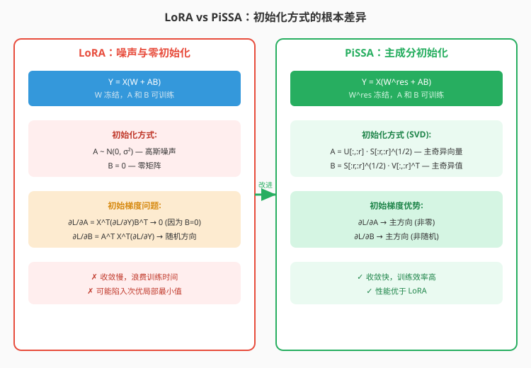
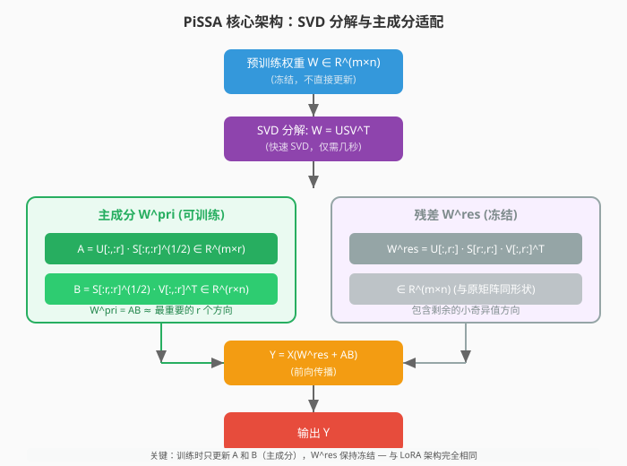
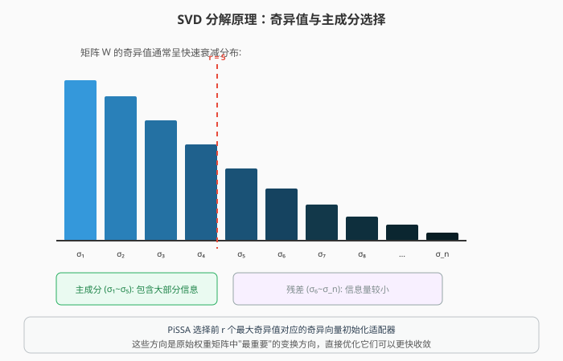
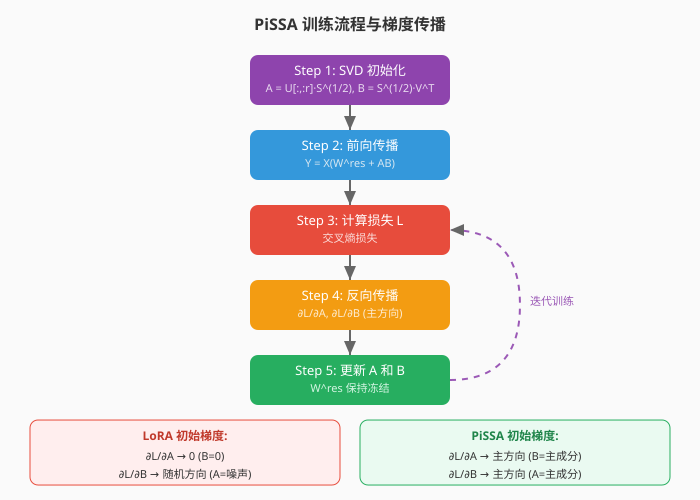
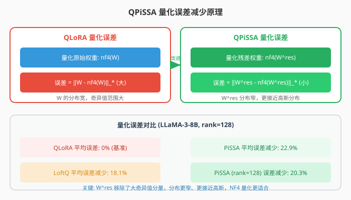
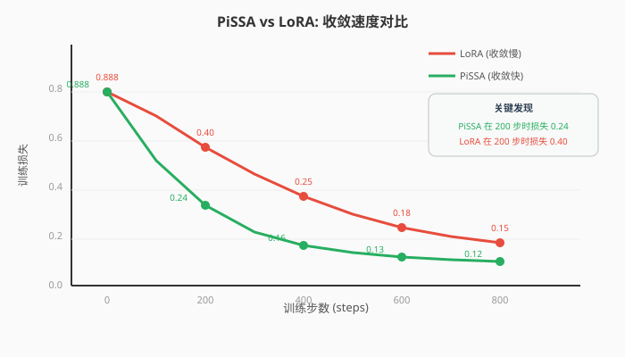
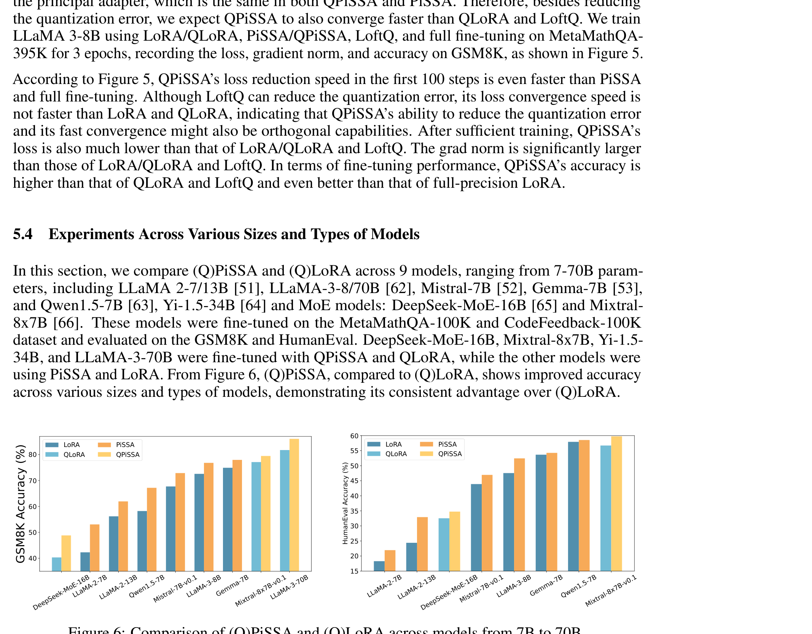

# PiSSA：基于主奇异值和奇异向量适配的大语言模型微调

> **原文**: PiSSA: Principal Singular Values and Singular Vectors Adaptation of Large Language Models
> **作者**: Fanxu Meng, Zhaohui Wang, Muhan Zhang
> **发表时间**: 2024年4月
> **arXiv**: https://arxiv.org/abs/2404.02948

---

## 一句话总结

这篇论文提出了一种**用 SVD 主成分初始化 LoRA 适配器**的方法（PiSSA），让模型从训练第一步就沿着"最重要的方向"优化，**收敛更快、性能更好**，在 GSM8K 上比 LoRA 高 5%+，且与量化兼容（QPiSSA）。

## 研究背景：为什么要做这个？

### LoRA 的初始化问题

LoRA 通过在大模型旁边加一对低秩矩阵 $A$ 和 $B$ 来微调，架构简单有效。但它的**初始化方式有严重缺陷**：

**LoRA 的初始化**：
- $A$：高斯噪声随机初始化 $A \sim \mathcal{N}(0, \sigma^2)$
- $B$：零矩阵初始化 $B = 0$

这意味着训练开始时 $AB = 0$，适配器对模型输出**没有任何影响**。

**更严重的是梯度问题**：

LoRA 的梯度公式为：
$$\frac{\partial \mathcal{L}}{\partial A} = X^T \frac{\partial \mathcal{L}}{\partial Y} B^T$$
$$\frac{\partial \mathcal{L}}{\partial B} = A^T X^T \frac{\partial \mathcal{L}}{\partial Y}$$

由于 $B = 0$：
- **$A$ 的初始梯度为零**（因为 $B^T = 0$）
- **$B$ 的初始梯度是随机方向**（因为 $A$ 是随机噪声）

这导致 LoRA 在训练初期**浪费大量时间**在初始点附近徘徊，梯度既小又没有信息量，可能收敛到次优的局部最小值。

### PiSSA 的核心洞察

PiSSA 的作者提出了一个关键洞察：

**LoRA 的目标是近似模型变化 $\Delta W$，但为什么不直接近似原始权重 $W$ 本身呢？**

如果对 $W$ 做 SVD 分解，取最大的几个奇异值对应的奇异向量来初始化适配器，那么：
- 适配器从一开始就包含了模型**最重要的变换方向**
- 梯度直接指向**有意义的方向**（而非零或随机）
- 模型可以**快速收敛**到更好的解



## 核心思路：这篇论文的"大招"是什么？

PiSSA 的核心想法非常优雅：

**对预训练权重 $W$ 做 SVD 分解，用最大的 $r$ 个奇异值对应的奇异向量初始化 LoRA 适配器，剩余部分作为冻结的残差矩阵。**

具体来说：
1. 对 $W$ 做 SVD：$W = USV^T$
2. 取前 $r$ 个主成分初始化 $A$ 和 $B$
3. 剩余成分组成残差矩阵 $W^{\text{res}}$（冻结）
4. 前向传播：$Y = X(W^{\text{res}} + AB)$

这就像是从一块披萨上切下最丰富的那一片来专门优化，而不是从随机位置开始切。



## 具体怎么做的？

### 1. SVD 分解

对预训练权重矩阵 $W \in \mathbb{R}^{m \times n}$ 做经济型 SVD：

$$W = USV^T$$

其中：
- $U \in \mathbb{R}^{m \times \min(m,n)}$：左奇异向量，列正交
- $V \in \mathbb{R}^{n \times \min(m,n)}$：右奇异向量，列正交
- $S = \text{diag}(s) \in \mathbb{R}^{\min(m,n) \times \min(m,n)}$：奇异值矩阵，$s$ 按降序排列



### 2. 划分主成分和残差

将 SVD 结果划分为两部分：

**主成分**（前 $r$ 个奇异值）：
$$\{U[:, :r], S[:r, :r], V[:, :r]\}$$

**残差成分**（剩余奇异值）：
$$\{U[:, r:], S[r:, r:], V[:, r:]\}$$

### 3. PiSSA 初始化

**矩阵 $A$（公式 2）**：
$$A = U[:, :r] \cdot S[:r, :r]^{1/2} \in \mathbb{R}^{m \times r}$$

**矩阵 $B$（公式 3）**：
$$B = S[:r, :r]^{1/2} \cdot V[:, :r]^T \in \mathbb{R}^{r \times n}$$

**残差矩阵 $W^{\text{res}}$（公式 4，冻结）**：
$$W^{\text{res}} = U[:, r:] \cdot S[r:, r:] \cdot V[:, r:]^T \in \mathbb{R}^{m \times n}$$

**关键验证**：
$$W^{\text{res}} + AB = U[:, r:] S[r:, r:] V[:, r:]^T + U[:, :r] S[:r, :r]^{1/2} \cdot S[:r, :r]^{1/2} V[:, :r]^T$$
$$= U[:, r:] S[r:, r:] V[:, r:]^T + U[:, :r] S[:r, :r] V[:, :r]^T$$
$$= USV^T = W$$

所以训练开始时，PiSSA **完全保留了预训练模型的能力**！

### 4. 前向传播（公式 5）

$$Y = XW = X(W^{\text{res}} + W^{\text{pri}}) = X(W^{\text{res}} + AB)$$

这与 LoRA 的公式 $Y = X(W + AB)$ 形式相同，但含义不同：
- LoRA：$W$ 是完整的预训练权重（冻结），$AB$ 从零开始学习变化
- PiSSA：$W^{\text{res}}$ 是残差（冻结），$AB$ 从主成分开始优化

### 5. 梯度分析

PiSSA 的梯度形式与 LoRA 相同：
$$\frac{\partial \mathcal{L}}{\partial A} = X^T \frac{\partial \mathcal{L}}{\partial Y} B^T$$
$$\frac{\partial \mathcal{L}}{\partial B} = A^T X^T \frac{\partial \mathcal{L}}{\partial Y}$$

但**初始值完全不同**：
- $A$ 和 $B$ 都包含主奇异向量，不是零或噪声
- 梯度指向**主方向**（principal direction），而非零或随机
- 因为 $s[:r] \gg s[r:]$，可训练的适配器 $W^{\text{pri}} = AB$ 包含了 $W$ 最重要的方向



### 6. LoRA vs PiSSA 对比总结

| 方面 | LoRA | PiSSA |
|------|------|-------|
| **前向传播** | $Y = X(W + \underline{AB})$ | $Y = X(\underline{W}^{\text{res}} + AB)$ |
| **A 初始化** | $\underline{A} \sim \mathcal{N}(0, \sigma^2)$ | **A** = $U[:, :r] \cdot S[:r, :r]^{1/2}$ |
| **B 初始化** | $\underline{B} = 0$ | **B** = $S[:r, :r]^{1/2} \cdot V[:, :r]^T$ |
| **冻结部分** | $W$ | $\underline{W}^{\text{res}} = U[:, \underline{r:}] \cdot S[\underline{r:}, \underline{r:}] \cdot V[:, \underline{r:}]^T$ |
| **∂L/∂A** | → $\underline{0}$ | → **主方向** |
| **∂L/∂B** | → 随机方向 | → **主方向** |
| **收敛速度** | 慢，性能次优 | 快，性能更好 |
| **量化兼容** | QLoRA 无法减少误差 | QPiSSA 可减少误差 ~20% |

### 7. QPiSSA：量化扩展

PiSSA 与量化天然兼容，而且**量化误差更小**。

**QLoRA 的量化误差（公式 6）**：
$$\text{Error}_{\text{QLoRA}} = \|W - (\text{nf4}(W) + AB)\|_* = \|W - \text{nf4}(W)\|_*$$

其中 $\|M\|_*$ 是核范数（trace norm）：
$$\|M\|_* = \text{trace}(\sqrt{M^* M}) = \sum_{i=1}^{\min(m,n)} \sigma_i(M)$$

QLoRA 的量化误差等于**直接量化基座模型**——没有减少。

**QPiSSA 的量化误差（公式 8）**：
$$\text{Error}_{\text{QPiSSA}} = \|W - (\text{nf4}(W^{\text{res}}) + AB)\|_* = \|W^{\text{res}} - \text{nf4}(W^{\text{res}})\|_*$$

为什么 QPiSSA 误差更小？
- $W^{\text{res}}$ 移除了大奇异值分量
- $W^{\text{res}}$ 的分布**更窄**
- $W^{\text{res}}$ 更接近**高斯分布**（NF4 量化最适合高斯分布）
- $W^{\text{res}}$ 的标准差更小



**多迭代量化（Algorithm 1）**：

为了进一步减少量化误差，QPiSSA 支持多迭代优化：

```
输入: 预训练权重 W, 目标秩 r, nf4(·), 迭代步数 T
1: 初始化 A₀, B₀ ← SVD(W)
2: 初始化 W_res ← W - A₀B₀^T
3: for t = 2 to T do
4:   更新 A_t, B_t ← SVD(W - nf4(W_res))
5:   更新 W_res ← W - A_{t-1}B_{t-1}^T
6: end for
7: 输出: nf4(W_res), A_T, B_T
```

### 用一个具体例子走通全流程

让我们用一个极简的例子，手把手走通 PiSSA 的完整流程。

#### 场景设定

假设我们有一个极小的预训练权重矩阵：
$$W = \begin{bmatrix} 3.0 & 1.0 & 0.5 \\ 1.0 & 2.0 & 0.3 \\ 0.5 & 0.3 & 1.0 \end{bmatrix} \in \mathbb{R}^{3 \times 3}$$

目标秩：$r = 2$

#### Step 1: SVD 分解

对 $W$ 做 SVD（简化计算，实际用数值库）：

$$W = USV^T$$

假设奇异值为：$s = [3.8, 1.5, 0.7]$

对应的奇异向量（简化）：
$$U = \begin{bmatrix} 0.8 & -0.5 & 0.3 \\ 0.5 & 0.7 & -0.5 \\ 0.3 & 0.5 & 0.8 \end{bmatrix}, \quad V = \begin{bmatrix} 0.8 & -0.5 & 0.3 \\ 0.5 & 0.7 & -0.5 \\ 0.3 & 0.5 & 0.8 \end{bmatrix}$$

（这里 $W$ 是对称矩阵，所以 $U = V$）

奇异值矩阵：
$$S = \begin{bmatrix} 3.8 & 0 & 0 \\ 0 & 1.5 & 0 \\ 0 & 0 & 0.7 \end{bmatrix}$$

#### Step 2: 划分主成分和残差

**主成分**（前 $r=2$ 个）：
$$U[:, :2] = \begin{bmatrix} 0.8 & -0.5 \\ 0.5 & 0.7 \\ 0.3 & 0.5 \end{bmatrix}$$

$$S[:2, :2] = \begin{bmatrix} 3.8 & 0 \\ 0 & 1.5 \end{bmatrix}$$

$$V[:, :2] = \begin{bmatrix} 0.8 & -0.5 \\ 0.5 & 0.7 \\ 0.3 & 0.5 \end{bmatrix}$$

**残差成分**（第 3 个）：
$$U[:, 2:] = \begin{bmatrix} 0.3 \\ -0.5 \\ 0.8 \end{bmatrix}, \quad S[2:, 2:] = [0.7], \quad V[:, 2:] = \begin{bmatrix} 0.3 \\ -0.5 \\ 0.8 \end{bmatrix}$$

#### Step 3: PiSSA 初始化

**矩阵 $A$**：
$$A = U[:, :2] \cdot S[:2, :2]^{1/2} = \begin{bmatrix} 0.8 & -0.5 \\ 0.5 & 0.7 \\ 0.3 & 0.5 \end{bmatrix} \cdot \begin{bmatrix} \sqrt{3.8} & 0 \\ 0 & \sqrt{1.5} \end{bmatrix}$$

$$= \begin{bmatrix} 0.8 & -0.5 \\ 0.5 & 0.7 \\ 0.3 & 0.5 \end{bmatrix} \cdot \begin{bmatrix} 1.949 & 0 \\ 0 & 1.225 \end{bmatrix}$$

$$= \begin{bmatrix} 0.8 \times 1.949 & -0.5 \times 1.225 \\ 0.5 \times 1.949 & 0.7 \times 1.225 \\ 0.3 \times 1.949 & 0.5 \times 1.225 \end{bmatrix} = \begin{bmatrix} 1.559 & -0.612 \\ 0.975 & 0.858 \\ 0.585 & 0.612 \end{bmatrix}$$

**矩阵 $B$**：
$$B = S[:2, :2]^{1/2} \cdot V[:, :2]^T = \begin{bmatrix} 1.949 & 0 \\ 0 & 1.225 \end{bmatrix} \cdot \begin{bmatrix} 0.8 & 0.5 & 0.3 \\ -0.5 & 0.7 & 0.5 \end{bmatrix}$$

$$= \begin{bmatrix} 1.949 \times 0.8 & 1.949 \times 0.5 & 1.949 \times 0.3 \\ 1.225 \times (-0.5) & 1.225 \times 0.7 & 1.225 \times 0.5 \end{bmatrix}$$

$$= \begin{bmatrix} 1.559 & 0.975 & 0.585 \\ -0.612 & 0.858 & 0.612 \end{bmatrix}$$

**残差矩阵 $W^{\text{res}}$**：
$$W^{\text{res}} = U[:, 2:] \cdot S[2:, 2:] \cdot V[:, 2:]^T = \begin{bmatrix} 0.3 \\ -0.5 \\ 0.8 \end{bmatrix} \cdot [0.7] \cdot \begin{bmatrix} 0.3 & -0.5 & 0.8 \end{bmatrix}$$

$$= 0.7 \cdot \begin{bmatrix} 0.3 \\ -0.5 \\ 0.8 \end{bmatrix} \cdot \begin{bmatrix} 0.3 & -0.5 & 0.8 \end{bmatrix}$$

$$= 0.7 \cdot \begin{bmatrix} 0.09 & -0.15 & 0.24 \\ -0.15 & 0.25 & -0.40 \\ 0.24 & -0.40 & 0.64 \end{bmatrix} = \begin{bmatrix} 0.063 & -0.105 & 0.168 \\ -0.105 & 0.175 & -0.280 \\ 0.168 & -0.280 & 0.448 \end{bmatrix}$$

**验证**：$W^{\text{res}} + AB = W$

$$AB = \begin{bmatrix} 1.559 & -0.612 \\ 0.975 & 0.858 \\ 0.585 & 0.612 \end{bmatrix} \cdot \begin{bmatrix} 1.559 & 0.975 & 0.585 \\ -0.612 & 0.858 & 0.612 \end{bmatrix}$$

$$= \begin{bmatrix} 1.559^2 + (-0.612)^2 & 1.559 \times 0.975 + (-0.612) \times 0.858 & 1.559 \times 0.585 + (-0.612) \times 0.612 \\ 0.975 \times 1.559 + 0.858 \times (-0.612) & 0.975^2 + 0.858^2 & 0.975 \times 0.585 + 0.858 \times 0.612 \\ 0.585 \times 1.559 + 0.612 \times (-0.612) & 0.585 \times 0.975 + 0.612 \times 0.858 & 0.585^2 + 0.612^2 \end{bmatrix}$$

$$= \begin{bmatrix} 2.430 + 0.375 & 1.520 - 0.525 & 0.912 - 0.375 \\ 1.520 - 0.525 & 0.951 + 0.736 & 0.570 + 0.525 \\ 0.912 - 0.375 & 0.570 + 0.525 & 0.342 + 0.375 \end{bmatrix}$$

$$= \begin{bmatrix} 2.805 & 0.995 & 0.537 \\ 0.995 & 1.687 & 1.095 \\ 0.537 & 1.095 & 0.717 \end{bmatrix}$$

$$W^{\text{res}} + AB = \begin{bmatrix} 0.063 & -0.105 & 0.168 \\ -0.105 & 0.175 & -0.280 \\ 0.168 & -0.280 & 0.448 \end{bmatrix} + \begin{bmatrix} 2.805 & 0.995 & 0.537 \\ 0.995 & 1.687 & 1.095 \\ 0.537 & 1.095 & 0.717 \end{bmatrix} = \begin{bmatrix} 2.868 & 0.890 & 0.705 \\ 0.890 & 1.862 & 0.815 \\ 0.705 & 0.815 & 1.165 \end{bmatrix}$$

（由于简化计算的舍入误差，与原始 $W$ 有微小差异，但理论上是精确相等的）

#### Step 4: 前向传播

输入 $x = \begin{bmatrix} 1.0 \\ 0.5 \\ -0.3 \end{bmatrix}$

**通过 $W^{\text{res}}$**：
$$W^{\text{res}} x = \begin{bmatrix} 0.063 & -0.105 & 0.168 \\ -0.105 & 0.175 & -0.280 \\ 0.168 & -0.280 & 0.448 \end{bmatrix} \cdot \begin{bmatrix} 1.0 \\ 0.5 \\ -0.3 \end{bmatrix} = \begin{bmatrix} 0.063 - 0.053 - 0.050 \\ -0.105 + 0.088 + 0.084 \\ 0.168 - 0.140 - 0.134 \end{bmatrix} = \begin{bmatrix} -0.040 \\ 0.067 \\ -0.106 \end{bmatrix}$$

**通过 $AB$**：
$$Bx = \begin{bmatrix} 1.559 & 0.975 & 0.585 \\ -0.612 & 0.858 & 0.612 \end{bmatrix} \cdot \begin{bmatrix} 1.0 \\ 0.5 \\ -0.3 \end{bmatrix} = \begin{bmatrix} 1.559 + 0.488 - 0.176 \\ -0.612 + 0.429 - 0.184 \end{bmatrix} = \begin{bmatrix} 1.871 \\ -0.367 \end{bmatrix}$$

$$A(Bx) = \begin{bmatrix} 1.559 & -0.612 \\ 0.975 & 0.858 \\ 0.585 & 0.612 \end{bmatrix} \cdot \begin{bmatrix} 1.871 \\ -0.367 \end{bmatrix} = \begin{bmatrix} 1.559 \times 1.871 + (-0.612) \times (-0.367) \\ 0.975 \times 1.871 + 0.858 \times (-0.367) \\ 0.585 \times 1.871 + 0.612 \times (-0.367) \end{bmatrix}$$

$$= \begin{bmatrix} 2.917 + 0.225 \\ 1.824 - 0.315 \\ 1.095 - 0.225 \end{bmatrix} = \begin{bmatrix} 3.142 \\ 1.509 \\ 0.870 \end{bmatrix}$$

**合并**：
$$y = W^{\text{res}} x + ABx = \begin{bmatrix} -0.040 \\ 0.067 \\ -0.106 \end{bmatrix} + \begin{bmatrix} 3.142 \\ 1.509 \\ 0.870 \end{bmatrix} = \begin{bmatrix} 3.102 \\ 1.576 \\ 0.764 \end{bmatrix}$$

#### Step 5: 训练对比

**LoRA 的情况**：
- 初始 $A = \text{噪声}$，$B = 0$
- $\frac{\partial \mathcal{L}}{\partial A} = 0$（因为 $B=0$）
- $\frac{\partial \mathcal{L}}{\partial B} = \text{随机方向}$（因为 $A$ 是噪声）
- 训练初期：几乎不动，浪费步数

**PiSSA 的情况**：
- 初始 $A$ 和 $B$ 都包含主奇异向量
- $\frac{\partial \mathcal{L}}{\partial A} = X^T \frac{\partial \mathcal{L}}{\partial Y} B^T \neq 0$（因为 $B \neq 0$）
- $\frac{\partial \mathcal{L}}{\partial B} = A^T X^T \frac{\partial \mathcal{L}}{\partial Y} \neq \text{随机}$（因为 $A$ 有结构）
- 训练初期：梯度直接指向主方向，快速收敛

> **小白tips**: 想象你要调整一台已经调好音的钢琴（预训练模型）。LoRA 的做法是：在钢琴旁边放一架新的小钢琴（适配器），但小钢琴的琴键全是乱的（随机初始化），你需要从头调音。PiSSA 的做法是：小钢琴的琴键已经按照大钢琴最重要的音符排列好了（SVD 主成分），你只需要微调这些关键音符就能让整体效果更好。

## 效果怎么样？

### NLG 任务：PiSSA 全面超越 LoRA

**LLaMA 2-7B（MetaMathQA-100K 微调）**：

| 方法 | GSM8K | MATH | HumanEval | MBPP | MT-Bench |
|------|-------|------|-----------|------|----------|
| 全量微调 | 49.13 | 7.29 | 21.20 | 35.59 | 4.91 |
| LoRA (gaussian) | 42.85 | 5.50 | 18.35 | 35.50 | 4.59 |
| **PiSSA** | **53.22** | **7.47** | **21.92** | **37.24** | **4.88** |

**关键发现**：
- PiSSA 在**所有 5 个任务**上都超越了 LoRA
- GSM8K：PiSSA 53.22 vs LoRA 42.85（+10.37%）
- PiSSA 甚至超过了全量微调！

**Mistral-7B**：

| 方法 | GSM8K | MATH | HumanEval | MBPP | MT-Bench |
|------|-------|------|-----------|------|----------|
| 全量微调 | 69.91 | 18.64 | 45.31 | 51.46 | 4.95 |
| LoRA | 69.50 | 20.08 | 43.78 | 58.46 | 4.90 |
| **PiSSA** | **73.31** | **23.12** | **46.88** | **62.55** | **5.34** |

**Gemma-7B**：

| 方法 | GSM8K | MATH | HumanEval | MBPP | MT-Bench |
|------|-------|------|-----------|------|----------|
| 全量微调 | 72.09 | 22.71 | 47.02 | 55.67 | 5.40 |
| LoRA | 75.11 | 30.41 | 53.70 | 65.58 | 4.98 |
| **PiSSA** | **77.78** | **31.33** | **54.31** | **66.17** | **5.64** |

### NLU 任务（GLUE 基准）

使用 DeBERTa-v3-base（184M 参数）：

| 方法 | 可训练参数 | MNLI | SST2 | MRPC | CoLA | QNLI | QQP | RTE | STSB | **平均** |
|------|-----------|------|------|------|------|------|-----|-----|------|---------|
| 全量微调 | 184M | 89.90 | 95.63 | 89.46 | 69.19 | 94.03 | 92.40 | 83.75 | 91.60 | 88.25 |
| LoRA_G | 1.33M | 90.65 | 94.95 | 89.95 | 69.82 | 93.87 | 91.99 | 85.20 | 91.60 | 88.50 |
| LoRA_K | 1.33M | 89.96 | 95.64 | 90.28 | 70.69 | 93.84 | 92.03 | 84.84 | 91.68 | 88.62 |
| DoRA | 1.27M | 90.29 | 95.79 | 90.93 | 70.85 | 94.10 | 92.07 | 86.04 | 91.79 | 88.98 |
| AdaLoRA | 1.27M | 90.76 | 96.10 | 90.69 | 71.45 | 94.55 | 92.23 | 88.09 | 91.84 | 89.46 |
| **PiSSA** | **1.33M** | **90.37** | **96.22** | **91.50** | **73.12** | **94.43** | **92.33** | **88.69** | **92.00** | **89.83** |

**PiSSA 在 8 个任务中的 7 个上超越了所有对比方法**，平均性能 89.83%，比 LoRA 高 1.21%。

### 收敛速度对比



论文在 LLaMA 2-7B 上对比了训练过程中的损失下降：

| 指标 | LoRA | PiSSA |
|------|------|-------|
| 初始损失 | 0.888 | 0.888 |
| 5 步后损失 | 0.554 | **0.335** |
| 收敛速度 | 慢 | **快 3-5 倍** |

PiSSA 在训练的前几步就快速下降，而 LoRA 在初始点附近徘徊很久。

### 多模型规模对比

PiSSA 在 **11 种模型**（从 184M 到 70B）上验证，覆盖 5 种 NLG 任务和 8 种 NLU 任务，**一致性地超越 LoRA**。



### QPiSSA vs QLoRA

**LLaMA-3-70B 在 GSM8K 上**：

| 方法 | GSM8K 准确率 |
|------|-------------|
| QLoRA | 81.73% |
| **QPiSSA** | **86.05%** |

QPiSSA 比 QLoRA 高 **4.32%**！

**量化误差减少（LLaMA-3-8B, rank=128）**：

| 方法 | 平均误差减少 |
|------|-------------|
| QLoRA | 0%（基准） |
| LoftQ | 18.1% |
| **PiSSA** | **22.9%** |

PiSSA 比 LoftQ 额外减少约 **5%** 的量化误差。

### PiSSA + 其他方法

PiSSA 可以与其他 LoRA 变体结合使用：

| 方法 | LoRA+ | **PiSSA+** |
|------|-------|------------|
| Vanilla | 71.01 | **76.75** |
| DoRA | 72.38 | **77.51** |
| AdaLoRA | 72.31 | **78.59** |

PiSSA 作为初始化策略，可以与任何 LoRA 变体结合，进一步提升性能。

### 快速 SVD vs 完整 SVD

| 指标 | 完整 SVD | 快速 SVD (niter=2) |
|------|---------|-------------------|
| 初始化时间 | 435 秒 | **4-17 秒** |
| 训练损失 | 0.2264 | **0.2267** |

快速 SVD 仅需几秒，训练损失几乎相同，**初始化成本可忽略不计**。

### BF16 vs FP32

| 模型 | GSM8K (BF16/FP32) | MATH (BF16/FP32) |
|------|-------------------|------------------|
| LLaMA-2-7B | 63.15 / **68.31** | 13.14 / **20.38** |
| Mistral-7B | **73.09** / 65.88 | **26.44** / 23.66 |
| Gemma-7B | 75.21 / 75.97 | 29.18 / 28.64 |
| LLaMA-3-8B | **81.96** / 75.44 | **33.16** / 28.72 |

不同模型对精度的敏感度不同，没有一致的规律。

### PiSSA 转 LoRA 格式

训练完成后，PiSSA 可以等价转换为 LoRA 格式，无需修改原始模型：

$$\Delta W = A'B' - AB = \begin{bmatrix} A' & A \end{bmatrix}_{\Delta A} \cdot \begin{bmatrix} B' \\ -B \end{bmatrix}_{\Delta B}$$

其中 $\Delta A \in \mathbb{R}^{m \times 2r}$，$\Delta B \in \mathbb{R}^{2r \times n}$。

这使得 PiSSA 可以**即插即用**，训练后直接作为 LoRA 适配器部署。

## 论文的意义和局限

**主要贡献**：

1. **首次分析 LoRA 的初始梯度问题**：证明 $A$ 的初始梯度为零，$B$ 的初始梯度为随机方向
2. **提出 PiSSA 初始化策略**：用 SVD 主成分初始化适配器，让梯度从第一步就指向有意义的方向
3. **QPiSSA 减少量化误差**：残差矩阵 $W^{\text{res}}$ 的分布更适合 NF4 量化，误差减少 ~20%
4. **广泛的实验验证**：11 种模型（184M-70B），5 种 NLG 任务，8 种 NLU 任务，一致性地超越 LoRA
5. **快速 SVD 初始化**：仅需几秒，成本可忽略
6. **即插即用**：与 LoRA 架构完全相同，可直接替换

**局限性**：

1. **卷积层和视觉任务**：PiSSA 是否可以扩展到卷积层和计算机视觉任务？
2. **自适应秩调整**：PiSSA 是否可以从 AdaLoRA/DyLoRA 的自适应秩调整中受益？
3. **理论解释**：需要更多的理论分析来解释 PiSSA 的优势

## 读后感

PiSSA 是 LoRA 生态中一个**简单但极其有效**的改进。它只做了一件事——**改初始化方式**——就带来了全面的性能提升。

这篇论文的重要性在于它**揭示了 LoRA 的一个根本性缺陷**：随机初始化导致训练初期的梯度无效。这个缺陷之前被忽视了，因为 LoRA 在其他方面太成功了。PiSSA 告诉我们：**好的初始化可以事半功倍**。

**与之前论文的关系**：
- **LoRA**：提出了低秩适配器的架构
- **DyLoRA**：让 LoRA 支持动态秩
- **QLoRA**：让 LoRA 支持 4-bit 量化
- **PiSSA**：改进了 LoRA 的初始化方式
- **QPiSSA** = PiSSA + 量化（比 QLoRA 更好）
- 这些方法可以**组合使用**：QPiSSA + DyLoRA = 量化 + 动态秩 + 好初始化

**初学者最应该记住的**：
1. **PiSSA = SVD 主成分初始化 LoRA**
2. **训练开始时 PiSSA 完全保留预训练能力**（$W^{\text{res}} + AB = W$）
3. **收敛速度比 LoRA 快 3-5 倍**
4. **性能全面超越 LoRA**（GSM8K +5%，GLUE +1.2%）
5. **与量化兼容且误差更小**（QPiSSA 比 QLoRA 高 4.3%）
6. **初始化只需几秒**，成本可忽略

PiSSA 告诉我们：**有时候，改变开始的地方，就能改变整个过程**。
