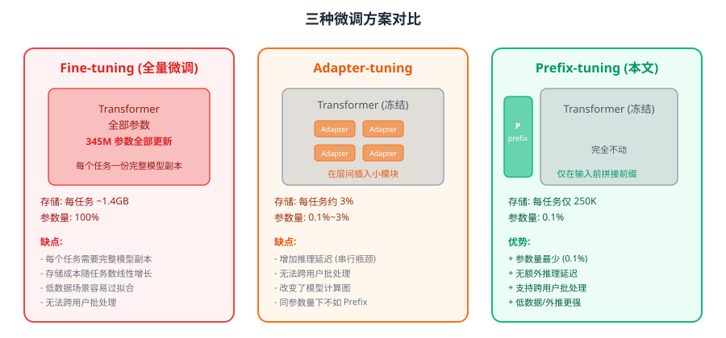
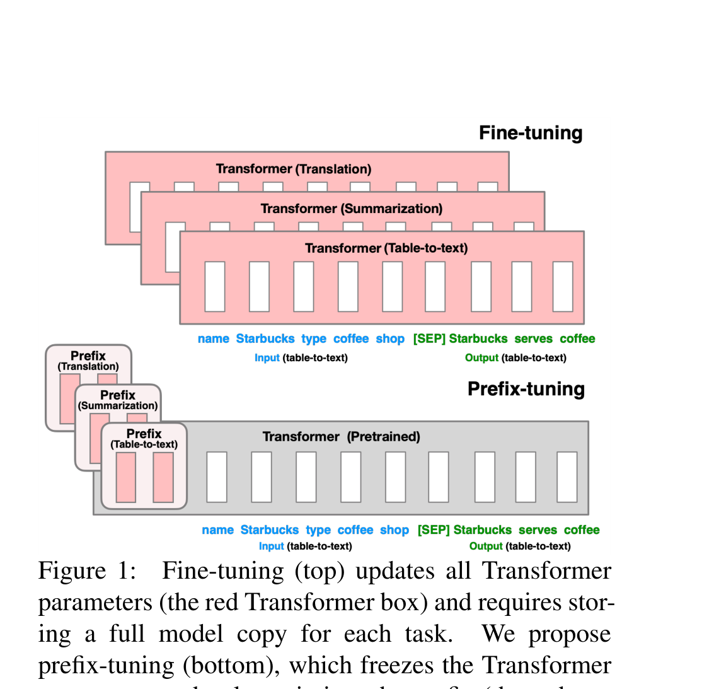
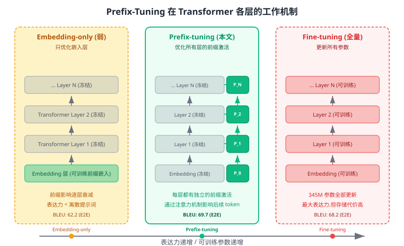
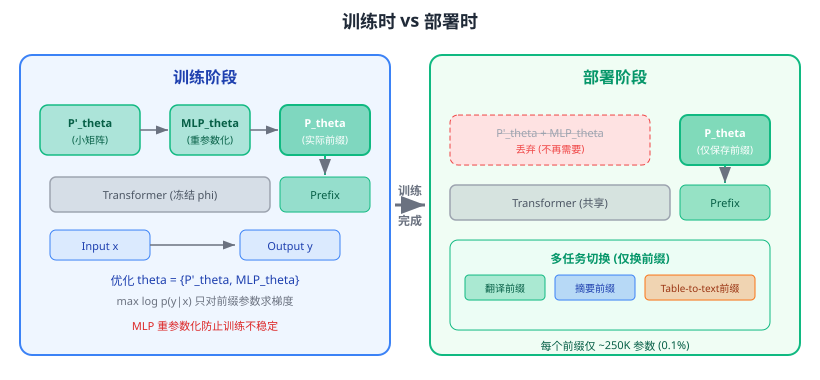
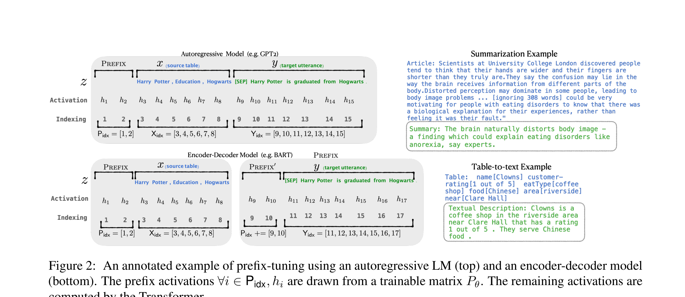
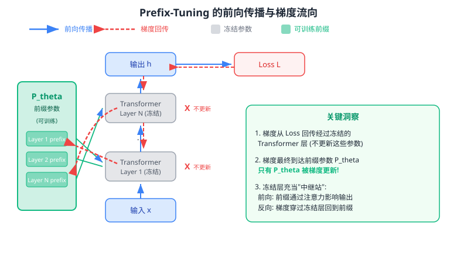
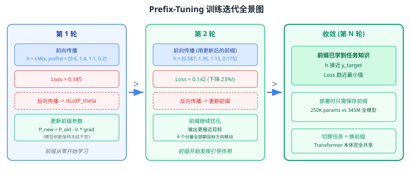
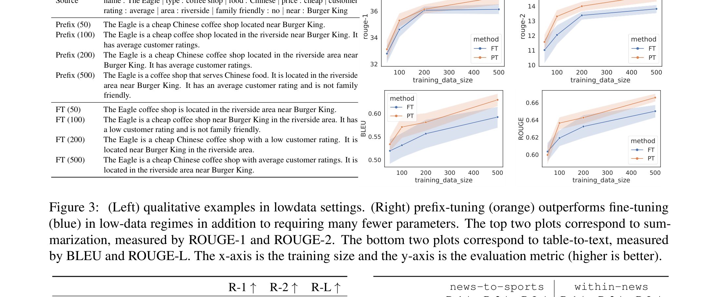

# 前缀调优：优化连续提示词以实现文本生成

> **原文**: Prefix-Tuning: Optimizing Continuous Prompts for Generation
> **作者**: Xiang Lisa Li, Percy Liang (Stanford University)
> **发表时间**: 2021
> **arXiv**: [https://arxiv.org/abs/2101.00190](https://arxiv.org/abs/2101.00190)

---

## 一句话总结

大语言模型做新任务时不用改它本身的参数了——只要在输入前面加一小段可学习的"虚拟提示词"（前缀），冻住模型全部参数，就能用 **0.1%** 的参数量达到接近全量微调的效果，而且在低数据场景下甚至更强。

## 研究背景：为什么要做这个？

2021 年前后，用大语言模型做下游任务（比如生成文本摘要、把表格数据写成一段话）的标准流程是 **Fine-tuning（全量微调）**：拿一个预训练好的大模型，在任务数据上把所有参数都更新一遍。

这就好比你有一本百科全书（预训练模型），现在想让它专门写餐厅评价。全量微调的做法是：把整本书重新抄一遍，在抄的过程中改写成餐厅评价风格。如果明天又想让它写新闻摘要？再抄一遍。每换一个任务就得存一整本书的副本。

以 GPT-2 为例：它有 **3.45 亿参数**，每个任务一份副本就是 **~1.4GB**。如果你有 100 个任务，就需要 140GB 存储。如果是 GPT-3 的 1750 亿参数？那就是天文数字了。

当时已经有一些"轻量化微调"的尝试：

- **Adapter-tuning**：在 Transformer 的每一层之间插入小型可训练模块（adapter），只训练这些小模块（约 2-4% 的参数）。但它改变了模型的计算图，导致推理时多了串行计算步骤，增加延迟。而且不同用户/任务的请求无法放在同一个 batch 里处理。
- **In-context learning / Prompting**（GPT-3 的做法）：在输入前面拼接自然语言指令和几个示例，让模型"领会"任务意图。但它受限于上下文窗口长度（GPT-3 最多 2048 个 token），无法充分利用大量训练数据，而且效果依赖于手工设计的提示词，不稳定。

### 现有方案的问题

核心矛盾是：**全量微调效果好但太贵，轻量化方案便宜但各有硬伤**。有没有一种方法，既能像全量微调一样好用，又能像 prompting 一样轻量，同时避免 adapter 的推理延迟问题？

## 核心思路：这篇论文的"大招"是什么？

Prefix-tuning 的核心 insight 来自对 prompting 的一个升级思考：

> 既然在输入前面加几个"提示词"就能引导模型做不同的任务，那为什么这些"提示词"一定要是真实的词呢？为什么不能是一组自由的、可以通过梯度下降优化的连续向量？

这就是 Prefix-tuning 的核心创新：**在 Transformer 每一层的输入序列前面，拼接一段可学习的连续向量（称为"前缀"，prefix），然后冻结整个语言模型，只训练这些前缀向量。**

你可以把它想象成这样：模型是一个经验丰富的老厨师（预训练的 LM），他什么菜都会做。以前让他做新菜（新任务）的方式是把他送去培训班重新学（fine-tuning），既贵又费时。Prefix-tuning 的做法是：在他每次做菜前，给他看一张"菜谱卡片"（prefix），卡片上的内容不是真实的文字，而是一些"调频信号"——老厨师看了之后就知道该怎么做了，而他本身的手艺（模型参数）完全没变。

上图展示了两种方案的对比。Fine-tuning（上半部分）需要为每个任务维护一份完整的 Transformer 副本（红色表示参数被更新）；Prefix-tuning（下半部分）只需要为每个任务维护一小段前缀（红色前缀块），Transformer 本体（灰色）在所有任务之间共享。

和之前方法的关键区别在于：

| 特性 | Fine-tuning | Adapter-tuning | Prompting | **Prefix-tuning** |
|------|-------------|----------------|-----------|-------------------|
| 修改模型参数 | 全部 | 插入新层 | 不修改 | **不修改** |
| 任务特定参数量 | 100% | 2-4% | 0 | **0.1%** |
| 推理延迟影响 | 无 | 有（串行瓶颈） | 无 | **无** |
| 跨用户批处理 | 不支持 | 不支持 | 支持 | **支持** |

## 具体怎么做的？

### 从离散 Prompting 到连续 Prefix

让我们先从直觉出发。在 GPT-3 的 in-context learning 中，如果你想生成关于"Obama"的内容，可以在输入前加上"Barack"作为提示，模型就会自然地输出"Obama"。这说明：**合适的上下文可以在不改变模型参数的情况下引导模型行为**。

但问题是：

1. **离散 token 的搜索空间太大**——在词表里暴力搜索最佳提示词组合，计算代价极高。
2. **离散 token 表达力有限**——每个位置只能从词表中选一个词的嵌入，而词表是有限的。

Prefix-tuning 的解法是：**跳出离散词表的限制，直接在连续空间中优化"虚拟 token"的表示**。这些虚拟 token 不对应任何真实的词，但它们的向量值可以是任意实数，表达力远强于离散提示。

而且，Prefix-tuning 不仅优化嵌入层的前缀，而是优化 **Transformer 每一层** 的前缀激活值。论文通过消融实验证明了这一点（见后文"Embedding-only vs Full prefix"部分）：只优化嵌入层的前缀 BLEU 只有 62.2，而优化所有层的前缀达到 69.7。

### 数学形式化

对于一个自回归语言模型（如 GPT-2），原始的计算过程是：

$$h_i = \text{LM}_\phi(z_i, h_{<i})$$

其中 $h_i$ 是时间步 $i$ 的隐状态（包含所有层的激活值），$z_i$ 是输入 token，$h_{<i}$ 是之前所有时间步的激活值（用于注意力计算）。

Prefix-tuning 在序列前面加上一段前缀索引 $P_{\text{idx}}$，并引入一个可训练矩阵 $P_\theta$，维度为 $|P_{\text{idx}}| \times \dim(h_i)$。前向计算变为：

$$h_i = \begin{cases} P_\theta[i, :], & \text{if } i \in P_{\text{idx}} \quad \text{(前缀位置，直接从 } P_\theta \text{ 读取)} \\ \text{LM}_\phi(z_i, h_{<i}), & \text{otherwise} \quad \text{(其他位置，正常计算)} \end{cases}$$

训练目标和 fine-tuning 一样，都是最大化条件生成的对数似然：

$$\max_\theta \log p(y | x) = \sum_{i \in Y_{\text{idx}}} \log p(z_i | h_{<i})$$

但关键区别在于：**语言模型的参数 $\phi$ 完全冻结，只有前缀参数 $\theta$ 被更新**。

对于 **encoder-decoder 架构**（如 BART），则在编码器和解码器前面分别加上前缀：

$$z = [\text{PREFIX}; x; \text{PREFIX}'; y]$$

### 重参数化技巧：MLP "护航"

论文发现，直接优化 $P_\theta$ 矩阵会导致 **训练不稳定**（对学习率和初始化非常敏感）。原因是 $P_\theta$ 的维度为 $|P_{\text{idx}}| \times \dim(h_i)$，其中 $\dim(h_i)$ 包含了所有层的激活拼接，维度很高。直接优化这么大的矩阵，各行之间没有约束，容易发散。

解决方案是 **重参数化**（reparametrization）：先用一个较小的矩阵 $P'_\theta$，通过一个 MLP 映射到实际的前缀矩阵：

$$P_\theta[i, :] = \text{MLP}_\theta(P'_\theta[i, :])$$

其中 $P'_\theta$ 的维度是 $|P_{\text{idx}}| \times k$（$k$ 远小于 $\dim(h_i)$，例如 table-to-text 用 $k = 512$，摘要任务用 $k = 800$），MLP 负责将 $k$ 维映射到 $\dim(h_i)$ 维。

你可以把这个 MLP 理解为"训练轮椅"——它在训练过程中帮助前缀稳定学习，但 **训练完成后就可以扔掉**，只保留最终计算出的 $P_\theta$ 矩阵。这是一个非常巧妙的工程设计：它不增加部署时的任何开销。

### 方法在整体架构中的位置

下面是论文 Figure 2 展示的 Prefix-tuning 详细工作流程：

以自回归模型（上半部分）为例，输入 $x$ 是线性化的表格数据 `name Starbucks | type coffee shop`，前缀 $P_\theta$ 被拼接在 $x$ 前面。在每一层 Transformer 中，前缀位置的激活值直接从 $P_\theta$ 读取，后续 token 通过注意力机制"看到"这些前缀激活，从而被前缀引导生成正确的输出。

### 用一个具体例子走通全流程

#### 场景设定

假设我们用一个极简的 GPT-2 变体做 table-to-text 任务。为了让数字好算，设定：

- 模型维度 $d = 4$（实际 GPT-2 Medium 是 1024）
- **前缀长度** $|P_{\text{idx}}| = 2$（论文默认用 10）
- **Transformer 层数** $n = 1$（简化为单层）
- 输入 token 数 = 2（简化）

参数设定：
- **Transformer 所有参数** $\phi$：冻结，不更新
- **前缀参数** $P_\theta \in \mathbb{R}^{2 \times 4}$：可训练

$$P_\theta = \begin{bmatrix} 0.1 & 0.0 & 0.1 & 0.0 \\ 0.0 & 0.1 & 0.0 & 0.1 \end{bmatrix} \quad \text{(初始化为较小的值)}$$

冻结的 Transformer 注意力层参数（简化，只看 Value 和 Output 投影）：

$$W_V = \begin{bmatrix} 1 & 0 & 0 & 0 \\ 0 & 1 & 0 & 0 \\ 0 & 0 & 1 & 0 \\ 0 & 0 & 0 & 1 \end{bmatrix} \quad \text{(单位矩阵，简化)}$$

输入 token 的嵌入（冻结）：

$$x_1 = \begin{bmatrix} 0.5 \\ 0.3 \\ 0.8 \\ 0.2 \end{bmatrix}, \quad x_2 = \begin{bmatrix} 0.2 \\ 0.7 \\ 0.1 \\ 0.6 \end{bmatrix}$$

完整序列为 $[p_1, p_2, x_1, x_2]$，其中 $p_1, p_2$ 是前缀激活，$x_1, x_2$ 是输入 token 的激活。

#### Step 1: 前向传播

**前缀位置的激活直接从 $P_\theta$ 读取**（不经过 Transformer 计算）：

$$h_1 = P_\theta[1, :] = \begin{bmatrix} 0.1 \\ 0.0 \\ 0.1 \\ 0.0 \end{bmatrix}, \quad h_2 = P_\theta[2, :] = \begin{bmatrix} 0.0 \\ 0.1 \\ 0.0 \\ 0.1 \end{bmatrix}$$

**输入 token 位置的激活通过 Transformer 计算**。以 $x_1$（第 3 个位置）为例，它通过注意力机制"看到"前面所有位置（$p_1, p_2, x_1$ 自身）。简化注意力计算，假设注意力权重为：

$$\alpha = \text{softmax}(\text{scores}) = [0.2, 0.2, 0.6] \quad \text{(对 } p_1, p_2, x_1 \text{)}$$

则注意力输出为：

$$\text{attn}(x_1) = 0.2 \cdot h_1 + 0.2 \cdot h_2 + 0.6 \cdot x_1 = 0.2 \begin{bmatrix} 0.1 \\ 0.0 \\ 0.1 \\ 0.0 \end{bmatrix} + 0.2 \begin{bmatrix} 0.0 \\ 0.1 \\ 0.0 \\ 0.1 \end{bmatrix} + 0.6 \begin{bmatrix} 0.5 \\ 0.3 \\ 0.8 \\ 0.2 \end{bmatrix}$$

$$= \begin{bmatrix} 0.02 \\ 0.0 \\ 0.02 \\ 0.0 \end{bmatrix} + \begin{bmatrix} 0.0 \\ 0.02 \\ 0.0 \\ 0.02 \end{bmatrix} + \begin{bmatrix} 0.30 \\ 0.18 \\ 0.48 \\ 0.12 \end{bmatrix} = \begin{bmatrix} 0.32 \\ 0.20 \\ 0.50 \\ 0.14 \end{bmatrix}$$

可以看到：**前缀的影响混入了输出**（如果没有前缀，输出只由 $x_1$ 自身决定，结果不同）。

最后经过输出投影得到预测 $\hat{y}$。假设经过简化的 softmax 后，模型预测的下一个 token 对应的输出向量是：

$$\hat{y} = \begin{bmatrix} 0.32 \\ 0.20 \\ 0.50 \\ 0.14 \end{bmatrix}$$

#### Step 2: 损失计算

假设目标输出 $y = \begin{bmatrix} 0.5 \\ 0.5 \\ 0.5 \\ 0.0 \end{bmatrix}$，使用均方误差损失（实际用交叉熵，这里简化）：

$$\mathcal{L} = \frac{1}{2}\|\hat{y} - y\|^2 = \frac{1}{2}\left[(0.32-0.5)^2 + (0.20-0.5)^2 + (0.50-0.5)^2 + (0.14-0.0)^2\right]$$

$$= \frac{1}{2}(0.0324 + 0.09 + 0 + 0.0196) = 0.071$$

这个损失值会指导前缀参数如何更新。而 **Transformer 的参数 $\phi$（$W_V$ 等）完全不参与优化**——梯度虽然经过它们传播，但不更新它们的值。

#### Step 3: 反向传播

损失对输出的梯度：

$$\frac{\partial \mathcal{L}}{\partial \hat{y}} = \hat{y} - y = \begin{bmatrix} -0.18 \\ -0.30 \\ 0.0 \\ 0.14 \end{bmatrix}$$

梯度通过注意力层回传到前缀参数。以 $P_\theta[1, :]$（第一个前缀向量 $p_1$）为例，由于注意力权重中 $p_1$ 的权重是 $\alpha_1 = 0.2$：

$$\frac{\partial \mathcal{L}}{\partial P_\theta[1, :]} = \alpha_1 \cdot \frac{\partial \mathcal{L}}{\partial \hat{y}} = 0.2 \times \begin{bmatrix} -0.18 \\ -0.30 \\ 0.0 \\ 0.14 \end{bmatrix} = \begin{bmatrix} -0.036 \\ -0.060 \\ 0.0 \\ 0.028 \end{bmatrix}$$

类似地，$P_\theta[2, :]$ 的梯度：

$$\frac{\partial \mathcal{L}}{\partial P_\theta[2, :]} = \alpha_2 \cdot \frac{\partial \mathcal{L}}{\partial \hat{y}} = 0.2 \times \begin{bmatrix} -0.18 \\ -0.30 \\ 0.0 \\ 0.14 \end{bmatrix} = \begin{bmatrix} -0.036 \\ -0.060 \\ 0.0 \\ 0.028 \end{bmatrix}$$

> 注意：这里 Transformer 参数 $W_V$ 的梯度也会被计算出来（自动微分框架会算），但我们 **不用它来更新 $W_V$**。优化器只维护前缀参数 $\theta$ 的状态。

#### Step 3.5: 参数更新与下一轮迭代

**用 SGD 更新前缀参数**（学习率 $\eta = 0.5$）：

$$P_\theta[1, :]_{\text{new}} = P_\theta[1, :] - \eta \cdot \frac{\partial \mathcal{L}}{\partial P_\theta[1, :]} = \begin{bmatrix} 0.1 \\ 0.0 \\ 0.1 \\ 0.0 \end{bmatrix} - 0.5 \times \begin{bmatrix} -0.036 \\ -0.060 \\ 0.0 \\ 0.028 \end{bmatrix} = \begin{bmatrix} 0.118 \\ 0.030 \\ 0.100 \\ -0.014 \end{bmatrix}$$

$$P_\theta[2, :]_{\text{new}} = \begin{bmatrix} 0.0 \\ 0.1 \\ 0.0 \\ 0.1 \end{bmatrix} - 0.5 \times \begin{bmatrix} -0.036 \\ -0.060 \\ 0.0 \\ 0.028 \end{bmatrix} = \begin{bmatrix} 0.018 \\ 0.130 \\ 0.0 \\ 0.086 \end{bmatrix}$$

**第二轮前向传播**（用更新后的前缀）：

$$\text{attn}(x_1) = 0.2 \begin{bmatrix} 0.118 \\ 0.030 \\ 0.100 \\ -0.014 \end{bmatrix} + 0.2 \begin{bmatrix} 0.018 \\ 0.130 \\ 0.0 \\ 0.086 \end{bmatrix} + 0.6 \begin{bmatrix} 0.5 \\ 0.3 \\ 0.8 \\ 0.2 \end{bmatrix} = \begin{bmatrix} 0.3272 \\ 0.2120 \\ 0.5000 \\ 0.1344 \end{bmatrix}$$

**验证训练在起作用**：

| 分量 | 第 1 轮输出 | 第 2 轮输出 | 目标值 | 趋势 |
|------|-----------|-----------|-------|------|
| $\hat{y}_1$ | 0.320 | 0.327 | 0.5 | 更近了 |
| $\hat{y}_2$ | 0.200 | 0.212 | 0.5 | 更近了 |
| $\hat{y}_3$ | 0.500 | 0.500 | 0.5 | 已到达 |
| $\hat{y}_4$ | 0.140 | 0.134 | 0.0 | 更近了 |

$$\mathcal{L}_{\text{new}} = \frac{1}{2}\left[(0.327-0.5)^2 + (0.212-0.5)^2 + (0.5-0.5)^2 + (0.134-0.0)^2\right] = 0.0600$$

损失从 **0.071 降到 0.060**，下降了约 15%。4 个分量中 3 个更接近目标，1 个已经到达目标。训练确实在起作用！

#### Step 4: 部署/推理

部署时，整个 MLP 重参数化模块被丢弃，只保留最终的前缀矩阵 $P_\theta$。切换任务只需替换前缀：

- **存储开销**：每个任务仅需存储 $|P_{\text{idx}}| \times \dim(h_i)$ 个参数。以 GPT-2 Medium 为例，前缀长度 10，总参数量约 **250K**——相比完整模型的 345M 参数，仅占 **0.07%**。
- **推理速度**：完全不增加延迟。前缀就像是多了几个 token 参与注意力计算，在 GPU 上可以完全并行化。
- **多任务/多用户**：不同用户/任务可以拥有不同的前缀，但共享同一个 Transformer。甚至可以把不同用户的请求放在同一个 batch 中——只要在各自的输入前拼接对应的前缀即可。

> **小白tips**: Prefix-tuning 可以理解为给大模型戴上不同的"眼镜"。换一副眼镜（前缀），模型就能"看到"不同的任务需求，但模型本身（大脑/参数）完全没有变。这和 LoRA 的"便签本"思路异曲同工，只不过 LoRA 在权重矩阵旁边加旁路，而 Prefix-tuning 在输入序列前面加前缀。

## 效果怎么样？

### Table-to-text 生成：与 Fine-tuning 相当

论文在三个 table-to-text 数据集上实验：E2E（餐厅评价）、WebNLG（知识图谱三元组）、DART（开放域）。

| 方法 | 参数量 | E2E BLEU | WebNLG BLEU (All) | DART BLEU |
|------|--------|----------|-------------------|-----------|
| Fine-tune (100%) | 345M | 68.2 | 46.5 | 46.2 |
| Adapter (3.0%) | ~10M | 68.9 | 54.9 | 45.2 |
| Adapter (0.1%) | ~345K | 66.3 | 50.2 | 42.4 |
| FT-TOP2 | ~10M | 68.1 | 36.0 | 41.0 |
| **Prefix (0.1%)** | **~250K** | **69.7** | **55.1** | **46.4** |

几个关键数字：

- **Prefix-tuning 仅用 0.1% 的参数**（~250K），在 E2E 上 BLEU 达到 **69.7**，超过了 Fine-tune 的 68.2。
- 在同等参数量（0.1%）下，Prefix-tuning 比 Adapter-tuning **平均高 4.1 BLEU**。
- 即使和用了 3% 参数的 Adapter 比，Prefix 的效果也毫不逊色。
- 从 GPT-2 Medium 到 GPT-2 Large，Prefix-tuning 同样有效，暗示它可以扩展到更大的模型。

### 摘要任务：略有差距但合理

在 XSUM 摘要数据集上，Prefix-tuning 和 Fine-tuning 有一定差距：

| 方法 | ROUGE-1 | ROUGE-2 | ROUGE-L |
|------|---------|---------|---------|
| Fine-tune | 45.14 | 22.27 | 37.25 |
| Prefix (2%) | 43.80 | 20.93 | 36.05 |
| Prefix (0.1%) | 42.92 | 20.03 | 35.05 |

论文分析差距的原因：（1）XSUM 数据量是 table-to-text 的 4 倍，Fine-tuning 在大数据上更有优势；（2）文章输入长度是表格的 17 倍，任务复杂度更高；（3）摘要需要阅读理解能力，比 table-to-text 的格式化生成更难。

### 低数据场景：Prefix-tuning 反超

这是论文最令人印象深刻的发现之一。在低数据场景（训练样本 50~500 个）中：

- Prefix-tuning **平均高出 Fine-tuning 2.9 BLEU**（table-to-text）。
- 在摘要任务上同样领先。
- 而且 Prefix-tuning 生成的内容**更忠实于原始数据**——Fine-tuning 在数据不足时容易"编造"信息（比如把"average rating"说成"low rating"），而 Prefix-tuning 的幻觉更少。

为什么低数据时 Prefix-tuning 更强？因为 Fine-tuning 会更新所有 345M 参数，在少量数据上极容易过拟合。而 Prefix-tuning 只更新 250K 参数，天然具有更强的正则化效果——参数少，过拟合的风险就小。

### 外推能力：训练没见过的主题也能搞定

在外推设置下（训练和测试的主题不同），Prefix-tuning 在所有指标上都优于 Fine-tuning：

| 设置 | Fine-tune R-L | Prefix R-L |
|------|-------------|------------|
| news-to-sports | 30.26 | **31.51** |
| within-news | 31.15 | **31.47** |
| WebNLG UNSEEN | BLEU 27.7 | BLEU **45.6** |

WebNLG 的 UNSEEN 类别上，Prefix-tuning 的 BLEU 比 Fine-tuning 高了将近 **18 个点**！这说明保留预训练 LM 的完整知识确实有助于泛化到新领域。

### 关键消融实验

论文还做了几个重要的消融实验：

**1. 前缀长度的影响（Figure 4）**

- Table-to-text：前缀长度 10 时效果最佳，再长就开始过拟合。
- 摘要：前缀长度 200 时效果最佳（因为任务更复杂）。
- 过长的前缀会导致训练 loss 持续下降但测试性能下降——典型的过拟合信号。

**2. Embedding-only vs Full prefix**

| 方法 | E2E BLEU |
|------|----------|
| Prefix-tuning (full) | **69.7** |
| Embedding-only (长度 10) | 62.2 |
| Embedding-only (长度 1) | 48.1 |

只优化嵌入层的前缀远不如优化所有层的前缀，说明**深层激活的直接控制至关重要**。论文由此建立了一个表达力的层级：

$$\text{离散提示词} < \text{Embedding-only} < \text{Prefix-tuning (all layers)}$$

**3. Prefix vs Infix**

把可训练激活放在 $x$ 和 $y$ 之间（Infix）效果不如放在开头（Prefix）。因为 Prefix 可以通过注意力同时影响 $x$ 和 $y$ 的编码，而 Infix 只能影响 $y$。

**4. 初始化策略**

用真实词的激活值（如"summarize"、"table-to-text"）初始化前缀，效果远好于随机初始化，尤其在低数据场景。任务相关的词略好于无关的词（如"elephant"），但只要是真实词就比随机好。这印证了"保留预训练 LM 知识"的核心理念。

## 论文的意义和局限

**主要贡献**：

1. **开创了连续前缀的参数高效微调范式**。Prefix-tuning 第一个系统性地提出在 Transformer 每一层前面拼接可学习的连续向量，用 0.1% 的参数达到接近全量微调的效果。这为后续的 Prompt Tuning、P-Tuning 等工作奠定了基础。
2. **揭示了"冻结模型 + 小前缀"在低数据和外推场景下的优势**。这不仅是一个实用发现，更暗示了预训练知识的保留对泛化能力至关重要。
3. **工程上极其友好**：部署时零推理延迟、支持多任务批处理、每个任务只需存储几百 KB 的前缀。对于大规模多用户系统，这是巨大的优势。

**局限性**：

- 在大数据量的复杂任务上（如 XSUM 摘要），效果仍不如 Fine-tuning，差距约 2 个 ROUGE 点。
- 前缀长度的选择需要针对任务调参，没有统一的最优值。
- 论文只实验了 GPT-2 和 BART 两个模型，没有在更大的模型（如 GPT-3）上验证。
- 前缀的可解释性较差——这些"虚拟 token"到底在编码什么信息，目前还是一个开放问题。

## 读后感

Prefix-tuning 的精妙之处在于，它抓住了一个简单但深刻的洞察：**语言模型的"任务适配"不需要改变模型本身，只需要找到一个合适的"引导信号"**。离散的提示词太弱了，全量微调又太暴力了，Prefix-tuning 恰好找到了一个优雅的中间地带——连续的、多层的前缀向量。

从技术发展脉络来看，Prefix-tuning 是从 Prompting 到 LoRA 的关键桥梁。它证明了"冻结大模型，只训练少量参数"这条路是可行的，直接启发了后来 Google 的 Prompt Tuning（更简化的版本，只在嵌入层加前缀）和微软的 LoRA（在权重矩阵旁边加低秩旁路）。三者共同构成了参数高效微调（PEFT）的方法家族，如今已成为大模型落地的标配工具。

如果你是初学者，读完这篇论文最应该记住的是：**大模型的适配不一定要"大"**。一小段精心优化的"引导信号"，就能让冻住的大模型在新任务上展现出惊人的能力。
