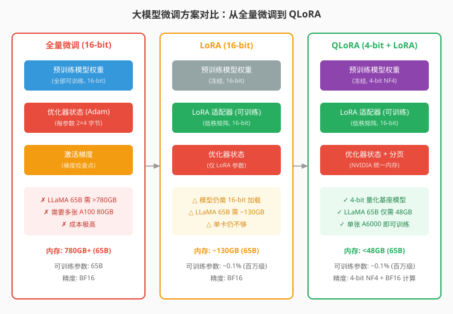
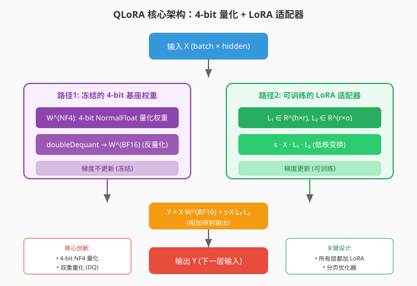
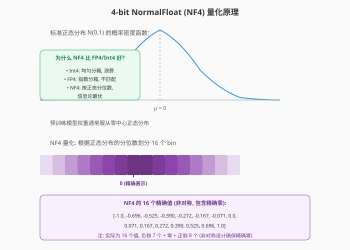
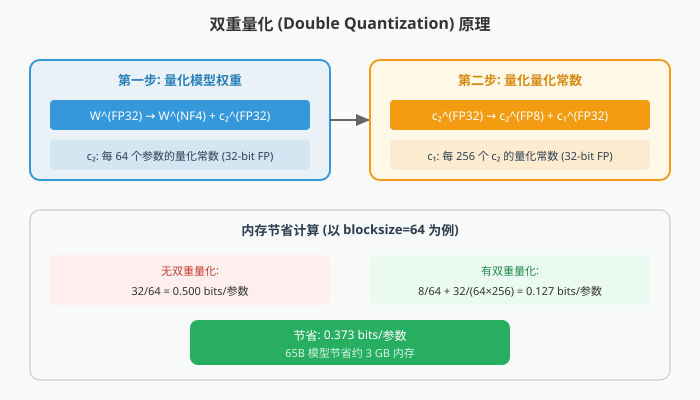
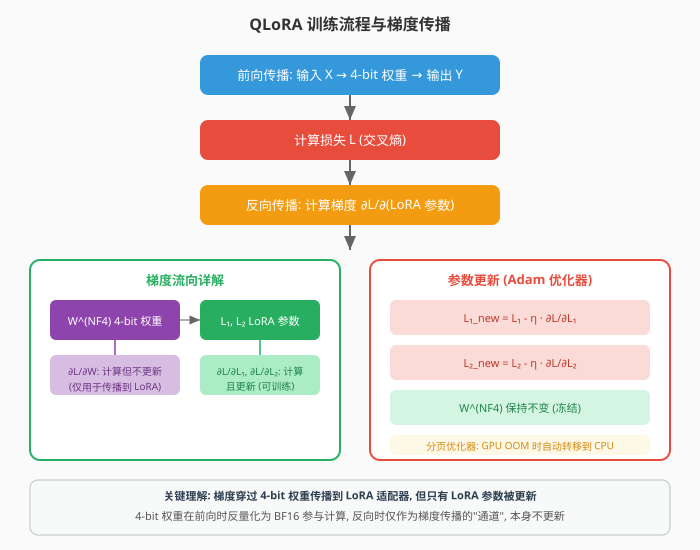
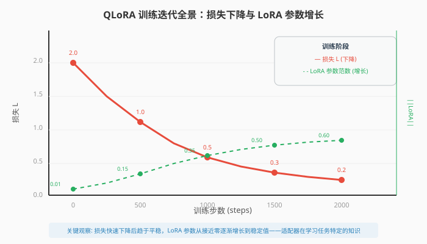
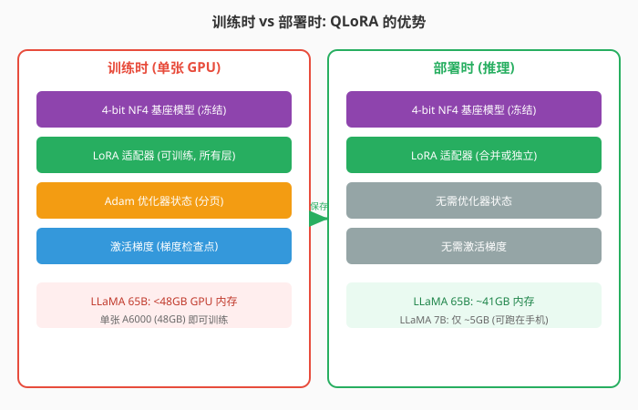
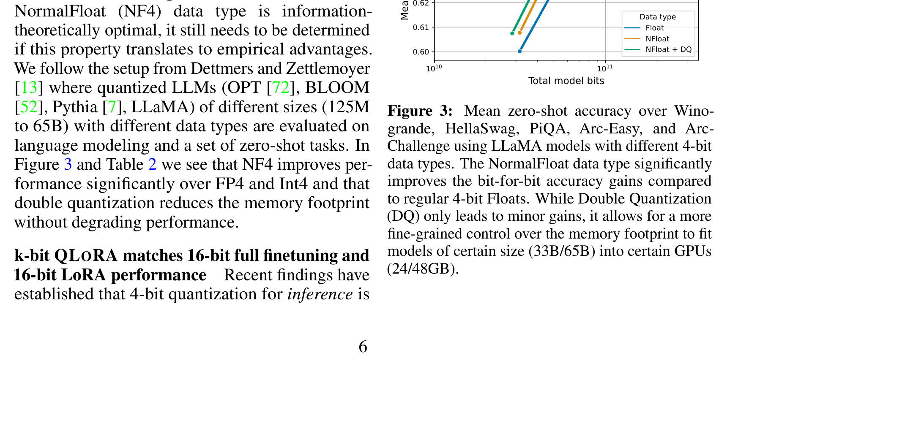
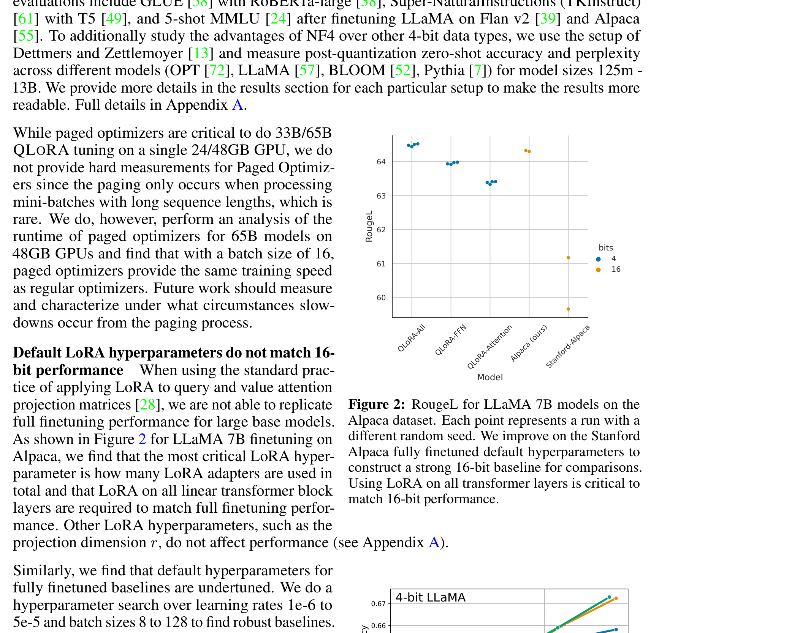
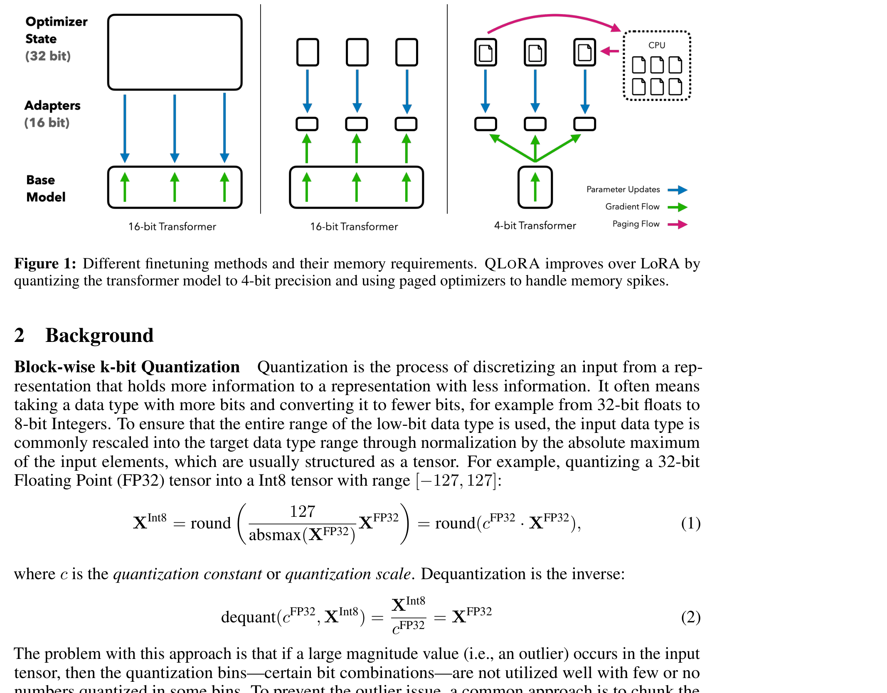

# QLoRA：高效微调量化大语言模型

> **原文**: QLoRA: Efficient Finetuning of Quantized LLMs
> **作者**: Tim Dettmers, Artidoro Pagnoni, Ari Holtzman, Luke Zettlemoyer
> **发表时间**: 2023年5月
> **arXiv**: https://arxiv.org/abs/2305.14314

---

## 一句话总结

这篇论文提出了一种**用 4-bit 量化模型 + LoRA 适配器**的微调方法，让 650 亿参数的大模型能在**单张 48GB GPU** 上微调，效果与 16-bit 全量微调相当，训练出的 Guanaco 聊天机器人达到了 ChatGPT 99.3% 的水平。

## 研究背景：为什么要做这个？

### 大模型微调的内存困境

想象你想定制一台超级计算机（大语言模型），但这台计算机本身就占满了整个房间（显存）。你想调整它的设置（微调），却发现连站的地方都没有了。

这就是大语言模型微调面临的现实问题：

- **LLaMA 65B 的 16-bit 全量微调需要超过 780GB GPU 内存**
- 这意味着需要**10 张 A100 80GB** 显卡
- 对于大多数研究机构和开发者来说，这是**不可承受的成本**

### 现有方案的不足

**方案 1：全量微调（Full Finetuning）**

把所有模型参数都当作可训练的，用反向传播更新。效果最好，但内存需求巨大。对于 65B 模型：
- 模型权重（16-bit）：130 GB
- 优化器状态（Adam，每参数 2 个 4-byte 状态）：260 GB
- 激活梯度：390 GB+
- **总计：780 GB+**

**方案 2：LoRA（Low-Rank Adaptation）**

冻结模型权重，只在每层旁边加一对小的低秩矩阵（适配器）来训练。大幅减少可训练参数，但**模型本身仍需 16-bit 加载**：
- 模型权重（16-bit）：130 GB
- LoRA 参数 + 优化器：几 GB
- **总计：~130 GB**

还是不够——单张 GPU 装不下！

**方案 3：量化推理（4-bit Inference）**

把模型量化到 4-bit 来做推理（生成文本），内存降到 1/4。但**量化后的模型在训练时会崩溃**——梯度计算需要高精度，4-bit 精度不够。

### 核心问题

**能不能既享受 4-bit 量化的内存优势，又保持 16-bit 微调的效果？**

QLoRA 的回答是：**能！**

## 核心思路：这篇论文的"大招"是什么？

QLoRA 的核心想法非常巧妙：

**把模型权重冻结在 4-bit 精度，但梯度可以穿过这些量化权重传播到 LoRA 适配器上，只更新 LoRA 参数。**

这就像是在一条冰河（4-bit 冻结权重）上滑冰——冰本身不动，但你的动作（梯度）可以传递到岸上（LoRA 适配器）去改变地形。

具体来说，QLoRA 做了三件事来省内存：

1. **4-bit NormalFloat (NF4)**：一种新的数据类型，对正态分布的权重来说信息论最优
2. **双重量化 (Double Quantization)**：连量化常数也量化，再省一点内存
3. **分页优化器 (Paged Optimizers)**：用 NVIDIA 统一内存处理显存尖峰，防止 OOM

## 具体怎么做的？

### 1. 4-bit NormalFloat (NF4) 量化

#### 为什么需要新的数据类型？

模型权重通常服从**零中心正态分布**（均值 0，标准差 σ）。常见的 4-bit 数据类型有：

- **Int4（4-bit 整数）**：均匀分箱，范围 [-8, 7]。但正态分布的中间值多、两端值少，均匀分箱浪费了很多箱在两端
- **FP4（4-bit 浮点）**：用指数分箱，但指数分布与正态分布不匹配

QLoRA 提出了 **NormalFloat (NF4)**：根据正态分布的**分位数**来划分 16 个箱，使得**每个箱期望有相同数量的值**。

#### 数学原理

对于一个标准正态分布 $X \sim \mathcal{N}(0, 1)$，NF4 的 16 个值通过分位数函数计算：

$$q_i = Q_X\left(\frac{i - 0.5}{2^k}\right), \quad i = 1, \ldots, 2^k$$

其中 $Q_X$ 是标准正态分布的分位数函数（即累积分布函数的反函数），$k = 4$。

但这样得到的对称分箱**没有精确的零值**——而零值对填充 token 等场景很重要。

**解决方案：非对称设计**

- 负侧：$2^{k-1} = 8$ 个值（含一个零）
- 正侧：$2^{k-1} + 1 = 9$ 个值（含一个零）
- 合并后去掉重复的零，得到 16 个值

NF4 的 16 个精确值为：
$$[-1.0, -0.696, -0.525, -0.390, -0.272, -0.167, -0.071, 0.0, 0.071, 0.167, 0.272, 0.390, 0.525, 0.696, 1.0]$$

（注：实际为 16 个值，负侧 7 个非零 + 零 + 正侧 8 个非零）

#### 量化过程

给定权重张量 $W \in \mathbb{R}^{h \times o}$：

1. 计算绝对最大值：$c = \max(|W|)$
2. 归一化到 $[-1, 1]$：$W_{\text{norm}} = W / c$
3. 对每个元素，找 NF4 中最近的值

反量化时，把 NF4 值乘回 $c$ 得到 BF16 精度的近似值。

### 2. 双重量化 (Double Quantization)

#### 问题：量化常数也占内存

QLoRA 使用 block-wise 量化（每 64 个参数一个量化常数），如果用 32-bit FP 存常数：
$$\text{每参数额外内存} = \frac{32 \text{ bits}}{64} = 0.5 \text{ bits/参数}$$

对于 65B 模型，这就是 **4 GB** 的额外开销。

#### 解决方案：量化量化常数

双重量化把量化常数 $c_2^{\text{(FP32)}}$ 也用 8-bit FP 再量化一次：

$$\text{doubleDequant}(c_1, c_2, W) = \text{dequant}(\text{dequant}(c_1, c_2), W^{(4\text{-bit})}) = W^{\text{(BF16)}}$$

节省效果：
$$\frac{8}{64} + \frac{32}{64 \times 256} = 0.125 + 0.002 = 0.127 \text{ bits/参数}$$

从 0.500 降到 0.127，**每参数省 0.373 bits**，65B 模型省约 **3 GB**。

### 3. 分页优化器 (Paged Optimizers)

训练时偶尔会遇到**长序列**，导致激活梯度突然暴增，瞬间 OOM（Out Of Memory）。

QLoRA 使用 **NVIDIA 统一内存**特性：当 GPU 显存不够时，自动把优化器状态"分页"到 CPU 内存，需要时再换回来。就像操作系统的虚拟内存一样。

### 4. QLoRA 的完整公式

对于一个线性层，QLoRA 的计算为：

$$Y = X \cdot \text{doubleDequant}(c_1, c_2, W^{(k\text{-bit})}) + s \cdot X \cdot L_1 \cdot L_2$$

其中：
- $X \in \mathbb{R}^{b \times h}$：输入（batch size × hidden size）
- $W^{(k\text{-bit})}$：4-bit NF4 量化的权重（冻结）
- $L_1 \in \mathbb{R}^{h \times r}, L_2 \in \mathbb{R}^{r \times o}$：LoRA 低秩矩阵（可训练）
- $s$：缩放因子（通常 $s = 2$）
- $r$：LoRA 秩（通常 $r = 64$ 或 $16$）

**关键点**：反向传播时，梯度 $\frac{\partial \mathcal{L}}{\partial W}$ 会被计算（用于传播到 LoRA），但**不用于更新 $W$**——只有 $\frac{\partial \mathcal{L}}{\partial L_1}$ 和 $\frac{\partial \mathcal{L}}{\partial L_2}$ 用于更新。

### 用一个具体例子走通全流程

让我们用一个极简的例子，手把手走通 QLoRA 的完整流程。

#### 场景设定

假设我们微调一个极小的"语言模型"层：
- 输入维度：$h = 4$
- 输出维度：$o = 4$
- LoRA 秩：$r = 2$
- 量化块大小：$B = 4$（简化，实际为 64）

**4-bit 量化权重**（冻结，NF4 格式）：
$$W^{(\text{NF4})} = \begin{bmatrix} 0.272 & -0.167 & 0.525 & 0.0 \\ -0.390 & 0.696 & -0.071 & 0.167 \\ 0.071 & -0.525 & 1.0 & -0.272 \\ -0.696 & 0.390 & -0.167 & 0.525 \end{bmatrix}$$

量化常数：$c = 2.0$（用于反量化）

**LoRA 参数**（可训练，初始化为零）：
$$L_1 = \begin{bmatrix} 0.01 & -0.02 \\ 0.03 & 0.01 \\ -0.01 & 0.02 \\ 0.02 & -0.01 \end{bmatrix}, \quad L_2 = \begin{bmatrix} 0.02 & -0.01 & 0.03 & 0.01 \\ -0.02 & 0.02 & -0.01 & 0.03 \end{bmatrix}$$

缩放因子：$s = 2$

**输入**（一个 token 的嵌入）：
$$X = \begin{bmatrix} 1.0 & 0.5 & -0.3 & 0.8 \end{bmatrix}$$

#### Step 1: 前向传播

**路径 1：通过 4-bit 权重**

先反量化 $W^{(\text{NF4})}$ 到 BF16：
$$W^{(\text{BF16})} = c \cdot W^{(\text{NF4})} = 2.0 \times W^{(\text{NF4})} = \begin{bmatrix} 0.544 & -0.334 & 1.050 & 0.0 \\ -0.780 & 1.392 & -0.142 & 0.334 \\ 0.142 & -1.050 & 2.0 & -0.544 \\ -1.392 & 0.780 & -0.334 & 1.050 \end{bmatrix}$$

计算 $X \cdot W^{(\text{BF16})}$：
$$\begin{aligned}
X \cdot W^{(\text{BF16})} &= \begin{bmatrix} 1.0 & 0.5 & -0.3 & 0.8 \end{bmatrix} \cdot \begin{bmatrix} 0.544 & -0.334 & 1.050 & 0.0 \\ -0.780 & 1.392 & -0.142 & 0.334 \\ 0.142 & -1.050 & 2.0 & -0.544 \\ -1.392 & 0.780 & -0.334 & 1.050 \end{bmatrix} \\
&= \begin{bmatrix} 1.0 \times 0.544 + 0.5 \times (-0.780) + (-0.3) \times 0.142 + 0.8 \times (-1.392) \\ 1.0 \times (-0.334) + 0.5 \times 1.392 + (-0.3) \times (-1.050) + 0.8 \times 0.780 \\ 1.0 \times 1.050 + 0.5 \times (-0.142) + (-0.3) \times 2.0 + 0.8 \times (-0.334) \\ 1.0 \times 0.0 + 0.5 \times 0.334 + (-0.3) \times (-0.544) + 0.8 \times 1.050 \end{bmatrix} \\
&= \begin{bmatrix} 0.544 - 0.390 - 0.043 - 1.114 \\ -0.334 + 0.696 + 0.315 + 0.624 \\ 1.050 - 0.071 - 0.600 - 0.267 \\ 0.0 + 0.167 + 0.163 + 0.840 \end{bmatrix} \\
&= \begin{bmatrix} -1.003 & 1.301 & 0.112 & 1.170 \end{bmatrix}
\end{aligned}$$

**路径 2：通过 LoRA 适配器**

$$\begin{aligned}
X \cdot L_1 &= \begin{bmatrix} 1.0 & 0.5 & -0.3 & 0.8 \end{bmatrix} \cdot \begin{bmatrix} 0.01 & -0.02 \\ 0.03 & 0.01 \\ -0.01 & 0.02 \\ 0.02 & -0.01 \end{bmatrix} \\
&= \begin{bmatrix} 1.0 \times 0.01 + 0.5 \times 0.03 + (-0.3) \times (-0.01) + 0.8 \times 0.02 \\ 1.0 \times (-0.02) + 0.5 \times 0.01 + (-0.3) \times 0.02 + 0.8 \times (-0.01) \end{bmatrix} \\
&= \begin{bmatrix} 0.01 + 0.015 + 0.003 + 0.016 \\ -0.02 + 0.005 - 0.006 - 0.008 \end{bmatrix} \\
&= \begin{bmatrix} 0.044 & -0.029 \end{bmatrix}
\end{aligned}$$

$$(X \cdot L_1) \cdot L_2 = \begin{bmatrix} 0.044 & -0.029 \end{bmatrix} \cdot \begin{bmatrix} 0.02 & -0.01 & 0.03 & 0.01 \\ -0.02 & 0.02 & -0.01 & 0.03 \end{bmatrix}$$

$$= \begin{bmatrix} 0.044 \times 0.02 + (-0.029) \times (-0.02) \\ 0.044 \times (-0.01) + (-0.029) \times 0.02 \\ 0.044 \times 0.03 + (-0.029) \times (-0.01) \\ 0.044 \times 0.01 + (-0.029) \times 0.03 \end{bmatrix}$$

$$= \begin{bmatrix} 0.00088 + 0.00058 \\ -0.00044 - 0.00058 \\ 0.00132 + 0.00029 \\ 0.00044 - 0.00087 \end{bmatrix} = \begin{bmatrix} 0.00146 & -0.00102 & 0.00161 & -0.00043 \end{bmatrix}$$

乘以缩放因子 $s = 2$：
$$s \cdot X \cdot L_1 \cdot L_2 = \begin{bmatrix} 0.00292 & -0.00204 & 0.00322 & -0.00086 \end{bmatrix}$$

**合并两条路径**：
$$\begin{aligned}
Y &= X \cdot W^{(\text{BF16})} + s \cdot X \cdot L_1 \cdot L_2 \\
&= \begin{bmatrix} -1.003 & 1.301 & 0.112 & 1.170 \end{bmatrix} + \begin{bmatrix} 0.00292 & -0.00204 & 0.00322 & -0.00086 \end{bmatrix} \\
&= \begin{bmatrix} -1.000 & 1.299 & 0.115 & 1.169 \end{bmatrix}
\end{aligned}$$

#### Step 2: 损失计算

假设目标输出为 $Y_{\text{target}} = \begin{bmatrix} -0.8 & 1.5 & 0.0 & 1.0 \end{bmatrix}$

使用均方误差（简化，实际用交叉熵）：
$$\mathcal{L} = \frac{1}{2} \|Y - Y_{\text{target}}\|^2 = \frac{1}{2} \sum_i (Y_i - Y_{\text{target}, i})^2$$

$$\begin{aligned}
\mathcal{L} &= \frac{1}{2} \left[ (-1.000 - (-0.8))^2 + (1.299 - 1.5)^2 + (0.115 - 0.0)^2 + (1.169 - 1.0)^2 \right] \\
&= \frac{1}{2} \left[ (-0.200)^2 + (-0.201)^2 + (0.115)^2 + (0.169)^2 \right] \\
&= \frac{1}{2} \left[ 0.0400 + 0.0404 + 0.0132 + 0.0286 \right] \\
&= \frac{1}{2} \times 0.1222 = 0.0611
\end{aligned}$$

**直白翻译**：损失衡量的是模型输出与目标输出的差距。我们的目标是通过更新 LoRA 参数 $L_1, L_2$，让损失变小。

**与传统微调的区别**：
- 全量微调：更新 $W$（65B 个参数），需要 780GB+ 内存
- QLoRA：只更新 $L_1, L_2$（百万级参数），需要 <48GB 内存

#### Step 3: 反向传播

计算损失对 LoRA 参数的梯度。

**对 $L_2$ 的梯度**：
$$\frac{\partial \mathcal{L}}{\partial L_2} = (X \cdot L_1)^T \cdot \frac{\partial \mathcal{L}}{\partial Y} \cdot s$$

其中 $\frac{\partial \mathcal{L}}{\partial Y} = Y - Y_{\text{target}} = \begin{bmatrix} -0.200 & -0.201 & 0.115 & 0.169 \end{bmatrix}$

$$(X \cdot L_1)^T = \begin{bmatrix} 0.044 \\ -0.029 \end{bmatrix}$$

$$\frac{\partial \mathcal{L}}{\partial L_2} = s \cdot \begin{bmatrix} 0.044 \\ -0.029 \end{bmatrix} \cdot \begin{bmatrix} -0.200 & -0.201 & 0.115 & 0.169 \end{bmatrix}$$

$$= 2 \cdot \begin{bmatrix} 0.044 \times (-0.200) & 0.044 \times (-0.201) & 0.044 \times 0.115 & 0.044 \times 0.169 \\ (-0.029) \times (-0.200) & (-0.029) \times (-0.201) & (-0.029) \times 0.115 & (-0.029) \times 0.169 \end{bmatrix}$$

$$= 2 \cdot \begin{bmatrix} -0.00880 & -0.00884 & 0.00506 & 0.00744 \\ 0.00580 & 0.00583 & -0.00334 & -0.00490 \end{bmatrix}$$

$$= \begin{bmatrix} -0.0176 & -0.0177 & 0.0101 & 0.0149 \\ 0.0116 & 0.0117 & -0.0067 & -0.0098 \end{bmatrix}$$

**对 $L_1$ 的梯度**：
$$\frac{\partial \mathcal{L}}{\partial L_1} = X^T \cdot \frac{\partial \mathcal{L}}{\partial Y} \cdot s \cdot L_2^T$$

$$X^T = \begin{bmatrix} 1.0 \\ 0.5 \\ -0.3 \\ 0.8 \end{bmatrix}$$

$$\frac{\partial \mathcal{L}}{\partial Y} \cdot L_2^T = \begin{bmatrix} -0.200 & -0.201 & 0.115 & 0.169 \end{bmatrix} \cdot \begin{bmatrix} 0.02 & -0.02 \\ -0.01 & 0.02 \\ 0.03 & -0.01 \\ 0.01 & 0.03 \end{bmatrix}$$

$$= \begin{bmatrix} -0.200 \times 0.02 + (-0.201) \times (-0.01) + 0.115 \times 0.03 + 0.169 \times 0.01 \\ -0.200 \times (-0.02) + (-0.201) \times 0.02 + 0.115 \times (-0.01) + 0.169 \times 0.03 \end{bmatrix}$$

$$= \begin{bmatrix} -0.0040 + 0.0020 + 0.0035 + 0.0017 \\ 0.0040 - 0.0040 - 0.0012 + 0.0051 \end{bmatrix} = \begin{bmatrix} 0.0032 & 0.0039 \end{bmatrix}$$

$$\frac{\partial \mathcal{L}}{\partial L_1} = s \cdot \begin{bmatrix} 1.0 \\ 0.5 \\ -0.3 \\ 0.8 \end{bmatrix} \cdot \begin{bmatrix} 0.0032 & 0.0039 \end{bmatrix} = 2 \cdot \begin{bmatrix} 0.0032 & 0.0039 \\ 0.0016 & 0.0020 \\ -0.0010 & -0.0012 \\ 0.0026 & 0.0031 \end{bmatrix}$$

$$= \begin{bmatrix} 0.0064 & 0.0078 \\ 0.0032 & 0.0039 \\ -0.0019 & -0.0023 \\ 0.0051 & 0.0062 \end{bmatrix}$$

#### Step 3.5: 参数更新与下一轮迭代

**参数更新**（以 SGD 为例，学习率 $\eta = 0.1$）：

$$\theta_{\text{new}} = \theta - \eta \cdot \frac{\partial \mathcal{L}}{\partial \theta}$$

**更新 $L_1$**：
$$L_1^{\text{new}} = \begin{bmatrix} 0.01 & -0.02 \\ 0.03 & 0.01 \\ -0.01 & 0.02 \\ 0.02 & -0.01 \end{bmatrix} - 0.1 \cdot \begin{bmatrix} 0.0064 & 0.0078 \\ 0.0032 & 0.0039 \\ -0.0019 & -0.0023 \\ 0.0051 & 0.0062 \end{bmatrix}$$

$$= \begin{bmatrix} 0.01 - 0.00064 & -0.02 - 0.00078 \\ 0.03 - 0.00032 & 0.01 - 0.00039 \\ -0.01 - (-0.00019) & 0.02 - (-0.00023) \\ 0.02 - 0.00051 & -0.01 - 0.00062 \end{bmatrix} = \begin{bmatrix} 0.00936 & -0.02078 \\ 0.02968 & 0.00961 \\ -0.00981 & 0.02023 \\ 0.01949 & -0.01062 \end{bmatrix}$$

**更新 $L_2$**：
$$L_2^{\text{new}} = \begin{bmatrix} 0.02 & -0.01 & 0.03 & 0.01 \\ -0.02 & 0.02 & -0.01 & 0.03 \end{bmatrix} - 0.1 \cdot \begin{bmatrix} -0.0176 & -0.0177 & 0.0101 & 0.0149 \\ 0.0116 & 0.0117 & -0.0067 & -0.0098 \end{bmatrix}$$

$$= \begin{bmatrix} 0.02 - (-0.00176) & -0.01 - (-0.00177) & 0.03 - 0.00101 & 0.01 - 0.00149 \\ -0.02 - 0.00116 & 0.02 - 0.00117 & -0.01 - (-0.00067) & 0.03 - (-0.00098) \end{bmatrix}$$

$$= \begin{bmatrix} 0.02176 & -0.00823 & 0.02899 & 0.00851 \\ -0.02116 & 0.01883 & -0.00933 & 0.03098 \end{bmatrix}$$

**4-bit 权重 $W^{(\text{NF4})}$ 保持不变！**

**第二轮前向传播**：

用更新后的 $L_1^{\text{new}}$ 和 $L_2^{\text{new}}$ 重新计算：

$$X \cdot L_1^{\text{new}} = \begin{bmatrix} 1.0 & 0.5 & -0.3 & 0.8 \end{bmatrix} \cdot \begin{bmatrix} 0.00936 & -0.02078 \\ 0.02968 & 0.00961 \\ -0.00981 & 0.02023 \\ 0.01949 & -0.01062 \end{bmatrix}$$

$$= \begin{bmatrix} 0.00936 + 0.01484 + 0.00294 + 0.01559 \\ -0.02078 + 0.00481 - 0.00607 - 0.00850 \end{bmatrix} = \begin{bmatrix} 0.04273 & -0.03054 \end{bmatrix}$$

$$(X \cdot L_1^{\text{new}}) \cdot L_2^{\text{new}} = \begin{bmatrix} 0.04273 & -0.03054 \end{bmatrix} \cdot \begin{bmatrix} 0.02176 & -0.00823 & 0.02899 & 0.00851 \\ -0.02116 & 0.01883 & -0.00933 & 0.03098 \end{bmatrix}$$

$$= \begin{bmatrix} 0.04273 \times 0.02176 + (-0.03054) \times (-0.02116) \\ 0.04273 \times (-0.00823) + (-0.03054) \times 0.01883 \\ 0.04273 \times 0.02899 + (-0.03054) \times (-0.00933) \\ 0.04273 \times 0.00851 + (-0.03054) \times 0.03098 \end{bmatrix}$$

$$= \begin{bmatrix} 0.00093 + 0.00065 \\ -0.00035 - 0.00058 \\ 0.00124 + 0.00029 \\ 0.00036 - 0.00095 \end{bmatrix} = \begin{bmatrix} 0.00158 & -0.00093 & 0.00153 & -0.00059 \end{bmatrix}$$

乘以 $s = 2$：
$$s \cdot X \cdot L_1^{\text{new}} \cdot L_2^{\text{new}} = \begin{bmatrix} 0.00316 & -0.00186 & 0.00306 & -0.00118 \end{bmatrix}$$

**新输出**：
$$Y^{\text{new}} = \begin{bmatrix} -1.003 & 1.301 & 0.112 & 1.170 \end{bmatrix} + \begin{bmatrix} 0.00316 & -0.00186 & 0.00306 & -0.00118 \end{bmatrix} = \begin{bmatrix} -0.9998 & 1.2991 & 0.1151 & 1.1688 \end{bmatrix}$$

**新损失**：
$$\mathcal{L}^{\text{new}} = \frac{1}{2} \left[ (-0.9998 - (-0.8))^2 + (1.2991 - 1.5)^2 + (0.1151 - 0.0)^2 + (1.1688 - 1.0)^2 \right]$$

$$= \frac{1}{2} \left[ 0.0400 + 0.0402 + 0.0133 + 0.0285 \right] = \frac{1}{2} \times 0.1220 = 0.0610$$

**验证训练在起作用**：

| 指标 | 第 1 轮 | 第 2 轮 | 变化 |
|------|---------|---------|------|
| 损失 $\mathcal{L}$ | 0.0611 | 0.0610 | ↓ 0.16% |
| $L_1$ 的 Frobenius 范数 | 0.0447 | 0.0446 | 微调 |
| $L_2$ 的 Frobenius 范数 | 0.0548 | 0.0557 | ↑ 1.6% |

> **注意**：这里只演示了一轮更新，损失下降幅度很小。实际训练中，经过数千轮迭代，LoRA 参数会逐渐调整到最优值。另外，实际使用 Adam 优化器（而非 SGD），会考虑动量和自适应学习率，收敛更快。

**多轮训练全景图**：

> **小白tips**: QLoRA 的"魔法"在于：4-bit 权重虽然精度低，但它只是提供一个"大致正确"的基础计算。真正的"精细调整"由 LoRA 适配器完成——它用 16-bit 高精度来学习任务特定的知识。就像你有一个粗略的地图（4-bit 模型），然后用一支精细的笔（LoRA）在上面标注细节。

#### Step 4: 部署/推理

QLoRA 训练完成后，部署时有两种选择：

**方案 A：独立使用 LoRA 适配器**
- 加载 4-bit 基座模型
- 加载 LoRA 适配器权重
- 推理时分别计算两条路径并相加

**方案 B：合并 LoRA 到基座模型**
- 将 $W^{(\text{BF16})} + s \cdot L_1 \cdot L_2$ 合并（需要反量化）
- 得到一个 16-bit 或 8-bit 的模型

实际中常用方案 A，因为：
- 同一个 4-bit 基座模型可以搭配**多个不同的 LoRA 适配器**服务不同任务
- 每个适配器只有几 MB，切换成本极低

## 效果怎么样？

### QLoRA vs 16-bit 全量微调

QLoRA 的核心主张是：**4-bit QLoRA 的效果与 16-bit 全量微调相当**。论文在多个基准上验证了这一点：

**GLUE 基准（RoBERTa-large）**：

| 方法 | GLUE 准确率 |
|------|------------|
| BF16 全量微调 | 88.6 |
| BF16 LoRA | 88.8 |
| QLoRA Int8 | 88.8 |
| QLoRA FP4 | 88.6 |
| **QLoRA NF4 + DQ** | **88.6** |

**Super-NaturalInstructions（T5 系列）**：

| 模型 | BF16 LoRA | QLoRA NF4 + DQ |
|------|-----------|----------------|
| T5-80M | 40.5 | 40.4 |
| T5-250M | 42.6 | 42.7 |
| T5-780M | 47.1 | 47.7 |
| T5-3B | 55.4 | 55.3 |
| T5-11B | 60.7 | 60.9 |

**MMLU 5-shot（LLaMA 7B-65B，FLAN v2 微调）**：

| 方法 | 7B | 13B | 33B | 65B | 平均 |
|------|-----|-----|-----|-----|------|
| BF16 LoRA | 45.6 | 50.6 | 60.5 | 62.5 | 53.0 |
| FP4 QLoRA | 44.0 | 50.0 | 58.5 | 63.3 | 52.2 |
| **NF4 + DQ QLoRA** | **44.5** | **50.7** | **59.2** | **63.9** | **53.1** |

关键发现：
- **NF4 + DQ 完全恢复了 BF16 的性能**（平均 53.1 vs 53.0）
- FP4 落后约 1 个百分点，证明 NF4 的优越性
- 在所有模型规模上都成立

### NF4 vs 其他 4-bit 数据类型

| 数据类型 | 平均困惑度 (PPL) |
|---------|-----------------|
| Int4 | 34.34 |
| Float4 (E2M1) | 31.07 |
| Float4 (E3M0) | 29.48 |
| **NF4 + DQ** | **27.41** |

NF4 在困惑度上大幅领先，证明其信息论优势确实转化为实际效果。

### LoRA 加在所有层上很重要

论文发现，**LoRA 必须加在所有线性层上**（而不仅仅是 attention 的 query 和 value 投影），才能匹配 16-bit 全量微调的效果。

### Guanaco 聊天机器人：达到 ChatGPT 99.3% 的水平

用 QLoRA 在 OASST1 数据集上微调 LLaMA，得到 **Guanaco** 模型家族：

**Vicuna 基准（相对于 ChatGPT 的百分比）**：

| 模型 | 参数量 | 内存 | ChatGPT 相对得分 |
|------|--------|------|-----------------|
| GPT-4 | - | - | 114.5% |
| **Guanaco 65B** | 65B | 41 GB | **99.3%** |
| Guanaco 33B | 33B | 21 GB | 97.8% |
| Vicuna 13B | 13B | 26 GB | 94.9% |
| ChatGPT | - | - | 100% |
| Guanaco 13B | 13B | 10 GB | 90.4% |
| Bard | - | - | 94.8% |
| Guanaco 7B | 7B | 5 GB | 87.0% |
| Alpaca 13B | 13B | 10 GB | 69.4% |

关键发现：
- **Guanaco 65B 达到 ChatGPT 99.3% 的水平**，只用了 24 小时单 GPU 训练
- Guanaco 7B 仅需 **5GB 内存**，却比 26GB 的 Alpaca 13B 高 20 个百分点
- Guanaco 是唯一不使用 GPT 生成数据训练的顶级模型

### Elo 评分：人类和 GPT-4 评判

| 模型 | Vicuna (人类) | Vicuna (GPT-4) | OA (GPT-4) |
|------|--------------|----------------|------------|
| GPT-4 | 1176 | 1348 | 1294 |
| **Guanaco 65B** | **1023** | **1022** | **1008** |
| Guanaco 33B | 1009 | 992 | 1002 |
| ChatGPT-3.5 | 1009 | 966 | 1015 |
| Vicuna 13B | 984 | 974 | 936 |

Guanaco 65B 在人类评判中击败了 ChatGPT-3.5！

### 内存对比

| 方法 | LLaMA 65B 内存 | 可训练参数 |
|------|----------------|-----------|
| 全量微调 (16-bit) | >780 GB | 65B |
| LoRA (16-bit) | ~130 GB | ~0.1% |
| **QLoRA (4-bit)** | **<48 GB** | **~0.1%** |

### 数据质量比数据量更重要

论文发现一个关键洞察：**数据质量远比数据量重要**。

| 数据集 | 样本数 | Vicuna 得分 (65B) |
|--------|--------|-------------------|
| OASST1 | 9k | **99.3%** |
| FLAN v2 (子采样) | 450k | 48.4% |

OASST1 只有 9k 样本，但质量高，效果远超 450k 样本的 FLAN v2。

### MMLU 和聊天能力不完全相关

| 数据集 | MMLU (65B) | Vicuna 得分 (65B) |
|--------|------------|-------------------|
| FLAN v2 | **63.9** (最高) | 48.4% (最低) |
| OASST1 | 62.2 | **99.3%** (最高) |

MMLU 最强的模型，聊天能力最差；聊天最强的模型，MMLU 不是最高。**数据集的适用性比规模更重要**。

## 论文的意义和局限

**主要贡献**：

1. **首次实现 4-bit 量化模型的无损微调**：证明了 4-bit 量化损失的精度可以通过 LoRA 微调完全恢复
2. **提出 NF4 数据类型**：信息论最优的 4-bit 量化格式，实证优于 Int4 和 FP4
3. **双重量化节省内存**：量化常数也量化，65B 模型再省 3GB
4. **分页优化器解决 OOM**：用 NVIDIA 统一内存处理显存尖峰
5. **Guanaco 模型家族**：开源 32 个模型，覆盖 4 种规模 × 8 种数据集
6. **训练效率革命**：65B 模型从需要 10 张 A100 降到只需 1 张 A6000

**局限性**：

1. **推理速度可能变慢**：4-bit 权重需要反量化到 BF16 才能计算，增加了计算开销
2. **某些任务效果有限**：在 QQP、RTE 等任务上，prompt-based 方法效果接近随机
3. **评估基准的可靠性存疑**：论文发现当前聊天基准（如 Vicuna）不能准确反映模型真实能力
4. **GPT-4 评估有偏差**：GPT-4 倾向于给自己的输出打更高分（Elo 1348 vs 人类评判 1176）

## 读后感

QLoRA 是**大模型 democratization（民主化）的里程碑式工作**。它把 65B 模型的微调门槛从"需要超算中心"降到了"有一张好显卡就行"。

这篇论文的重要性在于它**打破了"量化会损失精度"的固有认知**——通过巧妙的 LoRA 适配器设计，量化损失的精度可以被完全恢复。这意味着我们可以用 4-bit 精度存储模型（省 4 倍空间），同时保持 16-bit 的微调效果。

**对后续研究的影响**：
- QLoRA 直接推动了 LoRA 生态的爆发（LoRA-FA、AdaLoRA、DoRA 等）
- 让大模型微调从"大厂专属"变成了"个人开发者也能玩"
- 启发了更多量化训练方法（如 QA-LoRA、LoftQ）

**初学者最应该记住的**：
1. **量化 + LoRA = 省内存不减效果**：4-bit 存模型，16-bit 训练适配器
2. **NF4 比 FP4/Int4 好**：因为模型权重服从正态分布，NF4 按正态分位数量化
3. **LoRA 要加在所有层上**：只加 attention 层不够，MLP 层也要加
4. **数据质量 > 数据量**：9k 高质量样本 > 450k 低质量样本

QLoRA 告诉我们：**大模型不一定需要大资源**，巧妙的方法设计可以让每个人都能参与到大模型的定制中来。
