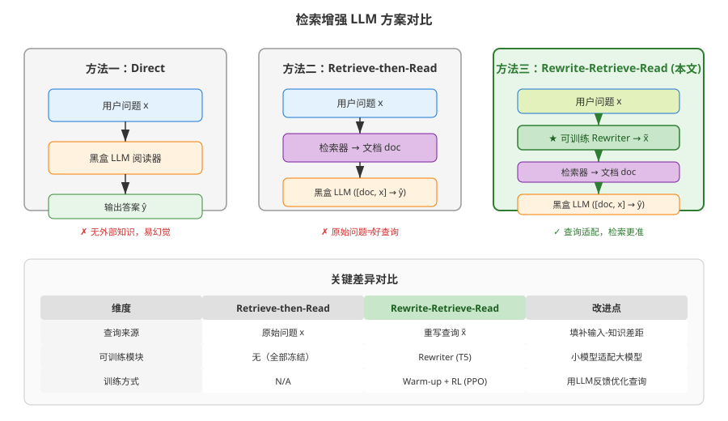
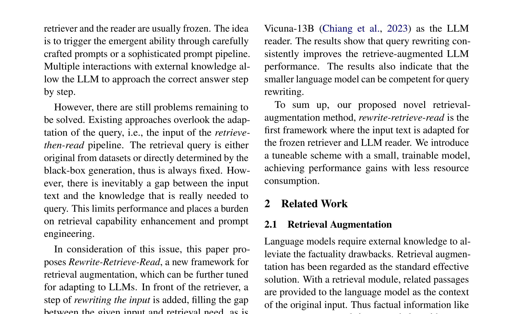
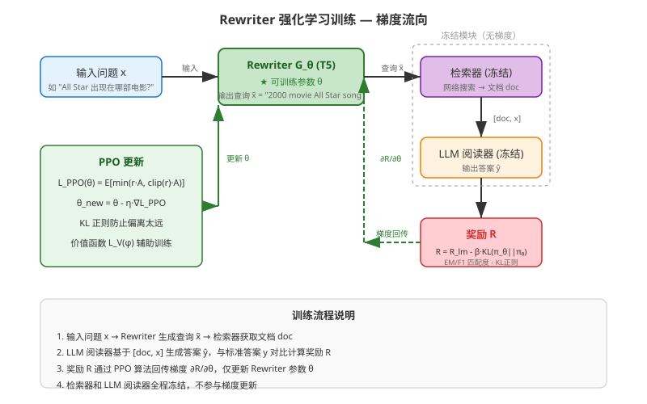
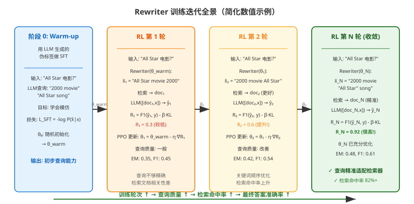
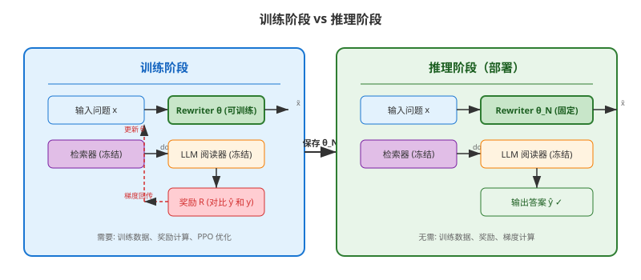
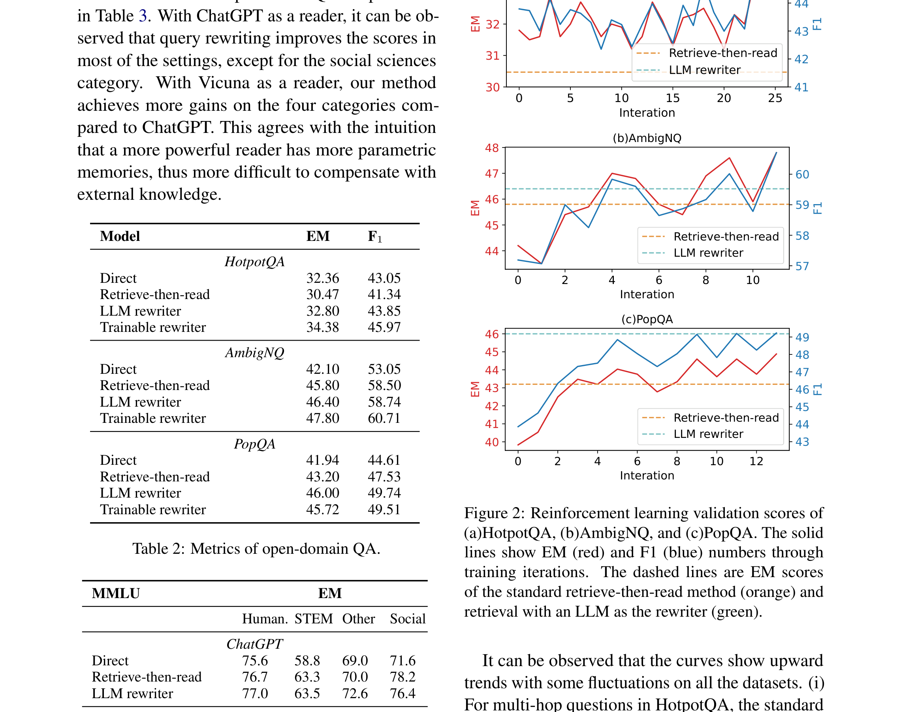
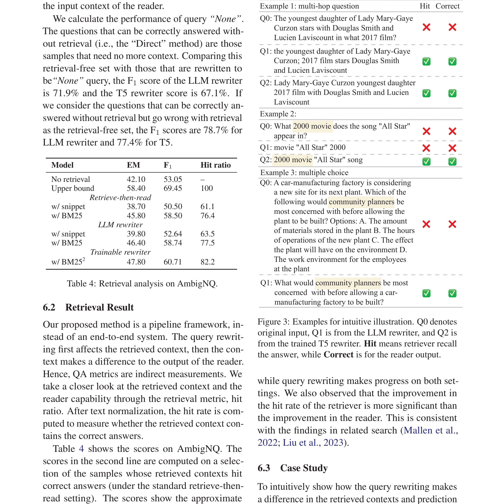

# 检索增强大语言模型的查询重写

> **原文**: Query Rewriting for Retrieval-Augmented Large Language Models
> **作者**: Xinbei Ma, Yeyun Gong, Pengcheng He, Hai Zhao, Nan Duan
> **发表时间**: 2023年5月
> **arXiv**: [2305.14283](https://arxiv.org/abs/2305.14283)

---

## 一句话总结

与其让大模型直接回答或拿原始问题去搜索，不如先**把问题"翻译"成更适合搜索的查询语句**，再检索、再回答——这个小小的改动就能显著提升回答准确率。

---

## 研究背景：为什么要做这个？

### 大模型的"知识焦虑"

想象一下，你问 ChatGPT："2024年诺贝尔文学奖得主是谁？"——它可能答不上来，或者更糟，**编造一个看似合理但完全错误的答案**。这就是大语言模型（LLM）著名的**幻觉（hallucination）**问题。

大模型的知识全部来自训练时"吃"进去的数据，一旦训练结束，它就"失忆"了——不知道之后发生的新闻、新出的研究、甚至刚发布的电影。这叫做**时间错位（temporal misalignment）**。

### 现有的解决方案：检索增强

为了解决这个问题，研究者提出了 **Retrieve-then-Read（先检索再阅读）** 框架：
1. 先把用户的问题拿去搜索相关文档
2. 再把问题和搜到的文档一起喂给大模型
3. 大模型基于这些外部知识来回答

这就像开卷考试——与其让考生死记硬背，不如允许他翻书找答案。

### 现有方案的问题

但这里有个关键漏洞：**用户的问题 ≠ 好的搜索查询**。

举个例子：
- 用户问："Lady Mary-Gaye Curzon 的小女儿和 Douglas Smith、Lucien Laviscount 一起演了哪部2017年的电影？"
- 如果直接把这个问题丢给搜索引擎，大概率搜不到有用的结果——太长了、太绕了
- 但如果拆成两个查询："Lady Mary-Gaye Curzon youngest daughter" 和 "2017 film Douglas Smith Lucien Laviscount"，分别搜索，就能精准找到答案

**现有方法要么调整检索器，要么调整阅读器，却忽略了最关键的一环——查询本身。**

### 现有方案对比

---

## 核心思路：这篇论文的"大招"是什么？

这篇论文提出了一个简单但优雅的新框架：**Rewrite-Retrieve-Read（重写-检索-阅读）**。

核心思想就一句话：**在检索之前，先把输入问题"重写"成更适合搜索的形式。**

这就像你去图书馆找书：
- 你不会把整句"我想知道那个写《百年孤独》的哥伦比亚作家还写过什么"直接告诉图书检索系统
- 你会先"翻译"成关键词："马尔克斯 作品 哥伦比亚"
- 这个"翻译"过程就是 **Query Rewriting（查询重写）**

论文的关键创新在于：
1. **不碰大模型**：LLM 作为黑盒阅读器完全冻结（很多场景下你只能通过 API 调用，无法修改）
2. **不碰检索器**：直接用现成的网络搜索引擎，不需要维护搜索索引
3. **只训练一个小模型**：用一个轻量级的 T5-large（7.7亿参数）作为"查询重写器"，专门学习如何把原始问题翻译成好的搜索查询

---

## 具体怎么做的？

### 整体框架：Rewrite-Retrieve-Read

整个流程分三步：

1. **Rewrite（重写）**：给定输入问题 $x$，生成一个或多个搜索查询 $\tilde{x}$
2. **Retrieve（检索）**：用 $\tilde{x}$ 去搜索引擎检索相关文档 $doc$
3. **Read（阅读）**：把 $[doc, x]$ 一起喂给 LLM，让它预测答案 $\hat{y}$

其中第一步的查询生成可以用 few-shot prompt 让 LLM 来示范——先让 LLM 当"老师"，展示如何把复杂问题拆成好的搜索查询。

### 可训练 Rewriter：让小模型学会"翻译"

直接用 LLM 重写查询当然可以，但成本高、速度慢。论文提出用一个小得多的模型（T5-large, 770M 参数）作为可训练的 Rewriter $G_\theta$，通过两阶段训练让它学会生成好查询。

#### 阶段一：Warm-up（预热）

**目标**：让小模型初步学会 LLM 的查询重写风格。

**做法**：
1. 用 LLM 重写训练集中的问题，生成一批"查询-问题"对
2. 过滤掉 LLM 自己都答错的样本（保证质量）
3. 用标准的监督学习微调 T5：

$$
\mathcal{L}_{\text{SFT}}(\theta) = -\mathbb{E}_{(x,\tilde{x}) \sim \hat{\mathcal{D}}_{\text{Train}}} [\log P_\theta(\tilde{x} | x)]
$$

**通俗理解**：这就是让 T5 做"填空题"——给它看原始问题，让它学着输出 LLM 会生成的查询。

#### 阶段二：Reinforcement Learning（强化学习）

预热后的小模型只是"模仿"了 LLM 的风格，但 LLM 生成的查询不一定是最优的。所以论文引入强化学习，让 Rewriter **根据最终答案的质量来调整自己的查询策略**。

**把 Rewriter 训练建模为马尔可夫决策过程（MDP）**：
- **状态 $S$**：当前已生成的查询前缀
- **动作 $A$**：下一个要生成的 token（词元）
- **策略 $\pi_\theta$**：Rewriter 模型本身
- **奖励 $R$**：最终答案与标准答案的匹配度

每生成一个 token 就是一步，直到生成结束标记（EOS），完成一轮（episode）。

**奖励函数设计**：

$$
R = R_{\text{lm}} - \beta \cdot \text{KL}(\pi_\theta \| \pi_0)
$$

- $R_{\text{lm}}$：LLM 阅读器预测答案的质量（开放域 QA 用 F1 + Hit 率，多项选择用 EM 精确匹配）
- $\text{KL}(\pi_\theta \| \pi_0)$：KL 散度，防止 Rewriter 偏离预热模型太远（避免"走火入魔"）
- $\beta$：正则化系数

**用 PPO（Proximal Policy Optimization）优化**：

$$
\mathcal{L}_{\text{PPO}}(\theta) = \mathbb{E}_{\tilde{x} \sim \pi_{\theta'}} \left[ \min\left( \frac{\pi_\theta(\tilde{x}|x)}{\pi_{\theta'}(\tilde{x}|x)} \cdot A, \ \text{clip}\left(\frac{\pi_\theta(\tilde{x}|x)}{\pi_{\theta'}(\tilde{x}|x)}, 1-\epsilon, 1+\epsilon\right) \cdot A \right) \right]
$$

其中 $A$ 是优势函数，用广义优势估计（GAE）计算：

$$
A_t = \sum_{l=0}^{T-t} (\gamma\lambda)^l \cdot \delta_{t+l}
$$

**最终损失函数**：

$$
\mathcal{L} = -\mathcal{L}_{\text{PPO}}(\theta) + c_v \cdot \mathcal{L}_V(\phi)
$$

### 梯度流向：训练时到底在更新什么？

关键点：
- **只有 Rewriter 的参数 $\theta$ 被更新**
- 检索器和 LLM 阅读器全程冻结，不参与梯度计算
- 奖励信号从 LLM 的输出端回传，经过 PPO 算法转化为对 Rewriter 的梯度

### 用一个具体例子走通全流程

#### 场景设定

假设用户问：**"All Star 这首歌出现在哪部2000年的电影里？"**

简化设定：
- Rewriter 词汇表只包含：`["2000", "movie", "All", "Star", "song", "film", "appear"]`
- 最大生成长度：4 个 token
- 学习率 $\eta = 0.1$

**初始状态**：Rewriter 经过 Warm-up，对每个 token 有初始概率分布：

| Token | 初始概率 $P(\text{token}|x)$ |
|-------|----------------------------|
| 2000 | 0.15 |
| movie | 0.20 |
| All | 0.25 |
| Star | 0.10 |
| song | 0.15 |
| film | 0.10 |
| appear | 0.05 |

#### Step 1: 前向传播（生成查询）

Rewriter 自回归生成查询 $\tilde{x}$：

- $t=1$：采样得到 "movie"（概率 0.20）
- $t=2$：基于 "movie"，采样得到 "All"（条件概率 0.22）
- $t=3$：基于 "movie All"，采样得到 "Star"（条件概率 0.18）
- $t=4$：基于 "movie All Star"，采样得到 "2000"（条件概率 0.25）

生成查询：**$\tilde{x}$ = "movie All Star 2000"**

#### Step 2: 检索与阅读

- 用 "movie All Star 2000" 搜索 → 检索到文档 $doc$（关于电影《Scary Movie》中 All Star 的使用）
- LLM 接收 $[doc, x]$ → 输出答案 $\hat{y}$ = "Scary Movie"
- 标准答案 $y$ = "Scary Movie"

#### Step 3: 奖励计算

$$
R_{\text{lm}} = \text{EM}(\hat{y}, y) = 1.0 \quad (\text{精确匹配!})
$$

$$
\text{KL}(\pi_\theta \| \pi_0) = 0.05 \quad (\text{偏离不大})
$$

$$
R = 1.0 - 0.1 \times 0.05 = 0.995 \quad (\text{很高的奖励!})
$$

#### Step 4: 反向传播与参数更新

PPO 计算优势函数 $A$，假设 $A = 0.8$（正优势，说明这个查询比平均水平好）。

PPO 策略梯度更新（简化）：

$$
\theta_{\text{new}} = \theta - \eta \cdot \nabla_\theta \mathcal{L}_{\text{PPO}}
$$

对于 "movie" 这个 token 的生成概率，梯度指向**增加其概率**（因为产生了高奖励）：

| Token | 旧概率 | 梯度方向 | 新概率 |
|-------|--------|---------|--------|
| movie | 0.20 | ↑ +0.04 | 0.24 |
| All | 0.25 | ↑ +0.03 | 0.28 |
| Star | 0.10 | ↑ +0.02 | 0.12 |
| 2000 | 0.15 | ↑ +0.03 | 0.18 |
| song | 0.15 | ↓ -0.01 | 0.14 |
| film | 0.10 | ↓ -0.02 | 0.08 |
| appear | 0.05 | ↓ -0.01 | 0.04 |

**关键观察**：高奖励的 token（movie, All, Star, 2000）概率上升，无关 token（song, film, appear）概率下降。

#### Step 5: 下一轮迭代

用更新后的 Rewriter 处理同一个问题：

- 新概率分布下，更可能生成 "movie All Star 2000" 或类似的优质查询
- 如果下一轮生成的查询是 "2000 movie All Star song"（关键词顺序更优）
- 检索到更精准的文档 → LLM 答案更确定 → 奖励更高 → 进一步优化

#### 推理阶段

训练完成后，部署时只需要：

推理阶段不需要任何训练组件——Rewriter 参数固定，直接前向传播生成查询，然后检索、回答。整个流程高效且可规模化。

> **小白tips**: 你可以把 Rewriter 想象成一个"搜索引擎翻译官"。它的工作不是回答问题，而是把人类自然语言的问题"翻译"成搜索引擎能听懂的关键词组合。训练的过程就是让它不断试错——生成的查询搜到了好文档、答对了问题，就奖励它；搜了一堆垃圾、答错了，就惩罚它。久而久之，它就学会了什么样的查询最有效。

---

## 效果怎么样？

### 开放域 QA 结果（ChatGPT 作为阅读器）

| 方法 | HotpotQA EM | HotpotQA F1 | AmbigNQ EM | AmbigNQ F1 | PopQA EM | PopQA F1 |
|------|-------------|-------------|------------|------------|----------|----------|
| Direct（无检索） | 32.36 | 43.05 | 42.10 | 53.05 | 41.94 | 44.61 |
| Retrieve-then-Read | 30.47 | 41.34 | 45.80 | 58.50 | 43.20 | 47.53 |
| LLM Rewriter | 32.80 | 43.85 | 46.40 | 58.74 | 46.00 | 49.74 |
| **Trainable Rewriter (本文)** | **34.38** | **45.97** | **47.80** | **60.71** | 45.72 | 49.51 |

**关键发现**：
- 在 HotpotQA（需要多跳推理的复杂问题）上，**标准检索反而降低了性能**（32.36 → 30.47 EM）！因为复杂问题直接当搜索查询效果很差
- 本文的可训练 Rewriter 在 HotpotQA 和 AmbigNQ 上均取得最佳效果
- PopQA 上 LLM Rewriter 略胜（46.00 vs 45.72 EM），因为 PopQA 包含大量长尾知识，LLM 的泛化能力更强

### 多项选择 QA 结果（MMLU）

| 方法 | Humanities | STEM | Other | Social |
|------|------------|------|-------|--------|
| **ChatGPT** | | | | |
| Direct | 75.6 | 58.8 | 69.0 | 71.6 |
| Retrieve-then-Read | 76.7 | 63.3 | 70.0 | 78.2 |
| LLM Rewriter | **77.0** | **63.5** | **72.6** | 76.4 |
| **Vicuna-13B** | | | | |
| Direct | 39.8 | 34.9 | 50.2 | 46.6 |
| Retrieve-then-Read | 40.2 | 39.8 | 55.2 | 50.6 |
| LLM Rewriter | 42.0 | 41.5 | 57.1 | 52.2 |
| **Trainable Rewriter (本文)** | **43.2** | **40.9** | **59.3** | **51.2** |

**关键发现**：
- 对于较弱的模型（Vicuna-13B），可训练 Rewriter 效果最好——**越弱的模型越需要好的查询来弥补知识不足**
- 对于强模型（ChatGPT），LLM Rewriter 已经足够好，因为 ChatGPT 本身记忆了大量知识，对外部检索的依赖较小

### RL 训练过程

从训练曲线可以看到：
- HotpotQA 和 AmbigNQ 经过 3-4 轮 RL 迭代后就超过了基线
- PopQA 的曲线有波动，说明长尾知识的查询重写更具挑战性
- RL 阶段有效弥补了 Warm-up 阶段伪标签蒸馏的不足

### 案例分析

论文给出了三个典型案例：

**案例 1（多跳问题）**：
- Q0: "Lady Mary-Gaye Curzon 的小女儿和 Douglas Smith、Lucien Laviscount 一起演了哪部2017年的电影？"
- Q1 (LLM): "the youngest daughter of Lady Mary-Gaye Curzon; 2017 film stars Douglas Smith and Lucien Laviscount" ✓
- Q2 (T5): "Lady Mary-Gaye Curzon youngest daughter 2017 film with Douglas Smith and Lucien Laviscount" ✓
- 两个重写都把关键词 "film" 提前，成功检索到女演员 Charlotte Calthorpe 的信息

**案例 2（数字歧义）**：
- Q0: "All Star 这首歌出现在哪部2000年的电影里？"
- Q1 (LLM): "movie 'All Star' 2000" ✗（数字 2000 被误解）
- Q2 (T5): "2000 movie 'All Star' song" ✓（保持 "2000 movie" 在一起，避免歧义）

---

## 论文的意义和局限

**主要贡献**：
1. **提出了一个新视角**：检索增强 LLM 的瓶颈不在检索器或阅读器，而在查询本身
2. **实用的训练方案**：用小型可训练模型适配冻结的大模型，无需访问 LLM 内部参数
3. **即插即用**：使用现成的网络搜索引擎，不需要维护搜索索引，天然支持最新知识

**局限性**：
1. **下游任务泛化 vs 专业化的权衡**：在特定任务上训练好的 Rewriter 可能不适用于其他任务
2. **单轮框架限制**：不同于多轮 LLM Agent 可以反复搜索和修正，本文专注于单轮 retrieve-then-read
3. **网络搜索引擎的局限**：对于专业领域（如医学、法律），专用知识库可能比通用搜索引擎更有效

---

## 读后感

这篇论文的重要性在于它**指出了一个被忽视的关键环节**——在检索增强 LLM 的流水线中，查询重写比检索器和阅读器本身更重要。就像给搜索引擎的"提示词工程"，好的查询能让普通检索器发挥超常水平。

对后续研究的影响是深远的：它启发了更多关注"查询质量"而非"检索算法"的工作，也为小模型适配大模型提供了一个优雅的范式——**不碰大模型，只训练一个轻量级的"中间人"**。

读完这篇论文，最应该记住的核心思想是：**当你的大模型回答不好时，也许问题不在模型本身，而在于你给它的外部知识不够好；而外部知识的质量，取决于你搜索时用的查询语句。**
