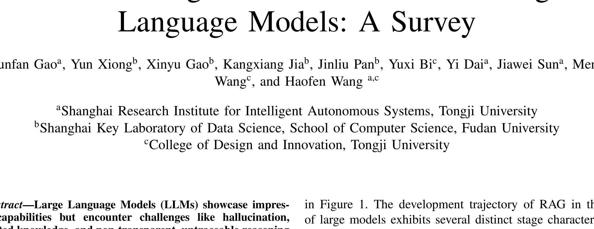
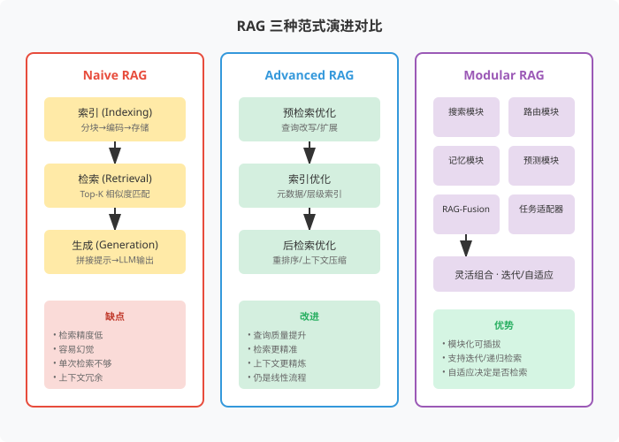
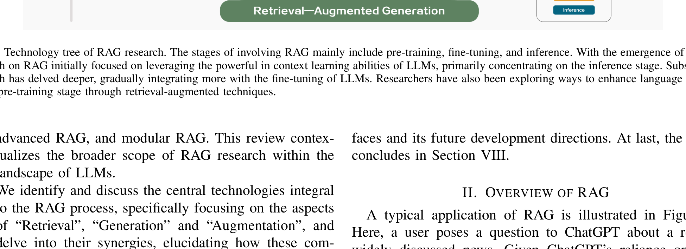
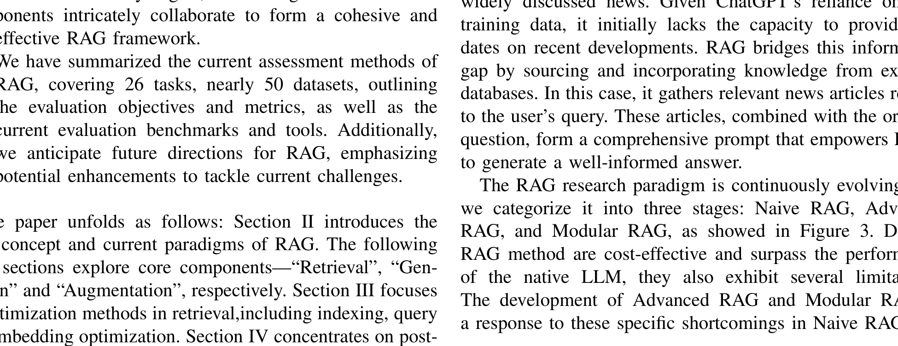
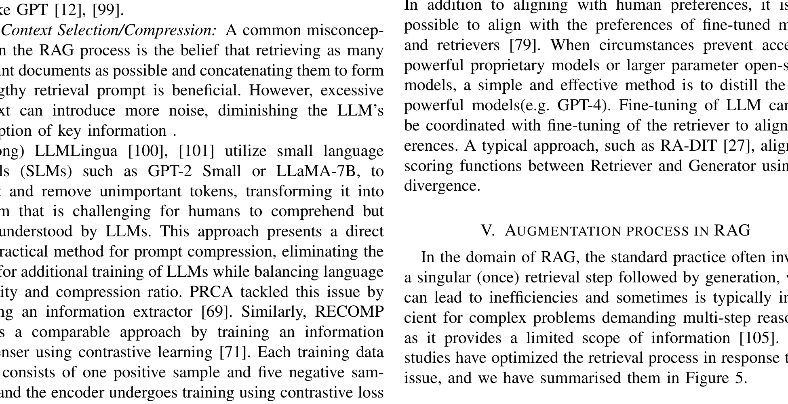
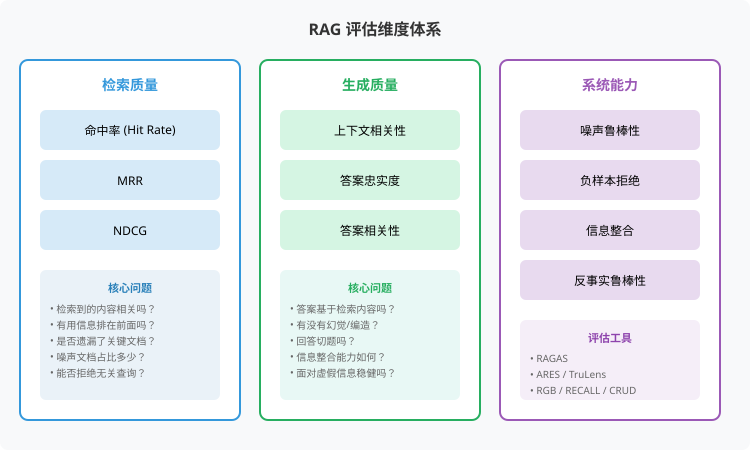
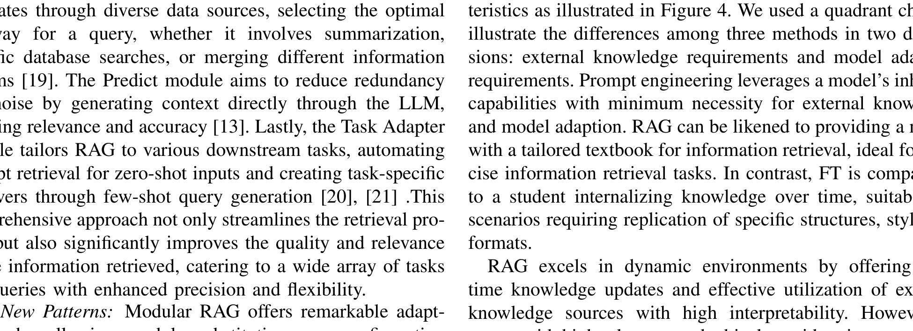
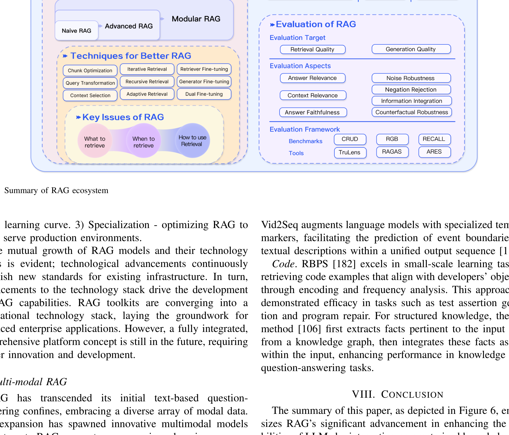

# 大语言模型的检索增强生成：综述

> **原文**: Retrieval-Augmented Generation for Large Language Models: A Survey
> **作者**: Yunfan Gao, Yun Xiong, Xinyu Gao, Kangxiang Jia, Jinliu Pan, Yuxi Bi, Yi Dai, Jiawei Sun, Meng Wang, Haofen Wang
> **发表时间**: 2023年12月
> **arXiv**: [2312.10997](https://arxiv.org/abs/2312.10997)

---

## 一句话总结

这篇论文系统梳理了 RAG（检索增强生成）技术从"简单检索+生成"到"模块化灵活组合"的演进路线，汇总了 100+ 项研究、26 种下游任务和约 50 个数据集，是目前 RAG 领域最全面的综述之一。

## 研究背景：为什么要做这个？

大语言模型（LLM，Large Language Model）虽然能力强大，但存在三个致命问题：

1. **幻觉（Hallucination）**：模型会"一本正经地胡说八道"，生成看似合理但事实错误的内容
2. **知识过时**：模型的 knowledge cutoff（知识截止点）固定在训练时，无法获取最新信息
3. **推理过程不透明**：你无法追溯模型给出某个答案的依据是什么

这就像一个记忆力超强但从不查资料的学生——他记得很多，但也会记错，而且不知道的东西就瞎编。

**RAG 的思路**：给模型配一本"教科书"（外部知识库）。当模型回答问题时，先从知识库里检索相关段落，再结合检索到的内容来生成答案。这样既利用了模型的语言能力，又保证了答案有据可查。

### 现有方案的问题

在 RAG 出现之前，让 LLM 获取外部知识主要有两种方案：

- **提示工程（Prompt Engineering）**：把知识直接塞进 prompt。缺点：上下文窗口有限，无法处理大量知识
- **微调（Fine-tuning）**：用新知识重新训练模型。缺点：成本高、知识更新需要重新训练、容易遗忘原有能力

RAG 的优势在于：**不需要修改模型参数**，只需在推理时动态检索外部知识，就能让模型"现查现用"。

## 核心思路：RAG 的三种范式演进

这篇论文最大的贡献是将 RAG 的发展梳理为三个清晰的阶段：

### 1. Naive RAG（朴素 RAG）

最简单的"检索-阅读-回答"三步走：

1. **索引（Indexing）**：把文档切块 → 用 Embedding 模型编码成向量 → 存入向量数据库
2. **检索（Retrieval）**：把用户问题也编码成向量 → 计算相似度 → 取最相似的 Top-K 个文档块
3. **生成（Generation）**：把问题 + 检索到的文档块拼成一个 prompt → 喂给 LLM → 生成答案

**缺点很明显**：
- 检索可能不准（精度/召回率低）
- 检索到的内容可能有噪声
- 单次检索对复杂问题不够用
- LLM 仍可能产生幻觉

### 2. Advanced RAG（高级 RAG）

在 Naive RAG 的基础上，增加了**检索前**和**检索后**的优化：

**检索前优化**：
- **查询改写**：用 LLM 把用户模糊的问题改写成更精确的查询
- **查询扩展**：生成多个相关查询，扩大检索范围
- **索引优化**：加入元数据（时间、作者等）、层级索引、知识图谱索引

**检索后优化**：
- **重排序（Reranking）**：用更精细的模型对检索结果重新排序
- **上下文压缩**：剔除检索内容中的无关部分，只保留关键信息

这就像从"直接搜索"升级为"先优化搜索词 → 搜索 → 筛选结果 → 再回答"。

### 3. Modular RAG（模块化 RAG）

最灵活的范式，不再局限于线性的"检索→生成"流程，而是引入了多个**可插拔的功能模块**：

新引入的模块包括：
- **搜索模块**：直接调用搜索引擎、数据库或知识图谱
- **路由模块**：根据问题类型选择最优的检索路径
- **记忆模块**：维护一个无界记忆池，支持迭代自我增强
- **预测模块**：LLM 直接生成上下文，减少冗余
- **RAG-Fusion**：多查询策略 + 智能重排序
- **任务适配器**：自动为零样本任务检索特定的检索器

新的流程模式包括：
- **Rewrite-Retrieve-Read**：LLM 先改写查询再检索
- **Generate-Read**：用 LLM 生成的内容替代检索
- **HyDE**：先生成假设性文档，再用假设文档去检索（答案到答案的相似度）
- **Self-RAG**：LLM 自主决定是否检索、何时停止

## 具体怎么做的？

### 检索（Retrieval）—— 如何找到对的资料？

检索是 RAG 的第一步，也是最关键的一步。论文从五个维度系统梳理了检索技术：

#### 1. 检索源（Retrieval Source）

| 数据类型 | 例子 | 特点 |
|---------|------|------|
| 非结构化 | 维基百科、网页文本 | 最常见，直接用 |
| 半结构化 | PDF（含表格）、Markdown | 需要解析结构 |
| 结构化 | 知识图谱（KG） | 实体-关系三元组，适合推理 |
| LLM 生成内容 | 模型自己生成的文档 | 新兴方向 |

**检索粒度**也很重要：从最小的 token、短语、句子，到命题（proposition，DenseX 提出的原子表达单元）、文档块（chunk）、完整文档。知识图谱则按实体、三元组、子图来检索。

#### 2. 索引优化（Indexing Optimization）

**分块策略（Chunking）**：
- 固定长度切分（100/256/512 token）→ 太粗暴，可能切断语义
- 递归切分 → 按段落、句子层级切
- 滑动窗口 → 相邻块有重叠，避免信息丢失
- **Small2Big**：用句子作为检索单元，但返回时带上周围的句子作为上下文

**元数据附加**：给每个文档块加上页码、文件名、作者、时间戳等信息，支持时间感知检索（比如"最近一年的资料"）。

**结构索引**：
- 层级索引：父子关系，父节点是子节点的摘要
- 知识图谱索引（KGP）：利用图谱的结构化关系进行检索

#### 3. 查询优化（Query Optimization）

**查询扩展**：
- **多查询（Multi-Query）**：用 LLM 生成多个相关查询
- **子查询分解（Sub-Query）**：把复杂问题拆成简单子问题（least-to-most prompting）
- **链式验证（Chain-of-Verification, CoVe）**：生成答案后自我验证

**查询转换**：
- **查询改写（Query Rewrite）**：RRR 模型学习将模糊查询改写为精确查询
- **HyDE（假设文档嵌入）**：先让 LLM 生成一个假设性答案，再用这个答案去检索相似文档——核心思想是"答案和答案之间的相似度"比"问题和文档之间的相似度"更有意义
- **Step-back Prompting**：把具体问题抽象为更高层次的概念再检索

**查询路由**：
- 元数据路由器：提取关键词 + 元数据过滤
- 语义路由器：根据语义相似度选择检索路径

#### 4. Embedding（向量化）

检索的核心是计算查询和文档的语义相似度。主流方案：

- **稀疏检索器**：BM25（基于词频的经典算法），擅长精确匹配和罕见实体
- **稠密检索器**：基于 BERT 等预训练语言模型，擅长语义理解
- **混合检索**：稀疏 + 稠密互补，效果最好

优秀的 Embedding 模型：AngIE、Voyage、BGE（受益于多任务指令微调）。评估基准：HuggingFace MTEB（8 个任务，58 个数据集）。

**微调 Embedding 模型**的方法：
- **LSR**（LM-supervised Retriever）：用 LLM 的结果作为监督信号微调检索器
- **LLM-Embedder**：双信号微调——硬标签（数据集标注）+ 软奖励（LLM 反馈）
- **REPLUG**：用 KL 散度（Kullback-Leibler Divergence，衡量两个概率分布差异的指标）训练检索器与 LLM 的概率分布对齐

#### 5. 适配器（Adapter）

在检索器和 LLM 之间加一个"桥梁"模块：
- **UPRISE**：从预构建的提示池中检索轻量级提示
- **AAR**：通用适配器，适配多种下游任务
- **PKG**：用指令微调让模型自己生成相关文档，替代检索器

### 生成（Generation）—— 如何用检索到的内容生成好答案？

#### 上下文管理（Context Curation）

检索到的文档块不能直接全部塞给 LLM，因为存在"**Lost in the middle**"问题——LLM 对长文本的开头和结尾记得清楚，但中间部分容易遗忘。

**解决方案**：

**重排序（Reranking）**：
- 基于规则：多样性、相关性、MRR（Mean Reciprocal Rank，平均倒数排名）
- 基于模型：SpanBERT、Cohere rerank、bge-reranker-large、GPT

**上下文压缩**：
- **LLMLingua**：用小语言模型（SLM，Small Language Model，如 GPT-2 Small、LLaMA-7B）检测并删除不重要的 token
- **RECOMP**：信息浓缩器，通过对比学习训练（1 个正样本 + 5 个负样本）
- **Filter-Reranker**：SLM 做过滤器 + LLM 做重排序器

#### LLM 微调

当 LLM 缺乏领域知识时，需要针对性微调：
- **SANTA**：三阶段训练框架，用对比学习优化结构化数据的检索
- **RA-DIT**：通过 KL 散度对齐检索器和生成器的评分函数
- **RL 对齐**：用人类偏好、检索器偏好进行强化学习对齐
- **知识蒸馏**：从 GPT-4 等强大模型蒸馏知识

### 增强流程（Augmentation）—— 如何让检索和生成协同工作？

论文总结了三种增强流程：

#### 1. 迭代检索（Iterative Retrieval）

反复执行"检索→生成→再检索→再生成"的循环。

- **ITER-RETGEN**：将"检索增强生成"和"生成增强检索"协同起来——用生成结果来指导下一步检索
- **风险**：语义不连续、无关信息累积

#### 2. 递归检索（Recursive Retrieval）

逐步细化查询，把复杂问题拆解为子问题。

- **IRCoT**：用思维链（CoT，Chain-of-Thought，让模型逐步推理的方法）指导检索，检索结果又反过来完善思维链
- **ToC（Tree of Clarifications）**：为模糊查询创建澄清树
- **多跳检索**：针对图结构数据的多步推理

#### 3. 自适应检索（Adaptive Retrieval）

让 LLM 自主决定是否检索、何时停止。

- **FLARE**：监控生成置信度（token 概率），低于阈值时触发检索
- **Self-RAG**：引入"反思 token"（retrieve、critic），在片段级进行 beam search（束搜索，一种保留多个候选路径的搜索策略），critic 评分更新细分分数
- **WebGPT**：强化学习框架，用特殊 token 控制搜索、浏览、引用动作
- **Graph-Toolformer**：LLM 主动使用检索器，配合 Self-Ask 和 few-shot prompt

## 效果怎么样？

### 下游任务覆盖

论文覆盖了 **26 种下游任务**和约 **50 个数据集**：

| 任务类型 | 子任务 | 代表数据集 |
|---------|--------|-----------|
| 问答（QA） | 单跳 | NQ, TriviaQA, SQuAD, WebQ |
| 问答（QA） | 多跳 | HotpotQA, 2WikiMultiHopQA, MuSiQue |
| 问答（QA） | 长回答 | ELI5, NarrativeQA, ASQA |
| 问答（QA） | 领域 | Qasper, COVID-QA, CMB |
| 问答（QA） | 多选 | QuALITY, ARC, CommonsenseQA |
| 对话 | - | Wizard of Wikipedia, KBP |
| 信息抽取 | 事件论元 | WikiEvent, RAMS |
| 信息抽取 | 关系抽取 | T-REx, ZsRE |
| 推理 | 常识/思维链 | HellaSwag, CSQA |
| 其他 | 综合 | MMLU, GSM8K, FEVER |

### 评估框架

RAG 的评估分为两大目标：

**检索质量评估**：
- 命中率（Hit Rate）：检索结果中是否包含正确答案
- MRR（Mean Reciprocal Rank）：正确答案排名的倒数的平均值
- NDCG（Normalized Discounted Cumulative Gain）：考虑排名位置的加权相关性

**生成质量评估**：
- 上下文相关性（Context Relevance）：检索到的内容是否与问题相关
- 答案忠实度（Answer Faithfulness）：答案是否忠实于检索内容（不编造）
- 答案相关性（Answer Relevance）：答案是否切题

**系统能力评估**：
- 噪声鲁棒性：检索结果中有噪声时，答案质量是否下降
- 负样本拒绝：没有相关信息时，能否拒绝回答而不是瞎编
- 信息整合：能否从多个文档中综合出完整答案
- 反事实鲁棒性：检索内容包含虚假信息时，能否识别

主流评估工具：
| 工具 | 特点 |
|------|------|
| **RAGAS** | 用 LLM 作为裁判评估质量分数 |
| **ARES** | 自动化 RAG 系统评估 |
| **TruLens** | 追踪 RAG 系统的可追溯性 |
| **RGB** | 评估噪声鲁棒性、负样本拒绝、信息整合、反事实鲁棒性 |
| **RECALL** | 专注反事实鲁棒性 |
| **CRUD** | 创造性生成、知识密集型 QA、纠错、摘要 |

### RAG vs 微调

论文做了一个形象的比喻：
- **RAG 就像"教科书"**：需要时翻一翻，信息实时更新，可以追溯来源
- **微调就像"内化知识"**：学进去了但更新成本高，而且容易遗忘旧知识

实验表明：RAG 在**现有知识**和**新知识**上都持续优于无监督微调。两者是**互补**的，结合使用效果最佳。

## 未来展望

论文指出了 RAG 领域的几个重要研究方向：

### 1. RAG vs 长上下文（Long Context）

现在 LLM 的上下文窗口已经能处理 20 万+ token，但 RAG 仍然不可替代：
- **推理效率**：长上下文推理速度慢，RAG 只检索关键部分更高效
- **可追溯引用**：RAG 能提供答案来源，长上下文做不到
- **可观察的推理过程**：RAG 的检索步骤是透明的

同时，长上下文也让 RAG 能处理更复杂的整合/总结类问题。

### 2. RAG 鲁棒性

一个反直觉的发现：**包含无关文档反而可能提高 30%+ 的准确率**（Cuconasu 等）。这说明"错误信息比没有信息更糟"这个直觉可能不完全正确，RAG 对噪声的容忍度比想象中高。

### 3. 混合方法

RAG + 微调的组合是趋势：
- 顺序组合：先微调再 RAG，或先 RAG 再微调
- 交替训练：RAG 和微调交替进行
- 端到端联合训练：同时优化检索器和生成器

引入小语言模型（SLM）也是方向，比如 CRAG 训练了一个轻量级的检索评估器。

### 4. RAG 的缩放定律（Scaling Laws）

RAG 模型的参数规模远落后于 LLM，是否存在**逆缩放定律**（Inverse Scaling Law）——小模型反而比大模型表现更好？这是一个开放问题。

### 5. 生产级 RAG

实际部署面临的挑战：
- 检索效率：大规模知识库中的文档召回
- 数据安全：企业级 RAG 的权限管理
- 技术栈：LangChain、LlamaIndex、Flowise AI（低代码）、HayStack、Cohere Coral
- 趋势：定制化、简化、专业化

### 6. 多模态 RAG

RAG 正在扩展到非文本领域：
- **图像**：RA-CM3（文本+图像检索/生成）、BLIP-2（冻结图像编码器 + LLM）
- **音频/视频**：GSS（音频片段拼接）、UEOP（端到端语音识别）
- **代码**：RBPS（代码示例检索）、CoK（知识图谱事实提取）

## 论文的意义和局限

**主要贡献**：
1. **系统分类**：首次将 RAG 明确划分为 Naive → Advanced → Modular 三个范式，为后续研究提供了清晰的框架
2. **全面汇总**：覆盖 100+ 项研究、26 种任务、50+ 数据集，是目前最完整的 RAG 综述
3. **评估体系**：提出了系统的 RAG 评估维度和工具对比，填补了评估方法论的空白
4. **前瞻展望**：指出了 RAG 与长上下文、多模态、缩放定律等前沿方向的交叉点

**局限性**：
1. 作为综述论文，缺乏原创性的实验验证
2. 对 RAG 与微调的定量对比不够深入
3. 多模态 RAG 部分相对简略，仅做了初步梳理
4. 生产部署的工程实践细节较少

## 读后感

这篇论文是进入 RAG 领域的**最佳入门指南**。它最大的价值不在于提出了某个新技术，而在于**把散落在各处的 RAG 研究整理成了一张清晰的地图**——让你知道 RAG 从哪里来、现在在哪里、可能往哪里去。

对于初学者来说，最应该记住的是：**RAG 不是单一技术，而是一个范式家族**。从最简单的"检索+生成"到最复杂的模块化自适应系统，RAG 的核心思想始终是**让语言模型在需要时能够查阅外部知识**。理解了这一点，就能看懂各种 RAG 变种的本质。

对于实践者来说，论文的评估维度体系（噪声鲁棒性、负样本拒绝、信息整合、反事实鲁棒性）是构建和评估 RAG 系统的实用 checklist。

> **小白 tips**: 如果你只记住一个概念，那就是 RAG 的三阶段演进——Naive（简单三步走）→ Advanced（前后优化）→ Modular（模块化灵活组合）。这就像从"骑自行车"到"骑摩托车"再到"开汽车"的进化过程，越来越智能、越来越灵活。
