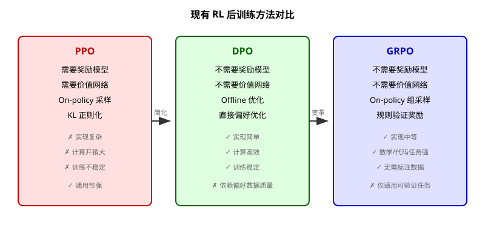
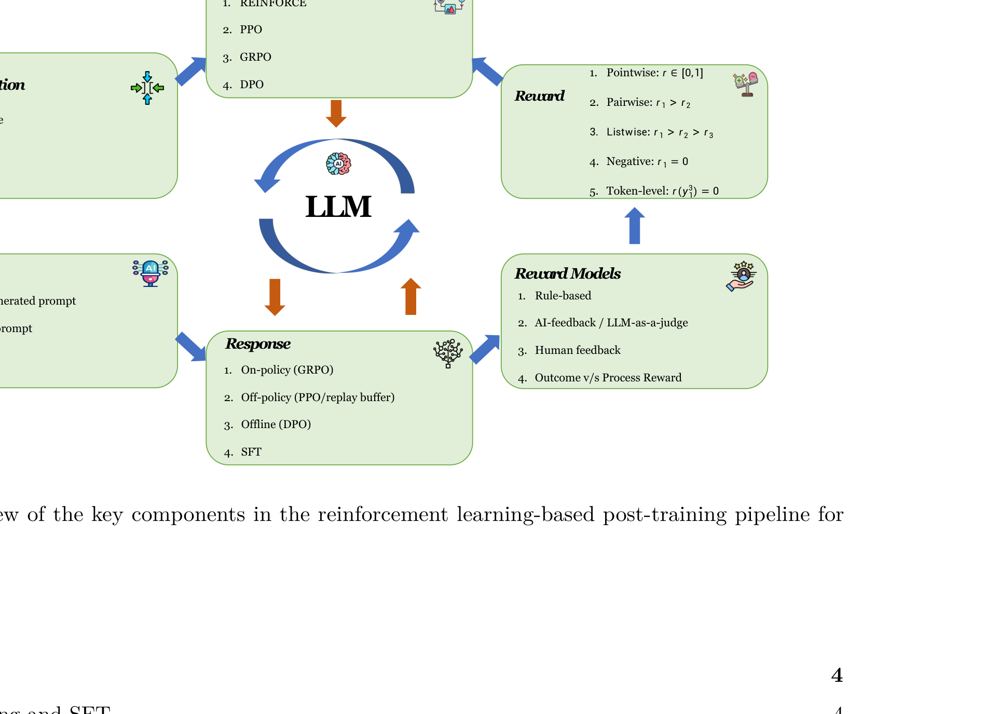
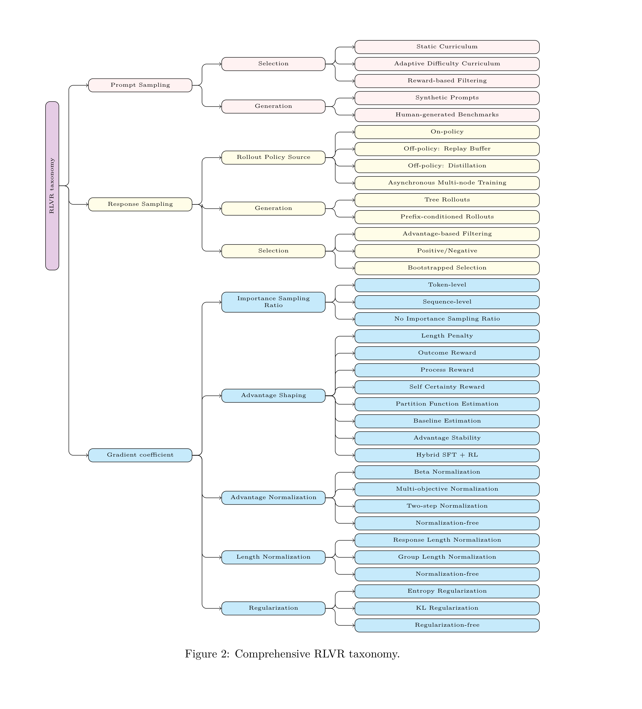
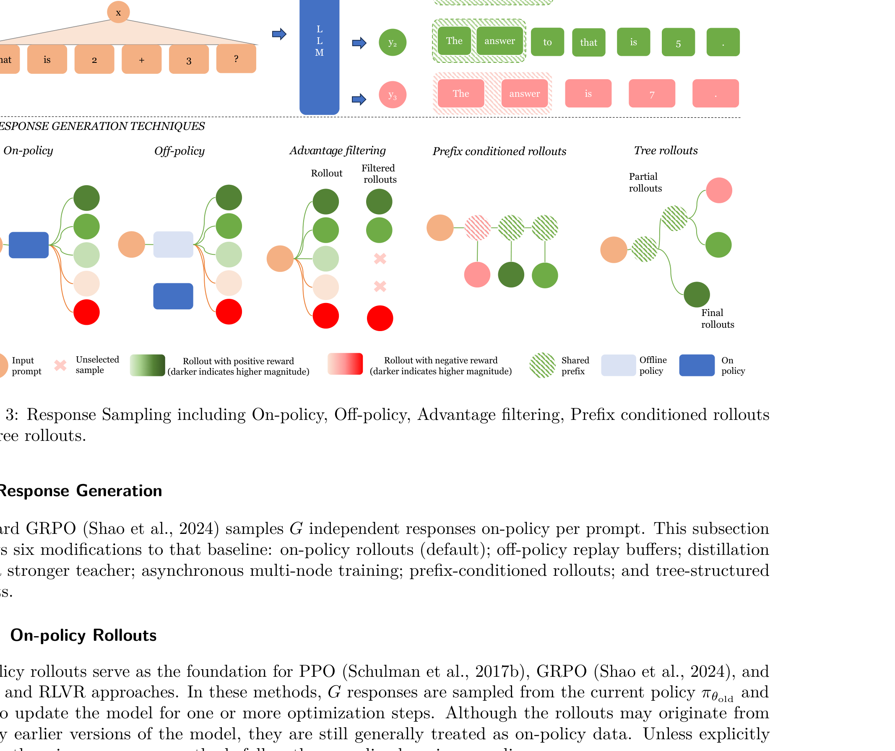
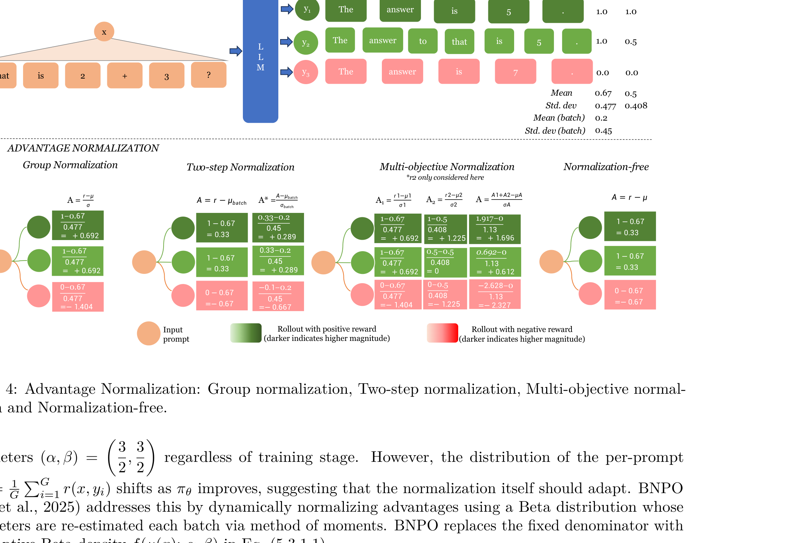
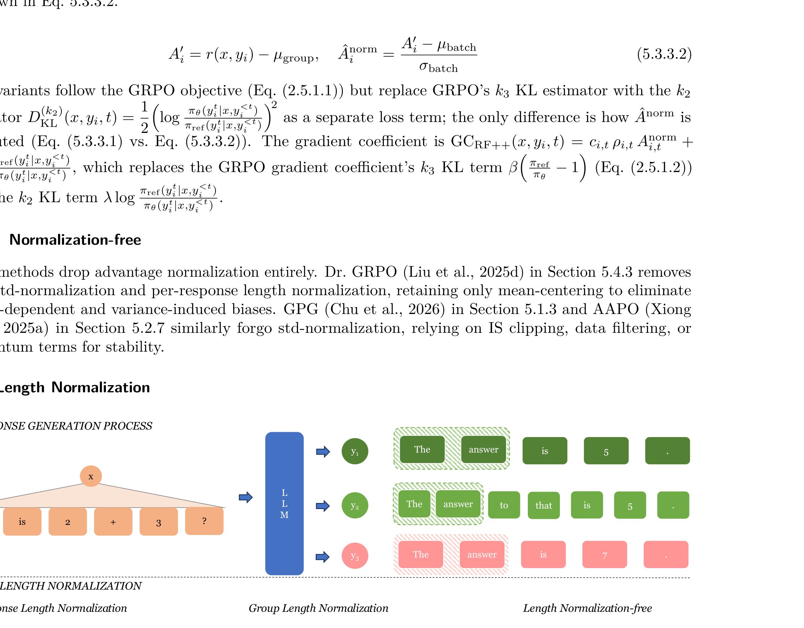
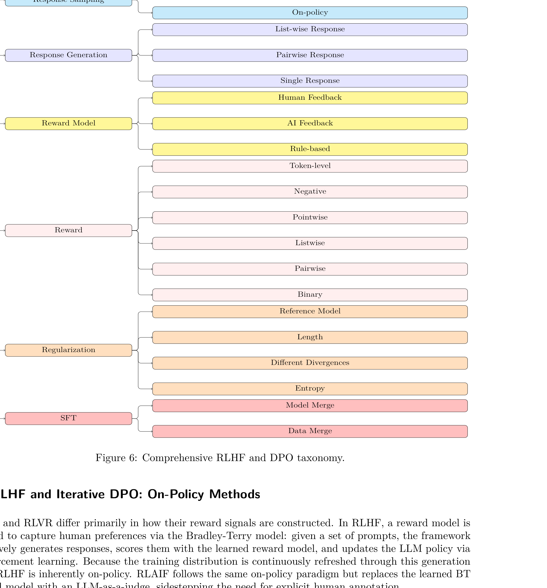
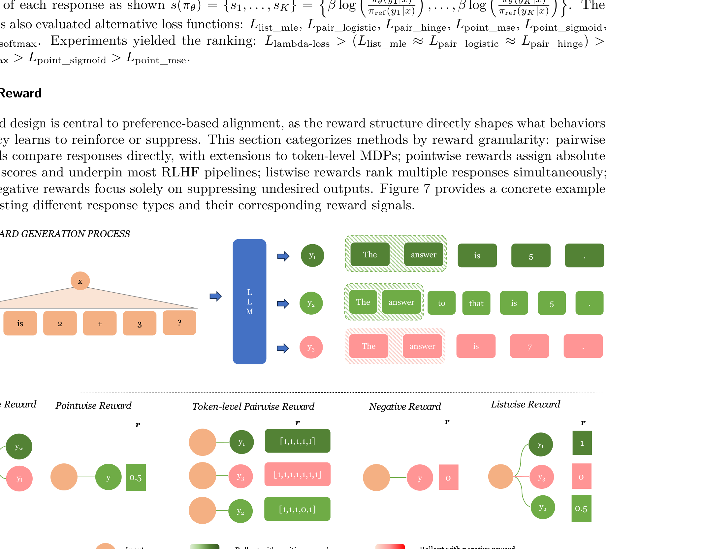
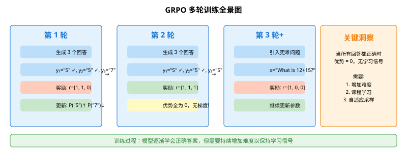
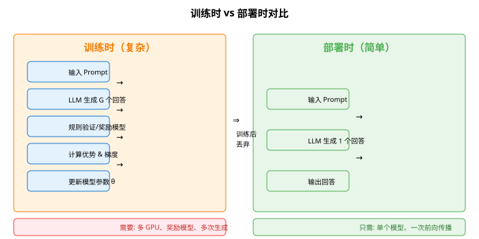

# 大语言模型后训练强化学习综述

> **原文**: Reinforcement Learning for LLM Post-Training: A Survey
> **作者**: Zhichao Wang, Kiran Ramnath, Bin Bi, Shiva Kumar Pentyala, Sougata Chaudhuri, Shubham Mehrotra, Zixu (James) Zhu, Xiang-Bo Mao, Sitaram Asur, Na (Claire) Cheng
> **发表时间**: 2024年7月（2026年4月更新至v3版本）
> **arXiv**: https://arxiv.org/abs/2407.16216

---

## 一句话总结

这篇论文系统地梳理了**用强化学习（RL）给大语言模型（LLM）做后训练**的各种方法，把从经典的 PPO、到流行的 DPO、再到最新的 GRPO 等看似不同的技术，统一到一个数学框架下，让研究者能清楚地看到它们之间的联系和区别。

## 研究背景：为什么要做这个？

### 大模型训练的"三步走"

想象你要培养一个超级聪明的助手，训练过程大概分三步：

1. **预训练（Pretraining）**：让模型读海量书籍、网页，学会"说话"——这是**最大似然估计（MLE, Maximum Likelihood Estimation）**，简单说就是"猜下一个词"
2. **监督微调（SFT, Supervised Fine-Tuning）**：给模型看一些高质量的问答示例，教它"好好说话"
3. **后训练（Post-Training）**：这一步最关键——让模型学会**对齐人类价值观**，不说有害内容，在数学、编程等专业领域表现更好

### 问题出在哪里？

预训练和 SFT 训练出来的模型虽然能"说话"，但仍有两大问题：

- **对齐问题**：可能生成有害、偏见或不安全的输出
- **能力问题**：在数学推理、代码生成等需要"一步步思考"的任务上表现不佳

**强化学习后训练**就是解决这些问题的关键手段。但问题是——这个领域发展太快了！从 2022 年的 RLHF（基于人类反馈的强化学习），到 2023 年的 DPO（直接偏好优化），再到 2024 年的 GRPO（组相对策略优化），方法层出不穷，却**缺乏一个统一的技术视角来对比它们**。

### 现有方案的问题

这篇论文的核心动机就是：**填补这个空白**，提供一个技术上足够深入的综述，让研究者和工程师能真正理解各种方法的本质区别。

## 核心思路：这篇论文的"大招"是什么？

### 统一策略梯度框架（Unified Policy Gradient Framework）

论文最大的贡献是推导出了一个**统一的策略梯度框架**，把预训练、SFT、RLHF、RLVR 全部纳入同一个数学公式中。

从 Figure 1 可以看到，整个 RL 后训练流水线由**六个相互关联的模块**组成：

1. **Prompt（提示词）**：人类生成的或合成生成的问题
2. **Response（响应）**：模型生成的回答，分为 on-policy（当前策略生成）、off-policy（历史回放）、offline（离线数据）、SFT 四种来源
3. **Reward Models（奖励模型）**：给回答打分，可以是规则-based、AI 反馈、人类反馈，或者结果奖励 vs 过程奖励
4. **Reward（奖励信号）**：打分的形式，包括逐点（pointwise）、成对（pairwise）、列表（listwise）、负向（negative）、token 级别五种
5. **Reinforcement Learning（强化学习算法）**：REINFORCE、PPO、GRPO、DPO 等
6. **Regularization（正则化）**：防止模型偏离太远，包括散度（divergence）和熵（entropy）正则化

**关键 insight**：所有这些方法，本质上都是在优化同一个目标函数，只是在不同模块上做了不同的设计选择。

### 三大正交设计轴

论文将所有 surveyed 的方法沿着**三个正交的设计轴**进行分解：

1. **Prompt Sampling（提示词采样）**：怎么选训练用的问题？
2. **Response Sampling（响应采样）**：怎么生成和筛选回答？
3. **Gradient Coefficient（梯度系数）**：怎么计算更新梯度？

这种分解方式让不同方法之间的对比变得**直接且可操作**。

## 具体怎么做的？

### 统一后训练框架（UPT）

论文从数学上推导了一个统一的优化目标：

$$J(\theta) = \mathbb{E}_{x \sim \mathcal{D}}\left[\mathbb{E}_{y \sim \pi_\theta(\cdot|x)}[r(x, y)] - \beta \text{KL}(\pi_\theta(\cdot|x) \parallel \pi_{\text{ref}}(\cdot|x))\right], \quad \beta \geq 0$$

这个公式的含义是：**最大化奖励，同时用 KL 散度限制新策略不要偏离参考策略太远**。

- 当 $\beta = 0$ 时，退化为纯 RL（REINFORCE）
- 当奖励是 MLE 形式时，退化为 SFT
- 当奖励来自人类偏好时，就是 RLHF
- 当奖励来自可验证的规则时，就是 RLVR

### RLVR：用可验证奖励做强化学习

**RLVR（Reinforcement Learning with Verifiable Rewards）** 是近年来最热门的方向之一，典型代表是 GRPO。它的核心思想是：**对于有明确对错的任务（如数学题、编程题），可以直接用规则判断对错，不需要训练奖励模型**。

#### Prompt Sampling（提示词采样）

怎么选择训练用的问题？论文总结了三种策略：

1. **Static Curriculum（静态课程）**：按固定顺序或难度分布采样
2. **Adaptive Difficulty Curriculum（自适应难度课程）**：根据模型当前表现动态调整难度，保持约 50% 的成功率（学习信号最强）
3. **Reward-based Filtering（基于奖励的过滤）**：过滤掉那些"所有回答都对"或"所有回答都错"的提示词，只保留有区分度的

#### Response Sampling（响应采样）

Figure 3 展示了五种响应生成技术：

1. **On-policy（在线策略）**：用当前模型生成回答，是 PPO、GRPO 的基础
2. **Off-policy（离线策略）**：从历史回放缓冲区或更强的教师模型获取回答，提高数据效率
3. **Advantage Filtering（优势过滤）**：只保留最有信息量的回答（高优势或低优势）
4. **Prefix-conditioned Rollouts（前缀条件展开）**：从共享前缀分支生成多个完成
5. **Tree Rollouts（树形展开）**：构建分支树，选择性扩展部分路径

#### Gradient Coefficient（梯度系数）

这是论文分析最深入的部分。每个方法的本质区别在于**如何计算梯度系数（GC, Gradient Coefficient）**。

**优势归一化（Advantage Normalization）** 是核心技巧之一：

Figure 4 对比了四种归一化策略：

| 方法 | 公式 | 特点 |
|------|------|------|
| Group Normalization | $A = \frac{r - \mu}{\sigma}$ | GRPO 默认方法，组内标准化 |
| Two-step Normalization | 先减组均值，再跨批次标准化 | 跨提示词稳定性更好 |
| Multi-objective Normalization | 每个奖励信号单独标准化后求和 | 适合多目标场景 |
| Normalization-free | $A = r - \mu$ | 只减均值不除标准差，保留原始差异 |

**长度归一化（Length Normalization）** 解决的是不同长度回答的梯度聚合问题：

| 方法 | 权重 | 特点 |
|------|------|------|
| Response Length | $\frac{1}{|y_i|}$ | 每个回答平等对待，但偏向短回答 |
| Group Length | $\frac{1}{\sum_i |y_i|}$ | 长回答获得更多梯度权重 |
| Length-free | $1$ | 不做缩放，每个 token 权重为 1 |

### RLHF 和 DPO：基于偏好的方法

Figure 6 展示了 RLHF 和 DPO 的分类体系。RLHF 和 RLVR 的核心区别在于**奖励信号的构建方式**：

- **RLHF**：训练一个奖励模型来捕捉人类偏好（通过 Bradley-Terry 模型），然后在线生成-打分-更新
- **DPO**：离线方法，直接在固定的偏好数据集上优化策略，绕过显式奖励模型

**DPO 的核心公式**：

$$\mathcal{L}_{\text{DPO}}(\theta) = -\mathbb{E}_{(x, y_w, y_l) \sim \mathcal{D}}\left[\log \sigma\left(\beta \log \frac{\pi_\theta(y_w|x)}{\pi_{\text{ref}}(y_w|x)} - \beta \log \frac{\pi_\theta(y_l|x)}{\pi_{\text{ref}}(y_l|x)}\right)\right]$$

其中 $y_w$ 是偏好的回答，$y_l$ 是不偏好的回答。DPO 巧妙地消去了奖励模型，直接在策略上做优化。

### 奖励信号设计

Figure 7 展示了五种奖励信号类型：

1. **Pairwise Reward（成对奖励）**：比较两个回答，$r_1 > r_2$，DPO 的基础
2. **Pointwise Reward（逐点奖励）**：给每个回答独立打分，$r \in [0,1]$
3. **Token-level Pairwise Reward（Token 级成对奖励）**：在 token 级别做比较，更细粒度
4. **Negative Reward（负向奖励）**：只关注抑制不良输出，$r_1 = 0$
5. **Listwise Reward（列表奖励）**：同时排序多个回答，$r_1 > r_2 > r_3$

### 用一个具体例子走通 GRPO 全流程

#### 场景设定

假设我们有一个简单的数学问题：

- **输入**：$x = \text{"What is } 2 + 3 \text{?"}$
- **模型**：一个极简的语言模型，词表只有 5 个 token：`{"The", "answer", "is", "5", "7"}`
- **策略**：$\pi_\theta$ 输出每个 token 的概率分布
- **参考策略**：$\pi_{\text{ref}}$ 是 SFT 后的模型
- **组大小**：$G = 3$，每个 prompt 生成 3 个回答

初始策略（简化）：
$$\pi_\theta(\cdot|x) = \begin{bmatrix} 0.3 \\ 0.3 \\ 0.2 \\ 0.1 \\ 0.1 \end{bmatrix} \text{ 对应 } \begin{bmatrix} \text{"The"} \\ \text{"answer"} \\ \text{"is"} \\ \text{"5"} \\ \text{"7"} \end{bmatrix}$$

#### Step 1: 生成响应

模型生成 3 个回答（简化为单 token 输出）：

| 回答 | 生成概率 | 奖励（规则验证） |
|------|---------|----------------|
| $y_1 = \text{"5"}$ | 0.1 | $r_1 = 1$（正确） |
| $y_2 = \text{"5"}$ | 0.1 | $r_2 = 1$（正确） |
| $y_3 = \text{"7"}$ | 0.1 | $r_3 = 0$（错误） |

#### Step 2: 计算优势（Group Normalization）

组均值：$\mu = \frac{1 + 1 + 0}{3} = 0.667$

组标准差：$\sigma = \sqrt{\frac{(1-0.667)^2 + (1-0.667)^2 + (0-0.667)^2}{3}} = 0.471$

优势值：
$$A_1 = A_2 = \frac{1 - 0.667}{0.471} = 0.707$$
$$A_3 = \frac{0 - 0.667}{0.471} = -1.414$$

#### Step 3: 计算梯度

GRPO 的梯度系数为：
$$\text{GC}(x, y_i, t) = \frac{\pi_\theta(y_i|x)}{\pi_{\text{ref}}(y_i|x)} \cdot A_i$$

假设参考策略 $\pi_{\text{ref}}$ 与 $\pi_\theta$ 相同（简化），则重要性采样比为 1：

对于 $y_1$（正确回答）：
$$\nabla_\theta \mathcal{L} \propto -0.707 \cdot \nabla_\theta \log \pi_\theta(y_1|x)$$

对于 $y_3$（错误回答）：
$$\nabla_\theta \mathcal{L} \propto +1.414 \cdot \nabla_\theta \log \pi_\theta(y_3|x)$$

**直观理解**：
- 正确回答的梯度是**负的**→ 增加其概率
- 错误回答的梯度是**正的**→ 减少其概率
- 错误回答的梯度幅度更大（1.414 > 0.707），因为"纠错"比"鼓励"更重要

#### Step 4: 参数更新

用 SGD 更新（学习率 $\eta = 0.1$）：

$$\theta_{\text{new}} = \theta - \eta \cdot \nabla_\theta \mathcal{L}$$

更新后的概率分布（简化计算）：

| Token | 更新前概率 | 梯度方向 | 更新后概率 | 变化 |
|-------|-----------|---------|-----------|------|
| "5" | 0.1 | 增加 | 0.17 | ↑ |
| "7" | 0.1 | 减少 | 0.04 | ↓ |
| 其他 | 0.8 | 微调 | 0.79 | → |

**验证**：正确回答 "5" 的概率从 0.1 上升到 0.17，错误回答 "7" 的概率从 0.1 下降到 0.04。模型在**朝正确的方向学习**！

#### 多轮训练全景图

#### Step 5: 部署/推理

训练完成后，部署时直接使用更新后的策略 $\pi_\theta$ 生成回答，**不需要奖励模型、不需要生成多个回答**——这就是 RL 后训练的魅力：训练时复杂，推理时简单。

> **小白tips**: GRPO 的核心思想其实很简单——**让模型自己和自己比较**。生成一组回答，好的提高概率，坏的降低概率。不需要额外的奖励模型，只要有规则能判断对错就行（比如数学题的答案是否正确）。这就像是学生做题后自己对答案，做对的题加深印象，做错的题减少犯错概率。

## 效果怎么样？

### 方法对比总览

论文附录提供了各方法的详细实现对比，核心发现包括：

| 维度 | PPO | GRPO | DPO |
|------|-----|------|-----|
| 奖励模型 | 需要训练 | 不需要（规则验证） | 不需要（偏好数据） |
| 采样方式 | On-policy | On-policy（组采样） | Offline |
| 计算效率 | 低（需价值网络） | 中（组内归一化） | 高（无 RL 循环） |
| 适用场景 | 通用 | 数学/代码等可验证任务 | 人类偏好对齐 |
| 实现复杂度 | 高 | 中 | 低 |

### 关键发现

1. **GRPO 在数学和代码任务上表现优异**：因为可以直接用规则验证，不需要训练奖励模型
2. **DPO 实现简单但依赖高质量偏好数据**：数据质量决定上限
3. **混合方法（Hybrid）是趋势**：结合 SFT 和 RL 的优势，如 SRFT、HPT
4. **归一化策略对稳定性至关重要**：Beta Normalization、Two-step Normalization 能显著降低梯度方差

## 论文的意义和局限

**主要贡献**：

1. **统一框架**：首次将预训练、SFT、RLHF、RLVR 纳入同一个策略梯度框架，揭示了它们的内在联系
2. **标准化记号**：引入统一的数学记号，使不同方法的直接对比成为可能
3. **三轴分解**：沿 Prompt 采样、Response 采样、梯度系数三个正交轴分解所有方法，提供了清晰的分析视角
4. **全面附录**：提供了每个方法的实现细节和实验结果的详细对比表

**局限性**：

1. **理论分析多于实证**：作为综述，缺乏对新方法的实证验证
2. **更新速度快**：RL 后训练领域发展极快，论文发布后可能已有新方法出现（v3 版本已更新到 2026 年 4 月）
3. **计算资源门槛**：大部分方法需要大量 GPU 资源，对小型团队不友好

## 读后感

这篇论文是**进入 RL 后训练领域的最佳入口**。它不像一般综述那样泛泛而谈，而是深入到数学公式和实现细节层面，让读者真正理解每个方法"为什么这样设计"。

对于初学者，最应该记住的是：**所有 RL 后训练方法本质上都是在做同一件事——用梯度更新让模型生成更好的回答，区别只在于如何计算这个梯度**。理解了这一点，再看 PPO、DPO、GRPO 等方法，就会发现它们只是同一个框架下的不同"配置"而已。

这篇论文也揭示了一个重要趋势：**RLVR（可验证奖励）正在成为数学、代码等任务的主流方法**，因为它绕过了奖励模型训练的难题，直接用规则验证。而 DPO 等偏好优化方法则在人类对齐任务上继续发挥作用。未来很可能是**混合方法**的时代——根据不同任务类型选择最合适的训练策略。
