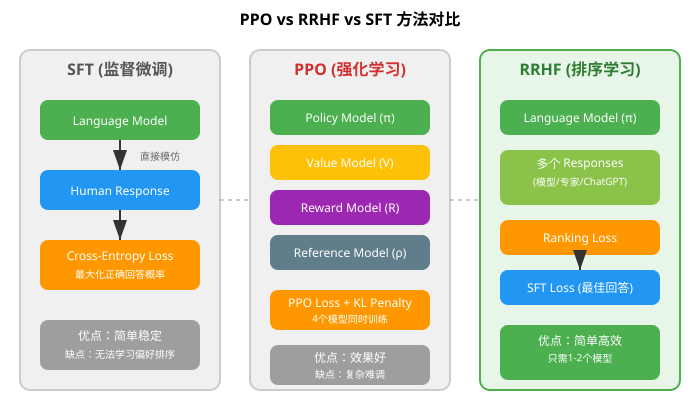
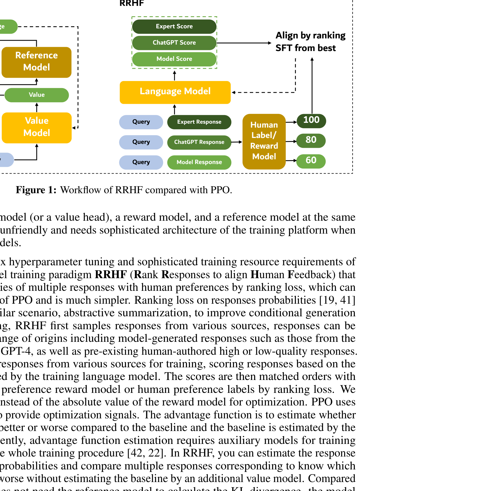
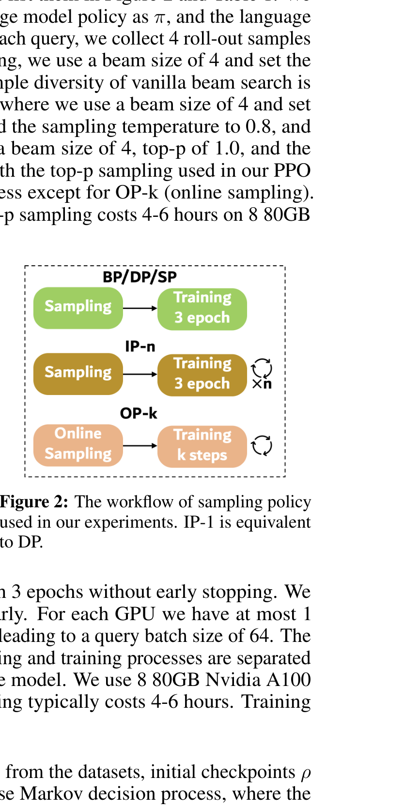
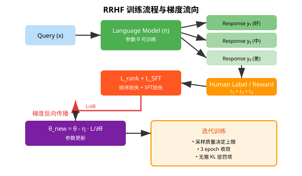
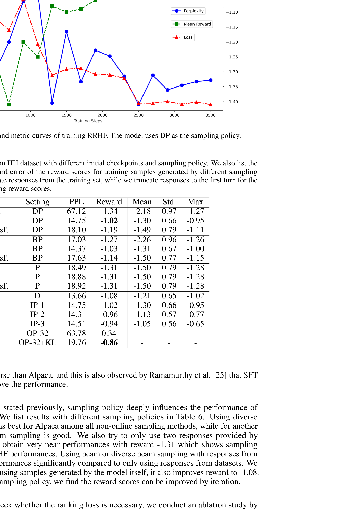

# RRHF：无需眼泪的排序响应对齐

> **原文**: RRHF: Rank Responses to Align Language Models with Human Feedback without tears
> **作者**: Zheng Yuan, Hongyi Yuan, Chuanqi Tan, Wei Wang, Songfang Huang, Fei Huang
> **发表时间**: 2023年4月（NeurIPS 2023 接收）
> **arXiv**: [2304.05302](https://arxiv.org/abs/2304.05302)

---

## 一句话总结

RRHF 用**排序**代替 PPO 中的**强化学习**，让语言模型学会"哪个回答更好"，只需 1-2 个模型就能达到 PPO 的对齐效果，训练简单得像普通微调。

## 研究背景：为什么要做这个？

### 大模型对齐的痛点

ChatGPT 之所以好用，核心秘诀是 **RLHF（基于人类反馈的强化学习）**——让模型学会按照人类偏好来回答问题。但 RLHF 的标准实现（如 InstructGPT）非常复杂，包含三个阶段：

1. **SFT（监督微调）**：用人类写的好回答教模型怎么回答问题
2. **奖励模型训练**：训练一个"裁判"模型，给回答打分
3. **PPO 优化**：用强化学习让模型学会拿高分

这就像教小孩写作文：先让他抄范文（SFT），再请老师打分（奖励模型），最后用奖惩制度激励他写得更好（PPO）。听起来合理，但实际操作起来问题很多。

### 现有方案的问题

**PPO 的核心问题**：

| 问题 | 具体表现 |
|------|---------|
| **模型太多** | 同时需要 4 个模型：策略模型、价值模型、奖励模型、参考模型 |
| **超参数敏感** | 学习率、KL 惩罚系数、clip 范围...调参像走钢丝 |
| **显存爆炸** | 4 个模型同时加载，7B 模型需要 8×80GB A100 |
| **训练不稳定** | 强化学习本身就不稳定，容易崩溃 |

**SFT 的问题**：
- 只能模仿人类回答，无法学习"哪个更好"的排序关系
- 模型学会了"怎么说"，但没学会"什么更好"

**RRHF 的动机**：能不能去掉 PPO 中那些复杂的组件（价值模型、参考模型、KL 散度），用最简单的方式让模型学会排序？

## 核心思路：这篇论文的"大招"是什么？

RRHF 的核心洞察非常简洁：**与其用强化学习估计"绝对分数"，不如直接学习"相对排序"**。

**关键区别**：

| 维度 | PPO | RRHF |
|------|-----|------|
| 优化信号 | 绝对奖励值 R(x,y) | 响应间的排序关系 |
| 需要模型数 | 4 个 | 1-2 个 |
| 需要价值模型 | 是（估计优势函数） | 否 |
| 需要参考模型 | 是（计算 KL 散度） | 否 |
| 采样时机 | 训练中在线采样 | 训练前一次性采样 |
| 超参数敏感度 | 高 | 低（和 SFT 差不多） |

**通俗理解**：

想象你在教模型写作文。PPO 的做法是：让模型写一篇文章，请裁判打分，然后根据分数调整模型——但这需要裁判（奖励模型）、还需要一个"基准线"（价值模型）来判断分数是高还是低，还要防止模型跑偏（参考模型 + KL 惩罚）。

RRHF 的做法更直接：给模型看几篇不同质量的文章（好的、中等的、差的），告诉它"这篇比那篇好"，让它学会给好文章更高的概率、给差文章更低的概率。**不需要裁判、不需要基准线、不需要防跑偏**——排序本身就是最好的学习信号。

## 具体怎么做的？

### RRHF 算法详解

RRHF 的训练流程可以概括为三步：

1. **采样**：对每个问题 x，从不同来源采样 k 个回答 y₁, y₂, ..., y
2. **打分**：用人类标注或奖励模型给每个回答打分 r₁, r₂, ..., rₖ
3. **排序学习**：让模型给好回答更高的概率，给差回答更低的概率

#### 核心公式

**步骤 1：计算每个回答的模型概率**

$$
p_i = \frac{1}{|y_i|} \log \pi(y_i | x)
$$

这里 $p_i$ 是模型 $\pi$ 对回答 $y_i$ 的**长度归一化对数概率**。除以长度 $|y_i|$ 是为了公平比较不同长度的回答。

**步骤 2：排序损失（Ranking Loss）**

$$
\mathcal{L}_{\text{rank}} = \sum_{r_i > r_j} \max(0, -(p_i - p_j))
$$

这个公式的含义是：**对于每一对回答，如果人类认为 $y_i$ 比 $y_j$ 好（即 $r_i > r_j$），那么模型给 $y_i$ 的概率应该大于给 $y_j$ 的概率（即 $p_i > p_j$）**。如果不满足，就产生损失。

这就像 pairwise ranking（成对排序）：模型不需要知道"好回答"的绝对分数是多少，只需要知道"A 比 B 好"就够了。

**步骤 3：SFT 损失（辅助）**

$$
\mathcal{L}_{\text{SFT}} = -\log \pi(y_{\text{best}} | x)
$$

对最好的回答做标准的监督微调，确保模型至少能生成高质量回答。

**总损失**：

$$
\mathcal{L} = \mathcal{L}_{\text{rank}} + \mathcal{L}_{\text{SFT}}
$$

简单相加，不需要调权重（论文尝试过给 $\mathcal{L}_{\text{rank}}$ 加 10 倍、100 倍权重，反而效果更差）。

### 采样策略：RRHF 性能的关键

RRHF 有一个重要发现：**模型性能高度依赖采样质量**。采样到的回答越好，最终模型越强。

论文设计了多种采样策略：

| 策略 | 采样方式 | 说明 |
|------|---------|------|
| **BP** | Beam Search | 标准束搜索，多样性低 |
| **SP** | Top-p Sampling | 核采样，多样性较好 |
| **DP** | Diverse Beam Search | 多样化束搜索，推荐 |
| **IP-n** | 迭代更新 | 采样→训练→用新模型再采样，循环 n 次 |
| **OP-k** | 在线采样 | 边训练边采样，类似 PPO |

**关键发现**：
- DP（多样化束搜索）是非在线方法中最好的
- IP 迭代更新可以持续提升性能（IP-1 → IP-2 → IP-3）
- OP 在线采样效果最好，但需要加 KL 惩罚防止模型崩溃

### 与现有方法的关系

**RRHF 是 SFT 的推广**：
- SFT 可以看作 k=1 的 RRHF（只有一个回答，没有排序）
- RRHF 增加了"比较多个回答"的能力

**RRHF 是奖励模型训练的统一**：
- 训练好的 RRHF 模型本身就可以当奖励模型用
- 它用长度归一化对数概率来打分，而其他奖励模型用 [CLS] 或 [EOS] token 打分

**RRHF 是 PPO 的简化版**：
- 去掉了价值模型（不需要估计优势函数）
- 去掉了参考模型（不需要 KL 散度）
- 去掉了在线采样（训练前一次性采样完成）

### 用一个具体例子走通全流程

#### 场景设定

假设我们有一个简化版的语言模型，词汇表只有 3 个词：`{"好", "中", "差"}`。

对于问题 "如何保持健康？"，我们采样了 3 个回答：
- $y_1$ = "好"（人类评分 $r_1 = 100$）
- $y_2$ = "中"（人类评分 $r_2 = 80$）
- $y_3$ = "差"（人类评分 $r_3 = 60$）

模型初始参数（简化为每个词的概率）：
- $\pi(\text{"好"}|x) = 0.4$
- $\pi(\text{"中"}|x) = 0.35$
- $\pi(\text{"差"}|x) = 0.25$

#### Step 1: 计算模型概率

$$
p_1 = \log(0.4) = -0.916
$$
$$
p_2 = \log(0.35) = -1.050
$$
$$
p_3 = \log(0.25) = -1.386
$$

#### Step 2: 计算排序损失

需要满足的排序：$r_1 > r_2 > r_3$，所以需要 $p_1 > p_2 > p_3$。

当前 $p_1 = -0.916 > p_2 = -1.050 > p_3 = -1.386$，已经满足排序！

但如果模型初始参数不同，比如：
- $\pi(\text{"好"}|x) = 0.3$
- $\pi(\text{"中"}|x) = 0.4$
- $\pi(\text{"差"}|x) = 0.3$

则：
- $p_1 = \log(0.3) = -1.204$
- $p_2 = \log(0.4) = -0.916$
- $p_3 = \log(0.3) = -1.204$

此时 $p_2 > p_1$，但 $r_1 > r_2$，排序错误！

排序损失：
$$
\mathcal{L}_{\text{rank}} = \max(0, -(p_1 - p_2)) + \max(0, -(p_1 - p_3)) + \max(0, -(p_2 - p_3))
$$
$$
= \max(0, -(-1.204 + 0.916)) + \max(0, -(-1.204 + 1.204)) + \max(0, -(-0.916 + 1.204))
$$
$$
= \max(0, 0.288) + \max(0, 0) + \max(0, -0.288)
$$
$$
= 0.288 + 0 + 0 = 0.288
$$

#### Step 3: 反向传播

梯度会流向模型参数 $\theta$，让：
- $\pi(\text{"好"}|x)$ 增大（因为 $p_1$ 需要变大）
- $\pi(\text{"中"}|x)$ 减小（因为 $p_2$ 需要变小）

#### Step 3.5: 参数更新

假设学习率 $\eta = 0.1$，简化更新：

$$
\theta_{\text{new}} = \theta - \eta \cdot \frac{\partial \mathcal{L}}{\partial \theta}
$$

更新后：
- $\pi(\text{"好"}|x) = 0.3 + 0.1 \times 0.288 = 0.329$
- $\pi(\text{"中"}|x) = 0.4 - 0.1 \times 0.288 = 0.371$
- $\pi(\text{"差"}|x) = 0.3$（不变，因为 $p_2 > p_3$ 已满足）

新的概率：
- $p_1 = \log(0.329) = -1.112$
- $p_2 = \log(0.371) = -0.992$

排序损失从 0.288 下降到：
$$
\mathcal{L}_{\text{rank}} = \max(0, -(-1.112 + 0.992)) = \max(0, 0.120) = 0.120
$$

**损失下降了！** 模型正在学习正确的排序。

#### Step 4: 训练收敛

从论文的实验曲线可以看到：
- 损失（红色虚线）和平均奖励（绿色虚线）呈负相关
- 大约在第 3 个 epoch（2400-3600 步）收敛
- RRHF 的收敛行为和 SFT 非常相似，说明它确实"简单得像微调"

> **小白tips**: RRHF 的精髓在于"排序比绝对分数更容易学"。就像考试排名比绝对分数更能反映学生水平一样——你不需要知道考 90 分是什么水平，只需要知道"我比同桌考得好"就够了。

## 效果怎么样？

### 主实验结果

在 Anthropic 的 Helpful and Harmless (HH) 数据集上，RRHF 与 PPO 的对比：

| 方法 | 困惑度 (PPL) | 奖励分数 (Reward) |
|------|-------------|------------------|
| LLaMA (原始) | 14.34 | -1.18 |
| Alpaca (原始) | 18.98 | -1.46 |
| Alpaca PPO | 13.84 | -1.03 |
| **Alpaca RRHF_DP** | **14.75** | **-1.03** |
| **Alpaca RRHF_SP** | **14.41** | **-0.96** |

**关键发现**：
- RRHF 的奖励分数与 PPO 相当，甚至更好（RRHF_SP 达到 -0.96）
- 困惑度保持在合理范围，说明模型没有"为了拿高分而说胡话"
- 训练只需要 1 个模型，而 PPO 需要 4 个

### 人类评估

| 对比 | 胜率 | 平局 | 败率 |
|------|------|------|------|
| RRHF_DP vs 数据集好回答 | 59% | 30% | 11% |
| RRHF_DP vs PPO | 27% | 48% | 25% |

RRHF 生成的回答在人类评估中与 PPO 基本持平。

### 消融实验：采样质量决定一切

| 采样策略 | 奖励分数 |
|---------|---------|
| P (仅用数据集回答) | -1.31 |
| D (模型自己采样) | -1.08 |
| DP (多样化束搜索) | -1.02 |
| IP-1 (迭代 1 次) | -1.02 |
| IP-2 (迭代 2 次) | -0.96 |
| IP-3 (迭代 3 次) | -0.94 |
| OP-32+KL (在线采样) | **-0.86** |

**重要结论**：
1. 如果只用数据集里的回答（P 策略），所有模型（LLaMA、Alpaca、Alpaca-sft）得到相同的奖励 -1.31，证明**采样质量决定 RRHF 性能上限**
2. 迭代更新可以持续提升性能
3. 在线采样（OP）效果最好，但需要加 KL 惩罚

### 排序损失的必要性

| 配置 | 奖励分数 |
|------|---------|
| Alpaca BP | -1.03 |
| Alpaca BP（去掉排序损失） | -1.14 |

去掉排序损失后，模型无法学习回答之间的排序关系，性能明显下降。

## 论文的意义和局限

### 主要贡献

1. **提出了 RRHF 新范式**：用排序损失代替强化学习，简化了 RLHF 流程
2. **模型即奖励模型**：训练好的模型既能生成回答，也能给回答打分
3. **简单高效**：只需 1-2 个模型，超参数和 SFT 一样简单，效果媲美 PPO

### 局限性

1. **依赖代理奖励模型**：实验使用 Dahoas/gptj-rm-static 作为代理，可能无法完全捕捉人类偏好
2. **采样成本高**：训练前需要采样多个回答，增加了 GPU 使用量
3. **过度优化风险**：和 PPO 一样，在线采样可能导致模型"欺骗"奖励模型（reward hacking）

## 读后感

RRHF 是一篇"化繁为简"的优秀论文。它没有提出什么复杂的新技术，而是敏锐地发现了 PPO 中不必要的复杂性，并用一个简单的排序损失取而代之。

**对后续研究的影响**：
- RRHF 证明了"排序学习"在语言模型对齐中的有效性
- 为资源有限的研究者提供了一个 PPO 的轻量级替代方案
- 启发了后续工作（如 DPO、IPO 等）进一步简化 RLHF 流程

**初学者应该记住的核心**：
1. **排序比绝对分数更容易学**——这是 RRHF 的核心洞察
2. **采样质量决定性能上限**——好数据比好算法更重要
3. **简单往往更有效**——去掉不必要的组件，模型反而训练得更稳定

> 论文标题中的 "without tears"（无需眼泪）非常贴切——PPO 的训练过程确实让人"流泪"（调参调到崩溃），而 RRHF 让对齐训练变得像普通微调一样简单。
