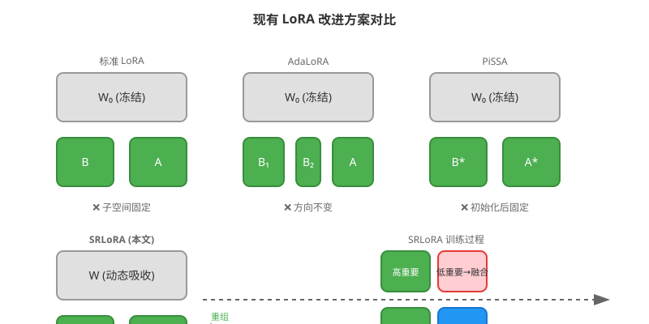
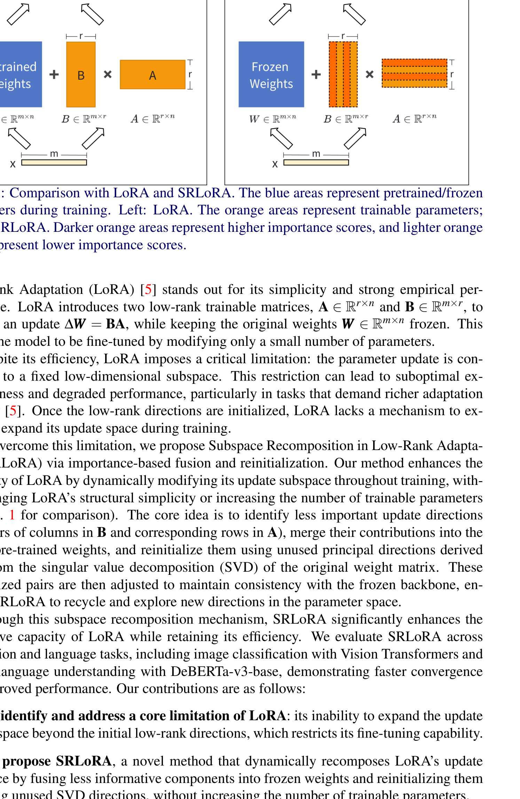
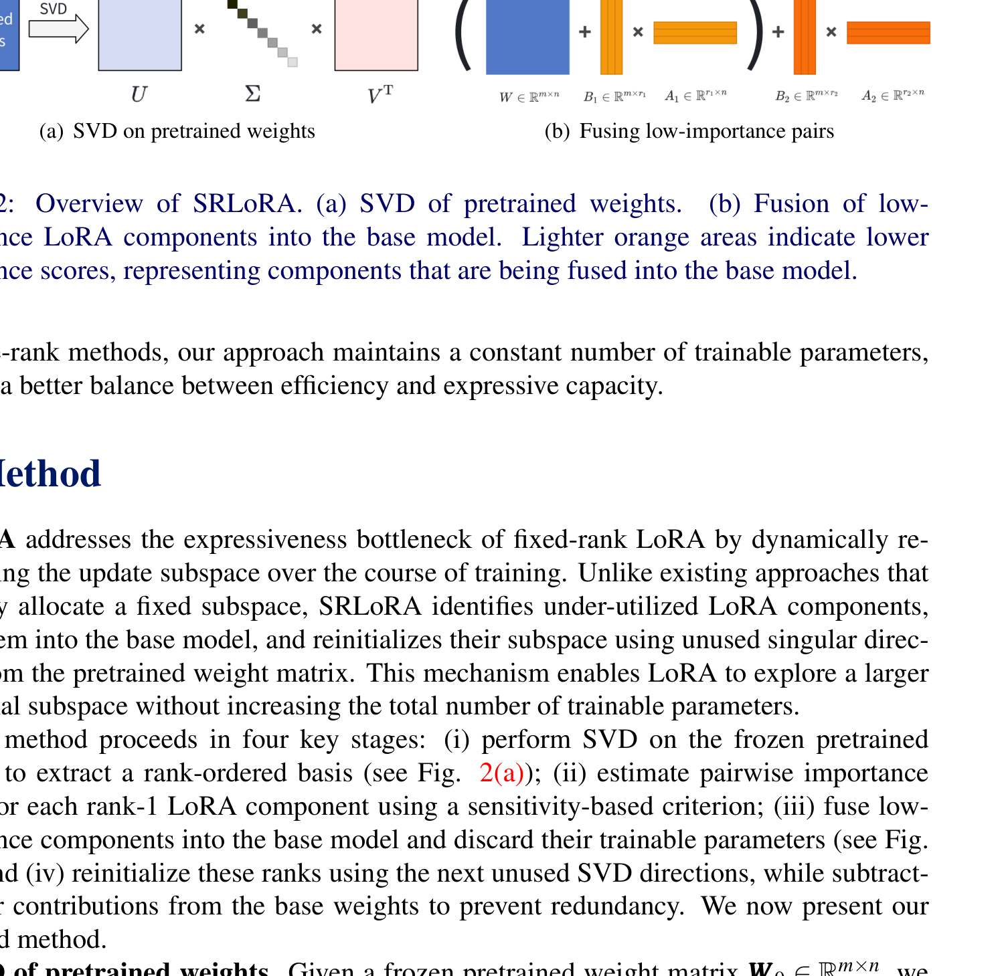
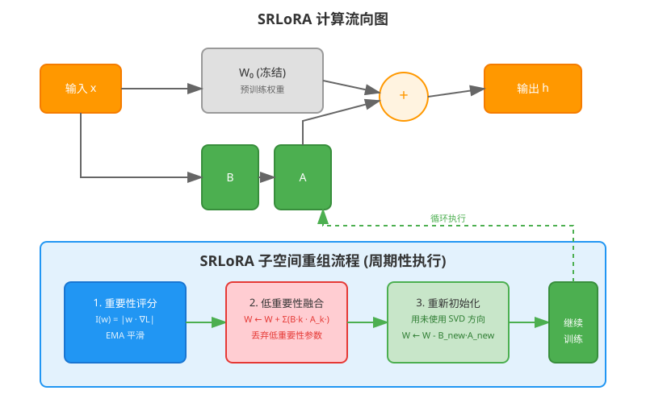
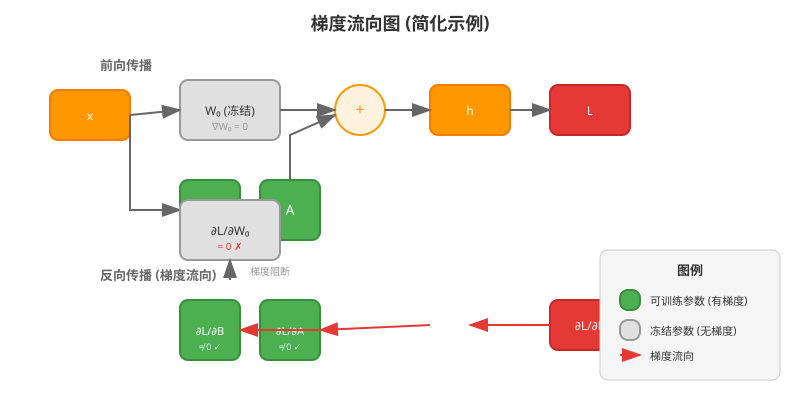
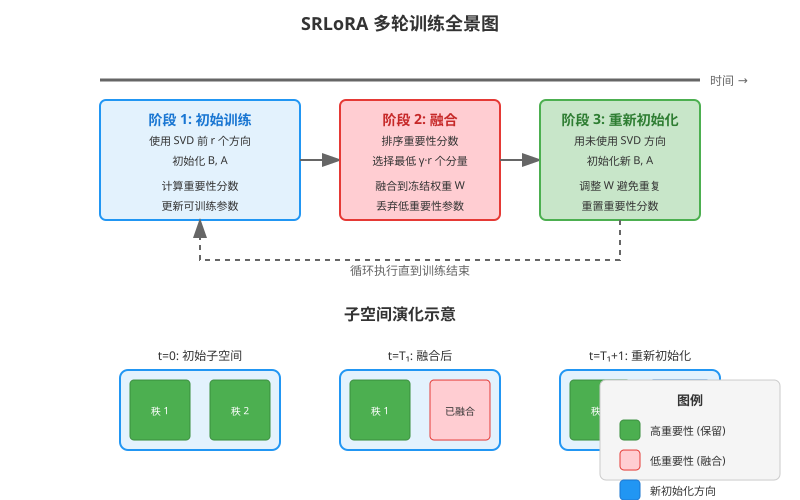
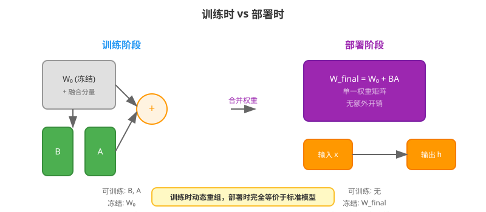
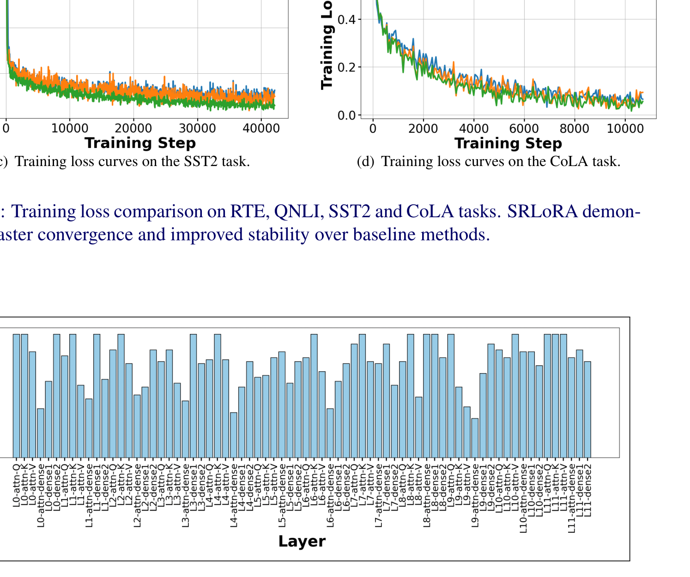
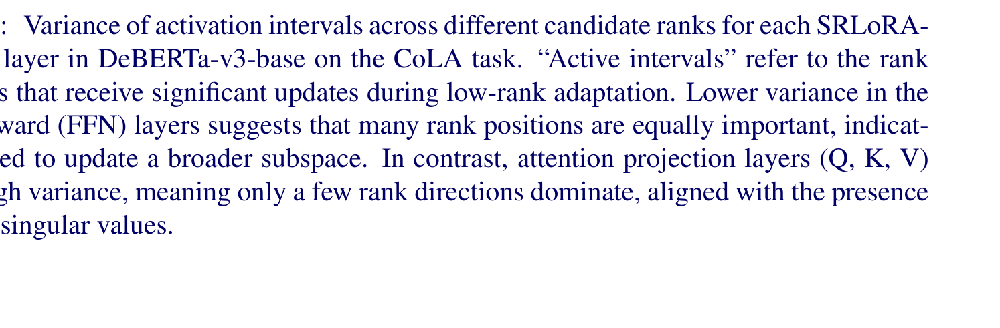
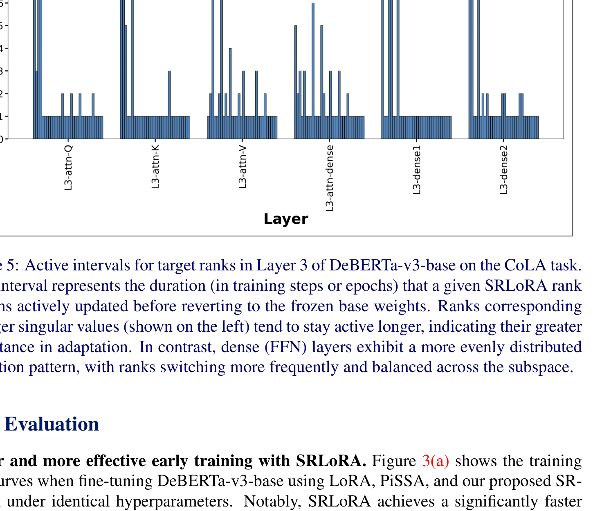

# SRLoRA：基于重要性融合与重新初始化的低秩自适应子空间重组

> **原文**: SRLoRA: Subspace Recomposition in Low-Rank Adaptation via Importance-Based Fusion and Reinitialization
> **作者**: Haodong Yang, Lei Wang, Md Zakir Hossain
> **发表时间**: 2025年5月
> **arXiv**: https://arxiv.org/abs/2505.12433

---

## 一句话总结

SRLoRA 让 LoRA 在训练过程中能够"换血"——把不重要的参数合并到原模型里，腾出位置用新的方向重新初始化，从而在不增加参数量的前提下持续提升模型表达能力。

## 研究背景：为什么要做这个？

在大模型微调领域，LoRA（Low-Rank Adaptation，低秩自适应）已经成为最流行的参数高效微调方法。它的核心思想很简单：预训练模型的权重矩阵 $W_0 \in \mathbb{R}^{d \times d}$ 保持冻结，只训练一个低秩更新 $\Delta W = BA$，其中 $B \in \mathbb{R}^{d \times r}$，$A \in \mathbb{R}^{r \times d}$，秩 $r \ll d$。这样可训练参数量从 $d^2$ 降到 $2dr$，大幅降低了显存和计算开销。

但 LoRA 有一个致命缺陷：**子空间一旦初始化就固定不变**。就像你租了一个固定大小的房间，不管里面家具摆放是否合理，你都不能换更大的房间，也不能重新布置格局。如果初始化的低秩方向不是最优的，LoRA 就只能在这个次优的子空间里"打转"，无法探索更好的参数方向。

### 现有方案的问题

之前的改进方案各有侧重：
- **AdaLoRA**：自适应调整不同层的秩分配，但子空间方向仍然固定
- **PiSSA**：用预训练权重的 SVD（奇异值分解）主方向初始化，起点更好，但初始化后同样无法改变
- **DyLoRA**：动态调整秩大小，但没有解决方向选择问题

这些方法都没有触及核心问题：**训练过程中子空间方向的动态更新**。

## 核心思路：这篇论文的"大招"是什么？

SRLoRA（Subspace Recomposition in LoRA）提出了一个巧妙的机制：**在训练过程中定期"换血"**。

具体来说，它做两件事：
1. **融合**：找出当前 LoRA 矩阵中"贡献最小"的那些秩方向，把它们的权重合并到冻结的预训练权重里，然后丢弃这些 LoRA 参数
2. **重新初始化**：用预训练权重 SVD 分解中**尚未使用过的**奇异方向，重新初始化被释放的秩

这就像是一个"新陈代谢"过程：淘汰不重要的旧参数，引入有潜力的新方向。整个过程**不增加可训练参数数量**，但让模型能够持续探索新的正交子空间。

## 具体怎么做的？

### 阶段一：预训练权重的 SVD 分解

首先对冻结的预训练权重矩阵 $W_0$ 进行奇异值分解：

$$
W_0 = U \Sigma V^\top
$$

其中 $U$ 和 $V$ 是正交矩阵，$\Sigma$ 是对角矩阵（奇异值从大到小排列）。

采用 PiSSA 的初始化方式，用前 $r$ 个奇异方向初始化 LoRA 矩阵：

$$
B = U_{[:,:r]} \Sigma_{[:r,:r]}^{1/2}, \quad A = \Sigma_{[:r,:r]}^{1/2} V_{[:,:r]}^\top
$$

这样初始化的 LoRA 已经包含了预训练权重中最重要的方向。

### 阶段二：基于敏感性的重要性估计

训练过程中，需要判断每个 LoRA 分量（$B$ 的一列和 $A$ 的对应行组成的 rank-1 对）有多重要。

**瞬时重要性**（公式3）：

$$
I(w_{ij}) = |w_{ij} \cdot \nabla_{w_{ij}} \mathcal{L}|
$$

这个公式的直觉是：如果一个参数值大且梯度也大，说明它对损失函数影响显著，就是重要的。

**平滑重要性**（EMA，公式4）：

$$
\bar{I}^{(t)} = \beta_1 \cdot \bar{I}^{(t-1)} + (1 - \beta_1) \cdot I^{(t)}
$$

用指数移动平均平滑瞬时波动，$\beta_1$ 通常取 0.85。

**不确定性估计**（公式5）：

$$
\bar{U}^{(t)} = \beta_2 \cdot \bar{U}^{(t-1)} + (1 - \beta_2) \cdot |I^{(t)} - \bar{I}^{(t)}|
$$

衡量重要性分数的波动程度。

**最终重要性分数**（公式6）：

$$
s^{(t)}(w_{ij}) = \bar{I}^{(t)}(w_{ij}) \cdot \bar{U}^{(t)}(w_{ij})
$$

对于第 $k$ 个 rank-1 分量，聚合 $B$ 的第 $k$ 列和 $A$ 的第 $k$ 行的重要性：

$$
S_k^{(t)} = \frac{1}{m} \sum_i s(B_{ik}) + \frac{1}{n} \sum_j s(A_{kj})
$$

### 阶段三：低重要性分量融合

按重要性分数排序，选择最低的 $\gamma \cdot r$ 个分量（$\gamma$ 为融合比例，通常取 0.5）。

将这些低重要性分量的贡献**融合到冻结权重**中：

$$
W \leftarrow W + \sum_{k \in \text{low}} B_{:,k} \cdot A_{k,:}
$$

然后丢弃对应的 LoRA 参数。

### 阶段四：重新初始化

用**未使用的下一批 SVD 奇异方向**重新初始化被释放的秩：

$$
B_1^{\text{new}} = U_{[:,p_r:p_r+r']} \Sigma^{1/2}, \quad A_1^{\text{new}} = \Sigma^{1/2} V_{[:,p_r:p_r+r']}^\top
$$

其中 $p_r$ 是已使用的奇异方向数量，$r'$ 是重新初始化的秩数。

为避免重复贡献，从冻结权重中**减去**新初始化的投影：

$$
W \leftarrow W - B_1^{\text{new}} A_1^{\text{new}}
$$

重置重要性分数，准备下一轮训练。

### 切换调度

目标秩 $r_{\text{target}}$ 决定了最大可探索的秩数。切换次数为：

$$
N_{\text{switch}} = \frac{r_{\text{target}} - r}{r'}
$$

切换间隔为：

$$
t_{\text{interval}} = \frac{N_{\text{all}}}{N_{\text{switch}}}
$$

其中 $N_{\text{all}}$ 是总训练步数。

### 方法在整体架构中的位置

SRLoRA 的改动完全在 LoRA 适配器内部，不影响预训练模型的其他部分。训练过程中，冻结权重 $W$ 会逐步吸收低重要性分量，而 LoRA 矩阵 $A$ 和 $B$ 会定期用新的 SVD 方向重新初始化。

### 用一个具体例子走通全流程

#### 场景设定

设预训练权重 $W_0 \in \mathbb{R}^{4 \times 4}$，秩 $r = 2$，融合比例 $\gamma = 0.5$（每次融合 1 个秩）。

对 $W_0$ 进行 SVD 分解：

$$
W_0 = U \Sigma V^\top = \begin{bmatrix} u_1 & u_2 & u_3 & u_4 \end{bmatrix} \begin{bmatrix} 5 & 0 & 0 & 0 \\ 0 & 3 & 0 & 0 \\ 0 & 0 & 1 & 0 \\ 0 & 0 & 0 & 0.5 \end{bmatrix} \begin{bmatrix} v_1^\top \\ v_2^\top \\ v_3^\top \\ v_4^\top \end{bmatrix}
$$

假设简化数值：

$$
W_0 = \begin{bmatrix} 2 & 1 & 0 & 0 \\ 1 & 2 & 0 & 0 \\ 0 & 0 & 1 & 0.5 \\ 0 & 0 & 0.5 & 1 \end{bmatrix}
$$

用前 $r=2$ 个奇异方向初始化 LoRA：

$$
B = \begin{bmatrix} 2.24 & 0 \\ 0 & 1.73 \\ 0 & 0 \\ 0 & 0 \end{bmatrix}, \quad A = \begin{bmatrix} 1 & 0.5 & 0 & 0 \\ 0 & 0 & 1 & 0.5 \end{bmatrix}
$$

其中 $B$ 的第 1 列和第 2 列、$A$ 的第 1 行和第 2 行是可训练的，其余参数冻结。

#### Step 1: 前向传播

输入 $x = [1, 0, 0, 0]^\top$，经过冻结权重和 LoRA 适配器：

$$
h = W_0 x + BAx
$$

先计算 $W_0 x$：

$$
W_0 x = \begin{bmatrix} 2 & 1 & 0 & 0 \\ 1 & 2 & 0 & 0 \\ 0 & 0 & 1 & 0.5 \\ 0 & 0 & 0.5 & 1 \end{bmatrix} \begin{bmatrix} 1 \\ 0 \\ 0 \\ 0 \end{bmatrix} = \begin{bmatrix} 2 \\ 1 \\ 0 \\ 0 \end{bmatrix}
$$

再计算 $BAx$：

$$
Ax = \begin{bmatrix} 1 & 0.5 & 0 & 0 \\ 0 & 0 & 1 & 0.5 \end{bmatrix} \begin{bmatrix} 1 \\ 0 \\ 0 \\ 0 \end{bmatrix} = \begin{bmatrix} 1 \\ 0 \end{bmatrix}
$$

$$
BAx = \begin{bmatrix} 2.24 & 0 \\ 0 & 1.73 \\ 0 & 0 \\ 0 & 0 \end{bmatrix} \begin{bmatrix} 1 \\ 0 \end{bmatrix} = \begin{bmatrix} 2.24 \\ 0 \\ 0 \\ 0 \end{bmatrix}
$$

最终输出：

$$
h = \begin{bmatrix} 2 \\ 1 \\ 0 \\ 0 \end{bmatrix} + \begin{bmatrix} 2.24 \\ 0 \\ 0 \\ 0 \end{bmatrix} = \begin{bmatrix} 4.24 \\ 1 \\ 0 \\ 0 \end{bmatrix}
$$

#### Step 2: 损失计算

假设目标输出 $y = [5, 1, 0, 0]^\top$，使用均方误差损失：

$$
\mathcal{L} = \frac{1}{2} \|h - y\|^2 = \frac{1}{2} \left[ (4.24 - 5)^2 + (1 - 1)^2 + 0 + 0 \right] = \frac{1}{2} \times 0.5776 = 0.2888
$$

**直白翻译**：损失衡量的是模型输出和目标之间的差距。LoRA 的目标是通过调整 $A$ 和 $B$ 让损失变小，而 SRLoRA 在此基础上还会定期重组子空间方向。

#### Step 3: 反向传播

计算损失对 $B$ 和 $A$ 的梯度：

$$
\frac{\partial \mathcal{L}}{\partial B} = (h - y) (Ax)^\top = \begin{bmatrix} -0.76 \\ 0 \\ 0 \\ 0 \end{bmatrix} \begin{bmatrix} 1 & 0 \end{bmatrix} = \begin{bmatrix} -0.76 & 0 \\ 0 & 0 \\ 0 & 0 \\ 0 & 0 \end{bmatrix}
$$

$$
\frac{\partial \mathcal{L}}{\partial A} = B^\top (h - y) x^\top = \begin{bmatrix} 2.24 & 0 & 0 & 0 \\ 0 & 1.73 & 0 & 0 \end{bmatrix} \begin{bmatrix} -0.76 \\ 0 \\ 0 \\ 0 \end{bmatrix} \begin{bmatrix} 1 & 0 & 0 & 0 \end{bmatrix} = \begin{bmatrix} -1.7024 & 0 & 0 & 0 \\ 0 & 0 & 0 & 0 \end{bmatrix}
$$

**重要性分数计算**：

对于 $B_{11} = 2.24$，梯度 $\nabla_{B_{11}} \mathcal{L} = -0.76$：

$$
I(B_{11}) = |2.24 \times (-0.76)| = 1.7024
$$

对于 $B_{22} = 1.73$，梯度 $\nabla_{B_{22}} \mathcal{L} = 0$：

$$
I(B_{22}) = |1.73 \times 0| = 0
$$

可见第 2 个秩方向（对应 $B$ 的第 2 列）在当前输入下贡献为零，重要性分数低，未来可能被融合和替换。

#### Step 3.5: 参数更新与下一轮迭代

**参数更新**（以 SGD 为例，学习率 $\eta = 0.1$）：

$$
\theta_{\text{new}} = \theta - \eta \cdot \frac{\partial \mathcal{L}}{\partial \theta}
$$

更新 $B$：

$$
B_{\text{new}} = \begin{bmatrix} 2.24 & 0 \\ 0 & 1.73 \\ 0 & 0 \\ 0 & 0 \end{bmatrix} - 0.1 \times \begin{bmatrix} -0.76 & 0 \\ 0 & 0 \\ 0 & 0 \\ 0 & 0 \end{bmatrix} = \begin{bmatrix} 2.316 & 0 \\ 0 & 1.73 \\ 0 & 0 \\ 0 & 0 \end{bmatrix}
$$

更新 $A$：

$$
A_{\text{new}} = \begin{bmatrix} 1 & 0.5 & 0 & 0 \\ 0 & 0 & 1 & 0.5 \end{bmatrix} - 0.1 \times \begin{bmatrix} -1.7024 & 0 & 0 & 0 \\ 0 & 0 & 0 & 0 \end{bmatrix} = \begin{bmatrix} 1.17024 & 0.5 & 0 & 0 \\ 0 & 0 & 1 & 0.5 \end{bmatrix}
$$

**通俗解释**：梯度指向损失增大的方向，减去梯度就是在让损失变小。$B_{11}$ 从 2.24 增加到 2.316，$A_{11}$ 从 1 增加到 1.17024，这两个参数的调整会让输出更接近目标值 5。

**第二轮前向传播**：

用更新后的参数对同一输入 $x = [1, 0, 0, 0]^\top$ 再做一次前向传播：

$$
Ax = \begin{bmatrix} 1.17024 & 0.5 & 0 & 0 \\ 0 & 0 & 1 & 0.5 \end{bmatrix} \begin{bmatrix} 1 \\ 0 \\ 0 \\ 0 \end{bmatrix} = \begin{bmatrix} 1.17024 \\ 0 \end{bmatrix}
$$

$$
BAx = \begin{bmatrix} 2.316 & 0 \\ 0 & 1.73 \\ 0 & 0 \\ 0 & 0 \end{bmatrix} \begin{bmatrix} 1.17024 \\ 0 \end{bmatrix} = \begin{bmatrix} 2.7103 \\ 0 \\ 0 \\ 0 \end{bmatrix}
$$

$$
h_{\text{new}} = \begin{bmatrix} 2 \\ 1 \\ 0 \\ 0 \end{bmatrix} + \begin{bmatrix} 2.7103 \\ 0 \\ 0 \\ 0 \end{bmatrix} = \begin{bmatrix} 4.7103 \\ 1 \\ 0 \\ 0 \end{bmatrix}
$$

**验证训练在起作用**：

| 分量 | 第 1 轮输出 | 第 2 轮输出 | 目标值 | 趋势 |
|------|-----------|-----------|-------|------|
| $h_1$ | 4.24 | 4.7103 | 5 | ✓ 更接近 |
| $h_2$ | 1 | 1 | 1 | ✓ 保持 |
| $h_3$ | 0 | 0 | 0 | ✓ 保持 |
| $h_4$ | 0 | 0 | 0 | ✓ 保持 |

新损失：

$$
\mathcal{L}_{\text{new}} = \frac{1}{2} (4.7103 - 5)^2 = \frac{1}{2} \times 0.0837 = 0.0419
$$

损失从 0.2888 下降到 0.0419，下降了约 85%！

**SRLoRA 的子空间重组**：

假设经过若干步训练后，重要性分数显示第 2 个秩方向（$B$ 的第 2 列和 $A$ 的第 2 行）贡献最低。此时执行融合和重新初始化：

1. **融合**：将 $B_{:,2} \cdot A_{2,:}$ 加到冻结权重 $W$ 中
2. **重新初始化**：用 SVD 分解中第 3 个奇异方向（$u_3, v_3$）初始化新的 $B_{:,2}$ 和 $A_{2,:}$
3. **调整冻结权重**：$W \leftarrow W - B_{:,2}^{\text{new}} A_{2,:}^{\text{new}}$

这样，模型就获得了一个全新的探索方向，而不是继续在不重要的方向上浪费参数。

**多轮训练全景图**：

#### Step 4: 部署/推理

推理阶段，SRLoRA 和标准 LoRA 完全一样：将冻结权重和 LoRA 更新合并：

$$
W_{\text{final}} = W_0 + BA
$$

不需要额外的计算开销。

> **小白tips**: SRLoRA 的"换血"机制听起来复杂，但核心思想很简单：训练过程中定期评估每个秩方向的重要性，淘汰不重要的，引入新的。这就像是一个团队定期考核成员绩效，表现差的离开，新成员加入，团队整体能力就能持续提升。

## 效果怎么样？

### 各方法对比总览

**GLUE 基准测试结果**（使用 DeBERTa-v3-base）：

| 方法 | SST-2 | MRPC (F1/Acc) | CoLA | QNLI | RTE | STS-B |
|------|-------|---------------|------|------|-----|-------|
| LoRA | 95.9 | 90.8/87.5 | 65.4 | 94.0 | 80.4 | 90.5/89.8 |
| PiSSA | 95.7 | 90.5/87.2 | 64.7 | 94.4 | 82.0 | 89.6/89.0 |
| **SRLoRA** | **96.1** | 90.3/86.6 | 65.1 | 93.4 | **82.1** | **90.4/90.2** |

**视觉任务结果**（使用 ViT-B/16）：

| 方法 | CIFAR-100 | STL-10 | MNIST |
|------|-----------|--------|-------|
| LoRA | 90.06 | **99.62** | **98.89** |
| **SRLoRA** | **92.51** | 99.54 | 94.83 |

**关键发现**：
- SRLoRA 在**复杂任务**（CIFAR-100, RTE, SST-2）上优势明显，CIFAR-100 上比 LoRA 高 2.45 个百分点
- 在简单/饱和任务（MNIST, STL-10）上 LoRA 仍有竞争力，因为这些任务用标准 LoRA 已经接近饱和
- SRLoRA 在训练初期收敛**显著更快**，前 2000 步损失下降速度明显优于 LoRA

### 子空间激活分析

论文还分析了不同层中各秩方向的激活情况：

- **FFN 层**（前馈神经网络层）：方差较低，说明多个秩位置同样重要，需要更广泛的子空间更新
- **注意力投影层**（Q, K, V 投影）：方差较高，少数秩方向占主导，对应大奇异值

- 大奇异值对应的秩（左侧）保持活跃时间更长
- FFN 层呈现更均匀的激活模式，秩切换更频繁

## 论文的意义和局限

**主要贡献**：
1. **识别并解决了 LoRA 的核心局限**：无法在初始低秩方向之外扩展更新子空间
2. **提出 SRLoRA**：通过融合低信息量分量到冻结权重并用未使用的 SVD 方向重新初始化，在固定参数预算下实现动态子空间重组
3. **实验验证**：在视觉和语言任务上一致证明了更快的收敛速度和更高的最终准确率

**局限性**：
1. **固定切换间隔**：当前实现使用固定的切换间隔，没有根据训练动态（如损失停滞或重要性分数收敛）自适应调整
2. **SVD 计算开销**：需要预计算预训练权重的 SVD 分解，对于超大模型可能有一定开销
3. **奇异方向耗尽**：当所有奇异方向都用完后，无法继续重新初始化（虽然论文设置了目标秩上限来避免这个问题）

## 读后感

SRLoRA 的核心洞察非常优雅：既然 LoRA 的子空间是固定的，那我们就让它在训练过程中"活"起来。通过重要性评估和定期重组，模型能够持续探索新的正交方向，而不是在次优子空间里打转。

这篇论文对 LoRA 家族的改进提供了一个新维度——**时间维度上的动态优化**。之前的方法主要关注空间维度（如 AdaLoRA 的层间秩分配、PiSSA 的初始化方向），而 SRLoRA 引入了时间上的周期性重组，这是一个值得后续研究深入探索的方向。

对于初学者来说，最应该记住的是：**参数高效微调不仅仅是减少参数量，更重要的是如何让有限的参数发挥最大作用**。SRLoRA 通过"新陈代谢"机制，让每个参数位置都能在训练过程中发挥最大价值。
