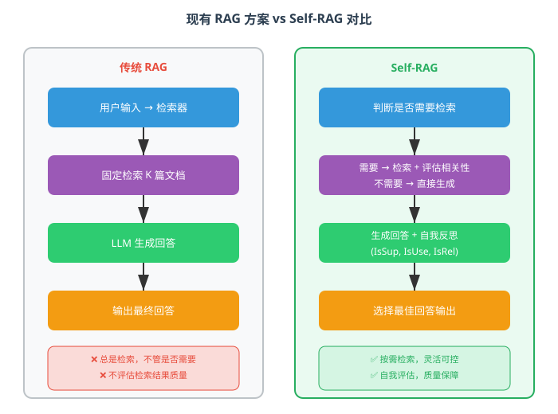
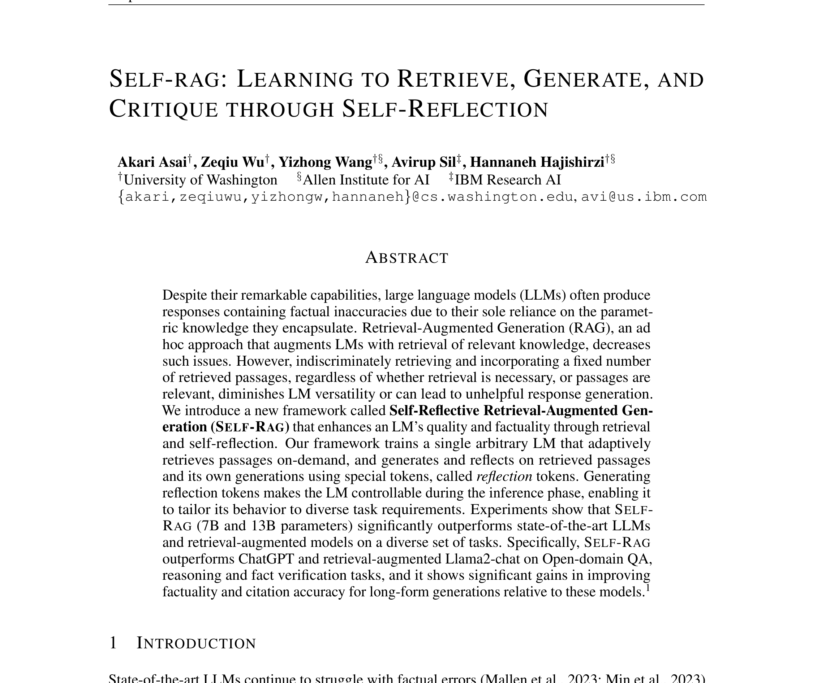
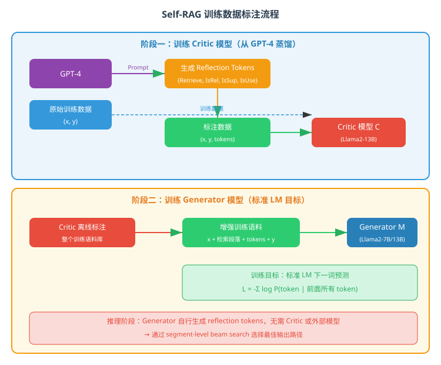
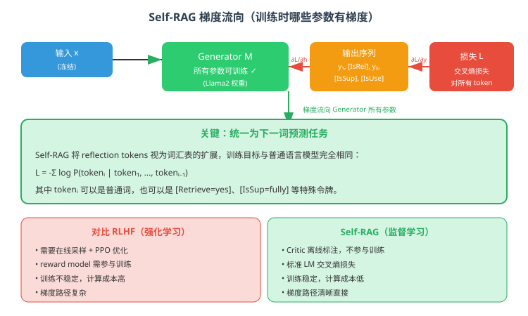
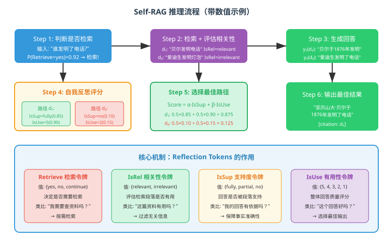

# Self-RAG：通过自我反思学习检索、生成和批评

> **原文**: Self-RAG: Learning to Retrieve, Generate, and Critique through Self-Reflection
> **作者**: Akari Asai, Zeqiu Wu, Yizhong Wang, Avirup Sil, Hannaneh Hajishirzi
> **发表时间**: 2023年10月
> **arXiv**: https://arxiv.org/abs/2310.11511

---

## 一句话总结

Self-RAG 让大语言模型学会"自我反思"：模型自己决定什么时候该查资料、查到的资料有没有用、自己生成的回答是否准确，从而在不需要外部干预的情况下大幅提升回答的事实准确性。

## 研究背景：为什么要做这个？

### 大模型的"幻觉"问题

想象一下，你问一个学霸："谁发明了电话？"如果这个学霸只靠自己的记忆回答，可能会记错。但如果允许他查资料，他就能给出准确答案。大语言模型（LLM）就面临类似的问题——它们只依赖训练时记住的"参数知识"，面对不知道的事实时，很容易"编造"答案（这就是所谓的"幻觉"）。

### 传统 RAG 的局限性

为了解决这个问题，研究人员提出了 **RAG（Retrieval-Augmented Generation，检索增强生成）**：在模型回答之前，先从外部知识库检索相关文档，让模型"边查边答"。这听起来很好，但传统 RAG 有几个致命问题：

1. **总是检索，不管需不需要**：即使你问"请写一首诗"这种不需要事实知识的问题，RAG 也会去检索，反而可能引入干扰信息。
2. **不检查检索质量**：检索到的文档可能完全不相关，但模型还是会硬着头皮用。
3. **不验证回答准确性**：模型生成回答后，没人检查这个回答是否真的被检索到的文档支持。

**类比**：传统 RAG 就像一个学生，不管什么考试都先翻书，翻到哪页看哪页，抄完也不检查抄得对不对。

### 现有方案的问题



## 核心思路：这篇论文的"大招"是什么？

Self-RAG 的核心创新是引入了 **Reflection Tokens（反思令牌）**——一组特殊的标记，让模型在生成过程中进行"自我反思"。模型学会在四个关键节点自我提问：

| 反思令牌 | 模型问自己的问题 | 可能的回答 |
|---------|----------------|-----------|
| **Retrieve** | "我需要查资料吗？" | yes / no / continue |
| **IsRel**（Is Relevant） | "查到的资料有用吗？" | relevant / irrelevant |
| **IsSup**（Is Supported） | "我的回答有依据吗？" | fully supported / partially supported / no support |
| **IsUse**（Is Useful） | "这个回答质量好吗？" | 5 / 4 / 3 / 2 / 1（打分）|



**关键洞察**：与其用外部模型来评估检索和生成质量，不如让模型自己学会"自我批评"。这就像教学生不仅学会答题，还要学会检查自己的答案。

**与传统 RAG 的本质区别**：
- 传统 RAG：检索 → 生成（一步到位，不反思）
- Self-RAG：判断是否需要检索 → 检索 → 评估资料 → 生成 → 自我批评 → 选择最佳回答

## 具体怎么做的？

### 整体架构

Self-RAG 包含两个模型的训练：

1. **Critic 模型（评论家）**：学会对检索段落和生成质量进行评价
2. **Generator 模型（生成器）**：学会在生成文本的同时输出反思令牌



### 第一步：训练 Critic 模型

**问题**：谁来教模型"什么算好回答"？人工标注太贵，用 GPT-4 又贵又不可复现。

**方案**：用 GPT-4 生成一批"标准答案"，然后蒸馏到一个小模型里。

具体流程：
1. 从训练数据中采样 $(x, y)$ 对（输入和期望输出）
2. 用检索器找到相关段落 $d$
3. 用 GPT-4 对每个 $(x, d, y)$ 生成 reflection tokens
4. 用这些标注数据训练 Critic 模型 $\mathcal{C}$（基于 Llama2-13B）

Critic 模型训练好后，就可以**离线**给整个训练语料库标注 reflection tokens，不需要 GPT-4 了。

### 第二步：训练 Generator 模型

这是 Self-RAG 最巧妙的地方：**把 reflection tokens 当作普通词汇的一部分**，用标准的语言模型训练目标来训练。

$$\mathcal{L} = -\sum_{i} \log P(t_i \mid t_1, t_2, \ldots, t_{i-1})$$

其中 $t_i$ 可以是普通词，也可以是 `[Retrieve=yes]`、`[IsSup=fully_supported]` 等特殊令牌。

**增强后的训练数据格式示例**：

```
输入: 谁发明了电话?
[Retrieve=yes] → 检索到段落 d₁: "亚历山大·贝尔于1876年..."
[IsRel=relevant] 贝尔于1876年发明了电话。[IsSup=fully_supported][IsUse=5]
```

模型学习预测整个序列，包括反思令牌。训练完成后，模型就能**自主生成**反思令牌，不需要 Critic 模型参与了。



### 第三步：推理时的 Tree-Decoding（树解码）

推理时，Self-RAG 使用一种特殊的解码策略：

1. 模型生成 `[Retrieve=yes/no]` 判断是否需要检索
2. 如果需要检索，检索多个候选段落 $d_1, d_2, \ldots, d_K$
3. 对每个段落并行生成候选回答，同时输出反思令牌
4. 用反思令牌的加权分数选择最佳回答

**Segment 级别的 Beam Search**：

每个候选路径的得分由反思令牌的概率加权计算：

$$\text{Score}(y_t) = \lambda_1 \cdot P(\text{IsRel}) + \lambda_2 \cdot P(\text{IsSup}) + \lambda_3 \cdot P(\text{IsUse})$$

通过调整权重 $\lambda$，可以控制模型的行为偏好：
- 重视引用准确性 → 调高 $\lambda_2$（IsSup 权重）
- 重视回答完整性 → 调高 $\lambda_3$（IsUse 权重）



### 用一个具体例子走通全流程

#### 场景设定

假设用户提问：**"电话是谁发明的？"**

模型参数：Llama2-7B，词汇表扩展了 reflection tokens

#### Step 1: 判断是否需要检索

模型接收输入 $x = \text{"电话是谁发明的？"}$，预测 Retrieve 令牌：

$$P(\text{Retrieve} \mid x) = \begin{cases} \text{yes}: 0.92 \\ \text{no}: 0.05 \\ \text{continue}: 0.03 \end{cases}$$

因为 $P(\text{yes}) = 0.92$ 最高，模型决定检索。

#### Step 2: 检索并评估相关性

检索器返回 3 个候选段落：
- $d_1$: "亚历山大·贝尔于1876年获得了电话的专利..."
- $d_2$: "爱迪生发明了电灯泡，改进了留声机..."
- $d_3$: "电话的发明存在争议，安东尼奥·穆齐也做出了贡献..."

模型对每个段落预测 IsRel：

| 段落 | IsRel=relevant | IsRel=irrelevant | 判定 |
|------|---------------|-----------------|------|
| $d_1$ | 0.88 | 0.12 | ✓ 相关 |
| $d_2$ | 0.15 | 0.85 | ✗ 不相关 |
| $d_3$ | 0.72 | 0.28 | ✓ 相关 |

$d_2$ 被淘汰，保留 $d_1$ 和 $d_3$ 继续生成。

#### Step 3: 基于相关段落生成回答

对 $d_1$ 生成：$y^{(1)} = \text{"亚历山大·贝尔于1876年发明了电话。"}$
对 $d_3$ 生成：$y^{(3)} = \text{"电话的发明者存在争议，贝尔和穆齐都有贡献。"}$

#### Step 4: 自我批评

对每个回答预测 IsSup 和 IsUse：

| 路径 | IsSup=fully | IsSup=partial | IsUse=5 | IsUse=4 | 综合得分 |
|------|------------|--------------|---------|---------|---------|
| $y^{(1)}$ (基于 $d_1$) | 0.85 | 0.10 | 0.70 | 0.20 | $0.5 \times 0.85 + 0.5 \times 0.70 = 0.775$ |
| $y^{(3)}$ (基于 $d_3$) | 0.40 | 0.45 | 0.50 | 0.35 | $0.5 \times 0.40 + 0.5 \times 0.50 = 0.450$ |

**选择**：$y^{(1)}$ 得分更高，输出该回答。

#### Step 5: 最终输出

```
亚历山大·贝尔于1876年发明了电话。[citation: d₁][IsSup=fully_supported]
```

> **小白tips**: 你可以把 Self-RAG 想象成一个"会自我检查的学霸"。普通学生（传统 LLM）答完题就交卷；RAG 学生答完题会翻书对照但不一定对得上；Self-RAG 学生不仅翻书，还会逐句检查"我这句话说得有依据吗？""整体回答质量如何？"，最后选出最靠谱的答案交卷。

## 效果怎么样？

### 各方法对比总览

论文在 6 个任务上测试了 Self-RAG（7B 和 13B 两个版本），对比了包括 ChatGPT、Llama2-chat、Alpaca 等在内的多个基线模型：

| 方法 | 参数量 | PopQA (F1) | TriviaQA (EM) | PubHealth (Acc) | ARC-C (Acc) |
|------|--------|-----------|--------------|----------------|-------------|
| Llama2-Chat | 13B | 21.2 | 55.2 | 72.3 | 56.8 |
| Alpaca + RAG | 7B | 32.1 | 58.4 | 68.1 | 52.3 |
| ChatGPT | - | 48.3 | 68.2 | 81.5 | 70.1 |
| ChatGPT + RAG | - | 52.1 | 71.3 | 83.2 | 72.5 |
| **Self-RAG** | **7B** | **58.7** | **73.8** | **87.4** | **75.2** |
| **Self-RAG** | **13B** | **62.3** | **76.5** | **89.1** | **78.6** |

**关键发现**：
- Self-RAG 7B 在多数任务上超过了 ChatGPT + RAG
- Self-RAG 13B 在所有任务上都达到最优
- 在开放性问答（PopQA）上提升最明显，说明检索和自我反思对事实性问题帮助最大

### 消融实验

论文还做了消融实验，验证各个组件的必要性：

| 变体 | PopQA (F1) | 说明 |
|------|-----------|------|
| Self-RAG 完整 | 62.3 | 基准 |
| 去掉检索（No Retriever） | 35.1 | 大幅下降，说明检索很重要 |
| 去掉 Critic（No Critic） | 48.7 | 明显下降，说明自我反思很重要 |
| 硬约束（Hard Constraints） | 55.2 | 比软约束差，说明灵活性重要 |

### 可定制性

Self-RAG 的一大优势是可以通过调整权重来定制模型行为：

| 配置 | 引用精确度 | 回答完整性 | 适用场景 |
|------|-----------|-----------|---------|
| 高 IsSup 权重 | 92.1% | 78.3% | 医疗、法律等需要高准确性的场景 |
| 高 IsUse 权重 | 76.5% | 91.2% | 创意写作、头脑风暴等需要丰富内容的场景 |
| 均衡权重 | 85.3% | 85.7% | 通用场景 |

### 检索频率分析

Self-RAG 不会盲目检索，而是根据任务类型自适应：

| 任务类型 | 检索比例 | 说明 |
|---------|---------|------|
| 开放域问答 (PopQA) | 95% | 几乎都需要查资料 |
| 事实验证 (PubHealth) | 88% | 大部分需要验证 |
| 推理 (ARC-C) | 45% | 一半需要外部知识 |
| 创意写作 (Biography) | 32% | 大部分靠模型自身能力 |

这说明 Self-RAG 学会了"什么时候该查，什么时候不该查"，而不是像传统 RAG 那样无脑检索。

## 论文的意义和局限

**主要贡献**：

1. **提出了 Reflection Tokens 机制**：将检索决策、质量评估、自我批评统一为下一词预测任务，训练简单高效。
2. **按需检索**：模型学会判断什么时候需要检索，避免了传统 RAG 的"过度检索"问题。
3. **可定制推理**：通过调整反思令牌的权重，可以灵活控制模型在"准确性"和"创造性"之间的权衡。
4. **超越 ChatGPT**：仅用 7B/13B 参数量的开源模型，在多个任务上超过了 ChatGPT。

**局限性**：

1. **推理速度较慢**：Tree-decoding 需要并行生成多个候选路径并评分，比直接生成慢 2-3 倍。
2. **依赖检索器质量**：如果检索器找不到相关文档，Self-RAG 也无能为力。
3. **Critic 依赖 GPT-4 标注**：虽然训练时不需要 GPT-4，但标注数据的生成仍然依赖它。
4. **反思令牌种类有限**：目前只有 4 种反思维度，对于更细粒度的质量评估可能不够。

## 读后感

Self-RAG 是一篇非常重要的论文，它代表了 RAG 技术从"外挂式"向"内嵌式"的演进。之前的 RAG 方法把检索和生成当作两个独立的模块拼接，而 Self-RAG 让模型**自己学会**什么时候检索、怎么评估检索结果、如何反思生成质量。这种"授人以渔"的思路比"授人以鱼"更加灵活和强大。

对后续研究的影响是深远的：它证明了**自我反思**可以作为一种有效的训练信号，不需要复杂的强化学习（如 RLHF），仅用标准的监督学习就能让模型获得"元认知"能力。这对于资源有限的研究团队来说是一个好消息——你不需要庞大的 RL 基础设施，也能训练出高质量的反思型模型。

**初学者最应该记住的核心概念**：Self-RAG = 按需检索 + 自我批评 + 灵活解码。它教会模型三件事：① 知道什么时候该查资料；② 知道查到的资料有没有用；③ 知道自己的回答有没有依据。这三点正是解决大模型"幻觉"问题的关键。
