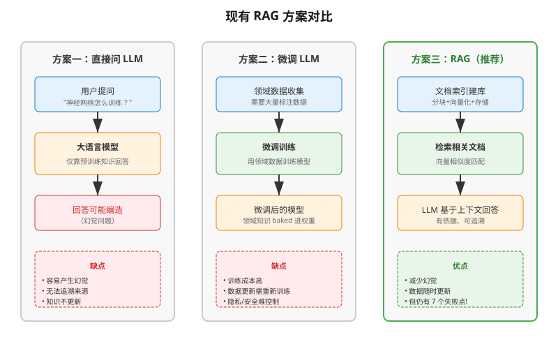
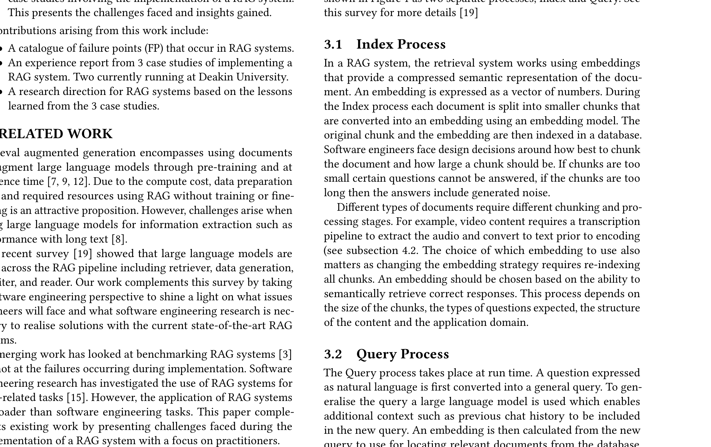
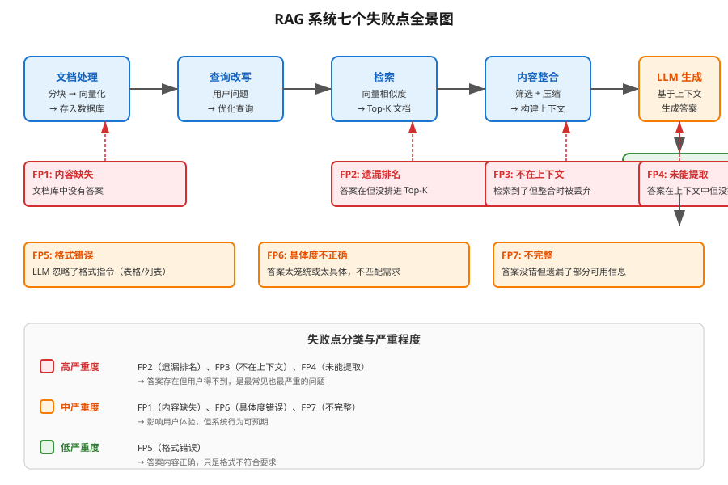

# 构建检索增强生成系统的七个失败点

> **原文**: Seven Failure Points When Engineering a Retrieval Augmented Generation System
> **作者**: Scott Barnett, Stefanus Kurniawan, Srikanth Thudumu, Zach Brannelly, Mohamed Abdelrazek
> **发表时间**: 2024年1月
> **arXiv**: [2401.05856](https://arxiv.org/abs/2401.05856)
> **会议**: 3rd International Conference on AI Engineering — Software Engineering for AI, 2024, Lisbon, Portugal

---

## 一句话总结

这篇论文通过三个真实案例研究发现，构建 RAG（检索增强生成）系统时会遇到 **7 种典型的失败场景**，并总结了工程师在实践中必须牢记的关键教训。

## 研究背景：为什么要做这个？

### RAG 是什么？

想象你去图书馆找一本书来回答一个问题。RAG 系统做的就是类似的事：

1. **检索（Retrieval）**：先在你的文档库里找到和问题最相关的几段文字
2. **生成（Generation）**：把找到的文字交给大语言模型（LLM），让它基于这些内容生成答案

这样做的好处是：
- **减少幻觉**：LLM 不会凭空编造，而是基于检索到的真实文档回答
- **可追溯来源**：答案可以链接到原始文档
- **无需标注数据**：不像微调那样需要大量人工标注

### 现有方案的问题

虽然 RAG 听起来很美好，但在实际工程中，从文档处理到答案生成的整条链路上，**每一步都可能出错**。之前的研究多关注算法层面的改进，却很少有人从**软件工程**的角度系统梳理：在实际搭建 RAG 系统时，到底会在哪些环节翻车？

### 现有方案的问题



## 核心思路：这篇论文的"大招"是什么？

这篇论文不是提出新算法，而是一份**经验报告（Experience Report）**。作者团队在三个不同领域（学术研究、教育、生物医学）实际搭建了 RAG 系统，从中总结出了 **7 个失败点（Failure Points, FP）** 和一系列工程教训。

关键 insight：**RAG 系统的鲁棒性不是设计出来的，而是在运行中不断演化出来的。**



上图是论文的核心架构图，红色框标注了 7 个失败点在 RAG 流水线中的位置。整个流程分为两大部分：

- **索引流程（Index Process）**：文档分块 → 向量化 → 存入数据库
- **查询流程（Query Process）**：用户提问 → 查询改写 → 检索相似文档 → 重排序 → 内容整合 → LLM 生成答案

## 具体怎么做的？

### 三个案例研究

| 案例 | 领域 | 文档类型 | 规模 | 用途 |
|------|------|----------|------|------|
| **Cognitive Reviewer** | 学术研究 | PDF 论文 | 任意大小 | 帮助研究者做文献综述 |
| **AI Tutor** | 教育 | 视频、HTML、PDF | 38 份材料 | 学生向 AI 助教提问课程问题 |
| **BioASQ** | 生物医学 | 科学 PDF | 4017 篇文档，1000 个问答对 | 生物医学问答系统 |

### 七个失败点详解

#### FP1：内容缺失（Missing Content）

**场景**：用户问了一个文档库里根本没有答案的问题。

**理想情况**：系统回答"抱歉，我不知道"。

**实际情况**：如果问题与文档内容相关但文档中没有确切答案，系统可能被"诱导"给出错误回答。

**类比**：就像你问图书管理员一个图书馆里没有书能回答的问题，管理员可能会凭印象瞎编一个听起来合理的答案。

#### FP2：遗漏排名靠前的文档（Missed the Top Ranked Documents）

**场景**：答案确实在文档库里，但检索时没有排进前 K 名，所以没被返回给用户。

**原因**：理论上应该检索所有文档，但实际工程中只返回 top-K（K 是根据性能权衡选定的值）。如果答案在第 K+1 个文档里，就错过了。

**类比**：搜索引擎只给你看前 10 条结果，但你要的答案在第 11 条。

#### FP3：不在上下文中（Not in Context - 整合策略限制）

**场景**：包含答案的文档已经被检索出来了，但在后续的"内容整合"阶段被丢弃了，没有进入 LLM 的上下文。

**原因**：LLM 有 token 数量限制（比如一次最多处理 8K token），当检索到大量文档时，必须进行筛选和压缩。如果压缩策略不当，包含答案的文档可能被丢掉。

#### FP4：未能提取（Not Extracted）

**场景**：答案明明就在 LLM 的上下文中，但 LLM 没能正确提取出来。

**原因**：上下文中噪声太多，或者存在相互矛盾的信息，导致 LLM "看花了眼"。

**类比**：给你一篇 10 页的文章让你找一个具体数字，文章里还混入了很多无关内容和互相矛盾的说法，你也很可能会找错。

#### FP5：格式错误（Wrong Format）

**场景**：用户要求以特定格式输出（比如表格、列表），但 LLM 忽略了指令。

**原因**：LLM 的指令遵循能力有限，特别是在复杂上下文中。

#### FP6：具体度不正确（Incorrect Specificity）

**场景**：答案返回了，但要么太笼统，要么太具体，不符合用户需求。

**典型场景**：
- 教育场景中，老师希望 AI 不仅给出答案，还要给出教学性的解释
- 用户不知道如何精确提问，问得太宽泛

#### FP7：不完整（Incomplete）

**场景**：答案不算错，但遗漏了部分信息——即使这些信息在上下文中是可用的。

**典型场景**：用户问"文档 A、B、C 的要点分别是什么？"更好的做法是分开问三个问题。

### 工程教训总结

| 失败点 | 教训 | 来源案例 |
|--------|------|----------|
| FP4 | **更大的上下文 = 更好的结果**（8K 比 4K 更准确） | AI Tutor |
| FP1 | **语义缓存能降低成本和延迟**：用常见问题预填充缓存 | AI Tutor |
| FP5-7 | **越狱攻击会绕过 RAG 直接命中 LLM 的安全训练**：微调 LLM 可能破坏安全训练，需测试 | AI Tutor |
| FP2, FP4 | **添加元数据能改善检索**：把文件名、块编号加入上下文帮助 LLM 提取信息 | AI Tutor |
| FP2, FP4-7 | **开源嵌入模型在小文本上表现更好** | BioASQ, AI Tutor |
| FP2-7 | **RAG 系统需要持续校准**：运行时收到未知输入，需要持续监控 | AI Tutor, BioASQ |
| FP1, FP2 | **需要专门的 RAG 流水线来做配置调优**：分块大小、嵌入策略、检索策略、整合策略、上下文大小、提示词都需要校准 | 全部案例 |
| FP2, FP4 | **拼装式 RAG 方案不如端到端训练** | BioASQ, AI Tutor |
| FP2-7 | **性能测试只能在运行时进行**：离线评估（如 G-Evals）需要有标注的问答对 | 全部案例 |

## 用一个具体例子走通 RAG 全流程

让我们用一个简化场景来理解 RAG 系统是如何工作的，以及失败点在哪里出现。

### 场景设定

假设我们有一个 **AI 课程助教系统**，文档库里有 3 份课程材料：

- **文档 A**：第 1 周内容——"什么是机器学习？监督学习 vs 无监督学习"
- **文档 B**：第 6 周内容——"神经网络的训练：反向传播算法"
- **文档 C**：第 10 周内容——"Transformer 架构详解"

用户提问：**"神经网络是怎么训练的？"**

### Step 1：索引流程（开发时完成）

```
文档 A → 分块 → A1("机器学习定义"), A2("监督学习"), A3("无监督学习")
文档 B → 分块 → B1("神经网络基础"), B2("反向传播"), B3("梯度下降")
文档 C → 分块 → C1("Attention机制"), C2("Transformer结构"), C3("应用场景")
```

每个分块通过嵌入模型（如 text-embedding-ada-002）转换为向量：

$$
\text{chunk} \xrightarrow{\text{Embedding Model}} \vec{v} \in \mathbb{R}^{1536}
$$

### Step 2：查询流程（运行时）

**2.1 查询改写**

用户原始问题："神经网络是怎么训练的？"

查询改写器（LLM）将其改写为更利于检索的形式：
> "神经网络训练方法 反向传播 梯度下降 权重更新"

**2.2 向量检索**

将改写后的查询转换为向量 $\vec{q}$，然后与所有分块向量计算余弦相似度：

$$
\text{similarity}(\vec{q}, \vec{v}_i) = \frac{\vec{q} \cdot \vec{v}_i}{\|\vec{q}\| \cdot \|\vec{v}_i\|}
$$

假设 top-3 检索结果为：

| 排名 | 分块 | 相似度 | 内容 |
|------|------|--------|------|
| 1 | B2 | 0.89 | "反向传播是神经网络训练的核心..." |
| 2 | B3 | 0.82 | "梯度下降通过计算损失函数的梯度..." |
| 3 | B1 | 0.75 | "神经网络由多层神经元组成..." |

**这里可能出现 FP2**：如果答案在 B1 但在第 4 名，设置 top-3 就会遗漏。

**2.3 重排序**

对检索结果进行二次排序，确保最相关的排在最前面。

**2.4 内容整合**

将 top-3 分块拼接为上下文（假设总 token 数在限制内）：

```
上下文 = B2 + B3 + B1
```

**这里可能出现 FP3**：如果检索到 20 个分块但上下文只能容纳 5 个，整合策略可能丢掉关键分块。

**2.5 LLM 生成**

将上下文和用户问题一起送入 LLM：

```
系统提示：请基于以下上下文回答问题。
上下文：[B2 + B3 + B1 的内容]
问题：神经网络是怎么训练的？
```

LLM 生成答案。

**这里可能出现 FP4**：如果上下文中混入了不相关内容（比如 A2 关于监督学习的定义），LLM 可能被干扰。

**这里可能出现 FP5**：如果用户要求"用表格列出训练步骤"，LLM 可能忽略格式要求。

**这里可能出现 FP6**：答案可能太学术（"通过反向传播算法最小化交叉熵损失函数"）或太简单（"就是让网络学习"）。

**这里可能出现 FP7**：用户问"反向传播和梯度下降有什么区别？"，LLM 可能只回答了其中一个。

### 失败点全景图



## 效果怎么样？

### BioASQ 实验结果

作者使用 BioASQ 数据集进行了定量实验：

- **文档规模**：4017 篇生物医学开放获取文档
- **问答对**：1000 个由生物医学专家标注的问答对
- **评估方法**：OpenAI Evals 自动评估 + 人工复核

**关键发现**：
- 自动评估比人工评分更"悲观"——在生物医学这种专业领域，LLM 可能比非专家评委知道得更多
- 手动检查了 40 个问题，识别出了上述 7 种失败模式的实际案例

### 各失败点的出现频率

从实验和案例研究中，作者发现：

| 失败点 | 出现频率 | 严重程度 |
|--------|----------|----------|
| FP1 内容缺失 | 高频 | 中 |
| FP2 遗漏排名 | 高频 | 高 |
| FP3 不在上下文 | 中频 | 高 |
| FP4 未能提取 | 高频 | 高 |
| FP5 格式错误 | 低频 | 低 |
| FP6 具体度错误 | 中频 | 中 |
| FP7 不完整 | 中频 | 中 |

## 未来研究方向

论文最后提出了三个重要的研究方向：

### 1. 分块与嵌入（Chunking and Embeddings）

- **分块策略**：启发式分块（按标点、段落）vs 语义分块（按文本语义边界），哪种更好？
- **多模态嵌入**：如何为表格、图片、公式等多媒体内容生成嵌入？
- **查询预处理**：如何处理否定查询和模糊查询？

### 2. RAG vs 微调（Finetuning）

| 维度 | RAG | 微调 |
|------|-----|------|
| 数据更新 | 随时添加新文档 | 需要重新训练 |
| 隐私控制 | 可按文档控制访问 | 数据 baked 进模型 |
| 成本 | 按调用付费 | 训练成本高 |
| 准确性 | 依赖检索质量 | 领域适应更好 |
| 鲁棒性 | 需持续校准 | 相对稳定 |

### 3. 测试与监控

- RAG 系统需要应用特定的问答对进行测试，但这些数据在索引时通常不可用
- 如何用 LLM 自动生成高质量的测试问答对？
- 如何借鉴自适应系统的思想来监控和自动调整 RAG 系统？

## 论文的意义和局限

**主要贡献**：

1. **首个从软件工程角度系统分析 RAG 失败点的实证研究**——不是算法改进，而是工程实践指南
2. **7 个失败点的分类体系**——为从业者提供了排查 RAG 问题的检查清单
3. **三个真实案例的经验报告**——涵盖学术研究、教育、生物医学三个不同领域
4. **两个核心结论**：
   - RAG 系统的验证只能在运行时进行
   - RAG 系统的鲁棒性是演化出来的，不是设计出来的

**局限性**：

1. 案例研究规模有限——最大的实验也只有 4017 篇文档
2. 两个案例（Cognitive Reviewer、AI Tutor）因保密原因未公开数据
3. 缺乏对失败点出现频率的量化统计
4. 未提供系统性的解决方案，主要是问题识别

## 读后感

这篇论文的价值在于它**不是又一个提出新 RAG 架构的论文**，而是脚踏实地地从工程实践中总结教训。对于正在或准备搭建 RAG 系统的工程师来说，这 7 个失败点就像一份"避坑指南"——在你开始写代码之前，先知道可能会在哪里摔倒。

**最应该记住的两点**：

1. **RAG 系统不是搭好就完事的**——它需要持续监控、持续校准、持续调整
2. **测试 RAG 系统很难**——因为你事先不知道用户会问什么问题，也没有标注好的问答对来评估

如果你正在搭建 RAG 系统，建议把这 7 个失败点打印出来贴在墙上，每次遇到问题时对照一下："我遇到的是哪个 FP？"
