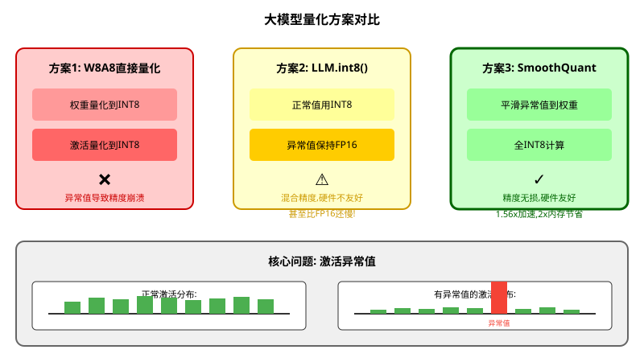
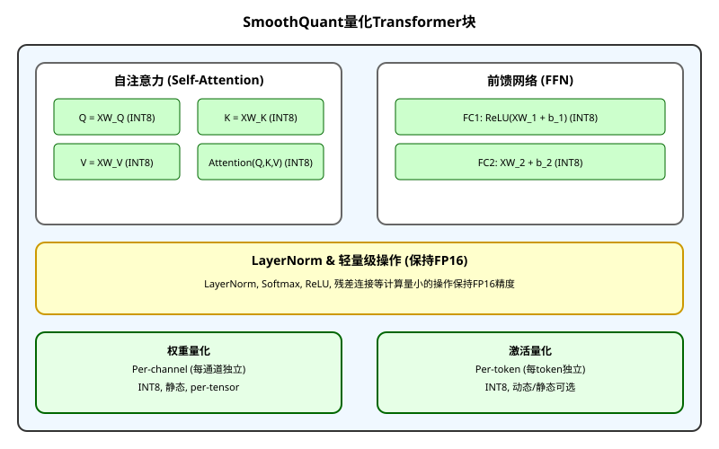

# SmoothQuant: 让大模型量化既准确又高效

> **原文**: SmoothQuant: Accurate and Efficient Post-Training Quantization for Large Language Models
> **作者**: Guangxuan Xiao, Ji Lin, Mickael Seznec, Hao Wu, Julien Demouth, Song Han
> **发表时间**: 2022年 (ICML)
> **arXiv**: https://arxiv.org/abs/2211.10438

---

## 一句话总结

这篇论文发现大语言模型量化难是因为**激活值中有少量异常大的通道**,通过一个简单的**数学等价变换**把这些异常值"平滑"到权重上,实现了**首个真正高效的W8A8(8bit权重+8bit激活)量化**,让5300亿参数的模型能在8张GPU上运行。

## 研究背景:为什么要做这个?

### 大模型的内存墙

想象你要在手机上运行GPT-3(1750亿参数):
- **FP16精度**: 需要350GB内存
- **现实**: 最顶级的A100 GPU只有80GB内存
- **结果**: 需要5-8张GPU才能跑起来,成本极高

量化是解决方案:把16位浮点数变成8位整数,内存直接减半!

### 但激活量化是个难题

**权重容易量化**: 分布均匀平坦,像整齐的队列
**激活难以量化**: 有少量"异常值"通道,值特别大(比正常值大100倍!)

这就像:你要给全班同学拍照,99%同学身高1.6-1.8米,但有几个人身高10米。为了让所有人都进画面,你只能把相机拉得很远,结果大多数人的照片只有几个像素,根本看不清。

### 现有方案的问题

**关键发现**: 异常值不是随机出现的,而是**持久出现在固定的通道**中。这意味着我们可以离线处理它们!

## 核心思路:这篇论文的"大招"是什么?

### 核心Insight

作者发现了一个巧妙的数学性质:**可以在激活和权重之间"转移"量化难度,而不改变输出结果**。

这就像是:你和朋友合伙开公司,利润是固定的。你可以选择:
- 你拿90%,朋友拿10%(你交税多)
- 你拿50%,朋友拿50%(大家交税均衡)
- 你拿10%,朋友拿90%(朋友交税多)

**总利润不变,但税负分配不同**。SmoothQuant做的就是类似的"税负优化"——把量化难度从激活(税负重)转移到权重(税负轻),让两者都容易量化。

### 数学等价变换

核心公式:

$$\mathbf{Y} = \mathbf{X}\mathbf{W} = (\mathbf{X} \cdot \text{diag}(\mathbf{s})^{-1}) \cdot (\text{diag}(\mathbf{s}) \cdot \mathbf{W}) = \hat{\mathbf{X}}\hat{\mathbf{W}}$$

其中:
- $\mathbf{X}$: 原始激活(有异常值)
- $\mathbf{W}$: 原始权重(分布平坦)
- $\mathbf{s}$: 平滑因子(逐通道)
- $\hat{\mathbf{X}}$: 平滑后的激活(异常值被压制)
- $\hat{\mathbf{W}}$: 调整后的权重(仍然平坦)

**关键**: $\mathbf{X}\mathbf{W} = \hat{\mathbf{X}}\hat{\mathbf{W}}$,输出完全一样!

### 平滑因子的选择

$$s_j = \frac{\max(|\mathbf{X}_j|)^\alpha}{\max(|\mathbf{W}_j|)^{1-\alpha}}$$

- $\alpha = 0.5$: 均衡分配难度(适合OPT、BLOOM)
- $\alpha = 0.75-0.9$: 更多推到权重(适合GLM、LLaMA)

## 具体怎么做的?

### 1. 量化困难分析

#### 为什么激活难以量化?

**有效量化级别**的概念:

假设激活矩阵中:
- 99%的通道: 最大值=1
- 1%的异常值通道: 最大值=100

用INT8量化(255个级别):
- 异常值通道: 充分利用255个级别
- 正常通道: 只能用 $255 \times \frac{1}{100} = 2.55$ 个级别!

**这就像用米尺测量毫米级的物体,精度极差!**

#### 为什么per-channel量化不能用?

per-channel量化(每个通道独立量化)能保持精度,但**硬件不支持**:

INT8 GEMM(通用矩阵乘法)的硬件实现(如Tensor Core)只能在**外维度**(token维度和输出通道维度)做缩放,不能在**内维度**(输入通道维度)做缩放。

这就像是:工厂流水线只能在整个批次开始和结束时调整参数,不能在中间每个零件都调整。

### 2. SmoothQuant平滑变换

#### 步骤1: 收集校准数据

用512个随机句子通过模型,记录每个线性层的输入激活$\mathbf{X}$。

#### 步骤2: 计算平滑因子

对每个输入通道$j$:
$$s_j = \frac{\max(|\mathbf{X}_j|)^{0.5}}{\max(|\mathbf{W}_j|)^{0.5}}$$

#### 步骤3: 应用变换

$$\hat{\mathbf{X}} = \mathbf{X} \cdot \text{diag}(\mathbf{s})^{-1}$$
$$\hat{\mathbf{W}} = \text{diag}(\mathbf{s}) \cdot \mathbf{W}$$

#### 步骤4: 离线融合

因为$\mathbf{X}$通常来自前一层(线性层或LayerNorm),平滑因子可以**离线融合**到前一层的参数中,**运行时零开销**!

### 3. Transformer块量化

**量化策略**:
- **计算密集型操作**(线性层、矩阵乘法): **INT8**
- **轻量级操作**(LayerNorm、Softmax、ReLU): **FP16**

这样既保证了速度,又保证了精度!

## 用一个具体例子走通全流程

### 场景设定

假设有一个简单的线性层:
- 激活 $\mathbf{X} \in \mathbb{R}^{2 \times 3}$ (2个token, 3个输入通道)
- 权重 $\mathbf{W} \in \mathbb{R}^{3 \times 2}$ (3个输入通道, 2个输出通道)

具体数值(注意通道2有异常值):
$$\mathbf{X} = \begin{bmatrix} 0.5 & 0.3 & \mathbf{50.0} \\ 0.4 & 0.2 & \mathbf{48.0} \end{bmatrix}, \quad \mathbf{W} = \begin{bmatrix} 0.1 & -0.2 \\ 0.3 & 0.1 \\ 0.05 & 0.08 \end{bmatrix}$$

### Step 1: 直接量化的问题

如果用per-tensor INT8量化:
- $\Delta_X = \frac{50.0}{127} = 0.394$
- 量化后: $\bar{\mathbf{X}} = \lceil \frac{\mathbf{X}}{0.394} \rfloor$

$$\bar{\mathbf{X}} = \begin{bmatrix} 1 & 1 & 127 \\ 1 & 1 & 122 \end{bmatrix}$$

反量化回浮点:
$$\bar{\mathbf{X}} \cdot 0.394 = \begin{bmatrix} 0.394 & 0.394 & 50.0 \\ 0.394 & 0.394 & 48.1 \end{bmatrix}$$

**误差**:
- 通道0: $|0.5 - 0.394| = 0.106$ (相对误差21%!)
- 通道1: $|0.3 - 0.394| = 0.094$ (相对误差31%!)
- 通道2: $|50.0 - 50.0| = 0$ (完美)

**问题**: 异常值通道完美量化,但正常通道误差巨大!

### Step 2: 计算平滑因子

取$\alpha = 0.5$:

$$s_j = \frac{\max(|\mathbf{X}_j|)^{0.5}}{\max(|\mathbf{W}_j|)^{0.5}}$$

- 通道0: $s_0 = \frac{0.5^{0.5}}{0.3^{0.5}} = \frac{0.707}{0.548} = 1.29$
- 通道1: $s_1 = \frac{0.3^{0.5}}{0.3^{0.5}} = 1.0$
- 通道2: $s_2 = \frac{50.0^{0.5}}{0.08^{0.5}} = \frac{7.07}{0.283} = 24.98$

### Step 3: 应用平滑变换

$$\hat{\mathbf{X}} = \mathbf{X} \cdot \text{diag}(\mathbf{s})^{-1} = \begin{bmatrix} 0.5 & 0.3 & 50.0 \\ 0.4 & 0.2 & 48.0 \end{bmatrix} \begin{bmatrix} 1/1.29 & 0 & 0 \\ 0 & 1/1.0 & 0 \\ 0 & 0 & 1/24.98 \end{bmatrix}$$

$$\hat{\mathbf{X}} = \begin{bmatrix} 0.388 & 0.3 & 2.0 \\ 0.310 & 0.2 & 1.92 \end{bmatrix}$$

$$\hat{\mathbf{W}} = \text{diag}(\mathbf{s}) \cdot \mathbf{W} = \begin{bmatrix} 1.29 & 0 & 0 \\ 0 & 1.0 & 0 \\ 0 & 0 & 24.98 \end{bmatrix} \begin{bmatrix} 0.1 & -0.2 \\ 0.3 & 0.1 \\ 0.05 & 0.08 \end{bmatrix}$$

$$\hat{\mathbf{W}} = \begin{bmatrix} 0.129 & -0.258 \\ 0.3 & 0.1 \\ 1.249 & 1.998 \end{bmatrix}$$

### Step 4: 量化平滑后的激活

现在$\hat{\mathbf{X}}$的最大值是2.0,没有异常值了!

- $\Delta_{\hat{X}} = \frac{2.0}{127} = 0.0157$
- 量化后: $\bar{\hat{\mathbf{X}}} = \lceil \frac{\hat{\mathbf{X}}}{0.0157} \rfloor$

$$\bar{\hat{\mathbf{X}}} = \begin{bmatrix} 25 & 19 & 127 \\ 20 & 13 & 122 \end{bmatrix}$$

反量化:
$$\bar{\hat{\mathbf{X}}} \cdot 0.0157 = \begin{bmatrix} 0.393 & 0.298 & 2.0 \\ 0.314 & 0.204 & 1.92 \end{bmatrix}$$

**误差**:
- 通道0: $|0.388 - 0.393| = 0.005$ (相对误差1.3%!)
- 通道1: $|0.3 - 0.298| = 0.002$ (相对误差0.7%!)
- 通道2: $|2.0 - 2.0| = 0$ (完美)

**对比**: 直接量化误差21-31%,平滑后只有0.7-1.3%!

### Step 5: 验证输出等价

**原始输出**:
$$\mathbf{Y} = \mathbf{X}\mathbf{W} = \begin{bmatrix} 0.5 & 0.3 & 50.0 \\ 0.4 & 0.2 & 48.0 \end{bmatrix} \begin{bmatrix} 0.1 & -0.2 \\ 0.3 & 0.1 \\ 0.05 & 0.08 \end{bmatrix} = \begin{bmatrix} 2.64 & 4.67 \\ 2.50 & 4.44 \end{bmatrix}$$

**平滑后输出**:
$$\hat{\mathbf{Y}} = \hat{\mathbf{X}}\hat{\mathbf{W}} = \begin{bmatrix} 0.388 & 0.3 & 2.0 \\ 0.310 & 0.2 & 1.92 \end{bmatrix} \begin{bmatrix} 0.129 & -0.258 \\ 0.3 & 0.1 \\ 1.249 & 1.998 \end{bmatrix} = \begin{bmatrix} 2.64 & 4.67 \\ 2.50 & 4.44 \end{bmatrix}$$

**完全一样!** 数学等价变换保证了精度无损。

## 效果怎么样?

### OPT-175B量化结果

| 方法 | LAMBADA | HellaSwag | PIQA | WinoGrande | 平均 | WikiText PPL |
|------|---------|-----------|------|------------|------|-------------|
| FP16 | 74.7% | 59.3% | 79.7% | 72.6% | **66.9%** | **10.99** |
| W8A8直接 | 0.0% | 25.6% | 53.4% | 50.3% | 35.5% | 93080 |
| LLM.int8() | 74.7% | 59.2% | 79.7% | 72.1% | 66.7% | 11.10 |
| **SmoothQuant-O1** | 74.7% | 59.2% | 79.7% | 71.2% | **66.5%** | **11.11** |
| **SmoothQuant-O3** | 74.6% | 58.9% | 79.7% | 71.2% | **66.8%** | **11.17** |

**关键发现**:
- W8A8直接量化**完全崩溃**(平均精度35.5% vs 基线66.9%)
- LLM.int8()保持精度但**速度慢**
- SmoothQuant**精度几乎无损**,且**速度快1.56x**

### 加速和内存节省

**单GPU推理**(OPT-30B):
- 加速: **1.51x** (422ms → 314ms)
- 内存: **1.91x节省** (57GB → 30GB)

**多GPU推理**(OPT-175B):
- 使用**一半数量GPU** (16 → 8)
- 延迟相同 (838ms vs 839ms)
- 内存减半 (1068GB → 545GB)

**首次实现**: 5300亿参数的MT-NLG模型在**单节点(8×A100)**内服务!

### 泛化性

SmoothQuant适用于多种LLM:

| 模型 | FP16 PPL | W8A8 SQ PPL | $\alpha$ |
|------|---------|------------|---------|
| OPT-175B | 10.99 | 11.17 | 0.5 |
| BLOOM-176B | - | - | 0.5 |
| LLaMA-65B | 6.17 | 6.20 | 0.8 |
| Llama-2-70B | 3.320 | 3.359 | 0.9 |
| Falcon-40B | 5.228 | 5.255 | 0.7 |
| Mistral-7B | 5.253 | 5.277 | 0.8 |
| Mixtral-8x7B | 3.842 | 3.893 | 0.8 |

所有模型都实现了**无损或接近无损**的W8A8量化!

## 论文的意义和局限

### 主要贡献

1. **理论洞察**: 发现激活异常值持久出现在固定通道,为离线平滑提供了理论基础
2. **算法创新**: 提出数学等价平滑变换,首次实现高效的W8A8量化
3. **工程价值**: 使5300亿参数模型能在单节点服务,大幅降低部署成本

### 局限性

1. **仅适用于线性层**: 注意力机制中的非线性操作需要特殊处理
2. **需要校准数据**: 虽然只需512个样本,但某些场景可能不可得
3. **$\alpha$需要调优**: 不同模型需要不同的迁移强度

## 读后感

SmoothQuant是**优雅理论与实用工程的完美结合**。它告诉我们:

1. **简单数学变换的强大力量**: 一个对角矩阵乘法,解决了大模型量化的核心难题
2. **硬件感知算法设计的重要性**: 不仅要精度好,还要硬件能高效执行
3. **离线优化的价值**: 把运行时能做的计算提前到离线阶段,运行时零开销

**对后续研究的影响**:
- 为W8A8量化设立了新标准
- 启发了后续的4bit量化研究(如AWQ、QuaRot)
- 推动了LLM在边缘设备的部署

**初学者应该记住的核心思想**:
> **通过数学等价变换,在激活和权重之间转移量化难度,让两者都容易量化**

这个思想不仅适用于量化,也适用于任何需要在多个组件间分配约束的优化问题。
