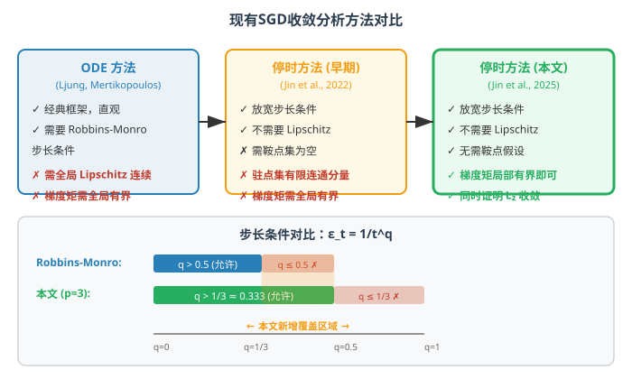
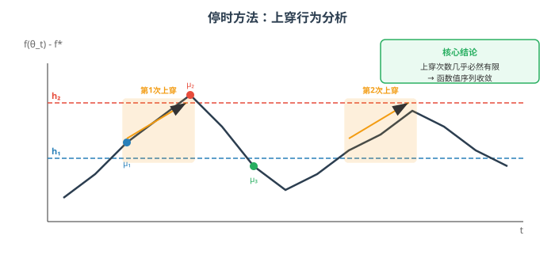

# 非凸问题中随机梯度下降的渐近收敛性：基于停时方法的宽松步长分析

> **原文**: Stochastic Gradient Descent in Non-Convex Problems: Asymptotic Convergence with Relaxed Step-Size via Stopping Time Methods
> **作者**: Ruinan Jin, Difei Cheng, Hong Qiao, Xin Shi, Shaodong Liu, Bo Zhang
> **发表时间**: 2025
> **arXiv**: https://arxiv.org/abs/2504.12601

---

## 一句话总结

这篇论文用"停时"这一概率论工具，证明了随机梯度下降（SGD）在比传统理论要求**更宽松的步长条件**和**更弱的假设**下，依然能在非凸优化问题中收敛到驻点。

## 研究背景：为什么要做这个？

### SGD 与步长的故事

随机梯度下降（SGD）是机器学习中最基础也最重要的优化算法。它的更新规则非常简单：

$$
\theta_{t+1} = \theta_t - \varepsilon_t \cdot g_t
$$

其中 $\theta_t$ 是第 $t$ 步的参数，$g_t$ 是随机梯度（用一小批数据算出来的梯度近似），$\varepsilon_t$ 就是**步长**（也叫学习率）。

步长的选择至关重要——太大容易震荡不收敛，太小收敛太慢。理论上，为了保证收敛，步长需要满足一个经典条件，叫做 **Robbins-Monro 条件**：

$$
\sum_{t=1}^{\infty} \varepsilon_t = +\infty \quad \text{且} \quad \sum_{t=1}^{\infty} \varepsilon_t^2 < +\infty
$$

第一个条件保证步长不会衰减太快（能走到最优点附近），第二个条件保证步长衰减足够快（到了最优点附近不会来回震荡）。

### 理论与实践的鸿沟

问题在于：**实践中常用的很多步长方案并不满足 Robbins-Monro 条件**。

比如步长 $\varepsilon_t = O(1/\sqrt{t})$，这种步长在深度学习中非常常见，它能达到近最优的样本复杂度 $O(\ln T / \sqrt{T})$，但它的平方和 $\sum 1/t = +\infty$，**不满足第二个条件**。也就是说，实践中大量使用的步长方案，**缺乏严格的理论收敛保证**。

这就像是你每天都在用一条没有交通法规保障的马路——车确实在跑，但没人能证明这条路一定安全。

### 现有方案的问题

之前的理论工作试图在更宽松的条件下证明收敛性，但都引入了其他强假设：

| 方案 | 核心思路 | 引入的强假设 | 问题 |
|------|---------|-------------|------|
| Ljung (1977) | 常微分方程（ODE）方法 | 迭代轨迹有界 $\sup\|\theta_t\| < \infty$ | 事先无法验证 |
| Mertikopoulos et al. (2020) | ODE 方法 + 宽松步长 | 损失函数全局 Lipschitz 连续 | 平方损失、指数损失等常见函数不满足 |
| Jin et al. (2022) | 停时方法初步尝试 | 鞍点集为空 + 驻点集有限个连通分量 | 条件苛刻，难以验证 |

## 核心思路：这篇论文的"大招"是什么？

这篇论文的核心创新是：**用停时（stopping time）方法作为分析工具，在更弱的假设下证明 SGD 的渐近收敛性**。

### 什么是"停时"？

停时是概率论中的一个概念。简单说，停时就是一个"看情况决定什么时候停"的规则——它只依赖当前和过去已经看到的信息，不依赖未来。

**通俗类比**：想象你在玩一个掷骰子游戏，你决定"当累计得分首次超过 100 分时就停止"。这个"停止时刻"就是一个停时——你不需要知道未来会掷出什么，只需要看当前分数就够了。

### 本文怎么用停时？

论文构造了一列停时 $\{\mu_n(h_1, h_2)\}$，用来分析函数值序列的**"上穿"（up-crossing）行为**。

**"上穿"是什么意思？** 想象函数值 $f(\theta_t)$ 随时间变化的曲线。如果这条曲线从某个低水平 $h_1$ 以下出发，穿过区间 $[h_1, h_2]$，最后达到 $h_2$ 以上，这就叫完成了一次"上穿"。

**核心洞察**：如果能证明函数值序列**几乎必然只能有限次上穿任意区间**，那就意味着函数值序列最终会"安定下来"——也就是收敛了。

这就像观察一个来回摆动的钟摆：如果它穿过某个区间的次数是有限的，那它最终一定会停在某个位置附近。

### 与以前方法的本质不同

| 维度 | 以前的方法 | 本文方法 |
|------|-----------|---------|
| 分析工具 | ODE 方法、Lyapunov 函数 | 停时方法 + 上穿分析 |
| 步长条件 | $\sum \varepsilon_t^2 < \infty$ | $\sum \varepsilon_t^p < \infty$（$p > 2$） |
| 损失函数假设 | 需要全局 Lipschitz 连续 | 不需要 |
| 梯度矩假设 | 全局有界 | 局部有界 + 弱增长条件 |

## 具体怎么做的？

### 宽松步长条件（Setting 1）

本文提出的步长条件为：

$$
\sum_{t=1}^{\infty} \varepsilon_t = +\infty \quad \text{且} \quad \sum_{t=1}^{\infty} \varepsilon_t^p < +\infty \quad (\text{对某个 } p > 2)
$$

**与 Robbins-Monro 对比**：Robbins-Monro 要求 $p = 2$，本文允许 $p > 2$，这意味着步长可以衰减得**更慢**。

具体到常见步长形式：

| 步长形式 | $q$ 范围 | Robbins-Monro | 本文条件 |
|---------|---------|--------------|---------|
| $\varepsilon_t = 1/t^q$ | $q \in (1/2, 1]$ | ✓ | ✓ |
| $\varepsilon_t = 1/t^q$ | $q \in (1/p, 1/2]$ | ✗ | ✓ |
| $\varepsilon_t = \log(t)/t^q$ | $q \in (1/2, 1]$ | ✓ | ✓ |
| $\varepsilon_t = \log(t)/t^q$ | $q \in (1/p, 1/2]$ | ✗ | ✓ |

关键突破：当 $q \in (1/p, 1/2]$ 时，步长衰减更慢（比如 $\varepsilon_t = 1/t^{0.4}$），这在实践中往往表现更好，但之前缺乏理论保证。

### 停时序列的构造

论文构造了如下停时序列来分析上穿行为：

$$
\begin{aligned}
\mu_1(h_1, h_2) &:= \min\{t \geq 1 : f(\theta_t) - f^* \geq h_1\} \\
\mu_2(h_1, h_2) &:= \min\{t \geq \mu_1 : f(\theta_t) - f^* \geq h_2 \text{ 或 } f(\theta_t) - f^* < h_1\} \\
\mu_3(h_1, h_2) &:= \min\{t \geq \mu_2 : f(\theta_t) - f^* < h_1\} \\
\mu_{3k-2}(h_1, h_2) &:= \min\{t \geq \mu_{2k-2} : f(\theta_t) - f^* \geq h_1\} \\
\mu_{3k-1}(h_1, h_2) &:= \min\{t \geq \mu_{2k-1} : f(\theta_t) - f^* \geq h_2 \text{ 或 } f(\theta_t) - f^* < h_1\} \\
\mu_{3k}(h_1, h_2) &:= \min\{t \geq \mu_{2k-1} : f(\theta_t) - f^* < h_1\}
\end{aligned}
$$

这个停时序列的工作方式是：
1. $\mu_1$：找到函数值首次超过下界 $h_1$ 的时刻
2. $\mu_2$：从 $\mu_1$ 开始，找到首次超过上界 $h_2$ 或跌回 $h_1$ 以下的时刻
3. $\mu_3$：从 $\mu_2$ 开始，找到首次跌回 $h_1$ 以下的时刻
4. 以此类推，形成"上升→穿越→回落"的循环分析

### 关键假设（比以前更弱）

**Assumption 3.1（损失函数假设）**：

| 假设 | 内容 | 直观理解 |
|------|------|---------|
| (a) 有限下界 | $f(\theta) \geq f^*$ | 损失函数有个最低值，不会无限下降 |
| (b) Lipschitz 光滑 | $\|\nabla f(\theta_1) - \nabla f(\theta_2)\| \leq L\|\theta_1 - \theta_2\|$ | 梯度变化不会太剧烈 |
| (c) 强制性 | $\lim_{\|\theta\|\to\infty} f(\theta) = +\infty$ | 参数跑太远时损失会爆炸，把优化"拉回来" |
| (d) 临界点附近有界 | $\{\|\nabla f\| < \eta\} \subseteq \{f - f^* < D_\eta\}$ | 梯度接近零的地方，函数值也不会太高 |

**Assumption 3.2（随机梯度假设）**：

| 假设 | 内容 | 直观理解 |
|------|------|---------|
| (a) 无偏性 | $\mathbb{E}[g_t \mid \mathcal{F}_{t-1}] = \nabla f(\theta_t)$ | 随机梯度的期望等于真实梯度 |
| (b) 弱增长 | $\mathbb{E}[\|g_t\|^2 \mid \mathcal{F}_{t-1}] \leq G(\|\nabla f\|^2 + 1)$ | 随机梯度的方差不会随梯度无限增长 |
| (c) 局部 $p$ 阶矩有界 | 在 $f(\theta_t) - f^* < D_\eta$ 时 $\mathbb{E}[\|g_t\|^p] \leq M_0^p$ | 在函数值较低的区域内，梯度不会太大 |
| (d) 局部 $(2p-2)$ 阶矩有界 | 在临界点附近小区域内 $\mathbb{E}[\|g_t\|^{2p-2}] \leq M_1^{2p-2}$ | 在驻点附近，高阶矩也有界 |

### 主要定理

**Theorem 3.1（函数值几乎必然收敛）**：

在宽松步长条件（Setting 1）和 Assumptions 3.1、3.2(a)-(c) 下，序列 $\{f(\theta_t)\}$ 几乎必然收敛到某个临界值 $f(\theta^*)$，其中 $\theta^* \in \text{Crit}(f)$。

**证明分两步**：
1. **Lemma 3.1**：证明 $\liminf_{t\to\infty} \|\nabla f(\theta_t)\| = 0$（梯度下极限为零）
2. 证明序列 $\{f(\theta_t)\}$ 几乎必然只能有限次上穿任意区间

**Theorem 3.2（梯度范数几乎必然收敛到零）**：

在更完整的假设下（包括 Assumption 3.2(d)），有：

$$
\lim_{t \to \infty} \|\nabla f(\theta_t)\| = 0 \quad \text{a.s.}
$$

这意味着 SGD 迭代几乎必然会收敛到一个驻点（梯度为零的点）。

**Theorem 3.3（L₂ 收敛）**：

$$
\lim_{t \to \infty} \mathbb{E}[\|\nabla f(\theta_t)\|^2] = 0
$$

这比几乎必然收敛更强——它不仅保证"几乎每次运行都收敛"，还保证"平均意义下也收敛"。

### 用一个具体例子走通全流程

#### 场景设定

考虑一个简单的一维非凸优化问题：

$$
f(\theta) = \theta^4 - 2\theta^2
$$

这个函数有两个局部最小值（$\theta = \pm 1$，$f = -1$）和一个局部最大值（$\theta = 0$，$f = 0$）。

$$
\nabla f(\theta) = 4\theta^3 - 4\theta = 4\theta(\theta^2 - 1)
$$

设步长 $\varepsilon_t = 1/t^{0.4}$（满足本文条件，因为 $0.4 \in (1/3, 1/2]$，取 $p = 3$），初始值 $\theta_0 = 0.5$。

随机梯度模型：$g_t = \nabla f(\theta_t) + \xi_t$，其中 $\xi_t \sim \mathcal{N}(0, 0.1)$。

#### Step 1: 第一轮迭代

**真实梯度**：
$$
\nabla f(0.5) = 4 \times 0.5 \times (0.25 - 1) = 2 \times (-0.75) = -1.5
$$

**随机梯度**（假设噪声 $\xi_1 = 0.05$）：
$$
g_1 = -1.5 + 0.05 = -1.45
$$

**参数更新**：
$$
\theta_1 = \theta_0 - \varepsilon_1 \cdot g_1 = 0.5 - 1 \times (-1.45) = 1.95
$$

**函数值变化**：
$$
f(0.5) = 0.0625 - 0.5 = -0.4375
$$
$$
f(1.95) = 1.95^4 - 2 \times 1.95^2 = 14.45 - 7.605 = 6.845
$$

第一轮步长很大（$\varepsilon_1 = 1$），所以参数跳过了最小值点 $\theta = 1$，直接跳到了右边。

#### Step 2: 第二轮迭代

**真实梯度**：
$$
\nabla f(1.95) = 4 \times 1.95 \times (3.8025 - 1) = 7.8 \times 2.8025 = 21.86
$$

**随机梯度**（假设噪声 $\xi_2 = -0.1$）：
$$
g_2 = 21.86 - 0.1 = 21.76
$$

**参数更新**（步长 $\varepsilon_2 = 1/2^{0.4} \approx 0.758$）：
$$
\theta_2 = 1.95 - 0.758 \times 21.76 = 1.95 - 16.49 = -14.54
$$

这一跳更大了！但注意，随着 $t$ 增大，步长会逐渐衰减。

#### Step 3: 看看步长衰减的效果

| 迭代 $t$ | 步长 $\varepsilon_t = t^{-0.4}$ | 作用 |
|---------|-------------------------------|------|
| 1 | 1.000 | 大步探索 |
| 10 | 0.398 | 中等步长 |
| 100 | 0.158 | 小步微调 |
| 1000 | 0.063 | 精细收敛 |
| 10000 | 0.025 | 极小步长 |

**关键点**：虽然 $\varepsilon_t = t^{-0.4}$ 比 Robbins-Monro 要求的 $t^{-0.5-\delta}$ 衰减更慢，但只要 $\sum \varepsilon_t^p < \infty$（$p > 2$），累积的噪声影响仍然是可控的。

#### 停时视角的理解

想象我们观察函数值序列 $f(\theta_t)$，设定区间 $[h_1, h_2] = [-0.5, 0.5]$。

- 初始 $f(\theta_0) = -0.4375$，已经在区间内
- 第一轮后 $f(\theta_1) = 6.845$，**上穿**了区间（从 $< 0.5$ 跳到 $> 0.5$）
- 随着步长衰减，参数逐渐被"拉回"最小值附近
- 论文的核心结论是：这种上穿行为**几乎必然只能发生有限次**

#### 为什么停时方法有效？

传统方法（如 ODE 方法）需要全局 Lipschitz 连续性，是因为它们要用 Grönwall 不等式来控制误差积累。但 Grönwall 不等式要求全局有界性。

停时方法的巧妙之处在于：
1. **分段分析**：通过停时将时间轴分成若干段，每段内函数值在可控范围内
2. **局部有界即可**：只需要在函数值较低的区域内有界，不需要全局有界
3. **上穿次数有限**：利用概率论中的上穿不等式，证明函数值不能无限次穿越任意区间

这就像是把一个长跑比赛分成若干赛段，每赛段内控制速度，而不需要一开始就保证全程速度有界。

> **小白 tips**: 为什么 $\sum \varepsilon_t^p < \infty$（$p > 2$）比 $\sum \varepsilon_t^2 < \infty$ 更宽松？
> 
> 以 $\varepsilon_t = 1/t^q$ 为例：
> - $\sum \varepsilon_t^2 < \infty$ 要求 $2q > 1$，即 $q > 0.5$
> - $\sum \varepsilon_t^3 < \infty$ 要求 $3q > 1$，即 $q > 1/3 \approx 0.333$
> 
> 所以 $q = 0.4$ 的步长在 Robbins-Monro 下不行，但在本文条件下可以！步长衰减更慢意味着前期探索更充分，在实践中往往收敛更快。

## 效果怎么样？

### 理论贡献对比

这是一篇**纯理论论文**，没有数值实验。其价值在于理论上的突破：

| 对比维度 | Mertikopoulos et al. (2020) | Jin et al. (2022) | 本文 |
|---------|---------------------------|------------------|------|
| 步长条件 | $\sum \varepsilon_t = \infty$, $\sum \varepsilon_t^p < \infty$ | $\sum \varepsilon_t = \infty$, $\sum \varepsilon_t^{2+\delta} < \infty$ | 同左 |
| 全局 Lipschitz 连续 | ✓ 需要 | 不需要 | 不需要 |
| 梯度二阶矩 | 全局有界 | 弱增长 | 弱增长 |
| 梯度高阶矩 | 全局有界 | 全局有界 | **局部有界** |
| 额外假设 | 非渐近平坦性 | 鞍点集为空 | 无 |
| L₂ 收敛 | 未证明 | 未证明 | **✓ 证明** |

### 适用场景

本文的理论结果适用于以下常见机器学习场景（这些场景不满足全局 Lipschitz 连续性）：

| 场景 | 损失函数 | 为什么不满足全局 Lipschitz |
|------|---------|--------------------------|
| 线性回归 | $\|y - X\theta\|^2$ | 二次函数，梯度线性增长 |
| 逻辑回归 | $-\log(1 + e^{-y\theta^T x})$ | 梯度在无穷远处趋于零但函数无界 |
| 神经网络 | 各种深度网络损失 | 多层复合函数，通常无全局 Lipschitz 界 |

## 论文的意义和局限

**主要贡献**：

1. **方法论创新**：首次将停时方法系统地应用于非凸 SGD 收敛分析，为后续研究提供了新的分析范式
2. **假设大幅放宽**：去除了全局 Lipschitz 连续性要求，将全局矩有界性弱化为局部有界性，覆盖更多实际场景
3. **L₂ 收敛证明**：在相同假设下同时证明了几乎必然收敛和 L₂ 收敛，理论结果更完整

**局限性**：

1. **纯理论工作**：没有数值实验验证，理论结果的实际指导意义需要后续实验支撑
2. **渐近结果**：证明的是 $t \to \infty$ 时的收敛性，没有给出有限时间的收敛速率
3. **步长仍需衰减**：虽然比 Robbins-Monro 宽松，但仍要求步长最终趋于零，不能处理常数步长的情况
4. **仅适用于 SGD**：没有扩展到 Adam、SGD with Momentum 等更常用的优化器

## 读后感

这篇论文的重要性在于它**弥合了理论与实践之间的一个重要鸿沟**：深度学习实践中大量使用的"慢衰减"步长（如 $1/\sqrt{t}$），终于有了严格的收敛性保证。

停时方法的引入是一个优雅的数学技巧——它绕过了传统 ODE 方法对全局有界性的依赖，用概率论的工具在更弱的条件下完成了证明。正如论文作者所说，这种方法论"可能作为证明其他随机优化算法收敛性的模板"。

对于初学者来说，最应该记住的是：**理论分析中的假设越弱，结果就越有实际价值**。这篇论文通过精心设计的停时构造，在不牺牲结论强度的前提下，大幅放宽了假设条件，是理论优化领域"用更聪明的方法证明更强的结果"的典范。
