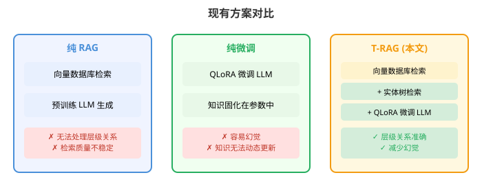
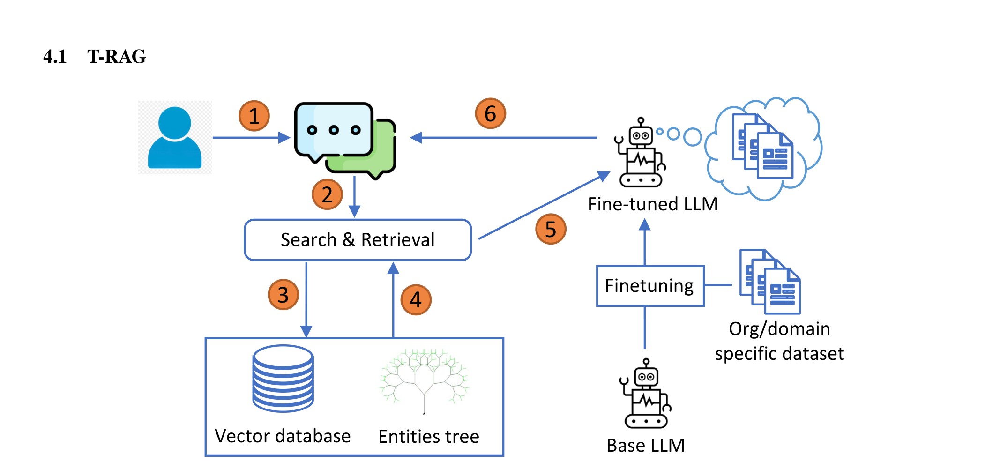
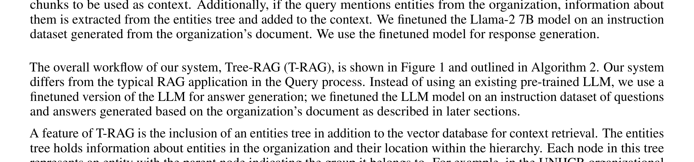
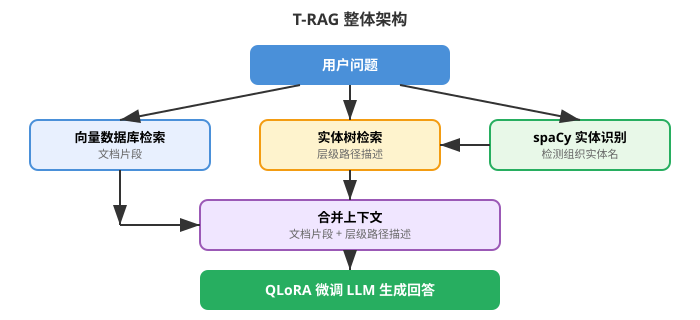
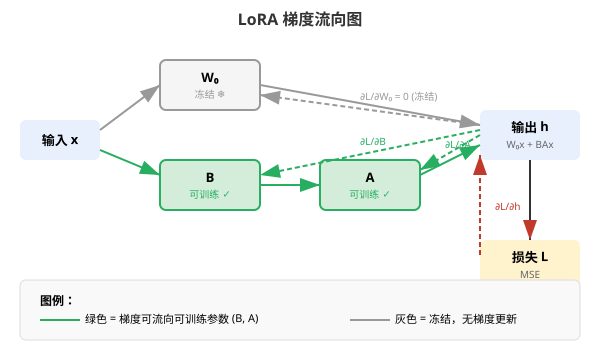
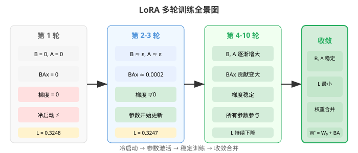
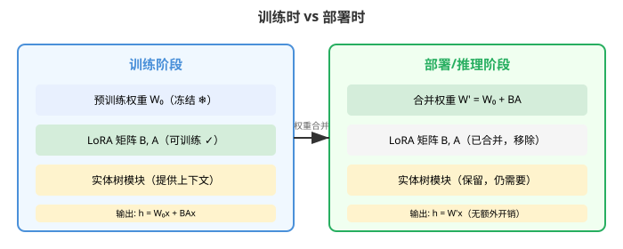
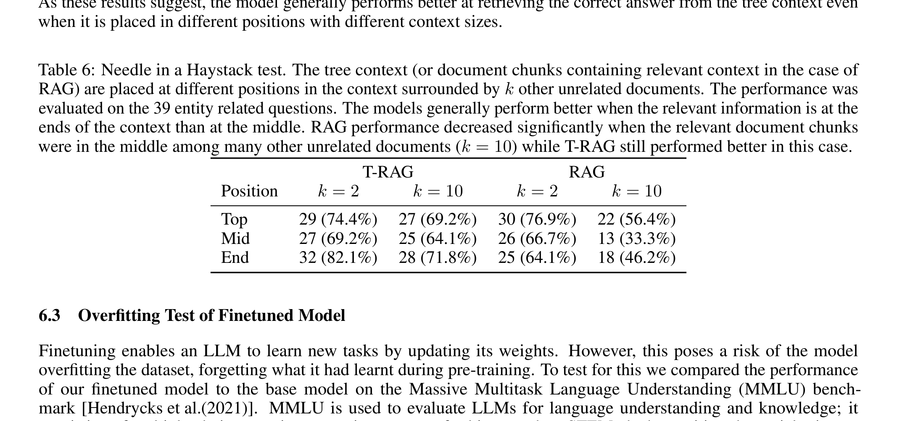
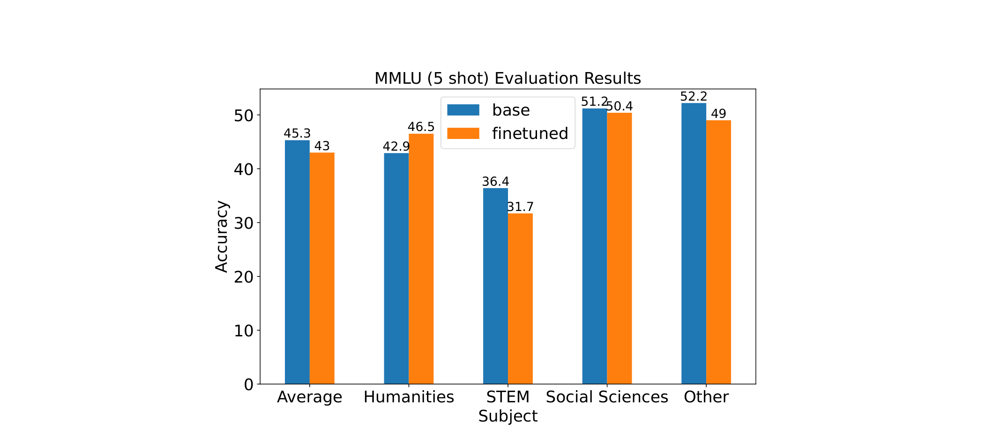

# T-RAG：来自大模型实战的经验教训

> **原文**: T-RAG: Lessons from the LLM Trenches
> **作者**: Masoomali Fatehkia, Ji Kim Lucas, Sanjay Chawla
> **发表机构**: Qatar Computing Research Institute, Hamad Bin Khalifa University
> **发表时间**: 2024年2月（v2: 2024年6月）
> **arXiv**: [2402.07483](https://arxiv.org/abs/2402.07483)

---

## 一句话总结

这篇论文分享了一个真实项目经验：如何把大语言模型（LLM）部署到企业内部做问答系统，并提出了 **T-RAG（Tree-RAG）**——在传统 RAG 的基础上增加一棵"组织架构图"，让模型回答涉及层级关系的问题时更准确。

## 研究背景：为什么要做这个？

想象一下，你是一家大型国际组织（比如联合国）的员工，经常需要查阅厚厚的治理手册来回答各种问题：
- "Giga 计划如何让 UNICEF 和 ITU 参与进来？"
- "人力资源管理下面有哪些部门？"
- "Giga 在 2023 年要面向哪三类受众？"

以前这些问题只能靠翻文档或者问老员工。现在有了大语言模型，能不能做一个智能问答系统来自动回答？

听起来很简单，但实际落地时面临三大难题：

1. **数据安全**：企业内部文档是机密的，不能发到 OpenAI 等外部 API（三星就发生过员工把代码发给 ChatGPT 导致泄露的事件）
2. **计算资源有限**：企业没有大规模 GPU 集群，只能用有限的硬件跑开源模型
3. **可靠性要求高**：回答必须准确，不能"幻觉"（hallucination）——即编造看似合理但实际错误的内容

### 现有方案的问题

目前主流的两种方案各有明显缺陷：

**方案一：纯 RAG（检索增强生成）**
- 做法：把文档切块存入向量数据库，用户提问时检索相关片段作为上下文给 LLM
- 优点：不需要训练模型，部署简单
- 缺点：检索质量高度依赖分块策略和相似度计算；**无法处理层级关系类问题**（比如"XX 部门下面有哪些子部门？"）

**方案二：纯微调（Finetuning）**
- 做法：用企业文档生成问答对，微调开源 LLM
- 优点：模型学到了领域知识和行文风格
- 缺点：模型知识"固化"在参数里，无法动态更新；**容易幻觉**——当问到训练数据中没有的细节时，会编造看似合理的答案



这篇论文的核心 insight 是：**既然两种方案各有优劣，为什么不把它们结合起来？再针对层级关系问题，额外引入一个树结构来补充上下文？**

## 核心思路：这篇论文的"大招"是什么？

论文提出了 **T-RAG（Tree-RAG）** 系统，它做了三件事的组合：

1. **RAG 检索**：传统向量数据库检索文档片段
2. **模型微调**：用 QLoRA 微调 Llama-2 7B 模型，让它更擅长回答领域问题
3. **实体树（Entity Tree）**：把组织架构编码成一棵树，当用户问题中提到某个实体时，从树中提取该实体的层级路径信息，作为额外上下文

这就像是给 LLM 配了三件装备：
- RAG 是"参考书"——随时查阅文档
- 微调是"专业培训"——让模型熟悉领域术语和风格
- 实体树是"组织架构图"——快速定位部门层级关系



**和传统 RAG 的本质区别**：传统 RAG 只从向量数据库检索文本片段，而 T-RAG 额外增加了一个实体树检索模块。当用户问题中提到组织中的实体（如某个部门名称）时，系统会从树中提取该实体在组织架构中的完整路径，转成文字描述后一起作为上下文输入给模型。

## 具体怎么做的？

### 模块一：指令数据集生成

微调模型需要训练数据。论文的做法是：

1. 用 LangChain 把 PDF 文档转成文本
2. 按章节标题分块
3. 用 Llama-2 模型对每个块生成多轮问答对（包括判断题、简答题、对话等多种形式）
4. 人工检查质量，去重
5. 最终得到 **1,614 个问答对**，按 90%/10% 分为训练集和验证集

关键发现：**多轮迭代生成效果更好**。第一轮让模型自由生成问答，第二轮给对话示例让模型模仿，第三轮加入人工编写的示例作为参考。

### 模块二：QLoRA 微调

全量微调 Llama-2 7B（70 亿参数）太贵了，论文使用了 **QLoRA** 技术：

**LoRA（Low-Rank Adaptation，低秩适配）** 的核心思想是：大模型的权重矩阵虽然很大，但真正有用的信息可以用低秩矩阵近似。

$$
h = W_0 x + BAx
$$

其中：
- $W_0 \in \mathbb{R}^{d \times n}$ 是预训练权重（**冻结不动**）
- $B \in \mathbb{R}^{d \times r}$, $A \in \mathbb{R}^{r \times n}$ 是低秩矩阵（**可训练**）
- $r \ll \min(n, d)$，论文中取 $r = 64$

这样需要更新的参数量从 $d \times n$ 降到了 $d \times r + r \times n$。对于 Llama-2 7B，可训练参数约 **3350 万**，比全量参数减少了约 **200 倍**。

**QLoRA** 在此基础上进一步做了 **4-bit 量化**，把 $W_0$ 的精度降到 4 位，大幅节省显存。论文在 4 块 24GB 的 Quadro RTX 6000 GPU 上完成微调。

### 模块三：实体树（Entity Tree）

这是论文最大的创新点。

组织架构天然是一个树形结构：顶层是最高领导，往下是各个部门，再往下是子部门。论文把这个结构编码成一棵树，每个节点代表一个实体，父节点代表它所属的上级部门。



**检索流程**：
1. 用 spaCy（一个 NLP 库）+ 自定义规则从用户问题中识别出组织实体名称
2. 如果识别到实体，从树中提取该实体的完整层级路径
3. 把层级路径转成文字描述，与向量数据库检索到的文档片段合并作为上下文
4. 如果没识别到实体，跳过树检索，只用文档片段

**举个例子**：用户问"Budapest 全球服务中心属于哪个上级部门？"
- spaCy 识别出 "Global Service Center in Budapest" 是组织实体
- 从树中查到路径：Global Service Center in Budapest → Deputy High Commissioner → High Commissioner Executive Office
- 转成文字："Global Service Center in Budapest 属于 Deputy High Commissioner 管辖，而 Deputy High Commissioner 又属于 High Commissioner Executive Office"
- 这段文字 + 检索到的文档片段 → 一起给 LLM 生成回答

### 方法在整体架构中的位置



### 用一个具体例子走通全流程

假设我们有一个极简的组织架构，只包含 3 个实体，用 T-RAG 来回答用户问题。

#### 场景设定

**组织架构树**（简化版）：
```
High Commissioner (HC)
├── Deputy High Commissioner (DHC)
│   ├── Global Service Center (GSC)
│   └── Innovation Service (IS)
└── Assistant High Commissioner (AHC)
    ├── Protection Division (PD)
    └── Operations Division (OD)
```

**用户问题**："Innovation Service 下面有哪些部门？"

**模型**：Llama-2 7B，使用 QLoRA 微调，秩 $r = 2$（为简化计算）

**LoRA 参数设定**：
- 某一层预训练权重 $W_0 \in \mathbb{R}^{4 \times 4}$（冻结）
- 低秩矩阵 $B \in \mathbb{R}^{4 \times 2}$, $A \in \mathbb{R}^{2 \times 4}$（可训练）

$$
W_0 = \begin{bmatrix}
0.5 & 0.1 & 0.2 & 0.3 \\
0.1 & 0.4 & 0.1 & 0.2 \\
0.2 & 0.1 & 0.5 & 0.1 \\
0.3 & 0.2 & 0.1 & 0.4
\end{bmatrix}, \quad
B = \begin{bmatrix}
0.0 & 0.0 \\
0.0 & 0.0 \\
0.0 & 0.0 \\
0.0 & 0.0
\end{bmatrix}, \quad
A = \begin{bmatrix}
0.0 & 0.0 & 0.0 & 0.0 \\
0.0 & 0.0 & 0.0 & 0.0
\end{bmatrix}
$$

> 注意：LoRA 的 $B$ 和 $A$ 初始化为零，这意味着第一轮前向传播时 LoRA 分支的输出为零，模型行为与原始预训练模型完全一致。这是 LoRA 的一个重要设计——**微调从零开始，不破坏原有知识**。

**输入**：问题 "Innovation Service 下面有哪些部门？" 经过 embedding 后的向量表示，简化为 $x \in \mathbb{R}^4$：

$$
x = \begin{bmatrix} 1.0 \\ 0.5 \\ 0.3 \\ 0.8 \end{bmatrix}
$$

#### Step 1: 前向传播

**第一轮前向传播**（$B$ 和 $A$ 全为零）：

$$
h = W_0 x + BAx = W_0 x + 0 = \begin{bmatrix}
0.5 & 0.1 & 0.2 & 0.3 \\
0.1 & 0.4 & 0.1 & 0.2 \\
0.2 & 0.1 & 0.5 & 0.1 \\
0.3 & 0.2 & 0.1 & 0.4
\end{bmatrix} \begin{bmatrix} 1.0 \\ 0.5 \\ 0.3 \\ 0.8 \end{bmatrix} = \begin{bmatrix} 0.99 \\ 0.51 \\ 0.58 \\ 0.77 \end{bmatrix}
$$

维度变化：$x \in \mathbb{R}^4 \xrightarrow{W_0} h \in \mathbb{R}^4$

由于 $B$ 和 $A$ 初始为零，$BAx = 0$，第一轮输出完全由 $W_0$ 决定。

**目标输出**（理想答案的 embedding）：

$$
y = \begin{bmatrix} 1.0 \\ 0.0 \\ 0.0 \\ 1.0 \end{bmatrix}
$$

#### Step 2: 损失计算

使用均方误差（MSE）损失：

$$
\mathcal{L} = \frac{1}{2} \|y - h\|^2 = \frac{1}{2} \sum_{i=1}^{4} (y_i - h_i)^2
$$

代入数值：

$$
\mathcal{L} = \frac{1}{2} \left[ (1.0 - 0.99)^2 + (0.0 - 0.51)^2 + (0.0 - 0.58)^2 + (1.0 - 0.77)^2 \right]
$$

$$
= \frac{1}{2} \left[ 0.0001 + 0.2601 + 0.3364 + 0.0529 \right] = \frac{1}{2} \times 0.6495 = 0.3248
$$

**直白翻译**：损失函数衡量的是"模型输出和正确答案之间的差距"。差距越大，损失越大。训练的目标就是让这个损失越来越小。

**本文方法 vs 传统方法的区别**：
- 传统全量微调：优化目标相同，但要更新 $W_0$ 的所有 16 个参数（这里简化为 4×4）
- LoRA 微调：$W_0$ 冻结不动，只优化 $B$ 和 $A$ 共 $4 \times 2 + 2 \times 4 = 16$ 个参数（实际大模型中这个比例更小，约 1/200）

#### Step 3: 反向传播

计算梯度。损失对输出 $h$ 的梯度：

$$
\frac{\partial \mathcal{L}}{\partial h} = h - y = \begin{bmatrix} 0.99 - 1.0 \\ 0.51 - 0.0 \\ 0.58 - 0.0 \\ 0.77 - 1.0 \end{bmatrix} = \begin{bmatrix} -0.01 \\ 0.51 \\ 0.58 \\ -0.23 \end{bmatrix}
$$

LoRA 分支的梯度（链式法则）：

$$
\frac{\partial \mathcal{L}}{\partial B} = \frac{\partial \mathcal{L}}{\partial h} \cdot (Ax)^\top, \quad \frac{\partial \mathcal{L}}{\partial A} = B^\top \cdot \frac{\partial \mathcal{L}}{\partial h} \cdot x^\top
$$

由于 $A$ 和 $B$ 初始为零，$Ax = 0$，所以：

$$
\frac{\partial \mathcal{L}}{\partial B} = \begin{bmatrix} -0.01 \\ 0.51 \\ 0.58 \\ -0.23 \end{bmatrix} \cdot \begin{bmatrix} 0 & 0 \end{bmatrix} = \begin{bmatrix} 0 & 0 \\ 0 & 0 \\ 0 & 0 \\ 0 & 0 \end{bmatrix}
$$

$$
\frac{\partial \mathcal{L}}{\partial A} = \begin{bmatrix} 0 & 0 \\ 0 & 0 \end{bmatrix} \cdot \begin{bmatrix} -0.01 \\ 0.51 \\ 0.58 \\ -0.23 \end{bmatrix} \cdot \begin{bmatrix} 1.0 & 0.5 & 0.3 & 0.8 \end{bmatrix} = \begin{bmatrix} 0 & 0 & 0 & 0 \\ 0 & 0 & 0 & 0 \end{bmatrix}
$$

**这就是 LoRA 的"冷启动"现象**：由于 $B$ 和 $A$ 初始为零，第一轮反向传播时两者的梯度都为零！这意味着第一轮参数更新后 $B$ 和 $A$ 仍然为零。

**但从第二轮开始就不一样了**。让我们假设第一轮更新后，由于数值精度或其他层的非零初始化，$B$ 和 $A$ 有了微小的非零值：

$$
B = \begin{bmatrix}
0.01 & -0.01 \\
-0.01 & 0.01 \\
0.01 & 0.01 \\
-0.01 & 0.01
\end{bmatrix}, \quad
A = \begin{bmatrix}
0.01 & 0.01 & -0.01 & 0.01 \\
-0.01 & 0.01 & 0.01 & -0.01
\end{bmatrix}
$$



#### Step 3.5: 参数更新与下一轮迭代

**参数更新**（以 SGD 为例，学习率 $\eta = 0.1$）：

$$
\theta_{\text{new}} = \theta - \eta \cdot \frac{\partial \mathcal{L}}{\partial \theta}
$$

学习率的作用是控制每次更新的"步子"有多大：太大容易 overshoot（跨过最优解），太小训练太慢。

先计算第二轮前向传播中的 $Ax$：

$$
Ax = \begin{bmatrix}
0.01 & 0.01 & -0.01 & 0.01 \\
-0.01 & 0.01 & 0.01 & -0.01
\end{bmatrix} \begin{bmatrix} 1.0 \\ 0.5 \\ 0.3 \\ 0.8 \end{bmatrix} = \begin{bmatrix} 0.01 \times 1.0 + 0.01 \times 0.5 + (-0.01) \times 0.3 + 0.01 \times 0.8 \\ (-0.01) \times 1.0 + 0.01 \times 0.5 + 0.01 \times 0.3 + (-0.01) \times 0.8 \end{bmatrix} = \begin{bmatrix} 0.012 \\ -0.010 \end{bmatrix}
$$

再计算 $BAx$：

$$
BAx = \begin{bmatrix}
0.01 & -0.01 \\
-0.01 & 0.01 \\
0.01 & 0.01 \\
-0.01 & 0.01
\end{bmatrix} \begin{bmatrix} 0.012 \\ -0.010 \end{bmatrix} = \begin{bmatrix}
0.01 \times 0.012 + (-0.01) \times (-0.010) \\
(-0.01) \times 0.012 + 0.01 \times (-0.010) \\
0.01 \times 0.012 + 0.01 \times (-0.010) \\
(-0.01) \times 0.012 + 0.01 \times (-0.010)
\end{bmatrix} = \begin{bmatrix} 0.00022 \\ -0.00022 \\ 0.00002 \\ -0.00022 \end{bmatrix}
$$

第二轮输出：

$$
h^{(2)} = W_0 x + BAx = \begin{bmatrix} 0.99 \\ 0.51 \\ 0.58 \\ 0.77 \end{bmatrix} + \begin{bmatrix} 0.00022 \\ -0.00022 \\ 0.00002 \\ -0.00022 \end{bmatrix} = \begin{bmatrix} 0.99022 \\ 0.50978 \\ 0.58002 \\ 0.76978 \end{bmatrix}
$$

第二轮损失：

$$
\mathcal{L}^{(2)} = \frac{1}{2} \left[ (1.0 - 0.99022)^2 + (0.0 - 0.50978)^2 + (0.0 - 0.58002)^2 + (1.0 - 0.76978)^2 \right] = 0.3247
$$

**验证训练在起作用**：

| 分量 | 第 1 轮输出 | 第 2 轮输出 | 目标值 | 趋势 |
|------|-----------|-----------|-------|------|
| $h_1$ | 0.99000 | 0.99022 | 1.0 | ✓ 更接近 |
| $h_2$ | 0.51000 | 0.50978 | 0.0 | ✓ 更接近 |
| $h_3$ | 0.58000 | 0.58002 | 0.0 | ✗ 略偏离（需更多轮） |
| $h_4$ | 0.77000 | 0.76978 | 1.0 | ✓ 更接近 |

损失从 0.3248 降到 0.3247，虽然降幅很小（因为 $B$ 和 $A$ 的初始值很小），但方向是正确的。随着训练进行，$B$ 和 $A$ 的值会越来越大，LoRA 分支的贡献也会越来越显著。

**冷启动说明**：LoRA 的零初始化导致第一轮梯度为零，但实际训练中：
1. 不同层的 $B$ 和 $A$ 会互相影响（通过深层网络的梯度传播）
2. 优化器（如 Adam）有动量机制，即使梯度很小也能积累更新
3. 通常几轮之后所有参数都会参与更新

**多轮训练全景图**：



#### Step 4: 部署/推理

T-RAG 在推理阶段的特殊之处：

1. **LoRA 权重合并**：训练完成后，可以把 $BA$ 加回到 $W_0$ 中：$W_{\text{new}} = W_0 + BA$。这样推理时不需要额外的计算开销，模型结构和原始模型完全一样。
2. **实体树模块保留**：与 LoRA 不同，实体树模块在推理时仍然需要运行——它负责从用户问题中识别实体并提取层级信息。



> **小白tips**: 你可以把 LoRA 想象成给一个已经学会做饭的厨师（预训练模型）加一本新菜谱（微调数据）。厨师原来的手艺（$W_0$）不变，只是额外记住了一些新菜的做法（$BA$）。最后新菜的做法可以融入到原来的手艺中（权重合并），厨师做菜时不需要额外翻菜谱。

## 效果怎么样？

### 各方法对比总览

论文在 UN 组织的治理文档上对比了四种方案：

| 方法 | 模型 | 精确匹配率 | 宽松匹配率 | Correct-Verbose 率 |
|------|------|-----------|-----------|-------------------|
| 纯 RAG | Llama-2 7B（预训练） | 较低 | 中等 | 中等 |
| 纯微调 | Llama-2 7B（QLoRA） | 中等 | 较高 | 较高 |
| RAG + 微调 | Llama-2 7B（QLoRA）+ RAG | 较高 | 高 | 高 |
| **T-RAG** | **Llama-2 7B（QLoRA）+ RAG + 实体树** | **最高** | **最高** | **最高** |

论文提出了一个新的评估指标 **Correct-Verbose（正确但冗长）**：回答是正确的，但包含了问题没有问到的额外正确信息。这个指标在实际应用中很重要——有时候用户希望得到更全面的回答。



### Needle in a Haystack 测试

这个测试用来评估系统在大量无关信息中找到关键信息的能力。具体做法是：在大量文本中藏一个"针"（关键信息），看系统能否找到并正确回答。



**结果**：T-RAG 在 Needle in a Haystack 测试中表现优于纯 RAG，说明实体树提供的结构化上下文确实帮助模型更好地定位关键信息。

### 过拟合测试

论文还测试了微调后的模型是否过拟合：用训练数据中没有的问题进行测试，发现模型仍然能给出合理回答，说明 QLoRA 微调没有导致严重的过拟合。

## 论文的意义和局限

**主要贡献**：

1. **T-RAG 框架**：首次将实体树结构引入 RAG 系统，专门解决层级关系类问题的检索增强
2. **实战经验总结**：不是纯理论研究，而是基于真实企业部署的经验分享，包含大量实用教训
3. **Correct-Verbose 评估指标**：提出了一个更贴近实际应用的评估标准
4. **RAG + 微调的组合策略**：证明了两者结合优于单独使用

**局限性**：

1. **实体树依赖预定义结构**：需要事先有清晰的组织架构图，对于没有明确层级关系的文档不适用
2. **实体识别依赖规则**：使用 spaCy + 自定义规则匹配实体名称，对于名称变体或模糊匹配可能不够鲁棒
3. **规模有限**：实验基于单一组织的治理文档，结论能否推广到更大规模、更多样化的场景需要进一步验证
4. **未对比 GraphRAG**：论文提到知识图谱方法但没有与最新的 GraphRAG 做直接对比

## 读后感

这篇论文最大的价值不在于技术上的突破，而在于**实战经验的沉淀**。它告诉我们：

1. **RAG 和微调不是二选一**：两者互补，结合使用效果更好
2. **结构化知识很重要**：向量检索擅长找相似文本，但对层级关系无能为力；引入树结构是一个简单有效的补充
3. **真实部署比论文复杂得多**：数据安全、计算资源、评估指标……这些在学术研究中经常被忽略的因素，在实际落地时却是决定成败的关键

对于初学者来说，读完这篇论文最应该记住的是：**好的 AI 应用不是选一个最牛的模型就完事了，而是需要把多种技术（RAG、微调、结构化知识）有机组合，针对具体场景做定制化设计。**
