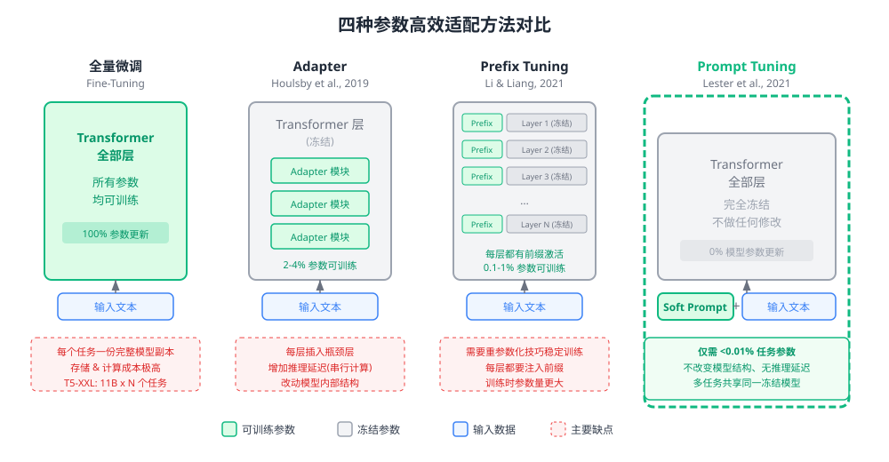
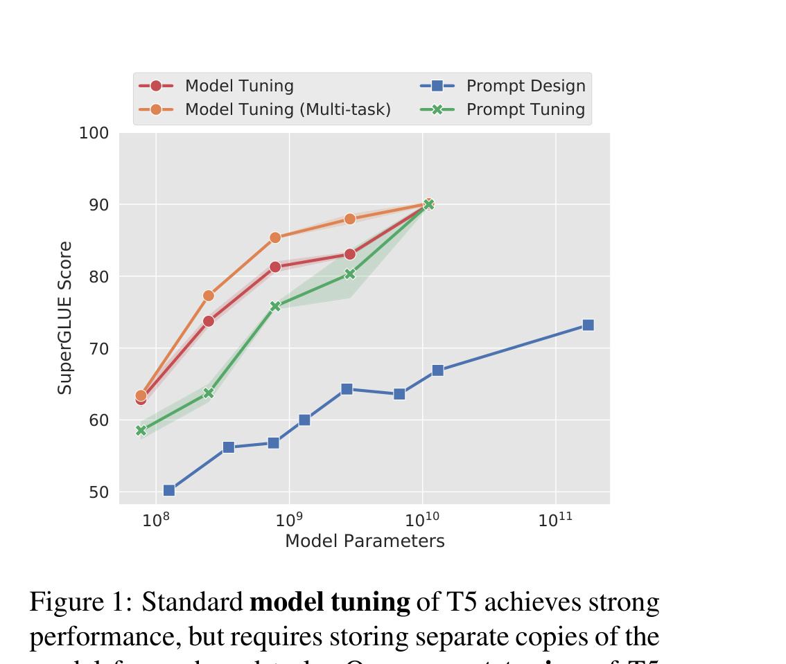
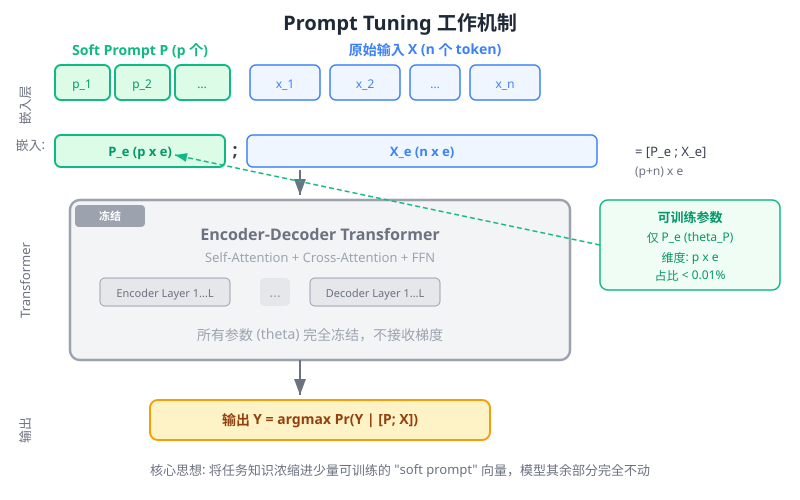
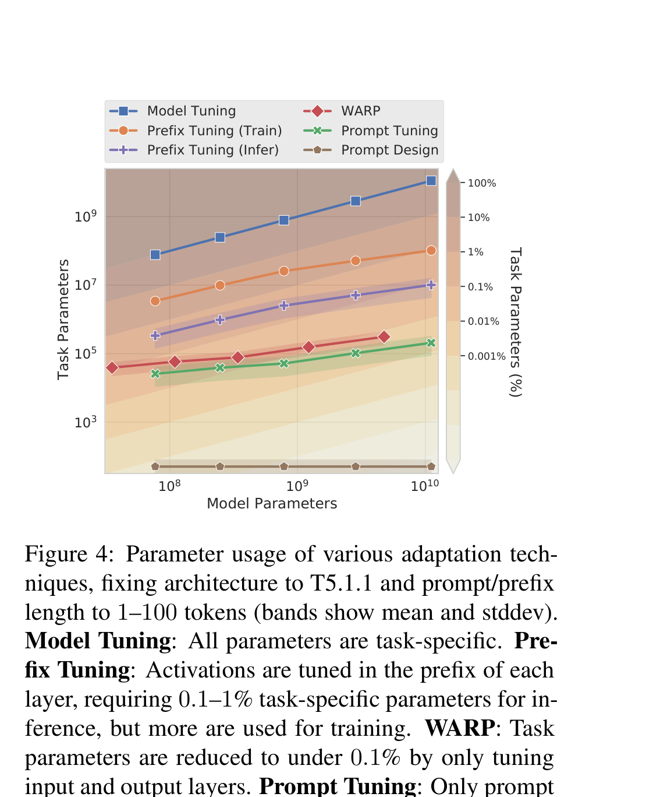
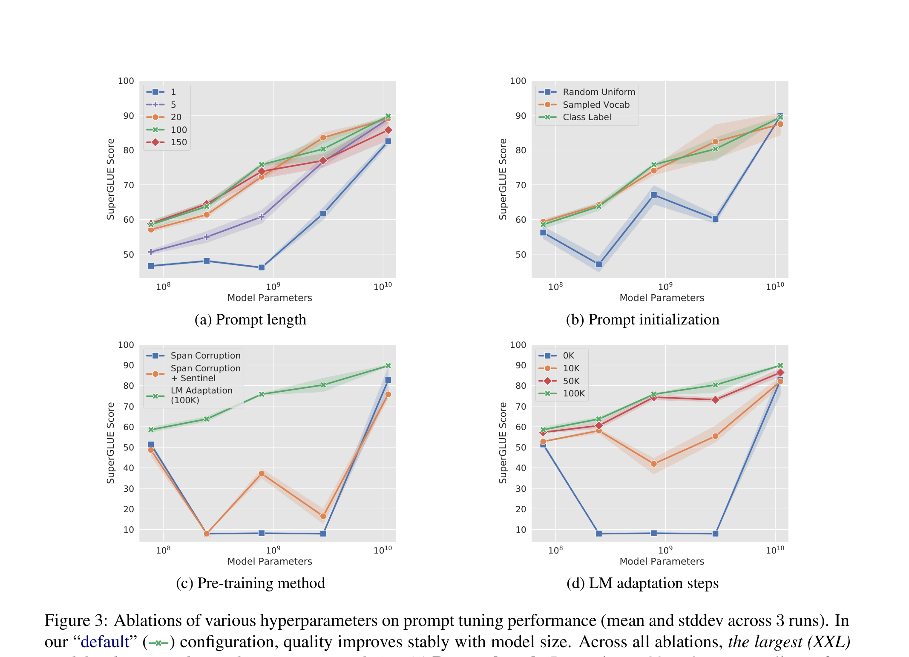
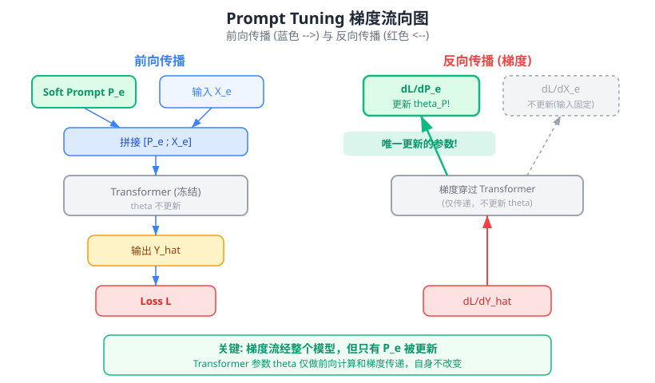
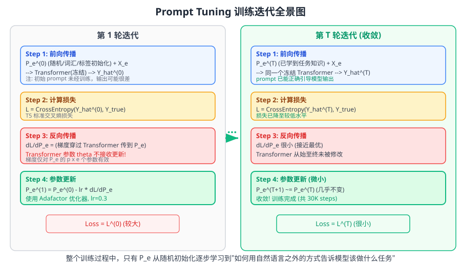
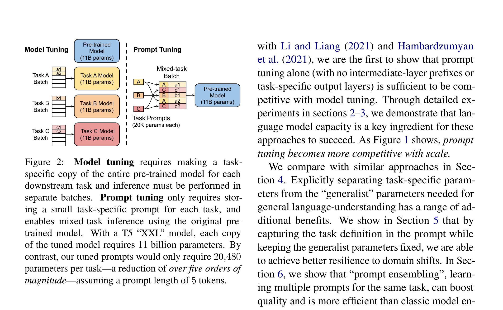
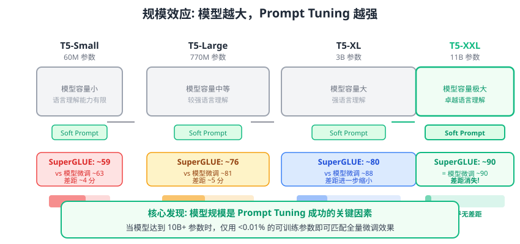

# 规模的力量：参数高效的 Prompt Tuning

> **原文**: The Power of Scale for Parameter-Efficient Prompt Tuning
> **作者**: Brian Lester, Rami Al-Rfou, Noah Constant (Google Research)
> **发表时间**: 2021-04-18
> **arXiv**: https://arxiv.org/abs/2104.08691

---

## 一句话总结

GPT-3 的文本提示太脆弱，全量微调太昂贵。Prompt Tuning 的做法是：冻结整个预训练模型，只在输入前面拼接一小段可学习的"软提示"向量——当模型规模足够大（110 亿参数的 T5-XXL）时，仅靠这不到 **0.01%** 的额外参数就能追平全量微调的效果。

## 研究背景：为什么要做这个？

想象你有一个无所不知的百科全书式助手（预训练大模型）。现在你想让它专门做情感分析、文本蕴含、阅读理解等不同任务。传统做法有两种：

**做法一：全量微调（Model Tuning）**——把助手的整个大脑（所有参数）都针对某个任务重新训练。效果好，但问题是：每个任务都需要一份完整的大脑副本。T5-XXL 有 110 亿参数，10 个任务就是 1100 亿参数的存储，服务部署时需要为每个任务分别加载不同的模型。

**做法二：文本提示（Prompt Design）**——给助手一段自然语言指令，比如"请判断以下两句话是否矛盾"。这就是 GPT-3 的做法。优点是模型完全不需要修改；缺点是效果严重依赖提示的措辞，且 GPT-3 175B 在 SuperGLUE 上的 few-shot 成绩比微调后的 T5-XXL 低了 **17.5 分**（71.8 vs 89.3）。

那有没有一种方法，既能像全量微调那样从标注数据中充分学习，又能像文本提示那样保持模型冻结、多任务共享呢？

### 现有方案的问题

在 Prompt Tuning 之前，已经有几种"轻量化适配"的尝试：

- **Adapter**（Houlsby et al., 2019）：在 Transformer 每层之间插入小型瓶颈层。虽然只增加 2-4% 参数，但改变了模型内部结构，每层新增的串行计算会带来推理延迟。
- **Prefix Tuning**（Li & Liang, 2021）：在 Transformer 每一层的注意力前都注入可学习的"前缀激活"。效果不错，但需要在每一层都加前缀（参数更多），还需要重参数化（reparameterization）技巧来稳定训练。
- **WARP**（Hambardzumyan et al., 2021）：只在输入层和输出层加可训练参数，但依赖 [MASK] token 和任务特定的输出头，只适用于分类任务。

这些方法要么改动了模型内部结构，要么需要复杂的工程技巧，要么局限于特定任务类型。

## 核心思路：这篇论文的"大招"是什么？

Prompt Tuning 的核心想法极其简洁：**在输入文本的嵌入序列前面拼接一段可学习的连续向量（soft prompt），然后冻结模型的全部参数，只训练这几个向量。**

你可以把它想象成这样：模型是一个经验丰富但固执己见的老师（不能改变他的知识体系），而 soft prompt 就像你在试卷前面附上的一段"答题须知"——通过精心设计这段须知，你可以引导老师按你想要的方式批改试卷。只不过，这里的"答题须知"不是人写的自然语言，而是通过反向传播自动学出来的连续向量。

这篇论文最关键的发现是：**模型规模是这种方法成功的关键**。在小模型上，prompt tuning 和全量微调有明显差距；但当模型规模达到 110 亿参数时，差距几乎消失。

这张图是全文最核心的结果：横轴是模型参数量（对数尺度），纵轴是 SuperGLUE 得分。可以清楚地看到，绿色的 Prompt Tuning 曲线在 $10^{10}$（110 亿参数）处与红色/橙色的 Model Tuning 曲线汇合。

## 具体怎么做的？

### 数学表达

T5 采用 text-to-text 框架，所有任务都建模为条件文本生成。给定输入 token 序列 $X = \{x_1, x_2, \ldots, x_n\}$，模型要生成目标序列 $Y$：

$$\Pr_\theta(Y \mid X)$$

**传统提示**（GPT-3 风格）在输入前拼接一段文本 token $P = \{p_1, p_2, \ldots, p_k\}$，这些 token 的表示来自模型的冻结嵌入表：

$$\Pr_\theta(Y \mid [P; X])$$

**Prompt Tuning** 的改进是：让 $P$ 拥有自己独立的参数 $\theta_P$，不再受限于词表中已有的 token 嵌入。具体来说：

1. 输入 $X$ 经过嵌入层得到 $X_e \in \mathbb{R}^{n \times e}$（$e$ 是嵌入维度）
2. Soft prompt 是一个独立参数矩阵 $P_e \in \mathbb{R}^{p \times e}$（$p$ 是 prompt 长度）
3. 两者拼接后送入 Transformer：$[P_e; X_e] \in \mathbb{R}^{(p+n) \times e}$

新的条件概率为：

$$\Pr_{\theta; \theta_P}(Y \mid [P; X])$$

训练时通过最大化 $Y$ 的似然来更新 $\theta_P$，而**模型参数 $\theta$ 始终冻结**。

### 与 Prefix Tuning 的关键区别

Prompt Tuning 和 Prefix Tuning 的核心差异在于 **"在哪里注入可训练参数"**：

| 特性 | Prefix Tuning | Prompt Tuning |
|------|---------------|---------------|
| 注入位置 | Transformer **每一层**的注意力前 | 仅在**输入嵌入层** |
| 对中间层的影响 | 直接重写每层的激活值 | 通过输入间接影响（模型自己决定如何处理） |
| 训练技巧 | 需要重参数化（MLP）稳定训练 | 无需额外技巧 |
| 参数量（T5-XXL, 100 tokens） | 0.1-1% | **< 0.01%** |

论文 Figure 4 直观展示了各方法的参数效率：

### 三个重要的设计选择

#### 1. Prompt 初始化策略

论文测试了三种初始化方式：

- **随机初始化（Random Uniform）**：从 $[-0.5, 0.5]$ 均匀采样
- **词汇采样（Sampled Vocab）**：从 T5 词表中最常见的 5000 个 token 采样嵌入
- **类别标签（Class Label）**：用下游任务的类别标签词（如 "entailment"、"contradiction"）的嵌入来初始化

在小模型上，类别标签初始化明显更好；但在 XXL 规模下，三种方式效果趋同。

#### 2. Prompt 长度

测试了 $p \in \{1, 5, 20, 100, 150\}$。关键发现：

- 对多数模型，从 1 增加到 20 带来显著提升
- 超过 20 后收益递减
- **XXL 模型仅用 1 个 token 就能获得不错效果**——模型越大，需要的"引导信号"越少

#### 3. 预训练目标的适配（LM Adaptation）

T5 的预训练目标是 Span Corruption（填充被遮蔽的文本片段），这个目标训练出的模型习惯于输入/输出中包含特殊的 sentinel token，不太适合直接被 prompt 控制。论文提出了一个巧妙的解决方案：**LM Adaptation**——在 T5 预训练完成后，再用标准的语言模型目标（给定前文预测后文）继续训练 100K 步。这个额外步骤只需做一次，就能显著提升 prompt tuning 的效果。

### 用一个具体例子走通全流程

#### 场景设定

以一个简化的情感分类任务为例。使用 T5 模型，嵌入维度 $e = 4$（实际 T5-XXL 是 $e = 4096$），prompt 长度 $p = 2$：

- **Soft Prompt** $P_e \in \mathbb{R}^{2 \times 4}$：可训练（用类别标签"positive"、"negative"的嵌入初始化）
- **T5 模型参数** $\theta$：全部冻结
- 输入句子："I love it" $\to$ 经过嵌入变成 $X_e \in \mathbb{R}^{3 \times 4}$

初始化（简化数值）：

$$P_e^{(0)} = \begin{bmatrix} 0.3 & -0.1 & 0.5 & 0.2 \\ -0.2 & 0.4 & 0.1 & -0.3 \end{bmatrix}, \quad X_e = \begin{bmatrix} 0.1 & 0.6 & -0.2 & 0.4 \\ 0.5 & 0.3 & 0.7 & -0.1 \\ 0.2 & -0.4 & 0.3 & 0.8 \end{bmatrix}$$

标记哪些参数可训练：$P_e^{(0)}$ 的 $2 \times 4 = 8$ 个参数可训练，$X_e$ 固定，T5 模型的数十亿参数全部冻结。

#### Step 1: 前向传播

**拼接**：将 soft prompt 拼在输入嵌入前面：

$$[P_e; X_e] = \begin{bmatrix} 0.3 & -0.1 & 0.5 & 0.2 \\ -0.2 & 0.4 & 0.1 & -0.3 \\ \hline 0.1 & 0.6 & -0.2 & 0.4 \\ 0.5 & 0.3 & 0.7 & -0.1 \\ 0.2 & -0.4 & 0.3 & 0.8 \end{bmatrix} \in \mathbb{R}^{5 \times 4}$$

上面两行（绿色部分）是 soft prompt，下面三行是原始输入。这个 $5 \times 4$ 的矩阵被送入冻结的 Transformer。

**Transformer 处理**：Self-Attention 机制让输入 token 可以"看到"前面的 prompt token。Prompt token 就像给每个输入 token 提供了额外的"上下文信息"，引导模型理解"我现在要做情感分类"。

**输出**：Decoder 生成目标文本，比如 "positive"。假设模型输出的概率分布为：

$$\hat{Y} = \text{Softmax}(\ldots) = [P(\text{"positive"}) = 0.6, \; P(\text{"negative"}) = 0.4]$$

#### Step 2: 损失计算

目标标签是 "positive"（对应 one-hot $[1, 0]$），使用交叉熵损失：

$$\mathcal{L} = -\log P(\text{"positive"}) = -\log(0.6) = 0.511$$

对比不同方法的优化目标：

| | 全量微调 | Prompt Tuning |
|---|---|---|
| 优化目标 | $\max_\theta \sum \log \Pr_\theta(Y \mid X)$ | $\max_{\theta_P} \sum \log \Pr_{\theta;\theta_P}(Y \mid [P; X])$ |
| 可训练参数 | 全部 $\theta$（11B） | 仅 $\theta_P$（20,480 = 0.00018%）|
| 一次训练涉及 | 110 亿参数的优化器状态 | 仅 20K 参数的优化器状态 |

> 这里的 20,480 = 5（prompt 长度为 5 token 时）$\times$ 4096（T5-XXL 嵌入维度），即论文 Figure 2 中标注的数值。默认配置使用 prompt 长度 100，则参数量为 409,600（约 0.004%）。

#### Step 3: 反向传播

关键点：梯度从损失 $\mathcal{L}$ 出发，经过 Decoder、Encoder 一路反传，最终到达输入嵌入层。在输入嵌入层，梯度分流到 $P_e$ 和 $X_e$：

$$\frac{\partial \mathcal{L}}{\partial P_e} = \text{Transformer 传回的梯度}$$

- 对 $P_e$：有梯度，**执行更新**
- 对 $X_e$：有梯度但不更新（输入嵌入是固定的）
- 对 $\theta$（Transformer 参数）：**完全不更新**，仅做梯度传递

在我们的简化例子中，假设梯度传到 $P_e$ 为：

$$\frac{\partial \mathcal{L}}{\partial P_e} = \begin{bmatrix} 0.05 & -0.03 & 0.08 & -0.02 \\ -0.04 & 0.06 & -0.01 & 0.07 \end{bmatrix}$$

#### Step 3.5: 参数更新与下一轮迭代

**参数更新**（论文使用 Adafactor 优化器，这里用 SGD 简化，学习率 $\eta = 0.3$）：

$$P_e^{(1)} = P_e^{(0)} - \eta \cdot \frac{\partial \mathcal{L}}{\partial P_e}$$

$$= \begin{bmatrix} 0.3 & -0.1 & 0.5 & 0.2 \\ -0.2 & 0.4 & 0.1 & -0.3 \end{bmatrix} - 0.3 \times \begin{bmatrix} 0.05 & -0.03 & 0.08 & -0.02 \\ -0.04 & 0.06 & -0.01 & 0.07 \end{bmatrix}$$

$$= \begin{bmatrix} 0.285 & -0.091 & 0.476 & 0.206 \\ -0.188 & 0.382 & 0.103 & -0.321 \end{bmatrix}$$

> 更新规则：新参数 = 旧参数 - 学习率 $\times$ 梯度。梯度指向损失增大的方向，减去它就是在让损失变小。论文使用的学习率 0.3 相比全量微调的 0.001 大得多——因为只有很少的参数需要更新，每个参数需要"步子迈大一点"。

**第二轮前向传播**（同一个输入，新的 prompt）：

$$[P_e^{(1)}; X_e] = \begin{bmatrix} 0.285 & -0.091 & 0.476 & 0.206 \\ -0.188 & 0.382 & 0.103 & -0.321 \\ \hline 0.1 & 0.6 & -0.2 & 0.4 \\ 0.5 & 0.3 & 0.7 & -0.1 \\ 0.2 & -0.4 & 0.3 & 0.8 \end{bmatrix}$$

注意：只有上面两行变了（prompt 更新了），下面三行和 Transformer 参数完全不变。

假设新的输出概率变为：$P(\text{"positive"}) = 0.65$，则：

$$\mathcal{L}^{(1)} = -\log(0.65) = 0.431$$

**验证训练在起作用**：

| 轮次 | $P(\text{"positive"})$ | 损失 $\mathcal{L}$ | 趋势 |
|------|----------------------|-------------------|------|
| 第 1 轮 | 0.60 | 0.511 | - |
| 第 2 轮 | 0.65 | 0.431 | 下降 15.7% |

损失在下降，模型对正确答案的信心在增加——训练有效！经过 30,000 步迭代后，$P_e$ 将收敛到一组最优值，使模型在该任务上表现最佳。

#### Step 4: 部署/推理

Prompt Tuning 在部署时的优雅之处在于：

1. **一个冻结模型服务所有任务**：不同任务只需切换前面拼接的 soft prompt
2. **混合批次推理**：同一个 batch 中可以包含不同任务的输入，只要给每个输入拼上对应的 prompt 即可（参见论文 Figure 2）
3. **存储极其高效**：每个任务的 prompt 仅需 ~20KB（100 tokens $\times$ 4096 维 $\times$ 4 bytes $\div$ 1024），相比整个模型的 42GB

> **小白tips**: Prompt Tuning 就像是给同一个老师发不同的"任务便签"。老师的知识（模型参数）不变，但看到不同便签后会用不同的方式处理学生的作业。便签很小（几十 KB），老师很大（几十 GB），所以切换任务几乎是"零成本"。

## 效果怎么样？

### 规模效应：核心发现

论文最重要的实验发现可以用一张图总结：

具体的 SuperGLUE 得分（默认配置：100 token prompt, class label 初始化, LM Adaptation 100K）：

| 模型规模 | 参数量 | Prompt Tuning | Model Tuning | 差距 |
|---------|-------|---------------|--------------|------|
| T5-Small | 60M | ~59 | ~63 | ~4 分 |
| T5-Base | 220M | ~64 | ~74 |  ~10 分 |
| T5-Large | 770M | ~76 | ~81 | ~5 分 |
| T5-XL | 3B | ~80 | ~88 | ~8 分 |
| **T5-XXL** | **11B** | **~89** | **~90** | **<1 分** |

在 T5-XXL 规模下，Prompt Tuning 甚至追平了**多任务联合微调**的更强基线（Multi-task Model Tuning）。

### 消融实验亮点

**Prompt 长度**：20 个 token 就够了，再多收益递减。更惊人的是，XXL 模型用**单个 token** 的 prompt 就能获得不错效果——说明大模型只需极微量的"引导信号"。

**初始化策略**：Class Label 初始化最好，但在 XXL 规模下差异消失。这再次印证了论文的核心发现：**规模可以弥补几乎所有设计选择的不足**。

**LM Adaptation**：将 T5 的 Span Corruption 目标转换为标准 LM 目标是关键的。没有这一步，中等规模的模型（Base, Large, XL）在 Span Corruption 设置下表现不稳定，经常无法输出合法的类别标签。

### 参数效率对比

| 方法 | 任务参数占比（T5-XXL） | SuperGLUE 效果 |
|------|----------------------|---------------|
| Model Tuning | 100% | ~90 |
| Prefix Tuning | 0.1-1% | 接近 Model Tuning |
| WARP | <0.1% | 明显弱于 Model Tuning |
| **Prompt Tuning** | **<0.01%** | **追平 Model Tuning** |
| Prompt Design (GPT-3) | ~0%（仅 token ID） | ~73（远低于） |

Prompt Tuning 用最少的任务参数达到了最好的效果，这在 Figure 4 中清晰可见。

### 域迁移鲁棒性

论文的一个重要附加发现是：**Prompt Tuning 在域迁移（domain shift）场景下比全量微调更鲁棒**。

在 SQuAD（维基百科 QA）上训练后，零样本评估其他领域的 QA 数据集：

| 数据集 | 领域 | Model Tuning (F1) | Prompt Tuning (F1) | 差值 |
|--------|------|-------------------|--------------------|----- |
| SQuAD | Wiki | 94.9 | 94.8 | -0.1 |
| **TextbookQA** | **教科书** | **54.3** | **66.8** | **+12.5** |
| BioASQ | 生物医学 | 77.9 | 79.1 | +1.2 |
| RACE | 考试 | 59.8 | 60.7 | +0.9 |
| RE | Wiki | 88.4 | 88.8 | +0.4 |

在域偏移最大的 TextbookQA 上，Prompt Tuning 超出全量微调 **12.5 个 F1 点**。直觉解释是：全量微调会让模型"过度记住"训练数据的特征，而 Prompt Tuning 由于冻结了通用语言理解参数，只学习任务定义，从而保留了更好的泛化能力。

### Prompt 集成（Ensembling）

传统的模型集成需要存储和运行 $N$ 个完整模型。Prompt Tuning 让集成变得极其廉价：只需训练 $N$ 个不同的 prompt，共享同一个冻结模型。推理时甚至可以在一个 batch 中完成所有 $N$ 个 prompt 的前向传播。

在 T5-XXL 上训练 5 个 prompt 的集成效果：

| | 单 prompt 平均 | 最佳 prompt | 5-prompt 集成 |
|---|---|---|---|
| SuperGLUE (dev) | 90.5 | 91.0 | **91.3** |

集成稳定超越单 prompt，且成本仅增加了 5 份 prompt 参数（每份约 400KB），模型本身完全不需要复制。

## 论文的意义和局限

**主要贡献**：

1. **极简方法，惊人效果**：证明了仅在输入嵌入层添加可学习向量（不改模型、不加中间层前缀）就能在超大模型上追平全量微调——这是参数高效微调领域最简洁的方案。
2. **规模律（Scaling Law）的新维度**：首次系统展示了模型规模对 prompt-based 方法效果的决定性影响，为"大模型 + 轻量适配"的研究范式奠定了实验基础。
3. **实用价值**：冻结模型 + 多 prompt 的部署模式，在存储、服务、多任务、集成等方面都有巨大优势。在域迁移上的鲁棒性更是意外收获。

**局限性**：

- **强依赖大模型**：在小模型（< 1B 参数）上效果显著弱于全量微调，限制了在资源受限场景下的应用。
- **需要 LM Adaptation**：T5 的 Span Corruption 预训练目标不太适合 prompt tuning，需要额外的适配训练步骤（100K 步的 LM 目标），增加了前期成本。
- **可解释性有限**：学到的 soft prompt 在连续嵌入空间中，虽然最近邻分析显示了一些语义聚类，但整体缺乏人类可读的解释。
- **仅在 T5 上验证**：所有实验基于 T5 模型族，是否能推广到其他架构（如纯 decoder 的 GPT 系列）需要进一步验证。

## 读后感

Prompt Tuning 的价值在于它用"少即是多"的哲学回答了一个核心问题：**适配一个大模型，真正需要多少参数？** 答案是：当模型足够大时，几乎不需要——不到万分之一的参数就够了。

这篇论文在 Prompt Tuning 方法族中占据了"极简端"的位置：比 Prefix Tuning 更简单（不改中间层），比 Adapter 更轻量（不加瓶颈层），比 P-tuning 更纯粹（不修改模型参数）。它后来直接催生了 Soft Prompt Tuning 在大语言模型时代的广泛应用，也与 LoRA 一起构成了参数高效微调（PEFT）领域最重要的两个方向——LoRA 从"权重增量"角度解决问题，Prompt Tuning 从"输入引导"角度解决问题。

如果你刚入门，读完这篇论文最应该记住的是：**大模型时代，你不需要微调整个模型；一个精心学习的"提示"，就能让冻结的巨人为你工作。**
