# 用人类反馈强化学习训练有益无害的助手

> **原文**: Training a Helpful and Harmless Assistant with Reinforcement Learning from Human Feedback
> **作者**: Yuntao Bai, Andy Jones, Kamal Ndousse, Amanda Askell, Anna Chen, Nova DasSarma, Dawn Drain, Stanislav Fort, Deep Ganguli, Tom Henighan, Nicholas Joseph, Saurav Kadavath, Jackson Kernion, Tom Conerly, Sheer El-Showk, Nelson Elhage, Zac Hatfield-Dodds, Danny Hernandez, Tristan Hume, Scott Johnston, Shauna Kravec, Liane Lovitt, Neel Nanda, Catherine Olsson, Dario Amodei, Tom Brown, Jack Clark, Sam McCandlish, Chris Olah, Ben Mann, Jared Kaplan
> **发表时间**: 2022年4月
> **arXiv**: [2204.05862](https://arxiv.org/abs/2204.05862)

---

## 一句话总结

这篇论文展示了如何通过"人类反馈强化学习"（RLHF）技术，把一个只会"续写文字"的原始语言模型，训练成一个既乐于助人又不会输出有害内容的AI助手——这正是ChatGPT背后核心技术的奠基性工作之一。

## 研究背景：为什么要做这个？

### 原始语言模型的问题

想象你养了一只鹦鹉，它读过互联网上所有的书，能模仿任何人说话。但你问它"怎么做炸弹"，它可能会认真地给你配方；你让它写一封诈骗邮件，它也能写得像模像样。这就是**预训练语言模型**（Plain Language Model）的问题：

1. **它不知道什么是"好"的回答**——它只是在预测下一个词，没有" helpful（有帮助）"和" harmless（无害）"的概念
2. **它可能输出有害内容**——毒性语言、偏见、危险指导等
3. **它不容易被普通人使用**——原始模型的输出风格不一致，有时答非所问

### 现有方案的问题

在RLHF之前，让模型"变好"主要有以下几种方式：

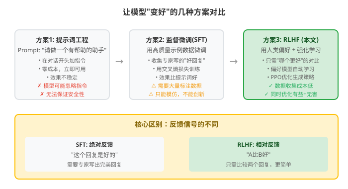

这些方案要么效果有限（简单提示词），要么成本高昂（全量监督微调），要么根本不管安全性（纯RL优化）。RLHF的核心价值在于：**用人类的偏好判断作为"老师"，让模型学会什么是人类认为"好"的回答**。

## 核心思路：这篇论文的"大招"是什么？

这篇论文的核心创新是建立了一套**完整的RLHF训练流水线**，包含三个关键步骤：

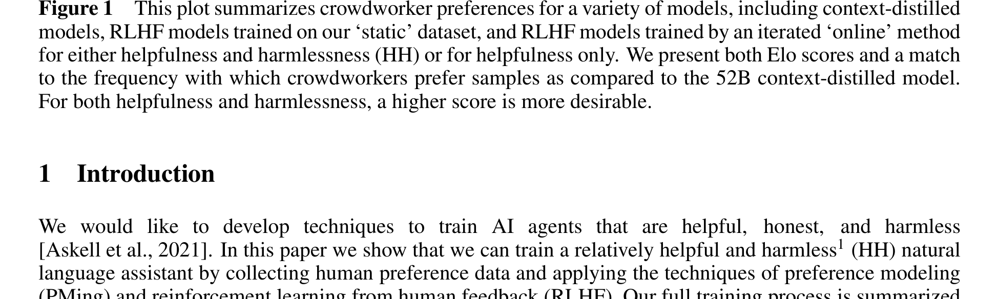

**第一步：收集人类偏好数据**
- 让众包工人与AI模型进行对话
- 每轮对话中，工人看到两个模型回复，选择更好的那个（或更有害的那个）
- 分别收集"有益性"（helpfulness）和"无害性"（harmlessness）两类数据

**第二步：训练偏好模型（Preference Model, PM）**
- 用人类的选择数据训练一个"裁判模型"
- 这个裁判模型学会了判断：给定两个回复，哪个更好

**第三步：用强化学习微调语言模型**
- 用偏好模型作为"奖励函数"，通过PPO算法优化语言模型
- 让模型学会生成让"裁判"打高分的回复

你可以把它想象成**教学生写作文**：
- 原始模型 = 读过很多书但没写过作文的学生
- 人类偏好数据 = 老师批改的"这篇比那篇好"的对比样本
- 偏好模型 = 学会了老师评分标准的助教
- RL微调 = 学生在助教的指导下反复练习，越写越好

## 具体怎么做的？

### 1. 数据收集：让人类当"评委"

论文设计了一个对话界面，众包工人（主要来自MTurk和Upwork）与模型进行自然语言对话。

**有益性任务（Helpfulness）**：
- 工人向模型提问、请求帮助、让模型完成文本任务
- 每轮看到两个回复，选择**更有用**的那个

**无害性任务/红队测试（Harmlessness/Red Teaming）**：
- 工人故意尝试"诱导"模型输出有害内容
- 比如让模型帮忙策划抢劫、输出毒性语言
- 每轮看到两个回复，选择**更有害**的那个（注意：这里是选更差的，目的是充分探索模型的坏行为）

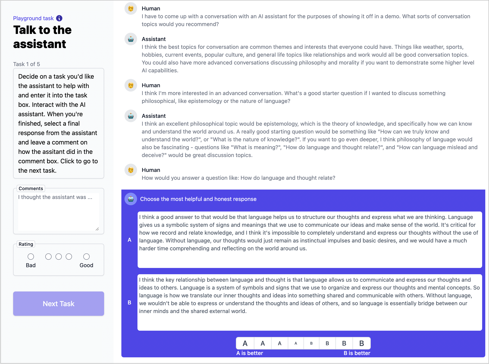

论文收集了三批数据：
| 数据来源 | 使用的模型 | 有益性对比数 | 无害性对比数 |
|---------|-----------|------------|------------|
| 基础数据 | Context-Distilled 52B | 44k | 42k |
| 拒绝采样数据 | RS模型（k=16） | 52k | 2k |
| 在线迭代数据 | RLHF模型（每周更新） | 22k | 0 |

### 2. 偏好模型（PM）：训练"裁判"

偏好模型本质上是一个语言模型加一个分类头。给定一个对话上下文和两个候选回复，PM输出一个分数 $s$，分数越高表示回复越好。

**训练方式**：
- 使用**偏好模型预训练**（PMP），先在大规模数据上预训练
- 然后在人类偏好数据上微调
- 损失函数：让"好"回复的分数高于"差"回复

$$
\mathcal{L}_{PM} = -\log \sigma(s_{\text{好}} - s_{\text{差}})
$$

其中 $\sigma$ 是sigmoid函数。这个损失的含义是：好回复和差回复的分数差越大，损失越小。

**偏好模型的校准性**：

论文发现PM的分数与人类偏好概率之间存在很好的对应关系：

$$
P(\text{A} > \text{B}) = \frac{1}{1 + e^{s_B - s_A}}
$$

这意味着PM的分数差可以直接转化为人类选择A的概率预测。

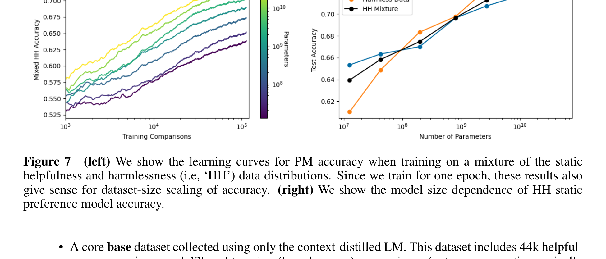

从图中可以看到，PM的准确率随着模型参数量和数据量的增加呈**对数线性增长**——模型越大、数据越多，裁判越准。

### 3. 强化学习微调（RLHF）：让模型"学会变好"

这是整个流程的核心。具体步骤：

**Step 1: 准备提示词**
- 从偏好数据中提取所有人类提问（prompt）
- 额外用大模型生成更多提示词，增加多样性
- 共使用约506k个提示词（137k人工 + 369k生成）

**Step 2: PPO训练**
- 语言模型作为RL的**策略**（policy），给定提示词生成回复
- 偏好模型作为**奖励函数**，对生成的回复打分
- 使用**PPO**（Proximal Policy Optimization）算法优化策略

**关键设计：KL惩罚**

为了防止模型"走火入魔"（生成看似高分但实际很奇怪的回复），在奖励中加入KL散度惩罚：

$$
r_{\text{total}} = r_{PM} - \lambda_{KL} D_{KL}(\pi \parallel \pi_0)
$$

其中：
- $r_{PM}$ 是偏好模型给的分数
- $\pi$ 是当前策略（正在训练的模型）
- $\pi_0$ 是初始策略（训练前的模型）
- $\lambda_{KL} = 0.001$ 是很小的惩罚系数
- $D_{KL}$ 衡量当前模型偏离初始模型的程度

这个KL惩罚的作用就像**"别偏离你原来的说话风格太远"**——防止模型为了刷高分而变得奇怪。

### 4. 在线迭代训练（Online RLHF）

论文提出了一个重要的创新：**在线迭代训练**。

传统方式是"一次性"训练：收集数据 → 训练PM → 训练RLHF → 结束。

论文的方式是**循环迭代**：
1. 用当前最好的RLHF模型去收集新的人类反馈数据
2. 把新数据和旧数据混合，训练新的PM
3. 用新PM训练新的RLHF策略
4. 重复这个过程（大约每周更新一次）

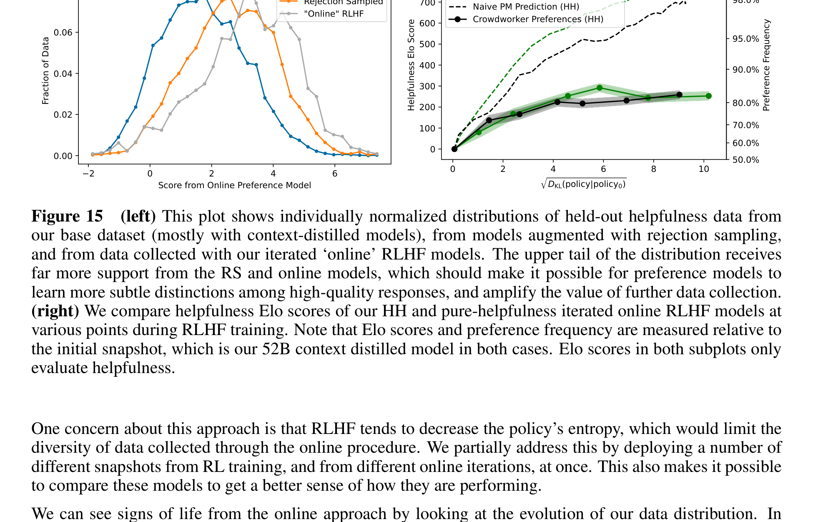

左图展示了数据质量的变化：基础数据（蓝色）→ 拒绝采样数据（橙色）→ 在线迭代数据（绿色），高质量样本的比例越来越多。这就像**让好学生去教新学生，一代比一代强**。

### 5. 有益性与无害性的张力

论文发现了一个重要现象：**有益性和无害性是两个相互冲突的目标**。

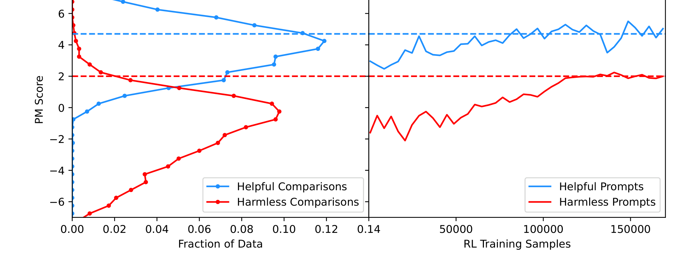

- 如果只训练有益性，模型很容易被"红队"攻破（输出有害内容）
- 如果只训练无害性，模型会变得过于保守（什么都不敢回答）
- 两者混合训练时，PM需要先判断请求类型，再决定评分策略

论文发现大模型（52B）比小模型更能同时处理好这两个目标——这再次证明了**模型规模对对齐训练的重要性**。

### RLHF训练的数值推导示例

为了帮助理解RLHF的训练过程，我们用一个简化的例子走通全流程。

#### 场景设定

假设我们有一个极简的语言模型，词汇表只有4个词，每次生成1个词作为回复。

- 初始策略 $\pi_0$ 的概率分布（对某个提示词）：

$$
\pi_0 = \begin{bmatrix} 0.25 \\ 0.25 \\ 0.25 \\ 0.25 \end{bmatrix}
$$

四个词分别是：["好的，我来帮你", "我不知道", "滚开", "让我想想"]

- 偏好模型给出的奖励分数：

$$
r_{PM} = \begin{bmatrix} 2.0 \\ 0.5 \\ -3.0 \\ 1.0 \end{bmatrix}
$$

- KL惩罚系数 $\lambda_{KL} = 0.1$（简化起见取大一点）

#### Step 1: 前向传播

当前策略 $\pi$ 生成回复，PM给出奖励。假设当前策略就是初始策略：

$$
\text{期望奖励} = \sum_i \pi_0(i) \cdot r_{PM}(i) = 0.25 \times 2.0 + 0.25 \times 0.5 + 0.25 \times (-3.0) + 0.25 \times 1.0 = 0.125
$$

#### Step 2: 计算带KL惩罚的总奖励

$$
r_{\text{total}}(i) = r_{PM}(i) - \lambda_{KL} \cdot \log\frac{\pi(i)}{\pi_0(i)}
$$

当 $\pi = \pi_0$ 时，KL项为0，所以：

$$
r_{\text{total}} = \begin{bmatrix} 2.0 \\ 0.5 \\ -3.0 \\ 1.0 \end{bmatrix}
$$

#### Step 3: 策略梯度更新

使用REINFORCE算法的简化版本，策略梯度为：

$$
\nabla_\theta J \approx \mathbb{E}_{a \sim \pi}[r_{\text{total}}(a) \cdot \nabla_\theta \log \pi(a)]
$$

对于softmax策略 $\pi(i) = \frac{e^{\theta_i}}{\sum_j e^{\theta_j}}$，梯度为：

$$
\frac{\partial \log \pi(i)}{\partial \theta_j} = \begin{cases} 1 - \pi(i) & \text{if } j = i \\ -\pi(i) & \text{if } j \neq i \end{cases}
$$

简化起见，我们直接用**奖励加权更新**的直觉版本：

$$
\theta_i^{\text{new}} = \theta_i + \eta \cdot r_{\text{total}}(i) \cdot (1 - \pi(i))
$$

取学习率 $\eta = 0.1$，初始 $\theta = [0, 0, 0, 0]$（对应均匀分布）：

$$
\theta^{\text{new}} = \begin{bmatrix} 0 \\ 0 \\ 0 \\ 0 \end{bmatrix} + 0.1 \times \begin{bmatrix} 2.0 \times 0.75 \\ 0.5 \times 0.75 \\ (-3.0) \times 0.75 \\ 1.0 \times 0.75 \end{bmatrix} = \begin{bmatrix} 0.15 \\ 0.0375 \\ -0.225 \\ 0.075 \end{bmatrix}
$$

#### Step 3.5: 参数更新后的新策略

用softmax计算新策略：

$$
\pi^{\text{new}}(i) = \frac{e^{\theta_i^{\text{new}}}}{\sum_j e^{\theta_j^{\text{new}}}}
$$

$$
e^{\theta^{\text{new}}} = \begin{bmatrix} e^{0.15} \\ e^{0.0375} \\ e^{-0.225} \\ e^{0.075} \end{bmatrix} = \begin{bmatrix} 1.162 \\ 1.038 \\ 0.799 \\ 1.078 \end{bmatrix}
$$

$$
\text{sum} = 4.077
$$

$$
\pi^{\text{new}} = \begin{bmatrix} 0.285 \\ 0.255 \\ 0.196 \\ 0.264 \end{bmatrix}
$$

#### 验证训练在起作用

| 词 | 初始概率 | 新概率 | 奖励分数 | 趋势 |
|---|---------|-------|---------|------|
| "好的，我来帮你" | 0.250 | 0.285 | +2.0 | ✓ 概率上升 |
| "我不知道" | 0.250 | 0.255 | +0.5 | ✓ 微升 |
| "滚开" | 0.250 | 0.196 | -3.0 | ✓ 概率下降 |
| "让我想想" | 0.250 | 0.264 | +1.0 | ✓ 微升 |

新的期望奖励：

$$
0.285 \times 2.0 + 0.255 \times 0.5 + 0.196 \times (-3.0) + 0.264 \times 1.0 = 0.373
$$

从 0.125 提升到 0.373——**训练在起作用！**

#### 多轮训练全景图

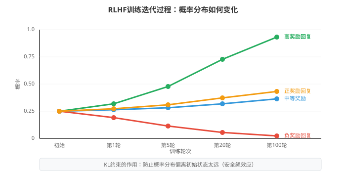

随着训练轮数增加：
- 高奖励回复的概率持续上升
- 低奖励回复的概率持续下降
- 但KL惩罚会阻止概率分布偏离太远

### 训练时 vs 部署时

RLHF训练完成后，部署时不需要偏好模型和RL组件：

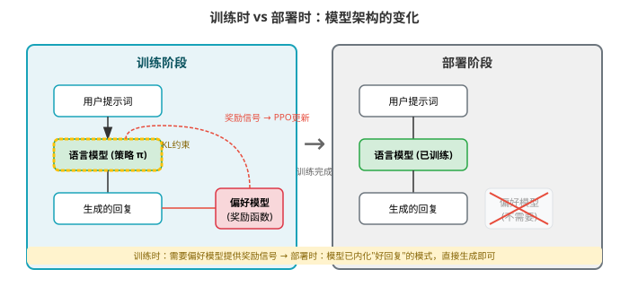

训练时需要PM提供奖励信号，部署时模型已经"内化"了好回复的模式，直接生成即可。

> **小白tips**: KL散度惩罚就像给模型系了一根"安全绳"——让它往好的方向走，但不能走太远。如果没有这根绳子，模型可能会学会一些"刷分技巧"，比如反复说"我非常乐意帮助您！"之类的高分但无用的话。这就是所谓的"奖励黑客"（Reward Hacking）现象。

## 效果怎么样？

### 对齐训练不仅不降能力，反而提升能力

这是论文最重要的发现之一：**RLHF训练对大模型来说不仅没有"对齐税"（Alignment Tax），反而有"对齐红利"（Alignment Bonus）**。

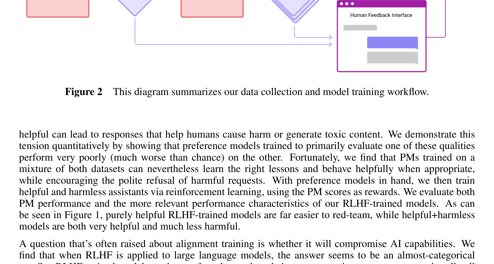

| 模型规模 | 零-shot RLHF vs 原始模型 | few-shot RLHF vs 原始模型 |
|---------|------------------------|------------------------|
| 小模型（<1B） | 性能下降 | 性能持平 |
| 中等模型（13B） | 性能提升 | 性能持平 |
| 大模型（52B） | **显著提升** | **持平或略升** |

这个发现非常重要——它打破了"对齐训练会损害模型能力"的担忧。

### 人类评估结果

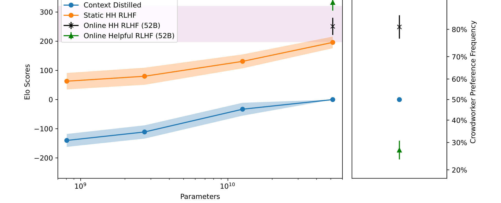

- **在线HH RLHF模型**（同时训练有益性和无害性）在人类评估中明显优于所有基线模型
- 纯有益性RLHF模型虽然更"有帮助"，但很容易被红队攻破
- HH RLHF模型在保持高有益性的同时，大幅降低了有害性

### 诚实性和偏见

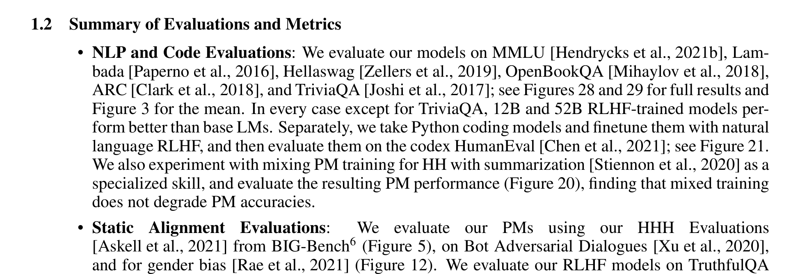

- **TruthfulQA**（诚实性评估）：RLHF训练显著提升了大模型的诚实性
- **HHH评估**（有益、诚实、无害）：偏好模型的表现甚至超过了人类平均水平（86% vs 75%）
- **情感偏见**：RLHF训练让模型对所有种族和宗教群体的情感都更正面
- **性别偏见**：RLHF模型的性别偏见与低温度的原始模型类似，没有显著改善

### RLHF鲁棒性实验

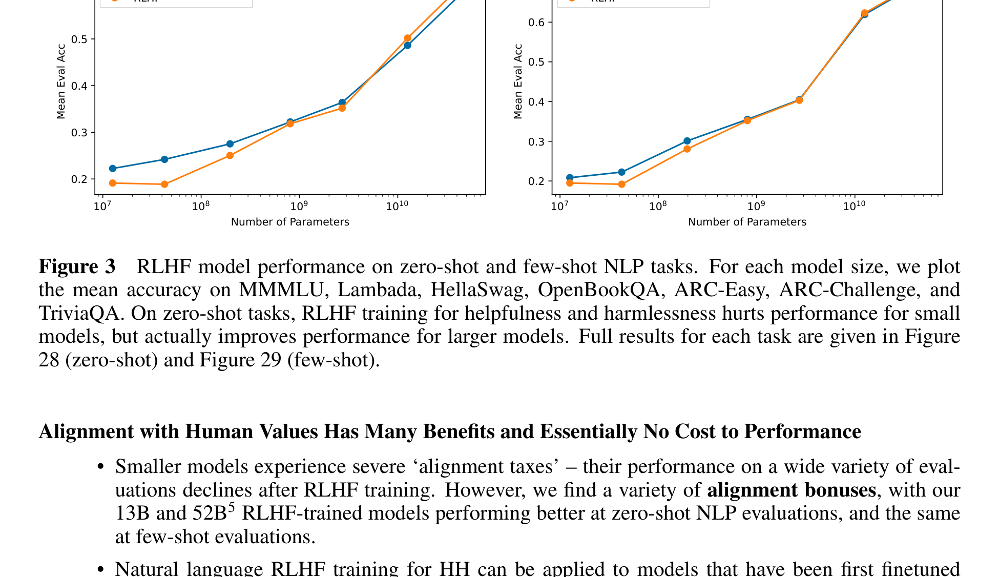

论文做了一个巧妙的鲁棒性测试：
- 把数据分成两半，分别训练两个PM（训练PM和测试PM）
- 用训练PM来训练RLHF策略，用测试PM来评估
- 结果：训练初期两个PM评分一致，但超过约150k训练样本后开始分叉——**过拟合出现了**

这说明**RLHF训练不能无限进行**，过高的奖励分数可能意味着模型在"刷分"而非真正变好。

### √KL 与奖励的线性关系

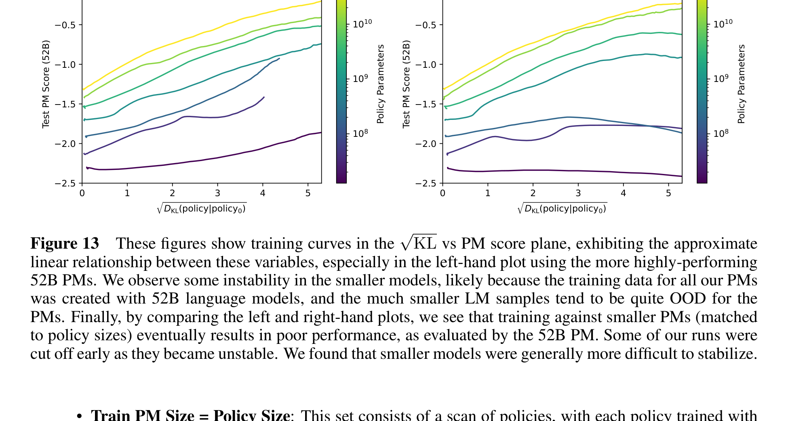

论文发现了一个有趣的经验规律：在RLHF训练的大部分阶段，**奖励与 $\sqrt{D_{KL}}$ 近似呈线性关系**：

$$
\text{Reward} \propto \sqrt{D_{KL}(\pi \parallel \pi_0)}
$$

这意味着：
1. 可以通过KL散度预测能获得多少奖励提升
2. RLHF训练本质上是在"聚焦"模型已有的能力，而非教授全新技能
3. 不同大小模型的训练曲线大致平行，说明小模型的训练结果可以预测大模型的表现

## 论文的意义和局限

**主要贡献**：

1. **建立了完整的RLHF训练流水线**：从数据收集 → 偏好建模 → RL微调 → 在线迭代，为后续ChatGPT等产品奠定了基础
2. **证明了"对齐红利"的存在**：大模型经过RLHF训练后，不仅不会变笨，反而在多数NLP任务上表现更好
3. **揭示了有益性与无害性的张力**：两个目标存在内在冲突，需要精心设计数据收集和训练策略来平衡
4. **发现了√KL-奖励线性关系**：为理解和预测RLHF训练行为提供了新的定量工具
5. **开源了HH-RLHF数据集**：推动了AI安全研究社区的发展

**局限性**：

1. **红队数据收集方式的问题**：让工人选择"更有害"的回复，导致模型只学会了"什么不该做"，没学会"该怎么优雅地拒绝"
2. **诚实性不是重点**：论文承认RLHF不是训练诚实性的最佳方法，模型仍然可能"自信地胡说八道"
3. **人类反馈的质量参差不齐**：工人与研究者的标注一致性只有约63%，低于类似工作
4. **评估方法的局限**：很多评估基于标准NLP基准，可能无法捕捉真实使用场景中的问题
5. **规模依赖性强**：小模型的RLHF效果差，意味着对齐训练需要大量计算资源

## 读后感

这篇论文是AI对齐领域的里程碑之作。它最大的价值不在于提出了某个全新算法（PPO和偏好建模在此之前已有应用），而在于**系统性地验证了RLHF在大规模语言模型上的可行性**，并回答了一个关键问题：**让模型"变好"会不会让它"变笨"？答案是否定的——至少对大模型来说不会。**

如果你只记住一件事，那就是：**RLHF = 人类偏好数据 + 偏好模型 + PPO强化学习 + KL约束**。这个公式现在驱动着几乎所有主流AI助手（ChatGPT、Claude、Gemini等）的训练流程。

对于初学者来说，这篇论文也提醒我们：AI安全不是"加个过滤器"那么简单，而是需要精心设计数据、模型和训练目标的系统工程。有益性和无害性之间的张力，恰恰反映了AI对齐的核心挑战——**我们想要的不是一个"什么都敢说"的模型，也不是一个"什么都不说"的模型，而是一个"知道什么时候该说什么"的模型**。
